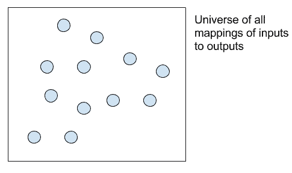
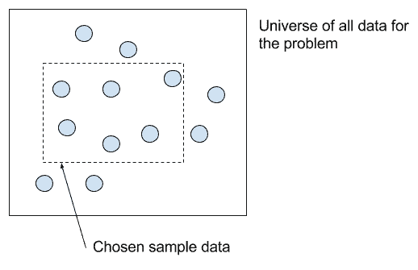
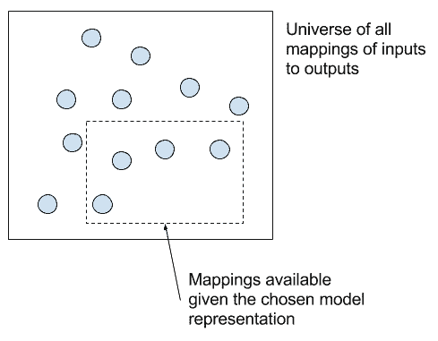
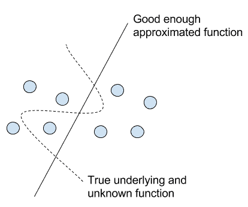

# 应用机器学习作为一个搜索问题的温和介绍

> 原文： [https://machinelearningmastery.com/applied-machine-learning-as-a-search-problem/](https://machinelearningmastery.com/applied-machine-learning-as-a-search-problem/)

应用机器学习具有挑战性，因为针对给定问题设计完美的学习系统是棘手的。

没有针对您的问题的最佳训练数据或最佳算法，只有您能发现的最佳。

考虑到给定项目可用的知识和资源，机器学习的应用最好被认为是输入到输出的最佳映射的搜索问题。

在这篇文章中，您将发现应用机器学习作为搜索问题的概念化。

阅读这篇文章后，你会知道：

*   应用机器学习是从输入到输出近似未知底层映射函数的问题。
*   诸如数据选择和算法选择之类的设计决策会缩小您最终可能选择的可能映射函数的范围。
*   将机器学习概念化为搜索有助于合理化集合的使用，算法的现场检查以及对算法学习时发生的事情的理解。

让我们开始吧。


应用机器学习作为一个搜索问题的温和介绍
照片由 [tonko43](https://www.flickr.com/photos/tonko43/5999483355/) ，保留一些权利。

## 概观

这篇文章分为5部分;他们是：

1.  函数逼近问题
2.  函数逼近作为搜索
3.  数据选择
4.  算法选择
5.  机器学习作为搜索的意义

## 函数逼近问题

应用机器学习是开发学习系统以解决特定的学习问题。

学习问题的特征在于观察包括输入数据和输出数据以及两者之间的一些未知但一致的关系。

学习系统的目标是学习输入和输出数据之间的通用映射，以便可以对从输出变量未知的域中提取的新实例进行熟练的预测。

在统计学习中，从机器学习的统计角度来看，该问题被定义为给定输入数据（ _X_ ）和相关输出数据（_的映射函数（ _f_ ）的学习。 ]_ ）。

```py
y = f(X)
```

我们有 _X_ 和 _y_ 的样本，并尽力提出近似 _f_ 的函数，例如 _fprime_ ，这样我们可以在未来给出新的例子（ _Xhat_ ）进行预测（ _yhat_ ）。

```py
yhat = fprime(Xhat)
```

因此，应用的机器学习可以被认为是函数逼近的问题。


机器学习作为从输入到输出的映射

学习的映射将是不完美的。

设计和开发学习系统的问题是学习将输入变量映射到输出变量的未知底层函数的有用近似的问题。

我们不知道函数的形式，因为如果我们这样做，我们就不需要学习系统;我们可以直接指定解决方案。

因为我们不知道真正的潜在功能，所以我们必须对其进行近似，这意味着我们不知道并且可能永远不知道学习系统与真实映射的近似程度有多接近。

## 函数逼近作为搜索

我们必须寻找对我们的目的足够好的真正基础函数的近似值。

有许多噪声源会在学习过程中引入错误，这会使过程更具挑战性，从而导致映射不太有用。例如：

*   选择学习问题的框架。
*   选择用于训练系统的观察结果。
*   选择如何准备训练数据。
*   选择预测模型的表示形式。
*   选择学习算法以使模型适合训练数据。
*   用于评估预测技能的绩效指标的选择。

还有更多。

您可以看到学习系统的开发中有许多决策点，并且事先都不知道答案。

您可以将学习问题的所有可能学习系统视为一个巨大的搜索空间，每个决策点都会缩小搜索范围。



搜索从输入到输出的所有可能映射函数的空间

例如，如果学习问题是预测花的种类，数百万可能的学习系统之一可以缩小如下：

*   选择将问题框定为预测物种类标签，例如分类。
*   选择给定物种及其相关亚种的花的测量值。
*   选择一个特定托儿所中的鲜花进行测量，以收集训练数据。
*   选择决策树模型表示，以便可以向利益相关者解释预测。
*   选择CART算法以适合决策树模型。
*   选择分类准确度来评估模型的技能。

等等。

您还可以看到，开发学习系统所涉及的许多决策可能存在自然的层次结构，每个决策都会进一步缩小我们可以构建的可能学习系统的空间。

这种缩小引入了有用的偏见，故意选择一个可能的学习系统子集而不是另一个子集，目的是更接近我们可以在实践中使用的有用映射。这种偏差既适用于问题框架的最高层，也适用于低层，例如机器学习算法或算法配置的选择。

## 数据选择

选择的学习问题框架和用于训练系统的数据是学习系统发展的一个重要杠杆。

您无权访问所有数据：即所有输入和输出对。如果你这样做，你就不需要预测模型来为新的输入观察做出输出预测。

你确实有一些历史输入 - 输出对。如果没有，您将无法获得用于训练预测模型的任何数据。

但也许你有很多数据，你只需要选择一些数据进行训练。或者，您可以随意自由生成数据，并受到生成或收集的数据和数据的挑战。

您选择对您的学习系统进行建模的数据必须充分捕获您可用数据的输入和输出数据之间的关系，以及该模型预期将来预测的数据。



从问题的所有数据的宇宙中选择训练数据

## 算法选择

您必须选择模型的表示和用于使模型适合训练数据的算法。这再次成为学习系统发展的另一个重要杠杆。



从所有算法的宇宙中选择算法来解决问题

虽然项目利益相关者对项目施加约束是很常见的，但是这种决策通常会简化为选择算法，例如模型能够解释预测，而预测又会对最终模型表示的形式施加约束。反过来你可以搜索的映射范围。



选择从输入到输出的近似映射的效果

## 机器学习作为搜索的意义

将开发学习系统作为搜索问题的概念化有助于在应用机器学习中明确许多相关问题。

本节将介绍几个。

### 迭代学习的算法

用于学习映射的算法将施加进一步的约束，并且它与所选择的算法配置一起将控制在模型适合时如何导航可能的候选映射的空间（例如，用于迭代学习的机器学习算法）。

在这里，我们可以看到通过机器学习算法从训练数据中学习的行为实际上导航了学习系统的可能映射的空间，希望从差的映射转移到更好的映射（例如爬山）。


迭代训练学习算法对数据的影响

这为优化算法在机器学习算法的核心中的作用提供了概念上的基本原理，以充分利用特定训练数据的模型表示。

### 合奏的基本原理

我们还可以看到，不同的模型表示将占据所有可能的函数映射的空间中的完全不同的位置，并且在进行预测时又具有完全不同的行为（例如，不相关的预测误差）。

这为集合方法的作用提供了概念上的理论基础，这些方法结合了来自不同但技巧娴熟的预测模型的预测。


解释组合多个最终模型的预测

### 现场检查的基本原理

具有不同表示的不同算法可以在可能的函数映射的空间中的不同位置处开始，并且将以不同方式导航空间。

如果这些算法导航的约束空间由适当的框架和良好的数据很好地指定，那么大多数算法可能会发现良好和类似的映射函数。

我们还可以看到一个好的框架和仔细选择的训练数据如何打开一个候选映射的空间，可以通过一套现代强大的机器学习算法找到。

这为在给定的机器学习问题上对一套算法进行抽查，并在显示最有希望的算法上加倍，或者选择最简约的解决方案（例如Occam的剃刀）提供了理由。

## 进一步阅读

如果您希望深入了解，本节将提供有关该主题的更多资源。

*   [第2章，机器学习](http://amzn.to/2yclAGZ)，1997。
*   [作为搜索的泛化](http://citeseerx.ist.psu.edu/viewdoc/download?doi=10.1.1.121.5764&rep=rep1&type=pdf)，1982。
*   [第1章，数据挖掘：实用机器学习工具和技术](http://amzn.to/2wvHUPq)，2016。
*   [关于算法选择，应用于组合搜索问题](https://research-repository.st-andrews.ac.uk/handle/10023/2841)，2012。
*   维基百科上的[算法选择](https://en.wikipedia.org/wiki/Algorithm_Selection)

## 摘要

在这篇文章中，您发现了应用机器学习作为搜索问题的概念化。

具体来说，你学到了：

*   应用机器学习是从输入到输出近似未知底层映射函数的问题。
*   诸如数据选择和算法选择之类的设计决策会缩小您最终可能选择的可能映射函数的范围。
*   将机器学习概念化为搜索有助于合理化集合的使用，算法的现场检查以及对算法学习时发生的事情的理解。

你有任何问题吗？
在下面的评论中提出您的问题，我会尽力回答。