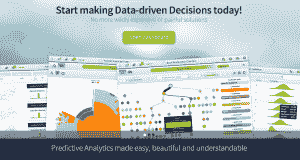
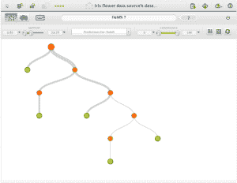
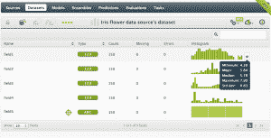

# BigML评论：发现机器学习即服务平台的聪明功能

> 原文： [https://machinelearningmastery.com/bigml-review-discover-the-clever-features-in-this-machine-learning-as-a-service-platform/](https://machinelearningmastery.com/bigml-review-discover-the-clever-features-in-this-machine-learning-as-a-service-platform/)

机器学习已经商品化为服务。这是最近的一种趋势，看起来它将像商品化存储和虚拟化一样发展成为主流。这是自然的下一步。

在本次评论中，您将了解BigML，它提供商品化的机器学习，作为业务分析师和应用程序集成的服务。

## 关于BigML

BigML由一群五人共同创立于2011年。 [Francisco Martin](http://www.linkedin.com/in/cisko) 似乎积极参与社区评论和推出内容。在撰写本文时，它是一家私人控股公司，[在2013年中期的一轮融资](https://angel.co/bigml)中获得了130万美元。我还可以看到一项名为“[方法和设备的可视化和与决策树](https://www.google.com/patents/US20130117280)进行交互，这是一个很好的迹象，表明他们正在推动这项技术的极限。

BigML和机器学习即服务的承诺

自从他们推出以来，我已经看了几次这项服务，每次我都注意到界面和服务的变化。它正在积极开发并响应用户的反馈。

该服务侧重于决策树，这是一个明智的举措。它们是一种有效的机器学习方法，领域专家可以透明地理解他们的决策。

该服务的标记行包括诸如“_高度可扩展的基于云的机器学习服务_”之类的措辞，重点关注企业及其对大数据和云计算需求的需求，并且“_预测分析变得容易，美丽而易懂_“专注于最终用户分析师制作报告和理解业务流程。

## 关于服务

该服务可用于生产模式或开发模式。开发模式是免费的，但可以完成的任务大小有限。生产模式是付费模式，并且可以在块或订阅的基础上临时购买积分。这是来自其他基于云的服务（如存储或计算服务器）的熟悉模式。

BigML交互式决策树

BigML提供了三种使用该服务的主要模式：

*   **Web界面**：一个快速响应的灵活Web用户界面。 Web界面引导分析人员完成上传数据，制作描述性或预测性模型以及评估模型或根据需要做出预测的过程。这很干净，一旦你购买了管道方法，很有意义。
*   **命令行界面**：一个名为 [bigmle​​r](https://bigml.com/bigmler) 的命令行工具，它基于服务的成熟Python API，允许比Web界面更灵活，例如选择对构建的模型做出预测本地或远程执行任务，例如交叉验证以近似模型精度。查看[完整的bigmle​​r文档](http://bigmler.readthedocs.org/en/latest/)。
*   **API** ：提供了 [RESTful API](https://bigml.com/developers) ，可以直接通过curl命令或您喜欢的编程语言中的包装器使用。在撰写本文时， [Python API](http://bigml.readthedocs.org/en/latest/) 是最成熟的，但包装也在Ruby，PHP，Java，C＃，NodeJS，Clojure，Bash（curl调用）和Objective C中提供。

## 管道流程

Web界面呈现为一系列步骤。您可以根据要查找的内容选择要放入和放出管道的位置。

*   **数据来源**：这些是正在研究的问题的原始数据。它可能是您上载的原始CSV文件，您通过URL指定的远程数据文件或指向Amazon S3的数据存储。您可以描述属性，为它们命名，并通常管理数据源的解析和呈现方式。
*   **数据集**：这些是数据源的视图，您可以将其用作构建模型的基础。数据集指定目标属性（分类中的类或回归中的输出）。数据用条形图和五个数字摘要汇总。您还可以将数据集拆分为训练，然后测试模型表现的受控评估。

BigML数据集

*   **模型**：这些是从数据集创建的决策树。决策树模型是交互式的。您可以在每个节点的模型中看到反映在训练数据中的信心和支持。您可以通过树的方式工作，并查看前面构建的规则，这是模型的巧妙和干净的表示。可以使用您喜欢的语言下载模型，可以查看其规则并提供其他可视化，例如sunburst视图。
*   **合奏**：这些是由子模型组成的模型。对于描述性模型，集合不太有用，对预测性更有用，理想情况下，从问题域的不同角度对预测组合提供更高的准确率。

BigML合奏模型

*   **预测**：模型可用于生成预测。这可以通过构建的决策树模型的分支（如决策支持时间），通过用于指定输入实例的滑块，一次一个，以及通过批量预测来提出问题，其结果可以是被下载到文件。
*   **评估**：评估表示基于数据集的模型表现的估计。如果将数据集拆分为训练和测试，则可以使用分类准确度，精度，召回等度量来估计模型对看不见的数据的能力。表现也总结在图表中。模型（合奏或其他）的表现也可以并排比较。

BigML模型评估

*   **任务**：这是使用该服务执行的任务的日志，仅从服务审计角度来看是有趣的。它可能应该在用户界面中如此突出。

流程似乎在易于使用和可配置性之间走了一些无形的界限。有一些配置选项，我无法想象分析师或初学者想要触摸（例如修剪方法）。

此外，预测和评估之间的区别也可能使初学者感到困惑。我可以想象一个更简单的界面：数据，模型预测和云中的机器人负责确定模型的稳健性并向我报告（对可以调整的所有各种事物进行n次交叉验证）和自动模型选择）。

## Web界面中的5个聪明功能

Web界面非常灵敏，并且清楚地使用现代界面设计技术。在使用Web界面时，我注意到了5个您应该了解的聪明功能。

*   **1 - 单击**：您可以一键完成有用的任务，如宏。这让我想起亚马逊的一键购买，聪明的营销。例如，您可以从选定的数据集中单击创建模型，集合或将数据集拆分为训练集和测试集。这种命名惯例渗透易用性。

BigML 1-Click Everything

*   **交互式树**：决策树是最受欢迎的，因为您可以将它们打印出来，主题专家可以很容易地理解它们。您可以毫不含糊地看到如何在域的上下文中做出决策（与不透明的神经网络和SVM不同）。使树木互动是下一步的自然过程。您可以整天使用可视化执行假设，并将其与域相关联。
*   **可下载树**：您可以使用您选择的编程语言下载模型或树本身的规则。非常聪明。可以在BigML中创建描述性或预测性模型，下载代码并将其用于您的应用程序（如网站或决策支持工具）。这很有用，我喜欢它。
*   **Sunburst View** ：模型的旭日视图提供了一种创新（至少对我而言）思考和探索决策树中开发的规则的方式。

BigML Sunburst可视化

*   **图库**：任何模型（可能是任何对象）都可以在[图库](https://bigml.com/gallery/models)中公开获取。您可以探索和使用自己开发的其他人员模型和开放数据。可以对模型进行评论，也可以出售对图库中对象的访问，这是一个引人入胜的想法。这是非常聪明且超前的时间，我喜欢它，但我担心像 [IBM的许多眼睛](http://www.manyeyes.com/software/analytics/manyeyes/)将被利用。如果它是私人的并且在组织内策划，它可能具有更多价值。

BigML模型库

## 用例

这是适度技术业务分析师和软件开发人员的服务。该服务的重点是易用性（快速制作模型）和模型透明度（使领域专家能够理解模型）。

以下是我认为BigML可能最有用的一些用例。

*   **描述性模型**：业务分析师（或某些黑客）拥有他们想要描述的复杂数据。可以构造描述性模型来解释属性和预测属性之间的关系并且发挥假设情景。这可以使用网站完成。
*   **预测模型**：业务分析师（或某些黑客）有一个复杂的问题，希望从过去的例子中预测。可以在网站上构建预测模型，并批量预测并下载为CSV文件以供分析和应用。
*   **周期性预测**：与之前的情景一样，但需要定期做出预测。可以在BigML平台上维护模型（在需要时更新），可以通过Bigmle​​r命令行界面远程调用以根据需要做出预测。
*   **集成**：该服务可以集成到脚本，内部网站或桌面应用程序中以供决策支持。这需要使用API​​，并且最好在平台上维护模型。

## 机器学习从业者

机器学习从业者可能会缺乏。没有关注模型选择或表现估计。您将无法在Web界面中找到使用交叉验证设计复杂的多次运行实验和分类准确率估算的能力。

在创建模型期间可以执行一些配置，例如，树修剪方法可以在“智能修剪”，统计修剪和无统计修剪之间变化。我只能想象聪明的修剪尝试了一堆方法并选择最好的结果树。合奏仅限于装袋，我看到很好的机会进一步抽象出来，在幕后进行提升和堆叠，阈值处理和其他方法，并展示机器人选择的最佳“合奏方法”。

我可以想象，如果我是一个坚定的核心决策树人，我会因缺乏控制或对选择的洞察而感到沮丧。

托管解决方案的好处是删除技术细节，让大型机器计算所需模型的变化，并为您选择最佳的模型。目前尚不清楚BigML中幕后的情况有多少，但可能有机会进一步隐藏这些不再需要的隐藏配置细节 - 让云中的机器人处理模型调整和选择。

这些是有意的设计选择，这是有道理的。该服务负责为问题提供“足够好”的模型，并允许您按需下载或查询该模型的托管版本。

## 快速模型

对于机器学习从业者来说，这是一个机会，那就是让事情变得非常快，例如：

*   **演示**：根据客户数据创建模型，并在视频或演示文稿中显示决策树如何工作以及如何处理数据，使他们能够根据域体验获得对模型的深入了解。使用BigML的交互式决策树而不是使用由R或scikit-learn生成的静态树，这更容易。
*   **快速模型**：你真的需要一个真正快速的模型。 BigML将创建一个可用于生成预测的树或集合。这将是一个快速而通用的过程，可能会花费脚本版本的Python API或命令行界面。比R，Weka还是scikit-learn更快？也许，如果它是在S3上托管的大型数据集（更大的数据甚至是大数据）。
*   **在线模型**：如果您正在使用Java，Python或Ruby攻击某些DSL或原型应用程序，并且您只需要一个临时或概念验证模型用于演示目的，可以创建和下载BigML模型本机代码。契约中非常方便的特征。
*   **临时集成**：与上述相同，但您可能正在使用模型需要定期更新的流数据，您可以与BigML API集成并在原型应用程序中做出预测，直到您自己构建解决方案。

毫无疑问，BigML正在指望他们的解决方案足够好，你不需要将其切换出来，并且它可能适用于大多数一般情况下的问题。

## 结论

BigML非常酷，界面很光滑，非常聪明的想法，如画廊和一键点击一切。值得尝试的是下一个小项目或侧面项目，只是为了看看建模阶段之前和之后关注建模阶段本身的情况。

但是服务中可能缺少某些东西。我不能把手指放在上面。它可能只需要拨打更多一点，无论是为初学者决定还是在云中做更多提升，或者决定它是决策树黑客并提供旋钮和拨号盘的驾驶舱。

机器学习即服务是未来：拥有应用程序复杂数据驱动核心的托管黑盒子。它对许多内部业务应用程序甚至是探索性项目都很有意义。也许这些项目不够分散。您没有在odesk上看到工作，也没有在某些数据集上查询描述性或预测性模型。这可能是因为数据是保密的，但也可能是因为问题无法与所需的系统，人员和可视化分离。

无论这些平台不是主流的原因是什么，我希望这些人能够坚持到那时为止。

## 资源

在本节中，我想为您提供一些指导，您可以在其中了解有关BigML的更多信息。

### BigML文档

BigML在[博客](http://blog.bigml.com/)上提供了很好的文档和示例，结帐：

*   [BigML功能](https://bigml.com/features)概述了BigML可以做什么，重点关注Web界面
*   [BigML API文档](https://bigml.com/developers/)名为BigML.io
*   [BigML开发人员常见问题解答](https://bigml.com/developers/faq)提供有关服务和机器学习的问题和答案

### BigML视频

BigML有一个[健康的YouTube频道](https://www.youtube.com/user/bigmlcom)，其中包括营销视频以及有用的教程视频。下面是一个很好的例子，使用BigML对Kaggle 上的 [StumbleUpon常青分类挑战进行建模和预测。](https://www.kaggle.com/c/stumbleupon)

&lt;iframe allowfullscreen="" frameborder="0" height="281" src="http://www.youtube.com/embed/eU7ayE-U1eg?feature=oembed" width="500"&gt;&lt;/iframe&gt;

### 更多关于决策树

如果您有兴趣深入了解决策树，下面是一些您可能希望了解的经典文本：

*   [分类和回归树](http://www.amazon.com/dp/0412048418?tag=inspiredalgor-20)
*   [C4.5：机器学习程序](http://www.amazon.com/dp/1558602380?tag=inspiredalgor-20)