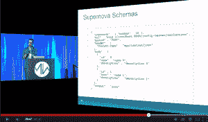

# 构建生产机器学习基础设施

> 原文： [https://machinelearningmastery.com/building-a-production-machine-learning-infrastructure/](https://machinelearningmastery.com/building-a-production-machine-learning-infrastructure/)

[Midwest.io](http://www.midwest.io/) 于2014年7月14日至15日在堪萨斯城召开。

在会议上，Josh Wills在一个题为“[从实验室到工厂：构建生产机器学习基础设施](https://www.youtube.com/watch?v=IgfRdDjLxe0)”的演讲中，就如何构建生产机器学习基础设施进行了讨论。

Josh Wills是Cloudera数据科学高级总监，正式参与Google的广告拍卖系统。

在这篇文章中，您将了解构建生产机器学习基础架构所需的知识。

&lt;iframe allowfullscreen="" frameborder="0" height="281" src="https://www.youtube.com/embed/IgfRdDjLxe0?feature=oembed" width="500"&gt;&lt;/iframe&gt;

## 数据科学

Josh称自己为数据科学家，负责对数据科学家所做的更为切实的描述。最好表达为推文：

> Data Scientist（数据科学家）：在统计学方面比任何软件工程师都要好的人，在软件工程方面比任何统计学家都要好。
> 
> - Josh Wills（@josh_wills） [2012年5月3日](https://twitter.com/josh_wills/status/198093512149958656)

他说，有两种类型的数据科学家，第一种是擅长编程的统计学家。第二个是一个聪明的软件工程师，并参与了有趣的项目。他说他自己就是第二类数据科学家。

## 学术不是工业机器学习

Josh还将学术机器学习与工业机器学习区分开来。他评论说，学术机器学习基本上是应用数学，特别是应用优化理论，这就是它在学术环境和教科书中的教学方式。

工业机器学习是不同的。

*   **系统来自算法**。在学术机器学习中，准确性优先考虑，而不是长时间运行。在工业中，速度越快越好，速度越慢就越合理，这意味着准确性往往会退居二线。
*   **目标函数很乱**。学术机器学习就是优化目标功能。不存在清洁的目标函数，并且通常存在许多需要帕累托多目标方法的冲突函数（对其中一个进行改进而不会对其他函数产生负面影响）。
*   **一切都在改变**。系统很复杂，没有人理解所有这些。
*   **了解 - 优化权衡**。提出假设，测试和改进系统的过程。理解通常比更好的结果更重要。实验推动了解。

## 工业机器学习框架

Josh评论说这是工业机器学习的黄金时代。他说这是因为可用的工具以及正在进行的共享和协作的数量。

他接触了 [Oryx](https://github.com/cloudera/oryx) ，Cloudera在Apache Hadoop之上使用他们的工业机器学习平台。

Josh在他们的博客文章“[构建风险机器学习系统](http://nerds.airbnb.com/architecting-machine-learning-system-risk/)”中谈到Airbnb分享其工业机器学习系统的细节。他发现airbnb构建一个分析模型离线存储它作为PMLL文件并上传它在生产中运行的事实。

Josh还谈到了Etsy的工业机器学习系统[猜想](https://github.com/etsy/Conjecture)，在博客文章“[猜想：Hadoop中的可伸缩机器学习与烫伤](http://codeascraft.com/2014/06/18/conjecture-scalable-machine-learning-in-hadoop-with-scalding/)”中描述。在他们的系统中，离线准备模型并以JSON格式描述，然后转换为PHP代码以在生产中运行。

Josh指出这些系统中的共性是将数据管理为键/值对。他还指出，他所谓的“分析模式”离线模型的准备以及那些用于生产或“生产模式”的模型的转变。

## 特色工程

Josh说，他目前的热情是[特色工程](http://machinelearningmastery.com/discover-feature-engineering-how-to-engineer-features-and-how-to-get-good-at-it/ "Discover Feature Engineering, How to Engineer Features and How to Get Good at It")，这是工业机器学习的黑暗艺术。实际上，他在演讲结束时发表了轻率的评论，人们喜欢最喜欢的算法，所使用的算法并不重要，并且所有的辛勤工作都在于特征工程。

Josh说，与生产模式相比，分析模型中数据的使用方式非常低效。

模型的分析准备可以离线访问星型模式，以汇集所需的所有数据。生产数据只能访问用户或观察。他的问题是如何将在线使用的线路转换为在线使用而不费力（并且目前没有使用kludges）。

他说他探索了一种失败的DSL方法，但发现了数据模型的核心问题。他说，所需要的是根据固定属性和重复属性对用户实体进行建模。用户实体存储为非规范化，并且诸如事务和日志（重复属性）之类的用户数据存储在数组中。他以JSON格式给出了一个示例，并将其称为超新星模式。

Supernova Schema
来自Josh Wills 2014年7月在Midwest.io的演讲

## 摘要

这是一个引人入胜的演讲，并提醒我们，从像Cloudera，Airbnb和Etsy那样的大型工业机器学习系统的讨论中可以学到很多东西。

您可以在这里完整地观看演讲：“[从实验室到工厂：构建生产机器学习基础设施](https://www.youtube.com/watch?v=IgfRdDjLxe0)”。

您可以在 [@josh_wills](https://twitter.com/josh_wills) 的Twitter上关注Josh，并在 [Linkedin](https://www.linkedin.com/pub/josh-wills/0/82b/138) 上查看他的背景。