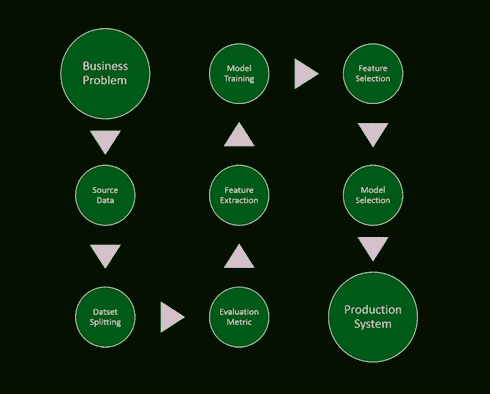
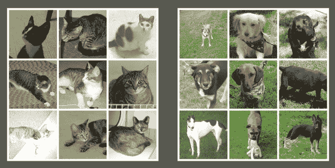
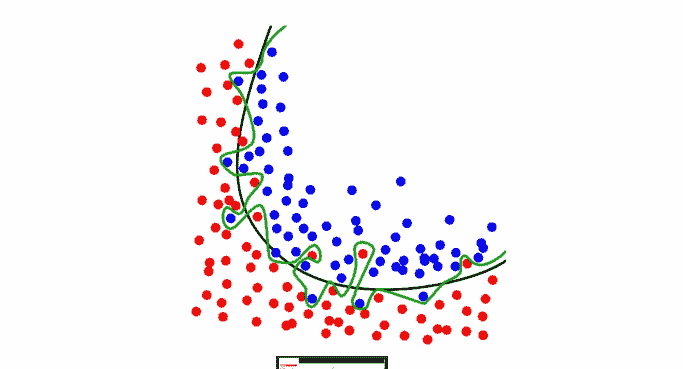

# 机器学习项目中常见的陷阱

> 原文： [https://machinelearningmastery.com/common-pitfalls-machine-learning-projects/](https://machinelearningmastery.com/common-pitfalls-machine-learning-projects/)

在最近的一次演讲中， [Ben Hamner](https://www.linkedin.com/pub/ben-hamner/12/597/987) 描述了他和他的同事在Kaggle比赛期间观察到的机器学习项目的常见缺陷。

这次演讲名为“[机器学习小鬼](https://www.youtube.com/watch?v=tleeC-KlsKA)”，于2014年2月在Strata 的[上发表。](http://strataconf.com/strata2014/public/schedule/detail/32168)

在这篇文章中，我们来看看Ben的演讲中的陷阱，它们的样子以及如何避免它们。

## 机器学习过程

在演讲的早期，Ben介绍了端到端地处理机器学习问题的过程。

机器学习过程
取自Ben Hamner的“机器学习小鬼”

此快照包括9个步骤，如下所示：

1.  从业务问题开始
2.  来源数据
3.  拆分数据
4.  选择评估指标
5.  执行特征提取
6.  模特训练
7.  特征选择
8.  型号选择
9.  生产系统

他评论说，这个过程是迭代的而不是线性的。

他还评论说，这个过程中的每一步都可能出错，导致整个项目脱轨。

## 辨别狗和猫

Ben提出了一个案例研究问题，用于建造一个自动猫门，可以让猫进来并让狗出门。这是一个有启发性的例子，因为它涉及到处理数据问题时的一些关键问题。

辨别狗和猫
取自Ben Hamner的“机器学习小鬼”

### 样本量

这个例子的第一个重要内容是他根据数据样本大小研究了模型的准确性，并表明更多的样本与更高的准确性相关。

然后他添加了更多数据，直到准确度趋于平稳。这是一个很好的例子，可以帮助您了解系统对样本大小的敏感度并进行相应调整。

### 错误的问题

这个例子的第二个很大的好处就是系统失败了，它让附近的所有猫都吃掉了。

这是一个聪明的例子，强调理解需要解决的问题的约束的重要性，而不是你想要解决的问题。

## 机器学习项目中的陷阱

在继续研究机器学习问题时，Ben继续讨论了四个常见的陷阱。

虽然这些问题很常见，但他指出可以相对容易地识别和解决这些问题。

过拟合
取自Ben Hamner的“机器学习小鬼”

*   **数据泄漏**：利用生产系统无法访问的模型中的数据的问题。这在时间序列问题中尤为常见。也可能发生系统ID等可能表示类标签的数据。运行模型并仔细查看有助于模型成功的属性。理智检查并考虑是否有意义。 （查看参考文献“[数据挖掘漏洞](http://dstillery.com/wp-content/uploads/2014/05/Leakage-in-Data-Mining-Formulation-Detection-and-Avoidance.pdf)”PDF）
*   **过拟合**：过于紧密地对训练数据建模，使得模型还包括模型中的噪声。结果是推广能力差。这在更高维度中变得更成问题，具有更复杂的类边界。
*   **数据采样和拆分**：与数据泄漏有关，您需要非常小心，训练/测试/验证集确实是独立的样本。时间序列问题需要大量的思考和工作，以确保您可以按时间顺序回复数据并验证模型的准确性。
*   **数据质量**：检查数据的一致性。 Ben给出了一些飞行数据的例子，其中一些飞机在起飞前着陆。需要识别和明确处理不一致，重复和损坏的数据。它可以直接损害建模问题和模型推广的能力。

## 摘要

Ben的演讲“[机器学习小精灵](https://www.youtube.com/watch?v=tleeC-KlsKA)”是一个快速而实用的演讲。

您将在我们在处理数据问题时容易受到的常见陷阱中获得有用的速成课程。

&lt;iframe allowfullscreen="" frameborder="0" height="281" src="https://www.youtube.com/embed/tleeC-KlsKA?feature=oembed" width="500"&gt;&lt;/iframe&gt;