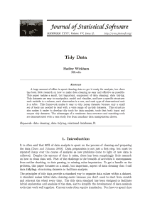

# 数据清理：将凌乱的数据转换为整洁的数据

> 原文： [https://machinelearningmastery.com/data-cleaning-turn-messy-data-into-tidy-data/](https://machinelearningmastery.com/data-cleaning-turn-messy-data-into-tidy-data/)

数据准备很困难，因为这个过程不客观，或者至少它没有这种感觉。诸如“_ 之类的问题，描述问题的最佳数据形式是什么？_ “不客观。您必须从您想要解决的问题的角度思考，并通过您的管道尝试一些不同的表示。

[Hadley Wickham](http://had.co.nz) 是莱斯大学的[兼职教授](http://www.linkedin.com/pub/hadley-wickham/13/9b6/31)和首席科学家以及 [RStudio](https://www.rstudio.com/) ，他对这个问题非常感兴趣。他撰写了一些最受欢迎的 R 软件包，用于组织和呈现您的数据，例如 reshape，plyr 和 ggplot2。在他的期刊文章 [Tidy Data](http://vita.had.co.nz/papers/tidy-data.pdf) 中，Wickham 展示了他对数据清理的看法，并通过整洁的数据来定义他的意思。

Tidy Data，照片由 [Andrew King](https://www.flickr.com/photos/watt_dabney/5514730517) 拍摄

## 数据清理

大量的数据分析时间用于[数据清理和准备数据](http://en.wikipedia.org/wiki/Data_cleansing)，高达 80％的时间。威克姆指出，这不是一次性的过程，它是迭代的，因为你在每次连续传递中更深入地理解问题。目标是构建数据以便于您计划执行的数据分析。

## 整洁的数据

Wickham 的想法充分利用了关系数据库的思想和计算机科学的数据库规范化，尽管他的受众是统计学家和数据分析师。他从定义术语开始，建议谈论行和列不够丰富：

*   数据是给定类型的值的集合
*   每个值都属于一个变量
*   每个变量都属于一个观察
*   观察是单位的变量（如对象或事件）。

变量是列，观察是行，观察类型是表。传统上，Wickham 将此与关系数据库理论中的第三范式相关联。他还将变量的类型描述为固定和测量，并建议在表中测量之前组织固定。

*   **固定变量**：一个变量，它是实验设计的一部分，在实验开始之前就已知（如人口统计学）
*   **测量变量**：在研究中测量的变量。

整洁数据的目标是将数据（语义）的含义映射到数据结构上。

## 工作的例子

Wickham 说真实数据集违反了整洁数据的原则。他描述了 5 个常见问题：

*   列标题是值，而不是变量名
*   多个变量存储在一列中
*   变量存储在行和列中
*   多种类型的观察单元存储在同一个表中
*   单个观察单元存储在多个表中

然后他继续提供每个问题的工作实例。他提供了每个问题的样本真实世界数据，并演示了修复它的过程，使其整洁。

这些例子非常有启发性，非常值得单独阅读这些工作示例的论文。他接着提供了一份更大的案例研究，其中包含墨西哥的死亡率数据。

Hadley Wickham 提供的整洁数据

## 整洁的数据工具

只有在数据整洁之后才对数据分析有用。整洁的数据使用专为整洁数据设计的工具轻松执行数据分析任务：

*   **操纵**：可变操作，如聚合，过滤，重新排序，转换和排序。
*   **可视化**：使用图形和图表汇总数据以进行探索和展示。
*   **建模**：这是整洁数据的驱动灵感，建模就是我们要做的。

Wickham 小心地指出，整洁的数据只是数据清理过程的一部分。整洁数据的其他区域包括解析变量类型（日期和数字），处理缺失值，字符编码，拼写错误和异常值。

他评论说，这项工作是基于他自己的咨询和教学经验，而且他的经验是相当可观的，因为他的 R 套餐是下载最多的。

## 资源

Wickham 似乎在 2011 年发布了这些想法。您可以在题为 [Timey Data on Vimeo](http://vimeo.com/33727555) 和[审查幻灯片](http://stat405.had.co.nz/lectures/18-tidy-data.pdf)（PDF）的演示文稿中观看类似想法的演示。

&lt;iframe allowfullscreen="" frameborder="0" height="281" src="https://www.youtube.com/embed/TaxJwC_MP9Q?feature=oembed" width="500"&gt;&lt;/iframe&gt;

Wickam 还在 2011 年就＃HTG0 工程数据分析（使用 R 和 ggplot2）提出了相同的想法。我也建议看这个演讲。他强调了特定领域语言在这项工作中的重要性，如 ggplot2（图形语法）等。他还强调了使用编程语言进行这项工作（而不是 excel）来获得透明度，可重复性和自动化等属性的重要性。使用相同的死亡率案例研究。

Wickam 在他的论文中提到的一些你可能想要研究的好书包括：

*   [数据库管理的关系模型：第 2 版](http://www.amazon.com/dp/0201141922?tag=inspiredalgor-20)关于关系数据库理论和数据规范化。
*   [探索性数据挖掘和数据清理](http://www.amazon.com/dp/0471268518?tag=inspiredalgor-20)关于数据清理和数据准备的最佳实践。
*   [图形语法](http://www.amazon.com/dp/0387245448?tag=inspiredalgor-20)关于 R 和 python 图表库 ggplot 上使用的现在着名的图形语法。
*   [Lattice：R 的多变量数据可视化（使用 R！）](http://www.amazon.com/dp/0387759689?tag=inspiredalgor-20)在 Lattice R 软件包上绘制数据图表。