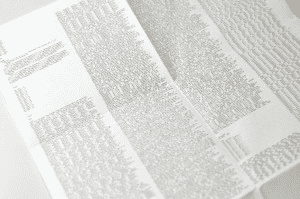
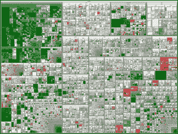

# 如何为机器学习准备数据

> 原文： [https://machinelearningmastery.com/how-to-prepare-data-for-machine-learning/](https://machinelearningmastery.com/how-to-prepare-data-for-machine-learning/)

机器学习算法从数据中学习。您需要为要解决的问题提供正确的数据至关重要。即使您拥有良好的数据，也需要确保它具有有用的规模，格式，甚至包含有意义的功能。

在这篇文章中，您将学习如何为机器学习算法准备数据。这是一个很大的主题，您将涵盖必需品。

大量数据
照片归属于 [cibomahto](http://www.flickr.com/photos/cibomahto/4099422263/sizes/l/) ，部分版权所有

## 数据准备过程

您处理数据的纪律越严格，您可能会获得更一致和更好的结果。为机器学习算法准备数据的过程可以分为三个步骤：

*   **第 1 步**：选择数据
*   **第 2 步**：预处理数据
*   **步骤 3** ：变换数据

您可以以线性方式遵循此过程，但很可能是使用多个循环进行迭代。

## 第 1 步：选择数据

此步骤涉及选择要使用的所有可用数据的子集。总是强烈希望包含所有可用的数据，“更多更好”的格言将成立。这可能是也可能不是。

您需要考虑实际需要哪些数据来解决您正在处理的问题。对您需要的数据做一些假设，并小心记录这些假设，以便您可以在以后需要时进行测试。

以下是一些有助于您思考此过程的问题：

*   您可获得的数据范围是多少？例如，通过时间，数据库表，连接系统。确保您清楚地了解可以使用的所有内容。
*   您希望哪些数据不可用？例如，未记录或无法记录的数据。您可以导出或模拟此数据。
*   您需要哪些数据才能解决问题？排除数据几乎总是比包含数据更容易。记下您排除的数据以及原因。

它只是在小问题中，比如已经为您选择了数据的竞赛或玩具数据集。

## 第 2 步：预处理数据

选择数据后，您需要考虑如何使用数据。此预处理步骤是将所选数据转换为可以使用的表单。

三个常见的数据预处理步骤是格式化，清理和采样：

*   **格式化**：您选择的数据可能不是适合您使用的格式。数据可能位于关系数据库中，您希望它位于平面文件中，或者数据可能采用专有文件格式，您希望它位于关系数据库或文本文件中。
*   **清洁**：清洁数据是删除或修复缺失数据。可能存在不完整的数据实例，并且不包含您认为解决问题所需的数据。可能需要删除这些实例。此外，某些属性中可能存在敏感信息，这些属性可能需要完全匿名或从数据中删除。
*   **采样**：可能存在的选择数据远远多于您需要使用的数据。更多数据可能导致算法运行时间更长，计算和内存需求更大。在考虑整个数据集之前，您可以采用所选数据的较小代表性样本，这样可以更快地探索和原型化解决方案。

您在数据上使用的机器学习工具很可能会影响您需要执行的预处理。您可能会重新访问此步骤。

这么多数据
照片归功于 [Marc_Smith](http://www.flickr.com/photos/marc_smith/1473557291/sizes/l/) ，保留一些权利

## 第 3 步：转换数据

最后一步是转换过程数据。您正在使用的特定算法和问题域的知识将影响此步骤，当您处理问题时，您很可能不得不重新审视预处理数据的不同转换。

三种常见的数据转换是缩放，属性分解和属性聚合。此步骤也称为特征工程。

*   **缩放**：预处理数据可能包含各种数量的混合尺度的属性，如美元，千克和销售量。许多机器学习方法（如数据属性）具有相同的比例，例如 0 到 1 之间的最小值和给定特征的最大值。考虑您可能需要执行的任何功能扩展。
*   **分解**：可能存在表示复杂概念的特征，当分成组成部分时，这些特征可能对机器学习方法更有用。一个例子是可能具有日期和时间组件的日期，而日期和时间组件又可以进一步拆分。也许只有一天中的小时与正在解决的问题相关。考虑您可以执行哪些功能分解。
*   **聚合**：可能有一些功能可以聚合到一个功能中，这对您尝试解决的问题更有意义。例如，每次客户登录系统时可能存在数据实例，该系统可以聚合为登录数的计数，从而允许丢弃其他实例。考虑哪种类型的功能聚合可以执行。

您可以花费大量时间从数据中获取工程特性，这对算法的表现非常有益。从小做起，以你学到的技能为基础。

## 摘要

在这篇文章中，您了解了机器学习数据准备的本质。您在每个步骤中发现了数据准备和策略的三步框架：

*   **步骤 1：数据选择**考虑可用的数据，缺少的数据以及可以删除的数据。
*   **步骤 2：数据预处理**通过格式化，清理和采样来组织您选择的数据。
*   **步骤 3：数据转换**通过使用缩放，属性分解和属性聚合的工程特征，转换为机器学习做好准备的预处理数据。

数据准备是一个很大的主题，可能涉及大量的迭代，探索和分析。擅长数据准备将使您成为机器学习的大师。目前，在准备数据时只考虑本文中提出的问题，并始终寻找更清晰的方式来表示您试图解决的问题。

## 资源

如果您希望深入了解此主题，可以在以下资源中了解更多信息。

*   [从数据挖掘到数据库中的知识发现](http://scholar.google.com/scholar?q=From+Data+Mining+to+Knowledge+Discovery+in+Databases)，1996
*   [使用开源工具进行数据分析](http://www.amazon.com/dp/0596802358?tag=inspiredalgor-20)（会员链接），第 1 部分
*   [黑客机器学习](http://www.amazon.com/dp/1449303714?tag=inspiredalgor-20)（会员链接），第 2 章：数据探索
*   [数据挖掘：实用机器学习工具和技术](http://www.amazon.com/dp/0123748569?tag=inspiredalgor-20)（会员链接），第 7 章：转换：设计输入和输出

您是否有一些数据准备过程提示和技巧。请留下评论并分享您的经验。