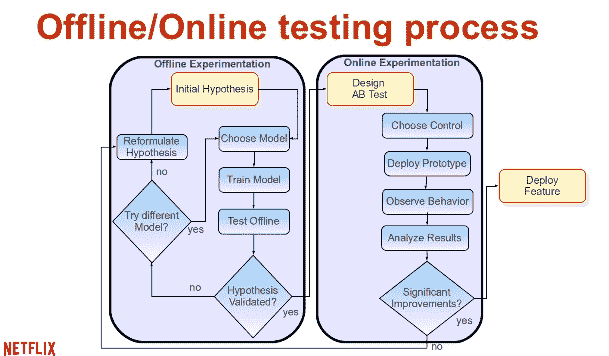

# 建立机器学习系统的经验教训

> 原文： [https://machinelearningmastery.com/lessons-learned-building-machine-learning-systems/](https://machinelearningmastery.com/lessons-learned-building-machine-learning-systems/)

在 [MLConf](%20http://mlconf.com/) 最近的一次演讲中， [Xavier Amatriain](https://www.linkedin.com/in/xamatriain) 描述了他在Netflix的研究/工程经理建立机器学习系统时学到的10个课程。

在这里，您将从他的演讲和幻灯片中总结发现这10节课。

建筑机器学习系统的经验教训摘自 [Xavier的演讲](https://www.youtube.com/watch?v=WdzWPuazLA8)

## 10经验教训

Xavier提出的10个课程可归纳如下：

1.  更多数据与/和更好的模型
2.  您可能不需要所有大数据
3.  更复杂的模型不能改善事物的事实并不意味着你不需要
4.  要深思熟虑的训练数据
5.  学会处理（诅咒）演示偏见
6.  UI是算法唯一最重要的通信渠道：用户
7.  数据和模型都很棒。你知道什么更好吗？正确的评估方法
8.  分发算法很重要，但知道在哪个级别执行它更为重要
9.  选择你的超参数是明智的，这是值得的
10.  有一些你可以离线做的事情，有些东西你不能......而且两者之间的所有东西都近在咫尺

我们将依次查看每个帖子的其余部分。

## 1.更多数据与更好的模型

泽维尔质疑引用的“_更多数据胜过更好的模型_”。我指向 [Anand Rajaraman的](https://www.linkedin.com/in/anandrajaraman)帖子“[更多数据通常胜过更好的算法](http://anand.typepad.com/datawocky/2008/03/more-data-usual.html)”，可以用这句话来概括：

> 总而言之，如果您的资源有限，请添加更多数据，而不是微调机器学习算法的权重。

他还指出 [Novig 2009年与Facebook工程部就更多数据与更好的算法进行的谈话](http://machinelearningmastery.com/hands-on-big-data-by-peter-norvig/ "Hands on Big Data by Peter Norvig")。

然后，他指出了一篇论文“[推荐新电影：甚至一些评级比元数据更有价值](http://anand.typepad.com/datawocky/2008/03/more-data-usual.html)”，其中明确指出，较少数据具有高预测性，而更多数据则不是。

它不是，也不是。您需要更多数据和更好的算法。

## 2.您可能不需要所有大数据

在本课中，他指出，仅仅因为你拥有大数据并不意味着你应该使用它。

他评论说，大数据样本可以提供良好的结果，更智能的采样（如分层或平衡采样）可以带来更好的结果。

## 3.复杂数据可能需要复杂的模型

下一课是关于[特征工程](http://machinelearningmastery.com/discover-feature-engineering-how-to-engineer-features-and-how-to-get-good-at-it/ "Discover Feature Engineering, How to Engineer Features and How to Get Good at It")的一个微妙但重要的提醒。

他评论说，为线性模型添加更复杂的特征可能不会显示出改进。相反，使用具有简单特征的复杂模型也可能不会带来改进。

他的观点是，有时需要复杂的模型来模拟复杂的特征。

我还要指出，复杂的特征可以分解为简单的特征，供简单的线性模型使用。

## 4.考虑你的训练数据

Xavier评论了对用户行为数据进行非规范化时可能存在的困难。他指出了选择正面和负面案例的问题，在对问题进行建模之前，必须先考虑在哪里绘制线条。这是一个数据表示问题，对您可以实现的结果产生巨大影响。

我建议你为许多这样的可能线路产生想法并测试它们，或者最有希望的。

他还提醒说，如果您在离线实验中看到了很好的结果，那么您应该检查旅行时间 - 预测决策是否使用了样本信息，例如包含用户未来行为的摘要。

## 5.学会处理表达偏见

第五课是关于向用户呈现的所有可能选择没有统一概率的问题。

用户界面和人类用户行为影响将选择呈现项目的概率。那些预测但未呈现的项目可能没有失败，也不应该这样建模。

这是一个复杂的课程，需要对点击行为进行建模，以便梳理模型预测的实际表现。

## 6\. UI＆lt; =＆gt;通过用户的算法

与第5课相关，这是观察到建模算法和用户界面紧密耦合。

对用户界面的更改可能需要更改算法。

## 7.使用正确的评估方法

Xavier概述了所使用的在线离线测试过程。

离线在线训练流程
摘自 [Xavier的演讲](http://www.slideshare.net/xamat/10-lessons-learned-from-building-machine-learning-systems)

该图显示了离线模型的反向测试，以测试假设，并在线进行A / B测试验证这些结果。这是一张有价值的幻灯片。

他指出，模型可以针对短期目标（如点击或手表）进行优化，但用户保留是一个真正的目标，称为整体评估标准。

他提醒我们尽可能使用长期指标，只考虑长期指标。

与他们的离线在线方法相关，Xavier评论了将离线指标与在线A / B测试相关联的公开问题。

## 8.选择正确的级别

他指出了三个级别，可以划分给定的实验以测试假设，并且每个级别都有不同的要求。

*   人口子集
*   超参数的组合
*   训练数据的子集

谨慎选择。

## 9.选择你的超参数是明智的，这是值得的

Xavier警告说，在调整模型时选择正确的指标非常重要。但他也提到包括模型复杂性在内的东西也是一个重要问题。

除了网格或随机参数搜索之外，Xavier还提醒我们查看可以减少搜索时间的概率方法。

## 10.离线，在线和近线

最后的课程告诫要花时间考虑何时需要计算模型的元素并尽可能早地计算这些元素。他指出，除了离线和在线计算之外，你可以近距离接近（他称之为近线）。

## 摘要

这是一套很棒的课程，可以应用于您自己的建模。

您可以在这里查看Xavier的幻灯片：“从建筑机器学习系统中学到的10个经验教训”

&lt;iframe allowfullscreen="" frameborder="0" height="356" marginheight="0" marginwidth="0" scrolling="no" src="https://www.slideshare.net/slideshow/embed_code/41571741" style="border:1px solid #CCC; border-width:1px; margin-bottom:5px; max-width: 100%;" width="427"&gt;&lt;/iframe&gt;

**[10 Lessons Learned from Building Machine Learning Systems](https://www.slideshare.net/xamat/10-lessons-learned-from-building-machine-learning-systems "10 Lessons Learned from Building Machine Learning Systems")** from **[Xavier Amatriain](http://www.slideshare.net/xamat)**

Xavier的演示文稿被记录下来，您可以在这里观看整个内容：“ [Xavier Amatriain，算法工程总监，Netflix @ MLconf SF](https://www.youtube.com/watch?v=WdzWPuazLA8) ”

&lt;iframe allowfullscreen="" frameborder="0" height="281" src="https://www.youtube.com/embed/WdzWPuazLA8?feature=oembed" width="500"&gt;&lt;/iframe&gt;