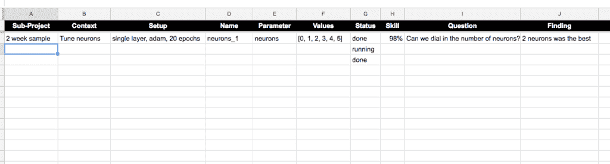

# 如何系统地规划和运行机器学习实验

> 原文： [https://machinelearningmastery.com/plan-run-machine-learning-experiments-systematically/](https://machinelearningmastery.com/plan-run-machine-learning-experiments-systematically/)

机器学习实验可能需要很长时间。在某些情况下，小时，天，甚至几周。

这为您提供了大量时间来思考和规划要执行的其他实验。

此外，平均应用的机器学习项目可能需要数十到数百个离散实验，以便找到提供良好或良好表现的数据准备模型和模型配置。

实验的抽象性质意味着您需要仔细计划和管理您运行的实验的顺序和类型。

你需要系统化。

在这篇文章中，您将发现一种计划和管理机器学习实验的简单方法。

通过这种方法，您将能够：

*   随时掌握项目中最重要的问题和发现。
*   跟踪您已完成并希望运行的实验。
*   放大提供最佳表现的数据准备，模型和模型配置。

让我们潜入。

如何系统地规划和运行机器学习实验
照 [Qfamily](https://www.flickr.com/photos/dasqfamily/6014184529/) ，保留一些权利。

## 数以百计的实验混乱

我喜欢一夜之间进行实验。大量的实验。

这样，当我醒来时，我可以查看结果，更新我的工作（以及不工作的）的想法，并启动下一轮实验，然后花一些时间分析结果。

我讨厌浪费时间。

考虑到我所拥有的时间和资源，我讨厌运行不会让我更接近找到最熟练模型的目标的实验。

很容易忘记你所处的位置。特别是在您有数百个实验的结果，分析和发现之后。

对实验的管理不善会导致以下情况：

*   你正在看实验。
*   您正试图在当前批次完成后立即提出好的实验想法。
*   您运行之前已经运行过的实验。

你永远不想在任何这些情况下！

如果你在游戏中，那么：

*   您确切地知道您一目了然地进行了哪些实验以及结果是什么。
*   您有很长的实验列表，按预期收益排序。
*   你有时间深入研究结果分析，并想出新的和疯狂的想法来尝试。

但是，我们如何才能在数百个实验中保持领先地位？

## 系统地设计和运行实验

我发现的一种方法是帮助我系统地进行项目实验，就是使用电子表格。

管理您已完成的，正在运行的实验，以及您希望在电子表格中运行的实验。

它简单而有效。

### 简单

这很简单，我或任何人都可以从任何地方访问它，看看我们在哪里。

我使用Google文档来托管电子表格。

没有代码。没有笔记本。没有华丽的网络应用程序。

只是一个电子表格。

### 有效

这是有效的，因为它只包含每个实验一行所需的信息，以及每个信息的一列，以跟踪实验。

完成的实验可以与计划的实验分开。

只设置和运行计划中的实验，并且它们的顺序确保首先运行最重要的实验。

您会惊讶于这种简单的方法可以节省您的时间并让您深入思考您的项目。

## 示例电子表格

我们来看一个例子。

我们可以设想一个包含以下列的电子表格。

这些只是我上一个项目的一个例子。我建议根据自己的需要调整这些。

*   **子项目**：子项目可能是您正在探索的一组想法，技术，数据准备等。
*   **上下文**：上下文可能是特定目标，例如击败基线，调整，诊断等。
*   **设置**：设置是实验的固定配置。
*   **名称**：名称是唯一标识符，也许是脚本的文件名。
*   **参数**：参数是实验中变化或查看的内容。
*   **值**：该值是实验中正在探索的参数的值。
*   **状态**：状态是实验的状态，例如计划，正在运行或已完成。
*   **技能**：该技能是对项目真正重要的北极指标，如准确率或错误。
*   **问题**：问题是该实验试图解决的激励性问题。
*   **发现**：该发现是实验结果的一行摘要，即问题的答案。

为了具体说明，下面是Google Doc电子表格的屏幕截图，其中包含这些列标题和一个人为的例子。

系统实验记录

我不能说这种方法花了多少时间拯救了我。并且在追求获得最佳结果时被证明是错误的假设数量。

事实上，我发现深度学习方法通​​常对假设和默认值非常不利。在设计实验时请记住这一点！

## 充分利用您的实验

以下是一些技巧，可以帮助您在项目中充分利用这种简单的方法。

*   **头脑风暴**：花时间经常审查发现并列出新问题和实验来回答这些问题。
*   **挑战**：挑战假设并挑战先前的发现。扮演科学家并设计可能会伪造您的发现或期望的实验。
*   **子项目**：考虑使用子项目来组织您的调查，您可以跟踪线索或调查特定方法。
*   **实验顺序**：使用行顺序作为优先级，以确保首先运行最重要的实验。
*   **深入分析**：将结果和汇总结果的更深入分析保存到另一份文件中;电子表格不是地方。
*   **实验类型**：不要害怕混入不同的实验类型，如网格搜索，抽样检查和模型诊断。

你会知道这种方法在以下情况下运作良好：

*   您正在搜索API文档和论文，以获取更多有关事物的想法。
*   排队的实验远远多于运行它们的资源。
*   你正在认真考虑雇用更多的EC2实例。

## 摘要

在这篇文章中，您了解了如何有效地管理已运行，正在运行以及您希望在电子表格中运行的数百个实验。

您发现一个简单的电子表格可以帮助您：

*   跟踪您运行的实验和发现的内容。
*   跟踪您想要运行的实验以及他们将回答的问题。
*   为您的预测建模问题放大最有效的数据准备，模型和模型配置。

您对此方法有任何疑问吗？你自己做过类似的事吗？
请在下面的评论中告诉我。