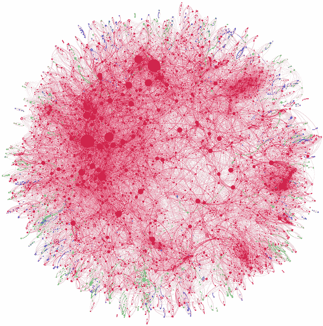

# 使用探索性数据分析了解您的问题并获得更好的结果

> 原文： [https://machinelearningmastery.com/understand-problem-get-better-results-using-exploratory-data-analysis/](https://machinelearningmastery.com/understand-problem-get-better-results-using-exploratory-data-analysis/)

您经常从应用机器学习中的问题跳到问题，并且需要快速掌握新数据集。

可以用来快速建立与新数据问题的关系的经典和未充分利用的方法是**探索性数据分析**。

在这篇文章中，您将发现探索性数据分析（EDA），您可以使用的技术和策略，以及为什么您应该在下一个问题上执行EDA。

探索性数据分析
摄影： [Andy Lamb](https://www.flickr.com/photos/speedoflife/8273922515/) ，保留一些权利

## 与数据建立关系

经典统计的过程是检验已经存在的关于该问题的假设。

这是通过拟合特定模型并演示数据中的特定关系来完成的。这是一种有效的方法，但它假设您已经对该问题有假设，您已经了解了数据。应用机器学习中很少出现这种情况。

在对数据建模并测试假设之前，您需要与数据建立关系。您可以通过花时间**总结**，**绘制**和**审查来自域的**实际真实数据来建立这种关系。

建模前的这种分析方法称为探索性数据分析。

在预先花时间处理数据时，您可以建立对数据格式，值和关系的直觉，这有助于稍后解释观察和建模结果。

它被称为探索性数据分析，因为您**正在探索您对数据**的理解，建立直觉，了解生成它的基础过程如何工作，并激发您可以用作建模基础的问题和想法。

该过程可用于对数据进行健全性检查，识别异常值并提出处理它们的具体策略。花时间处理数据时，您可以发现可能表示数据记录过程中出现故障的值中的损坏。

## 探索性数据分析的起源

探索性数据分析由贝尔实验室的 [John Tukey](http://en.wikipedia.org/wiki/John_Tukey) 开发，作为在开发关于数据的假设之前系统地使用统计工具的方法。它是“_验证数据分析_”的替代或相反方法。

该过程的开创性描述在Tukey的1977年书[探索性数据分析](http://www.amazon.com/dp/0201076160?tag=inspiredalgor-20)中。

目的是了解问题以产生可测试的假设。因此，图表和汇总统计数据等结果仅供您改善的理解，而不是为了向一般受众展示数据中的关系。这为该过程提供了敏捷的味道。

[S语言](http://en.wikipedia.org/wiki/S_(programming_language))是在同一个实验室开发的，并被用作EDA的工具。使用脚本生成数据摘要和视图是该过程的自然和有意的契合。

维基百科提供了一个很好的 [EDA目标的简短列表](http://en.wikipedia.org/wiki/Exploratory_data_analysis)：

*   建议关于观察现象的原因的假设
*   评估统计推断将基于的假设
*   支持选择适当的统计工具和技术
*   为通过调查或实验进一步收集数据提供依据

## 探索性数据分析技术

探索性数据分析通常使用代表性的数据样本进行。您不需要使用所有可用数据，也不需要使用大数据基础架构。

花时间处理原始数据。

从眼球数字表开始是明智的。浏览表格可以快速突出显示每个数据属性的形式，明显的变态和值中的大型大纲，并开始建议候选关系以探索属性。做笔记。

可以使用简单的单变量和多变量方法来提供数据视图。

例如，我认为必须具备的五种方法是：

*   [五个数字摘要](http://en.wikipedia.org/wiki/Five-number_summary)（平均值/中位数，最小值，最大值，q1，q3）
*   [直方图](http://en.wikipedia.org/wiki/Histogram)图
*   [折线图](http://en.wikipedia.org/wiki/Line_chart)
*   [盒子和晶须图](http://en.wikipedia.org/wiki/Box_plot)
*   成对[散点图](http://en.wikipedia.org/wiki/Scatter_plot)（散点图矩阵）

除摘要外，还要查看数据的转换和数据的重新缩放。清除可以描述的有趣结构。

做笔记。记下很多笔记。

询问很多关于数据的问题，例如：

*   你看到了什么价值观？
*   您看到了哪些发行版？
*   你看到什么关系？
*   您认为哪些关系可能有益于预测问题？
*   关于域名的哪些想法会引发数据？
*   并...

## 专注于理解

您没有创建报告，而是试图了解问题。

结果最终会被抛弃，所有你应该留下的是对数据的更多理解和直觉以及在建模时要探索的一长串假设。

代码不需要漂亮（但它们需要是正确的）。使用可重现的脚本和标准包。

您无需深入了解高级统计方法或图表。保持简单并花时间处理数据。

像SQL这样的查询接口可以帮助您使用数据样本快速播放大量的假设情景。

模型只会与您对数据和问题的问题和理解一样好。

## 资源

书[做数据科学：从前线直接谈话](http://www.amazon.com/dp/1449358659?tag=inspiredalgor-20)有一个关于EDA的简短部分，并提供了一个很好的阅读列表，以获取更多信息：

*   [探索性数据分析](http://www.amazon.com/dp/0201076160?tag=inspiredalgor-20)
*   [定量信息的视觉显示](http://www.amazon.com/dp/0961392142?tag=inspiredalgor-20)（强烈推荐）
*   [图形数据元素](http://www.amazon.com/dp/0963488414?tag=inspiredalgor-20)
*   [用于可视化多变量数据的统计图形](http://www.amazon.com/dp/0761908994?tag=inspiredalgor-20)

尝试对您当前或下一个项目进行探索性数据分析。

如果您已经这样做了，请尝试一些您以前没有使用过的方法或者尝试系统化，甚至勾画出要查看的事项清单，作为第一次传递数据的基础。