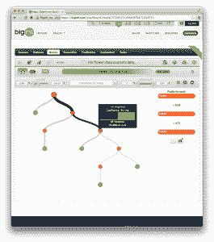

# BigML 教程：开发您的第一个决策树并做出预测

> 原文： [https://machinelearningmastery.com/bigml-tutorial-develop-your-first-decision-tree-and-make-predictions/](https://machinelearningmastery.com/bigml-tutorial-develop-your-first-decision-tree-and-make-predictions/)

BigML 是一家全新的，有趣的机器学习服务公司，总部位于美国俄勒冈州的 Corvallis。

在上一篇文章中，我们[审阅了 BigML 服务](http://machinelearningmastery.com/bigml-review-discover-the-clever-features-in-this-machine-learning-as-a-service-platform/ "BigML Review: Discover the Clever Features in This Machine Learning as a Service Platform")，关键功能以及您在业务中使用此服务的方式，在您方项目或向客户展示。在本教程中，我们将逐步介绍使用 BigML 平台开发预测模型的分步教程，并使用它来预测未用于创建模型的数据。该模型将是[决策树](http://en.wikipedia.org/wiki/Decision_tree)。

您可以通过注册[免费试用 BigML 帐户](https://bigml.com/)来跟进。将您的帐户配置为“_ 开发模式 _”，您将不需要任何学分来完成本教程中的任务。

## 虹膜种类分类问题

在本教程中，我们将使用经过充分研究的 Iris 花卉数据集。该数据集由 150 个描述鸢尾花测量的实例组成，每个鸢尾花被归类为三种虹膜中的一种。属性是数字，问题是多分类问题。

Iris 花卉数据集的样本，来自 [Wikipedia](http://en.wikipedia.org/wiki/Iris_flower_data_set) 的截图

您可以在 [Wikipedia 页面](http://en.wikipedia.org/wiki/Iris_flower_data_set)上阅读有关此问题的更多信息，并从 UCI 机器学习库上的 [Iris 页面下载数据。](http://archive.ics.uci.edu/ml/datasets/Iris)

## 1.加载数据和创建数据集

在本节中，您将准备数据源和数据集，以便在 BigML 中使用。

### 1.1。创建数据源

首先，我们需要创建一个数据源。这是原始数据，我们可以从中创建原始数据的数据集或视图。

1.  登录您的 BigML 帐户。
2.  单击“`Dashboard`”按钮转到 BigML 仪表板。
3.  单击“`Source`”选项卡列出您帐户的所有数据源。
4.  单击“链接”按钮以指定远程数据文件。
5.  输入网址（ [http://archive.ics.uci.edu/ml/machine-learning-databases/iris/iris.data](http://archive.ics.uci.edu/ml/machine-learning-databases/iris/iris.data) ）和说明（“_ 鸢尾花数据源 _] “）用于 UCI 机器学习库中的 Iris 花数据集。
6.  单击“`Create`”按钮创建新数据源。
7.  点击“_ 鸢尾花数据源 _”进行查看。

BigML 数据源

您将注意到属性数据类型已正确识别为数字，并且类标签是最后一个属性（field5）。

### 1.2。创建数据集

现在我们已经加载了原始数据的数据源，我们可以创建该数据源的数据集视图。然后，我们将创建另外两个数据集，一个称为训练，我们将用于训练预测模型，另一个称为测试，我们将用它来评估创建的预测模型，并将用作做出预测的基础。

1.  点击“_ 来源 _”标签中的“_ 鸢尾花数据源 _”打开它，如果尚未打开的话。
2.  单击云按钮并选择“_ 单击数据集 _”。
3.  这将从数据源创建新数据集。这是对数据源的视图，可以对其进行修改以准备建模。
4.  单击或悬停在小 sigma 上以查看给定属性的摘要。
5.  单击云按钮并选择“ _1 单击”训练“|测试 _“。
6.  单击“_ 数据集 _”选项卡，查看我们创建的 3 个数据集。

BigML 数据集

## 2.创建和评估模型

在本节中，我们将根据我们准备的训练数据集创建预测模型，并使用我们准备的测试数据集评估模型。

### 2.1。创建预测模型

现在，您将从训练数据集创建预测模型。

1.  点击“_ 虹膜花数据源的数据集|训练（80％）_“_ 数据集 _”选项卡中的数据集。
2.  单击云图标，然后选择“ _1-Click Model_ ”。
3.  将鼠标悬停在模型中的不同节点上，以通过决策树查看数据流。
4.  单击“`Sunburst`”按钮打开模型的旭日视图并浏览决策树。
5.  单击“_ 模型摘要报告 _”按钮以查看从决策树模型派生的规则的文本描述。

BigML 预测模型

### 2.2。评估预测模型

现在，您将评估使用测试数据集创建的预测模型的预测准确率。

1.  单击“`Models`”选项卡中的虹膜花型。
2.  单击云按钮并选择“_ 评估 _”
3.  评估将自动选择您之前创建的测试数据集，该数据集包含预测模型之前未见过的原始数据集的 20％。
4.  单击“_ 评估 _”按钮以评估模型。
5.  根据分类准确度，精确度，召回率，F 分数和 phi 分数来总结模型的准确率。我们可以看到准确率为 93.33％。
6.  单击“_ 混淆矩阵 _”以查看模型预测的混淆矩阵。

BigML 评估预测模型，显示混淆矩阵

## 3.做出预测

现在，您将使用模型之前未见过的数据的预测模型做出预测。

1.  单击“`Models`”选项卡中的虹膜花型。
2.  单击云按钮并选择“_ 批量预测 _”。
3.  单击“_ 搜索数据集..._ ”下拉菜单并键入“`iris`”。
4.  选择“_ 鸢尾花数据源的数据集|测试 20％_“数据集。
5.  单击“_ 预测 _”按钮
6.  单击“_ 下载批量预测 _”文件，以获取测试数据集中每行的预测。

BigML 下载模型预测

## 摘要

在本教程中，您学习了如何创建数据源，数据集，创建预测模型，评估它，最后使用准备好的预测模型对看不见的数据做出预测。 BigML 是一个易于使用的平台，您应该能够在 5-10 分钟内完成所有这些工作。

从这里开始，您可以做很多事情来扩展本教程：

*   您可以使用不同的修剪方法创建新的决策树，并将其评估与您已创建的决策树进行比较，以查看它是否更准确。
*   您可以使用决策树的集合来对问题进行建模，并通过将集合的评估与您已创建的决策树的评估进行比较来查看是否可以提高分类准确率。
*   您可以编写脚本或使用 BigML 命令行工具（称为 [bigmle​​r](http://bigmler.readthedocs.org/en/latest/) ）在新数据可用时做出预测。
*   您可以使用 [BigML API](https://bigml.com/developers) 将远程模型的使用集成到网页中，并在新数据从其他来源提供时自动做出预测。

如果您对使用 BigML 的有趣教程有所了解，请发表评论。让你的想象力疯狂。