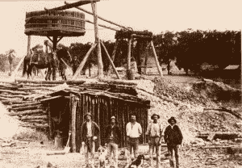

# 什么是数据挖掘和 KDD

> 原文： [https://machinelearningmastery.com/what-is-data-mining-and-kdd/](https://machinelearningmastery.com/what-is-data-mining-and-kdd/)

我对流程很感兴趣。我想知道做事的好方法，即使是最好的办法，如果可能的话。即使您没有技能或深刻理解，过程也可以帮到您。它可以引领方式，技能和深刻的理解可以遵循。至少，我用它来推动我的大部分工作。

我认为研究数据挖掘是有用的，因为它是一个从数据中发现的过程。在这篇文章中，您将从教科书和论文中探索“数据挖掘”的权威定义。由于数据挖掘是一个过程，因此定义将包括对过程的许多解释。

金矿
照片来源 [GSofV](http://www.flickr.com/photos/gsofv/8554085816/sizes/l/) ，保留一些权利

## 权威教材

在本节中，我们将从该领域的两本权威教科书中查看“数据挖掘”的定义。

### 数据挖掘：实用的机器学习工具和技术

 这是 Ian Witten 和 Eibe Frank 的教科书。

作者在前言中评论道：

> “数据挖掘是从数据中提取隐含的，以前未知的，可能有用的信息。我们的想法是构建自动筛选数据库，寻求规律或模式的计算机程序。如果找到强有力的模式，可能会推广以对未来数据做出准确的预测。 ...机器学习为数据挖掘提供了技术基础。它用于从数据库中的原始数据中提取信息......“

在本书的第 1 章中，作者写道：

> “数据挖掘被定义为发现数据模式的过程。该过程必须是自动的（或更常见的）半自动的。发现的模式必须有意义，因为它会带来一些优势，通常是经济优势。数据总是大量存在。“

我在进入该领域的早期就读过这本书，这个数据挖掘的定义及其与机器学习的关系一直困扰着我。当我应用机器学习方法时，我应用一个看起来像数据挖掘过程的过程，除了我不是试图发现模式本身，而是我试图为一个定义良好的问题找到一个“足够好”的解决方案。

### 数据挖掘：概念和技术

 这是 Jiawei Han 和 Micheline Kamber 的教科书。

在作者的序言中写道：

> “数据挖掘，通常也被称为数据知识发现（KDD），是自动或方便地提取模式，表示在大型数据库，数据仓库，Web，其他海量信息库或数据流中隐式存储或捕获的知识。”

这是 KDD 略有不同的定义，我认为这是该领域的标准。我相信 KDD 的首选定义是数据库中的知识发现。

在第 1 章中，作者总结了 KDD 过程（第 7 页和第 8 页）：

1.  **数据清理**，以消除噪音和不一致的数据。
2.  **数据集成**，可以组合多个数据源。
3.  **数据选择**，从数据库中检索与分析任务相关的数据。
4.  **数据转换**，通过预先形成汇总或汇总操作，将数据转换并合并为适合挖掘的形式。
5.  **数据挖掘**，这是一个将智能方法应用于提取数据模式的基本过程。
6.  **模式评估**根据有趣的测量来识别代表知识的真正有趣的模式。
7.  **知识展示**，其中可视化和知​​识表示技术用于向用户呈现挖掘的知识。

在本书中，作者评论说数据挖掘更常见的是从数据过程中引用整个知识发现，可能是因为它是一个较短的术语。

## 权威文章

在本节中，我们将在该领域的权威文章中探索数据库中的知识发现（KDD）的过程。这些都是可重复技术的 macgainze 文章，而不是同行评审的期刊文章。然而，较不正式的语气允许对这一高级主题进行有益的讨论。

### 从数据挖掘到数据库中的知识发现

这是 1996 年由 Usama Fayyad，Gregory Piatetsky-Shapiro 和 Padhraic Smyth 撰写的 AI 杂志上的一篇文章。

他们将 KDD 定义为数据库中的知识发现，这是我更熟悉的定义：

> “...... KDD 领域关注的是开发用于理解数据的方法和技术。 ......该过程的核心是应用特定的数据挖掘方法进行模式发现和提取。“

和

> “... KDD 是指从数据中发现有用知识的整个过程，而数据挖掘是指此过程中的特定步骤。数据挖掘是特定算法的应用，用于从数据中提取模式。“

作者在图片中提供了有用的 KDD 摘要，其中包含框中的实体和将框连接为实体上的变换的过程。该描述总结如下。我很勉强重现图像，对不起，正式出版物在这方面可能很难。

*   **第 1 步**：选择（数据到目标数据）
*   **第 2 步**：预处理（将目标数据转换为已处理数据）
*   **第 3 步**：转换（将处理后的数据转换为转换后的数据）
*   **第 4 步**：数据挖掘（将数据转换为模式）
*   **第 5 步**：将解释和/或评估模式转化为知识）

这个过程很简单，它是我在处理问题时喜欢使用的模型。

### 从数据量中提取有用知识的 KDD 过程

这是 1996 年由 Usama Fayyad，Gregory Piatetsky-Shapiro 和 Padhraic Smyth 在 ACM 通讯中的一篇文章。

在本文中，作者给出了 KDD 过程的更详细的总结。这个更详细的版本在上面的“From Data Mining ...”文章中，但我感觉不太清楚。下面将更详细地概述 KDD 过程。

1.  了解应用程序域和过程的目标
2.  创建目标数据集作为所有可用数据的子集
3.  数据清理和预处理，以消除噪音，处理缺失数据和异常值
4.  数据缩减和投影，以便专注于与问题相关的功能
5.  将进程的目标与数据挖掘方法相匹配。确定模型的目的，例如摘要或分类。
6.  选择数据挖掘算法以匹配模型的目的（从步骤 5 开始）
7.  数据挖掘，即运行数据算法。
8.  解释挖掘的模式以使用户可以理解，例如摘要和可视化。
9.  根据发现的知识，例如报告或做出决定。

我喜欢这个过程中的细节。它确实说明了理解过程目标的必要性，并且持久选择的算法与这些目标相匹配。

## 摘要

在这篇文章中，您了解到数据挖掘是从数据中发现模式。您了解到，这是一个由许多步骤组成的过程，包括数据准备，算法运行和结果表示。

您了解到机器学习是数据挖掘中使用的工具，数据挖掘实际上是数据库或 KDD 中知识发现过程中的一个步骤，并且它已经成为术语的同义词，因为它更容易说。

您了解到，当您从事机器学习项目时，您可能正在执行某种形式的 KDD 流程，其具体目标是解决问题而不是进行发现。

## 资源

如果您想深入了解，可以阅读下面这篇文章的研究中使用的更多信息。

*   [数据挖掘：实用机器学习工具和技术](http://www.amazon.com/dp/0123748569?tag=inspiredalgor-20)（会员链接）
*   [数据挖掘：概念与技术](http://www.amazon.com/dp/0123814790?tag=inspiredalgor-20)（会员链接）
*   [从数据挖掘到数据库中的知识发现](http://scholar.google.com/scholar?q=From+Data+Mining+to+Knowledge+Discovery+in+Databases)（谷歌学者），1996 年
*   [从数据量中提取有用知识的 KDD 过程](http://scholar.google.com/scholar?q=The+KDD+Process+for+Extracting+Useful+Knowledge+from+Volumes+of+Data)（谷歌学者），1996 年

您如何理解数据挖掘以及机器学习如何适应？发表评论并分享您的经验。