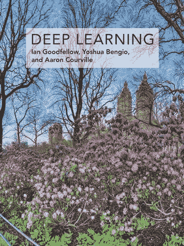
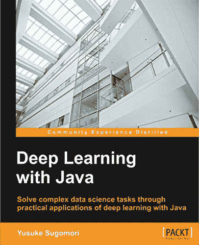
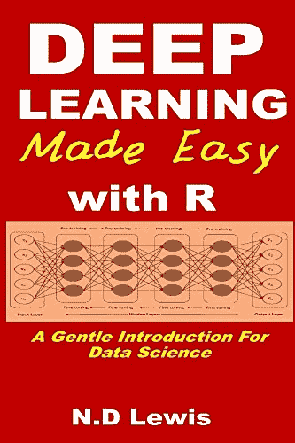

# 深度学习书籍

> 原文： [https://machinelearningmastery.com/deep-learning-books/](https://machinelearningmastery.com/deep-learning-books/)

目前关于深度学习的书籍并不多，因为它是一个如此年轻的学习领域。

虽然有一些书籍可供使用，还有一些非常有趣的书籍可以通过早期访问购买。

在这篇文章中，您将发现现在可用于深度学习的书籍。

让我们开始吧。

深度学习书籍（我希望）
摄影： [Indi Samarajiva](https://www.flickr.com/photos/indi/4259120807/) ，保留一些权利。

## 深度学习教科书

有一本深入学习的教科书已经开发了几年，简称[深度学习](http://www.deeplearningbook.org/)。

它由顶级深度学习科学家 [Ian Goodfellow](https://www.linkedin.com/in/ian-goodfellow-b7187213) ， [Yoshua Bengio](https://www.linkedin.com/in/yoshuabengio) 和 [Aaron Courville](https://www.linkedin.com/in/aaron-courville-53a63459) 撰写，包括该领域所有主要算法的报道甚至一些练习。

我认为它将成为在该领域阅读的主要文本，主要是因为他们免费赠送（很像[统计学习要素](http://www.amazon.com/dp/0387848576?tag=inspiredalgor-20)是机器学习中必读的）。

其中很多已经完成，我强烈建议阅读它以获得深度学习算法的背景理论。

目前的工作目录如下：

*   第一部分：应用数学和机器学习基础
    *   线性代数
    *   概率论与信息论
    *   数值计算
    *   机器学习基础
*   第二部分：现代实用的深度网络
    *   深度前馈网络
    *   正则
    *   深度模型训练的优化
    *   卷积网络
    *   序列建模：循环网络和递归网络
    *   实用方法论
    *   应用
*   第三部分：深度学习研究
    *   线性因子模型
    *   自动编码
    *   表征学习
    *   深度学习的结构化概率模型
    *   蒙特卡罗方法
    *   面对分区功能
    *   近似推论
    *   深度生成模型

## 来自 O'Reilly 的深度学习书籍

目前有两本来自 O'Reilly 的书正在筹备中，我很兴奋：

*   [深度学习：从业者的方法](http://www.amazon.com/dp/1491914254?tag=inspiredalgor-20)
*   [深度学习基础：设计下一代机器智能算法](http://www.amazon.com/dp/1491925612?tag=inspiredalgor-20)

### 深度学习：从业者的方法

这是由 DeepLearning4J 的两个创作者编写的应用书： [Adam Gibson](https://www.linkedin.com/in/agibsonccc) 和 [Josh Patterson](https://www.linkedin.com/in/joshlpatterson) 。 [DeepLearning4J](http://deeplearning4j.org/) （或 DL4J）是 Java 应用程序的深度学习框架。

本书是实用的，为 Java 开发人员和数据科学家编写，我只能假设它提供了使用 DL4J 框架的示例。

这本书将于 2016 年 5 月出版，目前没有目录（我能找到）。

### 深度学习的基础知识：设计下一代机器智能算法

这是 [Nikhil Buduma](https://www.linkedin.com/in/nikhilbuduma) 编写的另一本 Python 应用书。它涵盖了深度学习概念和示例。您可以尽早访问本书，撰写本文时共有 5 章。

本书目前的工作目录如下：

*   神经网络
*   训练前馈神经网络
*   在 TensorFlow 中实现神经网络
*   超越梯度下降
*   卷积神经网络：
*   嵌入和表示学习
*   序列分析的深度学习模型
*   记忆增强的深度学习模型
*   生成性深度学习模型
*   深度强化学习
*   走向一般无监督学习
*   训练极深度神经网络

我很高兴能得到这本书。

## Packt Publishing 的深度学习

数据包发布 2016 年 5 月出版了一本书，由 [Yusuke Sugomori](https://www.linkedin.com/in/yusugomori) 撰写，题为[深度学习与 Java](http://www.amazon.com/dp/1785282190?tag=inspiredalgor-20) 。它还针对 Java 开发人员和数据科学家，并将使用 DeepLearning4J 框架提供示例。

似乎没有可用于本书的目录，但我相信你可以[尽早获得它](https://www.packtpub.com/big-data-and-business-intelligence/deep-learning-java)。

## C ++和 CUDA C 中的深信仰网

[Timothy Masters](https://www.linkedin.com/in/tim-masters-82a58739) 多年来撰写了许多关于人工神经网络的书籍。 2015 年，他用 C ++和 CUDA 写了两本关于 Deep Belief Networks 的书。

这些书提供了示例，主要关注他的软件 DEEP。您可以在[网页](http://www.timothymasters.info/Deep_learning.html)上了解有关其软件的更多信息。

这两本书是：

[Deep Belief Nets in C++ and CUDA C: Volume 1: Restricted Boltzmann Machines and Supervised Feedforward Networks](http://www.amazon.com/dp/1507751478?tag=inspiredalgor-20)

本书的目录是：

*   监督前馈网络
*   受限制的玻尔兹曼机器
*   贪心训练
*   DEEP 操作手册

[Deep Belief Nets in C++ and CUDA C: Volume II: Autoencoding in the Complex Domain](http://www.amazon.com/dp/1514365995?tag=inspiredalgor-20)

本书的目录是：

*   嵌入式类标签
*   信号预处理
*   图像预处理
*   Autoencoding
*   DEEP 操作手册

## 人工智能

[Jeff Heaton](https://www.linkedin.com/in/jeffheaton) 是一本关于人工智能的三本书系列的研究员和作者：

*   [人类智能，第 1 卷：基本算法](http://www.amazon.com/dp/1493682229?tag=inspiredalgor-20)
*   [人类智能，第 2 卷：自然启发算法](http://www.amazon.com/dp/1499720572?tag=inspiredalgor-20)
*   [人工智能，第 3 卷：深度学习和神经网络](http://www.amazon.com/dp/1505714346?tag=inspiredalgor-20)

该系列的第三本书涵盖了人工神经网络，并有一些关于深度学习技术的章节。

目录如下：

*   神经网络基础知识
*   自组织地图
*   Hopfield 和 Boltzmann 机器
*   前馈神经网络
*   训练和评估
*   反向传播训练
*   其他传播训练
*   NEAT，CPNN 和 HyperNEAT
*   深度学习
*   卷积神经网络
*   修剪和模型选择
*   dropout和正规化
*   时间序列和循环网络
*   构建神经网络
*   可视化
*   用神经网络建模

一般来说，杰夫是一个很好的沟通者，他的书得到了社区的关注，因为他[在创作过程中使用了 KickStarter](https://www.kickstarter.com/projects/jeffheaton/artificial-intelligence-for-humans-vol-3-deep-lear) 。如果你正在寻找神经网络的介绍并发现深度学习适合的地方，他的系列的第三部分可能是一个很好的阅读。

## R 的深度学习

N. D. Lewis 有一系列关于统计学和机器学习的书籍，包括有关神经网络的书籍。 2016 年初，他发表了一本关于深度学习的书，名为：[深度学习轻松学习 R：数据科学的温和介绍。](http://www.amazon.com/dp/B01AEXMX34?tag=inspiredalgor-20) 。

目录如下：

*   深度神经网络
*   Elman 神经网络
*   Jordan 神经网络
*   自动编码器的秘密
*   坚果壳中的堆叠自动编码器
*   受限制的玻尔兹曼机器
*   深信仰网络

## 更新：更多书籍

本节列出了撰写本文后已发布（或预计将发布）的附加书籍。

*   [神经网络与深度学习](http://neuralnetworksanddeeplearning.com/index.html)
*   [Grokking 深度学习](http://www.amazon.com/dp/1617293709?tag=inspiredalgor-20)
*   [使用 TensorFlow 进行机器学习](http://www.amazon.com/dp/1617293873?tag=inspiredalgor-20)
*   [TensorFlow 机器学习手册](http://www.amazon.com/dp/1786462168?tag=inspiredalgor-20)
*   [TensorFlow 入门](http://www.amazon.com/dp/B01H1JD6JO?tag=inspiredalgor-20)
*   [Scikit-Learn 和 TensorFlow 实践机器学习：构建智能系统的概念，工具和技术](http://www.amazon.com/dp/1491962291?tag=inspiredalgor-20)

## 摘要

在这篇文章中，您将发现现在可用于深度学习的书籍。

您是否购买或阅读过其中一本书？发表评论，让我知道你对它的看法。

还有更多关于深度学习的书籍，你知道它们已经或已经在这里吗？请在评论中告诉我。