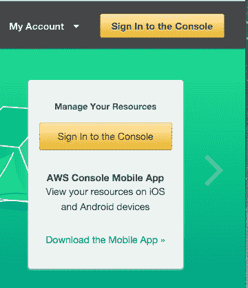
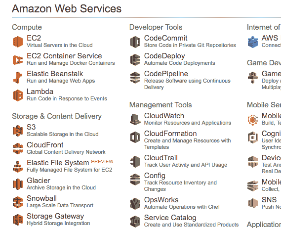
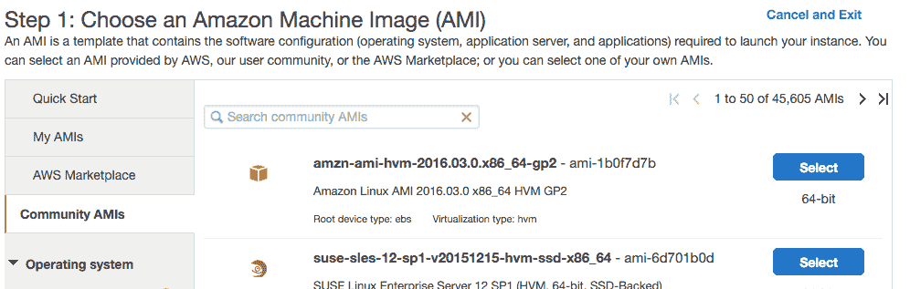
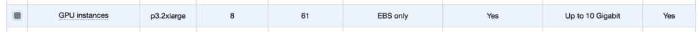
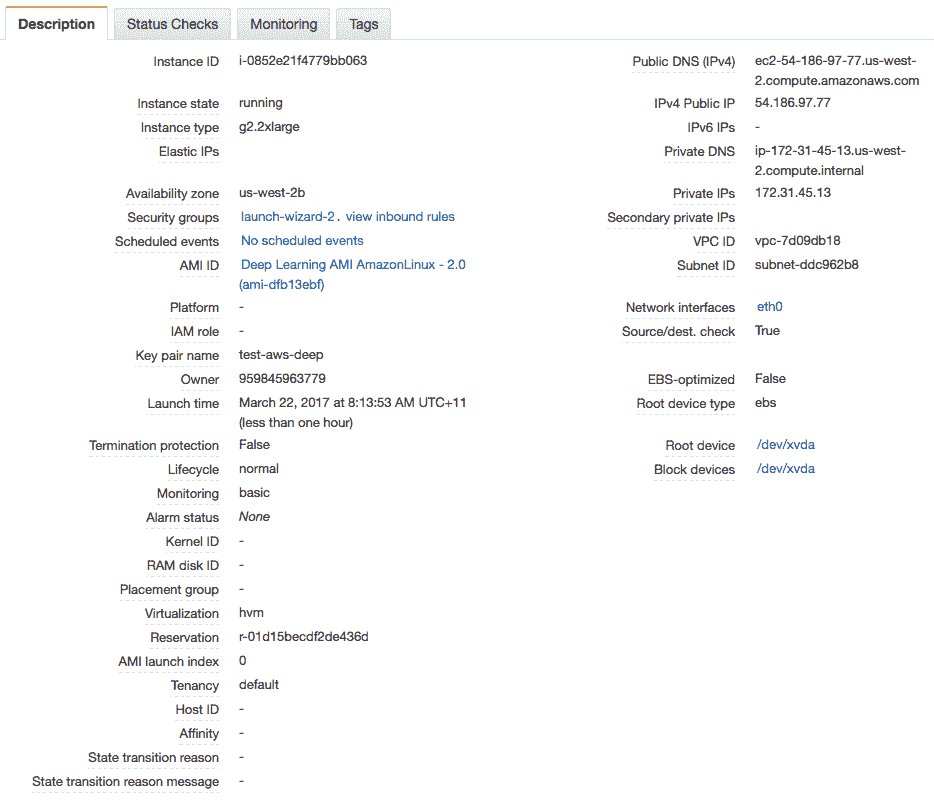

# 如何设置 Amazon AWS EC2 GPU 以训练 Keras 深度学习模型（分步）

> 原文： [https://machinelearningmastery.com/develop-evaluate-large-deep-learning-models-keras-amazon-web-services/](https://machinelearningmastery.com/develop-evaluate-large-deep-learning-models-keras-amazon-web-services/)

Keras 是一个 Python 深度学习库，可以轻松方便地访问功能强大的数据库 Theano 和 TensorFlow。

大型深度学习模型需要大量的计算时间才能运行。您可以在 CPU 上运行它们，但可能需要数小时或数天才能获得结果。如果您可以访问桌面上的 GPU，则可以大大加快深度学习模型的训练时间。

在本文中，您将了解如何使用 Amazon Web Service（AWS）基础结构访问 GPU 以加速深度学习模型的训练。每小时不到 1 美元，通常便宜很多，您可以使用工作站或笔记本电脑上的这项服务。

让我们开始吧。

*   **2016 年 10 月更新**：更新了 Keras 1.1.0 的示例。
*   **2017 年 3 月更新**：更新后使用新的 AMI，Keras 2.0.2 和 TensorFlow 1.0。
*   **2002 年 2 月更新**：更新后使用新的“深度学习 AMI”并建议使用更快的“p3.2xlarge”实例类型。


亚马逊网络服务
摄影： [Andrew Mager](https://www.flickr.com/photos/mager/3183272133/) ，保留一些权利

## 教程概述

这个过程非常简单，因为大部分工作已经为我们完成了。

以下是该过程的概述。

1.  设置您的 AWS 账户。
2.  启动您的 AWS 实例。
3.  登录并运行您的代码。
4.  关闭您的 AWS 实例。

**注意，在 Amazon** 上使用虚拟服务器实例需要花钱。临时模型开发的成本很低（例如每小时不到一美元），这就是为什么它如此吸引人，但它不是免费的。

服务器实例运行 Linux。虽然不需要知道如何导航 Linux 或类似 unix 的环境，但这是可取的。我们只是运行我们的 Python 脚本，因此不需要高级技能。

## 1.设置您的 AWS 账户

您需要在 Amazon Web Services 上拥有一个帐户。

*   1.您可以通过[亚马逊网络服务门户](https://aws.amazon.com/)创建一个帐户，然后单击“登录到控制台”。从那里，您可以使用现有的亚马逊帐户登录或创建新帐户。



AWS 登录按钮

*   2.您需要提供您的详细信息以及亚马逊可以收取的有效信用卡。如果您已经是亚马逊客户并且已将您的信用卡存档，那么此过程会快得多。


AWS 登录表单

拥有帐户后，您可以登录 Amazon Web Services 控制台。

您将看到一系列可以访问的不同服务。

## 2.启动您的 AWS 实例

现在您已拥有 AWS 账户，您想要启动可以运行 Keras 的 EC2 虚拟服务器实例。

启动实例就像选择要加载和启动虚拟服务器的映像一样简单。值得庆幸的是，已经有一个可用的图像几乎所有我们需要它被称为[深度学习 AMI（亚马逊 Linux）](https://aws.amazon.com/marketplace/pp/B077GF11NF)，并由亚马逊创建并维护。我们将它作为一个实例启动。

*   1.如果您尚未登录 [AWS 控制台](https://console.aws.amazon.com/console/home)，请登录。



AWS 控制台

*   2.单击 EC2 以启动新的虚拟服务器。
*   3.从右上角的下拉列表中选择“US West Oregon”。这很重要，否则您将无法找到我们计划使用的图像。
*   4.单击“启动实例”按钮。
*   5.单击“社区 AMI”。 AMI 是亚马逊机器映像。它是服务器的冻结实例，您可以在新虚拟服务器上进行选择和实例化。



社区 AMI

*   6.在“搜索社区 AMI”搜索框中输入“**深度学习 AMI** ”，然后按 Enter 键。


深度学习 AMI

*   7.单击“选择”以在搜索结果中选择 AMI。
*   8.现在您需要选择运行映像的硬件。向下滚动并选择“ **p3.2xlarge** ”硬件（我以前推荐 g2 或 [g3 实例](https://aws.amazon.com/ec2/instance-types/g3/)和 [p2 实例](https://aws.amazon.com/ec2/instance-types/p2/)，但 [p3 实例](https://aws.amazon.com/ec2/instance-types/p3/)更新更快。这包括一个 Tesla V100 GPU，我们可以用它来显着提高我们模型的训练速度。它还包括 8 个 CPU 内核，61GB 内存和 16GB GPU 内存。注意：使用此实例将花费约 3 美元/小时。



p3.2xlarge EC2 实例

*   9.单击“查看并启动”以完成服务器实例的配置。
*   10.单击“启动”按钮。
*   11.选择您的密钥对。
    *   如果您之前使用过 EC2，则选择“选择现有密钥对”并从列表中选择密钥对。然后检查“我”确认......“。
    *   如果您没有密钥对，请选择“创建新密钥对”选项并输入“密钥对名称”，例如 keras-keypair。单击“下载密钥对”按钮。


选择您的密钥对

*   12.打开终端并将目录更改为您下载密钥对的位置。
*   13.如果尚未执行此操作，请限制密钥对文件的访问权限。这需要作为对服务器的 SSH 访问的一部分。例如：

```py
cd Downloads
chmod 600 keras-aws-keypair.pem
```

*   14.单击“启动实例”。如果这是您第一次使用 AWS，亚马逊可能必须验证您的请求，这可能需要长达 2 个小时（通常只需几分钟）。
*   15.单击“查看实例”以查看实例的状态。



深度学习 AMI 状态

您的服务器现在正在运行，可以登录。

## 3.登录，配置和运行

现在您已经启动了服务器实例，现在可以登录并开始使用它了。

*   1.如果您还没有，请单击 Amazon EC2 控制台中的“查看实例”。
*   2.将“公共 IP”（在“描述”中的屏幕底部）复制到剪贴板。在此示例中，我的 IP 地址是 54.186.97.77。 **请勿使用此 IP 地址**，您的 IP 地址会有所不同。
*   3.打开终端并将目录更改为您下载密钥对的位置。使用 SSH 登录您的服务器，例如：

```py
ssh -i keras-aws-keypair.pem ec2-user@54.186.97.77
```

*   4.出现提示时，键入“ _yes_ ”并按 Enter 键。

您现在已登录到您的服务器。


终端登录深度学习 AMI

该实例将询问您希望使用的 Python 环境。我建议使用：

*   **TensorFlow（+ Keras2）与 Python3（CUDA 9.0 和英特尔 MKL-DNN）**

您可以键入以下内容来激活此虚拟环境：

```py
source activate tensorflow_p36
```

这只需要一分钟。

您现在可以开始训练深度学习神经网络模型了。

想要尝试新实例，请参阅本教程：

*   [用 Keras 逐步开发 Python 中的第一个神经网络](http://machinelearningmastery.com/tutorial-first-neural-network-python-keras/)

## 4.关闭您的 AWS 实例

完成工作后，您必须关闭实例。

请记住，您需要按照使用该实例的时间收费。它很便宜，但如果你不使用它，你不想留下实例。

*   1.在终端注销您的实例，例如您可以输入：

```py
exit
```

*   2.使用 Web 浏览器登录 AWS 账户。
*   3.单击 EC2。
*   4.单击左侧菜单中的“Instances”。


查看运行实例列表

*   5.从列表中选择正在运行的实例（如果您只有一个正在运行的实例，则可能已选中该实例）。


选择您正在运行的 AWS 实例

*   6.单击“操作”按钮并选择“实例状态”，然后选择“终止”。确认您要终止正在运行的实例。

实例可能需要几秒钟才能关闭并从实例列表中删除。

## 在 AWS 上使用 Keras 的提示和技巧

以下是在 AWS 实例上充分利用 Keras 的一些提示和技巧。

*   **设计一套预先运行的实验**。实验可能需要很长时间才能运行，而您需要为使用时间付费。花时间设计一批在 AWS 上运行的实验。将每个文件放在一个单独的文件中，并依次从另一个脚本调用它们。这将允许您从一个长期回答多个问题，也许是一夜之间。
*   **运行脚本作为后台进程**。这样您就可以在实验运行时关闭终端并关闭计算机。

您可以轻松地执行以下操作：

```py
nohup /path/to/script >/path/to/script.log 2>&1 < /dev/null &
```

然后，您可以稍后在 script.log 文件中检查状态和结果。 [了解有关 nohup 的更多信息](https://en.wikipedia.org/wiki/Nohup)。

*   **在实验结束时始终关闭您的实例**。您不希望对非常大的 AWS 账单感到惊讶。
*   **尝试使用更便宜但不太可靠的选项**的现场实例。亚马逊以更便宜的价格在硬件上出售未使用的时间，但代价可能是您的实例在任何时候关闭。如果您正在学习或实验并不重要，这可能是您的理想选择。您可以从 EC2 Web 控制台左侧菜单中的“竞价型实例”选项访问竞价型实例。

有关在 AWS 上使用的命令行重新复制的更多帮助，请参阅帖子：

*   [10 个亚马逊网络服务深度学习命令行方案](https://machinelearningmastery.com/command-line-recipes-deep-learning-amazon-web-services/)

## 更多有关 AWS 深度学习的资源

以下是有关 AWS 的更多信息以及在云中构建深度学习的资源列表。

*   [亚马逊弹性计算云（EC2）](http://docs.aws.amazon.com/AWSEC2/latest/UserGuide/concepts.html)的介绍如果您是所有这些的新手
*   [亚马逊机器图像（AMI）简介](http://docs.aws.amazon.com/AWSEC2/latest/UserGuide/AMIs.html)
*   [AMI 市场上的深度学习 AMI（亚马逊 Linux）。](https://aws.amazon.com/marketplace/pp/B077GF11NF)
*   [P3 EC2 实例](https://aws.amazon.com/ec2/instance-types/p3/)

## 摘要

在这篇文章中，您了解了如何使用 Amazon Web Service 上的 GPU 在 Keras 中开发和评估您的大型深度学习模型。你了解到：

*   使用 Elastic Compute Cloud 的 Amazon Web Services 提供了一种在 GPU 硬件上运行大型深度学习模型的经济实惠方式。
*   如何为深度学习实验设置和启动 EC2 服务器。
*   如何更新服务器上的 Keras 版本并确认系统正常运行。
*   如何在 AWS 实例上批量运行 Keras 实验作为后台任务。

您对在 AWS 或此帖子上运行模型有任何疑问吗？在评论中提出您的问题，我会尽力回答。