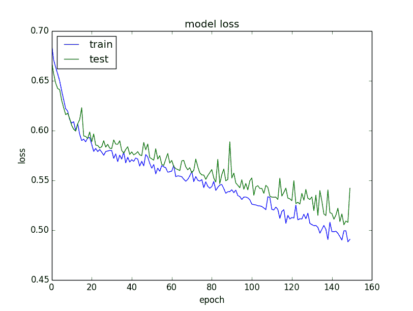

# 在 Keras 展示深度学习模型训练历史

> 原文： [https://machinelearningmastery.com/display-deep-learning-model-training-history-in-keras/](https://machinelearningmastery.com/display-deep-learning-model-training-history-in-keras/)

您可以通过观察他们在训练期间随时间的表现来学习很多关于神经网络和深度学习模型的知识。

Keras 是一个功能强大的 Python 库，它提供了一个干净的界面来创建深度学习模型，并包含更技术性的 TensorFlow 和 Theano 后端。

在本文中，您将了解如何在使用 Keras 进行 Python 训练期间查看和可视化深度学习模型的表现。

让我们开始吧。

*   **2017 年 3 月更新：**更新了 Keras 2.0.2，TensorFlow 1.0.1 和 Theano 0.9.0 **的示例。**
*   **更新 March / 2018** ：添加了备用链接以下载数据集，因为原始图像已被删除。


在 Keras 中展示深度学习模型训练历史
照片由 [Gordon Robertson](https://www.flickr.com/photos/gordon_robertson/5620659988/) 拍摄，保留一些权利。

## Keras 中的访问模型训练历史

Keras 提供了在训练深度学习模型时注册回调的功能。

训练所有深度学习模型时注册的默认回调之一是[历史回调](http://keras.io/callbacks/)。它记录每个时期的训练指标。这包括损失和准确性（对于分类问题）以及验证数据集的损失和准确性（如果已设置）。

历史对象从调用返回到用于训练模型的 fit（）函数返回。度量标准存储在返回对象的历史成员中的字典中。

例如，您可以在训练模型后使用以下代码段列出历史记录对象中收集的指标：

```py
# list all data in history
print(history.history.keys())
```

例如，对于使用验证数据集训练分类问题的模型，这可能会产生以下列表：

```py
['acc', 'loss', 'val_acc', 'val_loss']
```

我们可以使用历史对象中收集的数据来创建绘图。

这些图可以提供有关模型训练的有用信息的指示，例如：

*   它是时代（坡度）的收敛速度。
*   模型是否已经收敛（线的高原）。
*   模型是否可能过度学习训练数据（验证线的变形）。

和更多。

## 可视化 Keras 中的模型训练历史

我们可以从收集的历史数据中创建绘图。

在下面的例子中，我们创建了一个小型网络来模拟皮马印第安人糖尿病二元分类问题。这是一个可从 UCI 机器学习库获得的小型数据集。您可以[下载数据集](http://archive.ics.uci.edu/ml/machine-learning-databases/pima-indians-diabetes/pima-indians-diabetes.data)并将其保存为当前工作目录中的 _pima-indians-diabetes.csv_ （更新：[从此处下载](https://raw.githubusercontent.com/jbrownlee/Datasets/master/pima-indians-diabetes.data.csv)）。

该示例收集从训练模型返回的历史记录并创建两个图表：

1.  训练时期训练和验证数据集的准确性图。
2.  训练和验证数据集在训练时期的损失图。

```py
# Visualize training history
from keras.models import Sequential
from keras.layers import Dense
import matplotlib.pyplot as plt
import numpy
# fix random seed for reproducibility
seed = 7
numpy.random.seed(seed)
# load pima indians dataset
dataset = numpy.loadtxt("pima-indians-diabetes.csv", delimiter=",")
# split into input (X) and output (Y) variables
X = dataset[:,0:8]
Y = dataset[:,8]
# create model
model = Sequential()
model.add(Dense(12, input_dim=8, kernel_initializer='uniform', activation='relu'))
model.add(Dense(8, kernel_initializer='uniform', activation='relu'))
model.add(Dense(1, kernel_initializer='uniform', activation='sigmoid'))
# Compile model
model.compile(loss='binary_crossentropy', optimizer='adam', metrics=['accuracy'])
# Fit the model
history = model.fit(X, Y, validation_split=0.33, epochs=150, batch_size=10, verbose=0)
# list all data in history
print(history.history.keys())
# summarize history for accuracy
plt.plot(history.history['acc'])
plt.plot(history.history['val_acc'])
plt.title('model accuracy')
plt.ylabel('accuracy')
plt.xlabel('epoch')
plt.legend(['train', 'test'], loc='upper left')
plt.show()
# summarize history for loss
plt.plot(history.history['loss'])
plt.plot(history.history['val_loss'])
plt.title('model loss')
plt.ylabel('loss')
plt.xlabel('epoch')
plt.legend(['train', 'test'], loc='upper left')
plt.show()
```

下面提供了这些情节。验证数据集的历史记录按惯例标记为测试，因为它确实是模型的测试数据集。

从准确度的图表中我们可以看出，模型可能会受到更多的训练，因为两个数据集的准确度趋势在最后几个时期仍在上升。我们还可以看到该模型尚未过度学习训练数据集，在两个数据集上显示出相似的技能。


训练和验证数据集的模型精度图

从损失图中，我们可以看到该模型在训练和验证数据集上都具有可比性（标记为测试）。如果这些平行的地块开始一致地离开，那么可能是在早期时期停止训练的迹象。



关于训练和验证数据集的模型损失情节

## 摘要

在这篇文章中，您发现了在深度学习模型训练过程中收集和检查指标的重要性。

您了解了 Keras 中的历史回调以及它是如何从调用 fit（）函数返回以训练模型的。您学习了如何根据训练期间收集的历史数据创建绘图。

您对模特训练历史或这篇文章有任何疑问吗？在评论中提出您的问题，我会尽力回答。