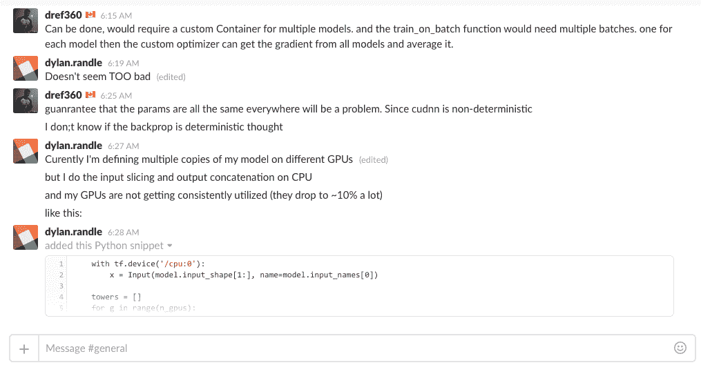
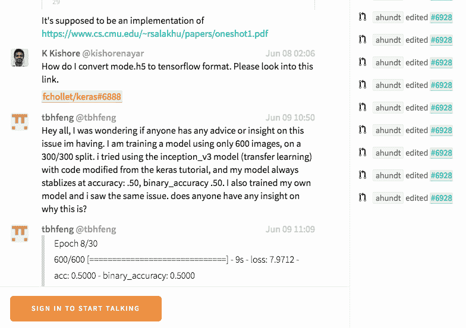
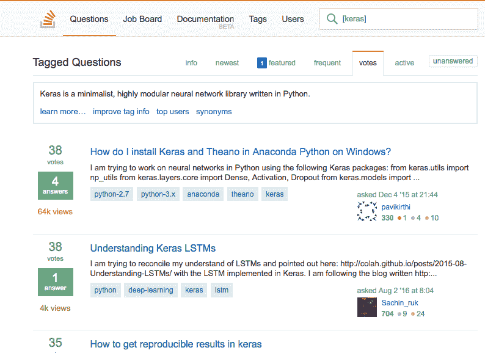
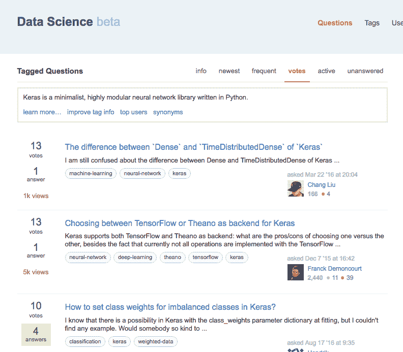
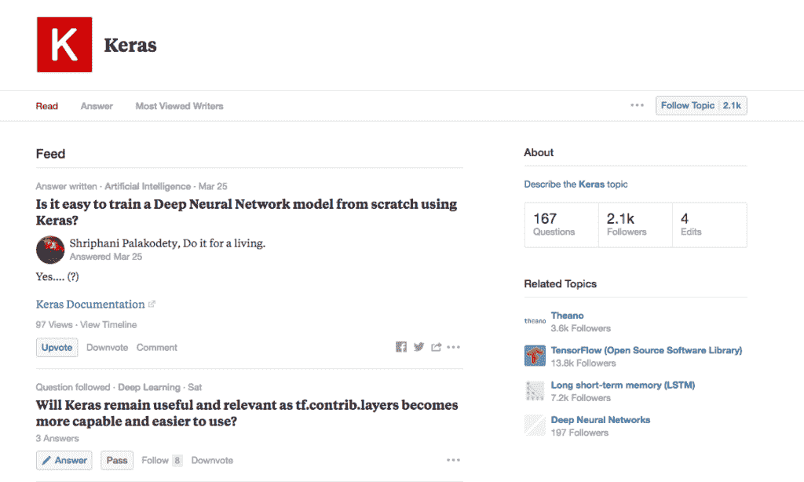
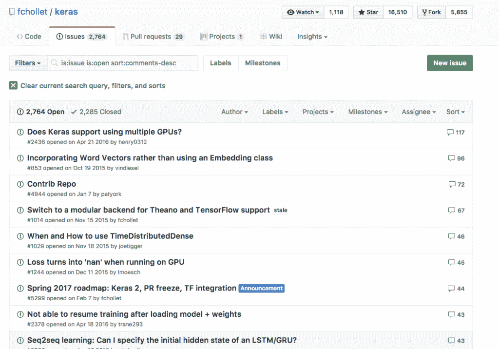

# 在 Keras 中获得深度学习帮助的 9 种方法

> 原文： [https://machinelearningmastery.com/get-help-with-keras/](https://machinelearningmastery.com/get-help-with-keras/)

Keras 是一个 Python 深度学习库，可以使用高效的 Theano 或 TensorFlow 符号数学库作为后端。

Keras 非常易于使用，您可以在几分钟内开发出您的第一个[多层感知器](http://machinelearningmastery.com/tutorial-first-neural-network-python-keras/)，[卷积神经网络](http://machinelearningmastery.com/handwritten-digit-recognition-using-convolutional-neural-networks-python-keras/)或 [LSTM 递归神经网络](http://machinelearningmastery.com/time-series-prediction-lstm-recurrent-neural-networks-python-keras/)。

当您开始使用 Keras 时，您可能会遇到技术问题。你可能需要一些帮助。

在这篇文章中，您将发现 9 个地方，您可以在使用 Keras 开发深度学习模型时提出问题并获得帮助。

让我们潜入。

## 如何最好地使用这些资源

知道在哪里获得帮助是第一步，但您需要知道如何充分利用这些资源。

以下是您可以使用的一些提示：

*   将您的问题简化为最简单的形式。例如。不是“_ 我的模型不起作用 _”或“ _x 如何工作 _”。
*   在提问之前搜索答案。
*   提供尽可能小的工作示例来演示您的问题。

## 1\. Keras 用户 Google Group

Keras 用户 Google Group

也许向 Keras 社区提问的最直接的地方是 Google 群组（旧的 usenet）上的 Keras Users 群组。

你不需要收到电子邮件;你可以在线参加，我推荐。

*   [Keras 用户谷歌集团](https://groups.google.com/forum/#!forum/keras-users)

## 2\. Keras Slack Channel

Keras Slack 频道

也许直接聊聊 Keras 和相关问题的最佳地点是 Keras 松弛频道。

这基本上取代了 IM 和 IIRC。

您必须先提交要加入的申请。

*   [Keras Slack 加入表格](https://keras-slack-autojoin.herokuapp.com/)
*   [Keras Slack Channel](https://kerasteam.slack.com/)

## 凯特在吉特

Keras Gitter 集团

另一个聊聊 Keras 的好地方是 Keras Gitter。

这就像懈怠，仍然有很多人。

潜入。

*   [Keras Gitter 集团](https://gitter.im/Keras-io/Lobby#)

## 4\. StackOverflow 上的 Keras 标记

StackOverflow 上的 Keras 标记

StackOverflow 是一个致力于编程的问答网站。

关于深度学习和 Keras 有很多问题或与之相关。

我建议搜索并询问使用“ _keras_ ”标签的问题。

*   StackOverflow 上的 [Keras 标签](https://stackoverflow.com/questions/tagged/keras)

## 5.交叉验证的 Keras 标签

交叉验证的 Keras 标签

CrossValidated 是一个致力于机器学习的问答网站。

关于 Keras 的问题仍然存在很多问题，但它们可能有更多的理论上的弯曲，而不是关注代码和编程。

同样，我建议搜索并询问使用“ _keras_ ”标签的问题。

*   交叉验证上的 [Keras 标签](https://stats.stackexchange.com/questions/tagged/keras)

## 6.数据科学上的 Keras 标签

数据科学堆栈交换中的 Keras 标记

支持 StackOverflow 和 CrossValidated 的 StackExchange 网络也有一个专用于 DataScience 的站点。

它仍处于测试阶段，尚未成为该网络的正式成员。尽管如此，网站上还有很多关于 Keras 的问题。

与其他两个站点不同，这些问题可能具有更多的流程方向。

同样，我建议搜索并询问使用“ _keras_ ”标签的问题。

*   [数据科学堆栈交换中的 Keras 标签](https://datascience.stackexchange.com/questions/tagged/keras)

## 7\. Quora 上的 Keras 主题

关于 Quora 的 Keras 主题

Quora 是一个大型的通用问答网站。

虽然它是通用的，但在技术主题方面存在很多问题，包括 Keras 和深度学习。

问题的焦点更多是基于文本和说明性的。您可能会获得有关技术的更多详细信息，而不是实现细节。

我建议在“ _Keras_ ”主题中搜索和提问。

*   关于 Quora 的 [Keras 主题](https://www.quora.com/topic/Keras)

## 8\. Keras Github 问题

Keras Github 问题

Keras 是一个在 GitHub 上托管的开源项目。

GitHub 提供了一个基本的问题管理系统，Keras 项目报告了很多问题。虽然问题应该仅限于代码的技术问题，但在这些问题上对 Keras 的讨论却令人惊讶。

我建议搜索 Keras 问题，但只有在发现错误或有新功能请求时才发布问题（[请参阅指南](https://github.com/fchollet/keras/blob/master/CONTRIBUTING.md)）。

*   [Keras Github 问题](https://github.com/fchollet/keras/issues)

## 9\. Keras 在 Twitter 上

Twitter 上的 Keras 哈希标签

您可以在 Twitter 上快速获得一次性 Keras 问题的答案。

我建议先使用 Twitter 搜索并搜索“ _keras_ ”。

我还建议使用“ _keras_ ”标签进行搜索和发布。

*   Twitter 上的 [Keras 话题标签](https://twitter.com/hashtag/keras)

您也可以通过关注 Keras 背后的创造者和首席开发人员，[FrançoisChollet](https://twitter.com/fchollet)来获得洞察力。

## 其他 Keras 目的地

以下是其他 Keras 网站，您可以在那里找到帮助。

*   [Keras 官方博客](https://blog.keras.io/)
*   [Keras API 文档](https://keras.io/)
*   [Keras 源代码项目](https://github.com/fchollet/keras)

### 摘要

在这篇文章中，您在网络上发现了 9 个不同的地方，您可以在这些地方获得答案，并就 Keras 进行深入学习提问。

你有没有使用过这些资源？
你是怎么做到的？

您是否有兴趣在 Keras 寻求帮助的地方？
请在下面的评论中告诉我。