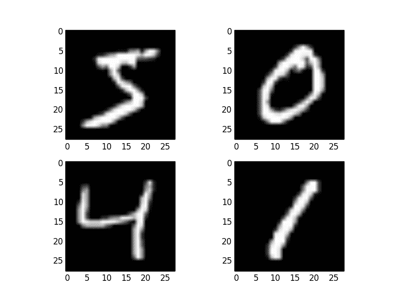

# 用 Keras 在 Python 中使用卷积神经网络进行手写数字识别

> 原文： [https://machinelearningmastery.com/handwritten-digit-recognition-using-convolutional-neural-networks-python-keras/](https://machinelearningmastery.com/handwritten-digit-recognition-using-convolutional-neural-networks-python-keras/)

深度学习技术能力的流行演示是图像数据中的对象识别。

用于机器学习和深度学习的对象识别的“hello world”是用于手写数字识别的 MNIST 数据集。

在这篇文章中，您将了解如何使用 Keras 深度学习库开发深度学习模型，以便在 Python 中使用 MNIST 手写数字识别任务实现近乎最先进的表现。

完成本教程后，您将了解：

*   如何在 Keras 中加载 MNIST 数据集。
*   如何开发和评估 MNIST 问题的基线神经网络模型。
*   如何实现和评估一个简单的 MNIST 卷积神经网络。
*   如何实现接近最先进的 MNIST 深度学习模型。

让我们开始吧。

*   **2016 年 10 月更新**：更新了 Keras 1.1.0，TensorFlow 0.10.0 和 scikit-learn v0.18 的示例。
*   **2017 年 3 月更新**：更新了 Keras 2.0.2，TensorFlow 1.0.1 和 Theano 0.9.0 的示例。


使用 Keras
在 Python 中使用卷积神经网络进行手写数字识别 [Jamie](https://www.flickr.com/photos/jamiesrabbits/5947373341/) ，保留一些权利。

## MNIST 手写数字识别问题的描述

[MNIST](http://yann.lecun.com/exdb/mnist/) 问题是由 Yann LeCun，Corinna Cortes 和 Christopher Burges 开发的用于评估手写数字分类问题的机器学习模型的数据集。

该数据集由许多可从[国家标准与技术研究所](http://www.nist.gov/)（NIST）获得的扫描文档数据集构建。这是数据集的名称来源，作为 Modified NIST 或 MNIST 数据集。

数字图像取自各种扫描文档，标准化并居中。这使其成为评估模型的优秀数据集，使开发人员能够专注于机器学习，只需要很少的数据清理或准备。

每个图像是 28 乘 28 像素的正方形（总共 784 个像素）。数据集的标准吐出用于评估和比较模型，其中 60,000 个图像用于训练模型，并且单独的 10,000 个图像集用于测试它。

这是一项数字识别任务。因此，有 10 个数字（0 到 9）或 10 个类来预测。使用预测误差报告结果，预测误差仅仅是反向分类精度。

优异的结果实现了小于 1％的预测误差。使用大型卷积神经网络可以实现约 0.2％的最先进预测误差。有一份最新的结果列表，以及有关 MNIST 和 [Rodrigo Benenson 网页](http://rodrigob.github.io/are_we_there_yet/build/classification_datasets_results.html#4d4e495354)上其他数据集的相关论文的链接。

## 在 Keras 中加载 MNIST 数据集

Keras 深度学习库提供了一种加载 MNIST 数据集的便捷方法。

第一次调用此函数时会自动下载数据集，并将其作为 15MB 文件存储在〜/ .keras / datasets / mnist.pkl.gz 的主目录中。

这对于开发和测试深度学习模型非常方便。

为了演示加载 MNIST 数据集是多么容易，我们将首先编写一个小脚本来下载和可视化训练数据集中的前 4 个图像。

```py
# Plot ad hoc mnist instances
from keras.datasets import mnist
import matplotlib.pyplot as plt
# load (downloaded if needed) the MNIST dataset
(X_train, y_train), (X_test, y_test) = mnist.load_data()
# plot 4 images as gray scale
plt.subplot(221)
plt.imshow(X_train[0], cmap=plt.get_cmap('gray'))
plt.subplot(222)
plt.imshow(X_train[1], cmap=plt.get_cmap('gray'))
plt.subplot(223)
plt.imshow(X_train[2], cmap=plt.get_cmap('gray'))
plt.subplot(224)
plt.imshow(X_train[3], cmap=plt.get_cmap('gray'))
# show the plot
plt.show()
```

您可以看到下载和加载 MNIST 数据集就像调用 mnist.load_data（）函数一样简单。运行上面的示例，您应该看到下面的图像。



MNIST 数据集中的示例

## 具有多层感知器的基线模型

我们真的需要像卷积神经网络这样的复杂模型来获得 MNIST 的最佳结果吗？

使用具有单个隐藏层的非常简单的神经网络模型，您可以获得非常好的结果。在本节中，我们将创建一个简单的多层感知器模型，其错误率为 1.74％。我们将使用它作为比较更复杂的卷积神经网络模型的基线。

让我们从导入我们需要的类和函数开始。

```py
import numpy
from keras.datasets import mnist
from keras.models import Sequential
from keras.layers import Dense
from keras.layers import Dropout
from keras.utils import np_utils
```

将随机数生成器初始化为常量始终是一个好主意，以确保脚本的结果是可重现的。

```py
# fix random seed for reproducibility
seed = 7
numpy.random.seed(seed)
```

现在我们可以使用 Keras 辅助函数加载 MNIST 数据集。

```py
# load data
(X_train, y_train), (X_test, y_test) = mnist.load_data()
```

训练数据集被构造为实例，图像宽度和图像高度的三维阵列。对于多层感知器模型，我们必须将图像缩小为像素向量。在这种情况下，28×28 大小的图像将是 784 像素输入值。

我们可以使用 NumPy 数组上的 [reshape（）函数](http://docs.scipy.org/doc/numpy-1.10.1/reference/generated/numpy.reshape.html)轻松地进行转换。我们还可以通过强制像素值的精度为 32 位来降低我们的内存需求，这是 Keras 使用的默认精度。

```py
# flatten 28*28 images to a 784 vector for each image
num_pixels = X_train.shape[1] * X_train.shape[2]
X_train = X_train.reshape(X_train.shape[0], num_pixels).astype('float32')
X_test = X_test.reshape(X_test.shape[0], num_pixels).astype('float32')
```

像素值是 0 到 255 之间的灰度级。在使用神经网络模型时，执行输入值的某些缩放几乎总是一个好主意。因为比例是众所周知的并且表现良好，所以我们可以通过将每个值除以最大值 255 来非常快速地将像素值标准化到 0 和 1 的范围。

```py
# normalize inputs from 0-255 to 0-1
X_train = X_train / 255
X_test = X_test / 255
```

最后，输出变量是 0 到 9 之间的整数。这是一个多类分类问题。因此，优良作法是使用类值的一个热编码，将类整数的向量转换为二进制矩阵。

我们可以使用 Keras 中内置的 np_utils.to_categorical（）辅助函数轻松完成此操作。

```py
# one hot encode outputs
y_train = np_utils.to_categorical(y_train)
y_test = np_utils.to_categorical(y_test)
num_classes = y_test.shape[1]
```

我们现在准备创建我们简单的神经网络模型。我们将在函数中定义我们的模型。如果您想稍后扩展示例并尝试获得更好的分数，这将非常方便。

```py
# define baseline model
def baseline_model():
	# create model
	model = Sequential()
	model.add(Dense(num_pixels, input_dim=num_pixels, kernel_initializer='normal', activation='relu'))
	model.add(Dense(num_classes, kernel_initializer='normal', activation='softmax'))
	# Compile model
	model.compile(loss='categorical_crossentropy', optimizer='adam', metrics=['accuracy'])
	return model
```

该模型是一个简单的神经网络，其中一个隐藏层具有与输入相同数量的神经元（784）。整流器激活功能用于隐藏层中的神经元。

在输出层上使用 softmax 激活函数将输出转换为类似概率的值，并允许选择 10 中的一个类作为模型的输出预测。对数损失用作损失函数（在 Keras 中称为 categorical_crossentropy），并且使用有效的 ADAM 梯度下降算法来学习权重。

我们现在可以拟合和评估模型。该模型适用于 10 个时期，每 200 个图像更新一次。测试数据用作验证数据集，允许您在训练时查看模型的技能。详细值为 2 用于将每个训练时期的输出减少到一行。

最后，测试数据集用于评估模型并打印分类错误率。

```py
# build the model
model = baseline_model()
# Fit the model
model.fit(X_train, y_train, validation_data=(X_test, y_test), epochs=10, batch_size=200, verbose=2)
# Final evaluation of the model
scores = model.evaluate(X_test, y_test, verbose=0)
print("Baseline Error: %.2f%%" % (100-scores[1]*100))
```

在 CPU 上运行时运行该示例可能需要几分钟。您应该看到下面的输出。在极少数代码行中定义的这种非常简单的网络实现了 1.91％的可观错误率。

```py
Train on 60000 samples, validate on 10000 samples
Epoch 1/10
8s - loss: 0.2797 - acc: 0.9209 - val_loss: 0.1413 - val_acc: 0.9576
Epoch 2/10
8s - loss: 0.1117 - acc: 0.9677 - val_loss: 0.0919 - val_acc: 0.9702
Epoch 3/10
8s - loss: 0.0718 - acc: 0.9796 - val_loss: 0.0782 - val_acc: 0.9774
Epoch 4/10
8s - loss: 0.0505 - acc: 0.9858 - val_loss: 0.0758 - val_acc: 0.9762
Epoch 5/10
8s - loss: 0.0374 - acc: 0.9892 - val_loss: 0.0670 - val_acc: 0.9792
Epoch 6/10
8s - loss: 0.0268 - acc: 0.9929 - val_loss: 0.0630 - val_acc: 0.9803
Epoch 7/10
8s - loss: 0.0210 - acc: 0.9945 - val_loss: 0.0604 - val_acc: 0.9815
Epoch 8/10
8s - loss: 0.0140 - acc: 0.9969 - val_loss: 0.0620 - val_acc: 0.9808
Epoch 9/10
8s - loss: 0.0107 - acc: 0.9978 - val_loss: 0.0598 - val_acc: 0.9812
Epoch 10/10
7s - loss: 0.0080 - acc: 0.9985 - val_loss: 0.0588 - val_acc: 0.9809
Baseline Error: 1.91%
```

## 用于 MNIST 的简单卷积神经网络

现在我们已经看到如何加载 MNIST 数据集并在其上训练一个简单的多层感知器模型，现在是开发更复杂的卷积神经网络或 CNN 模型的时候了。

Keras 确实为[创建卷积神经网络](http://keras.io/layers/convolutional/)提供了很多功能。

在本节中，我们将为 MNIST 创建一个简单的 CNN，演示如何使用现代 CNN 实现的所有方面，包括卷积层，池化层和丢失层。

第一步是导入所需的类和函数。

```py
import numpy
from keras.datasets import mnist
from keras.models import Sequential
from keras.layers import Dense
from keras.layers import Dropout
from keras.layers import Flatten
from keras.layers.convolutional import Conv2D
from keras.layers.convolutional import MaxPooling2D
from keras.utils import np_utils
from keras import backend as K
K.set_image_dim_ordering('th')
```

同样，我们总是将随机数生成器初始化为恒定的种子值，以便重现结果。

```py
# fix random seed for reproducibility
seed = 7
numpy.random.seed(seed)
```

接下来，我们需要加载 MNIST 数据集并对其进行整形，以便它适合用于训练 CNN。在 Keras 中，用于二维卷积的层期望像素值具有[像素] [宽度] [高度]的尺寸。

在 RGB 的情况下，对于红色，绿色和蓝色分量，第一维像素将是 3，并且对于每个彩色图像将具有 3 个图像输入。在 MNIST 中像素值是灰度级的情况下，像素尺寸设置为 1。

```py
# load data
(X_train, y_train), (X_test, y_test) = mnist.load_data()
# reshape to be [samples][pixels][width][height]
X_train = X_train.reshape(X_train.shape[0], 1, 28, 28).astype('float32')
X_test = X_test.reshape(X_test.shape[0], 1, 28, 28).astype('float32')
```

和以前一样，最好将像素值标准化为 0 和 1 范围，并对输出变量进行热编码。

```py
# normalize inputs from 0-255 to 0-1
X_train = X_train / 255
X_test = X_test / 255
# one hot encode outputs
y_train = np_utils.to_categorical(y_train)
y_test = np_utils.to_categorical(y_test)
num_classes = y_test.shape[1]
```

接下来我们定义我们的神经网络模型

卷积神经网络比标准的多层感知器更复杂，因此我们将首先使用一个简单的结构，使用所有元素来获得最先进的结果。下面总结了网络架构。

1.  第一个隐藏层是卷积层，称为 Convolution2D。该层具有 32 个特征图，其大小为 5×5，并具有整流器激活功能。这是输入层，期望图像的结构轮廓高于[像素] [宽度] [高度]。
2.  接下来，我们定义一个池化层，它采用最大的 MaxPooling2D。配置池大小为 2×2。
3.  下一层是使用 Dropout 的正规化层，称为 Dropout。它被配置为随机排除层中 20％的神经元以减少过度拟合。
4.  接下来是将 2D 矩阵数据转换为名为 Flatten 的向量的层。它允许输出由标准的完全连接层处理。
5.  接下来是具有 128 个神经元和整流器激活功能的完全连接层。
6.  最后，输出层有 10 个类的 10 个神经元和 softmax 激活函数，为每个类输出类似概率的预测。

如前所述，使用对数损失和 ADAM 梯度下降算法训练模型。

```py
def baseline_model():
	# create model
	model = Sequential()
	model.add(Conv2D(32, (5, 5), input_shape=(1, 28, 28), activation='relu'))
	model.add(MaxPooling2D(pool_size=(2, 2)))
	model.add(Dropout(0.2))
	model.add(Flatten())
	model.add(Dense(128, activation='relu'))
	model.add(Dense(num_classes, activation='softmax'))
	# Compile model
	model.compile(loss='categorical_crossentropy', optimizer='adam', metrics=['accuracy'])
	return model
```

我们使用多层感知器以与以前相同的方式评估模型。 CNN 适用于 10 个时期，批量为 200。

```py
# build the model
model = baseline_model()
# Fit the model
model.fit(X_train, y_train, validation_data=(X_test, y_test), epochs=10, batch_size=200, verbose=2)
# Final evaluation of the model
scores = model.evaluate(X_test, y_test, verbose=0)
print("CNN Error: %.2f%%" % (100-scores[1]*100))
```

运行该示例，在每个时期打印训练和验证测试的准确性，并且在分类错误率的末尾打印。

时期可能需要大约 45 秒才能在 GPU 上运行（例如在 AWS 上）。您可以看到网络的错误率达到 1.03，这比我们上面的简单多层感知器模型要好。

```py
Train on 60000 samples, validate on 10000 samples
Epoch 1/10
60000/60000 [==============================] - 120s - loss: 0.2346 - acc: 0.9334 - val_loss: 0.0774 - val_acc: 0.9762
Epoch 2/10
60000/60000 [==============================] - 42s - loss: 0.0716 - acc: 0.9782 - val_loss: 0.0454 - val_acc: 0.9856
Epoch 3/10
60000/60000 [==============================] - 42s - loss: 0.0520 - acc: 0.9842 - val_loss: 0.0429 - val_acc: 0.9853
Epoch 4/10
60000/60000 [==============================] - 42s - loss: 0.0406 - acc: 0.9868 - val_loss: 0.0369 - val_acc: 0.9876
Epoch 5/10
60000/60000 [==============================] - 42s - loss: 0.0331 - acc: 0.9898 - val_loss: 0.0345 - val_acc: 0.9884
Epoch 6/10
60000/60000 [==============================] - 42s - loss: 0.0265 - acc: 0.9917 - val_loss: 0.0323 - val_acc: 0.9905
Epoch 7/10
60000/60000 [==============================] - 42s - loss: 0.0220 - acc: 0.9931 - val_loss: 0.0337 - val_acc: 0.9894
Epoch 8/10
60000/60000 [==============================] - 42s - loss: 0.0201 - acc: 0.9934 - val_loss: 0.0316 - val_acc: 0.9892
Epoch 9/10
60000/60000 [==============================] - 42s - loss: 0.0163 - acc: 0.9947 - val_loss: 0.0281 - val_acc: 0.9908
Epoch 10/10
60000/60000 [==============================] - 42s - loss: 0.0135 - acc: 0.9956 - val_loss: 0.0327 - val_acc: 0.9897
CNN Error: 1.03%
```

## 用于 MNIST 的较大卷积神经网络

现在我们已经看到了如何创建一个简单的 CNN，让我们来看看能够接近最新结果的模型。

我们导入类和函数，然后加载和准备数据与前一个 CNN 示例相同。

```py
# Larger CNN for the MNIST Dataset
import numpy
from keras.datasets import mnist
from keras.models import Sequential
from keras.layers import Dense
from keras.layers import Dropout
from keras.layers import Flatten
from keras.layers.convolutional import Conv2D
from keras.layers.convolutional import MaxPooling2D
from keras.utils import np_utils
from keras import backend as K
K.set_image_dim_ordering('th')
# fix random seed for reproducibility
seed = 7
numpy.random.seed(seed)
# load data
(X_train, y_train), (X_test, y_test) = mnist.load_data()
# reshape to be [samples][pixels][width][height]
X_train = X_train.reshape(X_train.shape[0], 1, 28, 28).astype('float32')
X_test = X_test.reshape(X_test.shape[0], 1, 28, 28).astype('float32')
# normalize inputs from 0-255 to 0-1
X_train = X_train / 255
X_test = X_test / 255
# one hot encode outputs
y_train = np_utils.to_categorical(y_train)
y_test = np_utils.to_categorical(y_test)
num_classes = y_test.shape[1]
```

这次我们定义了一个大型 CNN 架构，其中包含额外的卷积，最大池化层和完全连接的层。网络拓扑可以总结如下。

1.  具有 30 个大小为 5×5 的特征图的卷积层。
2.  汇集层最多超过 2 * 2 补丁。
3.  具有 15 个尺寸为 3×3 的特征图的卷积层。
4.  汇集层最多超过 2 * 2 补丁。
5.  dropout层的概率为 20％。
6.  展平层。
7.  完全连接的层有 128 个神经元和整流器激活。
8.  完全连接的层有 50 个神经元和整流器激活。
9.  输出层。

```py
# define the larger model
def larger_model():
	# create model
	model = Sequential()
	model.add(Conv2D(30, (5, 5), input_shape=(1, 28, 28), activation='relu'))
	model.add(MaxPooling2D(pool_size=(2, 2)))
	model.add(Conv2D(15, (3, 3), activation='relu'))
	model.add(MaxPooling2D(pool_size=(2, 2)))
	model.add(Dropout(0.2))
	model.add(Flatten())
	model.add(Dense(128, activation='relu'))
	model.add(Dense(50, activation='relu'))
	model.add(Dense(num_classes, activation='softmax'))
	# Compile model
	model.compile(loss='categorical_crossentropy', optimizer='adam', metrics=['accuracy'])
	return model
```

与前两个实验一样，该模型适用于 10 个时期，批量大小为 200。

```py
# build the model
model = larger_model()
# Fit the model
model.fit(X_train, y_train, validation_data=(X_test, y_test), epochs=10, batch_size=200)
# Final evaluation of the model
scores = model.evaluate(X_test, y_test, verbose=0)
print("Large CNN Error: %.2f%%" % (100-scores[1]*100))
```

运行该示例可在每个迭代和最终分类错误率的训练和验证数据集上打印准确度。

该模型每个时期运行大约需要 100 秒。这个略大的模型实现了 0.89％的可观分类错误率。

```py
Train on 60000 samples, validate on 10000 samples
Epoch 1/10
60000/60000 [==============================] - 45s - loss: 0.3912 - acc: 0.8798 - val_loss: 0.0874 - val_acc: 0.9726
Epoch 2/10
60000/60000 [==============================] - 43s - loss: 0.0944 - acc: 0.9713 - val_loss: 0.0603 - val_acc: 0.9800
Epoch 3/10
60000/60000 [==============================] - 43s - loss: 0.0697 - acc: 0.9781 - val_loss: 0.0377 - val_acc: 0.9880
Epoch 4/10
60000/60000 [==============================] - 44s - loss: 0.0558 - acc: 0.9819 - val_loss: 0.0331 - val_acc: 0.9885
Epoch 5/10
60000/60000 [==============================] - 44s - loss: 0.0480 - acc: 0.9852 - val_loss: 0.0300 - val_acc: 0.9900
Epoch 6/10
60000/60000 [==============================] - 44s - loss: 0.0430 - acc: 0.9862 - val_loss: 0.0293 - val_acc: 0.9897
Epoch 7/10
60000/60000 [==============================] - 44s - loss: 0.0385 - acc: 0.9877 - val_loss: 0.0260 - val_acc: 0.9911
Epoch 8/10
60000/60000 [==============================] - 44s - loss: 0.0349 - acc: 0.9895 - val_loss: 0.0264 - val_acc: 0.9910
Epoch 9/10
60000/60000 [==============================] - 44s - loss: 0.0332 - acc: 0.9898 - val_loss: 0.0222 - val_acc: 0.9931
Epoch 10/10
60000/60000 [==============================] - 44s - loss: 0.0289 - acc: 0.9908 - val_loss: 0.0226 - val_acc: 0.9918
Large CNN Error: 0.82%
```

这不是优化的网络拓扑。最近的论文也没有复制网络拓扑。您可以通过很多机会调整和改进此模型。

您可以达到的最佳错误率分数是多少？

在评论中发布您的配置和最佳分数。

## 关于 MNIST 的资源

MNIST 数据集得到了很好的研究。以下是您可能希望了解的一些其他资源。

*   [官方 MNIST 数据集网页](http://yann.lecun.com/exdb/mnist/)。
*   [Rodrigo Benenson 的网页列出了最新的结果](http://rodrigob.github.io/are_we_there_yet/build/classification_datasets_results.html#4d4e495354)。
*   [使用此数据集](https://www.kaggle.com/c/digit-recognizer)的 Kaggle 竞赛（查看脚本和论坛部分以获取示例代码）
*   [在 MNIST 上训练的只读模型，您可以在浏览器中测试](http://myselph.de/neuralNet.html)（非常酷）

## 摘要

在这篇文章中，您发现了 MNIST 手写数字识别问题和使用 Keras 库在 Python 中开发的深度学习模型，这些模型能够获得出色的结果。

通过本教程，您了解到：

*   如何在 Keras 中加载 MNIST 数据集并生成数据集的图。
*   如何重塑 MNIST 数据集并开发一个简单但表现良好的多层感知器模型来解决这个问题。
*   如何使用 Keras 为 MNIST 创建卷积神经网络模型。
*   如何为具有近乎世界级成果的 MNIST 开发和评估更大的 CNN 模型。

您对深度学习或此帖的手写识别有任何疑问吗？在评论中提出您的问题，我会尽力回答。