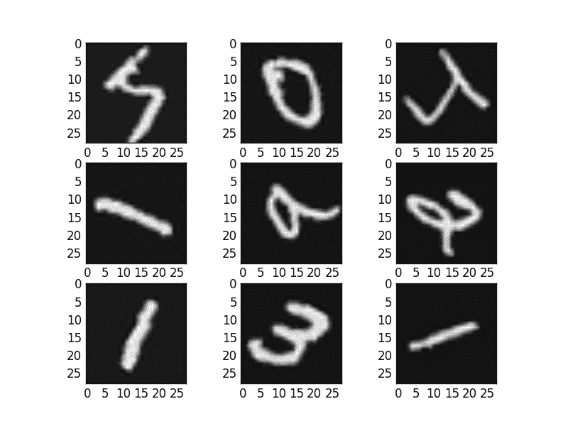
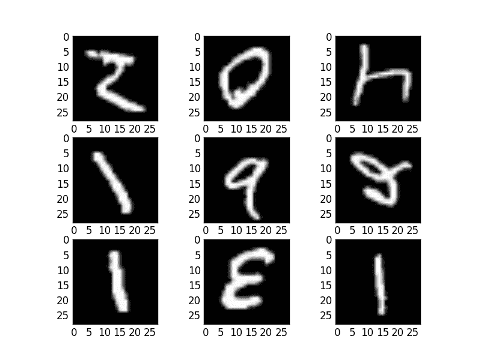

# 用 Keras 进行深度学习的图像增强

> 原文： [https://machinelearningmastery.com/image-augmentation-deep-learning-keras/](https://machinelearningmastery.com/image-augmentation-deep-learning-keras/)

使用神经网络和深度学习模型时，需要进行数据准备。更复杂的对象识别任务也需要越来越多的数据增加。

在本文中，您将了解如何在使用 Keras 开发和评估 Python 中的深度学习模型时，使用数据准备和数据增强与图像数据集。

阅读这篇文章后，你会知道：

*   关于 Keras 提供的图像增强 API 以及如何将其与模型一起使用。
*   如何执行功能标准化。
*   如何对图像执行 ZCA 白化。
*   如何使用随机旋转，移位和翻转来增加数据。
*   如何将增强的图像数据保存到磁盘。

让我们开始吧。

*   **更新**：本文中的示例已针对最新的 Keras API 进行了更新。 datagen.next（）函数已被删除。
*   **2016 年 10 月更新**：更新了 Keras 1.1.0，TensorFlow 0.10.0 和 scikit-learn v0.18 的示例。
*   **2017 年 1 月更新**：更新了 Keras 1.2.0 和 TensorFlow 0.12.1 的示例。
*   **2017 年 3 月更新**：更新了 Keras 2.0.2，TensorFlow 1.0.1 和 Theano 0.9.0 的示例。

## Keras Image Augmentation API

与 Keras 的其他部分一样，图像增强 API 简单而强大。

Keras 提供 [ImageDataGenerator](http://keras.io/preprocessing/image/) 类，用于定义图像数据准备和扩充的配置。这包括以下功能：

*   样本标准化。
*   功能标准化。
*   ZCA 美白。
*   随机旋转，移位，剪切和翻转。
*   尺寸重新排序。
*   将增强的图像保存到磁盘。

可以如下创建增强图像生成器：

```py
datagen = ImageDataGenerator()
```

API 不是在内存中对整个图像数据集执行操作，而是通过深度学习模型拟合过程进行迭代，为您及时创建增强的图像数据。这可以减少内存开销，但在模型训练期间会增加一些额外的时间成本。

创建并配置 **ImageDataGenerator** 后，必须将其放在数据上。这将计算实际执行图像数据转换所需的任何统计信息。您可以通过调用数据生成器上的 **fit（）**函数并将其传递给训练数据集来完成此操作。

```py
datagen.fit(train)
```

数据生成器本身实际上是一个迭代器，在请求时返回批量的图像样本。我们可以通过调用 **flow（）**函数来配置批量大小并准备数据生成器并获取批量图像。

```py
X_batch, y_batch = datagen.flow(train, train, batch_size=32)
```

最后我们可以使用数据生成器。我们必须调用 **fit_generator（）**函数并传入数据生成器和所需的时间长度以及总数，而不是在我们的模型上调用 **fit（）**函数。要训​​练的时代数。

```py
fit_generator(datagen, samples_per_epoch=len(train), epochs=100)
```

您可以在 Keras 文档中了解有关 Keras 图像[数据生成器 API 的更多信息。](http://keras.io/preprocessing/image/)

## 图像增强的比较点

既然您已了解 Keras 中的图像增强 API 的工作原理，那么让我们看一些示例。

我们将在这些示例中使用 MNIST 手写数字识别任务。首先，让我们看一下训练数据集中的前 9 个图像。

```py
# Plot images
from keras.datasets import mnist
from matplotlib import pyplot
# load data
(X_train, y_train), (X_test, y_test) = mnist.load_data()
# create a grid of 3x3 images
for i in range(0, 9):
	pyplot.subplot(330 + 1 + i)
	pyplot.imshow(X_train[i], cmap=pyplot.get_cmap('gray'))
# show the plot
pyplot.show()
```

运行此示例提供了以下图像，我们可以将其用作与下面示例中的图像准备和扩充进行比较的点。


示例 MNIST 图像

## 特征标准化

还可以标准化整个数据集中的像素值。这称为特征标准化，并反映了通常对表格数据集中的每列执行的标准化类型。

您可以通过在 ImageDataGenerator 类上设置 featurewise_center 和 featurewise_std_normalization 参数来执行功能标准化。实际上，默认情况下这些设置为 True，并且创建没有参数的 ImageDataGenerator 实例将具有相同的效果。

```py
# Standardize images across the dataset, mean=0, stdev=1
from keras.datasets import mnist
from keras.preprocessing.image import ImageDataGenerator
from matplotlib import pyplot
from keras import backend as K
K.set_image_dim_ordering('th')
# load data
(X_train, y_train), (X_test, y_test) = mnist.load_data()
# reshape to be [samples][pixels][width][height]
X_train = X_train.reshape(X_train.shape[0], 1, 28, 28)
X_test = X_test.reshape(X_test.shape[0], 1, 28, 28)
# convert from int to float
X_train = X_train.astype('float32')
X_test = X_test.astype('float32')
# define data preparation
datagen = ImageDataGenerator(featurewise_center=True, featurewise_std_normalization=True)
# fit parameters from data
datagen.fit(X_train)
# configure batch size and retrieve one batch of images
for X_batch, y_batch in datagen.flow(X_train, y_train, batch_size=9):
	# create a grid of 3x3 images
	for i in range(0, 9):
		pyplot.subplot(330 + 1 + i)
		pyplot.imshow(X_batch[i].reshape(28, 28), cmap=pyplot.get_cmap('gray'))
	# show the plot
	pyplot.show()
	break
```

运行此示例，您可以看到效果不同，看似变暗并使不同的数字变亮。


标准化特征 MNIST 图像

## ZCA 美白

图像的[白化变换](https://en.wikipedia.org/wiki/Whitening_transformation)是线性代数运算，其减少了像素图像矩阵中的冗余。

图像中较少的冗余旨在更好地突出图像中的结构和特征到学习算法。

通常，使用主成分分析（PCA）技术执行图像白化。最近，一种名为 [ZCA](http://ufldl.stanford.edu/wiki/index.php/Whitening) 的替代方案（[在本技术报告](http://www.cs.toronto.edu/~kriz/learning-features-2009-TR.pdf)的附录 A 中了解更多）显示了更好的结果和结果，在转换后的图像中保留了所有原始尺寸，与 PCA 不同，变换后的图像看起来仍然像他们的原件。

您可以通过将 zca_whitening 参数设置为 True 来执行 ZCA 白化转换。

```py
# ZCA whitening
from keras.datasets import mnist
from keras.preprocessing.image import ImageDataGenerator
from matplotlib import pyplot
from keras import backend as K
K.set_image_dim_ordering('th')
# load data
(X_train, y_train), (X_test, y_test) = mnist.load_data()
# reshape to be [samples][pixels][width][height]
X_train = X_train.reshape(X_train.shape[0], 1, 28, 28)
X_test = X_test.reshape(X_test.shape[0], 1, 28, 28)
# convert from int to float
X_train = X_train.astype('float32')
X_test = X_test.astype('float32')
# define data preparation
datagen = ImageDataGenerator(zca_whitening=True)
# fit parameters from data
datagen.fit(X_train)
# configure batch size and retrieve one batch of images
for X_batch, y_batch in datagen.flow(X_train, y_train, batch_size=9):
	# create a grid of 3x3 images
	for i in range(0, 9):
		pyplot.subplot(330 + 1 + i)
		pyplot.imshow(X_batch[i].reshape(28, 28), cmap=pyplot.get_cmap('gray'))
	# show the plot
	pyplot.show()
	break
```

运行该示例，您可以在图像中看到相同的一般结构，以及如何突出显示每个数字的轮廓。


ZCA 美白 MNIST 图像

## 随机旋转

有时，样本数据中的图像可能在场景中具有不同的旋转。

您可以训练模型，以便在训练期间通过人工和随机旋转数据集中的图像来更好地处理图像旋转。

下面的示例通过设置 rotation_range 参数创建最多 90 度的 MNIST 数字的随机旋转。

```py
# Random Rotations
from keras.datasets import mnist
from keras.preprocessing.image import ImageDataGenerator
from matplotlib import pyplot
from keras import backend as K
K.set_image_dim_ordering('th')
# load data
(X_train, y_train), (X_test, y_test) = mnist.load_data()
# reshape to be [samples][pixels][width][height]
X_train = X_train.reshape(X_train.shape[0], 1, 28, 28)
X_test = X_test.reshape(X_test.shape[0], 1, 28, 28)
# convert from int to float
X_train = X_train.astype('float32')
X_test = X_test.astype('float32')
# define data preparation
datagen = ImageDataGenerator(rotation_range=90)
# fit parameters from data
datagen.fit(X_train)
# configure batch size and retrieve one batch of images
for X_batch, y_batch in datagen.flow(X_train, y_train, batch_size=9):
	# create a grid of 3x3 images
	for i in range(0, 9):
		pyplot.subplot(330 + 1 + i)
		pyplot.imshow(X_batch[i].reshape(28, 28), cmap=pyplot.get_cmap('gray'))
	# show the plot
	pyplot.show()
	break
```

运行该示例，您可以看到图像已经左右旋转到 90 度的限制。这对此问题没有帮助，因为 MNIST 数字具有标准化方向，但是当从对象可能具有不同方向的照片进行学习时，这种变换可能会有所帮助。



MNIST 图像的随机旋转

## 随机移位

图像中的对象可能无法在框架中居中。他们可能以各种不同的方式偏离中心。

您可以通过人工创建训练数据的移位版本来训练您的深度学习网络以期望并且当前处理偏离中心的对象。 Keras 通过 width_shift_range 和 height_shift_range 参数支持训练数据的单独水平和垂直随机移位。

```py
# Random Shifts
from keras.datasets import mnist
from keras.preprocessing.image import ImageDataGenerator
from matplotlib import pyplot
from keras import backend as K
K.set_image_dim_ordering('th')
# load data
(X_train, y_train), (X_test, y_test) = mnist.load_data()
# reshape to be [samples][pixels][width][height]
X_train = X_train.reshape(X_train.shape[0], 1, 28, 28)
X_test = X_test.reshape(X_test.shape[0], 1, 28, 28)
# convert from int to float
X_train = X_train.astype('float32')
X_test = X_test.astype('float32')
# define data preparation
shift = 0.2
datagen = ImageDataGenerator(width_shift_range=shift, height_shift_range=shift)
# fit parameters from data
datagen.fit(X_train)
# configure batch size and retrieve one batch of images
for X_batch, y_batch in datagen.flow(X_train, y_train, batch_size=9):
	# create a grid of 3x3 images
	for i in range(0, 9):
		pyplot.subplot(330 + 1 + i)
		pyplot.imshow(X_batch[i].reshape(28, 28), cmap=pyplot.get_cmap('gray'))
	# show the plot
	pyplot.show()
	break
```

运行此示例会创建数字的移位版本。同样，这不是 MNIST 所必需的，因为手写数字已经居中，但您可以看到这对于更复杂的问题域有何用处。


随机移位的 MNIST 图像

## 随机翻转

另一种可以提高大型复杂问题表现的图像数据增强功能是在训练数据中创建随机翻转的图像。

Keras 支持使用 vertical_flip 和 horizo​​ntal_flip 参数沿垂直轴和水平轴进行随机翻转。

```py
# Random Flips
from keras.datasets import mnist
from keras.preprocessing.image import ImageDataGenerator
from matplotlib import pyplot
from keras import backend as K
K.set_image_dim_ordering('th')
# load data
(X_train, y_train), (X_test, y_test) = mnist.load_data()
# reshape to be [samples][pixels][width][height]
X_train = X_train.reshape(X_train.shape[0], 1, 28, 28)
X_test = X_test.reshape(X_test.shape[0], 1, 28, 28)
# convert from int to float
X_train = X_train.astype('float32')
X_test = X_test.astype('float32')
# define data preparation
datagen = ImageDataGenerator(horizontal_flip=True, vertical_flip=True)
# fit parameters from data
datagen.fit(X_train)
# configure batch size and retrieve one batch of images
for X_batch, y_batch in datagen.flow(X_train, y_train, batch_size=9):
	# create a grid of 3x3 images
	for i in range(0, 9):
		pyplot.subplot(330 + 1 + i)
		pyplot.imshow(X_batch[i].reshape(28, 28), cmap=pyplot.get_cmap('gray'))
	# show the plot
	pyplot.show()
	break
```

运行此示例，您可以看到翻转的数字。翻转数字没有用，因为它们总是具有正确的左右方向，但这对于场景中可以具有不同方向的对象的照片的问题可能是有用的。



随机翻转 MNIST 图像

## 将增强图像保存到文件

数据准备和增强由 Keras 及时执行。

这在内存方面很有效，但您可能需要在训练期间使用的确切图像。例如，您可能希望稍后将它们与不同的软件包一起使用，或者仅生成一次并在多个不同的深度学习模型或配置中使用它们。

Keras 允许您保存训练期间生成的图像。可以在训练之前将目录，文件名前缀和图像文件类型指定给 flow（）函数。然后，在训练期间，生成的图像将被写入文件。

下面的示例演示了这一点，并将 9 个图像写入“images”子目录，前缀为“aug”，文件类型为 PNG。

```py
# Save augmented images to file
from keras.datasets import mnist
from keras.preprocessing.image import ImageDataGenerator
from matplotlib import pyplot
import os
from keras import backend as K
K.set_image_dim_ordering('th')
# load data
(X_train, y_train), (X_test, y_test) = mnist.load_data()
# reshape to be [samples][pixels][width][height]
X_train = X_train.reshape(X_train.shape[0], 1, 28, 28)
X_test = X_test.reshape(X_test.shape[0], 1, 28, 28)
# convert from int to float
X_train = X_train.astype('float32')
X_test = X_test.astype('float32')
# define data preparation
datagen = ImageDataGenerator()
# fit parameters from data
datagen.fit(X_train)
# configure batch size and retrieve one batch of images
os.makedirs('images')
for X_batch, y_batch in datagen.flow(X_train, y_train, batch_size=9, save_to_dir='images', save_prefix='aug', save_format='png'):
	# create a grid of 3x3 images
	for i in range(0, 9):
		pyplot.subplot(330 + 1 + i)
		pyplot.imshow(X_batch[i].reshape(28, 28), cmap=pyplot.get_cmap('gray'))
	# show the plot
	pyplot.show()
	break
```

运行该示例，您可以看到图像仅在生成时写入。


增强的 MNIST 图像保存到文件

## 使用 Keras 增强图像数据的技巧

图像数据的独特之处在于，您可以查看数据和转换的数据副本，并快速了解模型如何感知模型。

以下是一些从图像数据准备和深度学习扩充中获取最多的技巧。

*   **审查数据集**。花些时间详细检查您的数据集。看看图片。记下可能有益于模型训练过程的图像准备和扩充，例如需要处理场景中对象的不同移位，旋转或翻转。
*   **审查增补**。在执行增强后查看样本图像。知识分子知道您正在使用的图像变换是一回事，看一些例子是一件非常不同的事情。使用您正在使用的单个扩充以及您计划使用的全套扩充来查看图像。您可能会看到简化或进一步增强模型训练流程的方法。
*   **评估变换套件**。尝试多个图像数据准备和增强方案。通常，您可能会对您认为不会有益的数据准备方案的结果感到惊讶。

## 摘要

在这篇文章中，您发现了图像数据准备和扩充。

您发现了一系列技术，您可以在 Python 中轻松使用 Keras 进行深度学习模型。你了解到：

*   Keras 中的 ImageDataGenerator API 用于及时生成转换后的图像。
*   采样和功能明智的像素标准化。
*   ZCA 美白变换。
*   随机旋转，移位和翻转图像。
*   如何将转换后的图像保存到文件中以供以后重用。

您对图像数据增加或此帖有任何疑问吗？在评论中提出您的问题，我会尽力回答。