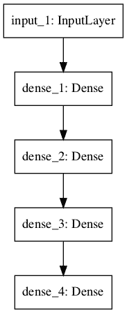
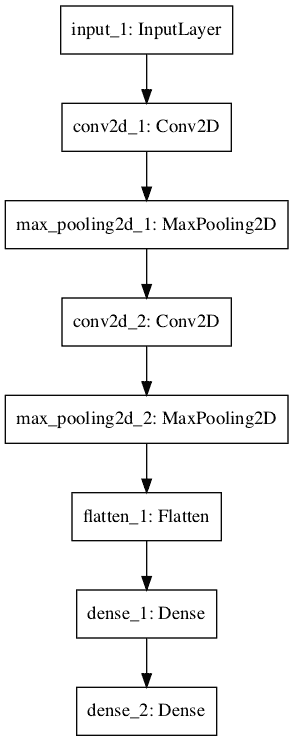
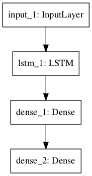
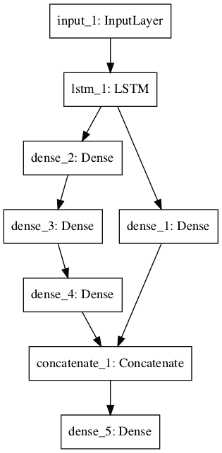
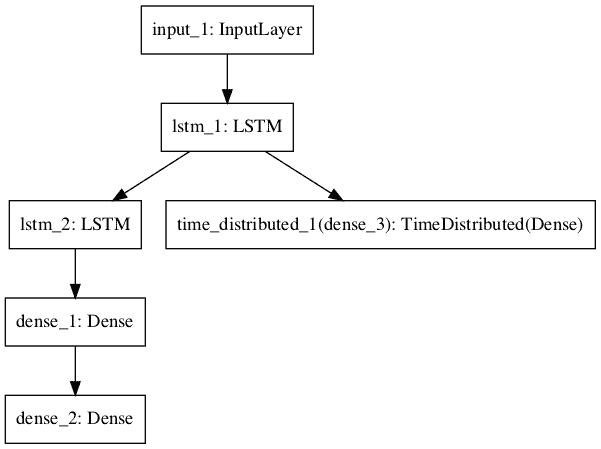

# 如何使用 Keras 函数式 API 进行深度学习

> 原文： [https://machinelearningmastery.com/keras-functional-api-deep-learning/](https://machinelearningmastery.com/keras-functional-api-deep-learning/)

Keras Python 库使创建深度学习模型变得快速而简单。

顺序 API 允许您逐层创建模型以解决大多数问题。它的局限性在于它不允许您创建共享层或具有多个输入或输出的模型。

Keras 中的功能 API 是创建模型的另一种方式，它提供了更多的灵活性，包括创建更复杂的模型。

在本教程中，您将了解如何使用 Keras 中更灵活的功能 API 来定义深度学习模型。

完成本教程后，您将了解：

*   Sequential 和 Functional API 之间的区别。
*   如何使用功能 API 定义简单的多层感知器，卷积神经网络和递归神经网络模型。
*   如何使用共享层和多个输入和输出定义更复杂的模型。

让我们开始吧。

*   **2017 年 11 月更新**：更新关于仅影响 1D 输入的输入层悬挂尺寸的注释，感谢 Joe。
*   **更新了 Nov / 2018** ：为 CNN 添加了缺失的展平层，感谢 Konstantin。
*   **更新 Nov / 2018** ：添加了功能 API Python 语法的描述。

## 教程概述

本教程分为 7 个部分;他们是：

1.  Keras 顺序模型
2.  Keras 功能模型
3.  标准网络模型
4.  共享层模型
5.  多种输入和输出模型
6.  最佳实践
7.  **NEW** ：关于 Functional API Python 语法的注释

## 1\. Keras 顺序模型

作为评论，Keras 提供了 Sequential 模型 API。

这是一种创建深度学习模型的方法，其中创建了 Sequential 类的实例并创建了模型层并将其添加到其中。

例如，可以定义层并将其作为数组传递给 Sequential：

```py
from keras.models import Sequential
from keras.layers import Dense
model = Sequential([Dense(2, input_dim=1), Dense(1)])
```

层也可以分段添加：

```py
from keras.models import Sequential
from keras.layers import Dense
model = Sequential()
model.add(Dense(2, input_dim=1))
model.add(Dense(1))
```

Sequential 模型 API 非常适合在大多数情况下开发深度学习模型，但它也有一些局限性。

例如，定义可能具有多个不同输入源的模型，生成多个输出目标或重用层的模型并不简单。

## 2\. Keras 功能模型

Keras 功能 API 为定义模型提供了更灵活的方式。

它特别允许您定义多个输入或输出模型以及共享层的模型。更重要的是，它允许您定义 ad hoc 非循环网络图。

通过创建层实例并将它们成对地直接相互连接来定义模型，然后定义一个模型，该模型指定用作模型输入和输出的层。

让我们依次看看 Keras 功能 API 的三个独特方面：

### 1.定义输入

与 Sequential 模型不同，您必须创建并定义一个指定输入数据形状的独立输入层。

输入层采用 shape 参数，该参数是指示输入数据的维度的元组。

当输入数据是一维的时，例如对于多层感知器，形状必须明确留出空间，以便在训练网络时分割数据时使用的小批量大小的形状。因此，当输入是一维（2，）时，形状元组总是用挂起的最后一个维度定义，例如：

```py
from keras.layers import Input
visible = Input(shape=(2,))
```

### 2.连接层

模型中的层成对连接。

这是通过在定义每个新层时指定输入的来源来完成的。使用括号表示法，使得在创建层之后，指定从其输入当前层的层。

让我们用一个简短的例子来说明这一点。我们可以像上面那样创建输入层，然后创建一个隐藏层作为 Dense，它只接收来自输入层的输入。

```py
from keras.layers import Input
from keras.layers import Dense
visible = Input(shape=(2,))
hidden = Dense(2)(visible)
```

注意创建 Dense 层之后的（可见），该层将输入层输出连接为密集隐藏层的输入。

正是这种逐层连接层的方式为功能 API 提供了灵活性。例如，您可以看到开始定义层的特殊图形是多么容易。

### 3.创建模型

创建所有模型层并将它们连接在一起后，必须定义模型。

与 Sequential API 一样，模型是您可以汇总，拟合，评估和用于进行预测的模型。

Keras 提供了一个 Model 类，您可以使用它从创建的层创建模型。它要求您只指定输入和输出层。例如：

```py
from keras.models import Model
from keras.layers import Input
from keras.layers import Dense
visible = Input(shape=(2,))
hidden = Dense(2)(visible)
model = Model(inputs=visible, outputs=hidden)
```

现在我们已经了解了 Keras 功能 API 的所有关键部分，让我们通过定义一套不同的模型并使用它来构建一些实践。

每个示例都是可执行的，并打印结构并创建图表。我建议您为自己的模型执行此操作，以明确您已定义的内容。

我希望这些示例在您希望将来使用功能 API 定义自己的模型时为您提供模板。

## 3.标准网络模型

在开始使用功能 API 时，最好先了解一些标准神经网络模型的定义。

在本节中，我们将研究定义一个简单的多层感知器，卷积神经网络和递归神经网络。

这些示例将为以后更详细的示例提供基础。

### 多层感知器

在本节中，我们定义了用于二元分类的多层 Perceptron 模型。

该模型具有 10 个输入，3 个具有 10,20 和 10 个神经元的隐藏层，以及具有 1 个输出的输出层。在每个隐藏层中使用校正的线性激活函数，并且在输出层中使用 S 形激活函数，用于二元分类。

```py
# Multilayer Perceptron
from keras.utils import plot_model
from keras.models import Model
from keras.layers import Input
from keras.layers import Dense
visible = Input(shape=(10,))
hidden1 = Dense(10, activation='relu')(visible)
hidden2 = Dense(20, activation='relu')(hidden1)
hidden3 = Dense(10, activation='relu')(hidden2)
output = Dense(1, activation='sigmoid')(hidden3)
model = Model(inputs=visible, outputs=output)
# summarize layers
print(model.summary())
# plot graph
plot_model(model, to_file='multilayer_perceptron_graph.png')
```

运行该示例将打印网络结构。

```py
_________________________________________________________________
Layer (type)                 Output Shape              Param #
=================================================================
input_1 (InputLayer)         (None, 10)                0
_________________________________________________________________
dense_1 (Dense)              (None, 10)                110
_________________________________________________________________
dense_2 (Dense)              (None, 20)                220
_________________________________________________________________
dense_3 (Dense)              (None, 10)                210
_________________________________________________________________
dense_4 (Dense)              (None, 1)                 11
=================================================================
Total params: 551
Trainable params: 551
Non-trainable params: 0
_________________________________________________________________
```

还会创建模型图的图并将其保存到文件中。



多层感知器网络图

### 卷积神经网络

在本节中，我们将定义用于图像分类的卷积神经网络。

该模型接收黑白 64×64 图像作为输入，然后具有两个卷积和池化层的序列作为特征提取器，接着是完全连接的层来解释特征，输出层具有用于两类预测的 S 形激活。

```py
# Convolutional Neural Network
from keras.utils import plot_model
from keras.models import Model
from keras.layers import Input
from keras.layers import Dense
from keras.layers import Flatten
from keras.layers.convolutional import Conv2D
from keras.layers.pooling import MaxPooling2D
visible = Input(shape=(64,64,1))
conv1 = Conv2D(32, kernel_size=4, activation='relu')(visible)
pool1 = MaxPooling2D(pool_size=(2, 2))(conv1)
conv2 = Conv2D(16, kernel_size=4, activation='relu')(pool1)
pool2 = MaxPooling2D(pool_size=(2, 2))(conv2)
flat = Flatten()(pool2)
hidden1 = Dense(10, activation='relu')(flat)
output = Dense(1, activation='sigmoid')(hidden1)
model = Model(inputs=visible, outputs=output)
# summarize layers
print(model.summary())
# plot graph
plot_model(model, to_file='convolutional_neural_network.png')
```

运行该示例总结了模型层。

```py
_________________________________________________________________
Layer (type)                 Output Shape              Param #   
=================================================================
input_1 (InputLayer)         (None, 64, 64, 1)         0         
_________________________________________________________________
conv2d_1 (Conv2D)            (None, 61, 61, 32)        544       
_________________________________________________________________
max_pooling2d_1 (MaxPooling2 (None, 30, 30, 32)        0         
_________________________________________________________________
conv2d_2 (Conv2D)            (None, 27, 27, 16)        8208      
_________________________________________________________________
max_pooling2d_2 (MaxPooling2 (None, 13, 13, 16)        0         
_________________________________________________________________
flatten_1 (Flatten)          (None, 2704)              0         
_________________________________________________________________
dense_1 (Dense)              (None, 10)                27050     
_________________________________________________________________
dense_2 (Dense)              (None, 1)                 11        
=================================================================
Total params: 35,813
Trainable params: 35,813
Non-trainable params: 0
_________________________________________________________________
```

还会创建模型图的图并将其保存到文件中。



卷积神经网络图

### 递归神经网络

在本节中，我们将定义一个用于序列分类的长期短期记忆递归神经网络。

该模型需要 100 个时间步长作为输入。该模型具有单个 LSTM 隐藏层以从序列中提取特征，随后是完全连接的层以解释 LSTM 输出，接着是用于进行二元预测的输出层。

```py
# Recurrent Neural Network
from keras.utils import plot_model
from keras.models import Model
from keras.layers import Input
from keras.layers import Dense
from keras.layers.recurrent import LSTM
visible = Input(shape=(100,1))
hidden1 = LSTM(10)(visible)
hidden2 = Dense(10, activation='relu')(hidden1)
output = Dense(1, activation='sigmoid')(hidden2)
model = Model(inputs=visible, outputs=output)
# summarize layers
print(model.summary())
# plot graph
plot_model(model, to_file='recurrent_neural_network.png')
```

运行该示例总结了模型层。

```py
_________________________________________________________________
Layer (type)                 Output Shape              Param #
=================================================================
input_1 (InputLayer)         (None, 100, 1)            0
_________________________________________________________________
lstm_1 (LSTM)                (None, 10)                480
_________________________________________________________________
dense_1 (Dense)              (None, 10)                110
_________________________________________________________________
dense_2 (Dense)              (None, 1)                 11
=================================================================
Total params: 601
Trainable params: 601
Non-trainable params: 0
_________________________________________________________________
```

还会创建模型图的图并将其保存到文件中。



递归神经网络图

## 4.共享层模型

多个层可以共享一个层的输出。

例如，可以存在来自输入的多个不同的特征提取层，或者用于解释来自特征提取层的输出的多个层。

让我们看看这两个例子。

### 共享输入层

在本节中，我们定义了具有不同大小内核的多个卷积层来解释图像输入。

该模型采用尺寸为 64×64 像素的黑白图像。有两个共享此输入的 CNN 特征提取子模型;第一个内核大小为 4，第二个内核大小为 8.这些特征提取子模型的输出被平展为向量并连接成一个长向量，并传递到完全连接的层以进行解释，然后最终输出层生成二元分类。

```py
# Shared Input Layer
from keras.utils import plot_model
from keras.models import Model
from keras.layers import Input
from keras.layers import Dense
from keras.layers import Flatten
from keras.layers.convolutional import Conv2D
from keras.layers.pooling import MaxPooling2D
from keras.layers.merge import concatenate
# input layer
visible = Input(shape=(64,64,1))
# first feature extractor
conv1 = Conv2D(32, kernel_size=4, activation='relu')(visible)
pool1 = MaxPooling2D(pool_size=(2, 2))(conv1)
flat1 = Flatten()(pool1)
# second feature extractor
conv2 = Conv2D(16, kernel_size=8, activation='relu')(visible)
pool2 = MaxPooling2D(pool_size=(2, 2))(conv2)
flat2 = Flatten()(pool2)
# merge feature extractors
merge = concatenate([flat1, flat2])
# interpretation layer
hidden1 = Dense(10, activation='relu')(merge)
# prediction output
output = Dense(1, activation='sigmoid')(hidden1)
model = Model(inputs=visible, outputs=output)
# summarize layers
print(model.summary())
# plot graph
plot_model(model, to_file='shared_input_layer.png')
```

运行该示例总结了模型层。

```py
____________________________________________________________________________________________________
Layer (type)                     Output Shape          Param #     Connected to
====================================================================================================
input_1 (InputLayer)             (None, 64, 64, 1)     0
____________________________________________________________________________________________________
conv2d_1 (Conv2D)                (None, 61, 61, 32)    544         input_1[0][0]
____________________________________________________________________________________________________
conv2d_2 (Conv2D)                (None, 57, 57, 16)    1040        input_1[0][0]
____________________________________________________________________________________________________
max_pooling2d_1 (MaxPooling2D)   (None, 30, 30, 32)    0           conv2d_1[0][0]
____________________________________________________________________________________________________
max_pooling2d_2 (MaxPooling2D)   (None, 28, 28, 16)    0           conv2d_2[0][0]
____________________________________________________________________________________________________
flatten_1 (Flatten)              (None, 28800)         0           max_pooling2d_1[0][0]
____________________________________________________________________________________________________
flatten_2 (Flatten)              (None, 12544)         0           max_pooling2d_2[0][0]
____________________________________________________________________________________________________
concatenate_1 (Concatenate)      (None, 41344)         0           flatten_1[0][0]
                                                                   flatten_2[0][0]
____________________________________________________________________________________________________
dense_1 (Dense)                  (None, 10)            413450      concatenate_1[0][0]
____________________________________________________________________________________________________
dense_2 (Dense)                  (None, 1)             11          dense_1[0][0]
====================================================================================================
Total params: 415,045
Trainable params: 415,045
Non-trainable params: 0
____________________________________________________________________________________________________
```

还会创建模型图的图并将其保存到文件中。


具有共享输入的神经网络图

### 共享特征提取层

在本节中，我们将使用两个并行子模型来解释 LSTM 特征提取器的输出以进行序列分类。

模型的输入是 1 个特征的 100 个时间步长。具有 10 个存储器单元的 LSTM 层解释该序列。第一个解释模型是浅单个完全连接层，第二个是深 3 层模型。两个解释模型的输出被连接成一个长向量，该向量被传递到用于进行二进制预测的输出层。

```py
# Shared Feature Extraction Layer
from keras.utils import plot_model
from keras.models import Model
from keras.layers import Input
from keras.layers import Dense
from keras.layers.recurrent import LSTM
from keras.layers.merge import concatenate
# define input
visible = Input(shape=(100,1))
# feature extraction
extract1 = LSTM(10)(visible)
# first interpretation model
interp1 = Dense(10, activation='relu')(extract1)
# second interpretation model
interp11 = Dense(10, activation='relu')(extract1)
interp12 = Dense(20, activation='relu')(interp11)
interp13 = Dense(10, activation='relu')(interp12)
# merge interpretation
merge = concatenate([interp1, interp13])
# output
output = Dense(1, activation='sigmoid')(merge)
model = Model(inputs=visible, outputs=output)
# summarize layers
print(model.summary())
# plot graph
plot_model(model, to_file='shared_feature_extractor.png')
```

运行该示例总结了模型层。

```py
____________________________________________________________________________________________________
Layer (type)                     Output Shape          Param #     Connected to
====================================================================================================
input_1 (InputLayer)             (None, 100, 1)        0
____________________________________________________________________________________________________
lstm_1 (LSTM)                    (None, 10)            480         input_1[0][0]
____________________________________________________________________________________________________
dense_2 (Dense)                  (None, 10)            110         lstm_1[0][0]
____________________________________________________________________________________________________
dense_3 (Dense)                  (None, 20)            220         dense_2[0][0]
____________________________________________________________________________________________________
dense_1 (Dense)                  (None, 10)            110         lstm_1[0][0]
____________________________________________________________________________________________________
dense_4 (Dense)                  (None, 10)            210         dense_3[0][0]
____________________________________________________________________________________________________
concatenate_1 (Concatenate)      (None, 20)            0           dense_1[0][0]
                                                                   dense_4[0][0]
____________________________________________________________________________________________________
dense_5 (Dense)                  (None, 1)             21          concatenate_1[0][0]
====================================================================================================
Total params: 1,151
Trainable params: 1,151
Non-trainable params: 0
____________________________________________________________________________________________________
```

还会创建模型图的图并将其保存到文件中。



共享特征提取层的神经网络图

## 5.多种输入和输出模型

功能 API 还可用于开发具有多个输入的更复杂模型，可能具有不同的模态。它还可用于开发产生多个输出的模型。

我们将在本节中查看每个示例。

### 多输入模型

我们将开发一种图像分类模型，该模型将图像的两个版本作为输入，每个版本具有不同的大小。特别是黑白 64×64 版和 32×32 版。单独的特征提取 CNN 模型对每个模型进行操作，然后将两个模型的结果连接起来进行解释和最终预测。

请注意，在创建 Model（）实例时，我们将两个输入层定义为数组。特别：

```py
model = Model(inputs=[visible1, visible2], outputs=output)
```

下面列出了完整的示例。

```py
# Multiple Inputs
from keras.utils import plot_model
from keras.models import Model
from keras.layers import Input
from keras.layers import Dense
from keras.layers import Flatten
from keras.layers.convolutional import Conv2D
from keras.layers.pooling import MaxPooling2D
from keras.layers.merge import concatenate
# first input model
visible1 = Input(shape=(64,64,1))
conv11 = Conv2D(32, kernel_size=4, activation='relu')(visible1)
pool11 = MaxPooling2D(pool_size=(2, 2))(conv11)
conv12 = Conv2D(16, kernel_size=4, activation='relu')(pool11)
pool12 = MaxPooling2D(pool_size=(2, 2))(conv12)
flat1 = Flatten()(pool12)
# second input model
visible2 = Input(shape=(32,32,3))
conv21 = Conv2D(32, kernel_size=4, activation='relu')(visible2)
pool21 = MaxPooling2D(pool_size=(2, 2))(conv21)
conv22 = Conv2D(16, kernel_size=4, activation='relu')(pool21)
pool22 = MaxPooling2D(pool_size=(2, 2))(conv22)
flat2 = Flatten()(pool22)
# merge input models
merge = concatenate([flat1, flat2])
# interpretation model
hidden1 = Dense(10, activation='relu')(merge)
hidden2 = Dense(10, activation='relu')(hidden1)
output = Dense(1, activation='sigmoid')(hidden2)
model = Model(inputs=[visible1, visible2], outputs=output)
# summarize layers
print(model.summary())
# plot graph
plot_model(model, to_file='multiple_inputs.png')
```

运行该示例总结了模型层。

```py
____________________________________________________________________________________________________
Layer (type)                     Output Shape          Param #     Connected to
====================================================================================================
input_1 (InputLayer)             (None, 64, 64, 1)     0
____________________________________________________________________________________________________
input_2 (InputLayer)             (None, 32, 32, 3)     0
____________________________________________________________________________________________________
conv2d_1 (Conv2D)                (None, 61, 61, 32)    544         input_1[0][0]
____________________________________________________________________________________________________
conv2d_3 (Conv2D)                (None, 29, 29, 32)    1568        input_2[0][0]
____________________________________________________________________________________________________
max_pooling2d_1 (MaxPooling2D)   (None, 30, 30, 32)    0           conv2d_1[0][0]
____________________________________________________________________________________________________
max_pooling2d_3 (MaxPooling2D)   (None, 14, 14, 32)    0           conv2d_3[0][0]
____________________________________________________________________________________________________
conv2d_2 (Conv2D)                (None, 27, 27, 16)    8208        max_pooling2d_1[0][0]
____________________________________________________________________________________________________
conv2d_4 (Conv2D)                (None, 11, 11, 16)    8208        max_pooling2d_3[0][0]
____________________________________________________________________________________________________
max_pooling2d_2 (MaxPooling2D)   (None, 13, 13, 16)    0           conv2d_2[0][0]
____________________________________________________________________________________________________
max_pooling2d_4 (MaxPooling2D)   (None, 5, 5, 16)      0           conv2d_4[0][0]
____________________________________________________________________________________________________
flatten_1 (Flatten)              (None, 2704)          0           max_pooling2d_2[0][0]
____________________________________________________________________________________________________
flatten_2 (Flatten)              (None, 400)           0           max_pooling2d_4[0][0]
____________________________________________________________________________________________________
concatenate_1 (Concatenate)      (None, 3104)          0           flatten_1[0][0]
                                                                   flatten_2[0][0]
____________________________________________________________________________________________________
dense_1 (Dense)                  (None, 10)            31050       concatenate_1[0][0]
____________________________________________________________________________________________________
dense_2 (Dense)                  (None, 10)            110         dense_1[0][0]
____________________________________________________________________________________________________
dense_3 (Dense)                  (None, 1)             11          dense_2[0][0]
====================================================================================================
Total params: 49,699
Trainable params: 49,699
Non-trainable params: 0
____________________________________________________________________________________________________
```

还会创建模型图的图并将其保存到文件中。


多输入神经网络图

### 多输出模型

在本节中，我们将开发一个模型，该模型可以进行两种不同类型的预测。给定一个特征的 100 个时间步长的输入序列，该模型将对序列进行分类并输出具有相同长度的新序列。

LSTM 层解释输入序列并返回每个时间步的隐藏状态。第一个输出模型创建堆叠 LSTM，解释特征并进行二元预测。第二输出模型使用相同的输出层对每个输入时间步进行实值预测。

```py
# Multiple Outputs
from keras.utils import plot_model
from keras.models import Model
from keras.layers import Input
from keras.layers import Dense
from keras.layers.recurrent import LSTM
from keras.layers.wrappers import TimeDistributed
# input layer
visible = Input(shape=(100,1))
# feature extraction
extract = LSTM(10, return_sequences=True)(visible)
# classification output
class11 = LSTM(10)(extract)
class12 = Dense(10, activation='relu')(class11)
output1 = Dense(1, activation='sigmoid')(class12)
# sequence output
output2 = TimeDistributed(Dense(1, activation='linear'))(extract)
# output
model = Model(inputs=visible, outputs=[output1, output2])
# summarize layers
print(model.summary())
# plot graph
plot_model(model, to_file='multiple_outputs.png')
```

运行该示例总结了模型层。

```py
____________________________________________________________________________________________________
Layer (type)                     Output Shape          Param #     Connected to
====================================================================================================
input_1 (InputLayer)             (None, 100, 1)        0
____________________________________________________________________________________________________
lstm_1 (LSTM)                    (None, 100, 10)       480         input_1[0][0]
____________________________________________________________________________________________________
lstm_2 (LSTM)                    (None, 10)            840         lstm_1[0][0]
____________________________________________________________________________________________________
dense_1 (Dense)                  (None, 10)            110         lstm_2[0][0]
____________________________________________________________________________________________________
dense_2 (Dense)                  (None, 1)             11          dense_1[0][0]
____________________________________________________________________________________________________
time_distributed_1 (TimeDistribu (None, 100, 1)        11          lstm_1[0][0]
====================================================================================================
Total params: 1,452
Trainable params: 1,452
Non-trainable params: 0
____________________________________________________________________________________________________
```

还会创建模型图的图并将其保存到文件中。



具有多个输出的神经网络图

## 6.最佳实践

在本节中，我想给您一些提示，以便在定义自己的模型时充分利用功能 API。

*   **一致的变量名称**。对输入（可见）和输出层（输出）使用相同的变量名称，甚至可能使用隐藏层（hidden1，hidden2）。它将有助于将事物正确连接在一起。
*   **审查层摘要**。始终打印模型摘要并查看层输出，以确保模型按预期连接在一起。
*   **审查图形图**。始终创建模型图的图并对其进行检查，以确保按照您的意图将所有内容放在一起。
*   **命名层**。您可以为查看模型图的摘要和图时使用的层指定名称。例如：Dense（1，name ='hidden1'）。
*   **单独的子模型**。考虑分离子模型的开发并在最后将子模型组合在一起。

使用功能 API 时，您有自己的最佳实践技巧吗？
请在评论中告诉我。

## 7.关于 Functional API Python 语法的注释

如果您是 Python 的新手或新手，功能 API 中使用的语法可能会令人困惑。

例如，给定：

```py
...
dense1 = Dense(32)(input)
...
```

**双括号语法有什么作用？**

**这是什么意思？**

它看起来很混乱，但它不是一个特殊的 python 东西，只有一行做两件事。

第一个括号“_（32）_”通过类构造函数创建层，第二个括号“_（输入）_”是一个没有通过 ___call __ 实现名称的函数（ ）_ 功能，调用时会连接各层。

[__call __（）](https://docs.python.org/3/reference/datamodel.html#object.__call__)函数是所有可以被覆盖的 Python 对象的默认函数，用于“_ 调用 _”实例化对象。就像 [__init __（）](https://docs.python.org/3/reference/datamodel.html#object.__init__)函数是在实例化一个对象以初始化它之后调用的所有对象上的默认函数。

我们可以用两行来做同样的事情：

```py
# create layer
dense1 = Dense(32)
# connect layer to previous layer
dense1(input)
```

我想我们也可以明确地调用对象上的 ___call __（）_ 函数，虽然我从未尝试过：

```py
# create layer
dense1 = Dense(32)
# connect layer to previous layer
dense1.__call_(input)
```

## 进一步阅读

如果您要深入了解，本节将提供有关该主题的更多资源。

*   [顺序模型 API](https://keras.io/models/model/)
*   [Keras 顺序模型入门](https://keras.io/models/model/)
*   [Keras 功能 API 入门](https://keras.io/models/model/)
*   [模型类功能 API](https://keras.io/models/model/)

## 摘要

在本教程中，您了解了如何使用 Keras 中的功能 API 来定义简单和复杂的深度学习模型。

具体来说，你学到了：

*   Sequential 和 Functional API 之间的区别。
*   如何使用功能 API 定义简单的多层感知器，卷积神经网络和递归神经网络模型。
*   如何使用共享层和多个输入和输出定义更复杂的模型。

你有任何问题吗？
在下面的评论中提出您的问题，我会尽力回答。