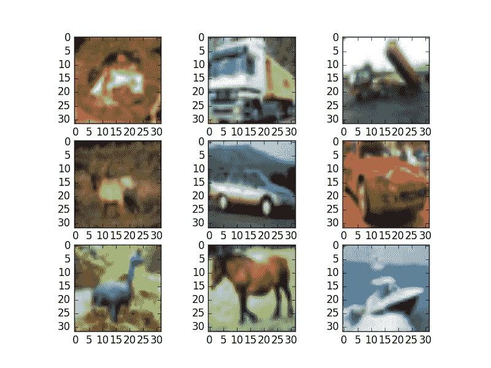

# 基于卷积神经网络的 Keras 深度学习库中的目标识别

> 原文： [https://machinelearningmastery.com/object-recognition-convolutional-neural-networks-keras-deep-learning-library/](https://machinelearningmastery.com/object-recognition-convolutional-neural-networks-keras-deep-learning-library/)

Keras 是一个用于深度学习的 Python 库，它包含强大的数值库 Theano 和 TensorFlow。

传统神经网络衰落的一个难题是物体识别。这是模型能够识别图像中的对象的地方。

在这篇文章中，您将了解如何开发和评估 Keras 中用于对象识别的深度学习模型。完成本教程后，您将了解：

*   关于 CIFAR-10 对象识别数据集以及如何在 Keras 中加载和使用它。
*   如何创建一个简单的卷积神经网络进行对象识别。
*   如何通过创建更深层次的卷积神经网络来提升表现。

让我们开始吧。

*   **2016 年 10 月更新**：更新了 Keras 1.1.0 和 TensorFlow 0.10.0 的示例。
*   **2017 年 3 月更新**：更新了 Keras 2.0.2，TensorFlow 1.0.1 和 Theano 0.9.0 的示例。

## CIFAR-10 问题描述

由于物体，位置，照明等几乎无限多的排列，因此难以自动识别照片中的物体。这是一个非常难的问题。

这是计算机视觉中一个经过充分研究的问题，最近也是深度学习能力的重要证明。 [加拿大高级研究所（CIFAR）](https://en.wikipedia.org/wiki/Canadian_Institute_for_Advanced_Research)开发了针对该问题的标准计算机视觉和深度学习数据集。

[CIFAR-10 数据集](http://www.cs.toronto.edu/~kriz/cifar.html)由 60,000 张照片组成，分为 10 个类别（因此命名为 CIFAR-10）。课程包括飞机，汽车，鸟类，猫等常见物品。数据集以标准方式分割，其中 50,000 个图像用于训练模型，剩余的 10,000 个用于评估其表现。

这些照片的颜色为红色，绿色和蓝色，但很小，尺寸为 32 x 32 像素。

使用非常大的卷积神经网络实现了现有技术的结果。您可以在 Rodrigo Benenson 的网页上了解 [CIFAR-10 的结果状态。模型表现以分类准确度报告，非常好的表现超过 90％，人类在该问题上的表现为 94％，而在撰写本文时，最先进的结果为 96％。](http://rodrigob.github.io/are_we_there_yet/build/classification_datasets_results.html#43494641522d3130)

有一个 [Kaggle 比赛使用了 CIFAR-10 数据集](https://www.kaggle.com/c/cifar-10)。这是一个加入讨论开发问题的新模型，并以模型和脚本为起点的好地方。

## 在 Keras 中加载 CIFAR-10 数据集

CIFAR-10 数据集可以轻松加载到 Keras 中。

Keras 可以自动下载 CIFAR-10 等标准数据集，并使用 cifar10.load_data（）函数将它们存储在〜/ .keras / datasets 目录中。此数据集很大，为 163 兆字节，因此下载可能需要几分钟。

下载后，对该函数的后续调用将加载准备好使用的数据集。

数据集存储为酸洗训练和测试集，准备在 Keras 中使用。每个图像表示为三维矩阵，具有红色，绿色，蓝色，宽度和高度的尺寸。我们可以使用 [matplotlib](http://matplotlib.org/) 直接绘制图像。

```py
# Plot ad hoc CIFAR10 instances
from keras.datasets import cifar10
from matplotlib import pyplot
from scipy.misc import toimage
# load data
(X_train, y_train), (X_test, y_test) = cifar10.load_data()
# create a grid of 3x3 images
for i in range(0, 9):
	pyplot.subplot(330 + 1 + i)
	pyplot.imshow(toimage(X_train[i]))
# show the plot
pyplot.show()
```

运行代码可创建 3×3 的照片。图像已经从 32×32 的小尺寸放大，但你可以清楚地看到卡车马和汽车。您还可以在一些强制为方形宽高比的图像中看到一些失真。



CIFAR-10 图像的小样本

## CIFAR-10 的简单卷积神经网络

使用卷积神经网络（CNN）可以最好地解决 CIFAR-10 问题。

我们可以通过定义本例中需要的所有类和函数来快速入门。

```py
# Simple CNN model for CIFAR-10
import numpy
from keras.datasets import cifar10
from keras.models import Sequential
from keras.layers import Dense
from keras.layers import Dropout
from keras.layers import Flatten
from keras.constraints import maxnorm
from keras.optimizers import SGD
from keras.layers.convolutional import Conv2D
from keras.layers.convolutional import MaxPooling2D
from keras.utils import np_utils
from keras import backend as K
K.set_image_dim_ordering('th')
```

好的做法是，我们接下来用常数初始化随机数种子，以确保结果可重复。

```py
# fix random seed for reproducibility
seed = 7
numpy.random.seed(seed)
```

接下来，我们可以加载 CIFAR-10 数据集。

```py
# load data
(X_train, y_train), (X_test, y_test) = cifar10.load_data()
```

对于红色，绿色和蓝色通道中的每一个，像素值在 0 到 255 的范围内。

使用标准化数据是一种很好的做法。因为输入值很好理解，所以我们可以通过将每个值除以最大值 255 来轻松归一化到 0 到 1 的范围。

注意，数据作为整数加载，因此我们必须将其转换为浮点值才能执行除法。

```py
# normalize inputs from 0-255 to 0.0-1.0
X_train = X_train.astype('float32')
X_test = X_test.astype('float32')
X_train = X_train / 255.0
X_test = X_test / 255.0
```

输出变量定义为每个类从 0 到 1 的整数向量。

我们可以使用一个热编码将它们转换为二进制矩阵，以便最好地对分类问题进行建模。我们知道这个问题有 10 个类，所以我们可以期望二进制矩阵的宽度为 10。

```py
# one hot encode outputs
y_train = np_utils.to_categorical(y_train)
y_test = np_utils.to_categorical(y_test)
num_classes = y_test.shape[1]
```

让我们首先将一个简单的 CNN 结构定义为基线，并评估它对问题的执行情况。

我们将使用具有两个卷积层的结构，然后进行最大池化并将网络展平为完全连接的层以进行预测。

我们的基线网络结构可归纳如下：

1.  卷积输入层，32 个大小为 3×3 的特征映射，整流器激活函数和最大范数的权重约束设置为 3。
2.  dropout率设定为 20％。
3.  卷积层，32 个特征映射，大小为 3×3，整流器激活函数和最大范数的权重约束设置为 3。
4.  Max Pool 层，大小为 2×2。
5.  展平层。
6.  完全连接的层具有 512 个单元和整流器激活功能。
7.  dropout率设定为 50％。
8.  完全连接的输出层，10 个单元和 softmax 激活功能。

对数损失函数与随机梯度下降优化算法一起使用，该算法配置有大动量和重量衰减开始，学习率为 0.01。

```py
# Create the model
model = Sequential()
model.add(Conv2D(32, (3, 3), input_shape=(3, 32, 32), padding='same', activation='relu', kernel_constraint=maxnorm(3)))
model.add(Dropout(0.2))
model.add(Conv2D(32, (3, 3), activation='relu', padding='same', kernel_constraint=maxnorm(3)))
model.add(MaxPooling2D(pool_size=(2, 2)))
model.add(Flatten())
model.add(Dense(512, activation='relu', kernel_constraint=maxnorm(3)))
model.add(Dropout(0.5))
model.add(Dense(num_classes, activation='softmax'))
# Compile model
epochs = 25
lrate = 0.01
decay = lrate/epochs
sgd = SGD(lr=lrate, momentum=0.9, decay=decay, nesterov=False)
model.compile(loss='categorical_crossentropy', optimizer=sgd, metrics=['accuracy'])
print(model.summary())
```

我们可以将这个模型与 25 个时期和 32 个批量大小相匹配。

选择了少量的时代来帮助保持本教程的发展。通常，对于该问题，时期的数量将是一个或两个数量级。

一旦模型适合，我们在测试数据集上对其进行评估并打印出分类准确度。

```py
# Fit the model
model.fit(X_train, y_train, validation_data=(X_test, y_test), epochs=epochs, batch_size=32)
# Final evaluation of the model
scores = model.evaluate(X_test, y_test, verbose=0)
print("Accuracy: %.2f%%" % (scores[1]*100))
```

运行此示例提供以下结果。首先总结网络结构，确认我们的设计是正确实施的。

```py
_________________________________________________________________
Layer (type)                 Output Shape              Param #   
=================================================================
conv2d_1 (Conv2D)            (None, 32, 32, 32)        896       
_________________________________________________________________
dropout_1 (Dropout)          (None, 32, 32, 32)        0         
_________________________________________________________________
conv2d_2 (Conv2D)            (None, 32, 32, 32)        9248      
_________________________________________________________________
max_pooling2d_1 (MaxPooling2 (None, 32, 16, 16)        0         
_________________________________________________________________
flatten_1 (Flatten)          (None, 8192)              0         
_________________________________________________________________
dense_1 (Dense)              (None, 512)               4194816   
_________________________________________________________________
dropout_2 (Dropout)          (None, 512)               0         
_________________________________________________________________
dense_2 (Dense)              (None, 10)                5130      
=================================================================
Total params: 4,210,090.0
Trainable params: 4,210,090.0
Non-trainable params: 0.0
_________________________________________________________________
```

在训练和测试数据集的每个时期打印分类准确度和损失。该模型在测试装置上进行评估，达到 70.85％的准确度，这并不是很好。

```py
...
Epoch 20/25
50000/50000 [==============================] - 143s - loss: 0.2858 - acc: 0.9011 - val_loss: 1.0091 - val_acc: 0.7063
Epoch 21/25
50000/50000 [==============================] - 143s - loss: 0.2693 - acc: 0.9067 - val_loss: 1.0122 - val_acc: 0.7069
Epoch 22/25
50000/50000 [==============================] - 143s - loss: 0.2544 - acc: 0.9119 - val_loss: 1.0240 - val_acc: 0.7097
Epoch 23/25
50000/50000 [==============================] - 143s - loss: 0.2399 - acc: 0.9168 - val_loss: 1.0680 - val_acc: 0.7077
Epoch 24/25
50000/50000 [==============================] - 143s - loss: 0.2285 - acc: 0.9197 - val_loss: 1.0702 - val_acc: 0.7119
Epoch 25/25
50000/50000 [==============================] - 143s - loss: 0.2177 - acc: 0.9238 - val_loss: 1.0686 - val_acc: 0.7085
Accuracy: 70.85%
```

我们可以通过创建更深入的网络来显着提高准确性。这是我们将在下一节中看到的内容。

## 用于 CIFAR-10 的更大卷积神经网络

我们已经看到一个简单的 CNN 在这个复杂的问题上表现不佳。在本节中，我们将着眼于扩大模型的大小和复杂性。

让我们设计上面简单 CNN 的深层版本。我们可以引入额外的一轮卷积以及更多的特征映射。我们将使用相同的 Convolutional，Dropout，Convolutional 和 Max Pooling 层模式。

使用 32,64 和 128 个要素贴图将重复此模式 3 次。效果是在给定最大池层的情况下，越来越多的特征图具有越来越小的尺寸。最后，将在网络的输出端使用额外的更大的 Dense 层，以尝试更好地将大量要素图转换为类值。

我们可以总结一个新的网络架构如下：

*   卷积输入层，32 个大小为 3×3 的特征映射和整流器激活功能。
*   dropout层为 20％。
*   卷积层，32 个特征映射，大小为 3×3，具有整流器激活功能。
*   Max Pool 层，大小为 2×2。
*   卷积层，64 个特征映射，大小为 3×3，具有整流器激活功能。
*   dropout层为 20％。
*   卷积层，64 个特征映射，大小为 3×3，具有整流器激活功能。
*   Max Pool 层，大小为 2×2。
*   卷积层，128 个特征图，大小为 3×3，具有整流器激活功能。
*   dropout层为 20％。
*   卷积层，128 个特征图，大小为 3×3，具有整流器激活功能。
*   Max Pool 层，大小为 2×2。
*   展平层。
*   dropout层为 20％。
*   完全连接的层具有 1024 个单元和整流器激活功能。
*   dropout层为 20％。
*   完全连接的层具有 512 个单元和整流器激活功能。
*   dropout层为 20％。
*   完全连接的输出层，10 个单元和 softmax 激活功能。

我们可以很容易地在 Keras 中定义这种网络拓扑，如下所示：

```py
# Create the model
model = Sequential()
model.add(Conv2D(32, (3, 3), input_shape=(3, 32, 32), activation='relu', padding='same'))
model.add(Dropout(0.2))
model.add(Conv2D(32, (3, 3), activation='relu', padding='same'))
model.add(MaxPooling2D(pool_size=(2, 2)))
model.add(Conv2D(64, (3, 3), activation='relu', padding='same'))
model.add(Dropout(0.2))
model.add(Conv2D(64, (3, 3), activation='relu', padding='same'))
model.add(MaxPooling2D(pool_size=(2, 2)))
model.add(Conv2D(128, (3, 3), activation='relu', padding='same'))
model.add(Dropout(0.2))
model.add(Conv2D(128, (3, 3), activation='relu', padding='same'))
model.add(MaxPooling2D(pool_size=(2, 2)))
model.add(Flatten())
model.add(Dropout(0.2))
model.add(Dense(1024, activation='relu', kernel_constraint=maxnorm(3)))
model.add(Dropout(0.2))
model.add(Dense(512, activation='relu', kernel_constraint=maxnorm(3)))
model.add(Dropout(0.2))
model.add(Dense(num_classes, activation='softmax'))
# Compile model
epochs = 25
lrate = 0.01
decay = lrate/epochs
sgd = SGD(lr=lrate, momentum=0.9, decay=decay, nesterov=False)
model.compile(loss='categorical_crossentropy', optimizer=sgd, metrics=['accuracy'])
print(model.summary())
```

我们可以使用与上述相同的程序和相同数量的时期来拟合和评估该模型，但是通过一些小的实验发现更大的批量大小为 64。

```py
numpy.random.seed(seed)
model.fit(X_train, y_train, validation_data=(X_test, y_test), epochs=epochs, batch_size=64)
# Final evaluation of the model
scores = model.evaluate(X_test, y_test, verbose=0)
print("Accuracy: %.2f%%" % (scores[1]*100))
```

运行此示例将在每个时期打印训练和测试数据集的分类准确性和损失。最终模型的分类精度估计值为 80.18％，比我们的简单模型好近 10 个点。

```py
# 50000/50000 [==============================] - 34s - loss: 0.4993 - acc: 0.8230 - val_loss: 0.5994 - val_acc: 0.7932
# Epoch 20/25
# 50000/50000 [==============================] - 34s - loss: 0.4877 - acc: 0.8271 - val_loss: 0.5986 - val_acc: 0.7932
# Epoch 21/25
# 50000/50000 [==============================] - 34s - loss: 0.4714 - acc: 0.8327 - val_loss: 0.5916 - val_acc: 0.7959
# Epoch 22/25
# 50000/50000 [==============================] - 34s - loss: 0.4603 - acc: 0.8376 - val_loss: 0.5954 - val_acc: 0.8003
# Epoch 23/25
# 50000/50000 [==============================] - 34s - loss: 0.4454 - acc: 0.8410 - val_loss: 0.5742 - val_acc: 0.8024
# Epoch 24/25
# 50000/50000 [==============================] - 34s - loss: 0.4332 - acc: 0.8468 - val_loss: 0.5829 - val_acc: 0.8027
# Epoch 25/25
# 50000/50000 [==============================] - 34s - loss: 0.4217 - acc: 0.8498 - val_loss: 0.5785 - val_acc: 0.8018
# Accuracy: 80.18%
```

## 扩展以提高模型表现

我们在这个非常困难的问题上取得了很好的成绩，但我们仍然是实现世界级成果的好方法。

以下是您可以尝试扩展模型并提高模型表现的一些想法。

*   **培养更多时代**。每个模型都训练了极少数的时代，25。通常训练大型卷积神经网络数百或数千个时代。我希望通过大幅提高训练时期的数量来实现绩效提升。
*   **图像数据增强**。图像中的对象位置不同。通过使用一些数据增强可以实现模型表现的另一个提升。诸如标准化和随机移位以及水平图像翻转的方法可能是有益的。
*   **更深入的网络拓扑**。呈现的较大网络很深，但可以针对该问题设计更大的网络。这可能涉及更接近输入的更多特征图，并且可能涉及较不积极的池。另外，可以采用并评估已经显示有用的标准卷积网络拓扑结构。

## 摘要

在这篇文章中，您发现了如何在 Keras 中创建深度学习模型，以便在照片中进行对象识别。

完成本教程后，您了解到：

*   关于 CIFAR-10 数据集以及如何在 Keras 中加载它并从数据集中绘制特殊示例。
*   如何训练和评估一个简单的卷积神经网络的问题。
*   如何将简单的卷积神经网络扩展为深度卷积神经网络，以提高对难题的表现。
*   如何使用数据扩充来进一步推动困难的对象识别问题。

您对对象识别或此帖有任何疑问吗？在评论中提出您的问题，我会尽力回答。