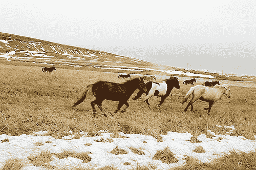

# 流行的深度学习库

> 原文： [https://machinelearningmastery.com/popular-deep-learning-libraries/](https://machinelearningmastery.com/popular-deep-learning-libraries/)

有很多深度学习库可供选择。

哪些是值得学习的优秀专业库，哪些是侧面项目，应该避免。很难分辨出来。

在这篇文章中，您将发现您应该考虑在自己的深度学习项目中学习和使用的顶级深度学习库。

让我们开始吧。

流行的深度学习库
照片由 [Nikki](https://www.flickr.com/photos/nikkis_pikkis/1112212508/) 拍摄，保留一些权利。

## 概观

在这篇文章中，您将发现以下深度学习库。所有这些都是使用各种不同的许可许可证的开源。

*   Theano
*   火炬
*   咖啡
*   DeepLearning4J

还有许多其他优秀的库和平台。一些更值得尊敬的提及包括 Google 的 [TensorFlow](https://www.tensorflow.org/) ，R 中的 [darch](http://cran.um.ac.ir/web/packages/darch/index.html) ，JavaScript 中的 [Convnet.js](http://cs.stanford.edu/people/karpathy/convnetjs/) （用于学习）， [Mocha](https://github.com/pluskid/Mocha.jl) 在 Julia ， [CNTK](https://github.com/Microsoft/CNTK) 由微软和 [H2O](http://www.h2o.ai/) Web API。

## Theano

Theano 是由 LISA 集团（现为 [MILA](http://mila.umontreal.ca/en/) ）开发的 Python 框架，由蒙特利尔大学的 [Yoshua Bengio](http://www.iro.umontreal.ca/~bengioy/yoshua_en/index.html) 运营，用于研究和开发最先进的深度学习算法。

它更好地描述为一个数学表达式编译器，您可以在其中象征性地定义您想要的内容，并且框架使您的程序符合您在 GPU 或 CPU 上高效运行的程序。

它不仅仅是一个深度学习库，也是一个研究平台。你必须自己做很多工作来创建你想要的模型。例如，没有神经网络类。

然而，有一个优秀的深度学习教程，向您展示如何为深度学习创建类和函数。例如，它提供了创建以下深度学习算法的分步示例：

*   [深度卷积网络](http://deeplearning.net/tutorial/lenet.html)
*   [堆叠去噪自动编码器](http://deeplearning.net/tutorial/SdA.html)
*   [深信仰网络](http://deeplearning.net/tutorial/DBN.html)

在线查看[整个教程](http://deeplearning.net/tutorial/contents.html)或下载 [PDF 版](http://deeplearning.net/tutorial/deeplearning.pdf)

Theano 实际上是一个生态系统，在实践中你不会直接使用 Theano。在 Theano 之上构建了一个[长的库列表，提供了方便的包装 API。一些更受欢迎的项目包括：](https://github.com/Theano/Theano/wiki/Related-projects)

*   [Keras](http://keras.io/)
*   [烤宽面条](https://github.com/Lasagne/Lasagne)
*   [阻止](https://github.com/mila-udem/blocks)
*   [Pylearn2](http://deeplearning.net/software/pylearn2/) （已解散）

这些项目本身就变成了非常大的项目，为底层的 Theano 平台提供了有用的 API，大大加快了将模型组合在一起的速度。

如果您是 Python 开发人员并且对更广泛的深度学习或研究感兴趣，那么这就是您的平台。

### 资源

*   [Theano 网页](http://deeplearning.net/software/theano/)
*   [Theano 用户组](https://groups.google.com/forum/#!forum/theano-users)（谷歌集团）
*   [Theano Github 项目](https://github.com/Theano/Theano/)

## 火炬

Torch（使用奇数版本编号称为 Torch7）是由 [Ronan Collobert](https://www.linkedin.com/in/ronan-collobert-b110aa8) ， [Clement Farabet](https://www.linkedin.com/in/clementfarabet) 和 [Koray Kavukcuoglu](https://uk.linkedin.com/in/koray-kavukcuoglu-0439a720) 开发的 Lua 深度学习框架，用于深入研究和开发学习算法。它由纽约大学的 [CILVR 实验室](http://cilvr.nyu.edu/doku.php?id=start)（ [Yann LeCun](https://www.linkedin.com/in/yann-lecun-0b999) 的家）使用和推广。

使用 Torch 并由 Facebook AI 实验室，Google DeepMind，Twitter 和其他许多人进一步开发。

在幕后，Torch 使用 C / C ++库以及 GPU 的 CUDA。它的目标是加速使用 C 友好语言 Lua 来提供一个不那么令人生畏的界面。

> Torch 的目标是在构建科学算法的过程中获得最大的灵活性和速度，同时使过程变得非常简单

有很多文档，但它是一团糟。 Torch 的流行应用是用于卷积神经网络的监督图像问题，以及具有深度强化学习的更复杂领域的代理。

如果您主要对强化学习感兴趣，Torch 可能是您的平台。

### 资源

*   [火炬官方主页](http://torch.ch/)
*   [Github 上的火炬计划](https://github.com/torch/torch7)
*   [Torch 文档和 Cheatsheet](https://github.com/torch/torch7/wiki/Cheatsheet) （社区 Wiki）

## 咖啡

Caffe 是由 [Yangqing Jia](https://www.linkedin.com/in/yangqing-jia-a67037b) 在伯克利远景和学习中心开发的用于监督计算机视觉问题的 Python 深度学习库。

主要关注的是卷积神经网络，它可能是世界领先者。

该库的一大好处是可以从 [Caffe Model Zoo](http://caffe.berkeleyvision.org/model_zoo.html) 下载并立即使用的预训练网络数量。这包括可以在标准计算机视觉数据集上实现世界级结果的最先进模型。

例如，这里有一些世界级模型的教程：

*   [Alex 的 CIFAR-10 教程与 Caffe](http://caffe.berkeleyvision.org/gathered/examples/cifar10.html)
*   [用 Caffe](http://caffe.berkeleyvision.org/gathered/examples/mnist.html) 在 MNIST 上训练 LeNet
*   [ImageNet 与 Caffe](http://caffe.berkeleyvision.org/gathered/examples/imagenet.html)

如果您主要对卷积神经网络和图像问题感兴趣，那么 Caffe 可能就是您的平台。

### 资源

*   [Caffe 主页](http://caffe.berkeleyvision.org/)
*   [Caffe Github 项目](https://github.com/BVLC/caffe)

## DeepLearning4J

DeepLearning4J（简称 DL4J）是由 [Adam Gibson](https://www.linkedin.com/in/agibsonccc) 用于商业深度学习项目的 Java（和 JVM 语言）开发的深度学习框架。

> DL4J 是一个基于 JVM，以行业为中心，商业支持的分布式深度学习框架，旨在解决在合理时间内涉及大量数据的问题

DeepLearning4J 是一个灵活的平台，它提供了一套最先进的深度学习算法，不仅限于：

*   深信仰网络
*   堆叠去噪自动编码器
*   卷积神经网络
*   长短期记忆单位
*   递归神经网络

[文档](http://deeplearning4j.org/documentation)非常好，涵盖了一系列主题，包括算法本身的一些理论和代码示例。

它具有与整个 Java 生态系统一起使用的优势，这是商业软件开发中的主要平台，包括 JVM 上的其他语言（例如 Scala）和大数据平台（Hadoop 和 Spark）。

### 资源

*   [DeepLearning4J 主页](http://deeplearning4j.org/)
*   [GitHub 上的 DeeplLearning4J](https://github.com/deeplearning4j/deeplearning4j)
*   [支持 DeepLearning4J](http://skymind.io/)

## 深度学习工具综述

很多人已经完成了深度学习库和工具的总结。本节列出了一些可用于深入学习深度学习工具的总结和其他资源。

*   KDDNuggets 有一个深度学习工具，名为[流行深度学习工具 - 评论](http://www.kdnuggets.com/2015/06/popular-deep-learning-tools.html)，其中包括 2015 年调查的结果。看起来像 Pylearn2 和 Theano 是最受欢迎的。
*   DL4J 比较了所有名为 [DL4J 与 Torch vs. Theano vs. Caffe vs. TensorFlow](http://deeplearning4j.org/compare-dl4j-torch7-pylearn.html) 的顶级工具。
*   Quora 帖子[目前阶段处理大数据的最佳深度学习库是什么？](https://www.quora.com/What-is-the-best-deep-learning-library-at-the-current-stage-for-working-on-large-data) 作为概述非常有见地。
*   Teglor 有一个很好的回合标题为[语言深度学习库](http://www.teglor.com/b/deep-learning-libraries-language-cm569/)
*   DeepLearning.net 有一个很好的[深度学习软件列表](http://deeplearning.net/software_links/)。
*   在 reddit 上有一个很棒的讨论题为[深度神经网络的最佳框架](https://www.reddit.com/r/MachineLearning/comments/2c9x0s/best_framework_for_deep_neural_nets/)？
*   名为 [100 Best GitHub：深度学习](http://meta-guide.com/software-meta-guide/100-best-github-deep-learning)的开源深度学习项目清单。

## 摘要

在这篇文章中，您将发现最受欢迎的深度学习工具和库。

具体来说，您了解到：

*   Theano
*   火炬
*   咖啡
*   DeepLearning4J

您是否使用过一种或多种这些工具？请在评论中告诉我您对它们的看法。

您对本文中列出的深度学习或库有任何疑问吗？在评论中提出您的问题，我会尽力回答。