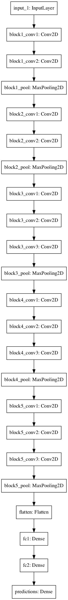

# 如何使用预训练的 VGG 模型对照片中的物体进行分类

> 原文： [https://machinelearningmastery.com/use-pre-trained-vgg-model-classify-objects-photographs/](https://machinelearningmastery.com/use-pre-trained-vgg-model-classify-objects-photographs/)

卷积神经网络现在能够在某些计算机视觉任务上胜过人类，例如分类图像。

也就是说，给定物体的照片，回答照片显示的 1000 个特定物体中的哪一个的问题。

牛津大学研究人员的 VGG 模型是一项竞争获胜的模型。除了能够对照片中的物体进行分类之外，这个模型的重要之处在于模型权重是免费提供的，可以在您自己的模型和应用程序中加载和使用。

在本教程中，您将发现用于图像分类的 VGG 卷积神经网络模型。

完成本教程后，您将了解：

*   关于 ImageNet 数据集和竞争以及 VGG 获奖模型。
*   如何在 Keras 中加载 VGG 模型并总结其结构。
*   如何使用加载的 VGG 模型对特定照片中的对象进行分类。

让我们开始吧。

## 教程概述

本教程分为 4 个部分;他们是：

1.  ImageNet
2.  牛津 VGG 模型
3.  在 Keras 中加载 VGG 模型
4.  开发简单的照片分类器

## ImageNet

[ImageNet](http://www.image-net.org/) 是一个研究项目，用于开发带有注释的大型图像数据库，例如：图像及其描述。

自 2010 年以来，这些图像及其注释已成为称为 [ImageNet 大规模视觉识别挑战](http://www.image-net.org/challenges/LSVRC/)或 ILSVRC 的图像分类挑战的基础。结果是研究组织在预先定义的数据集上进行战斗，以查看谁具有用于对图像中的对象进行分类的最佳模型。

> ImageNet 大规模视觉识别挑战是对象类别分类和检测数百个对象类别和数百万图像的基准。从 2010 年到现在每年都在进行挑战，吸引了来自 50 多个机构的参与。

- [ImageNet 大规模视觉识别挑战](https://arxiv.org/abs/1409.0575)，2015 年。

对于分类任务，图像必须分为 1,000 个不同类别中的一个。

在过去几年中，已经使用非常深度的卷积神经网络模型来赢得这些挑战，并且任务的结果已超过人类的表现。


来自“ImageNet 大规模视觉识别挑战”的 ILSVRC 挑战
中使用的 ImageNet 数据集的图像样本，2015 年。

## 牛津 VGG 模型

来自[牛津视觉几何组](http://www.robots.ox.ac.uk/~vgg/)（简称 VGG）的研究人员参与了 ILSVRC 的挑战。

2014 年，由 VGG [开发的卷积神经网络模型（CNN）赢得了图像分类任务](http://image-net.org/challenges/LSVRC/2014/results)。


ILSVRC 2014 年的分类任务结果

比赛结束后，参与者在论文中写下了他们的发现：

*   [用于大规模图像识别的非常深的卷积网络](https://arxiv.org/abs/1409.1556)，2014 年。

他们还在线提供了他们的模型和学习重量 [](http://www.robots.ox.ac.uk/~vgg/research/very_deep/) 。

这使得其他研究人员和开发人员可以在自己的工作和程序中使用最先进的图像分类模型。

这有助于推动一系列转移学习工作，其中使用预先训练的模型，对全新的预测建模任务进行微小修改，利用经过验证的模型的最先进的特征提取功能。

> ......我们提出了更加精确的 ConvNet 架构，它不仅可以实现 ILSVRC 分类和定位任务的最先进精度，而且还适用于其他图像识别数据集，即使在用作相对简单的管道的一部分（例如，由线性 SVM 分类的深度特征，没有微调）。我们发布了两个表现最佳的模型，以促进进一步的研究。

- [用于大规模图像识别的非常深的卷积网络](https://arxiv.org/abs/1409.1556)，2014 年。

VGG 发布了两种不同的 CNN 模型，特别是 16 层模型和 19 层模型。

有关这些型号的完整详细信息，请参阅本文。

VGG 模型不再仅仅是几个百分点的最新技术。然而，它们是非常强大的模型，既可用作图像分类器，也可用作使用图像输入的新模型的基础。

在下一节中，我们将看到如何在 Keras 中直接使用 VGG 模型。

## 在 Keras 中加载 VGG 模型

可以在 Keras 深度学习库中加载和使用 VGG 模型。

Keras 提供[应用程序界面](https://keras.io/applications/)，用于加载和使用预先训练的模型。

使用此界面，您可以使用 Oxford 组提供的预训练权重创建 VGG 模型，并将其用作您自己模型中的起点，或者将其用作模型直接用于分类图像。

在本教程中，我们将重点介绍使用 VGG 模型对新图像进行分类的用例。

Keras 通过 VGG16 和 VGG19 类提供 16 层和 19 层版本。让我们关注 VGG16 模型。

可以按如下方式创建模型：

```py
from keras.applications.vgg16 import VGG16
model = VGG16()
```

而已。

第一次运行此示例时，Keras 将从 Internet 下载权重文件并将其存储在 _〜/ .keras / models_ 目录中。

**注意**权重约为 528 兆字节，因此下载可能需要几分钟，具体取决于您的 Internet 连接速度。

权重仅下载一次。下次运行示例时，权重将在本地加载，模型应该可以在几秒钟内使用。

我们可以使用标准的 Keras 工具来检查模型结构。

例如，您可以打印网络层的摘要，如下所示：

```py
from keras.applications.vgg16 import VGG16
model = VGG16()
print(model.summary())
```

你可以看到模型很大。

您还可以看到，默认情况下，模型要求图像作为输入，大小为 224 x 224 像素，具有 3 个通道（例如颜色）。

```py
_________________________________________________________________
Layer (type)                 Output Shape              Param #
=================================================================
input_1 (InputLayer)         (None, 224, 224, 3)       0
_________________________________________________________________
block1_conv1 (Conv2D)        (None, 224, 224, 64)      1792
_________________________________________________________________
block1_conv2 (Conv2D)        (None, 224, 224, 64)      36928
_________________________________________________________________
block1_pool (MaxPooling2D)   (None, 112, 112, 64)      0
_________________________________________________________________
block2_conv1 (Conv2D)        (None, 112, 112, 128)     73856
_________________________________________________________________
block2_conv2 (Conv2D)        (None, 112, 112, 128)     147584
_________________________________________________________________
block2_pool (MaxPooling2D)   (None, 56, 56, 128)       0
_________________________________________________________________
block3_conv1 (Conv2D)        (None, 56, 56, 256)       295168
_________________________________________________________________
block3_conv2 (Conv2D)        (None, 56, 56, 256)       590080
_________________________________________________________________
block3_conv3 (Conv2D)        (None, 56, 56, 256)       590080
_________________________________________________________________
block3_pool (MaxPooling2D)   (None, 28, 28, 256)       0
_________________________________________________________________
block4_conv1 (Conv2D)        (None, 28, 28, 512)       1180160
_________________________________________________________________
block4_conv2 (Conv2D)        (None, 28, 28, 512)       2359808
_________________________________________________________________
block4_conv3 (Conv2D)        (None, 28, 28, 512)       2359808
_________________________________________________________________
block4_pool (MaxPooling2D)   (None, 14, 14, 512)       0
_________________________________________________________________
block5_conv1 (Conv2D)        (None, 14, 14, 512)       2359808
_________________________________________________________________
block5_conv2 (Conv2D)        (None, 14, 14, 512)       2359808
_________________________________________________________________
block5_conv3 (Conv2D)        (None, 14, 14, 512)       2359808
_________________________________________________________________
block5_pool (MaxPooling2D)   (None, 7, 7, 512)         0
_________________________________________________________________
flatten (Flatten)            (None, 25088)             0
_________________________________________________________________
fc1 (Dense)                  (None, 4096)              102764544
_________________________________________________________________
fc2 (Dense)                  (None, 4096)              16781312
_________________________________________________________________
predictions (Dense)          (None, 1000)              4097000
=================================================================
Total params: 138,357,544
Trainable params: 138,357,544
Non-trainable params: 0
_________________________________________________________________
```

我们还可以在 VGG 模型中创建层，如下所示：

```py
from keras.applications.vgg16 import VGG16
from keras.utils.vis_utils import plot_model
model = VGG16()
plot_model(model, to_file='vgg.png')
```

同样，因为模型很大，情节有点太大，也许不可读。然而，它在下面提供。



VGG 模型中的层图

_VGG（）_ 类需要一些参数，如果您希望在自己的项目中使用该模型，可能只会感兴趣。转学习。

例如：

*   **include_top** （ _True_ ）：是否包含模型的输出层。如果您根据自己的问题拟合模型，则不需要这些。
*   **权重**（' _imagenet_ '）：要加载的权重。如果您有兴趣从头开始训练模型，则可以指定“无”以不加载预先训练的权重。
*   **input_tensor** （_ 无 _）：如果您打算在不同大小的新数据上拟合模型，则为新输入层。
*   **input_shape** （_ 无 _）：如果更改输入层，模型应采用的图像大小。
*   **汇集**（_ 无 _）：训练一组新输出层时要使用的池类型。
*   **类**（ _1000_ ）：模型的类数（例如输出向量的大小）。

接下来，让我们看一下使用加载的 VGG 模型对特定照片进行分类。

## 开发简单的照片分类器

让我们开发一个简单的图像分类脚本。

### 1.获取样本图像

首先，我们需要一个可以分类的图像。

你可以在这里从 Flickr [下载咖啡杯的随机照片。](https://www.flickr.com/photos/jfanaian/4994221690/)


咖啡杯
摄影： [jfanaian](https://www.flickr.com/photos/jfanaian/4994221690/) ，保留一些权利。

下载图像并将其保存到当前工作目录，文件名为“ _mug.png_ ”。

### 2.加载 VGG 模型

加载 VGG-16 型号的重量，就像我们在上一节中所做的那样。

```py
from keras.applications.vgg16 import VGG16
# load the model
model = VGG16()
```

### 3.加载并准备图像

接下来，我们可以将图像作为像素数据加载并准备将其呈现给网络。

Keras 提供了一些帮助完成此步骤的工具。

首先，我们可以使用 _load_img（）_ 函数加载图像并将其大小调整为所需的 224×224 像素大小。

```py
from keras.preprocessing.image import load_img
# load an image from file
image = load_img('mug.png', target_size=(224, 224))
```

接下来，我们可以将像素转换为 NumPy 数组，以便我们可以在 Keras 中使用它。我们可以使用 _img_to_array（）_ 函数。

```py
from keras.preprocessing.image import img_to_array
# convert the image pixels to a numpy array
image = img_to_array(image)
```

网络期望一个或多个图像作为输入;这意味着输入数组需要是 4 维的：样本，行，列和通道。

我们只有一个样本（一个图像）。我们可以通过调用 _reshape（）_ 并添加额外的维度来重新整形数组。

```py
# reshape data for the model
image = image.reshape((1, image.shape[0], image.shape[1], image.shape[2]))
```

接下来，需要以与准备 ImageNet 训练数据相同的方式准备图像像素。具体来说，从论文：

> 我们唯一的预处理是从每个像素中减去在训练集上计算的平均 RGB 值。

- [用于大规模图像识别的非常深的卷积网络](https://arxiv.org/abs/1409.1556)，2014 年。

Keras 提供了一个名为 _preprocess_input（）_ 的函数来为网络准备新的输入。

```py
from keras.applications.vgg16 import preprocess_input
# prepare the image for the VGG model
image = preprocess_input(image)
```

我们现在准备对我们加载和准备好的图像进行预测。

### 4.进行预测

我们可以在模型上调用 _predict（）_ 函数，以便预测属于 1000 种已知对象类型中的每一种的图像的概率。

```py
# predict the probability across all output classes
yhat = model.predict(image)
```

几乎在那里，现在我们需要解释概率。

### 5.解释预测

Keras 提供了解释称为 _decode_predictions（）_ 的概率的函数。

它可以返回类列表及其概率，以防您想要呈现照片中可能存在的前 3 个对象。

我们将报告第一个最可能的对象。

```py
from keras.applications.vgg16 import decode_predictions
# convert the probabilities to class labels
label = decode_predictions(yhat)
# retrieve the most likely result, e.g. highest probability
label = label[0][0]
# print the classification
print('%s (%.2f%%)' % (label[1], label[2]*100))
```

就是这样。

### 完整的例子

将所有这些结合在一起，下面列出了完整的示例：

```py
from keras.preprocessing.image import load_img
from keras.preprocessing.image import img_to_array
from keras.applications.vgg16 import preprocess_input
from keras.applications.vgg16 import decode_predictions
from keras.applications.vgg16 import VGG16
# load the model
model = VGG16()
# load an image from file
image = load_img('mug.png', target_size=(224, 224))
# convert the image pixels to a numpy array
image = img_to_array(image)
# reshape data for the model
image = image.reshape((1, image.shape[0], image.shape[1], image.shape[2]))
# prepare the image for the VGG model
image = preprocess_input(image)
# predict the probability across all output classes
yhat = model.predict(image)
# convert the probabilities to class labels
label = decode_predictions(yhat)
# retrieve the most likely result, e.g. highest probability
label = label[0][0]
# print the classification
print('%s (%.2f%%)' % (label[1], label[2]*100))
```

运行该示例，我们可以看到图像被正确分类为“_ 咖啡杯 _”，可能性为 75％。

```py
coffee_mug (75.27%)
```

## 扩展

本节列出了一些扩展您可能希望探索的教程的想法。

*   **创建一个函数**。更新示例并添加一个给定图像文件名的函数，加载的模型将返回分类结果。
*   **命令行工具**。更新示例，以便在命令行上给出图像文件名，程序将报告图像的分类。
*   **报告多个类**。更新示例以报告给定图像的前 5 个最可能的类及其概率。

## 进一步阅读

如果您要深入了解，本节将提供有关该主题的更多资源。

*   [ImageNet](http://www.image-net.org/)
*   [维基百科上的 ImageNet](https://en.wikipedia.org/wiki/ImageNet)
*   [用于大规模图像识别的非常深的卷积网络](https://arxiv.org/abs/1409.1556)，2015 年。
*   [用于大规模视觉识别的非常深的卷积网络](http://www.robots.ox.ac.uk/~vgg/research/very_deep/)，位于牛津大学。
*   [使用非常少的数据建立强大的图像分类模型](https://blog.keras.io/building-powerful-image-classification-models-using-very-little-data.html)，2016。
*   [Keras Applications API](https://keras.io/applications/)
*   [Keras 重量文件](https://github.com/fchollet/deep-learning-models/releases/)

## 摘要

在本教程中，您发现了用于图像分类的 VGG 卷积神经网络模型。

具体来说，你学到了：

*   关于 ImageNet 数据集和竞争以及 VGG 获奖模型。
*   如何在 Keras 中加载 VGG 模型并总结其结构。
*   如何使用加载的 VGG 模型对特定照片中的对象进行分类。

你有任何问题吗？
在下面的评论中提出您的问题，我会尽力回答。