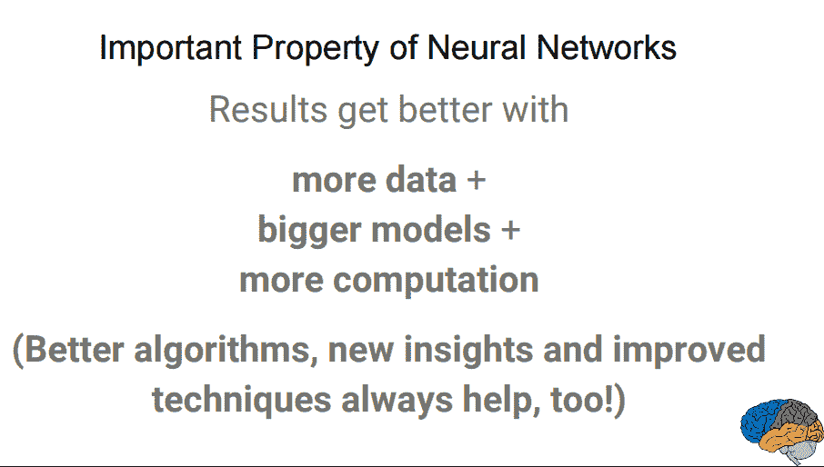
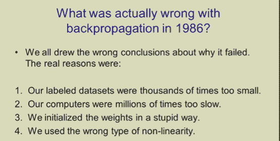
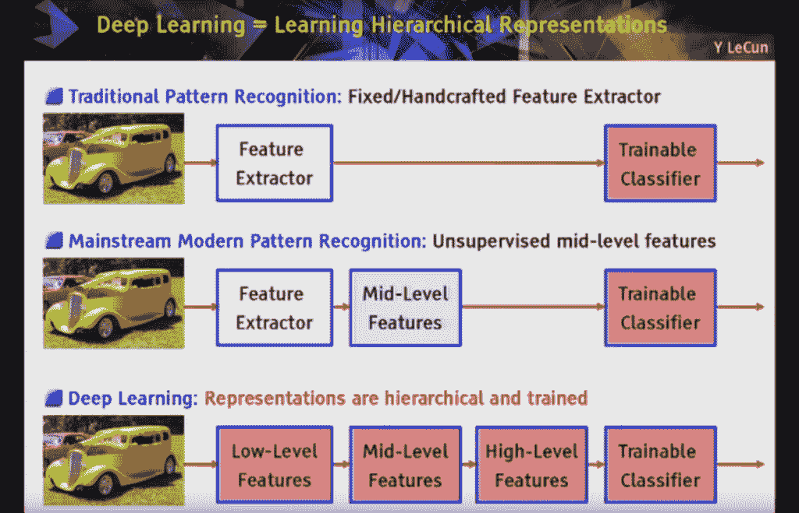

# 什么是深度学习？

> 原文： [https://machinelearningmastery.com/what-is-deep-learning/](https://machinelearningmastery.com/what-is-deep-learning/)

深度学习是机器学习的一个子领域，涉及受大脑结构和功能激发的算法，称为人工神经网络。

如果你刚刚开始深度学习领域，或者你曾经有过神经网络的经验，你可能会感到困惑。我知道我最初很困惑，许多同事和朋友在 20 世纪 90 年代和 21 世纪初学习和使用神经网络也是如此。

该领域的领导者和专家对深度学习的观点有所了解，这些具体而细微的观点为深度学习的内容提供了很多依据。

在这篇文章中，您将通过听取该领域的一系列专家和领导者的确切了解深度学习的内容。

让我们潜入。

什么是深度学习？
[Kiran Foster](https://www.flickr.com/photos/rueful/7885846128/) 的照片，保留一些权利。

## 深度学习是大型神经网络

[来自百度研究院 Coursera 和首席科学家的 Andrew Ng](https://en.wikipedia.org/wiki/Andrew_Ng) 正式成立了 [Google Brain](https://en.wikipedia.org/wiki/Google_Brain) ，最终导致了大量 Google 服务中深度学习技术的产品化。

他已经说了很多关于深度学习的内容并写了很多，并且是一个很好的起点。

在深度学习的早期讨论中，安德鲁描述了传统人工神经网络背景下的深度学习。在 2013 年题为“[深度学习，自学习和无监督特征学习](https://www.youtube.com/watch?v=n1ViNeWhC24)”的演讲中，他将深度学习的理念描述为：

> 使用大脑模拟，希望：
> 
> - 使学习算法更好，更容易使用。
> 
> - 在机器学习和人工智能方面取得革命性进展。
> 
> 我相信这是我们迈向真正人工智能的最好机会

后来他的评论变得更加细致入微了。

根据安德鲁的深度学习的核心是我们现在拥有足够快的计算机和足够的数据来实际训练大型神经网络。在讨论为什么现在是 2015 年 ExtractConf 在深度学习的时候，题为“[科学家应该了解的关于深度学习](https://www.youtube.com/watch?v=O0VN0pGgBZM)的数据”，他评论说：

> 我们现在拥有的非常大的神经网络......以及我们可以访问的大量数据

他还评论了关于规模的重要观点。当我们构建更大的神经网络并用越来越多的数据训练它们时，它们的表现会不断提高。这通常与其他在表现上达到稳定水平的机器学习技术不同。

> 对于旧代学习算法的大多数风格......表现将达到稳定水平。 ......深度学习......是第一类算法......可扩展。 ...随着您提供更多数据，表现会不断提高

他在幻灯片中提供了一个漂亮的卡通片：

为何深度学习？
滑动 [Andrew Ng](http://www.slideshare.net/ExtractConf) ，保留所有权利。

最后，他清楚地指出，我们在实践中看到的深度学习的好处来自有监督的学习。从 2015 年的 ExtractConf 演讲中，他评论道：

> 今天深度学习的几乎所有价值都是通过有监督的学习或从标记数据中学习

早些时候，斯坦福大学在 2014 年的一次题为“[深度学习](https://www.youtube.com/watch?v=W15K9PegQt0)”的演讲中，他做了类似的评论：

> 深度学习像疯了一样起飞的一个原因是因为它在监督学习中很棒

安德鲁经常提到我们应该并且会看到更多的好处来自轨道的无人监督的一面，因为该领域已经成熟，可以处理大量未标记的数据。

[Jeff Dean](https://en.wikipedia.org/wiki/Jeff_Dean_(computer_scientist)) 是 Google 的系统和基础设施小组的向导和谷歌高级研究员，并参与并可能部分负责 Google 内部深度学习的扩展和采用。 Jeff 参与了 Google Brain 项目以及大型深度学习软件 DistBelief 和后来的 TensorFlow 的开发。

在 2016 年题为“[建立智能计算机系统深度学习](https://www.youtube.com/watch?v=QSaZGT4-6EY)”的演讲中，他以类似的方式发表评论，深度学习实际上是关于大型神经网络的。

> 当你听到深度学习这个词的时候，就想想一个大的深度神经网络。深度指的是典型的层数，因此这种流行术语在印刷机中被采用。我认为它们通常是深度神经网络。

他已经多次发表过这个演讲，并且在[改进的幻灯片中为同一个演讲](http://static.googleusercontent.com/media/research.google.com/en//people/jeff/BayLearn2015.pdf)，他强调了神经网络的可扩展性，表明随着更多的数据和更大的模型，结果会变得更好更多计算训练。

结果更好，更多数据，更大型号，更多计算
滑动 [Jeff Dean](http://static.googleusercontent.com/media/research.google.com/en//people/jeff/BayLearn2015.pdf) ，保留所有权利。

## 深度学习是分层特征学习

除了可扩展性之外，深度学习模型的另一个经常被引用的好处是它们能够从原始数据执行自动特征提取，也称为[特征学习](https://en.wikipedia.org/wiki/Feature_learning)。

[Yoshua Bengio](https://en.wikipedia.org/wiki/Yoshua_Bengio) 是深度学习的另一个领导者，尽管他开始对大型神经网络能够实现的自动特征学习产生浓厚的兴趣。

他描述了使用特征学习发现和学习良好表示的算法能力方面的深度学习。在 2012 年题为“[深度学习无监督和转移学习的表达](http://www.jmlr.org/proceedings/papers/v27/bengio12a/bengio12a.pdf)”的论文中，他评论道：

> 深度学习算法试图利用输入分布中的未知结构，以便通常在多个级别上发现良好的表示，并使用较低级别的特征定义更高级别的学习特征

他在 2009 年的技术报告“[为 AI](http://www.iro.umontreal.ca/~lisa/publications2/index.php/publications/show/239) 学习深层架构”中提供了深入学习的详细视角，其中强调了特征学习中层次结构的重要性。

> 深度学习方法旨在学习具有来自较低级别特征的组成所形成的较高级别的层级的特征的特征层级。在多个抽象级别自动学习功能允许系统学习直接从数据将输入映射到输出的复杂功能，而不完全依赖于人工制作的功能。

在即将出版的名为“[深度学习](http://www.deeplearningbook.org)”的书中，他与 Ian Goodfellow 和 Aaron Courville 合着，他们根据模型的架构深度来定义深度学习。

> 概念的层次结构允许计算机通过用简单的概念构建它们来学习复杂的概念。如果我们绘制一个图表来显示这些概念是如何相互构建的，那么图表很深，有很多层。出于这个原因，我们将这种方法称为 AI 深度学习。

这是一本重要的书，有可能在一段时间内成为该领域的权威资源。本书继续描述多层感知器作为深度学习领域中使用的算法，给出了深度学习已包含在人工神经网络中的观点。

> 深度学习模型的典型例子是前馈深度网络或多层感知器（MLP）。

[Peter Norvig](https://en.wikipedia.org/wiki/Peter_Norvig) 是谷歌研究部主任，以其题为“[人工智能：现代方法](http://www.amazon.com/dp/0136042597?tag=inspiredalgor-20)”的人工智能教科书而闻名。

在 2016 年的一次演讲中，他给出了题为“[深度学习和可理解性与软件工程和验证](https://www.youtube.com/watch?v=X769cyzBNVw)”的内容，他以与 Yoshua 非常相似的方式定义了深度学习，重点关注使用更深层网络结构所允许的抽象功能。

> 一种学习，你形成的表示有几个抽象层次，而不是输出的直接输入

## 为什么称它为“深度学习”？
为什么不只是“人工神经网络”？

[Geoffrey Hinton](https://en.wikipedia.org/wiki/Geoffrey_Hinton) 是人工神经网络领域的先驱，并共同发表了关于[反向传播](https://en.wikipedia.org/wiki/Backpropagation)算法的第一篇论文，用于训练多层感知器网络。

他可能已经开始引入措辞“ _deep_ ”来描述大型人工神经网络的发展。

他在 2006 年共同撰写了一篇题为“[深度信念网快速学习算法](http://www.mitpressjournals.org/doi/pdf/10.1162/neco.2006.18.7.1527)”的论文，其中描述了一种训练“深度”（如在多层网络中）受限制的 Boltzmann 机器的方法。

> 使用互补先验，我们推导出一种快速，贪婪的算法，可以一次一层地学习深层定向信念网络，前提是前两层形成一个无向联想记忆。

本文和 Geoff 在一个无向深度网络上共同撰写的题为“ [Deep Boltzmann Machines](http://www.jmlr.org/proceedings/papers/v5/salakhutdinov09a/salakhutdinov09a.pdf) ”的相关论文得到了社区的好评（现已引用数百次），因为它们是贪婪层的成功例子 - 明智的网络训练，在前馈网络中允许更多层。

在科学的一篇题为“[用神经网络降低数据维度](https://www.cs.toronto.edu/~hinton/science.pdf)”的共同撰写的文章中，他们坚持使用相同的“深度”描述来描述他们开发网络的方法，这些网络的层数比以前更多。

> 我们描述了一种初始化权重的有效方法，它允许深度自动编码器网络学习低维度代码，这些代码比主成分分析更好地作为减少数据维度的工具。

在同一篇文章中，他们发表了一篇有趣的评论，与 Andrew Ng 关于最近计算能力的提高以及对大型数据集的访问的评论相互关联，这些数据集在大规模使用时释放了神经网络尚未开发的能力。

> 自 20 世纪 80 年代以来，显而易见的是，通过深度自动编码器的反向传播对于非线性降维是非常有效的，只要计算机足够快，数据集足够大，并且初始权重足够接近良好的解决方案。现在满足所有这三个条件。

在 2016 年皇家学会题为“[深度学习](https://www.youtube.com/watch?v=VhmE_UXDOGs)”的演讲中，Geoff 评论说深度信念网络是 2006 年深度学习的开始，并且这一新的深度学习浪潮的首次成功应用是 2009 年的语音识别标题为“[声学建模使用深度信念网络](http://www.cs.toronto.edu/~asamir/papers/speechDBN_jrnl.pdf)”，实现了最先进的结果。

结果使语音识别和神经网络社区注意到，使用“深度”作为先前神经网络技术的差异因素，可能导致名称改变。

皇家学会谈话中对深度学习的描述非常反向传播，正如您所期望的那样。有趣的是，他提出了为什么反向传播（读“深度学习”）在上世纪 90 年代没有起飞的 4 个原因。前两点与安德鲁·吴（Andrew Ng）的评论相符，关于数据集太小而计算机太慢。

1986 年背向传播实际上是错误的？
滑动 [Geoff Hinton](https://www.youtube.com/watch?v=VhmE_UXDOGs) ，保留所有权利。

## 深度学习作为跨域的可扩展学习

深度学习在输入（甚至输出）是模拟的问题域上表现优异。意思是，它们不是表格格式的少量数量，而是像素数据，文本数据文档或音频数据文件的图像。

[Yann LeCun](https://en.wikipedia.org/wiki/Yann_LeCun) 是 Facebook Research 的主管，是网络架构之父，擅长图像数据中的对象识别，称为[卷积神经网络（CNN）](http://machinelearningmastery.com/crash-course-convolutional-neural-networks/)。这种技术看起来非常成功，因为像多层感知器前馈神经网络一样，该技术可以根据数据和模型大小进行扩展，并且可以通过反向传播进行训练。

这使他对深度学习的定义偏向于非常大的 CNN 的发展，这些 CNN 在照片中的对象识别方面取得了巨大成功。

在劳伦斯利弗莫尔国家实验室 2016 年的一次题为“[加速理解：深度学习，智能应用和 GPU](https://www.youtube.com/watch?v=Qk4SqF9FT-M) ”的演讲中，他将深度学习描述为学习层次表示，并将其定义为构建对象识别系统的可扩展方法：

> 深度学习[是] ...所有可训练的模块管道。 ......因为在识别一个物体的过程中有多个阶段，所有这些阶段都是训练的一部分“

深度学习=学习等级表示
滑动 [Yann LeCun](https://www.youtube.com/watch?v=Qk4SqF9FT-M) ，保留所有权利。

[Jurgen Schmidhuber](https://en.wikipedia.org/wiki/J%C3%BCrgen_Schmidhuber) 是另一种流行算法的父亲，它像 MLP 和 CNN 一样也可以根据模型大小和数据集大小进行扩展，并且可以通过反向传播进行训练，而是针对学习序列数据进行定制，称为 [Long 短期记忆网络（LSTM）](http://machinelearningmastery.com/crash-course-recurrent-neural-networks-deep-learning/)，一种递归神经网络。

我们确实看到在该领域的措辞中存在一些混淆，即“深度学习”。在 2014 年题为“[神经网络中的深度学习：概述](http://arxiv.org/pdf/1404.7828v4.pdf)”的论文中，他对该领域的问题命名以及深度与浅层学习的区分进行了评论。他还有趣地描述了问题复杂性的深度，而不是用于解决问题的模型。

> Shallow Learning 在哪个问题深度结束，深度学习开始了？与 DL 专家的讨论尚未对这一问题作出结论性回应。 [...]，让我只为此概述的目的定义：深度问题＆gt; 10 需要非常深度学习。

[Demis Hassabis](https://en.wikipedia.org/wiki/Demis_Hassabis) 是 [DeepMind](https://deepmind.com/) 的创始人，后来被谷歌收购。 DeepMind 突破了将深度学习技术与强化学习相结合，以处理复杂的学习问题，如玩游戏，在玩 Atari 游戏和游戏 Go with Alpha Go 时出类拔萃。

为了与命名保持一致，他们将他们的新技术称为深度 Q 网络，将深度学习与 Q-Learning 结合起来。他们还将更广泛的研究领域命名为“深层强化学习”。

在他们的 2015 年自然论文题为“[通过深度强化学习](http://www.nature.com/nature/journal/v518/n7540/full/nature14236.html)进行人类控制”中，他们评论了深度神经网络在突破中的重要作用，并强调了对分层抽象的需求。

> 为了实现这一目标，我们开发了一种新型代理，一种深度 Q 网络（DQN），它能够将强化学习与一类称为深度神经网络的人工神经网络相结合。值得注意的是，深度神经网络的最新进展使得人工神经网络可以直接从原始传感数据中学习诸如对象类别之类的概念，其中使用若干层节点来逐渐建立数据的抽象表示。

最后，在可能被认为是该领域的定义论文中，Yann LeCun，Yoshua Bengio 和 Geoffrey Hinton 在自然界发表了一篇题为“[深度学习](http://www.nature.com/nature/journal/v521/n7553/full/nature14539.html)”的论文。在其中，他们打开了一个清晰的深度学习定义，突出了多层次的方法。

> 深度学习允许由多个处理层组成的计算模型来学习具有多个抽象级别的数据表示。

后来，在表示学习和抽象方面描述了多层方法。

> 深度学习方法是具有多个表示级别的表示学习方法，通过组合简单但非线性的模块获得，每个模块将表示在一个级别（从原始输入开始）转换为更高，稍微更抽象级别的表示。 [...]深度学习的关键方面是这些功能层不是由人类工程师设计的：它们是使用通用学习程序从数据中学习的。

这是一个很好的通用描述，可以很容易地描述大多数人工神经网络算法。这也是一个很好的结束。

## 摘要

在这篇文章中，您发现深度学习只是对更多数据的非常大的神经网络，需要更大的计算机。

虽然 Hinton 和合作者发表的早期方法侧重于贪婪的分层训练和无监督方法，如自动编码器，但现代最先进的深度学习主要集中在使用反向传播算法训练深层（多层）神经网络模型。最流行的技术是：

*   多层感知器网络。
*   卷积神经网络。
*   长短期记忆回归神经网络。

我希望这已经清除了深层学习的内容以及领导定义如何在一个保护伞下融合在一起。

如果您对深度学习或此帖有任何疑问，请在下面的评论中提出您的问题，我会尽力回答。