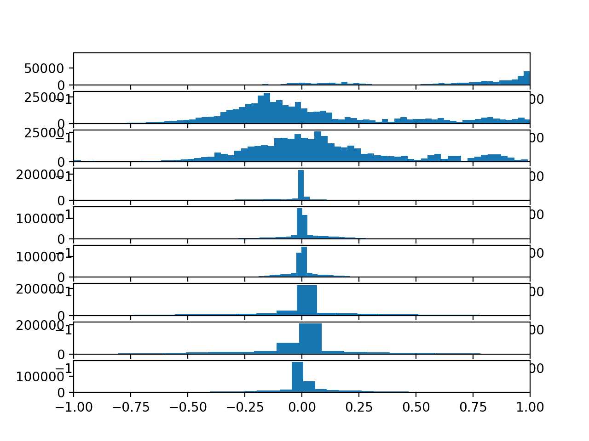

# 如何开发人类活动识别的一维卷积神经网络模型

> 原文： [https://machinelearningmastery.com/cnn-models-for-human-activity-recognition-time-series-classification/](https://machinelearningmastery.com/cnn-models-for-human-activity-recognition-time-series-classification/)

人类活动识别是将由专用线束或智能电话记录的加速度计数据序列分类为已知的明确定义的运动的问题。

该问题的经典方法涉及基于固定大小的窗口和训练机器学习模型（例如决策树的集合）的时间序列数据中的手工制作特征。困难在于此功能工程需要该领域的深厚专业知识。

最近，已经证明，诸如循环神经网络和一维卷积神经网络（CNN）之类的深度学习方法可以在很少或没有数据特征工程的情况下提供具有挑战性的活动识别任务的最新结果，而不是使用特征学习原始数据。

在本教程中，您将了解如何开发一维卷积神经网络，用于人类活动识别问题的时间序列分类。

完成本教程后，您将了解：

*   如何为标准人类活动识别数据集加载和准备数据，并开发单个 1D CNN 模型，以在原始数据上实现出色的表现。
*   如何进一步调整模型的表现，包括数据转换，过滤器映射和内核大小。
*   如何开发一种复杂的多头一维卷积神经网络模型，提供类似集合的结果。

让我们开始吧。


如何开发用于人类活动识别的一维卷积神经网络模型
照片由 [Wolfgang Staudt](https://www.flickr.com/photos/wolfgangstaudt/2204054918/) ，保留一些权利。

## 教程概述

本教程分为四个部分;他们是：

1.  使用智能手机数据集进行活动识别
2.  开发一维卷积神经网络
3.  调谐一维卷积神经网络
4.  多头一维卷积神经网络

## 使用智能手机数据集进行活动识别

[人类活动识别](https://en.wikipedia.org/wiki/Activity_recognition)，或简称为 HAR，是基于使用传感器的移动痕迹来预测人正在做什么的问题。

标准的人类活动识别数据集是 2012 年推出的“使用智能手机数据集的活动识别”。

它由 Davide Anguita 等人准备并提供。来自意大利热那亚大学的 2013 年论文“[使用智能手机进行人类活动识别的公共领域数据集](https://upcommons.upc.edu/handle/2117/20897)”中对该数据集进行了全面描述。该数据集在他们的 2012 年论文中用机器学习算法建模，标题为“[使用多类硬件友好支持向量机](https://link.springer.com/chapter/10.1007/978-3-642-35395-6_30)在智能手机上进行人类活动识别。“

数据集可用，可以从 UCI 机器学习库免费下载：

*   [使用智能手机数据集进行人类活动识别，UCI 机器学习库](https://archive.ics.uci.edu/ml/datasets/human+activity+recognition+using+smartphones)

该数据来自 30 名年龄在 19 至 48 岁之间的受试者，其执行六项标准活动中的一项，同时佩戴记录运动数据的腰部智能手机。记录执行活动的每个受试者的视频，并从这些视频手动标记移动数据。

以下是在记录其移动数据的同时执行活动的主体的示例视频。

&lt;iframe allow="autoplay; encrypted-media" allowfullscreen="" frameborder="0" height="375" src="https://www.youtube.com/embed/XOEN9W05_4A?feature=oembed" width="500"&gt;&lt;/iframe&gt;

进行的六项活动如下：

1.  步行
2.  走上楼
3.  走楼下
4.  坐在
5.  常设
6.  铺设

记录的运动数据是来自智能手机的 x，y 和 z 加速度计数据（线性加速度）和陀螺仪数据（角速度），特别是三星 Galaxy S II。以 50Hz（即每秒 50 个数据点）记录观察结果。每个受试者进行两次活动，一次是左侧设备，另一次是右侧设备。

原始数据不可用。相反，可以使用预处理版本的数据集。预处理步骤包括：

*   使用噪声滤波器预处理加速度计和陀螺仪。
*   将数据拆分为 2.56 秒（128 个数据点）的固定窗口，重叠率为 50％。
*   将加速度计数据分割为重力（总）和身体运动分量。

特征工程应用于窗口数据，并且提供具有这些工程特征的数据的副本。

从每个窗口提取在人类活动识别领域中常用的许多时间和频率特征。结果是 561 元素的特征向量。

根据受试者的数据，将数据集分成训练（70％）和测试（30％）组。训练 21 个，测试 9 个。

使用旨在用于智能手机的支持向量机（例如定点算术）的实验结果导致测试数据集的预测准确度为 89％，实现与未修改的 SVM 实现类似的结果。

该数据集是免费提供的，可以从 UCI 机器学习库下载。

数据以单个 zip 文件的形式提供，大小约为 58 兆字节。此下载的直接链接如下：

*   [UCI HAR Dataset.zip](https://archive.ics.uci.edu/ml/machine-learning-databases/00240/UCI%20HAR%20Dataset.zip)

下载数据集并将所有文件解压缩到当前工作目录中名为“HARDataset”的新目录中。

## 开发一维卷积神经网络

在本节中，我们将为人类活动识别数据集开发一维卷积神经网络模型（1D CNN）。

[卷积神经网络](https://machinelearningmastery.com/crash-course-convolutional-neural-networks/)模型是为图像分类问题而开发的，其中模型在称为特征学习的过程中学习二维输入的内部表示。

可以在一维数据序列上利用相同的过程，例如在用于人类活动识别的加速和陀螺仪数据的情况下。该模型学习从观察序列中提取特征以及如何将内部特征映射到不同的活动类型。

使用 CNN 进行序列分类的好处是，他们可以直接从原始时间序列数据中学习，而不需要领域专业知识来手动设计输入功能。该模型可以学习时间序列数据的内部表示，并且理想地实现与适合具有工程特征的数据集版本的模型相当的表现。

本节分为 4 部分;他们是：

1.  加载数据
2.  拟合和评估模型
3.  总结结果
4.  完整的例子

### 加载数据

第一步是将原始数据集加载到内存中。

原始数据中有三种主要信号类型：总加速度，车身加速度和车身陀螺仪。每个都有三个数据轴。这意味着每个时间步长总共有九个变量。

此外，每个数据系列已被划分为 2.65 秒数据的重叠窗口，或 128 个时间步长。这些数据窗口对应于上一节中工程特征（行）的窗口。

这意味着一行数据具有（128 * 9）或 1,152 个元素。这比前一节中 561 个元素向量的大小小一倍，并且可能存在一些冗余数据。

信号存储在 train 和 test 子目录下的/ _Inertial Signals_ /目录中。每个信号的每个轴都存储在一个单独的文件中，这意味着每个训练和测试数据集都有九个要加载的输入文件和一个要加载的输出文件。在给定一致的目录结构和文件命名约定的情况下，我们可以批量加载这些文件。

输入数据采用 CSV 格式，其中列由空格分隔。这些文件中的每一个都可以作为 NumPy 数组加载。下面的 _load_file（）_ 函数在给定文件的文件路径的情况下加载数据集，并将加载的数据作为 NumPy 数组返回。

```py
# load a single file as a numpy array
def load_file(filepath):
	dataframe = read_csv(filepath, header=None, delim_whitespace=True)
	return dataframe.values
```

然后，我们可以将给定组（训练或测试）的所有数据加载到单个三维 NumPy 阵列中，其中阵列的尺寸为[_ 样本，时间步长，特征 _]。

为了更清楚，有 128 个时间步和 9 个特征，其中样本数是任何给定原始信号数据文件中的行数。

下面的 _load_group（）_ 函数实现了这种行为。 [dstack（）NumPy 函数](https://docs.scipy.org/doc/numpy-1.14.0/reference/generated/numpy.dstack.html)允许我们将每个加载的 3D 数组堆叠成单个 3D 数组，其中变量在第三维（特征）上分开。

```py
# load a list of files into a 3D array of [samples, timesteps, features]
def load_group(filenames, prefix=''):
	loaded = list()
	for name in filenames:
		data = load_file(prefix + name)
		loaded.append(data)
	# stack group so that features are the 3rd dimension
	loaded = dstack(loaded)
	return loaded
```

我们可以使用此功能加载给定组的所有输入信号数据，例如训练或测试。

下面的 _load_dataset_group（）_ 函数使用训练和测试目录之间的一致命名约定加载单个组的所有输入信号数据和输出数据。

```py
# load a dataset group, such as train or test
def load_dataset_group(group, prefix=''):
	filepath = prefix + group + '/Inertial Signals/'
	# load all 9 files as a single array
	filenames = list()
	# total acceleration
	filenames += ['total_acc_x_'+group+'.txt', 'total_acc_y_'+group+'.txt', 'total_acc_z_'+group+'.txt']
	# body acceleration
	filenames += ['body_acc_x_'+group+'.txt', 'body_acc_y_'+group+'.txt', 'body_acc_z_'+group+'.txt']
	# body gyroscope
	filenames += ['body_gyro_x_'+group+'.txt', 'body_gyro_y_'+group+'.txt', 'body_gyro_z_'+group+'.txt']
	# load input data
	X = load_group(filenames, filepath)
	# load class output
	y = load_file(prefix + group + '/y_'+group+'.txt')
	return X, y
```

最后，我们可以加载每个训练和测试数据集。

输出数据定义为类号的整数。我们必须对这些类整数进行热编码，以使数据适合于拟合神经网络多类分类模型。我们可以通过调用 [to_categorical（）Keras 函数](https://keras.io/utils/#to_categorical)来实现。

下面的 _load_dataset（）_ 函数实现了这种行为，并返回训练并测试`X`和`y`元素，以便拟合和评估定义的模型。

```py
# load the dataset, returns train and test X and y elements
def load_dataset(prefix=''):
	# load all train
	trainX, trainy = load_dataset_group('train', prefix + 'HARDataset/')
	print(trainX.shape, trainy.shape)
	# load all test
	testX, testy = load_dataset_group('test', prefix + 'HARDataset/')
	print(testX.shape, testy.shape)
	# zero-offset class values
	trainy = trainy - 1
	testy = testy - 1
	# one hot encode y
	trainy = to_categorical(trainy)
	testy = to_categorical(testy)
	print(trainX.shape, trainy.shape, testX.shape, testy.shape)
	return trainX, trainy, testX, testy
```

### 拟合和评估模型

现在我们已将数据加载到内存中以便进行建模，我们可以定义，拟合和评估 1D CNN 模型。

我们可以定义一个名为 _evaluate_model（）_ 的函数，它接受训练和测试数据集，拟合训练数据集上的模型，在测试数据集上对其进行评估，并返回模型表现的估计值。

首先，我们必须使用 Keras 深度学习库来定义 CNN 模型。该模型需要使用[_ 样本，时间步长，特征 _]进行三维输入。

这正是我们加载数据的方式，其中一个样本是时间序列数据的一个窗口，每个窗口有 128 个时间步长，时间步长有九个变量或特征。

模型的输出将是一个六元素向量，包含属于六种活动类型中每种活动类型的给定窗口的概率。

在拟合模型时需要这些输入和输出维度，我们可以从提供的训练数据集中提取它们。

```py
n_timesteps, n_features, n_outputs = trainX.shape[1], trainX.shape[2], trainy.shape[1]
```

为简单起见，该模型被定义为顺序 Keras 模型。

我们将模型定义为具有两个 1D CNN 层，然后是用于正则化的丢失层，然后是池化层。通常以两个为一组定义 CNN 层，以便为模型提供从输入数据学习特征的良好机会。 CNN 非常快速地学习，因此 dropout 层旨在帮助减缓学习过程，并希望能够产生更好的最终模型。池化层将学习的特征减少到其大小的 1/4，将它们合并到最基本的元素。

在 CNN 和汇集之后，将学习的特征展平为一个长向量，并在用于进行预测的输出层之前通过完全连接的层。完全连接的层理想地在学习的特征和输出之间提供缓冲，目的是在进行预测之前解释学习的特征。

对于此模型，我们将使用 64 个并行要素图的标准配置和 3 的内核大小。要素图是处理或解释输入的次数，而内核大小是被视为输入时间步数的数量。输入序列被读取或处理到特征映射上。

随机梯度下降的有效 [Adam](https://machinelearningmastery.com/adam-optimization-algorithm-for-deep-learning/) 版本将用于优化网络，并且鉴于我们正在学习多类别分类问题，将使用分类交叉熵损失函数。

下面列出了该模型的定义。

```py
model = Sequential()
model.add(Conv1D(filters=64, kernel_size=3, activation='relu', input_shape=(n_timesteps,n_features)))
model.add(Conv1D(filters=64, kernel_size=3, activation='relu'))
model.add(Dropout(0.5))
model.add(MaxPooling1D(pool_size=2))
model.add(Flatten())
model.add(Dense(100, activation='relu'))
model.add(Dense(n_outputs, activation='softmax'))
model.compile(loss='categorical_crossentropy', optimizer='adam', metrics=['accuracy'])
```

该模型适用于固定数量的时期，在这种情况下为 10，并且将使用 32 个样本的批量大小，其中在更新模型的权重之前将 32 个数据窗口暴露给模型。

模型拟合后，将在测试数据集上进行评估，并返回测试数据集上拟合模型的精度。

下面列出了完整的 _evaluate_model（）_ 函数。

```py
# fit and evaluate a model
def evaluate_model(trainX, trainy, testX, testy):
	verbose, epochs, batch_size = 0, 10, 32
	n_timesteps, n_features, n_outputs = trainX.shape[1], trainX.shape[2], trainy.shape[1]
	model = Sequential()
	model.add(Conv1D(filters=64, kernel_size=3, activation='relu', input_shape=(n_timesteps,n_features)))
	model.add(Conv1D(filters=64, kernel_size=3, activation='relu'))
	model.add(Dropout(0.5))
	model.add(MaxPooling1D(pool_size=2))
	model.add(Flatten())
	model.add(Dense(100, activation='relu'))
	model.add(Dense(n_outputs, activation='softmax'))
	model.compile(loss='categorical_crossentropy', optimizer='adam', metrics=['accuracy'])
	# fit network
	model.fit(trainX, trainy, epochs=epochs, batch_size=batch_size, verbose=verbose)
	# evaluate model
	_, accuracy = model.evaluate(testX, testy, batch_size=batch_size, verbose=0)
	return accuracy
```

网络结构或选择的超参数没有什么特别之处;它们只是这个问题的起点。

### 总结结果

我们无法从单一评估中判断模型的技能。

其原因是神经网络是随机的，这意味着当在相同数据上训练相同的模型配置时将产生不同的特定模型。

这是网络的一个特征，它为模型提供了自适应能力，但需要对模型进行稍微复杂的评估。

我们将多次重复对模型的评估，然后在每次运行中总结模型的表现。例如，我们可以调用 _evaluate_model（）_ 共 10 次。这将导致必须总结的模型评估分数。

```py
# repeat experiment
scores = list()
for r in range(repeats):
	score = evaluate_model(trainX, trainy, testX, testy)
	score = score * 100.0
	print('>#%d: %.3f' % (r+1, score))
	scores.append(score)
```

我们可以通过计算和报告绩效的均值和标准差来总结得分样本。均值给出了数据集上模型的平均精度，而标准差给出了精度与平均值的平均方差。

下面的函数 _summarize_results（）_ 总结了运行的结果。

```py
# summarize scores
def summarize_results(scores):
	print(scores)
	m, s = mean(scores), std(scores)
	print('Accuracy: %.3f%% (+/-%.3f)' % (m, s))
```

我们可以将重复评估，结果收集和结果汇总捆绑到实验的主要功能中，称为 _run_experiment（）_，如下所示。

默认情况下，在报告模型表现之前，会对模型进行 10 次评估。

```py
# run an experiment
def run_experiment(repeats=10):
	# load data
	trainX, trainy, testX, testy = load_dataset()
	# repeat experiment
	scores = list()
	for r in range(repeats):
		score = evaluate_model(trainX, trainy, testX, testy)
		score = score * 100.0
		print('>#%d: %.3f' % (r+1, score))
		scores.append(score)
	# summarize results
	summarize_results(scores)
```

### 完整的例子

现在我们已经拥有了所有的部分，我们可以将它们组合成一个有效的例子。

完整的代码清单如下。

```py
# cnn model
from numpy import mean
from numpy import std
from numpy import dstack
from pandas import read_csv
from matplotlib import pyplot
from keras.models import Sequential
from keras.layers import Dense
from keras.layers import Flatten
from keras.layers import Dropout
from keras.layers.convolutional import Conv1D
from keras.layers.convolutional import MaxPooling1D
from keras.utils import to_categorical

# load a single file as a numpy array
def load_file(filepath):
	dataframe = read_csv(filepath, header=None, delim_whitespace=True)
	return dataframe.values

# load a list of files and return as a 3d numpy array
def load_group(filenames, prefix=''):
	loaded = list()
	for name in filenames:
		data = load_file(prefix + name)
		loaded.append(data)
	# stack group so that features are the 3rd dimension
	loaded = dstack(loaded)
	return loaded

# load a dataset group, such as train or test
def load_dataset_group(group, prefix=''):
	filepath = prefix + group + '/Inertial Signals/'
	# load all 9 files as a single array
	filenames = list()
	# total acceleration
	filenames += ['total_acc_x_'+group+'.txt', 'total_acc_y_'+group+'.txt', 'total_acc_z_'+group+'.txt']
	# body acceleration
	filenames += ['body_acc_x_'+group+'.txt', 'body_acc_y_'+group+'.txt', 'body_acc_z_'+group+'.txt']
	# body gyroscope
	filenames += ['body_gyro_x_'+group+'.txt', 'body_gyro_y_'+group+'.txt', 'body_gyro_z_'+group+'.txt']
	# load input data
	X = load_group(filenames, filepath)
	# load class output
	y = load_file(prefix + group + '/y_'+group+'.txt')
	return X, y

# load the dataset, returns train and test X and y elements
def load_dataset(prefix=''):
	# load all train
	trainX, trainy = load_dataset_group('train', prefix + 'HARDataset/')
	print(trainX.shape, trainy.shape)
	# load all test
	testX, testy = load_dataset_group('test', prefix + 'HARDataset/')
	print(testX.shape, testy.shape)
	# zero-offset class values
	trainy = trainy - 1
	testy = testy - 1
	# one hot encode y
	trainy = to_categorical(trainy)
	testy = to_categorical(testy)
	print(trainX.shape, trainy.shape, testX.shape, testy.shape)
	return trainX, trainy, testX, testy

# fit and evaluate a model
def evaluate_model(trainX, trainy, testX, testy):
	verbose, epochs, batch_size = 0, 10, 32
	n_timesteps, n_features, n_outputs = trainX.shape[1], trainX.shape[2], trainy.shape[1]
	model = Sequential()
	model.add(Conv1D(filters=64, kernel_size=3, activation='relu', input_shape=(n_timesteps,n_features)))
	model.add(Conv1D(filters=64, kernel_size=3, activation='relu'))
	model.add(Dropout(0.5))
	model.add(MaxPooling1D(pool_size=2))
	model.add(Flatten())
	model.add(Dense(100, activation='relu'))
	model.add(Dense(n_outputs, activation='softmax'))
	model.compile(loss='categorical_crossentropy', optimizer='adam', metrics=['accuracy'])
	# fit network
	model.fit(trainX, trainy, epochs=epochs, batch_size=batch_size, verbose=verbose)
	# evaluate model
	_, accuracy = model.evaluate(testX, testy, batch_size=batch_size, verbose=0)
	return accuracy

# summarize scores
def summarize_results(scores):
	print(scores)
	m, s = mean(scores), std(scores)
	print('Accuracy: %.3f%% (+/-%.3f)' % (m, s))

# run an experiment
def run_experiment(repeats=10):
	# load data
	trainX, trainy, testX, testy = load_dataset()
	# repeat experiment
	scores = list()
	for r in range(repeats):
		score = evaluate_model(trainX, trainy, testX, testy)
		score = score * 100.0
		print('>#%d: %.3f' % (r+1, score))
		scores.append(score)
	# summarize results
	summarize_results(scores)

# run the experiment
run_experiment()
```

运行该示例首先打印已加载数据集的形状，然后打印训练和测试集的形状以及输入和输出元素。这确认了样本数，时间步长和变量，以及类的数量。

接下来，创建和评估模型，并为每个模型打印调试消息。

最后，打印分数样本，然后是平均值和标准差。我们可以看到该模型表现良好，实现了在原始数据集上训练的约 90.9％的分类准确度，标准偏差约为 1.3。

这是一个很好的结果，考虑到原始论文发表了 89％的结果，在具有重域特定特征工程的数据集上进行了训练，而不是原始数据集。

注意：鉴于算法的随机性，您的具体结果可能会有所不同。

```py
(7352, 128, 9) (7352, 1)
(2947, 128, 9) (2947, 1)
(7352, 128, 9) (7352, 6) (2947, 128, 9) (2947, 6)

>#1: 91.347
>#2: 91.551
>#3: 90.804
>#4: 90.058
>#5: 89.752
>#6: 90.940
>#7: 91.347
>#8: 87.547
>#9: 92.637
>#10: 91.890

[91.34713267729894, 91.55072955548015, 90.80420766881574, 90.05768578215134, 89.75229046487954, 90.93993892093654, 91.34713267729894, 87.54665761791652, 92.63657957244655, 91.89005768578215]

Accuracy: 90.787% (+/-1.341)
```

现在我们已经看到了如何加载数据并适合 1D CNN 模型，我们可以研究是否可以通过一些超参数调整来进一步提升模型的技能。

## 调谐一维卷积神经网络

在本节中，我们将调整模型，以进一步提高问题的表现。

我们将看三个主要方面：

1.  数据准备
2.  过滤器数量
3.  内核的大小

### 数据准备

在上一节中，我们没有执行任何数据准备。我们按原样使用了数据。

每个主要数据集（身体加速度，身体陀螺仪和总加速度）已经缩放到-1,1 的范围。不清楚数据是按受试者缩放还是跨所有受试者。

可能导致改进的一种可能的变换是在拟合模型之前标准化观察。

标准化是指改变每个变量的分布，使其平均值为零，标准差为 1.只有每个变量的分布是高斯分布才真正有意义。

我们可以通过绘制训练数据集中每个变量的直方图来快速检查每个变量的分布。

这方面的一个小难点是数据被分成 128 个时间步长的窗口，重叠 50％。因此，为了更好地了解数据分布，我们必须首先删除重复的观察（重叠），然后删除数据的窗口。

我们可以使用 NumPy 来做到这一点，首先切割数组并仅保留每个窗口的后半部分，然后将窗口展平为每个变量的长向量。这很快且很脏，并且意味着我们在第一个窗口的前半部分丢失了数据。

```py
# remove overlap
cut = int(trainX.shape[1] / 2)
longX = trainX[:, -cut:, :]
# flatten windows
longX = longX.reshape((longX.shape[0] * longX.shape[1], longX.shape[2]))
```

下面列出了加载数据，展平数据以及为九个变量中的每一个绘制直方图的完整示例。

```py
# plot distributions
from numpy import dstack
from pandas import read_csv
from keras.utils import to_categorical
from matplotlib import pyplot

# load a single file as a numpy array
def load_file(filepath):
	dataframe = read_csv(filepath, header=None, delim_whitespace=True)
	return dataframe.values

# load a list of files and return as a 3d numpy array
def load_group(filenames, prefix=''):
	loaded = list()
	for name in filenames:
		data = load_file(prefix + name)
		loaded.append(data)
	# stack group so that features are the 3rd dimension
	loaded = dstack(loaded)
	return loaded

# load a dataset group, such as train or test
def load_dataset_group(group, prefix=''):
	filepath = prefix + group + '/Inertial Signals/'
	# load all 9 files as a single array
	filenames = list()
	# total acceleration
	filenames += ['total_acc_x_'+group+'.txt', 'total_acc_y_'+group+'.txt', 'total_acc_z_'+group+'.txt']
	# body acceleration
	filenames += ['body_acc_x_'+group+'.txt', 'body_acc_y_'+group+'.txt', 'body_acc_z_'+group+'.txt']
	# body gyroscope
	filenames += ['body_gyro_x_'+group+'.txt', 'body_gyro_y_'+group+'.txt', 'body_gyro_z_'+group+'.txt']
	# load input data
	X = load_group(filenames, filepath)
	# load class output
	y = load_file(prefix + group + '/y_'+group+'.txt')
	return X, y

# load the dataset, returns train and test X and y elements
def load_dataset(prefix=''):
	# load all train
	trainX, trainy = load_dataset_group('train', prefix + 'HARDataset/')
	print(trainX.shape, trainy.shape)
	# load all test
	testX, testy = load_dataset_group('test', prefix + 'HARDataset/')
	print(testX.shape, testy.shape)
	# zero-offset class values
	trainy = trainy - 1
	testy = testy - 1
	# one hot encode y
	trainy = to_categorical(trainy)
	testy = to_categorical(testy)
	print(trainX.shape, trainy.shape, testX.shape, testy.shape)
	return trainX, trainy, testX, testy

# plot a histogram of each variable in the dataset
def plot_variable_distributions(trainX):
	# remove overlap
	cut = int(trainX.shape[1] / 2)
	longX = trainX[:, -cut:, :]
	# flatten windows
	longX = longX.reshape((longX.shape[0] * longX.shape[1], longX.shape[2]))
	print(longX.shape)
	pyplot.figure()
	xaxis = None
	for i in range(longX.shape[1]):
		ax = pyplot.subplot(longX.shape[1], 1, i+1, sharex=xaxis)
		ax.set_xlim(-1, 1)
		if i == 0:
			xaxis = ax
		pyplot.hist(longX[:, i], bins=100)
	pyplot.show()

# load data
trainX, trainy, testX, testy = load_dataset()
# plot histograms
plot_variable_distributions(trainX)
```

运行该示例将创建一个包含九个直方图的图形，一个用于训练数据集中的每个变量。

图的顺序与加载数据的顺序相匹配，具体如下：

1.  总加速度 x
2.  总加速度 y
3.  总加速度 z
4.  身体加速 x
5.  身体加速度 y
6.  身体加速度 z
7.  身体陀螺仪 x
8.  身体陀螺仪 y
9.  Body Gyroscope z

我们可以看到每个变量都具有类似高斯分布，除了第一个变量（总加速度 x）。

总加速度数据的分布比身体数据更平坦，这更加尖锐。

我们可以探索使用数据的幂变换来使分布更加高斯，尽管这是一个练习。



训练数据集中每个变量的直方图

数据具有足够的高斯类似性，以探索标准化变换是否有助于模型从原始观测中提取显着信号。

名为 _scale_data（）_ 的以下函数可用于在拟合和评估模型之前标准化数据。 StandardScaler scikit-learn 类将用于执行转换。它首先适合训练数据（例如，找到每个变量的平均值和标准差），然后应用于训练和测试集。

标准化是可选的，因此我们可以应用该过程并将结果与​​相同的代码路径进行比较，而无需在受控实验中进行标准化。

```py
# standardize data
def scale_data(trainX, testX, standardize):
	# remove overlap
	cut = int(trainX.shape[1] / 2)
	longX = trainX[:, -cut:, :]
	# flatten windows
	longX = longX.reshape((longX.shape[0] * longX.shape[1], longX.shape[2]))
	# flatten train and test
	flatTrainX = trainX.reshape((trainX.shape[0] * trainX.shape[1], trainX.shape[2]))
	flatTestX = testX.reshape((testX.shape[0] * testX.shape[1], testX.shape[2]))
	# standardize
	if standardize:
		s = StandardScaler()
		# fit on training data
		s.fit(longX)
		# apply to training and test data
		longX = s.transform(longX)
		flatTrainX = s.transform(flatTrainX)
		flatTestX = s.transform(flatTestX)
	# reshape
	flatTrainX = flatTrainX.reshape((trainX.shape))
	flatTestX = flatTestX.reshape((testX.shape))
	return flatTrainX, flatTestX
```

我们可以更新 _evaluate_model（）_ 函数来获取参数，然后使用此参数来决定是否执行标准化。

```py
# fit and evaluate a model
def evaluate_model(trainX, trainy, testX, testy, param):
	verbose, epochs, batch_size = 0, 10, 32
	n_timesteps, n_features, n_outputs = trainX.shape[1], trainX.shape[2], trainy.shape[1]
	# scale data
	trainX, testX = scale_data(trainX, testX, param)
	model = Sequential()
	model.add(Conv1D(filters=64, kernel_size=3, activation='relu', input_shape=(n_timesteps,n_features)))
	model.add(Conv1D(filters=64, kernel_size=3, activation='relu'))
	model.add(Dropout(0.5))
	model.add(MaxPooling1D(pool_size=2))
	model.add(Flatten())
	model.add(Dense(100, activation='relu'))
	model.add(Dense(n_outputs, activation='softmax'))
	model.compile(loss='categorical_crossentropy', optimizer='adam', metrics=['accuracy'])
	# fit network
	model.fit(trainX, trainy, epochs=epochs, batch_size=batch_size, verbose=verbose)
	# evaluate model
	_, accuracy = model.evaluate(testX, testy, batch_size=batch_size, verbose=0)
	return accuracy
```

我们还可以更新 _run_experiment（）_，为每个参数重复实验 10 次;在这种情况下，只有两个参数将被评估[ _False，True_ ]，分别没有标准化和标准化。

```py
# run an experiment
def run_experiment(params, repeats=10):
	# load data
	trainX, trainy, testX, testy = load_dataset()
	# test each parameter
	all_scores = list()
	for p in params:
		# repeat experiment
		scores = list()
		for r in range(repeats):
			score = evaluate_model(trainX, trainy, testX, testy, p)
			score = score * 100.0
			print('>p=%d #%d: %.3f' % (p, r+1, score))
			scores.append(score)
		all_scores.append(scores)
	# summarize results
	summarize_results(all_scores, params)
```

这将产生两个可以比较的结果样本。

我们将更新 _summarize_results（）_ 函数，以汇总每个配置参数的结果样本，并创建一个箱形图来比较每个结果样本。

```py
# summarize scores
def summarize_results(scores, params):
	print(scores, params)
	# summarize mean and standard deviation
	for i in range(len(scores)):
		m, s = mean(scores[i]), std(scores[i])
		print('Param=%d: %.3f%% (+/-%.3f)' % (params[i], m, s))
	# boxplot of scores
	pyplot.boxplot(scores, labels=params)
	pyplot.savefig('exp_cnn_standardize.png')
```

这些更新将允许我们直接比较之前模型拟合的结果和数据集标准化后的模型拟合。

它也是一个通用的更改，允许我们在以下部分中评估和比较其他参数集的结果。

完整的代码清单如下。

```py
# cnn model with standardization
from numpy import mean
from numpy import std
from numpy import dstack
from pandas import read_csv
from matplotlib import pyplot
from sklearn.preprocessing import StandardScaler
from keras.models import Sequential
from keras.layers import Dense
from keras.layers import Flatten
from keras.layers import Dropout
from keras.layers.convolutional import Conv1D
from keras.layers.convolutional import MaxPooling1D
from keras.utils import to_categorical

# load a single file as a numpy array
def load_file(filepath):
	dataframe = read_csv(filepath, header=None, delim_whitespace=True)
	return dataframe.values

# load a list of files and return as a 3d numpy array
def load_group(filenames, prefix=''):
	loaded = list()
	for name in filenames:
		data = load_file(prefix + name)
		loaded.append(data)
	# stack group so that features are the 3rd dimension
	loaded = dstack(loaded)
	return loaded

# load a dataset group, such as train or test
def load_dataset_group(group, prefix=''):
	filepath = prefix + group + '/Inertial Signals/'
	# load all 9 files as a single array
	filenames = list()
	# total acceleration
	filenames += ['total_acc_x_'+group+'.txt', 'total_acc_y_'+group+'.txt', 'total_acc_z_'+group+'.txt']
	# body acceleration
	filenames += ['body_acc_x_'+group+'.txt', 'body_acc_y_'+group+'.txt', 'body_acc_z_'+group+'.txt']
	# body gyroscope
	filenames += ['body_gyro_x_'+group+'.txt', 'body_gyro_y_'+group+'.txt', 'body_gyro_z_'+group+'.txt']
	# load input data
	X = load_group(filenames, filepath)
	# load class output
	y = load_file(prefix + group + '/y_'+group+'.txt')
	return X, y

# load the dataset, returns train and test X and y elements
def load_dataset(prefix=''):
	# load all train
	trainX, trainy = load_dataset_group('train', prefix + 'HARDataset/')
	print(trainX.shape, trainy.shape)
	# load all test
	testX, testy = load_dataset_group('test', prefix + 'HARDataset/')
	print(testX.shape, testy.shape)
	# zero-offset class values
	trainy = trainy - 1
	testy = testy - 1
	# one hot encode y
	trainy = to_categorical(trainy)
	testy = to_categorical(testy)
	print(trainX.shape, trainy.shape, testX.shape, testy.shape)
	return trainX, trainy, testX, testy

# standardize data
def scale_data(trainX, testX, standardize):
	# remove overlap
	cut = int(trainX.shape[1] / 2)
	longX = trainX[:, -cut:, :]
	# flatten windows
	longX = longX.reshape((longX.shape[0] * longX.shape[1], longX.shape[2]))
	# flatten train and test
	flatTrainX = trainX.reshape((trainX.shape[0] * trainX.shape[1], trainX.shape[2]))
	flatTestX = testX.reshape((testX.shape[0] * testX.shape[1], testX.shape[2]))
	# standardize
	if standardize:
		s = StandardScaler()
		# fit on training data
		s.fit(longX)
		# apply to training and test data
		longX = s.transform(longX)
		flatTrainX = s.transform(flatTrainX)
		flatTestX = s.transform(flatTestX)
	# reshape
	flatTrainX = flatTrainX.reshape((trainX.shape))
	flatTestX = flatTestX.reshape((testX.shape))
	return flatTrainX, flatTestX

# fit and evaluate a model
def evaluate_model(trainX, trainy, testX, testy, param):
	verbose, epochs, batch_size = 0, 10, 32
	n_timesteps, n_features, n_outputs = trainX.shape[1], trainX.shape[2], trainy.shape[1]
	# scale data
	trainX, testX = scale_data(trainX, testX, param)
	model = Sequential()
	model.add(Conv1D(filters=64, kernel_size=3, activation='relu', input_shape=(n_timesteps,n_features)))
	model.add(Conv1D(filters=64, kernel_size=3, activation='relu'))
	model.add(Dropout(0.5))
	model.add(MaxPooling1D(pool_size=2))
	model.add(Flatten())
	model.add(Dense(100, activation='relu'))
	model.add(Dense(n_outputs, activation='softmax'))
	model.compile(loss='categorical_crossentropy', optimizer='adam', metrics=['accuracy'])
	# fit network
	model.fit(trainX, trainy, epochs=epochs, batch_size=batch_size, verbose=verbose)
	# evaluate model
	_, accuracy = model.evaluate(testX, testy, batch_size=batch_size, verbose=0)
	return accuracy

# summarize scores
def summarize_results(scores, params):
	print(scores, params)
	# summarize mean and standard deviation
	for i in range(len(scores)):
		m, s = mean(scores[i]), std(scores[i])
		print('Param=%s: %.3f%% (+/-%.3f)' % (params[i], m, s))
	# boxplot of scores
	pyplot.boxplot(scores, labels=params)
	pyplot.savefig('exp_cnn_standardize.png')

# run an experiment
def run_experiment(params, repeats=10):
	# load data
	trainX, trainy, testX, testy = load_dataset()
	# test each parameter
	all_scores = list()
	for p in params:
		# repeat experiment
		scores = list()
		for r in range(repeats):
			score = evaluate_model(trainX, trainy, testX, testy, p)
			score = score * 100.0
			print('>p=%s #%d: %.3f' % (p, r+1, score))
			scores.append(score)
		all_scores.append(scores)
	# summarize results
	summarize_results(all_scores, params)

# run the experiment
n_params = [False, True]
run_experiment(n_params)
```

运行该示例可能需要几分钟，具体取决于您的硬件。

为每个评估的模型打印表现。在运行结束时，总结了每个测试配置的表现，显示了平均值和标准偏差。

我们可以看到，在建模之前看起来确实标准化数据集确实导致表现的小提升，从大约 90.4％的准确度（接近我们在上一节中看到的）到大约 91.5％的准确度。

注意：鉴于算法的随机性，您的具体结果可能会有所不同。

```py
(7352, 128, 9) (7352, 1)
(2947, 128, 9) (2947, 1)
(7352, 128, 9) (7352, 6) (2947, 128, 9) (2947, 6)

>p=False #1: 91.483
>p=False #2: 91.245
>p=False #3: 90.838
>p=False #4: 89.243
>p=False #5: 90.193
>p=False #6: 90.465
>p=False #7: 90.397
>p=False #8: 90.567
>p=False #9: 88.938
>p=False #10: 91.144
>p=True #1: 92.908
>p=True #2: 90.940
>p=True #3: 92.297
>p=True #4: 91.822
>p=True #5: 92.094
>p=True #6: 91.313
>p=True #7: 91.653
>p=True #8: 89.141
>p=True #9: 91.110
>p=True #10: 91.890

[[91.48286392941975, 91.24533423820834, 90.83814048184594, 89.24329826942655, 90.19341703427214, 90.46487953851374, 90.39701391245333, 90.56667797760434, 88.93790295215473, 91.14353579911774], [92.90804207668816, 90.93993892093654, 92.29725144214456, 91.82219205972176, 92.09365456396336, 91.31319986426874, 91.65252799457076, 89.14149983033593, 91.10960298608755, 91.89005768578215]] [False, True]

Param=False: 90.451% (+/-0.785)
Param=True: 91.517% (+/-0.965)
```

还创建了结果的框和胡须图。

这允许以非参数方式比较两个结果样本，显示每个样本的中值和中间 50％。

我们可以看到，标准化的结果分布与没有标准化的结果分布完全不同。这可能是一个真正的效果。


有和没有标准化的 1D CNN 的盒子和须状图

### 过滤器数量

现在我们有了一个实验框架，我们可以探索不同的模型的其他超参数。

CNN 的一个重要超参数是滤波器映射的数量。我们可以尝试一系列不同的值，从比我们开发的第一个模型中使用的 64 个更少到更多。

具体来说，我们将尝试以下数量的功能图：

```py
n_params = [8, 16, 32, 64, 128, 256]
```

我们可以使用上一节中的相同代码并更新 _evaluate_model（）_ 函数，以使用提供的参数作为 Conv1D 层中的过滤器数量。我们还可以更新 _summarize_results（）_ 函数，将箱图保存为 _exp_cnn_filters.png_ 。

完整的代码示例如下所示。

```py
# cnn model with filters
from numpy import mean
from numpy import std
from numpy import dstack
from pandas import read_csv
from matplotlib import pyplot
from keras.models import Sequential
from keras.layers import Dense
from keras.layers import Flatten
from keras.layers import Dropout
from keras.layers.convolutional import Conv1D
from keras.layers.convolutional import MaxPooling1D
from keras.utils import to_categorical

# load a single file as a numpy array
def load_file(filepath):
	dataframe = read_csv(filepath, header=None, delim_whitespace=True)
	return dataframe.values

# load a list of files and return as a 3d numpy array
def load_group(filenames, prefix=''):
	loaded = list()
	for name in filenames:
		data = load_file(prefix + name)
		loaded.append(data)
	# stack group so that features are the 3rd dimension
	loaded = dstack(loaded)
	return loaded

# load a dataset group, such as train or test
def load_dataset_group(group, prefix=''):
	filepath = prefix + group + '/Inertial Signals/'
	# load all 9 files as a single array
	filenames = list()
	# total acceleration
	filenames += ['total_acc_x_'+group+'.txt', 'total_acc_y_'+group+'.txt', 'total_acc_z_'+group+'.txt']
	# body acceleration
	filenames += ['body_acc_x_'+group+'.txt', 'body_acc_y_'+group+'.txt', 'body_acc_z_'+group+'.txt']
	# body gyroscope
	filenames += ['body_gyro_x_'+group+'.txt', 'body_gyro_y_'+group+'.txt', 'body_gyro_z_'+group+'.txt']
	# load input data
	X = load_group(filenames, filepath)
	# load class output
	y = load_file(prefix + group + '/y_'+group+'.txt')
	return X, y

# load the dataset, returns train and test X and y elements
def load_dataset(prefix=''):
	# load all train
	trainX, trainy = load_dataset_group('train', prefix + 'HARDataset/')
	print(trainX.shape, trainy.shape)
	# load all test
	testX, testy = load_dataset_group('test', prefix + 'HARDataset/')
	print(testX.shape, testy.shape)
	# zero-offset class values
	trainy = trainy - 1
	testy = testy - 1
	# one hot encode y
	trainy = to_categorical(trainy)
	testy = to_categorical(testy)
	print(trainX.shape, trainy.shape, testX.shape, testy.shape)
	return trainX, trainy, testX, testy

# fit and evaluate a model
def evaluate_model(trainX, trainy, testX, testy, n_filters):
	verbose, epochs, batch_size = 0, 10, 32
	n_timesteps, n_features, n_outputs = trainX.shape[1], trainX.shape[2], trainy.shape[1]
	model = Sequential()
	model.add(Conv1D(filters=n_filters, kernel_size=3, activation='relu', input_shape=(n_timesteps,n_features)))
	model.add(Conv1D(filters=n_filters, kernel_size=3, activation='relu'))
	model.add(Dropout(0.5))
	model.add(MaxPooling1D(pool_size=2))
	model.add(Flatten())
	model.add(Dense(100, activation='relu'))
	model.add(Dense(n_outputs, activation='softmax'))
	model.compile(loss='categorical_crossentropy', optimizer='adam', metrics=['accuracy'])
	# fit network
	model.fit(trainX, trainy, epochs=epochs, batch_size=batch_size, verbose=verbose)
	# evaluate model
	_, accuracy = model.evaluate(testX, testy, batch_size=batch_size, verbose=0)
	return accuracy

# summarize scores
def summarize_results(scores, params):
	print(scores, params)
	# summarize mean and standard deviation
	for i in range(len(scores)):
		m, s = mean(scores[i]), std(scores[i])
		print('Param=%d: %.3f%% (+/-%.3f)' % (params[i], m, s))
	# boxplot of scores
	pyplot.boxplot(scores, labels=params)
	pyplot.savefig('exp_cnn_filters.png')

# run an experiment
def run_experiment(params, repeats=10):
	# load data
	trainX, trainy, testX, testy = load_dataset()
	# test each parameter
	all_scores = list()
	for p in params:
		# repeat experiment
		scores = list()
		for r in range(repeats):
			score = evaluate_model(trainX, trainy, testX, testy, p)
			score = score * 100.0
			print('>p=%d #%d: %.3f' % (p, r+1, score))
			scores.append(score)
		all_scores.append(scores)
	# summarize results
	summarize_results(all_scores, params)

# run the experiment
n_params = [8, 16, 32, 64, 128, 256]
run_experiment(n_params)
```

运行该示例将为每个指定数量的过滤器重复实验。

在运行结束时，将显示每个过滤器数量的结果摘要。

随着滤波器图数量的增加，我们可以看到平均表现提升的趋势。方差保持不变，可能 128 个特征映射可能是网络的良好配置。

```py
...
Param=8: 89.148% (+/-0.790)
Param=16: 90.383% (+/-0.613)
Param=32: 90.356% (+/-1.039)
Param=64: 90.098% (+/-0.615)
Param=128: 91.032% (+/-0.702)
Param=256: 90.706% (+/-0.997)
```

还创建了结果的框和胡须图，允许比较每个过滤器数量的结果。

从图中可以看出，随着特征图数量的增加，中值分类精度（框中的橙色线）的趋势向上。我们确实看到了 64 个特征图（我们的实验中的默认值或基线）的下降，这是令人惊讶的，并且可能在 32,128 和 256 个过滤器图中具有稳定性的平台。也许 32 将是一个更稳定的配置。


具有不同数量的滤波器映射的 1D CNN 的盒子和须状图

### 内核的大小

内核的大小是 1D CNN 调整的另一个重要的超参数。

内核大小控制输入序列的每个“_ 读取 _”中考虑的时间步数，然后将其投影到特征图上（通过卷积过程）。

较大的内核大小意味着不太严格的数据读取，但可能会导致输入的更通用的快照。

除了默认的三个时间步长之外，我们可以使用相同的实验设置并测试一套不同的内核大小。完整的值列表如下：

```py
n_params = [2, 3, 5, 7, 11]
```

完整的代码清单如下：

```py
# cnn model vary kernel size
from numpy import mean
from numpy import std
from numpy import dstack
from pandas import read_csv
from matplotlib import pyplot
from keras.models import Sequential
from keras.layers import Dense
from keras.layers import Flatten
from keras.layers import Dropout
from keras.layers.convolutional import Conv1D
from keras.layers.convolutional import MaxPooling1D
from keras.utils import to_categorical

# load a single file as a numpy array
def load_file(filepath):
	dataframe = read_csv(filepath, header=None, delim_whitespace=True)
	return dataframe.values

# load a list of files and return as a 3d numpy array
def load_group(filenames, prefix=''):
	loaded = list()
	for name in filenames:
		data = load_file(prefix + name)
		loaded.append(data)
	# stack group so that features are the 3rd dimension
	loaded = dstack(loaded)
	return loaded

# load a dataset group, such as train or test
def load_dataset_group(group, prefix=''):
	filepath = prefix + group + '/Inertial Signals/'
	# load all 9 files as a single array
	filenames = list()
	# total acceleration
	filenames += ['total_acc_x_'+group+'.txt', 'total_acc_y_'+group+'.txt', 'total_acc_z_'+group+'.txt']
	# body acceleration
	filenames += ['body_acc_x_'+group+'.txt', 'body_acc_y_'+group+'.txt', 'body_acc_z_'+group+'.txt']
	# body gyroscope
	filenames += ['body_gyro_x_'+group+'.txt', 'body_gyro_y_'+group+'.txt', 'body_gyro_z_'+group+'.txt']
	# load input data
	X = load_group(filenames, filepath)
	# load class output
	y = load_file(prefix + group + '/y_'+group+'.txt')
	return X, y

# load the dataset, returns train and test X and y elements
def load_dataset(prefix=''):
	# load all train
	trainX, trainy = load_dataset_group('train', prefix + 'HARDataset/')
	print(trainX.shape, trainy.shape)
	# load all test
	testX, testy = load_dataset_group('test', prefix + 'HARDataset/')
	print(testX.shape, testy.shape)
	# zero-offset class values
	trainy = trainy - 1
	testy = testy - 1
	# one hot encode y
	trainy = to_categorical(trainy)
	testy = to_categorical(testy)
	print(trainX.shape, trainy.shape, testX.shape, testy.shape)
	return trainX, trainy, testX, testy

# fit and evaluate a model
def evaluate_model(trainX, trainy, testX, testy, n_kernel):
	verbose, epochs, batch_size = 0, 15, 32
	n_timesteps, n_features, n_outputs = trainX.shape[1], trainX.shape[2], trainy.shape[1]
	model = Sequential()
	model.add(Conv1D(filters=64, kernel_size=n_kernel, activation='relu', input_shape=(n_timesteps,n_features)))
	model.add(Conv1D(filters=64, kernel_size=n_kernel, activation='relu'))
	model.add(Dropout(0.5))
	model.add(MaxPooling1D(pool_size=2))
	model.add(Flatten())
	model.add(Dense(100, activation='relu'))
	model.add(Dense(n_outputs, activation='softmax'))
	model.compile(loss='categorical_crossentropy', optimizer='adam', metrics=['accuracy'])
	# fit network
	model.fit(trainX, trainy, epochs=epochs, batch_size=batch_size, verbose=verbose)
	# evaluate model
	_, accuracy = model.evaluate(testX, testy, batch_size=batch_size, verbose=0)
	return accuracy

# summarize scores
def summarize_results(scores, params):
	print(scores, params)
	# summarize mean and standard deviation
	for i in range(len(scores)):
		m, s = mean(scores[i]), std(scores[i])
		print('Param=%d: %.3f%% (+/-%.3f)' % (params[i], m, s))
	# boxplot of scores
	pyplot.boxplot(scores, labels=params)
	pyplot.savefig('exp_cnn_kernel.png')

# run an experiment
def run_experiment(params, repeats=10):
	# load data
	trainX, trainy, testX, testy = load_dataset()
	# test each parameter
	all_scores = list()
	for p in params:
		# repeat experiment
		scores = list()
		for r in range(repeats):
			score = evaluate_model(trainX, trainy, testX, testy, p)
			score = score * 100.0
			print('>p=%d #%d: %.3f' % (p, r+1, score))
			scores.append(score)
		all_scores.append(scores)
	# summarize results
	summarize_results(all_scores, params)

# run the experiment
n_params = [2, 3, 5, 7, 11]
run_experiment(n_params)
```

运行该示例依次测试每个内核大小。

结果总结在运行结束时。随着内核大小的增加，我们可以看到模型表现的普遍提高。

结果表明，籽粒大小为 5 可能是好的，平均技能为约 91.8％，但也许大小为 7 或 11 也可能同样好，标准偏差较小。

```py
...
Param=2: 90.176% (+/-0.724)
Param=3: 90.275% (+/-1.277)
Param=5: 91.853% (+/-1.249)
Param=7: 91.347% (+/-0.852)
Param=11: 91.456% (+/-0.743)
```

还创建了结果的框和胡须图。

结果表明，较大的内核大小确实会产生更好的准确性，并且内核大小 7 可能在良好表现和低方差之间提供了良好的平衡。


具有不同内核大小的 1D CNN 的盒子和须状图

这只是调整模型的开始，尽管我们关注的可能是更重要的元素。探索上述某些发现的组合可能会很有趣，看看表现是否可以进一步提升。

将重复次数从 10 增加到 30 或更多以确定它是否会导致更稳定的结果也可能是有趣的。

## 多头卷积神经网络

CNN 的另一种流行方法是使用多头模型，其中模型的每个头使用不同大小的内核读取输入时间步长。

例如，三头模型可以具有三种不同的内核大小 3,5,11，允许模型以三种不同的分辨率读取和解释序列数据。然后，在进行预测之前，来自所有三个头的解释在模型内连接并由完全连接的层解释。

我们可以使用 Keras 功能 API 实现多头 1D CNN。有关此 API 的温和介绍，请参阅帖子：

*   [如何使用 Keras 功能 API 进行深度学习](https://machinelearningmastery.com/keras-functional-api-deep-learning/)

下面列出了 _evaluate_model（）_ 函数的更新版本，它创建了一个三头 CNN 模型。

我们可以看到模型的每个头部都是相同的结构，尽管内核大小是变化的。然后，在进行预测之前，三个头在被解释之前进入单个合并层。

```py
# fit and evaluate a model
def evaluate_model(trainX, trainy, testX, testy):
	verbose, epochs, batch_size = 0, 10, 32
	n_timesteps, n_features, n_outputs = trainX.shape[1], trainX.shape[2], trainy.shape[1]
 	# head 1
	inputs1 = Input(shape=(n_timesteps,n_features))
	conv1 = Conv1D(filters=64, kernel_size=3, activation='relu')(inputs1)
	drop1 = Dropout(0.5)(conv1)
	pool1 = MaxPooling1D(pool_size=2)(drop1)
	flat1 = Flatten()(pool1)
	# head 2
	inputs2 = Input(shape=(n_timesteps,n_features))
	conv2 = Conv1D(filters=64, kernel_size=5, activation='relu')(inputs2)
	drop2 = Dropout(0.5)(conv2)
	pool2 = MaxPooling1D(pool_size=2)(drop2)
	flat2 = Flatten()(pool2)
	# head 3
	inputs3 = Input(shape=(n_timesteps,n_features))
	conv3 = Conv1D(filters=64, kernel_size=11, activation='relu')(inputs3)
	drop3 = Dropout(0.5)(conv3)
	pool3 = MaxPooling1D(pool_size=2)(drop3)
	flat3 = Flatten()(pool3)
	# merge
	merged = concatenate([flat1, flat2, flat3])
	# interpretation
	dense1 = Dense(100, activation='relu')(merged)
	outputs = Dense(n_outputs, activation='softmax')(dense1)
	model = Model(inputs=[inputs1, inputs2, inputs3], outputs=outputs)
	# save a plot of the model
	plot_model(model, show_shapes=True, to_file='multichannel.png')
	model.compile(loss='categorical_crossentropy', optimizer='adam', metrics=['accuracy'])
	# fit network
	model.fit([trainX,trainX,trainX], trainy, epochs=epochs, batch_size=batch_size, verbose=verbose)
	# evaluate model
	_, accuracy = model.evaluate([testX,testX,testX], testy, batch_size=batch_size, verbose=0)
	return accuracy
```

创建模型时，会创建网络体系结构图;如下所示，它清楚地说明了构建的模型如何组合在一起。


多头一维卷积神经网络的图

模型的其他方面可以在各个方面变化，例如过滤器的数量或甚至数据本身的准备。

下面列出了多头 1D CNN 的完整代码示例。

```py
# multi-headed cnn model
from numpy import mean
from numpy import std
from numpy import dstack
from pandas import read_csv
from matplotlib import pyplot
from keras.utils import to_categorical
from keras.utils.vis_utils import plot_model
from keras.models import Model
from keras.layers import Input
from keras.layers import Dense
from keras.layers import Flatten
from keras.layers import Dropout
from keras.layers.convolutional import Conv1D
from keras.layers.convolutional import MaxPooling1D
from keras.layers.merge import concatenate

# load a single file as a numpy array
def load_file(filepath):
	dataframe = read_csv(filepath, header=None, delim_whitespace=True)
	return dataframe.values

# load a list of files and return as a 3d numpy array
def load_group(filenames, prefix=''):
	loaded = list()
	for name in filenames:
		data = load_file(prefix + name)
		loaded.append(data)
	# stack group so that features are the 3rd dimension
	loaded = dstack(loaded)
	return loaded

# load a dataset group, such as train or test
def load_dataset_group(group, prefix=''):
	filepath = prefix + group + '/Inertial Signals/'
	# load all 9 files as a single array
	filenames = list()
	# total acceleration
	filenames += ['total_acc_x_'+group+'.txt', 'total_acc_y_'+group+'.txt', 'total_acc_z_'+group+'.txt']
	# body acceleration
	filenames += ['body_acc_x_'+group+'.txt', 'body_acc_y_'+group+'.txt', 'body_acc_z_'+group+'.txt']
	# body gyroscope
	filenames += ['body_gyro_x_'+group+'.txt', 'body_gyro_y_'+group+'.txt', 'body_gyro_z_'+group+'.txt']
	# load input data
	X = load_group(filenames, filepath)
	# load class output
	y = load_file(prefix + group + '/y_'+group+'.txt')
	return X, y

# load the dataset, returns train and test X and y elements
def load_dataset(prefix=''):
	# load all train
	trainX, trainy = load_dataset_group('train', prefix + 'HARDataset/')
	print(trainX.shape, trainy.shape)
	# load all test
	testX, testy = load_dataset_group('test', prefix + 'HARDataset/')
	print(testX.shape, testy.shape)
	# zero-offset class values
	trainy = trainy - 1
	testy = testy - 1
	# one hot encode y
	trainy = to_categorical(trainy)
	testy = to_categorical(testy)
	print(trainX.shape, trainy.shape, testX.shape, testy.shape)
	return trainX, trainy, testX, testy

# fit and evaluate a model
def evaluate_model(trainX, trainy, testX, testy):
	verbose, epochs, batch_size = 0, 10, 32
	n_timesteps, n_features, n_outputs = trainX.shape[1], trainX.shape[2], trainy.shape[1]
 	# head 1
	inputs1 = Input(shape=(n_timesteps,n_features))
	conv1 = Conv1D(filters=64, kernel_size=3, activation='relu')(inputs1)
	drop1 = Dropout(0.5)(conv1)
	pool1 = MaxPooling1D(pool_size=2)(drop1)
	flat1 = Flatten()(pool1)
	# head 2
	inputs2 = Input(shape=(n_timesteps,n_features))
	conv2 = Conv1D(filters=64, kernel_size=5, activation='relu')(inputs2)
	drop2 = Dropout(0.5)(conv2)
	pool2 = MaxPooling1D(pool_size=2)(drop2)
	flat2 = Flatten()(pool2)
	# head 3
	inputs3 = Input(shape=(n_timesteps,n_features))
	conv3 = Conv1D(filters=64, kernel_size=11, activation='relu')(inputs3)
	drop3 = Dropout(0.5)(conv3)
	pool3 = MaxPooling1D(pool_size=2)(drop3)
	flat3 = Flatten()(pool3)
	# merge
	merged = concatenate([flat1, flat2, flat3])
	# interpretation
	dense1 = Dense(100, activation='relu')(merged)
	outputs = Dense(n_outputs, activation='softmax')(dense1)
	model = Model(inputs=[inputs1, inputs2, inputs3], outputs=outputs)
	# save a plot of the model
	plot_model(model, show_shapes=True, to_file='multichannel.png')
	model.compile(loss='categorical_crossentropy', optimizer='adam', metrics=['accuracy'])
	# fit network
	model.fit([trainX,trainX,trainX], trainy, epochs=epochs, batch_size=batch_size, verbose=verbose)
	# evaluate model
	_, accuracy = model.evaluate([testX,testX,testX], testy, batch_size=batch_size, verbose=0)
	return accuracy

# summarize scores
def summarize_results(scores):
	print(scores)
	m, s = mean(scores), std(scores)
	print('Accuracy: %.3f%% (+/-%.3f)' % (m, s))

# run an experiment
def run_experiment(repeats=10):
	# load data
	trainX, trainy, testX, testy = load_dataset()
	# repeat experiment
	scores = list()
	for r in range(repeats):
		score = evaluate_model(trainX, trainy, testX, testy)
		score = score * 100.0
		print('>#%d: %.3f' % (r+1, score))
		scores.append(score)
	# summarize results
	summarize_results(scores)

# run the experiment
run_experiment()
```

运行该示例在每次重复实验时打印模型的表现，然后将估计得分总结为平均值和标准差，正如我们在第一种情况下使用简单的 1D CNN 所做的那样。

我们可以看到该模型的平均表现约为 91.6％的分类精度，标准偏差约为 0.8。

该示例可以用作探索各种其他模型的基础，这些模型改变不同模型超参数甚至跨输入头的不同数据准备方案。

考虑到该模型中资源的相对三倍，将此结果与单头 CNN 进行比较并不是一个苹果对苹果的比较。也许苹果与苹果的比较将是具有相同架构的模型，并且在模型的每个输入头上具有相同数量的过滤器。

```py
>#1: 91.788
>#2: 92.942
>#3: 91.551
>#4: 91.415
>#5: 90.974
>#6: 91.992
>#7: 92.162
>#8: 89.888
>#9: 92.671
>#10: 91.415

[91.78825924669155, 92.94197488971835, 91.55072955548015, 91.41499830335935, 90.97387173396675, 91.99185612487275, 92.16152019002375, 89.88802171700034, 92.67051238547675, 91.41499830335935]

Accuracy: 91.680% (+/-0.823)
```

## 扩展

本节列出了一些扩展您可能希望探索的教程的想法。

*   **日期准备**。探索其他数据准备方案，例如数据标准化以及标准化后的标准化。
*   **网络架构**。探索其他网络架构，例如更深入的 CNN 架构和更深层的全连接层，用于解释 CNN 输入功能。
*   **诊断**。使用简单的学习曲线诊断来解释模型在时期中的学习方式，以及更多的正则化，不同的学习率，或不同的批量大小或时期数可能导致更好的表现或更稳定的模型。

如果你探索任何这些扩展，我很想知道。

## 进一步阅读

如果您希望深入了解，本节将提供有关该主题的更多资源。

### 文件

*   [使用智能手机进行人类活动识别的公共领域数据集](https://upcommons.upc.edu/handle/2117/20897)，2013 年。
*   [智能手机上的人类活动识别使用多类硬件友好支持向量机](https://link.springer.com/chapter/10.1007/978-3-642-35395-6_30)，2012。

### 用品

*   [使用智能手机数据集进行人类活动识别，UCI 机器学习库](https://archive.ics.uci.edu/ml/datasets/human+activity+recognition+using+smartphones)
*   [活动识别，维基百科](https://en.wikipedia.org/wiki/Activity_recognition)
*   [使用智能手机传感器的活动识别实验，视频](https://www.youtube.com/watch?v=XOEN9W05_4A)。

## 摘要

在本教程中，您了解了如何开发一维卷积神经网络，用于人类活动识别问题的时间序列分类。

具体来说，你学到了：

*   如何为标准人类活动识别数据集加载和准备数据，并开发单个 1D CNN 模型，以在原始数据上实现出色的表现。
*   如何进一步调整模型的表现，包括数据转换，过滤器映射和内核大小。
*   如何开发一种复杂的多头一维卷积神经网络模型，提供类似集合的结果。

你有任何问题吗？
在下面的评论中提出您的问题，我会尽力回答。