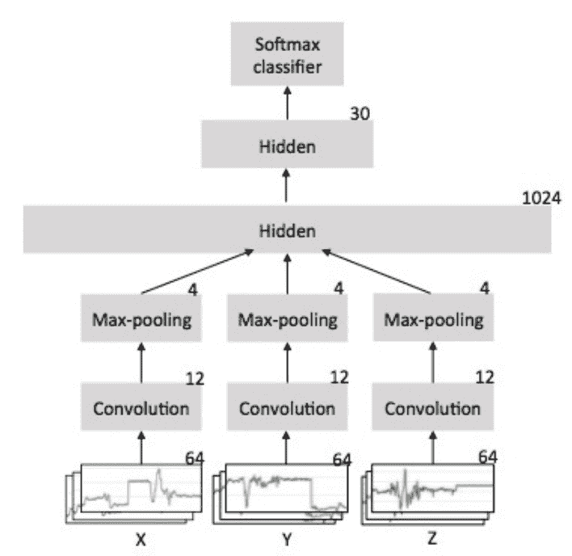
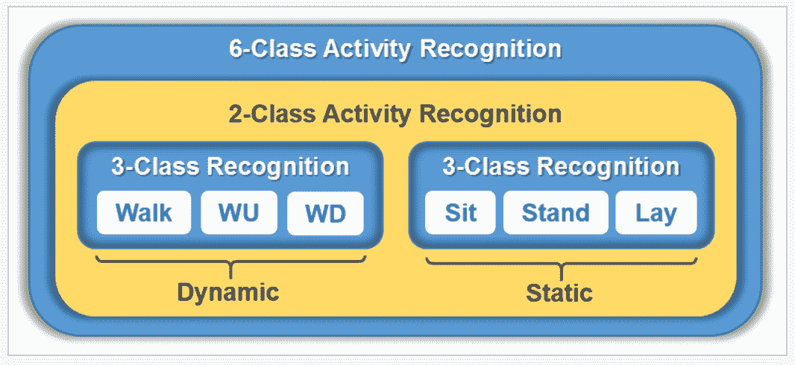
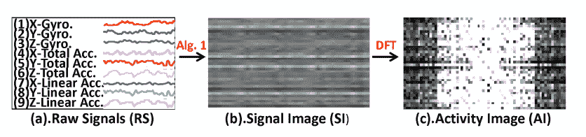
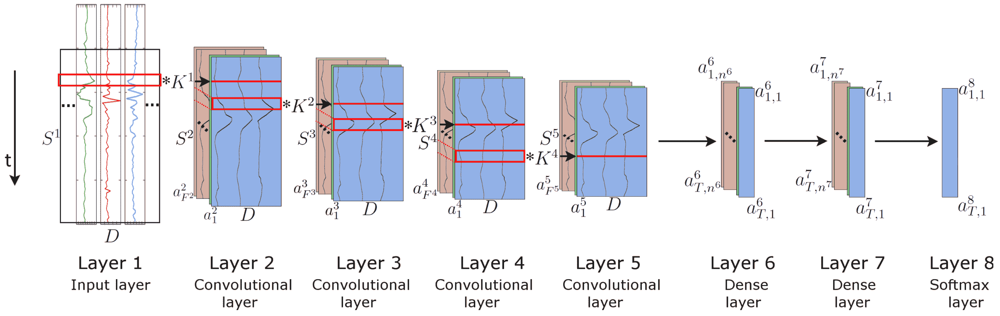

# 用于人类活动识别的深度学习模型

> 原文： [https://machinelearningmastery.com/deep-learning-models-for-human-activity-recognition/](https://machinelearningmastery.com/deep-learning-models-for-human-activity-recognition/)

人类活动识别（HAR）是具有挑战性的时间序列分类任务。

它涉及基于传感器数据预测人的移动，并且传统上涉及深度领域专业知识和来自信号处理的方法，以正确地设计来自原始数据的特征以适合机器学习模型。

最近，诸如卷积神经网络和循环神经网络的深度学习方法已经显示出通过自动学习原始传感器数据的特征而能够甚至实现最先进的结果。

在这篇文章中，您将发现人类活动识别的问题以及在这个问题上实现最先进表现的深度学习方法。

阅读这篇文章后，你会知道：

*   活动识别是基于传感器数据（例如智能手机中的加速度计）预测人（通常在室内）的移动的问题。
*   传感器数据流通常被分成称为窗口的子序列，并且每个窗口与更广泛的活动相关联，称为滑动窗口方法。
*   卷积神经网络和长期短期记忆网络，或许两者结合在一起，最适合从原始传感器数据中学习特征并预测相关的运动。

让我们开始吧。


用于人类活动识别的深度学习模型
照片由 [Simon Harrod](https://www.flickr.com/photos/sidibousaid/8238090492/) 拍摄，保留一些权利。

## 概观

这篇文章分为五个部分;他们是：

1.  人类活动识别
2.  神经网络建模的好处
3.  监督学习数据表示
4.  卷积神经网络模型
5.  循环神经网络模型

## 人类活动识别

人类活动识别（简称 HAR）是涉及基于传感器数据识别人的特定运动或动作的广泛研究领域。

运动通常是在室内进行的典型活动，例如步行，说话，站立和坐着。它们也可能是更集中的活动，例如在厨房或工厂车间进行的那些类型的活动。

可以远程记录传感器数据，例如视频，雷达或其他无线方法。或者，可以将数据直接记录在对象上，例如通过携带具有加速度计和陀螺仪的定制硬件或智能电话。

> 基于传感器的活动识别从大量低水平传感器读数中寻找关于人类活动的深刻的高级知识

- [基于传感器的活动识别深度学习：调查](https://www.sciencedirect.com/science/article/pii/S016786551830045X)，2018。

从历史上看，用于活动识别的传感器数据具有挑战性且收集成本高，需要定制硬件。现在，用于健身和健康监测的智能手机和其他个人跟踪设备便宜且无处不在。因此，来自这些设备的传感器数据收集起来更便宜，更常见，因此是一般活动识别问题的更常研究的版本。

问题是在给定传感器数据快照的情况下预测活动，通常是来自一个或少数传感器类型的数据。通常，该问题被构造为单变量或多变量时间序列分类任务。

这是一个具有挑战性的问题，因为没有明显或直接的方式将记录的传感器数据与特定的人类活动相关联，并且每个受试者可能执行具有显着变化的活动，导致所记录的传感器数据的变化。

目的是记录特定受试者的传感器数据和相应活动，根据该数据拟合模型，并推广模型以根据传感器数据对新看不见的受试者的活动进行分类。

## 神经网络建模的好处

传统上，来自信号处理领域的方法用于分析和提取收集的传感器数据。

这些方法用于特征工程，创建特定于域的，特定于传感器或特定于信号处理的特征以及原始数据的视图。然后对处理后的数据版本训练统计和机器学习模型。

此方法的局限性在于分析原始数据和设计拟合模型所需的功能所需的信号处理和领域专业知识。每个新数据集或传感器模态都需要这种专业知识。实质上，它昂贵且不可扩展。

> 然而，在大多数日常 HAR 任务中，这些方法可能严重依赖于启发式手工特征提取，其通常受到人类领域知识的限制。此外，这些方法只能学习浅层特征，导致无监督和增量任务的表现下降。由于这些限制，传统[模式识别]方法的表现在分类准确率和模型概括方面受到限制。

- [基于传感器的活动识别深度学习：调查](https://www.sciencedirect.com/science/article/pii/S016786551830045X)，2018。

理想情况下，可以使用学习方法自动学习直接从原始数据进行准确预测所需的功能。这将允许快速且廉价地采用新问题，新数据集和新传感器模态。

最近，深度神经网络模型已经开始实现其特征学习的承诺，并且正在实现人类活动识别的最新结果。它们能够从原始传感器数据执行自动功能学习，并且能够在手工制作的特定于域的功能上执行优秀的模型。

> [...]，特征提取和模型构建过程通常在深度学习模型中同时执行。这些功能可以通过网络自动学习，而不是手动设计。此外，深层神经网络还可以提取深层的高层表示，使其更适合于复杂的活动识别任务。

- [基于传感器的活动识别深度学习：调查](https://www.sciencedirect.com/science/article/pii/S016786551830045X)，2018。

神经网络有两种主要方法适用于时间序列分类，并且已经证明使用来自商品智能手机和健身追踪设备的传感器数据在活动识别方面表现良好。

它们是卷积神经网络模型和循环神经网络模型。

> 建议 RNN 和 LSTM 识别具有自然顺序的短活动，而 CNN 更好地推断长期重复活动。原因是 RNN 可以利用传感器读数之间的时间顺序关系，CNN 更能够学习递归模式中包含的深层特征。

- [基于传感器的活动识别深度学习：调查](https://www.sciencedirect.com/science/article/pii/S016786551830045X)，2018。

## 监督学习数据表示

在我们深入研究可用于人类活动识别的特定神经网络之前，我们需要讨论数据准备。

适用于时间序列分类的两种类型的神经网络都需要以特定方式准备数据以便适合模型。也就是说，在 _ 无监督学习 _'方式中，允许模型将信号数据与活动类相关联。

一种直接的数据准备方法，既可用于手工制作特征的经典机器学习方法，也可用于神经网络，包括将输入信号数据划分为信号窗口，其中给定窗口可能有一到几秒的观察时间数据。这通常被称为'_ 滑动窗口 _。

> 人类活动识别旨在从传感器捕获的一组观察中推断出一个或多个人的行为。通常，这是通过遵循用于特征提取的固定长度滑动窗口方法来执行的，其中必须修复两个参数：窗口的大小和移位。

- [用于活动识别的动态滑动窗口方法](https://link.springer.com/chapter/10.1007/978-3-642-22362-4_19)，2011

每个窗口还与特定活动相关联。给定的数据窗口可以具有多个变量，例如加速度计传感器的 x，y 和 z 轴。

让我们以一个例子来具体化。

我们有 10 分钟的传感器数据;可能看起来像：

```py
x, 		y, 		z, 		activity
1.1,	2.1,	0.1,	1
1.2,	2.2,	0.2,	1
1.3,	2.3,	0.3,	1
...
```

如果数据以 8 Hz 记录，则意味着执行活动所用的一秒钟将有八行数据。

我们可以选择让一个数据窗口代表一秒钟的数据;这意味着 8 Hz 传感器有 8 行数据。如果我们有 x，y 和 z 数据，那意味着我们将有 3 个变量。因此，单个数据窗口将是具有八个时间步长和三个特征的二维数组。

一个窗口代表一个样本。一分钟的数据代表 480 个传感器数据点，或 60 个 8 个时间步长的窗口。总共 10 分钟的数据将代表 4,800 个数据点，或 600 个数据窗口。

可以方便地根据样本或窗口的数量，窗口中的时间步数以及在每个时间步骤观察到的特征的数量来描述我们准备的传感器数据的形状。

```py
[samples, time steps, features]
```

我们以 8 Hz 记录的 10 分钟加速度计数据的示例将被概括为具有以下尺寸的三维数组：

```py
[600, 8, 3]
```

没有最佳窗口大小，它实际上取决于所使用的特定模型，收集的传感器数据的性质以及被分类的活动。

窗户的大小和模型的大小都有张力。较大的窗户需要较大的模型，较慢的训练，而较小的窗户需要较小的模型，更容易适应。

> 直观地，减小窗口大小允许更快的活动检测，以及减少的资源和能量需求。相反，通常考虑使用大数据窗口来识别复杂的活动

- [人类活动识别中的窗口大小影响](https://www.ncbi.nlm.nih.gov/pmc/articles/PMC4029702/)，2014 年。

然而，通常使用一到两秒的传感器数据以便对活动的当前片段进行分类。

> 从结果来看，减少的窗口（2 秒或更短）被证明可以提供最准确的检测表现。事实上，对于非常短的窗口（0.25-0.5 秒），可获得最精确的识别器，从而可以完美识别大多数活动。与通常认为的相反，本研究表明，大窗口尺寸不一定转化为更好的识别表现。

- [人类活动识别中的窗口大小影响](https://www.ncbi.nlm.nih.gov/pmc/articles/PMC4029702/)，2014 年。

将传感器数据流分成窗口可能会导致窗口错过一个活动到另一个活动的转换。因此，传统上将数据分成具有重叠的窗口是常见的，使得窗口的前半部分包含来自前一窗口的后半部分的观察，在 50％重叠的情况下。

> [...]不正确的长度可能会截断活动实例。在许多情况下，当窗口与一个活动的结尾和下一个活动的开头重叠时，错误会出现在活动的开头或结尾。在其他情况下，窗口长度可能太短而不能为识别过程提供最佳信息。

- [用于活动识别的动态滑动窗口方法](https://link.springer.com/chapter/10.1007/978-3-642-22362-4_19)，2011

目前还不清楚给定问题是否需要具有重叠的窗口。

在采用神经网络模型时，使用重叠（例如 50％重叠）将使训练数据的大小加倍，这可能有助于建模较小的数据集，但也可能导致过拟合训练数据集的模型。

> 对于某些应用，允许相邻窗口之间的重叠;但是，这种使用频率较低。

- [人类活动识别中的窗口大小影响](https://www.ncbi.nlm.nih.gov/pmc/articles/PMC4029702/)，2014 年。

## 卷积神经网络模型

卷积神经网络模型（简称 CNN）是一种深度神经网络，它被开发用于图像数据，例如，如手写识别。

事实证明，它们在大规模训练时可以有效地挑战计算机视觉问题，例如识别和定位图像中的对象以及自动描述图像内容。

它们是由两种主要类型的元素组成的模型：卷积层和池化层。

卷积层使用内核读取输入，例如 2D 图像或 1D 信号，该内核一次读取小段并跨越整个输入字段。每次读取都会生成投影到滤镜图上的输入，并表示输入的内部解释。

池化层采用特征图投影并将其提取到最基本的元素，例如使用信号平均或信号最大化过程。

卷积和合并层可以在深度重复，提供输入信号的多层抽象。

这些网络的输出通常是一个或多个完全连接的层，用于解释已读取的内容并将此内部表示映射到类值。

有关卷积神经网络的更多信息，可以看到帖子：

*   [用于机器学习的卷积神经网络的速成课程](https://machinelearningmastery.com/crash-course-convolutional-neural-networks/)

CNN 可以应用于人类活动识别数据。

CNN 模型学习将给定的信号数据窗口映射到模型读取每个数据窗口的活动，并准备窗口的内部表示。

> 当应用于像 HAR 这样的时间序列分类时，CNN 比其他模型具有两个优点：局部依赖性和尺度不变性。局部依赖性意味着 HAR 中的附近信号可能是相关的，而尺度不变性是指不同步幅或频率的尺度不变。

- [基于传感器的活动识别深度学习：调查](https://www.sciencedirect.com/science/article/pii/S016786551830045X)，2018。

使用 CNN 进行 HAR 的第一项重要工作是 Ming Zeng 等人在他们的 2014 年论文“使用移动传感器进行人类活动识别的 Co [nvolutional 神经网络”。](https://ieeexplore.ieee.org/document/7026300/)

在本文中，作者为加速度计数据开发了一个简单的 CNN 模型，其中加速度计数据的每个轴被馈送到单独的卷积层，汇集层，然后在被隐藏的完全连接层解释之前连接。

从纸上得到的图清楚地显示了模型的拓扑结构。它提供了一个很好的模板，用于 CNN 如何用于 HAR 问题和一般的时间序列分类。



用于加速度计数据的 CNN 模型的描述
取自“使用移动传感器进行人类活动识别的卷积神经网络”

有许多方法可以模拟 CNN 的 HAR 问题。

一个有趣的例子是 Heeryon Cho 和 Sang Min Yoon 在他们的 2018 年论文题为“[基于划分和征服的 1N CNN 人类活动识别使用测试数据锐化](http://www.mdpi.com/1424-8220/18/4/1055)”。

在其中，他们将活动分为涉及运动的那些，称为“_ 动态 _”，以及那些主体静止的，称为“_ 静态 _”，然后开发 CNN 模型来区分这两个主要类别。然后，在每个类中，开发模型以区分该类型的活动，例如动态的“_ 行走 _”和静态的“_ 坐 _”。



将活动分离为动态或静态
取自“基于划分和征服的 1N CNN 人类活动识别使用测试数据锐化”

他们将此称为两阶段建模方法。

> 我们不是直接使用单个 6 级分类器识别单个活动，而是应用分而治之的方法并构建一个两阶段活动识别过程，其中首先使用 2-来识别抽象活动，即动态和静态活动。类或二分类器，然后使用两个 3 级分类器识别单个活动。

- [基于划分和征服的 1D CNN 人类活动识别使用测试数据锐化](http://www.mdpi.com/1424-8220/18/4/1055)，2018。

开发了相当大的 CNN 模型，这反过来又使作者能够在具有挑战性的标准人类活动识别数据集上获得最先进的结果。

另一个有趣的方法是由 Wenchao Jiang 和 Zhaozheng Yin 在其 2015 年题为“[深度卷积神经网络](https://dl.acm.org/citation.cfm?id=2806333)使用可穿戴传感器的人类活动识别”的论文中提出的。

它们不是在信号数据上使用 1D CNN，而是将信号数据组合在一起以创建“_ 图像 _”，然后将其馈送到 2D CNN 并作为图像数据处理，其中信号的时间轴上有卷积，跨信号变量，特别是加速度计和陀螺仪数据。

> 首先，将原始信号逐行堆叠成信号图像[...]。在信号图像中，每个信号序列都有机会与每个其他序列相邻，这使得 DCNN 能够提取相邻信号之间的隐藏相关性。然后，将 2D 离散傅里叶变换（DFT）应用于信号图像，并选择其幅度作为我们的活动图像

- [通过深度卷积神经网络使用可穿戴传感器进行人类活动识别](https://dl.acm.org/citation.cfm?id=2806333)，2015 年。

下面描述了将原始传感器数据处理成图像，然后从图像处理成“_ 活动图像 _”，即离散傅立叶变换的结果。



将原始传感器数据处理成图像
取自“通过深度卷积神经网络使用可穿戴传感器的人类活动识别”

最后，关于这一主题的另一篇优秀论文是 Charissa Ann Ronao 和 Sung-Bae Cho 在 2016 年题为“[使用深度学习神经网络](https://www.sciencedirect.com/science/article/pii/S0957417416302056)的智能手机传感器进行人类活动识别”。

仔细研究 CNN 的使用表明，较大的内核大小的信号数据是有用的并且有限的汇集。

> 实验表明，尽管每个附加层的特征复杂度水平差异减小，但是对于每个附加层，回归实际上都会得到相关且更复杂的特征。可以利用更宽的时间局部相关时间跨度（1×9-1×14），并且低池化大小（1×2 -1×3）被证明是有益的。

- [使用深度学习神经网络的智能手机传感器识别人类活动](https://www.sciencedirect.com/science/article/pii/S0957417416302056)，2016 年。

有用的是，它们还为 CNN 模型提供了完整的超参数配置，可以为新的 HAR 和其他序列分类问题提供有用的起点，总结如下。


CNN 模型超参数配置表
取自“使用深度学习神经网络的智能手机传感器识别人体活动”。

## 循环神经网络模型

循环神经网络（简称 RNN）是一种神经网络，旨在从序列数据中学习，例如随时间观察的序列，或句子中的单词序列。

称为长短期记忆网络（或简称 LSTM）的特定类型的 RNN 可能是最广泛使用的 RNN，因为其精心设计克服了在序列数据上训练稳定的 RNN 的一般困难。

LSTM 在大规模训练手写识别，语言建模和机器翻译等任务时已证明对挑战序列预测问题有效。

LSTM 模型中的一个层由特殊单元组成，这些单元具有控制输入，输出和循环连接的门，其权重是学习的。每个 LSTM 单元还具有内部存储器或状态，当读取输入序列时，该内部存储器或状态被累积，并且可以由网络用作一种局部变量或存储器寄存器。

有关长期短期记忆网络的更多信息，请参阅帖子：

*   [深度学习的循环神经网络崩溃课程](https://machinelearningmastery.com/crash-course-recurrent-neural-networks-deep-learning/)

与可以读取输入序列的 CNN 一样，LSTM 读取输入观察序列并开发其自己的输入序列的内部表示。与 CNN 不同，LSTM 的训练方式应特别注意观察结果和输入序列中时间步长的预测误差，称为反向传播。

有关随时间反向传播的更多信息，请参阅帖子：

*   [沿时间反向传播的温和介绍](https://machinelearningmastery.com/gentle-introduction-backpropagation-time/)

LSTM 可以应用于人类活动识别的问题。

LSTM 学习将传感器数据的每个窗口映射到活动，其中一次一个地读取输入序列中的观察，其中每个时间步骤可以包括一个或多个变量（例如，并行序列）。

简单的 LSTM 模型在 HAR 问题上的应用有限。

其中一个例子是 Abdulmajid Murad 和 Jae-Young Pyun 2017 年题为“[用于人类活动识别的深度循环神经网络](http://www.mdpi.com/1424-8220/17/11/2556)”的论文。

重要的是，在论文中，他们评论了 CNN 在传感器数据的固定大小窗口上操作的要求的限制，这是 LSTM 并不严格限制的。

> 但是，卷积内核的大小限制了捕获的数据样本之间的依赖关系范围。因此，典型的模型不适用于各种活动识别配置，并且需要固定长度的输入窗口。

- [用于人类活动识别的深度循环神经网络](http://www.mdpi.com/1424-8220/17/11/2556)，2017 年。

他们探讨了 LSTM 的使用，它们既向前（正常）又向两个方向处理序列数据（双向 LSTM）。有趣的是，LSTM 预测传感器数据的子序列的每个输入时间步的活动，然后聚合这些活动以便预测窗口的活动。

> 每个时间步骤将有一个分数来预测在时间 t 发生的活动类型。通过将各个得分合并为单个预测来获得对整个窗口 T 的预测

- [用于人类活动识别的深度循环神经网络](http://www.mdpi.com/1424-8220/17/11/2556)，2017 年。

下面的图表提供了 LSTM 模型的描述，后面是完全连接的层，用于解释原始传感器数据的内部表示。


用于活动识别的 LSTM RNN 的描述
取自“用于人类活动识别的深度循环神经网络”。

在 CNN-LSTM 模型或 ConvLSTM 模型中，在 HAR 问题上结合 CNN 使用 LSTM 可能更常见。

这是使用 CNN 模型从原始样本数据的子序列中提取特征的地方，然后由 LSTM 聚合解释来自 CNN 的每个子序列的输出特征。

这方面的一个例子是 Francisco Javier Ordonez 和 Daniel Roggen 的 2016 年论文题为“[用于多模式可穿戴活动识别的深度卷积和 LSTM 循环神经网络](http://www.mdpi.com/1424-8220/16/1/115/html)”。

> 我们为可穿戴活动识别引入了一个新的 DNN 框架，我们将其称为 DeepConvLSTM。该架构结合了卷积层和循环层。卷积层充当特征提取器，并在特征映射中提供输入传感器数据的抽象表示。循环层模拟特征图激活的时间动态。

- [用于多模式可穿戴活动识别的深度卷积和 LSTM 循环神经网络](http://www.mdpi.com/1424-8220/16/1/115/html)，2016。

深度网络架构与四个卷积层一起使用，没有任何池化层，接着是两个 LSTM 层，用于在多个时间步骤中解释提取的特征。

作者声称，移除池化层是其模型架构的关键部分，其中在卷积层之后使用池化层会干扰卷积层学习对原始传感器数据进行下采样的能力。

> 在文献中，CNN 框架通常连续地包括卷积和汇集层，作为降低数据复杂性和引入平移不变特征的措施。然而，这种方法并不是架构的严格组成部分，并且在时间序列域中，DeepConvLSTM 不包括池化操作，因为网络的输入受到滑动窗口机制的约束[...]，这一事实限制了可能性假设 DeepConvLSTM 需要由循环层处理数据序列，则对数据进行下采样。然而，在没有滑动窗口要求的情况下，池化机制可用于覆盖更深层的不同传感器数据时间尺度。

- [用于多模式可穿戴活动识别的深度卷积和 LSTM 循环神经网络](http://www.mdpi.com/1424-8220/16/1/115/html)，2016。

下图取自纸张，使架构更清晰。请注意，图像中的层 6 和 7 实际上是 LSTM 层。



用于活动识别的 CNN LSTM 模型的描述
取自“用于多模式可穿戴活动识别的深度卷积和 LSTM 循环神经网络”。

## 进一步阅读

如果您希望深入了解，本节将提供有关该主题的更多资源。

### 一般

*   [基于传感器的活动识别深度学习：调查](https://www.sciencedirect.com/science/article/pii/S016786551830045X)，2018。

### 滑动窗户

*   [用于活动识别的动态滑动窗口方法](https://link.springer.com/chapter/10.1007/978-3-642-22362-4_19)，2011。
*   [人类活动识别中的窗口大小影响](https://www.ncbi.nlm.nih.gov/pmc/articles/PMC4029702/)，2014 年。

### 细胞神经网络

*   [使用移动传感器进行人类活动识别的卷积神经网络](https://ieeexplore.ieee.org/document/7026300/)，2014 年。
*   [基于划分和征服的 1D CNN 人类活动识别使用测试数据锐化](http://www.mdpi.com/1424-8220/18/4/1055)，2018。
*   [通过深度卷积神经网络使用可穿戴传感器进行人类活动识别](https://dl.acm.org/citation.cfm?id=2806333)，2015 年。
*   [使用深度学习神经网络的智能手机传感器识别人类活动](https://www.sciencedirect.com/science/article/pii/S0957417416302056)，2016 年。

### RNNs

*   [用于人类活动识别的深度循环神经网络](http://www.mdpi.com/1424-8220/17/11/2556)，2017 年。
*   [用于多模式可穿戴活动识别的深度卷积和 LSTM 循环神经网络](http://www.mdpi.com/1424-8220/16/1/115/html)，2016。

## 摘要

在这篇文章中，您发现了人类活动识别的问题以及深度学习方法的使用，这些方法在这个问题上实现了最先进的表现。

具体来说，你学到了：

*   活动识别是基于传感器数据（例如智能手机中的加速度计）预测人（通常在室内）的移动的问题。
*   传感器数据流通常被分成称为窗口的子序列，并且每个窗口与更广泛的活动相关联，称为滑动窗口方法。
*   卷积神经网络和长期短期记忆网络，或许两者结合在一起，最适合从原始传感器数据中学习特征并预测相关的运动。

你有任何问题吗？
在下面的评论中提出您的问题，我会尽力回答。