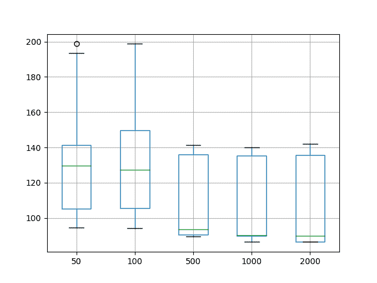
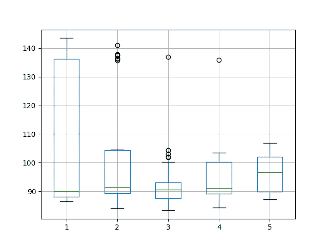
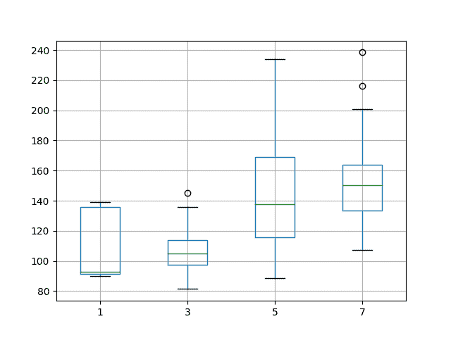
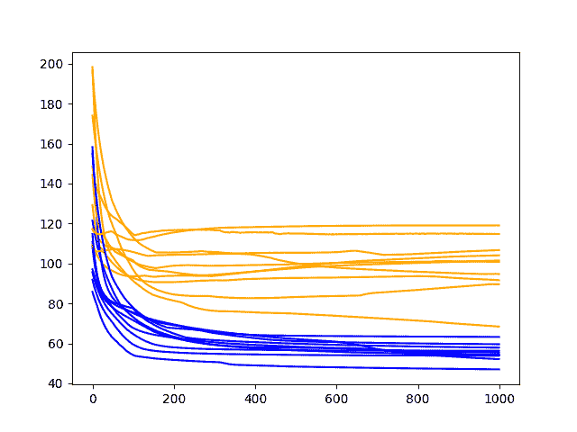

# 时间序列预测的多层感知器网络的探索性配置

> 原文： [https://machinelearningmastery.com/exploratory-configuration-multilayer-perceptron-network-time-series-forecasting/](https://machinelearningmastery.com/exploratory-configuration-multilayer-perceptron-network-time-series-forecasting/)

当开始使用神经网络的新预测建模项目时，可能会很困难。

有很多配置，并没有明确的想法从哪里开始。

系统化很重要。您可以打破糟糕的假设并快速磨练有效的配置和可能需要进一步调查的区域。

在本教程中，您将了解如何使用多层感知器（MLP）神经网络的探索性配置来为时间序列预测找到良好的首先模型。

完成本教程后，您将了解：

*   如何设计一个强大的实验测试工具来评估 MLP 模型的时间序列预测。
*   针对不同时期，神经元和滞后配置的系统实验设计。
*   如何解释结果并使用诊断来了解有关良好表现模型的更多信息。

让我们开始吧。

*   **2017 年 7 月更新**：更改了创建模型的功能，使其更具描述性。


用于时间序列预测的多层感知器网络的探索性配置
照片由 [Lachlan Donald](https://www.flickr.com/photos/lox/33885582/) 拍摄，保留一些权利。

## 教程概述

本教程分为 6 个部分。他们是：

1.  洗发水销售数据集
2.  实验测试线束
3.  不同的训练时代
4.  改变隐藏层神经元
5.  具有滞后的变隐藏层神经元
6.  审查结果

### 环境

本教程假定您已安装 Python SciPy 环境。您可以在此示例中使用 Python 2 或 3。

本教程假设您安装了 TensorFlow 或 Theano 后端的 Keras v2.0 或更高版本。

本教程还假设您安装了 scikit-learn，Pandas，NumPy 和 Matplotlib。

接下来，让我们看看标准时间序列预测问题，我们可以将其用作此实验的上下文。

如果您在设置 Python 环境时需要帮助，请参阅以下帖子：

*   [如何使用 Anaconda 设置用于机器学习和深度学习的 Python 环境](http://machinelearningmastery.com/setup-python-environment-machine-learning-deep-learning-anaconda/)

## 洗发水销售数据集

该数据集描述了 3 年期间每月洗发水的销售数量。

单位是销售计数，有 36 个观察。原始数据集归功于 Makridakis，Wheelwright 和 Hyndman（1998）。

[您可以在此处下载并了解有关数据集的更多信息](https://datamarket.com/data/set/22r0/sales-of-shampoo-over-a-three-year-period)。

下面的示例加载并创建已加载数据集的图。

```py
# load and plot dataset
from pandas import read_csv
from pandas import datetime
from matplotlib import pyplot
# load dataset
def parser(x):
	return datetime.strptime('190'+x, '%Y-%m')
series = read_csv('shampoo-sales.csv', header=0, parse_dates=[0], index_col=0, squeeze=True, date_parser=parser)
# summarize first few rows
print(series.head())
# line plot
series.plot()
pyplot.show()
```

运行该示例将数据集作为 Pandas Series 加载并打印前 5 行。

```py
Month
1901-01-01 266.0
1901-02-01 145.9
1901-03-01 183.1
1901-04-01 119.3
1901-05-01 180.3
Name: Sales, dtype: float64
```

然后创建该系列的线图，显示明显的增加趋势。


洗发水销售数据集的线图

接下来，我们将看一下实验中使用的模型配置和测试工具。

## 实验测试线束

本节介绍本教程中使用的测试工具。

### 数据拆分

我们将 Shampoo Sales 数据集分为两部分：训练和测试集。

前两年的数据将用于训练数据集，剩余的一年数据将用于测试集。

将使用训练数据集开发模型，并对测试数据集做出预测。

测试数据集的持久性预测（朴素预测）实现了每月洗发水销售 136.761 的错误。这在测试集上提供了较低的可接受表现限制。

### 模型评估

将使用滚动预测场景，也称为前进模型验证。

测试数据集的每个时间步骤将一次一个地走。将使用模型对时间步长做出预测，然后将获取测试集的实际预期值，并使其可用于下一时间步的预测模型。

这模仿了一个真实世界的场景，每个月都会有新的洗发水销售观察结果，并用于下个月的预测。

这将通过训练和测试数据集的结构进行模拟。

将收集关于测试数据集的所有预测，并计算错误分数以总结模型的技能。将使用均方根误差（RMSE），因为它会对大错误进行处罚，并产生与预测数据相同的分数，即每月洗发水销售额。

### 数据准备

在我们将 MLP 模型拟合到数据集之前，我们必须转换数据。

在拟合模型和做出预测之前，对数据集执行以下三个数据变换。

1.  **转换时间序列数据，使其静止**。具体而言，滞后= 1 差分以消除数据中的增加趋势。
2.  **将时间序列转换为监督学习问题**。具体而言，将数据组织成输入和输出模式，其中前一时间步的观察被用作预测当前时间步的观察的输入
3.  **将观察结果转换为具有特定比例**。具体而言，将数据重新调整为-1 到 1 之间的值。

这些变换在预测时反转，在计算和误差分数之前将它们恢复到原始比例。

### MLP 模型

我们将使用具有 1 个神经元隐藏层的基础 MLP 模型，对隐藏神经元的整流线性激活函数，以及输出神经元上的线性激活函数。

在可能的情况下使用批量大小为 4，并且截断训练数据以确保模式的数量可被 4 整除。在某些情况下，使用批量大小为 2。

通常，训练数据集在每个批次或每个时期之后进行混洗，这有助于将训练数据集拟合到分类和回归问题上。所有实验都关闭了改组，因为它似乎可以带来更好的表现。需要更多的研究来确认时间序列预测的结果。

使用有效的 ADAM 优化算法和均方误差损失函数来拟合模型。

### 实验运行

每个实验场景将运行 30 次，并且测试集上的 RMSE 得分将从每次运行结束时记录。

让我们深入研究实验。

## 不同的训练时代

在第一个实验中，我们将研究改变隐藏层中具有一个隐藏层和一个神经元的简单 MLP 的训练时期的数量。

我们将使用批量大小为 4 并评估训练时期 50,100,500,1000 和 2000。

完整的代码清单如下。

此代码清单将用作所有后续实验的基础，后续部分中仅提供对此代码的更改。

```py
from pandas import DataFrame
from pandas import Series
from pandas import concat
from pandas import read_csv
from pandas import datetime
from sklearn.metrics import mean_squared_error
from sklearn.preprocessing import MinMaxScaler
from keras.models import Sequential
from keras.layers import Dense
from math import sqrt
import matplotlib
# be able to save images on server
matplotlib.use('Agg')
from matplotlib import pyplot
import numpy

# date-time parsing function for loading the dataset
def parser(x):
	return datetime.strptime('190'+x, '%Y-%m')

# frame a sequence as a supervised learning problem
def timeseries_to_supervised(data, lag=1):
	df = DataFrame(data)
	columns = [df.shift(i) for i in range(1, lag+1)]
	columns.append(df)
	df = concat(columns, axis=1)
	return df

# create a differenced series
def difference(dataset, interval=1):
	diff = list()
	for i in range(interval, len(dataset)):
		value = dataset[i] - dataset[i - interval]
		diff.append(value)
	return Series(diff)

# invert differenced value
def inverse_difference(history, yhat, interval=1):
	return yhat + history[-interval]

# scale train and test data to [-1, 1]
def scale(train, test):
	# fit scaler
	scaler = MinMaxScaler(feature_range=(-1, 1))
	scaler = scaler.fit(train)
	# transform train
	train = train.reshape(train.shape[0], train.shape[1])
	train_scaled = scaler.transform(train)
	# transform test
	test = test.reshape(test.shape[0], test.shape[1])
	test_scaled = scaler.transform(test)
	return scaler, train_scaled, test_scaled

# inverse scaling for a forecasted value
def invert_scale(scaler, X, yhat):
	new_row = [x for x in X] + [yhat]
	array = numpy.array(new_row)
	array = array.reshape(1, len(array))
	inverted = scaler.inverse_transform(array)
	return inverted[0, -1]

# fit an MLP network to training data
def fit_model(train, batch_size, nb_epoch, neurons):
	X, y = train[:, 0:-1], train[:, -1]
	model = Sequential()
	model.add(Dense(neurons, activation='relu', input_dim=X.shape[1]))
	model.add(Dense(1))
	model.compile(loss='mean_squared_error', optimizer='adam')
	model.fit(X, y, epochs=nb_epoch, batch_size=batch_size, verbose=0, shuffle=False)
	return model

# run a repeated experiment
def experiment(repeats, series, epochs, lag, neurons):
	# transform data to be stationary
	raw_values = series.values
	diff_values = difference(raw_values, 1)
	# transform data to be supervised learning
	supervised = timeseries_to_supervised(diff_values, lag)
	supervised_values = supervised.values[lag:,:]
	# split data into train and test-sets
	train, test = supervised_values[0:-12], supervised_values[-12:]
	# transform the scale of the data
	scaler, train_scaled, test_scaled = scale(train, test)
	# run experiment
	error_scores = list()
	for r in range(repeats):
		# fit the model
		batch_size = 4
		train_trimmed = train_scaled[2:, :]
		model = fit_model(train_trimmed, batch_size, epochs, neurons)
		# forecast test dataset
		test_reshaped = test_scaled[:,0:-1]
		output = model.predict(test_reshaped, batch_size=batch_size)
		predictions = list()
		for i in range(len(output)):
			yhat = output[i,0]
			X = test_scaled[i, 0:-1]
			# invert scaling
			yhat = invert_scale(scaler, X, yhat)
			# invert differencing
			yhat = inverse_difference(raw_values, yhat, len(test_scaled)+1-i)
			# store forecast
			predictions.append(yhat)
		# report performance
		rmse = sqrt(mean_squared_error(raw_values[-12:], predictions))
		print('%d) Test RMSE: %.3f' % (r+1, rmse))
		error_scores.append(rmse)
	return error_scores

# load dataset
series = read_csv('shampoo-sales.csv', header=0, parse_dates=[0], index_col=0, squeeze=True, date_parser=parser)
# experiment
repeats = 30
results = DataFrame()
lag = 1
neurons = 1
# vary training epochs
epochs = [50, 100, 500, 1000, 2000]
for e in epochs:
	results[str(e)] = experiment(repeats, series, e, lag, neurons)
# summarize results
print(results.describe())
# save boxplot
results.boxplot()
pyplot.savefig('boxplot_epochs.png')
```

运行实验在每次实验运行结束时打印测试集 RMSE。

在所有运行结束时，提供了一个摘要统计表，每个统计信息对应一行，每列有一个配置。

总结统计表明，平均 1000 个训练时期导致更好的表现，随着训练时期的增加，误差总体下降趋势。

```py
               50         100         500        1000        2000
count   30.000000   30.000000   30.000000   30.000000   30.000000
mean   129.660167  129.388944  111.444027  103.821703  107.500301
std     30.926344   28.499592   23.181317   22.138705   24.780781
min     94.598957   94.184903   89.506815   86.511801   86.452041
25%    105.198414  105.722736   90.679930   90.058655   86.457260
50%    129.705407  127.449491   93.508245   90.118331   90.074494
75%    141.420145  149.625816  136.157299  135.510850  135.741340
max    198.716220  198.704352  141.226816  139.994388  142.097747
```

还创建了每个配置的测试 RMSE 分数分布的盒子和须状图，并保存到文件中。

该图强调了每个配置在测试 RMSE 分数（框）中显示相同的一般分布，中位数（绿线）随着训练时期的增加而向下趋势。

结果证实，配置的 MLP 训练 1000 是这个问题的一个很好的起点。



用于洗发水销售数据集的时间序列预测的变化训练时期的盒子和晶须图

网络配置需要考虑的另一个角度是模型适应时的行为方式。

我们可以在每个训练时期之后评估训练和测试数据集上的模型，以了解配置是否过拟合或不适合问题。

我们将在每组实验的最佳结果上使用此诊断方法。将运行总共 10 次重复的配置，并且在线图上绘制每个训练迭代之后的训练和测试 RMSE 得分。

在这种情况下，我们将在 MLP 适合 1000 个时期使用此诊断。

完整的诊断代码清单如下。

与前面的代码清单一样，下面的代码清单将用作本教程中所有诊断的基础，并且后续部分中仅提供对此清单的更改。

```py
from pandas import DataFrame
from pandas import Series
from pandas import concat
from pandas import read_csv
from pandas import datetime
from sklearn.metrics import mean_squared_error
from sklearn.preprocessing import MinMaxScaler
from keras.models import Sequential
from keras.layers import Dense
from math import sqrt
import matplotlib
# be able to save images on server
matplotlib.use('Agg')
from matplotlib import pyplot
import numpy

# date-time parsing function for loading the dataset
def parser(x):
	return datetime.strptime('190'+x, '%Y-%m')

# frame a sequence as a supervised learning problem
def timeseries_to_supervised(data, lag=1):
	df = DataFrame(data)
	columns = [df.shift(i) for i in range(1, lag+1)]
	columns.append(df)
	df = concat(columns, axis=1)
	df = df.drop(0)
	return df

# create a differenced series
def difference(dataset, interval=1):
	diff = list()
	for i in range(interval, len(dataset)):
		value = dataset[i] - dataset[i - interval]
		diff.append(value)
	return Series(diff)

# scale train and test data to [-1, 1]
def scale(train, test):
	# fit scaler
	scaler = MinMaxScaler(feature_range=(-1, 1))
	scaler = scaler.fit(train)
	# transform train
	train = train.reshape(train.shape[0], train.shape[1])
	train_scaled = scaler.transform(train)
	# transform test
	test = test.reshape(test.shape[0], test.shape[1])
	test_scaled = scaler.transform(test)
	return scaler, train_scaled, test_scaled

# inverse scaling for a forecasted value
def invert_scale(scaler, X, yhat):
	new_row = [x for x in X] + [yhat]
	array = numpy.array(new_row)
	array = array.reshape(1, len(array))
	inverted = scaler.inverse_transform(array)
	return inverted[0, -1]

# evaluate the model on a dataset, returns RMSE in transformed units
def evaluate(model, raw_data, scaled_dataset, scaler, offset, batch_size):
	# separate
	X, y = scaled_dataset[:,0:-1], scaled_dataset[:,-1]
	# forecast dataset
	output = model.predict(X, batch_size=batch_size)
	# invert data transforms on forecast
	predictions = list()
	for i in range(len(output)):
		yhat = output[i,0]
		# invert scaling
		yhat = invert_scale(scaler, X[i], yhat)
		# invert differencing
		yhat = yhat + raw_data[i]
		# store forecast
		predictions.append(yhat)
	# report performance
	rmse = sqrt(mean_squared_error(raw_data[1:], predictions))
	return rmse

# fit an MLP network to training data
def fit(train, test, raw, scaler, batch_size, nb_epoch, neurons):
	X, y = train[:, 0:-1], train[:, -1]
	# prepare model
	model = Sequential()
	model.add(Dense(neurons, activation='relu', input_dim=X.shape[1]))
	model.add(Dense(1))
	model.compile(loss='mean_squared_error', optimizer='adam')
	# fit model
	train_rmse, test_rmse = list(), list()
	for i in range(nb_epoch):
		model.fit(X, y, epochs=1, batch_size=batch_size, verbose=0, shuffle=False)
		# evaluate model on train data
		raw_train = raw[-(len(train)+len(test)+1):-len(test)]
		train_rmse.append(evaluate(model, raw_train, train, scaler, 0, batch_size))
		# evaluate model on test data
		raw_test = raw[-(len(test)+1):]
		test_rmse.append(evaluate(model, raw_test, test, scaler, 0, batch_size))
	history = DataFrame()
	history['train'], history['test'] = train_rmse, test_rmse
	return history

# run diagnostic experiments
def run():
	# config
	repeats = 10
	n_batch = 4
	n_epochs = 1000
	n_neurons = 1
	n_lag = 1
	# load dataset
	series = read_csv('shampoo-sales.csv', header=0, parse_dates=[0], index_col=0, squeeze=True, date_parser=parser)
	# transform data to be stationary
	raw_values = series.values
	diff_values = difference(raw_values, 1)
	# transform data to be supervised learning
	supervised = timeseries_to_supervised(diff_values, n_lag)
	supervised_values = supervised.values[n_lag:,:]
	# split data into train and test-sets
	train, test = supervised_values[0:-12], supervised_values[-12:]
	# transform the scale of the data
	scaler, train_scaled, test_scaled = scale(train, test)
	# fit and evaluate model
	train_trimmed = train_scaled[2:, :]
	# run diagnostic tests
	for i in range(repeats):
		history = fit(train_trimmed, test_scaled, raw_values, scaler, n_batch, n_epochs, n_neurons)
		pyplot.plot(history['train'], color='blue')
		pyplot.plot(history['test'], color='orange')
		print('%d) TrainRMSE=%f, TestRMSE=%f' % (i, history['train'].iloc[-1], history['test'].iloc[-1]))
	pyplot.savefig('diagnostic_epochs.png')

# entry point
run()
```

运行诊断程序打印最终训练并测试每次运行的 RMSE。更有趣的是创建的最终线图。

线图显示了每个训练时期之后的训练 RMSE（蓝色）和测试 RMSE（橙色）。

在这种情况下，诊断图显示在大约 400 个训练时期之后训练和测试 RMSE 几乎没有差异。训练和测试表现均接近平坦线。

这种快速平衡表明模型正在达到容量，并且可以从滞后观察或额外神经元方面的更多信息中受益。


训练诊断线图和洗发水销售数据集 1000 个时期的测试表现

## 改变隐藏层神经元

在本节中，我们将研究改变单个隐藏层中神经元的数量。

增加神经元的数量会增加网络的学习能力，从而存在过拟合训练数据的风险。

我们将探索将神经元的数量从 1 增加到 5 并使网络适合 1000 个时期。

下面列出了实验脚本的不同之处。

```py
# load dataset
series = read_csv('shampoo-sales.csv', header=0, parse_dates=[0], index_col=0, squeeze=True, date_parser=parser)
# experiment
repeats = 30
results = DataFrame()
lag = 1
epochs = 1000
# vary neurons
neurons = [1, 2, 3, 4, 5]
for n in neurons:
	results[str(n)] = experiment(repeats, series, epochs, lag, n)
# summarize results
print(results.describe())
# save boxplot
results.boxplot()
pyplot.savefig('boxplot_neurons.png')
```

运行实验将打印每个配置的摘要统计信息。

从平均表现来看，它表明测试 RMSE 随着单个隐藏层中神经元数量的增加而减少。

最好的结果似乎是 3 个神经元。

```py
                1           2           3           4           5
count   30.000000   30.000000   30.000000   30.000000   30.000000
mean   105.107026  102.836520   92.675912   94.889952   96.577617
std     23.130824   20.102353   10.266732    9.751318    6.421356
min     86.565630   84.199871   83.388967   84.385293   87.208454
25%     88.035396   89.386670   87.643954   89.154866   89.961809
50%     90.084895   91.488484   90.670565   91.204303   96.717739
75%    136.145248  104.416518   93.117926  100.228730  101.969331
max    143.428154  140.923087  136.883946  135.891663  106.797563
```

还创建了一个盒子和须状图，以总结和比较结果的分布。

该图证实了 3 个神经元与其他配置相比表现良好的建议，并且还表明结果的扩散也较小。这可能表明配置更稳定。



用于洗发水销售数据集的时间序列预测的变异隐藏神经元的盒子和晶须图

同样，我们可以通过回顾适用于 1000 个时期的 3 个神经元的所选配置的诊断来更深入地潜水。

诊断脚本的更改仅限于`run()`功能，如下所示。

```py
# run diagnostic experiments
def run():
	# config
	repeats = 10
	n_batch = 4
	n_epochs = 1000
	n_neurons = 3
	n_lag = 1
	# load dataset
	series = read_csv('shampoo-sales.csv', header=0, parse_dates=[0], index_col=0, squeeze=True, date_parser=parser)
	# transform data to be stationary
	raw_values = series.values
	diff_values = difference(raw_values, 1)
	# transform data to be supervised learning
	supervised = timeseries_to_supervised(diff_values, n_lag)
	supervised_values = supervised.values[n_lag:,:]
	# split data into train and test-sets
	train, test = supervised_values[0:-12], supervised_values[-12:]
	# transform the scale of the data
	scaler, train_scaled, test_scaled = scale(train, test)
	# fit and evaluate model
	train_trimmed = train_scaled[2:, :]
	# run diagnostic tests
	for i in range(repeats):
		history = fit(train_trimmed, test_scaled, raw_values, scaler, n_batch, n_epochs, n_neurons)
		pyplot.plot(history['train'], color='blue')
		pyplot.plot(history['test'], color='orange')
		print('%d) TrainRMSE=%f, TestRMSE=%f' % (i, history['train'].iloc[-1], history['test'].iloc[-1]))
	pyplot.savefig('diagnostic_neurons.png')
```

运行诊断脚本为每个训练时期提供了训练和测试 RMSE 的线图。

这种诊断方法表明模型技能可能已经过时，可能大约有 400 个时代。该图还提出了过拟合的可能情况，其中测试 RMSE 在过去 500 个训练时期略有增加，但训练 RMSE 没有强烈增加。


训练诊断线图和 3 个隐藏神经元在洗发水销售数据集上的测试表现

## 具有滞后的变隐藏层神经元

在本节中，我们将考虑将滞后观测值作为输入增加，同时增加网络容量。

增加的滞后观察将自动缩放输入神经元的数量。例如，作为输入的 3 个滞后观察将导致 3 个输入神经元。

添加的输入将需要网络中的额外容量。因此，我们还将使用滞后观察的数量作为输入来缩放一个隐藏层中的神经元的数量。

我们将使用奇数个滞后观察作为 1,3,5 和 7 的输入，并分别使用相同数量的神经元。

输入数量的改变影响在将时间序列数据转换为监督学习问题期间的训练模式的总数。因此，对于本节中的所有实验，批量大小从 4 减少到 2。

在每次实验运行中总共使用 1000 个训练时期。

基础实验脚本的更改仅限于 _ 实验（）_ 功能和实验运行，如下所示。

```py
# run a repeated experiment
def experiment(repeats, series, epochs, lag, neurons):
	# transform data to be stationary
	raw_values = series.values
	diff_values = difference(raw_values, 1)
	# transform data to be supervised learning
	supervised = timeseries_to_supervised(diff_values, lag)
	supervised_values = supervised.values[lag:,:]
	# split data into train and test-sets
	train, test = supervised_values[0:-12], supervised_values[-12:]
	# transform the scale of the data
	scaler, train_scaled, test_scaled = scale(train, test)
	# run experiment
	error_scores = list()
	for r in range(repeats):
		# fit the model
		batch_size = 2
		model = fit_model(train_scaled, batch_size, epochs, neurons)
		# forecast test dataset
		test_reshaped = test_scaled[:,0:-1]
		output = model.predict(test_reshaped, batch_size=batch_size)
		predictions = list()
		for i in range(len(output)):
			yhat = output[i,0]
			X = test_scaled[i, 0:-1]
			# invert scaling
			yhat = invert_scale(scaler, X, yhat)
			# invert differencing
			yhat = inverse_difference(raw_values, yhat, len(test_scaled)+1-i)
			# store forecast
			predictions.append(yhat)
		# report performance
		rmse = sqrt(mean_squared_error(raw_values[-12:], predictions))
		print('%d) Test RMSE: %.3f' % (r+1, rmse))
		error_scores.append(rmse)
	return error_scores

# load dataset
series = read_csv('shampoo-sales.csv', header=0, parse_dates=[0], index_col=0, squeeze=True, date_parser=parser)
# experiment
repeats = 30
results = DataFrame()
epochs = 1000
# vary neurons
neurons = [1, 3, 5, 7]
for n in neurons:
	results[str(n)] = experiment(repeats, series, epochs, n, n)
# summarize results
print(results.describe())
# save boxplot
results.boxplot()
pyplot.savefig('boxplot_neurons_lag.png')
```

运行实验会使用每个配置的描述性统计信息汇总结果。

结果表明滞后输入变量的所有增加随隐藏神经元的增加而降低表现。

值得注意的是 1 个神经元和 1 个输入配置，与上一节的结果相比，产生了类似的均值和标准差。

表现的降低可能与较小的批量大小有关，并且 1-神经元/ 1 滞后情况的结果不足以解释这一点。

```py
                1           3           5           7
count   30.000000   30.000000   30.000000   30.000000
mean   105.465038  109.447044  158.894730  147.024776
std     20.827644   15.312300   43.177520   22.717514
min     89.909627   77.426294   88.515319   95.801699
25%     92.187690  102.233491  125.008917  132.335683
50%     92.587411  109.506480  166.438582  145.078842
75%    135.386125  118.635143  189.457325  166.329000
max    139.941789  144.700754  232.962778  186.185471
```

还创建了结果分布的盒子和须状图，允许比较配置。

有趣的是，与其他配置相比，使用 3 个神经元和 3 个输入变量显示更紧密的传播。这类似于上一节中所见的 3 个神经元和 1 个输入变量的观察结果。



用于洗发水销售数据集的时间序列预测的变化滞后特征和隐藏神经元的盒子和晶须图

我们还可以使用诊断来梳理模型动态在拟合模型时可能发生的变化。

3-lag / 3-neurons 的结果很有意思，我们将进一步研究它们。

诊断脚本的更改仅限于`run()`功能。

```py
# run diagnostic experiments
def run():
	# config
	repeats = 10
	n_batch = 2
	n_epochs = 1000
	n_neurons = 3
	n_lag = 3
	# load dataset
	series = read_csv('shampoo-sales.csv', header=0, parse_dates=[0], index_col=0, squeeze=True, date_parser=parser)
	# transform data to be stationary
	raw_values = series.values
	diff_values = difference(raw_values, 1)
	# transform data to be supervised learning
	supervised = timeseries_to_supervised(diff_values, n_lag)
	supervised_values = supervised.values[n_lag:,:]
	# split data into train and test-sets
	train, test = supervised_values[0:-12], supervised_values[-12:]
	# transform the scale of the data
	scaler, train_scaled, test_scaled = scale(train, test)
	# fit and evaluate model
	train_trimmed = train_scaled[2:, :]
	# run diagnostic tests
	for i in range(repeats):
		history = fit(train_trimmed, test_scaled, raw_values, scaler, n_batch, n_epochs, n_neurons)
		pyplot.plot(history['train'], color='blue')
		pyplot.plot(history['test'], color='orange')
		print('%d) TrainRMSE=%f, TestRMSE=%f' % (i, history['train'].iloc[-1], history['test'].iloc[-1]))
	pyplot.savefig('diagnostic_neurons_lag.png')
```

运行诊断脚本会创建一个线图，显示在每个训练时期之后 10 次实验运行的训练和测试 RMSE。

结果表明在前 500 个时期内学习良好，并且可能在剩余的时期过拟合，测试 RMSE 显示出增加的趋势，并且训练 RMSE 显示出下降趋势。



训练诊断线图和 3 个隐藏神经元的测试表现和洗发水销售数据集的滞后特征

## 审查结果

我们在本教程中介绍了很多内容。让我们来复习。

*   **时代**。我们研究了模型技能如何随着训练时期的变化而变化，并发现 1000 可能是一个很好的起点。
*   **神经元**。我们研究了隐藏层中神经元数量的变化，发现 3 个神经元可能是一个很好的配置。
*   **滞后输入**。我们考虑将滞后观察的数量作为输入变化，同时增加隐藏层中神经元的数量，并发现结果通常变得更糟，但是隐藏层中的 3 个神经元显示出兴趣。与其他实验相比，差的结果可能与批量大小从 4 变为 2 有关。

结果表明，在隐藏层中使用 1 个滞后输入，3 个神经元，并且适合作为首次切割模型配置的 1000 个时期。

这可以通过多种方式得到改善;下一节列出了一些想法。

### 扩展

本节列出了您可能想要探索的扩展和后续实验。

*   **Shuffle vs No Shuffle** 。没有使用洗牌，这是不正常的。在拟合时间序列预测模型时，开发一个实验来比较改组与训练集的无改组。
*   **归一化方法**。数据重新调整为-1 到 1，这是 tanh 激活函数的典型值，未在模型配置中使用。探索其他重新缩放，例如 0-1 规范化和标准化以及对模型表现的影响。
*   **多层**。探索使用多个隐藏层来增加网络容量，以了解更复杂的多步模式。
*   **特色工程**。探索使用其他功能，例如错误时间序列，甚至每个观察的日期时间元素。

另外，看看帖子：

*   [如何提高深度学习效能](http://machinelearningmastery.com/improve-deep-learning-performance/)

你尝试过这些扩展吗？
在以下评论中发布您的结果。

## 摘要

在本教程中，您了解了如何使用系统实验来探索多层感知器在时间序列预测中的配置，并开发出第一个切割模型。

具体来说，你学到了：

*   如何开发一个强大的测试工具来评估时间序列预测的 MLP 模型。
*   如何系统地评估训练时期，隐藏层神经元和滞后输入。
*   如何使用诊断来帮助解释结果并建议后续实验。

您对本教程有任何疑问吗？
在下面的评论中提出您的问题，我会尽力回答。