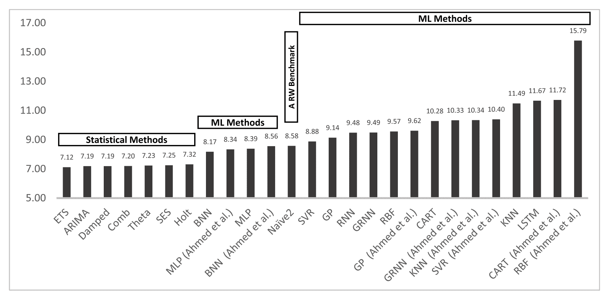

# 比较时间序列预测的的经典和机器学习方法的结果

> 原文： [https://machinelearningmastery.com/findings-comparing-classical-and-machine-learning-methods-for-time-series-forecasting/](https://machinelearningmastery.com/findings-comparing-classical-and-machine-learning-methods-for-time-series-forecasting/)

通常报告机器学习和深度学习方法是所有预测性建模问题的关键解决方案。

最近一项重要的研究评估并比较了许多经典和现代机器学习和深度学习方法在 1000 多个单变量时间序列预测问题的大量不同组合中的表现。

这项研究的结果表明，简单的经典方法，如线性方法和指数平滑，优于复杂和复杂的方法，如决策树，多层感知机（MLP）和长期短期记忆（LSTM）网络模型。

这些发现突出了评估经典方法并将其结果用作评估任何机器学习和时间序列预测的深度学习方法的基线的要求，以证明其增加的复杂性增加了预测技能。

在这篇文章中，您将发现这项最新研究的重要发现，评估和比较经典和现代机器学习方法在大量不同时间序列预测数据集上的表现。

阅读这篇文章后，你会知道：

*   像 ETS 和 ARIMA 这样的经典方法胜过机器学习和深度学习方法，可以对单变量数据集进行一步预测。
*   像 Theta 和 ARIMA 这样的经典方法胜过机器学习和深度学习方法，可以对单变量数据集进行多步预测。
*   机器学习和深度学习方法还没有兑现他们对单变量时间序列预测的承诺，还有很多工作要做。

让我们开始吧。

研究结果比较时间序列预测的经典和机器学习方法
[Lyndon Hatherall](https://www.flickr.com/photos/m8ee/8492207975/) 的照片，保留一些权利。

## 概观

[Spyros Makridakis](https://en.wikipedia.org/wiki/Spyros_Makridakis) ，等。发表于 2018 年的一项研究题为“[统计和机器学习预测方法：关注和前进方向](http://journals.plos.org/plosone/article?id=10.1371/journal.pone.0194889)。”

在这篇文章中，我们将仔细研究 Makridakis 等人的研究。仔细评估和比较经典时间序列预测方法与现代机器学习方法的表现。

这篇文章分为七个部分;他们是：

1.  学习动机
2.  时间序列数据集
3.  时间序列预测方法
4.  数据准备
5.  一步预测结果
6.  多步预测结果
7.  成果

## 学习动机

该研究的目的是清楚地展示一套不同的机器学习方法的能力，与传统的时间序列预测方法相比，它可以收集大量不同的单变量时间序列预测问题。

该研究是对越来越多的论文的回应，并声称机器学习和深度学习方法为时间序列预测提供了优异的结果，几乎没有客观证据。

> 数以百计的论文提出了新的 ML 算法，提出了方法上的进步和准确率的改进。然而，关于它们作为标准预测工具的相对表现，可获得有限的客观证据。

- [统计和机器学习预测方法：关注点和前进方向](http://journals.plos.org/plosone/article?id=10.1371/journal.pone.0194889)，2018。

作者清楚地提出了大量索赔的三个问题;他们是：

*   他们的结论基于一些甚至一个时间序列，提出了关于结果的统计显着性及其概括性的问题。
*   对这些方法进行短期预测视野评估，通常是一步到位，不考虑中期和长期预测。
*   没有使用基准来比较 ML 方法与其他方法的准确率。

作为回应，该研究包括八种经典方法和 10 种机器学习方法，使用一个步骤和多步骤预测，在 1,045 个月度时间序列的集合中进行评估。

虽然不是确定的，但结果旨在客观和稳健。

## 时间序列数据集

研究中使用的时间序列数据集来自 M3 竞赛中使用的时间序列数据集。

M3 竞赛是一系列竞赛中的第三项，旨在准确发现在实时系列预测问题中哪些算法在实践中表现良好。比赛结果发表在 2000 年题为“ [M3 竞赛：结果，结论和影响](https://www.sciencedirect.com/science/article/pii/S0169207000000571)”的论文中。

比赛中使用的数据集来自各行各业，并且具有从小时到年度的各种不同时间间隔。

> M3-Competition 的 3003 系列是在配额基础上选择的，包括各种类型的时间序列数据（微观，行业，宏观等）和连续观测之间的不同时间间隔（年度，季度等）。

下表摘自论文，提供了竞赛中使用的 3,003 个数据集的摘要。

M3 竞赛中使用的数据集，行业和时间间隔表
取自“M3 竞赛：结果，结论和影响”。

竞争的结果是更简单的时间序列预测方法优于更复杂的方法，包括神经网络模型。

> 这项研究，前两次 M-Competitions 和许多其他实证研究已经证明，除了最简单的疑问之外，精心设计的理论结构或更复杂的方法并不一定能提高样本后预测的准确率，而不是简单的方法，尽管它们可以更好地适应统计模型到可用的历史数据。

- [M3-竞争：结果，结论和影响](https://www.sciencedirect.com/science/article/pii/S0169207000000571)，2000。

我们在本文中回顾的最近一项评估机器学习方法的研究选择了 1,045 个时间序列的子集，每月间隔与 M3 竞赛中使用的间隔相比。

> ...使用 M3 竞赛中使用的 1045 个月度时间序列的大部分，在多个预测视野中评估此类表现。

- [统计和机器学习预测方法：关注点和前进方向](http://journals.plos.org/plosone/article?id=10.1371/journal.pone.0194889)，2018。

## 时间序列预测方法

该研究评估了八种经典（或简单）方法和 10 种机器学习方法的表现。

> ......八种传统统计方法和八种流行的 ML 方法，以及近两年来最受欢迎的两种方法。

- [统计和机器学习预测方法：关注点和前进方向](http://journals.plos.org/plosone/article?id=10.1371/journal.pone.0194889)，2018。

评估的八种经典方法如下：

*   朴素 2，实际上是一个随季节调整的随机游走模型。
*   简单的指数平滑。
*   霍尔特。
*   阻尼指数平滑。
*   SES，Holt 和 Damped 的平均值。
*   Theta 方法。
*   ARIMA，自动。
*   ETS，自动。

共有八种机器学习方法用于重现和比较 2010 年论文“[时间序列预测的机器学习模型的经验比较](https://www.tandfonline.com/doi/abs/10.1080/07474938.2010.481556)”中提供的结果。

他们是：

*   多层感知机（MLP）
*   贝叶斯神经网络（BNN）
*   径向基函数（RBF）
*   广义循环神经网络（GRNN），也称为核回归
*   K-最近邻回归（KNN）
*   CART 回归树（CART）
*   支持向量回归（SVR）
*   高斯过程（GP）

另外两个'_ 现代 _'神经网络算法也被添加到列表中，因为它们的采用率最近有所上升;他们是：

*   循环神经网络（RNN）
*   长短期记忆（LSTM）

## 数据准备

再次，基于 2010 年论文“[时间序列预测的机器学习模型的经验比较](https://www.tandfonline.com/doi/abs/10.1080/07474938.2010.481556)”中描述的方法，使用了谨慎的数据准备方法。

在那篇论文中，每个时间序列都是使用幂变换进行调整，去季节化和去趋势化。

> [...]在计算 18 个预测之前，他们对系列进行了预处理，以实现平均值和方差的平稳性。这是使用对数转换，然后去季节化和最终缩放来完成的，同时还考虑了去除趋势分量的第一个差异。

- [统计和机器学习预测方法：关注点和前进方向](http://journals.plos.org/plosone/article?id=10.1371/journal.pone.0194889)，2018。

受这些操作的启发，对一步预测的 MLP 应用了五种不同数据转换的变体，并对它们的结果进行了比较。五个转变是：

*   原始数据。
*   Box-Cox 功率变换。
*   延长数据的时间。
*   去除数据。
*   所有三个变换（权力，去季节化，趋势）。

一般来说，人们发现最好的方法是应用功率变换并对数据进行去季节化，并且可能也会对系列产生不利影响。

> 根据 sMAPE 的最佳组合是 7 号（Box-Cox 转换，deseasonalization），而根据 MASE 的最佳组合是 10 号（Box-Cox 转换，deseasonalization 和 detrending）

- [统计和机器学习预测方法：关注点和前进方向](http://journals.plos.org/plosone/article?id=10.1371/journal.pone.0194889)，2018。

## 一步预测结果

所有模型均使用一步时间序列预测进行评估。

具体而言，最后 18 个时间步骤用作测试集，并且模型适合于所有剩余的观察。对测试集中的 18 个观测值中的每个观测值进行单独的一步预测，可能使用前向验证方法，其中使用真实观测值作为输入以进行每个预测。

> 预测模型是使用前 n - 18 个观测值开发的，其中 n 是序列的长度。然后，生成了 18 个预测，并且与开发预测模型时未使用的实际值进行了评估。

- [统计和机器学习预测方法：关注点和前进方向](http://journals.plos.org/plosone/article?id=10.1371/journal.pone.0194889)，2018。

回顾结果，发现 MLP 和 BNN 从所有机器学习方法中获得最佳表现。

> 结果表明，MLP 和 BNN 的表现优于其余的 ML 方法。

- [统计和机器学习预测方法：关注点和前进方向](http://journals.plos.org/plosone/article?id=10.1371/journal.pone.0194889)，2018。

令人惊讶的结果是发现 RNN 和 LSTM 表现不佳。

> 应该指出的是，RNN 是不太准确的 ML 方法之一，这表明研究进展并不一定能保证预测表现的提高。这个结论也适用于 LSTM 的表现，LSTM 是另一种流行且更先进的 ML 方法，它也不能提高预测准确率。

- [统计和机器学习预测方法：关注点和前进方向](http://journals.plos.org/plosone/article?id=10.1371/journal.pone.0194889)，2018。

比较所有方法的表现，发现机器学习方法都是通过简单的经典方法进行的，其中 ETS 和 ARIMA 模型的整体表现最佳。

这一发现证实了之前类似研究和竞赛的结果。

条形图比较模型表现（sMAPE）的一步预测
取自“统计和机器学习预测方法：关注和前进方向”。

## 多步预测结果

多步骤预测涉及在最后一次已知观察之前预测多个步骤。

针对机器学习方法评估了[多步预测](https://machinelearningmastery.com/multi-step-time-series-forecasting/)的三种方法;他们是：

*   迭代预测
*   直接预测
*   多神经网络预测

发现经典方法再次优于机器学习方法。

在这种情况下，发现诸如 Theta，ARIMA 和指数平滑（梳状）的组合的方法实现了最佳表现。

> 简而言之，统计模型在所有预测视野中似乎总体上优于 ML 方法，根据所检查的误差指标，Theta，Comb 和 ARIMA 在竞争者中占主导地位。

- [统计和机器学习预测方法：关注点和前进方向](http://journals.plos.org/plosone/article?id=10.1371/journal.pone.0194889)，2018。

## 成果

该研究提供了重要的支持证据，即经典方法可能主导单变量时间序列预测，至少在评估的预测问题类型上如此。

该研究表明，对于单步和多步预测的单变量时间序列预测，机器学习和深度学习方法的表现更差，计算成本增加。

这些发现强烈鼓励使用经典方法，如 ETS，ARIMA 等，作为探索更精细方法之前的第一步，并要求将这些简单方法的结果用作表现的基线，以便更精细的方法必须清楚，以证明其使用的合理性。

它还强调了不仅要考虑仔细使用数据准备方法，而且需要主动测试针对给定问题的多种不同数据准备方案组合，以便发现哪种方法最有效，即使在经典方法的情况下也是如此。

机器学习和深度学习方法仍然可以在特定的单变量时间序列问题上获得更好的表现，并且应该进行评估。

该研究没有考虑更复杂的时间序列问题，例如那些数据集：

*   复杂的不规则时间结构
*   缺少观察
*   噪音很大。
*   多个变量之间复杂的相互关系。

该研究总结了一个诚实的困惑，为什么机器学习方法在实践中表现如此糟糕，因为它们在其他人工智能领域表现出色。

> 最有趣的问题和最大的挑战是找出其表现不佳的原因，目的是提高准确率并发挥其巨大潜力。人工智能学习算法已经彻底改变了各种领域的广泛应用，并且没有理由用 ML 方法在预测中无法实现同样的目标。因此，我们必须找到如何应用以提高他们更准确的预测能力。

- [统计和机器学习预测方法：关注点和前进方向](http://journals.plos.org/plosone/article?id=10.1371/journal.pone.0194889)，2018。

作者对 LSTM 和 RNN 进行了评论，这些评论通常被认为是一般的序列预测问题的深度学习方法，在这种情况下，它们在实践中表现明显不佳。

> [...]人们会期望更高级的 NN 类型的 RNN 和 LSTM 比 ARIMA 和其他统计方法更准确。

- [统计和机器学习预测方法：关注点和前进方向](http://journals.plos.org/plosone/article?id=10.1371/journal.pone.0194889)，2018。

他们评论说 LSTM 似乎更适合拟合或过拟合训练数据集而不是预测它。

> 另一个有趣的例子可能是 LSTM 的情况与较简单的 NN（如 RNN 和 MLP）相比，报告更好的模型拟合但更差的预测准确率

- [统计和机器学习预测方法：关注点和前进方向](http://journals.plos.org/plosone/article?id=10.1371/journal.pone.0194889)，2018。

有工作要做，机器学习方法和深度学习方法比传统的统计方法更有学习时间序列数据的承诺，甚至通过自动特征学习直接对原始观察这样做。

> 鉴于他们的学习能力，ML 方法应该比简单的基准测试更好，比如指数平滑。接受问题是设计可行解决方案的第一步，我们希望 AI 和 ML 领域的人员能够接受实证研究结果并努力提高其方法的预测准确率。

- [统计和机器学习预测方法：关注点和前进方向](http://journals.plos.org/plosone/article?id=10.1371/journal.pone.0194889)，2018。

## 进一步阅读

如果您希望深入了解，本节将提供有关该主题的更多资源。

*   [Makridakis 比赛，维基百科](https://en.wikipedia.org/wiki/Makridakis_Competitions)
*   [M3-竞争：结果，结论和影响](https://www.sciencedirect.com/science/article/pii/S0169207000000571)，2000。
*   [M4 竞赛：结果，发现，结论和前进方向](https://www.sciencedirect.com/science/article/pii/S0169207018300785)，2018。
*   [统计和机器学习预测方法：关注点和前进方向](http://journals.plos.org/plosone/article?id=10.1371/journal.pone.0194889)，2018。
*   [时间序列预测机器学习模型的实证比较](https://www.tandfonline.com/doi/abs/10.1080/07474938.2010.481556)，2010。

## 摘要

在这篇文章中，您发现了最近一项研究的重要发现，该研究评估和比较了经典和现代机器学习方法在大量不同时间序列预测数据集上的表现。

具体来说，你学到了：

*   像 ETS 和 ARIMA 这样的经典方法胜过机器学习和深度学习方法，可以对单变量数据集进行一步预测。
*   像 Theta 和 ARIMA 这样的经典方法胜过机器学习和深度学习方法，可以对单变量数据集进行多步预测。
*   机器学习和深度学习方法尚未兑现其对单变量时间序列预测的承诺，还有很多工作要做。

你有任何问题吗？
在下面的评论中提出您的问题，我会尽力回答。