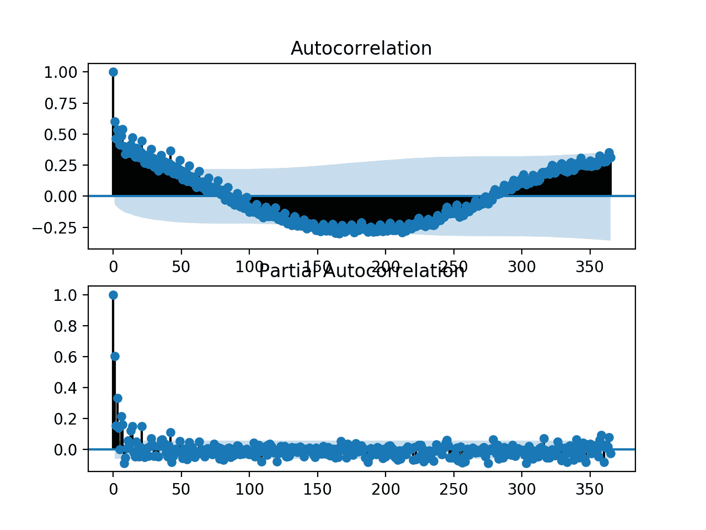
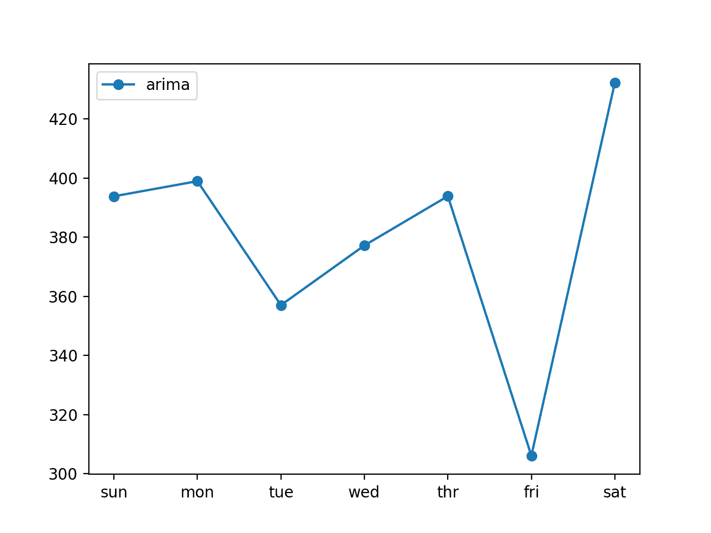

# 如何构建家庭用电自回归预测模型

> 原文： [https://machinelearningmastery.com/how-to-develop-an-autoregression-forecast-model-for-household-electricity-consumption/](https://machinelearningmastery.com/how-to-develop-an-autoregression-forecast-model-for-household-electricity-consumption/)

鉴于智能电表的兴起以及太阳能电池板等发电技术的广泛采用，可提供大量的用电数据。

该数据代表了多变量时间序列的功率相关变量，而这些变量又可用于建模甚至预测未来的电力消耗。

自相关模型非常简单，可以提供快速有效的方法，对电力消耗进行熟练的一步和多步预测。

在本教程中，您将了解如何开发和评估用于多步预测家庭功耗的自回归模型。

完成本教程后，您将了解：

*   如何创建和分析单变量时间序列数据的自相关和部分自相关图。
*   如何使用自相关图中的结果来配置自动回归模型。
*   如何开发和评估用于进行一周预测的自相关模型。

让我们开始吧。


如何制定家庭用电的自回归预测模型
[wongaboo](https://www.flickr.com/photos/27146806@N00/22122826108/) 的照片，保留一些权利。

## 教程概述

本教程分为五个部分;他们是：

1.  问题描述
2.  加载并准备数据集
3.  模型评估
4.  自相关分析
5.  开发自回归模型

## 问题描述

'[家庭用电量](https://archive.ics.uci.edu/ml/datasets/individual+household+electric+power+consumption)'数据集是一个多变量时间序列数据集，描述了四年内单个家庭的用电量。

该数据是在 2006 年 12 月至 2010 年 11 月之间收集的，并且每分钟收集家庭内的能耗观察结果。

它是一个多变量系列，由七个变量组成（除日期和时间外）;他们是：

*   **global_active_power** ：家庭消耗的总有功功率（千瓦）。
*   **global_reactive_power** ：家庭消耗的总无功功率（千瓦）。
*   **电压**：平均电压（伏特）。
*   **global_intensity** ：平均电流强度（安培）。
*   **sub_metering_1** ：厨房的有功电能（瓦特小时的有功电能）。
*   **sub_metering_2** ：用于洗衣的有功能量（瓦特小时的有功电能）。
*   **sub_metering_3** ：气候控制系统的有功电能（瓦特小时的有功电能）。

有功和无功电能参考[交流电](https://en.wikipedia.org/wiki/AC_power)的技术细节。

可以通过从总活动能量中减去三个定义的子计量变量的总和来创建第四个子计量变量，如下所示：

```py
sub_metering_remainder = (global_active_power * 1000 / 60) - (sub_metering_1 + sub_metering_2 + sub_metering_3)
```

## 加载并准备数据集

数据集可以从 UCI 机器学习库下载为单个 20 兆字节的.zip 文件：

*   [household_power_consumption.zip](https://archive.ics.uci.edu/ml/machine-learning-databases/00235/household_power_consumption.zip)

下载数据集并将其解压缩到当前工作目录中。您现在将拥有大约 127 兆字节的文件“ _household_power_consumption.txt_ ”并包含所有观察结果。

我们可以使用 _read_csv（）_ 函数来加载数据，并将前两列合并到一个日期时间列中，我们可以将其用作索引。

```py
# load all data
dataset = read_csv('household_power_consumption.txt', sep=';', header=0, low_memory=False, infer_datetime_format=True, parse_dates={'datetime':[0,1]}, index_col=['datetime'])
```

接下来，我们可以用'_ 标记所有[缺失值](https://machinelearningmastery.com/handle-missing-timesteps-sequence-prediction-problems-python/)？_ '具有`NaN`值的字符，这是一个浮点数。

这将允许我们将数据作为一个浮点值数组而不是混合类型（效率较低）。

```py
# mark all missing values
dataset.replace('?', nan, inplace=True)
# make dataset numeric
dataset = dataset.astype('float32')
```

我们还需要填写缺失值，因为它们已被标记。

一种非常简单的方法是从前一天的同一时间复制观察。我们可以在一个名为 _fill_missing（）_ 的函数中实现它，该函数将从 24 小时前获取数据的 NumPy 数组并复制值。

```py
# fill missing values with a value at the same time one day ago
def fill_missing(values):
	one_day = 60 * 24
	for row in range(values.shape[0]):
		for col in range(values.shape[1]):
			if isnan(values[row, col]):
				values[row, col] = values[row - one_day, col]
```

我们可以将此函数直接应用于 DataFrame 中的数据。

```py
# fill missing
fill_missing(dataset.values)
```

现在，我们可以使用上一节中的计算创建一个包含剩余子计量的新列。

```py
# add a column for for the remainder of sub metering
values = dataset.values
dataset['sub_metering_4'] = (values[:,0] * 1000 / 60) - (values[:,4] + values[:,5] + values[:,6])
```

我们现在可以将清理后的数据集版本保存到新文件中;在这种情况下，我们只需将文件扩展名更改为.csv，并将数据集保存为“ _household_power_consumption.csv_ ”。

```py
# save updated dataset
dataset.to_csv('household_power_consumption.csv')
```

将所有这些结合在一起，下面列出了加载，清理和保存数据集的完整示例。

```py
# load and clean-up data
from numpy import nan
from numpy import isnan
from pandas import read_csv
from pandas import to_numeric

# fill missing values with a value at the same time one day ago
def fill_missing(values):
	one_day = 60 * 24
	for row in range(values.shape[0]):
		for col in range(values.shape[1]):
			if isnan(values[row, col]):
				values[row, col] = values[row - one_day, col]

# load all data
dataset = read_csv('household_power_consumption.txt', sep=';', header=0, low_memory=False, infer_datetime_format=True, parse_dates={'datetime':[0,1]}, index_col=['datetime'])
# mark all missing values
dataset.replace('?', nan, inplace=True)
# make dataset numeric
dataset = dataset.astype('float32')
# fill missing
fill_missing(dataset.values)
# add a column for for the remainder of sub metering
values = dataset.values
dataset['sub_metering_4'] = (values[:,0] * 1000 / 60) - (values[:,4] + values[:,5] + values[:,6])
# save updated dataset
dataset.to_csv('household_power_consumption.csv')
```

运行该示例将创建新文件' _household_power_consumption.csv_ '，我们可以将其用作建模项目的起点。

## 模型评估

在本节中，我们将考虑如何开发和评估家庭电力数据集的预测模型。

本节分为四个部分;他们是：

1.  问题框架
2.  评估指标
3.  训练和测试集
4.  前瞻性验证

### 问题框架

有许多方法可以利用和探索家庭用电量数据集。

在本教程中，我们将使用这些数据来探索一个非常具体的问题;那是：

> 鉴于最近的耗电量，未来一周的预期耗电量是多少？

这要求预测模型预测未来七天每天的总有功功率。

从技术上讲，考虑到多个预测步骤，这个问题的框架被称为多步骤时间序列预测问题。利用多个输入变量的模型可以称为多变量多步时间序列预测模型。

这种类型的模型在规划支出方面可能有助于家庭。在供应方面，它也可能有助于规划特定家庭的电力需求。

数据集的这种框架还表明，将每分钟功耗的观察结果下采样到每日总数是有用的。这不是必需的，但考虑到我们对每天的总功率感兴趣，这是有道理的。

我们可以使用 pandas DataFrame 上的 [resample（）函数](https://pandas.pydata.org/pandas-docs/stable/generated/pandas.DataFrame.resample.html)轻松实现这一点。使用参数'`D`'调用此函数允许按日期时间索引的加载数据按天分组（[查看所有偏移别名](http://pandas.pydata.org/pandas-docs/stable/timeseries.html#offset-aliases)）。然后，我们可以计算每天所有观测值的总和，并为八个变量中的每一个创建每日耗电量数据的新数据集。

下面列出了完整的示例。

```py
# resample minute data to total for each day
from pandas import read_csv
# load the new file
dataset = read_csv('household_power_consumption.csv', header=0, infer_datetime_format=True, parse_dates=['datetime'], index_col=['datetime'])
# resample data to daily
daily_groups = dataset.resample('D')
daily_data = daily_groups.sum()
# summarize
print(daily_data.shape)
print(daily_data.head())
# save
daily_data.to_csv('household_power_consumption_days.csv')
```

运行该示例将创建一个新的每日总功耗数据集，并将结果保存到名为“ _household_power_consumption_days.csv_ ”的单独文件中。

我们可以将其用作数据集，用于拟合和评估所选问题框架的预测模型。

### 评估指标

预测将包含七个值，一个用于一周中的每一天。

多步预测问题通常分别评估每个预测时间步长。这有助于以下几个原因：

*   在特定提前期评论技能（例如+1 天 vs +3 天）。
*   在不同的交付时间基于他们的技能对比模型（例如，在+1 天的模型和在日期+5 的模型良好的模型）。

总功率的单位是千瓦，并且具有也在相同单位的误差度量将是有用的。均方根误差（RMSE）和平均绝对误差（MAE）都符合这个要求，尽管 RMSE 更常用，将在本教程中采用。与 MAE 不同，RMSE 更能预测预测误差。

此问题的表现指标是从第 1 天到第 7 天的每个提前期的 RMSE。

作为捷径，使用单个分数总结模型的表现以帮助模型选择可能是有用的。

可以使用的一个可能的分数是所有预测天数的 RMSE。

下面的函数 _evaluate_forecasts（）_ 将实现此行为并基于多个七天预测返回模型的表现。

```py
# evaluate one or more weekly forecasts against expected values
def evaluate_forecasts(actual, predicted):
	scores = list()
	# calculate an RMSE score for each day
	for i in range(actual.shape[1]):
		# calculate mse
		mse = mean_squared_error(actual[:, i], predicted[:, i])
		# calculate rmse
		rmse = sqrt(mse)
		# store
		scores.append(rmse)
	# calculate overall RMSE
	s = 0
	for row in range(actual.shape[0]):
		for col in range(actual.shape[1]):
			s += (actual[row, col] - predicted[row, col])**2
	score = sqrt(s / (actual.shape[0] * actual.shape[1]))
	return score, scores
```

运行该函数将首先返回整个 RMSE，无论白天，然后每天返回一系列 RMSE 分数。

### 训练和测试集

我们将使用前三年的数据来训练预测模型和评估模型的最后一年。

给定数据集中的数据将分为标准周。这些是从周日开始到周六结束的周。

这是使用所选模型框架的现实且有用的方法，其中可以预测未来一周的功耗。它也有助于建模，其中模型可用于预测特定日期（例如星期三）或整个序列。

我们将数据拆分为标准周，从测试数据集向后工作。

数据的最后一年是 2010 年，2010 年的第一个星期日是 1 月 3 日。数据于 2010 年 11 月中旬结束，数据中最接近的最后一个星期六是 11 月 20 日。这给出了 46 周的测试数据。

下面提供了测试数据集的每日数据的第一行和最后一行以供确认。

```py
2010-01-03,2083.4539999999984,191.61000000000055,350992.12000000034,8703.600000000033,3842.0,4920.0,10074.0,15888.233355799992
...
2010-11-20,2197.006000000004,153.76800000000028,346475.9999999998,9320.20000000002,4367.0,2947.0,11433.0,17869.76663959999
```

每日数据从 2006 年底开始。

数据集中的第一个星期日是 12 月 17 日，这是第二行数据。

将数据组织到标准周内为训练预测模型提供了 159 个完整的标准周。

```py
2006-12-17,3390.46,226.0059999999994,345725.32000000024,14398.59999999998,2033.0,4187.0,13341.0,36946.66673200004
...
2010-01-02,1309.2679999999998,199.54600000000016,352332.8399999997,5489.7999999999865,801.0,298.0,6425.0,14297.133406600002
```

下面的函数 _split_dataset（）_ 将每日数据拆分为训练集和测试集，并将每个数据组织成标准周。

使用特定行偏移来使用数据集的知识来分割数据。然后使用 NumPy [split（）函数](https://docs.scipy.org/doc/numpy/reference/generated/numpy.split.html)将分割数据集组织成每周数据。

```py
# split a univariate dataset into train/test sets
def split_dataset(data):
	# split into standard weeks
	train, test = data[1:-328], data[-328:-6]
	# restructure into windows of weekly data
	train = array(split(train, len(train)/7))
	test = array(split(test, len(test)/7))
	return train, test
```

我们可以通过加载每日数据集并打印训练和测试集的第一行和最后一行数据来测试此功能，以确认它们符合上述预期。

完整的代码示例如下所示。

```py
# split into standard weeks
from numpy import split
from numpy import array
from pandas import read_csv

# split a univariate dataset into train/test sets
def split_dataset(data):
	# split into standard weeks
	train, test = data[1:-328], data[-328:-6]
	# restructure into windows of weekly data
	train = array(split(train, len(train)/7))
	test = array(split(test, len(test)/7))
	return train, test

# load the new file
dataset = read_csv('household_power_consumption_days.csv', header=0, infer_datetime_format=True, parse_dates=['datetime'], index_col=['datetime'])
train, test = split_dataset(dataset.values)
# validate train data
print(train.shape)
print(train[0, 0, 0], train[-1, -1, 0])
# validate test
print(test.shape)
print(test[0, 0, 0], test[-1, -1, 0])
```

运行该示例表明，训练数据集确实有 159 周的数据，而测试数据集有 46 周。

我们可以看到，第一行和最后一行的训练和测试数据集的总有效功率与我们定义为每组标准周界限的特定日期的数据相匹配。

```py
(159, 7, 8)
3390.46 1309.2679999999998
(46, 7, 8)
2083.4539999999984 2197.006000000004
```

### 前瞻性验证

将使用称为[前进验证](https://machinelearningmastery.com/backtest-machine-learning-models-time-series-forecasting/)的方案评估模型。

这是需要模型进行一周预测的地方，然后该模型的实际数据可用于模型，以便它可以用作在随后一周进行预测的基础。这对于如何在实践中使用模型以及对模型有益而使其能够利用最佳可用数据都是现实的。

我们可以通过分离输入数据和输出/预测数据来证明这一点。

```py
Input, 						Predict
[Week1]						Week2
[Week1 + Week2]				Week3
[Week1 + Week2 + Week3]		Week4
...
```

评估此数据集上的预测模型的前瞻性验证方法在下面实现，命名为 _evaluate_model（）_。

为模型提供函数的名称作为参数“`model_func`”。该功能负责定义模型，使模型适合训练数据，并进行一周的预测。

然后使用先前定义的 _evaluate_forecasts（）_ 函数，针对测试数据集评估模型所做的预测。

```py
# evaluate a single model
def evaluate_model(model_func, train, test):
	# history is a list of weekly data
	history = [x for x in train]
	# walk-forward validation over each week
	predictions = list()
	for i in range(len(test)):
		# predict the week
		yhat_sequence = model_func(history)
		# store the predictions
		predictions.append(yhat_sequence)
		# get real observation and add to history for predicting the next week
		history.append(test[i, :])
	predictions = array(predictions)
	# evaluate predictions days for each week
	score, scores = evaluate_forecasts(test[:, :, 0], predictions)
	return score, scores
```

一旦我们对模型进行评估，我们就可以总结表现。

以下名为 _summarize_scores（）_ 的函数将模型的表现显示为单行，以便与其他模型进行比较。

```py
# summarize scores
def summarize_scores(name, score, scores):
	s_scores = ', '.join(['%.1f' % s for s in scores])
	print('%s: [%.3f] %s' % (name, score, s_scores))
```

我们现在已经开始评估数据集上的预测模型的所有元素。

## 自相关分析

统计相关性总结了两个变量之间关系的强度。

我们可以假设每个变量的分布符合[高斯](https://machinelearningmastery.com/statistical-data-distributions/)（钟形曲线）分布。如果是这种情况，我们可以使用 Pearson 相关系数来总结变量之间的相关性。

Pearson 相关系数是介于-1 和 1 之间的数字，分别描述了负相关或正相关。值为零表示没有相关性。

我们可以计算时间序列观测值与之前时间步长的观测值之间的相关性，称为滞后。因为时间序列观测值的相关性是使用先前时间的相同序列的值计算的，所以这称为序列相关或自相关。

滞后时间序列自相关的图称为[自相关函数](https://machinelearningmastery.com/gentle-introduction-autocorrelation-partial-autocorrelation/)，或首字母缩略词 ACF。该图有时称为[相关图](https://en.wikipedia.org/wiki/Correlogram)，或自相关图。

部分自相关函数或 PACF 是时间序列中的观察与先前时间步骤的观察与中间观察的关系被移除之间的关系的总结。

观察的自相关和先前时间步的观察包括直接相关和间接相关。这些间接相关性是观察相关性的线性函数，以及在中间时间步骤的观察。

部分自相关函数试图消除这些间接相关性。没有进入数学，这是部分自相关的直觉。

我们可以分别使用 [plot_acf（）](http://www.statsmodels.org/dev/generated/statsmodels.graphics.tsaplots.plot_acf.html)和 [plot_pacf（）](http://www.statsmodels.org/dev/generated/statsmodels.graphics.tsaplots.plot_pacf.html) statsmodels 函数计算自相关和部分自相关图。

为了计算和绘制自相关，我们必须将数据转换为单变量时间序列。具体而言，观察到每日消耗的总功率。

下面的 _to_series（）_ 功能将多元数据划分为每周窗口，并返回单个单变量时间序列。

```py
# convert windows of weekly multivariate data into a series of total power
def to_series(data):
	# extract just the total power from each week
	series = [week[:, 0] for week in data]
	# flatten into a single series
	series = array(series).flatten()
	return series
```

我们可以为准备好的训练数据集调用此函数。

首先，必须加载每日功耗数据集。

```py
# load the new file
dataset = read_csv('household_power_consumption_days.csv', header=0, infer_datetime_format=True, parse_dates=['datetime'], index_col=['datetime'])
```

然后必须使用标准周窗口结构将数据集拆分为训练集和测试集。

```py
# split into train and test
train, test = split_dataset(dataset.values)
```

然后可以从训练数据集中提取每日功耗的单变量时间序列。

```py
# convert training data into a series
series = to_series(train)
```

然后我们可以创建一个包含 ACF 和 PACF 图的单个图。可以指定延迟时间步数。我们将此修复为每日观察一年或 365 天。

```py
# plots
pyplot.figure()
lags = 365
# acf
axis = pyplot.subplot(2, 1, 1)
plot_acf(series, ax=axis, lags=lags)
# pacf
axis = pyplot.subplot(2, 1, 2)
plot_pacf(series, ax=axis, lags=lags)
# show plot
pyplot.show()
```

下面列出了完整的示例。

我们预计明天和未来一周消耗的电量将取决于前几天消耗的电量。因此，我们期望在 ACF 和 PACF 图中看到强烈的自相关信号。

```py
# acf and pacf plots of total power
from numpy import split
from numpy import array
from pandas import read_csv
from matplotlib import pyplot
from statsmodels.graphics.tsaplots import plot_acf
from statsmodels.graphics.tsaplots import plot_pacf

# split a univariate dataset into train/test sets
def split_dataset(data):
	# split into standard weeks
	train, test = data[1:-328], data[-328:-6]
	# restructure into windows of weekly data
	train = array(split(train, len(train)/7))
	test = array(split(test, len(test)/7))
	return train, test

# convert windows of weekly multivariate data into a series of total power
def to_series(data):
	# extract just the total power from each week
	series = [week[:, 0] for week in data]
	# flatten into a single series
	series = array(series).flatten()
	return series

# load the new file
dataset = read_csv('household_power_consumption_days.csv', header=0, infer_datetime_format=True, parse_dates=['datetime'], index_col=['datetime'])
# split into train and test
train, test = split_dataset(dataset.values)
# convert training data into a series
series = to_series(train)
# plots
pyplot.figure()
lags = 365
# acf
axis = pyplot.subplot(2, 1, 1)
plot_acf(series, ax=axis, lags=lags)
# pacf
axis = pyplot.subplot(2, 1, 2)
plot_pacf(series, ax=axis, lags=lags)
# show plot
pyplot.show()
```

运行该示例将创建一个包含 ACF 和 PACF 图的单个图。

这些地块非常密集，难以阅读。然而，我们或许可以看到熟悉的自回归模式。

我们也可能会在一年内看到一些重要的滞后观察结果。进一步调查可能暗示季节性自相关成分，这不是一个令人惊讶的发现。



ACF 和 PACF 绘制了单变量系列功耗

我们可以放大绘图并将滞后观测的数量从 365 更改为 50。

```py
lags = 50
```

使用此更改结果重新运行代码示例是绘图的放大版本，杂乱程度更低。

我们可以清楚地看到两个图中熟悉的自回归模式。该模式由两个元素组成：

*   **ACF** ：随着滞后增加而缓慢降低的大量显着滞后观察。
*   **PACF** ：随着滞后的增加，一些显着的滞后观察突然下降。

ACF 图表明存在强自相关分量，而 PACF 图表明该分量对于前七个滞后观察是不同的。

这表明一个好的起始模型将是 AR（7）;这是一个自回归模型，有 7 个滞后观察值作为输入。


在 ACF 和 PACF 图中放大了单变量系列的功耗

## 开发自回归模型

我们可以为单变量的日常功耗系列开发自回归模型。

Statsmodels 库提供了多种开发 AR 模型的方法，例如使用 AR，ARMA，ARIMA 和 SARIMAX 类。

我们将使用 [ARIMA 实现](http://www.statsmodels.org/dev/generated/statsmodels.tsa.arima_model.ARIMA.html)，因为它允许轻松扩展到差分和移动平均值。

首先，必须将包含数周先前观察的历史数据转换为每日功耗的单变量时间序列。我们可以使用上一节中开发的 _to_series（）_ 函数。

```py
# convert history into a univariate series
series = to_series(history)
```

接下来，可以通过将参数传递给 ARIMA 类的构造函数来定义 ARIMA 模型。

我们将指定 AR（7）模型，其在 ARIMA 表示法中是 ARIMA（7,0,0）。

```py
# define the model
model = ARIMA(series, order=(7,0,0))
```

接下来，该模型可以适合训练数据。我们将使用默认值并在拟合期间通过设置 _disp = False_ 禁用所有调试信息。

```py
# fit the model
model_fit = model.fit(disp=False)
```

现在模型已经适合，我们可以做出预测。

可以通过调用 _predict（）_ 函数并将其传递给相对于训练数据的日期或索引的间隔来进行预测。我们将使用从训练数据之外的第一个时间步开始的指数，并将其延长六天，总共提供超过训练数据集的七天预测期。

```py
# make forecast
yhat = model_fit.predict(len(series), len(series)+6)
```

我们可以将所有这些包含在名为 _arima_forecast（）_ 的函数中，该函数获取历史记录并返回一周的预测。

```py
# arima forecast
def arima_forecast(history):
	# convert history into a univariate series
	series = to_series(history)
	# define the model
	model = ARIMA(series, order=(7,0,0))
	# fit the model
	model_fit = model.fit(disp=False)
	# make forecast
	yhat = model_fit.predict(len(series), len(series)+6)
	return yhat
```

此功能可直接用于前面描述的测试工具中。

下面列出了完整的示例。

```py
# arima forecast
from math import sqrt
from numpy import split
from numpy import array
from pandas import read_csv
from sklearn.metrics import mean_squared_error
from matplotlib import pyplot
from statsmodels.tsa.arima_model import ARIMA

# split a univariate dataset into train/test sets
def split_dataset(data):
	# split into standard weeks
	train, test = data[1:-328], data[-328:-6]
	# restructure into windows of weekly data
	train = array(split(train, len(train)/7))
	test = array(split(test, len(test)/7))
	return train, test

# evaluate one or more weekly forecasts against expected values
def evaluate_forecasts(actual, predicted):
	scores = list()
	# calculate an RMSE score for each day
	for i in range(actual.shape[1]):
		# calculate mse
		mse = mean_squared_error(actual[:, i], predicted[:, i])
		# calculate rmse
		rmse = sqrt(mse)
		# store
		scores.append(rmse)
	# calculate overall RMSE
	s = 0
	for row in range(actual.shape[0]):
		for col in range(actual.shape[1]):
			s += (actual[row, col] - predicted[row, col])**2
	score = sqrt(s / (actual.shape[0] * actual.shape[1]))
	return score, scores

# summarize scores
def summarize_scores(name, score, scores):
	s_scores = ', '.join(['%.1f' % s for s in scores])
	print('%s: [%.3f] %s' % (name, score, s_scores))

# evaluate a single model
def evaluate_model(model_func, train, test):
	# history is a list of weekly data
	history = [x for x in train]
	# walk-forward validation over each week
	predictions = list()
	for i in range(len(test)):
		# predict the week
		yhat_sequence = model_func(history)
		# store the predictions
		predictions.append(yhat_sequence)
		# get real observation and add to history for predicting the next week
		history.append(test[i, :])
	predictions = array(predictions)
	# evaluate predictions days for each week
	score, scores = evaluate_forecasts(test[:, :, 0], predictions)
	return score, scores

# convert windows of weekly multivariate data into a series of total power
def to_series(data):
	# extract just the total power from each week
	series = [week[:, 0] for week in data]
	# flatten into a single series
	series = array(series).flatten()
	return series

# arima forecast
def arima_forecast(history):
	# convert history into a univariate series
	series = to_series(history)
	# define the model
	model = ARIMA(series, order=(7,0,0))
	# fit the model
	model_fit = model.fit(disp=False)
	# make forecast
	yhat = model_fit.predict(len(series), len(series)+6)
	return yhat

# load the new file
dataset = read_csv('household_power_consumption_days.csv', header=0, infer_datetime_format=True, parse_dates=['datetime'], index_col=['datetime'])
# split into train and test
train, test = split_dataset(dataset.values)
# define the names and functions for the models we wish to evaluate
models = dict()
models['arima'] = arima_forecast
# evaluate each model
days = ['sun', 'mon', 'tue', 'wed', 'thr', 'fri', 'sat']
for name, func in models.items():
	# evaluate and get scores
	score, scores = evaluate_model(func, train, test)
	# summarize scores
	summarize_scores(name, score, scores)
	# plot scores
	pyplot.plot(days, scores, marker='o', label=name)
# show plot
pyplot.legend()
pyplot.show()
```

运行该示例首先在测试数据集上打印 AR（7）模型的表现。

我们可以看到该模型实现了大约 381 千瓦的总体 RMSE。

与朴素的预测模型相比，该模型具有技巧，例如使用一年前同一时间的观测预测前一周的模型，其总体 RMSE 约为 465 千瓦。

```py
arima: [381.636] 393.8, 398.9, 357.0, 377.2, 393.9, 306.1, 432.2
```

还创建了预测的线图，显示了预测的七个交付时间中每个时段的 RMSE（千瓦）。

我们可以看到一个有趣的模式。

我们可能会认为早期的提前期比以后的提前期更容易预测，因为每个连续提前期的误差都会增加。

相反，我们看到星期五（提前期+6）是最容易预测的，星期六（提前期+7）是预测中最具挑战性的。我们还可以看到剩余的交付周期在中高到 300 千瓦的范围内都有类似的误差。



每个预测提前期的 ARIMA 预测误差线图

## 扩展

本节列出了一些扩展您可能希望探索的教程的想法。

*   **调整 ARIMA** 。没有调整 ARIMA 模型的参数。探索或搜索一套 ARIMA 参数（q，d，p），看看表现是否可以进一步提高。
*   **探索季节性 AR** 。探索是否可以通过包含季节性自回归元素来改善 AR 模型的表现。这可能需要使用 SARIMA 模型。
*   **探索数据准备**。该模型直接适用于原始数据。探索标准化或标准化甚至功率变换是否可以进一步提高 AR 模型的技能。

如果你探索任何这些扩展，我很想知道。

## 进一步阅读

如果您希望深入了解，本节将提供有关该主题的更多资源。

### API

*   [pandas.read_csv API](https://pandas.pydata.org/pandas-docs/stable/generated/pandas.read_csv.html)
*   [pandas.DataFrame.resample API](https://pandas.pydata.org/pandas-docs/stable/generated/pandas.DataFrame.resample.html)
*   [重采样偏移别名](http://pandas.pydata.org/pandas-docs/stable/timeseries.html#offset-aliases)
*   [sklearn.metrics.mean_squared_error API](http://scikit-learn.org/stable/modules/generated/sklearn.metrics.mean_squared_error.html)
*   [numpy.split API](https://docs.scipy.org/doc/numpy/reference/generated/numpy.split.html)
*   [statsmodels.graphics.tsaplots.plot_acf API](http://www.statsmodels.org/dev/generated/statsmodels.graphics.tsaplots.plot_acf.html)
*   [statsmodels.graphics.tsaplots.plot_pacf API](http://www.statsmodels.org/dev/generated/statsmodels.graphics.tsaplots.plot_pacf.html)
*   [statsmodels.tsa.arima_model.ARIMA API](http://www.statsmodels.org/dev/generated/statsmodels.tsa.arima_model.ARIMA.html)

### 用品

*   [个人家庭用电数据集，UCI 机器学习库。](https://archive.ics.uci.edu/ml/datasets/individual+household+electric+power+consumption)
*   [交流电源，维基百科。](https://en.wikipedia.org/wiki/AC_power)
*   [Correlogram，维基百科。](https://en.wikipedia.org/wiki/Correlogram)

## 摘要

在本教程中，您了解了如何开发和评估用于多步预测家庭功耗的自回归模型。

具体来说，你学到了：

*   如何创建和分析单变量时间序列数据的自相关和部分自相关图。
*   如何使用自相关图中的结果来配置自动回归模型。
*   如何开发和评估用于进行一周预测的自相关模型。

你有任何问题吗？
在下面的评论中提出您的问题，我会尽力回答。