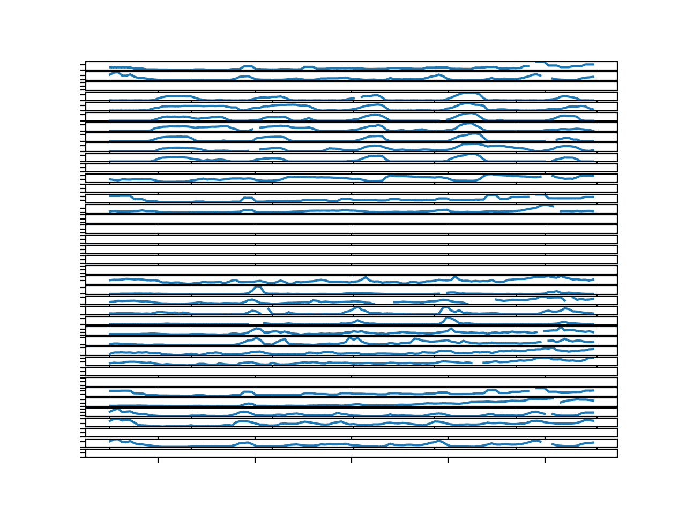
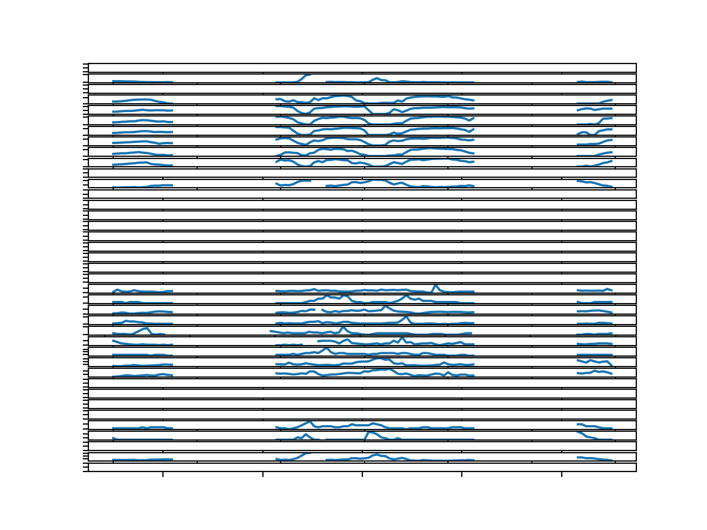
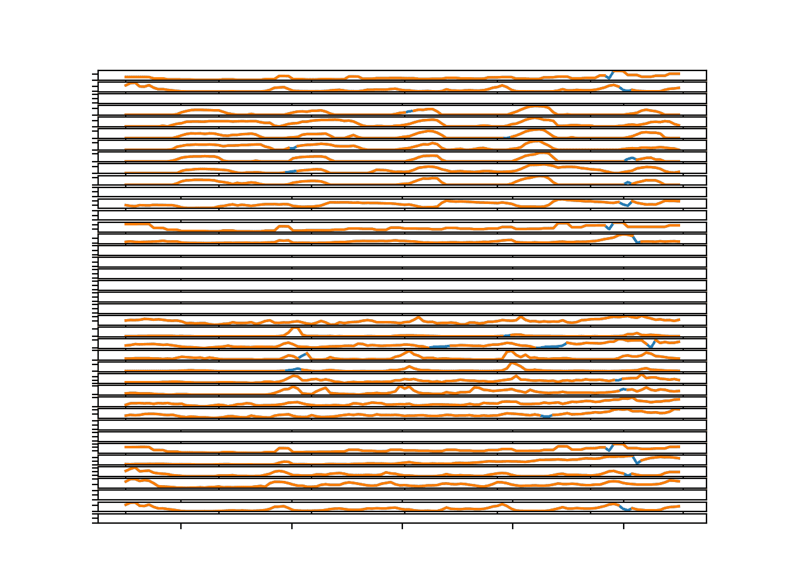
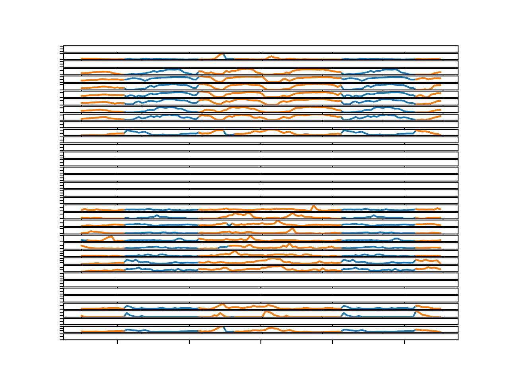
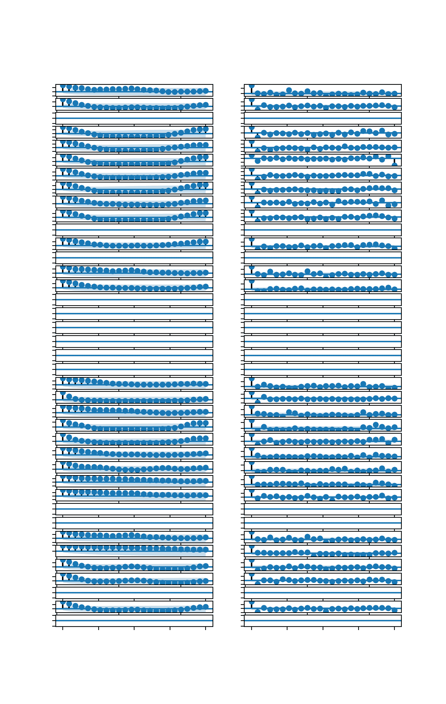
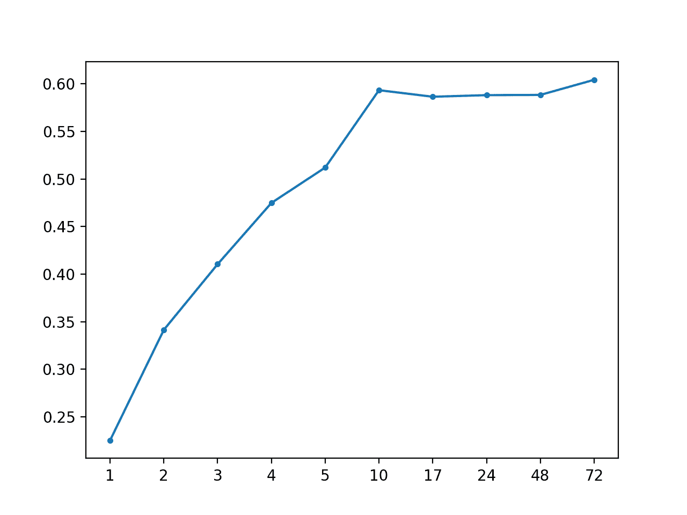

# 如何开发多步空气污染时间序列预测的自回归预测模型

> 原文： [https://machinelearningmastery.com/how-to-develop-autoregressive-forecasting-models-for-multi-step-air-pollution-time-series-forecasting/](https://machinelearningmastery.com/how-to-develop-autoregressive-forecasting-models-for-multi-step-air-pollution-time-series-forecasting/)

实时世界时间序列预测具有挑战性，其原因不仅限于问题特征，例如具有多个输入变量，需要预测多个时间步骤，以及需要对多个物理站点执行相同类型的预测。

EMC Data Science Global Hackathon 数据集或简称“空气质量预测”数据集描述了多个站点的天气状况，需要预测随后三天的空气质量测量结果。

在深入研究时间序列预测的复杂机器学习和深度学习方法之前，重要的是要找到经典方法的局限性，例如使用 AR 或 ARIMA 方法开发自回归模型。

在本教程中，您将了解如何为多变量空气污染时间序列开发多步时间序列预测的自回归模型。

完成本教程后，您将了解：

*   如何分析和计算时间序列数据的缺失值。
*   如何开发和评估多步时间序列预测的自回归模型。
*   如何使用备用数据插补方法改进自回归模型。

让我们开始吧。


数据集大小对深度学习模型技能和表现估计的影响
照片由 [Eneas De Troya](https://www.flickr.com/photos/eneas/13632855754/) ，保留一些权利。

## 教程概述

本教程分为六个部分;他们是：

1.  问题描述
2.  模型评估
3.  数据分析
4.  开发自回归模型
5.  具有全球归因策略的自回归模型

## 问题描述

空气质量预测数据集描述了多个地点的天气状况，需要预测随后三天的空气质量测量结果。

具体而言，对于多个站点，每小时提供 8 天的温度，压力，风速和风向等天气观测。目标是预测未来 3 天在多个地点的空气质量测量。预测的提前期不是连续的;相反，必须在 72 小时预测期内预测特定提前期。他们是：

```py
+1, +2, +3, +4, +5, +10, +17, +24, +48, +72
```

此外，数据集被划分为不相交但连续的数据块，其中 8 天的数据随后是需要预测的 3 天。

并非所有站点或块都可以获得所有观察结果，并且并非所有站点和块都可以使用所有输出变量。必须解决大部分缺失数据。

该数据集被用作 2012 年 Kaggle 网站上[短期机器学习竞赛](https://www.kaggle.com/c/dsg-hackathon)（或黑客马拉松）的基础。

根据从参与者中扣留的真实观察结果评估竞赛的提交，并使用平均绝对误差（MAE）进行评分。提交要求在由于缺少数据而无法预测的情况下指定-1,000,000 的值。实际上，提供了一个插入缺失值的模板，并且要求所有提交都采用（模糊的是什么）。

获胜者在滞留测试集（[私人排行榜](https://www.kaggle.com/c/dsg-hackathon/leaderboard)）上使用随机森林在滞后观察中获得了 0.21058 的 MAE。该帖子中提供了此解决方案的说明：

*   [把所有东西都扔进随机森林：Ben Hamner 赢得空气质量预测黑客马拉松](http://blog.kaggle.com/2012/05/01/chucking-everything-into-a-random-forest-ben-hamner-on-winning-the-air-quality-prediction-hackathon/)，2012。

在本教程中，我们将探索如何为可用作基线的问题开发朴素预测，以确定模型是否具有该问题的技能。

## 模型评估

在我们评估朴素的预测方法之前，我们必须开发一个测试工具。

这至少包括如何准备数据以及如何评估预测。

### 加载数据集

第一步是下载数据集并将其加载到内存中。

数据集可以从 Kaggle 网站免费下载。您可能必须创建一个帐户并登录才能下载数据集。

下载整个数据集，例如“_ 将所有 _”下载到您的工作站，并使用名为'`AirQualityPrediction`'的文件夹解压缩当前工作目录中的存档。

*   [EMC 数据科学全球黑客马拉松（空气质量预测）数据](https://www.kaggle.com/c/dsg-hackathon/data)

我们的重点将是包含训练数据集的'`TrainingData.csv`'文件，特别是块中的数据，其中每个块是八个连续的观察日和目标变量。

我们可以使用 Pandas [read_csv（）函数](https://pandas.pydata.org/pandas-docs/stable/generated/pandas.read_csv.html)将数据文件加载到内存中，并在第 0 行指定标题行。

```py
# load dataset
dataset = read_csv('AirQualityPrediction/TrainingData.csv', header=0)
```

我们可以通过'chunkID'变量（列索引 1）对数据进行分组。

首先，让我们获取唯一的块标识符列表。

```py
chunk_ids = unique(values[:, 1])
```

然后，我们可以收集每个块标识符的所有行，并将它们存储在字典中以便于访问。

```py
chunks = dict()
# sort rows by chunk id
for chunk_id in chunk_ids:
	selection = values[:, chunk_ix] == chunk_id
	chunks[chunk_id] = values[selection, :]
```

下面定义了一个名为`to_chunks()`的函数，它接受加载数据的 NumPy 数组，并将`chunk_id`的字典返回到块的行。

```py
# split the dataset by 'chunkID', return a dict of id to rows
def to_chunks(values, chunk_ix=1):
	chunks = dict()
	# get the unique chunk ids
	chunk_ids = unique(values[:, chunk_ix])
	# group rows by chunk id
	for chunk_id in chunk_ids:
		selection = values[:, chunk_ix] == chunk_id
		chunks[chunk_id] = values[selection, :]
	return chunks
```

下面列出了加载数据集并将其拆分为块的完整示例。

```py
# load data and split into chunks
from numpy import unique
from pandas import read_csv

# split the dataset by 'chunkID', return a dict of id to rows
def to_chunks(values, chunk_ix=1):
	chunks = dict()
	# get the unique chunk ids
	chunk_ids = unique(values[:, chunk_ix])
	# group rows by chunk id
	for chunk_id in chunk_ids:
		selection = values[:, chunk_ix] == chunk_id
		chunks[chunk_id] = values[selection, :]
	return chunks

# load dataset
dataset = read_csv('AirQualityPrediction/TrainingData.csv', header=0)
# group data by chunks
values = dataset.values
chunks = to_chunks(values)
print('Total Chunks: %d' % len(chunks))
```

运行该示例将打印数据集中的块数。

```py
Total Chunks: 208
```

### 数据准备

既然我们知道如何加载数据并将其拆分成块，我们就可以将它们分成训练和测试数据集。

尽管每个块内的实际观测数量可能差异很大，但每个块的每小时观察间隔为 8 天。

我们可以将每个块分成前五天的训练观察和最后三天的测试。

每个观察都有一行称为'`position_within_chunk`'，从 1 到 192（8 天* 24 小时）不等。因此，我们可以将此列中值小于或等于 120（5 * 24）的所有行作为训练数据，将任何大于 120 的值作为测试数据。

此外，任何在训练或测试分割中没有任何观察的块都可以被丢弃，因为不可行。

在使用朴素模型时，我们只对目标变量感兴趣，而不对输入的气象变量感兴趣。因此，我们可以删除输入数据，并使训练和测试数据仅包含每个块的 39 个目标变量，以及块和观察时间内的位置。

下面的`split_train_test()`函数实现了这种行为;给定一个块的字典，它将每个分成训练和测试块数据。

```py
# split each chunk into train/test sets
def split_train_test(chunks, row_in_chunk_ix=2):
	train, test = list(), list()
	# first 5 days of hourly observations for train
	cut_point = 5 * 24
	# enumerate chunks
	for k,rows in chunks.items():
		# split chunk rows by 'position_within_chunk'
		train_rows = rows[rows[:,row_in_chunk_ix] <= cut_point, :]
		test_rows = rows[rows[:,row_in_chunk_ix] > cut_point, :]
		if len(train_rows) == 0 or len(test_rows) == 0:
			print('>dropping chunk=%d: train=%s, test=%s' % (k, train_rows.shape, test_rows.shape))
			continue
		# store with chunk id, position in chunk, hour and all targets
		indices = [1,2,5] + [x for x in range(56,train_rows.shape[1])]
		train.append(train_rows[:, indices])
		test.append(test_rows[:, indices])
	return train, test
```

我们不需要整个测试数据集;相反，我们只需要在三天时间内的特定提前期进行观察，特别是提前期：

```py
+1, +2, +3, +4, +5, +10, +17, +24, +48, +72
```

其中，每个提前期相对于训练期结束。

首先，我们可以将这些提前期放入函数中以便于参考：

```py
# return a list of relative forecast lead times
def get_lead_times():
	return [1, 2 ,3, 4, 5, 10, 17, 24, 48, 72]
```

接下来，我们可以将测试数据集缩减为仅在首选提前期的数据。

我们可以通过查看'`position_within_chunk`'列并使用提前期作为距离训练数据集末尾的偏移量来实现，例如： 120 + 1,120 +2 等

如果我们在测试集中找到匹配的行，则保存它，否则生成一行 NaN 观测值。

下面的函数`to_forecasts()`实现了这一点，并为每个块的每个预测提前期返回一行 NumPy 数组。

```py
# convert the rows in a test chunk to forecasts
def to_forecasts(test_chunks, row_in_chunk_ix=1):
	# get lead times
	lead_times = get_lead_times()
	# first 5 days of hourly observations for train
	cut_point = 5 * 24
	forecasts = list()
	# enumerate each chunk
	for rows in test_chunks:
		chunk_id = rows[0, 0]
		# enumerate each lead time
		for tau in lead_times:
			# determine the row in chunk we want for the lead time
			offset = cut_point + tau
			# retrieve data for the lead time using row number in chunk
			row_for_tau = rows[rows[:,row_in_chunk_ix]==offset, :]
			# check if we have data
			if len(row_for_tau) == 0:
				# create a mock row [chunk, position, hour] + [nan...]
				row = [chunk_id, offset, nan] + [nan for _ in range(39)]
				forecasts.append(row)
			else:
				# store the forecast row
				forecasts.append(row_for_tau[0])
	return array(forecasts)
```

我们可以将所有这些组合在一起并将数据集拆分为训练集和测试集，并将结果保存到新文件中。

完整的代码示例如下所示。

```py
# split data into train and test sets
from numpy import unique
from numpy import nan
from numpy import array
from numpy import savetxt
from pandas import read_csv

# split the dataset by 'chunkID', return a dict of id to rows
def to_chunks(values, chunk_ix=1):
	chunks = dict()
	# get the unique chunk ids
	chunk_ids = unique(values[:, chunk_ix])
	# group rows by chunk id
	for chunk_id in chunk_ids:
		selection = values[:, chunk_ix] == chunk_id
		chunks[chunk_id] = values[selection, :]
	return chunks

# split each chunk into train/test sets
def split_train_test(chunks, row_in_chunk_ix=2):
	train, test = list(), list()
	# first 5 days of hourly observations for train
	cut_point = 5 * 24
	# enumerate chunks
	for k,rows in chunks.items():
		# split chunk rows by 'position_within_chunk'
		train_rows = rows[rows[:,row_in_chunk_ix] <= cut_point, :]
		test_rows = rows[rows[:,row_in_chunk_ix] > cut_point, :]
		if len(train_rows) == 0 or len(test_rows) == 0:
			print('>dropping chunk=%d: train=%s, test=%s' % (k, train_rows.shape, test_rows.shape))
			continue
		# store with chunk id, position in chunk, hour and all targets
		indices = [1,2,5] + [x for x in range(56,train_rows.shape[1])]
		train.append(train_rows[:, indices])
		test.append(test_rows[:, indices])
	return train, test

# return a list of relative forecast lead times
def get_lead_times():
	return [1, 2 ,3, 4, 5, 10, 17, 24, 48, 72]

# convert the rows in a test chunk to forecasts
def to_forecasts(test_chunks, row_in_chunk_ix=1):
	# get lead times
	lead_times = get_lead_times()
	# first 5 days of hourly observations for train
	cut_point = 5 * 24
	forecasts = list()
	# enumerate each chunk
	for rows in test_chunks:
		chunk_id = rows[0, 0]
		# enumerate each lead time
		for tau in lead_times:
			# determine the row in chunk we want for the lead time
			offset = cut_point + tau
			# retrieve data for the lead time using row number in chunk
			row_for_tau = rows[rows[:,row_in_chunk_ix]==offset, :]
			# check if we have data
			if len(row_for_tau) == 0:
				# create a mock row [chunk, position, hour] + [nan...]
				row = [chunk_id, offset, nan] + [nan for _ in range(39)]
				forecasts.append(row)
			else:
				# store the forecast row
				forecasts.append(row_for_tau[0])
	return array(forecasts)

# load dataset
dataset = read_csv('AirQualityPrediction/TrainingData.csv', header=0)
# group data by chunks
values = dataset.values
chunks = to_chunks(values)
# split into train/test
train, test = split_train_test(chunks)
# flatten training chunks to rows
train_rows = array([row for rows in train for row in rows])
# print(train_rows.shape)
print('Train Rows: %s' % str(train_rows.shape))
# reduce train to forecast lead times only
test_rows = to_forecasts(test)
print('Test Rows: %s' % str(test_rows.shape))
# save datasets
savetxt('AirQualityPrediction/naive_train.csv', train_rows, delimiter=',')
savetxt('AirQualityPrediction/naive_test.csv', test_rows, delimiter=',')
```

运行该示例首先评论了从数据集中移除了块 69 以获得不足的数据。

然后我们可以看到每个训练和测试集中有 42 列，一个用于块 ID，块内位置，一天中的小时和 39 个训练变量。

我们还可以看到测试数据集的显着缩小版本，其中行仅在预测前置时间。

新的训练和测试数据集分别保存在'`naive_train.csv`'和'`naive_test.csv`'文件中。

```py
>dropping chunk=69: train=(0, 95), test=(28, 95)
Train Rows: (23514, 42)
Test Rows: (2070, 42)
```

### 预测评估

一旦做出预测，就需要对它们进行评估。

在评估预测时，使用更简单的格式会很有帮助。例如，我们将使用 _[chunk] [变量] [时间]_ 的三维结构，其中变量是从 0 到 38 的目标变量数，time 是从 0 到 9 的提前期索引。

模型有望以这种格式进行预测。

我们还可以重新构建测试数据集以使此数据集进行比较。下面的`prepare_test_forecasts()`函数实现了这一点。

```py
# convert the test dataset in chunks to [chunk][variable][time] format
def prepare_test_forecasts(test_chunks):
	predictions = list()
	# enumerate chunks to forecast
	for rows in test_chunks:
		# enumerate targets for chunk
		chunk_predictions = list()
		for j in range(3, rows.shape[1]):
			yhat = rows[:, j]
			chunk_predictions.append(yhat)
		chunk_predictions = array(chunk_predictions)
		predictions.append(chunk_predictions)
	return array(predictions)
```

我们将使用平均绝对误差或 MAE 来评估模型。这是在竞争中使用的度量，并且在给定目标变量的非高斯分布的情况下是合理的选择。

如果提前期不包含测试集中的数据（例如`NaN`），则不会计算该预测的错误。如果提前期确实在测试集中有数据但预测中没有数据，那么观察的全部大小将被视为错误。最后，如果测试集具有观察值并进行预测，则绝对差值将被记录为误差。

`calculate_error()`函数实现这些规则并返回给定预测的错误。

```py
# calculate the error between an actual and predicted value
def calculate_error(actual, predicted):
	# give the full actual value if predicted is nan
	if isnan(predicted):
		return abs(actual)
	# calculate abs difference
	return abs(actual - predicted)
```

错误在所有块和所有提前期之间求和，然后取平均值。

将计算总体 MAE，但我们还将计算每个预测提前期的 MAE。这通常有助于模型选择，因为某些模型在不同的提前期可能会有不同的表现。

下面的 evaluate_forecasts（）函数实现了这一点，计算了 _[chunk] [variable] [time]_ 格式中提供的预测和期望值的 MAE 和每个引导时间 MAE。

```py
# evaluate a forecast in the format [chunk][variable][time]
def evaluate_forecasts(predictions, testset):
	lead_times = get_lead_times()
	total_mae, times_mae = 0.0, [0.0 for _ in range(len(lead_times))]
	total_c, times_c = 0, [0 for _ in range(len(lead_times))]
	# enumerate test chunks
	for i in range(len(test_chunks)):
		# convert to forecasts
		actual = testset[i]
		predicted = predictions[i]
		# enumerate target variables
		for j in range(predicted.shape[0]):
			# enumerate lead times
			for k in range(len(lead_times)):
				# skip if actual in nan
				if isnan(actual[j, k]):
					continue
				# calculate error
				error = calculate_error(actual[j, k], predicted[j, k])
				# update statistics
				total_mae += error
				times_mae[k] += error
				total_c += 1
				times_c[k] += 1
	# normalize summed absolute errors
	total_mae /= total_c
	times_mae = [times_mae[i]/times_c[i] for i in range(len(times_mae))]
	return total_mae, times_mae
```

一旦我们对模型进行评估，我们就可以呈现它。

下面的`summarize_error()`函数首先打印模型表现的一行摘要，然后创建每个预测提前期的 MAE 图。

```py
# summarize scores
def summarize_error(name, total_mae, times_mae):
	# print summary
	lead_times = get_lead_times()
	formatted = ['+%d %.3f' % (lead_times[i], times_mae[i]) for i in range(len(lead_times))]
	s_scores = ', '.join(formatted)
	print('%s: [%.3f MAE] %s' % (name, total_mae, s_scores))
	# plot summary
	pyplot.plot([str(x) for x in lead_times], times_mae, marker='.')
	pyplot.show()
```

我们现在准备开始探索朴素预测方法的表现。

## 数据分析

将经典时间序列模型拟合到这些数据的第一步是仔细研究数据。

有 208 个（实际上是 207 个）可用的数据块，每个块有 39 个时间序列适合;这是总共 8,073 个需要适合数据的独立模型。这是很多模型，但模型是在相对少量的数据上进行训练，最多（5 * 24）或 120 次观测，并且模型是线性的，因此它可以快速找到拟合。

我们可以选择如何为数据配置模型;例如：

*   所有时间序列的一种模型配置（最简单）。
*   跨块的所有变量的一个模型配置（合理）。
*   每个块的每个变量一个模型配置（最复杂）。

我们将研究所有系列的一种模型配置的最简单方法，但您可能想要探索一种或多种其他方法。

本节分为三个部分;他们是：

1.  缺失数据
2.  归咎于缺失数据
3.  自相关图

### 缺失数据

经典时间序列方法要求时间序列完整，例如，没有遗漏的价值。

因此，第一步是研究目标变量的完整性或不完整性。

对于给定变量，可能缺少由缺失行定义的观察值。具体地，每个观察具有'`position_within_chunk`'。我们期望训练数据集中的每个块有 120 个观察值，其中“`positions_within_chunk`”从 1 到 120 包含。

因此，我们可以为每个变量创建一个 120 纳米值的数组，使用'`positions_within_chunk`'值标记块中的所有观察值，剩下的任何内容都将标记为`NaN`。然后我们可以绘制每个变量并寻找差距。

下面的`variable_to_series()`函数将获取目标变量的块和给定列索引的行，并将为变量返回一系列 120 个时间步长，所有可用数据都标记为来自块。

```py
# layout a variable with breaks in the data for missing positions
def variable_to_series(chunk_train, col_ix, n_steps=5*24):
	# lay out whole series
	data = [nan for _ in range(n_steps)]
	# mark all available data
	for i in range(len(chunk_train)):
		# get position in chunk
		position = int(chunk_train[i, 1] - 1)
		# store data
		data[position] = chunk_train[i, col_ix]
	return data
```

然后我们可以在一个块中为每个目标变量调用此函数并创建一个线图。

下面名为`plot_variables()`的函数将实现此功能并创建一个图形，其中 39 个线图水平堆叠。

```py
# plot variables horizontally with gaps for missing data
def plot_variables(chunk_train, n_vars=39):
	pyplot.figure()
	for i in range(n_vars):
		# convert target number into column number
		col_ix = 3 + i
		# mark missing obs for variable
		series = variable_to_series(chunk_train, col_ix)
		# plot
		ax = pyplot.subplot(n_vars, 1, i+1)
		ax.set_xticklabels([])
		ax.set_yticklabels([])
		pyplot.plot(series)
	# show plot
	pyplot.show()
```

将这些结合在一起，下面列出了完整的示例。创建第一个块中所有变量的图。

```py
# plot missing
from numpy import loadtxt
from numpy import nan
from numpy import unique
from matplotlib import pyplot

# split the dataset by 'chunkID', return a list of chunks
def to_chunks(values, chunk_ix=0):
	chunks = list()
	# get the unique chunk ids
	chunk_ids = unique(values[:, chunk_ix])
	# group rows by chunk id
	for chunk_id in chunk_ids:
		selection = values[:, chunk_ix] == chunk_id
		chunks.append(values[selection, :])
	return chunks

# layout a variable with breaks in the data for missing positions
def variable_to_series(chunk_train, col_ix, n_steps=5*24):
	# lay out whole series
	data = [nan for _ in range(n_steps)]
	# mark all available data
	for i in range(len(chunk_train)):
		# get position in chunk
		position = int(chunk_train[i, 1] - 1)
		# store data
		data[position] = chunk_train[i, col_ix]
	return data

# plot variables horizontally with gaps for missing data
def plot_variables(chunk_train, n_vars=39):
	pyplot.figure()
	for i in range(n_vars):
		# convert target number into column number
		col_ix = 3 + i
		# mark missing obs for variable
		series = variable_to_series(chunk_train, col_ix)
		# plot
		ax = pyplot.subplot(n_vars, 1, i+1)
		ax.set_xticklabels([])
		ax.set_yticklabels([])
		pyplot.plot(series)
	# show plot
	pyplot.show()

# load dataset
train = loadtxt('AirQualityPrediction/naive_train.csv', delimiter=',')
# group data by chunks
train_chunks = to_chunks(train)
# pick one chunk
rows = train_chunks[0]
# plot variables
plot_variables(rows)
```

运行该示例将创建一个包含 39 个线图的图形，一个用于第一个块中的每个目标变量。

我们可以在许多变量中看到季节性结构。这表明在建模之前对每个系列执行 24 小时季节差异可能是有益的。

这些图很小，您可能需要增加图的大小以清楚地看到数据。

我们可以看到有些变量我们没有数据。这些可以被检测和忽略，因为我们无法建模或预测它们。

我们可以看到许多系列中的差距，但差距很短，最多只能持续几个小时。这些可以通过在同一系列中的相同时间持续存在先前值或值来估算。



具有缺失值的块 1 中所有目标的线图

随机查看其他几个块，许多块会产生具有大致相同观察结果的图。

但情况并非总是如此。

更新示例以绘制数据集中的第 4 个块（索引 3）。

```py
# pick one chunk
rows = train_chunks[3]
```

结果是一个人物讲述了一个非常不同的故事。

我们发现数据中存在持续数小时的差距，可能长达一天或更长时间。

这些系列在用于装配经典型号之前需要进行大幅修复。

使用同一小时内系列内的持久性或观察来输入缺失的数据可能是不够的。它们可能必须填充整个训练数据集中的平均值。



具有缺失值的块 4 中所有目标的线图

### 归咎于缺失数据

有许多方法来估算缺失的数据，我们无法知道哪个是最好的先验。

一种方法是使用多种不同的插补方法准备数据，并使用适合数据的模型技能来帮助指导最佳方法。

已经提出的一些估算方法包括：

*   坚持系列中的最后一次观察，也称为线性插值。
*   使用相同的小时填写系列中的值或平均值。
*   在训练数据集中填写一天中相同小时的值或平均值。

使用组合也可能是有用的，例如，从系列中保留或填充小间隙，并从整个数据集中提取大间隙。

我们还可以通过填写缺失数据并查看图表以查看该系列是否合理来研究输入方法的效果。它原始，有效，快速。

首先，我们需要为每个块计算一个小时的并行序列，我们可以使用它来为块中的每个变量计算特定于小时的数据。

给定一系列部分填充的小时，下面的`interpolate_hours()`函数将填充一天中缺少的小时数。它通过找到第一个标记的小时，然后向前计数，填写一天中的小时，然后向后执行相同的操作来完成此操作。

```py
# interpolate series of hours (in place) in 24 hour time
def interpolate_hours(hours):
	# find the first hour
	ix = -1
	for i in range(len(hours)):
		if not isnan(hours[i]):
			ix = i
			break
	# fill-forward
	hour = hours[ix]
	for i in range(ix+1, len(hours)):
		# increment hour
		hour += 1
		# check for a fill
		if isnan(hours[i]):
			hours[i] = hour % 24
	# fill-backward
	hour = hours[ix]
	for i in range(ix-1, -1, -1):
		# decrement hour
		hour -= 1
		# check for a fill
		if isnan(hours[i]):
			hours[i] = hour % 24
```

我确信有更多的 Pythonic 方式来编写这个函数，但是我想把它全部用来使它显而易见。

我们可以在缺少数据的模拟小时列表上测试它。下面列出了完整的示例。

```py
# interpolate hours
from numpy import nan
from numpy import isnan

# interpolate series of hours (in place) in 24 hour time
def interpolate_hours(hours):
	# find the first hour
	ix = -1
	for i in range(len(hours)):
		if not isnan(hours[i]):
			ix = i
			break
	# fill-forward
	hour = hours[ix]
	for i in range(ix+1, len(hours)):
		# increment hour
		hour += 1
		# check for a fill
		if isnan(hours[i]):
			hours[i] = hour % 24
	# fill-backward
	hour = hours[ix]
	for i in range(ix-1, -1, -1):
		# decrement hour
		hour -= 1
		# check for a fill
		if isnan(hours[i]):
			hours[i] = hour % 24

# define hours with missing data
data = [nan, nan, nan, nan, nan, nan, nan, nan, nan, nan, nan, nan, nan, 0, nan, 2, nan, nan, nan, nan, nan, nan, 9, 10, 11, 12, 13, nan, nan, nan, nan, nan, nan, nan, nan, nan, nan, nan, nan]
print(data)
# fill in missing hours
interpolate_hours(data)
print(data)
```

首先运行示例打印带有缺失值的小时数据，然后正确填写所有小时数的相同序列。

```py
[nan, nan, nan, nan, nan, nan, nan, nan, nan, nan, nan, nan, nan, 0, nan, 2, nan, nan, nan, nan, nan, nan, 9, 10, 11, 12, 13, nan, nan, nan, nan, nan, nan, nan, nan, nan, nan, nan, nan]
[11, 12, 13, 14, 15, 16, 17, 18, 19, 20, 21, 22, 23, 0, 1, 2, 3, 4, 5, 6, 7, 8, 9, 10, 11, 12, 13, 14, 15, 16, 17, 18, 19, 20, 21, 22, 23, 0, 1]
```

我们可以使用此函数为一个块准备一系列小时，这些块可用于使用特定于小时的信息填充块的缺失值。

我们可以从上一节中调用相同的`variable_to_series()`函数来创建具有缺失值的小时系列（列索引 2），然后调用`interpolate_hours()`来填补空白。

```py
# prepare sequence of hours for the chunk
hours = variable_to_series(rows, 2)
# interpolate hours
interpolate_hours(hours)
```

然后我们可以将时间传递给可以使用它的任何 impute 函数。

让我们尝试在相同系列中使用相同小时填充值中的缺失值。具体来说，我们将在系列中找到所有具有相同小时的行并计算中值。

下面的`impute_missing()`获取块中的所有行，准备好的块的一天中的小时数，以及具有变量的缺失值和变量的列索引的系列。

它首先检查系列是否全部缺失数据，如果是这种情况则立即返回，因为不能执行任何插补。然后，它会在系列的时间步骤中进行枚举，当它检测到没有数据的时间步长时，它会收集序列中所有行，并使用相同小时的数据并计算中值。

```py
# impute missing data
def impute_missing(rows, hours, series, col_ix):
	# count missing observations
	n_missing = count_nonzero(isnan(series))
	# calculate ratio of missing
	ratio = n_missing / float(len(series)) * 100
	# check for no data
	if ratio == 100.0:
		return series
	# impute missing using the median value for hour in the series
	imputed = list()
	for i in range(len(series)):
		if isnan(series[i]):
			# get all rows with the same hour
			matches = rows[rows[:,2]==hours[i]]
			# fill with median value
			value = nanmedian(matches[:, col_ix])
			imputed.append(value)
		else:
			imputed.append(series[i])
	return imputed
```

要查看此推算策略的影响，我们可以更新上一节中的`plot_variables()`函数，首先绘制插补系列，然后绘制具有缺失值的原始系列。

这将允许插补值在原始系列的间隙中闪耀，我们可以看到结果是否合理。

`plot_variables()`函数的更新版本在下面列出了此更改，调用`impute_missing()`函数来创建系列的推算版本并将小时系列作为参数。

```py
# plot variables horizontally with gaps for missing data
def plot_variables(chunk_train, hours, n_vars=39):
	pyplot.figure()
	for i in range(n_vars):
		# convert target number into column number
		col_ix = 3 + i
		# mark missing obs for variable
		series = variable_to_series(chunk_train, col_ix)
		ax = pyplot.subplot(n_vars, 1, i+1)
		ax.set_xticklabels([])
		ax.set_yticklabels([])
		# imputed
		imputed = impute_missing(chunk_train, hours, series, col_ix)
		# plot imputed
		pyplot.plot(imputed)
		# plot with missing
		pyplot.plot(series)
	# show plot
	pyplot.show()
```

将所有这些结合在一起，下面列出了完整的示例。

```py
# impute missing
from numpy import loadtxt
from numpy import nan
from numpy import isnan
from numpy import count_nonzero
from numpy import unique
from numpy import nanmedian
from matplotlib import pyplot

# split the dataset by 'chunkID', return a list of chunks
def to_chunks(values, chunk_ix=0):
	chunks = list()
	# get the unique chunk ids
	chunk_ids = unique(values[:, chunk_ix])
	# group rows by chunk id
	for chunk_id in chunk_ids:
		selection = values[:, chunk_ix] == chunk_id
		chunks.append(values[selection, :])
	return chunks

# impute missing data
def impute_missing(rows, hours, series, col_ix):
	# count missing observations
	n_missing = count_nonzero(isnan(series))
	# calculate ratio of missing
	ratio = n_missing / float(len(series)) * 100
	# check for no data
	if ratio == 100.0:
		return series
	# impute missing using the median value for hour in the series
	imputed = list()
	for i in range(len(series)):
		if isnan(series[i]):
			# get all rows with the same hour
			matches = rows[rows[:,2]==hours[i]]
			# fill with median value
			value = nanmedian(matches[:, col_ix])
			imputed.append(value)
		else:
			imputed.append(series[i])
	return imputed

# interpolate series of hours (in place) in 24 hour time
def interpolate_hours(hours):
	# find the first hour
	ix = -1
	for i in range(len(hours)):
		if not isnan(hours[i]):
			ix = i
			break
	# fill-forward
	hour = hours[ix]
	for i in range(ix+1, len(hours)):
		# increment hour
		hour += 1
		# check for a fill
		if isnan(hours[i]):
			hours[i] = hour % 24
	# fill-backward
	hour = hours[ix]
	for i in range(ix-1, -1, -1):
		# decrement hour
		hour -= 1
		# check for a fill
		if isnan(hours[i]):
			hours[i] = hour % 24

# layout a variable with breaks in the data for missing positions
def variable_to_series(chunk_train, col_ix, n_steps=5*24):
	# lay out whole series
	data = [nan for _ in range(n_steps)]
	# mark all available data
	for i in range(len(chunk_train)):
		# get position in chunk
		position = int(chunk_train[i, 1] - 1)
		# store data
		data[position] = chunk_train[i, col_ix]
	return data

# plot variables horizontally with gaps for missing data
def plot_variables(chunk_train, hours, n_vars=39):
	pyplot.figure()
	for i in range(n_vars):
		# convert target number into column number
		col_ix = 3 + i
		# mark missing obs for variable
		series = variable_to_series(chunk_train, col_ix)
		ax = pyplot.subplot(n_vars, 1, i+1)
		ax.set_xticklabels([])
		ax.set_yticklabels([])
		# imputed
		imputed = impute_missing(chunk_train, hours, series, col_ix)
		# plot imputed
		pyplot.plot(imputed)
		# plot with missing
		pyplot.plot(series)
	# show plot
	pyplot.show()

# load dataset
train = loadtxt('AirQualityPrediction/naive_train.csv', delimiter=',')
# group data by chunks
train_chunks = to_chunks(train)
# pick one chunk
rows = train_chunks[0]
# prepare sequence of hours for the chunk
hours = variable_to_series(rows, 2)
# interpolate hours
interpolate_hours(hours)
# plot variables
plot_variables(rows, hours)
```

运行该示例将创建一个包含 39 个线图的单个图形：一个用于训练数据集中第一个块中的每个目标变量。

我们可以看到该系列是橙色的，显示原始数据，并且已经估算了间隙并标记为蓝色。

蓝色部分看似合理。



带有插补缺失值的块 1 中所有目标的线图

我们可以在数据集中具有更多缺失数据的第 4 个块上尝试相同的方法。

```py
# pick one chunk
rows = train_chunks[0]
```

运行该示例会创建相同类型的图形，但在这里我们可以看到填充了估算值的大缺失段。

同样，序列看似合理，甚至在适当的时候显示每日季节周期结构。



带有插补缺失值的块 4 中所有目标的线图

这似乎是一个好的开始;您可以探索其他估算策略，并了解它们如何在线图或最终模型技能方面进行比较。

### 自相关图

现在我们知道如何填写缺失值，我们可以看一下系列数据的自相关图。

自相关图总结了每个观察结果与先前时间步骤的观察结果之间的关系。与部分自相关图一起，它们可用于确定 ARMA 模型的配置。

statsmodels 库提供 [plot_acf（）](http://www.statsmodels.org/dev/generated/statsmodels.graphics.tsaplots.plot_acf.html)和 [plot_pacf（）](http://www.statsmodels.org/dev/generated/statsmodels.graphics.tsaplots.plot_pacf.html)函数，可分别用于绘制 ACF 和 PACF 图。

我们可以更新`plot_variables()`来创建这些图，这些图是 39 系列中每一个的每种类型之一。这是很多情节。

我们将垂直向左堆叠所有 ACF 图，并在右侧垂直堆叠所有 PACF 图。这是两列 39 个图。我们将绘图所考虑的滞后时间限制为 24 个时间步长（小时），并忽略每个变量与其自身的相关性，因为它是多余的。

下面列出了用于绘制 ACF 和 PACF 图的更新的`plot_variables()`函数。

```py
# plot acf and pacf plots for each imputed variable series
def plot_variables(chunk_train, hours, n_vars=39):
	pyplot.figure()
	n_plots = n_vars * 2
	j = 0
	lags = 24
	for i in range(1, n_plots, 2):
		# convert target number into column number
		col_ix = 3 + j
		j += 1
		# get series
		series = variable_to_series(chunk_train, col_ix)
		imputed = impute_missing(chunk_train, hours, series, col_ix)
		# acf
		axis = pyplot.subplot(n_vars, 2, i)
		plot_acf(imputed, ax=axis, lags=lags, zero=False)
		axis.set_title('')
		axis.set_xticklabels([])
		axis.set_yticklabels([])
		# pacf
		axis = pyplot.subplot(n_vars, 2, i+1)
		plot_pacf(imputed, ax=axis, lags=lags, zero=False)
		axis.set_title('')
		axis.set_xticklabels([])
		axis.set_yticklabels([])
	# show plot
	pyplot.show()
```

下面列出了完整的示例。

```py
# acf and pacf plots
from numpy import loadtxt
from numpy import nan
from numpy import isnan
from numpy import count_nonzero
from numpy import unique
from numpy import nanmedian
from matplotlib import pyplot
from statsmodels.graphics.tsaplots import plot_acf
from statsmodels.graphics.tsaplots import plot_pacf

# split the dataset by 'chunkID', return a list of chunks
def to_chunks(values, chunk_ix=0):
	chunks = list()
	# get the unique chunk ids
	chunk_ids = unique(values[:, chunk_ix])
	# group rows by chunk id
	for chunk_id in chunk_ids:
		selection = values[:, chunk_ix] == chunk_id
		chunks.append(values[selection, :])
	return chunks

# impute missing data
def impute_missing(rows, hours, series, col_ix):
	# count missing observations
	n_missing = count_nonzero(isnan(series))
	# calculate ratio of missing
	ratio = n_missing / float(len(series)) * 100
	# check for no data
	if ratio == 100.0:
		return series
	# impute missing using the median value for hour in the series
	imputed = list()
	for i in range(len(series)):
		if isnan(series[i]):
			# get all rows with the same hour
			matches = rows[rows[:,2]==hours[i]]
			# fill with median value
			value = nanmedian(matches[:, col_ix])
			imputed.append(value)
		else:
			imputed.append(series[i])
	return imputed

# interpolate series of hours (in place) in 24 hour time
def interpolate_hours(hours):
	# find the first hour
	ix = -1
	for i in range(len(hours)):
		if not isnan(hours[i]):
			ix = i
			break
	# fill-forward
	hour = hours[ix]
	for i in range(ix+1, len(hours)):
		# increment hour
		hour += 1
		# check for a fill
		if isnan(hours[i]):
			hours[i] = hour % 24
	# fill-backward
	hour = hours[ix]
	for i in range(ix-1, -1, -1):
		# decrement hour
		hour -= 1
		# check for a fill
		if isnan(hours[i]):
			hours[i] = hour % 24

# layout a variable with breaks in the data for missing positions
def variable_to_series(chunk_train, col_ix, n_steps=5*24):
	# lay out whole series
	data = [nan for _ in range(n_steps)]
	# mark all available data
	for i in range(len(chunk_train)):
		# get position in chunk
		position = int(chunk_train[i, 1] - 1)
		# store data
		data[position] = chunk_train[i, col_ix]
	return data

# plot acf and pacf plots for each imputed variable series
def plot_variables(chunk_train, hours, n_vars=39):
	pyplot.figure()
	n_plots = n_vars * 2
	j = 0
	lags = 24
	for i in range(1, n_plots, 2):
		# convert target number into column number
		col_ix = 3 + j
		j += 1
		# get series
		series = variable_to_series(chunk_train, col_ix)
		imputed = impute_missing(chunk_train, hours, series, col_ix)
		# acf
		axis = pyplot.subplot(n_vars, 2, i)
		plot_acf(imputed, ax=axis, lags=lags, zero=False)
		axis.set_title('')
		axis.set_xticklabels([])
		axis.set_yticklabels([])
		# pacf
		axis = pyplot.subplot(n_vars, 2, i+1)
		plot_pacf(imputed, ax=axis, lags=lags, zero=False)
		axis.set_title('')
		axis.set_xticklabels([])
		axis.set_yticklabels([])
	# show plot
	pyplot.show()

# load dataset
train = loadtxt('AirQualityPrediction/naive_train.csv', delimiter=',')
# group data by chunks
train_chunks = to_chunks(train)
# pick one chunk
rows = train_chunks[0]
# prepare sequence of hours for the chunk
hours = variable_to_series(rows, 2)
# interpolate hours
interpolate_hours(hours)
# plot variables
plot_variables(rows, hours)
```

运行该示例会在训练数据集的第一个块中为目标变量创建一个包含大量图的图形。

您可能需要增加绘图窗口的大小以更好地查看每个绘图的详细信息。

我们可以在左侧看到，大多数 ACF 图在滞后 1-2 步时显示出显着的相关性（高于显着性区域的点），在某些情况下可能滞后 1-3 步，在滞后时缓慢，稳定地减少

同样，在右边，我们可以看到 PACF 图中 1-2 个时间步长的显着滞后，陡峭的下降。

这有力地暗示了自相关过程，其顺序可能是 1,2 或 3，例如 AR（3）。

在左侧的 ACF 图中，我们还可以看到相关性中的每日周期。这可能表明在建模之前对数据进行季节性差异或使用能够进行季节性差异的 AR 模型的一些益处。



块 1 中目标变量的 ACF 和 PACF 图

我们可以重复对其他块的目标变量的分析，我们看到的图片大致相同。

它表明我们可以通过所有块的所有系列的一般 AR 模型配置逃脱。

## 开发自回归模型

在本节中，我们将为估算的目标序列数据开发一个自回归模型。

第一步是实现一个通用函数，用于为每个块进行预测。

该功能为训练数据集和测试集的输入列（块 ID，块和小时的位置）执行任务，并返回具有 _[chunk] [变量] [时间]的预期 3D 格式的所有块的预测 _。

该函数枚举预测中的块，然后枚举 39 个目标列，调用另一个名为`forecast_variable()`的新函数，以便对给定目标变量的每个提前期进行预测。

完整的功能如下所列。

```py
# forecast for each chunk, returns [chunk][variable][time]
def forecast_chunks(train_chunks, test_input):
	lead_times = get_lead_times()
	predictions = list()
	# enumerate chunks to forecast
	for i in range(len(train_chunks)):
		# prepare sequence of hours for the chunk
		hours = variable_to_series(train_chunks[i], 2)
		# interpolate hours
		interpolate_hours(hours)
		# enumerate targets for chunk
		chunk_predictions = list()
		for j in range(39):
			yhat = forecast_variable(hours, train_chunks[i], test_input[i], lead_times, j)
			chunk_predictions.append(yhat)
		chunk_predictions = array(chunk_predictions)
		predictions.append(chunk_predictions)
	return array(predictions)
```

我们现在可以实现`forecast_variable()`的一个版本。

对于每个变量，我们首先检查是否没有数据（例如所有 NaN），如果是，我们返回每个预测提前期的 NaN 预测。

然后我们使用`variable_to_series()`从变量创建一个系列，然后通过调用`impute_missing()`使用系列中的中位数来计算缺失值，两者都是在上一节。

最后，我们调用一个名为`fit_and_forecast()`的新函数，该函数适合模型并预测 10 个预测前置时间。

```py
# forecast all lead times for one variable
def forecast_variable(hours, chunk_train, chunk_test, lead_times, target_ix):
	# convert target number into column number
	col_ix = 3 + target_ix
	# check for no data
	if not has_data(chunk_train[:, col_ix]):
		forecast = [nan for _ in range(len(lead_times))]
		return forecast
	# get series
	series = variable_to_series(chunk_train, col_ix)
	# impute
	imputed = impute_missing(chunk_train, hours, series, col_ix)
	# fit AR model and forecast
	forecast = fit_and_forecast(imputed)
	return forecast
```

我们将 AR 模型适用于给定的推算系列。为此，我们将使用 [statsmodels ARIMA 类](http://www.statsmodels.org/dev/generated/statsmodels.tsa.arima_model.ARIMA.html)。如果您想探索任何 ARIMA 模型系列，我们将使用 ARIMA 代替 AR 来提供一些灵活性。

首先，我们必须定义模型，包括自回归过程的顺序，例如 AR（1）。

```py
# define the model
model = ARIMA(series, order=(1,0,0))
```

接下来，该模型适用于推算系列。我们通过将`disp`设置为`False`来关闭拟合期间的详细信息。

```py
# fit the model
model_fit = model.fit(disp=False)
```

然后使用拟合模型预测系列结束后的 72 小时。

```py
# forecast 72 hours
yhat = model_fit.predict(len(series), len(series)+72)
```

我们只对特定的提前期感兴趣，因此我们准备一系列提前期，减 1 以将它们转换为数组索引，然后使用它们选择我们感兴趣的 10 个预测提前期的值。

```py
# extract lead times
lead_times = array(get_lead_times())
indices = lead_times - 1
return yhat[indices]
```

statsmodels ARIMA 模型使用线性代数库来拟合封面下的模型，有时适合过程在某些数据上可能不稳定。因此，它可以抛出异常或报告大量警告。

我们将捕获异常并返回`NaN`预测，并在拟合和评估期间忽略所有警告。

下面的`fit_and_forecast()`函数将所有这些联系在一起。

```py
# fit AR model and generate a forecast
def fit_and_forecast(series):
	# define the model
	model = ARIMA(series, order=(1,0,0))
	# return a nan forecast in case of exception
	try:
		# ignore statsmodels warnings
		with catch_warnings():
			filterwarnings("ignore")
			# fit the model
			model_fit = model.fit(disp=False)
			# forecast 72 hours
			yhat = model_fit.predict(len(series), len(series)+72)
			# extract lead times
			lead_times = array(get_lead_times())
			indices = lead_times - 1
			return yhat[indices]
	except:
		return [nan for _ in range(len(get_lead_times()))]
```

我们现在准备评估 207 个训练块中每个系列中 39 个系列中每个系列的自回归过程。

我们将从测试 AR（1）过程开始。

完整的代码示例如下所示。

```py
# autoregression forecast
from numpy import loadtxt
from numpy import nan
from numpy import isnan
from numpy import count_nonzero
from numpy import unique
from numpy import array
from numpy import nanmedian
from statsmodels.tsa.arima_model import ARIMA
from matplotlib import pyplot
from warnings import catch_warnings
from warnings import filterwarnings

# split the dataset by 'chunkID', return a list of chunks
def to_chunks(values, chunk_ix=0):
	chunks = list()
	# get the unique chunk ids
	chunk_ids = unique(values[:, chunk_ix])
	# group rows by chunk id
	for chunk_id in chunk_ids:
		selection = values[:, chunk_ix] == chunk_id
		chunks.append(values[selection, :])
	return chunks

# return a list of relative forecast lead times
def get_lead_times():
	return [1, 2, 3, 4, 5, 10, 17, 24, 48, 72]

# interpolate series of hours (in place) in 24 hour time
def interpolate_hours(hours):
	# find the first hour
	ix = -1
	for i in range(len(hours)):
		if not isnan(hours[i]):
			ix = i
			break
	# fill-forward
	hour = hours[ix]
	for i in range(ix+1, len(hours)):
		# increment hour
		hour += 1
		# check for a fill
		if isnan(hours[i]):
			hours[i] = hour % 24
	# fill-backward
	hour = hours[ix]
	for i in range(ix-1, -1, -1):
		# decrement hour
		hour -= 1
		# check for a fill
		if isnan(hours[i]):
			hours[i] = hour % 24

# return true if the array has any non-nan values
def has_data(data):
	return count_nonzero(isnan(data)) < len(data)

# impute missing data
def impute_missing(rows, hours, series, col_ix):
	# impute missing using the median value for hour in the series
	imputed = list()
	for i in range(len(series)):
		if isnan(series[i]):
			# get all rows with the same hour
			matches = rows[rows[:,2]==hours[i]]
			# fill with median value
			value = nanmedian(matches[:, col_ix])
			if isnan(value):
				value = 0.0
			imputed.append(value)
		else:
			imputed.append(series[i])
	return imputed

# layout a variable with breaks in the data for missing positions
def variable_to_series(chunk_train, col_ix, n_steps=5*24):
	# lay out whole series
	data = [nan for _ in range(n_steps)]
	# mark all available data
	for i in range(len(chunk_train)):
		# get position in chunk
		position = int(chunk_train[i, 1] - 1)
		# store data
		data[position] = chunk_train[i, col_ix]
	return data

# fit AR model and generate a forecast
def fit_and_forecast(series):
	# define the model
	model = ARIMA(series, order=(1,0,0))
	# return a nan forecast in case of exception
	try:
		# ignore statsmodels warnings
		with catch_warnings():
			filterwarnings("ignore")
			# fit the model
			model_fit = model.fit(disp=False)
			# forecast 72 hours
			yhat = model_fit.predict(len(series), len(series)+72)
			# extract lead times
			lead_times = array(get_lead_times())
			indices = lead_times - 1
			return yhat[indices]
	except:
		return [nan for _ in range(len(get_lead_times()))]

# forecast all lead times for one variable
def forecast_variable(hours, chunk_train, chunk_test, lead_times, target_ix):
	# convert target number into column number
	col_ix = 3 + target_ix
	# check for no data
	if not has_data(chunk_train[:, col_ix]):
		forecast = [nan for _ in range(len(lead_times))]
		return forecast
	# get series
	series = variable_to_series(chunk_train, col_ix)
	# impute
	imputed = impute_missing(chunk_train, hours, series, col_ix)
	# fit AR model and forecast
	forecast = fit_and_forecast(imputed)
	return forecast

# forecast for each chunk, returns [chunk][variable][time]
def forecast_chunks(train_chunks, test_input):
	lead_times = get_lead_times()
	predictions = list()
	# enumerate chunks to forecast
	for i in range(len(train_chunks)):
		# prepare sequence of hours for the chunk
		hours = variable_to_series(train_chunks[i], 2)
		# interpolate hours
		interpolate_hours(hours)
		# enumerate targets for chunk
		chunk_predictions = list()
		for j in range(39):
			yhat = forecast_variable(hours, train_chunks[i], test_input[i], lead_times, j)
			chunk_predictions.append(yhat)
		chunk_predictions = array(chunk_predictions)
		predictions.append(chunk_predictions)
	return array(predictions)

# convert the test dataset in chunks to [chunk][variable][time] format
def prepare_test_forecasts(test_chunks):
	predictions = list()
	# enumerate chunks to forecast
	for rows in test_chunks:
		# enumerate targets for chunk
		chunk_predictions = list()
		for j in range(3, rows.shape[1]):
			yhat = rows[:, j]
			chunk_predictions.append(yhat)
		chunk_predictions = array(chunk_predictions)
		predictions.append(chunk_predictions)
	return array(predictions)

# calculate the error between an actual and predicted value
def calculate_error(actual, predicted):
	# give the full actual value if predicted is nan
	if isnan(predicted):
		return abs(actual)
	# calculate abs difference
	return abs(actual - predicted)

# evaluate a forecast in the format [chunk][variable][time]
def evaluate_forecasts(predictions, testset):
	lead_times = get_lead_times()
	total_mae, times_mae = 0.0, [0.0 for _ in range(len(lead_times))]
	total_c, times_c = 0, [0 for _ in range(len(lead_times))]
	# enumerate test chunks
	for i in range(len(test_chunks)):
		# convert to forecasts
		actual = testset[i]
		predicted = predictions[i]
		# enumerate target variables
		for j in range(predicted.shape[0]):
			# enumerate lead times
			for k in range(len(lead_times)):
				# skip if actual in nan
				if isnan(actual[j, k]):
					continue
				# calculate error
				error = calculate_error(actual[j, k], predicted[j, k])
				# update statistics
				total_mae += error
				times_mae[k] += error
				total_c += 1
				times_c[k] += 1
	# normalize summed absolute errors
	total_mae /= total_c
	times_mae = [times_mae[i]/times_c[i] for i in range(len(times_mae))]
	return total_mae, times_mae

# summarize scores
def summarize_error(name, total_mae, times_mae):
	# print summary
	lead_times = get_lead_times()
	formatted = ['+%d %.3f' % (lead_times[i], times_mae[i]) for i in range(len(lead_times))]
	s_scores = ', '.join(formatted)
	print('%s: [%.3f MAE] %s' % (name, total_mae, s_scores))
	# plot summary
	pyplot.plot([str(x) for x in lead_times], times_mae, marker='.')
	pyplot.show()

# load dataset
train = loadtxt('AirQualityPrediction/naive_train.csv', delimiter=',')
test = loadtxt('AirQualityPrediction/naive_test.csv', delimiter=',')
# group data by chunks
train_chunks = to_chunks(train)
test_chunks = to_chunks(test)
# forecast
test_input = [rows[:, :3] for rows in test_chunks]
forecast = forecast_chunks(train_chunks, test_input)
# evaluate forecast
actual = prepare_test_forecasts(test_chunks)
total_mae, times_mae = evaluate_forecasts(forecast, actual)
# summarize forecast
summarize_error('AR', total_mae, times_mae)
```

首先运行示例报告测试集的总体 MAE，然后是每个预测提前期的 MAE。

我们可以看到该模型实现了约 0.492 的 MAE，小于通过朴素持久模型实现的 MAE 0.520。这表明该方法确实具有一定的技巧。

```py
AR: [0.492 MAE] +1 0.225, +2 0.342, +3 0.410, +4 0.475, +5 0.512, +10 0.593, +17 0.586, +24 0.588, +48 0.588, +72 0.604
```

创建每个预测提前期的 MAE 线图，显示预测误差随预测提前期的增加而线性增加。



AR 与预测 AR 的预测时间（1）

我们可以更改代码以测试其他 AR 模型。具体是`fit_and_forecast()`函数中 ARIMA 模型的顺序。

AR（2）模型可以定义为：

```py
model = ARIMA(series, order=(2,0,0))
```

使用此更新运行代码显示错误进一步下降到总体 MAE 约 0.490。

```py
AR: [0.490 MAE] +1 0.229, +2 0.342, +3 0.412, +4 0.470, +5 0.503, +10 0.563, +17 0.576, +24 0.605, +48 0.597, +72 0.608
```

我们也可以尝试 AR（3）：

```py
model = ARIMA(series, order=(3,0,0))
```

使用更新重新运行示例显示与 AR（2）相比整体 MAE 增加。

AR（2）可能是一个很好的全局级配置，尽管预计为每个变量或每个系列量身定制的模型可能总体上表现更好。

```py
AR: [0.491 MAE] +1 0.232, +2 0.345, +3 0.412, +4 0.472, +5 0.504, +10 0.556, +17 0.575, +24 0.607, +48 0.599, +72 0.611
```

## 具有全球归因策略的自回归模型

我们可以使用替代插补策略来评估 AR（2）模型。

我们可以计算所有块中变量的相同值，而不是计算块中系列中相同小时的中值。

我们可以更新`impute_missing()`以将所有训练块作为参数，然后从给定小时的所有块收集行，以计算用于估算的中值。下面列出了该功能的更新版本。

```py
# impute missing data
def impute_missing(train_chunks, rows, hours, series, col_ix):
	# impute missing using the median value for hour in all series
	imputed = list()
	for i in range(len(series)):
		if isnan(series[i]):
			# collect all rows across all chunks for the hour
			all_rows = list()
			for rows in train_chunks:
				[all_rows.append(row) for row in rows[rows[:,2]==hours[i]]]
			# calculate the central tendency for target
			all_rows = array(all_rows)
			# fill with median value
			value = nanmedian(all_rows[:, col_ix])
			if isnan(value):
				value = 0.0
			imputed.append(value)
		else:
			imputed.append(series[i])
	return imputed
```

为了将 train_chunks 传递给`impute_missing()`函数，我们必须更新`forecast_variable()`函数以将`train_chunks`作为参数并传递给它，然后更新`forecast_chunks()`函数以传递`train_chunks`。

下面列出了使用全局插补策略的完整示例。

```py
# autoregression forecast with global impute strategy
from numpy import loadtxt
from numpy import nan
from numpy import isnan
from numpy import count_nonzero
from numpy import unique
from numpy import array
from numpy import nanmedian
from statsmodels.tsa.arima_model import ARIMA
from matplotlib import pyplot
from warnings import catch_warnings
from warnings import filterwarnings

# split the dataset by 'chunkID', return a list of chunks
def to_chunks(values, chunk_ix=0):
	chunks = list()
	# get the unique chunk ids
	chunk_ids = unique(values[:, chunk_ix])
	# group rows by chunk id
	for chunk_id in chunk_ids:
		selection = values[:, chunk_ix] == chunk_id
		chunks.append(values[selection, :])
	return chunks

# return a list of relative forecast lead times
def get_lead_times():
	return [1, 2, 3, 4, 5, 10, 17, 24, 48, 72]

# interpolate series of hours (in place) in 24 hour time
def interpolate_hours(hours):
	# find the first hour
	ix = -1
	for i in range(len(hours)):
		if not isnan(hours[i]):
			ix = i
			break
	# fill-forward
	hour = hours[ix]
	for i in range(ix+1, len(hours)):
		# increment hour
		hour += 1
		# check for a fill
		if isnan(hours[i]):
			hours[i] = hour % 24
	# fill-backward
	hour = hours[ix]
	for i in range(ix-1, -1, -1):
		# decrement hour
		hour -= 1
		# check for a fill
		if isnan(hours[i]):
			hours[i] = hour % 24

# return true if the array has any non-nan values
def has_data(data):
	return count_nonzero(isnan(data)) < len(data)

# impute missing data
def impute_missing(train_chunks, rows, hours, series, col_ix):
	# impute missing using the median value for hour in all series
	imputed = list()
	for i in range(len(series)):
		if isnan(series[i]):
			# collect all rows across all chunks for the hour
			all_rows = list()
			for rows in train_chunks:
				[all_rows.append(row) for row in rows[rows[:,2]==hours[i]]]
			# calculate the central tendency for target
			all_rows = array(all_rows)
			# fill with median value
			value = nanmedian(all_rows[:, col_ix])
			if isnan(value):
				value = 0.0
			imputed.append(value)
		else:
			imputed.append(series[i])
	return imputed

# layout a variable with breaks in the data for missing positions
def variable_to_series(chunk_train, col_ix, n_steps=5*24):
	# lay out whole series
	data = [nan for _ in range(n_steps)]
	# mark all available data
	for i in range(len(chunk_train)):
		# get position in chunk
		position = int(chunk_train[i, 1] - 1)
		# store data
		data[position] = chunk_train[i, col_ix]
	return data

# fit AR model and generate a forecast
def fit_and_forecast(series):
	# define the model
	model = ARIMA(series, order=(2,0,0))
	# return a nan forecast in case of exception
	try:
		# ignore statsmodels warnings
		with catch_warnings():
			filterwarnings("ignore")
			# fit the model
			model_fit = model.fit(disp=False)
			# forecast 72 hours
			yhat = model_fit.predict(len(series), len(series)+72)
			# extract lead times
			lead_times = array(get_lead_times())
			indices = lead_times - 1
			return yhat[indices]
	except:
		return [nan for _ in range(len(get_lead_times()))]

# forecast all lead times for one variable
def forecast_variable(hours, train_chunks, chunk_train, chunk_test, lead_times, target_ix):
	# convert target number into column number
	col_ix = 3 + target_ix
	# check for no data
	if not has_data(chunk_train[:, col_ix]):
		forecast = [nan for _ in range(len(lead_times))]
		return forecast
	# get series
	series = variable_to_series(chunk_train, col_ix)
	# impute
	imputed = impute_missing(train_chunks, chunk_train, hours, series, col_ix)
	# fit AR model and forecast
	forecast = fit_and_forecast(imputed)
	return forecast

# forecast for each chunk, returns [chunk][variable][time]
def forecast_chunks(train_chunks, test_input):
	lead_times = get_lead_times()
	predictions = list()
	# enumerate chunks to forecast
	for i in range(len(train_chunks)):
		# prepare sequence of hours for the chunk
		hours = variable_to_series(train_chunks[i], 2)
		# interpolate hours
		interpolate_hours(hours)
		# enumerate targets for chunk
		chunk_predictions = list()
		for j in range(39):
			yhat = forecast_variable(hours, train_chunks, train_chunks[i], test_input[i], lead_times, j)
			chunk_predictions.append(yhat)
		chunk_predictions = array(chunk_predictions)
		predictions.append(chunk_predictions)
	return array(predictions)

# convert the test dataset in chunks to [chunk][variable][time] format
def prepare_test_forecasts(test_chunks):
	predictions = list()
	# enumerate chunks to forecast
	for rows in test_chunks:
		# enumerate targets for chunk
		chunk_predictions = list()
		for j in range(3, rows.shape[1]):
			yhat = rows[:, j]
			chunk_predictions.append(yhat)
		chunk_predictions = array(chunk_predictions)
		predictions.append(chunk_predictions)
	return array(predictions)

# calculate the error between an actual and predicted value
def calculate_error(actual, predicted):
	# give the full actual value if predicted is nan
	if isnan(predicted):
		return abs(actual)
	# calculate abs difference
	return abs(actual - predicted)

# evaluate a forecast in the format [chunk][variable][time]
def evaluate_forecasts(predictions, testset):
	lead_times = get_lead_times()
	total_mae, times_mae = 0.0, [0.0 for _ in range(len(lead_times))]
	total_c, times_c = 0, [0 for _ in range(len(lead_times))]
	# enumerate test chunks
	for i in range(len(test_chunks)):
		# convert to forecasts
		actual = testset[i]
		predicted = predictions[i]
		# enumerate target variables
		for j in range(predicted.shape[0]):
			# enumerate lead times
			for k in range(len(lead_times)):
				# skip if actual in nan
				if isnan(actual[j, k]):
					continue
				# calculate error
				error = calculate_error(actual[j, k], predicted[j, k])
				# update statistics
				total_mae += error
				times_mae[k] += error
				total_c += 1
				times_c[k] += 1
	# normalize summed absolute errors
	total_mae /= total_c
	times_mae = [times_mae[i]/times_c[i] for i in range(len(times_mae))]
	return total_mae, times_mae

# summarize scores
def summarize_error(name, total_mae, times_mae):
	# print summary
	lead_times = get_lead_times()
	formatted = ['+%d %.3f' % (lead_times[i], times_mae[i]) for i in range(len(lead_times))]
	s_scores = ', '.join(formatted)
	print('%s: [%.3f MAE] %s' % (name, total_mae, s_scores))
	# plot summary
	pyplot.plot([str(x) for x in lead_times], times_mae, marker='.')
	pyplot.show()

# load dataset
train = loadtxt('AirQualityPrediction/naive_train.csv', delimiter=',')
test = loadtxt('AirQualityPrediction/naive_test.csv', delimiter=',')
# group data by chunks
train_chunks = to_chunks(train)
test_chunks = to_chunks(test)
# forecast
test_input = [rows[:, :3] for rows in test_chunks]
forecast = forecast_chunks(train_chunks, test_input)
# evaluate forecast
actual = prepare_test_forecasts(test_chunks)
total_mae, times_mae = evaluate_forecasts(forecast, actual)
# summarize forecast
summarize_error('AR', total_mae, times_mae)
```

运行该示例显示整体 MAE 进一步下降至约 0.487。

探索插补策略可能会很有趣，这种策略可以根据系列中缺少的数据量或填充的间隙来替换用于填充缺失值的方法。

```py
AR: [0.487 MAE] +1 0.228, +2 0.339, +3 0.409, +4 0.469, +5 0.499, +10 0.560, +17 0.573, +24 0.600, +48 0.595, +72 0.606
```

还创建了 MAE 与预测提前期的线图。


MAE 与 AR 的预测提前期（2）对全球战略的影响

## 扩展

本节列出了一些扩展您可能希望探索的教程的想法。

*   **估算策略**。为每个系列中缺失的数据开发并评估另一种替代插补策略。
*   **数据准备**。探索应用于每种技术的数据准备技术是否可以提高模型技能，例如标准化，标准化和功率变换。
*   **差异**。探索差分（例如 1 步或 24 步（季节差分））是否可以使每个系列静止，从而产生更好的预测。

如果你探索任何这些扩展，我很想知道。

## 进一步阅读

如果您希望深入了解，本节将提供有关该主题的更多资源。

### 帖子

*   [标准多变量，多步骤和多站点时间序列预测问题](https://machinelearningmastery.com/standard-multivariate-multi-step-multi-site-time-series-forecasting-problem/)
*   [自相关和部分自相关的温和介绍](https://machinelearningmastery.com/gentle-introduction-autocorrelation-partial-autocorrelation/)
*   [如何使用 Python 网格搜索 ARIMA 模型超参数](https://machinelearningmastery.com/grid-search-arima-hyperparameters-with-python/)

### API

*   [statsmodels.graphics.tsaplots.plot_acf API](http://www.statsmodels.org/dev/generated/statsmodels.graphics.tsaplots.plot_acf.html)
*   [statsmodels.graphics.tsaplots.plot_pacf API](http://www.statsmodels.org/dev/generated/statsmodels.graphics.tsaplots.plot_pacf.html)
*   [statsmodels.tsa.arima_model.ARIMA API](http://www.statsmodels.org/dev/generated/statsmodels.tsa.arima_model.ARIMA.html)

### 用品

*   [EMC 数据科学全球黑客马拉松（空气质量预测）](https://www.kaggle.com/c/dsg-hackathon/data)
*   [将所有东西放入随机森林：Ben Hamner 赢得空气质量预测黑客马拉松](http://blog.kaggle.com/2012/05/01/chucking-everything-into-a-random-forest-ben-hamner-on-winning-the-air-quality-prediction-hackathon/)
*   [EMC 数据科学全球黑客马拉松（空气质量预测）的获奖代码](https://github.com/benhamner/Air-Quality-Prediction-Hackathon-Winning-Model)
*   [分区模型的一般方法？](https://www.kaggle.com/c/dsg-hackathon/discussion/1821)

## 摘要

在本教程中，您了解了如何为多变量空气污染时间序列开发多步时间序列预测的自回归模型。

具体来说，你学到了：

*   如何分析和计算时间序列数据的缺失值。
*   如何开发和评估多步时间序列预测的自回归模型。
*   如何使用备用数据插补方法改进自回归模型。

你有任何问题吗？
在下面的评论中提出您的问题，我会尽力回答。