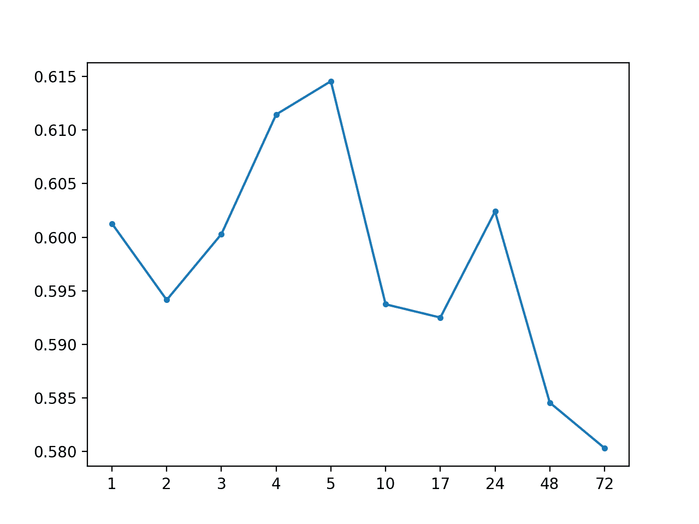
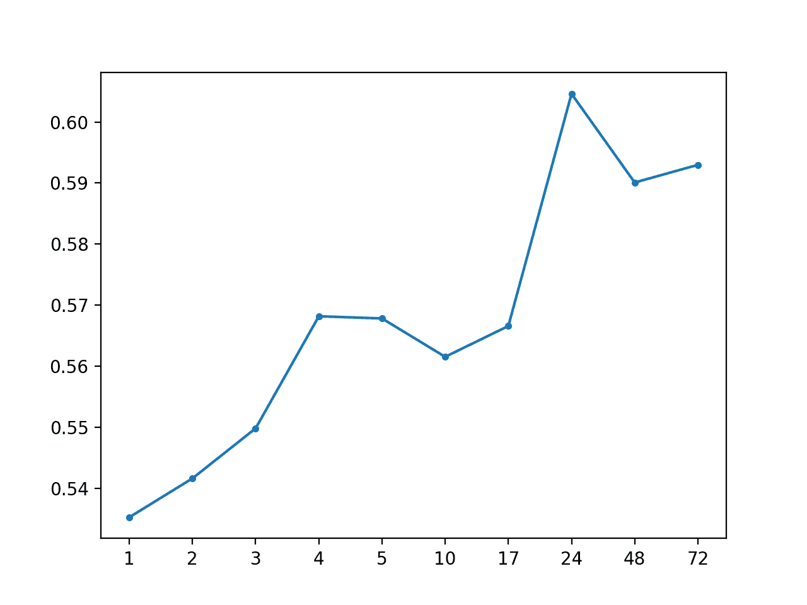

# 如何开发多站点多元空气污染时间序列预测的基线预测

> 原文： [https://machinelearningmastery.com/how-to-develop-baseline-forecasts-for-multi-site-multivariate-air-pollution-time-series-forecasting/](https://machinelearningmastery.com/how-to-develop-baseline-forecasts-for-multi-site-multivariate-air-pollution-time-series-forecasting/)

实时世界时间序列预测具有挑战性，其原因不仅限于问题特征，例如具有多个输入变量，需要预测多个时间步骤，以及需要对多个物理站点执行相同类型的预测。

EMC Data Science Global Hackathon 数据集或简称“_ 空气质量预测 _”数据集描述了多个站点的天气状况，需要预测随后三天的空气质量测量结果。

使用新的时间序列预测数据集时，重要的第一步是开发模型表现基线，通过该基线可以比较所有其他更复杂策略的技能。基线预测策略简单快捷。它们被称为“朴素”策略，因为它们对特定预测问题的假设很少或根本没有。

在本教程中，您将了解如何为多步骤多变量空气污染时间序列预测问题开发朴素的预测方法。

完成本教程后，您将了解：

*   如何开发用于评估大气污染数据集预测策略的测试工具。
*   如何开发使用整个训练数据集中的数据的全球朴素预测策略。
*   如何开发使用来自预测的特定区间的数据的本地朴素预测策略。

让我们开始吧。


如何制定多站点多元空气污染时间序列预测的基准预测
照片由 [DAVID HOLT](https://www.flickr.com/photos/zongo/38524476520/) ，保留一些权利。

## 教程概述

本教程分为六个部分;他们是：

*   问题描述
*   朴素的方法
*   模型评估
*   全球朴素的方法
*   大块朴素的方法
*   结果摘要

## 问题描述

空气质量预测数据集描述了多个地点的天气状况，需要预测随后三天的空气质量测量结果。

具体而言，对于多个站点，每小时提供 8 天的温度，压力，风速和风向等天气观测。目标是预测未来 3 天在多个地点的空气质量测量。预测的提前期不是连续的;相反，必须在 72 小时预测期内预测特定提前期。他们是：

```py
+1, +2, +3, +4, +5, +10, +17, +24, +48, +72
```

此外，数据集被划分为不相交但连续的数据块，其中 8 天的数据随后是需要预测的 3 天。

并非所有站点或块都可以获得所有观察结果，并且并非所有站点和块都可以使用所有输出变量。必须解决大部分缺失数据。

该数据集被用作 2012 年 Kaggle 网站上[短期机器学习竞赛](https://www.kaggle.com/c/dsg-hackathon)（或黑客马拉松）的基础。

根据从参与者中扣留的真实观察结果评估竞赛的提交，并使用平均绝对误差（MAE）进行评分。提交要求在由于缺少数据而无法预测的情况下指定-1,000,000 的值。实际上，提供了一个插入缺失值的模板，并且要求所有提交都采用（模糊的是什么）。

获胜者在滞留测试集（[私人排行榜](https://www.kaggle.com/c/dsg-hackathon/leaderboard)）上使用随机森林在滞后观察中获得了 0.21058 的 MAE。该帖子中提供了此解决方案的说明：

*   [把所有东西都扔进随机森林：Ben Hamner 赢得空气质量预测黑客马拉松](http://blog.kaggle.com/2012/05/01/chucking-everything-into-a-random-forest-ben-hamner-on-winning-the-air-quality-prediction-hackathon/)，2012。

在本教程中，我们将探索如何为可用作基线的问题开发朴素预测，以确定模型是否具有该问题的技能。

## 朴素的预测方法

预测表现的基线提供了一个比较点。

它是您问题的所有其他建模技术的参考点。如果模型达到或低于基线的表现，则应该修复或放弃该技术。

用于生成预测以计算基准表现的技术必须易于实现，并且不需要特定于问题的细节。原则是，如果复杂的预测方法不能胜过使用很少或没有特定问题信息的模型，那么它就没有技巧。

可以并且应该首先使用与问题无关的预测方法，然后是使用少量特定于问题的信息的朴素方法。

可以使用的两个与问题无关的朴素预测方法的例子包括：

*   保留每个系列的最后观察值。
*   预测每个系列的观测值的平均值。

数据被分成时间块或间隔。每个时间块都有多个站点的多个变量来预测。持久性预测方法在数据组织的这个组块级别是有意义的。

可以探索其他持久性方法;例如：

*   每个系列的接下来三天预测前一天的观察结果。
*   每个系列的接下来三天预测前三天的观察结果。

这些是需要探索的理想基线方法，但是大量缺失数据和大多数数据块的不连续结构使得在没有非平凡数据准备的情况下实施它们具有挑战性。

可以进一步详细说明预测每个系列的平均观测值;例如：

*   预测每个系列的全局（跨块）平均值。
*   预测每个系列的本地（块内）平均值。

每个系列都需要三天的预测，具有不同的开始时间，例如：一天的时间。因此，每个块的预测前置时间将在一天中的不同时段下降。

进一步详细说明预测平均值是为了纳入正在预测的一天中的小时数;例如：

*   预测每个预测提前期的一小时的全球（跨块）平均值。
*   预测每个预测提前期的当天（当地块）平均值。

在多个站点测量许多变量;因此，可以跨系列使用信息，例如计算预测提前期的每小时平均值或平均值。这些很有意思，但可能会超出朴素的使命。

这是一个很好的起点，尽管可能会进一步详细阐述您可能想要考虑和探索的朴素方法。请记住，目标是使用非常少的问题特定信息来开发预测基线。

总之，我们将研究针对此问题的五种不同的朴素预测方法，其中最好的方法将提供表现的下限，通过该方法可以比较其他模型。他们是：

1.  每个系列的全球平均价值
2.  每个系列的预测提前期的全球平均值
3.  每个系列的本地持久价值
4.  每个系列的本地平均值
5.  每个系列的预测提前期的当地平均值

## 模型评估

在我们评估朴素的预测方法之前，我们必须开发一个测试工具。

这至少包括如何准备数据以及如何评估预测。

### 加载数据集

第一步是下载数据集并将其加载到内存中。

数据集可以从 Kaggle 网站免费下载。您可能必须创建一个帐户并登录才能下载数据集。

下载整个数据集，例如“_ 将所有 _”下载到您的工作站，并使用名为'`AirQualityPrediction`'的文件夹解压缩当前工作目录中的存档。

*   [EMC 数据科学全球黑客马拉松（空气质量预测）数据](https://www.kaggle.com/c/dsg-hackathon/data)

我们的重点将是包含训练数据集的'`TrainingData.csv`'文件，特别是块中的数据，其中每个块是八个连续的观察日和目标变量。

我们可以使用 Pandas [read_csv（）函数](https://pandas.pydata.org/pandas-docs/stable/generated/pandas.read_csv.html)将数据文件加载到内存中，并在第 0 行指定标题行。

```py
# load dataset
dataset = read_csv('AirQualityPrediction/TrainingData.csv', header=0)
```

我们可以通过'chunkID'变量（列索引 1）对数据进行分组。

首先，让我们获取唯一的块标识符列表。

```py
chunk_ids = unique(values[:, 1])
```

然后，我们可以收集每个块标识符的所有行，并将它们存储在字典中以便于访问。

```py
chunks = dict()
# sort rows by chunk id
for chunk_id in chunk_ids:
	selection = values[:, chunk_ix] == chunk_id
	chunks[chunk_id] = values[selection, :]
```

下面定义了一个名为`to_chunks()`的函数，它接受加载数据的 NumPy 数组，并将`chunk_id`的字典返回到块的行。

```py
# split the dataset by 'chunkID', return a dict of id to rows
def to_chunks(values, chunk_ix=1):
	chunks = dict()
	# get the unique chunk ids
	chunk_ids = unique(values[:, chunk_ix])
	# group rows by chunk id
	for chunk_id in chunk_ids:
		selection = values[:, chunk_ix] == chunk_id
		chunks[chunk_id] = values[selection, :]
	return chunks
```

下面列出了加载数据集并将其拆分为块的完整示例。

```py
# load data and split into chunks
from numpy import unique
from pandas import read_csv

# split the dataset by 'chunkID', return a dict of id to rows
def to_chunks(values, chunk_ix=1):
	chunks = dict()
	# get the unique chunk ids
	chunk_ids = unique(values[:, chunk_ix])
	# group rows by chunk id
	for chunk_id in chunk_ids:
		selection = values[:, chunk_ix] == chunk_id
		chunks[chunk_id] = values[selection, :]
	return chunks

# load dataset
dataset = read_csv('AirQualityPrediction/TrainingData.csv', header=0)
# group data by chunks
values = dataset.values
chunks = to_chunks(values)
print('Total Chunks: %d' % len(chunks))
```

运行该示例将打印数据集中的块数。

```py
Total Chunks: 208
```

### 数据准备

既然我们知道如何加载数据并将其拆分成块，我们就可以将它们分成训练和测试数据集。

尽管每个块内的实际观测数量可能差异很大，但每个块的每小时观察间隔为 8 天。

我们可以将每个块分成前五天的训练观察和最后三天的测试。

每个观察都有一行称为'`position_within_chunk`'，从 1 到 192（8 天* 24 小时）不等。因此，我们可以将此列中值小于或等于 120（5 * 24）的所有行作为训练数据，将任何大于 120 的值作为测试数据。

此外，任何在训练或测试分割中没有任何观察的块都可以被丢弃，因为不可行。

在使用朴素模型时，我们只对目标变量感兴趣，而不对输入的气象变量感兴趣。因此，我们可以删除输入数据，并使训练和测试数据仅包含每个块的 39 个目标变量，以及块和观察时间内的位置。

下面的`split_train_test()`函数实现了这种行为;给定一个块的字典，它将每个分成训练和测试块数据。

```py
# split each chunk into train/test sets
def split_train_test(chunks, row_in_chunk_ix=2):
	train, test = list(), list()
	# first 5 days of hourly observations for train
	cut_point = 5 * 24
	# enumerate chunks
	for k,rows in chunks.items():
		# split chunk rows by 'position_within_chunk'
		train_rows = rows[rows[:,row_in_chunk_ix] <= cut_point, :]
		test_rows = rows[rows[:,row_in_chunk_ix] > cut_point, :]
		if len(train_rows) == 0 or len(test_rows) == 0:
			print('>dropping chunk=%d: train=%s, test=%s' % (k, train_rows.shape, test_rows.shape))
			continue
		# store with chunk id, position in chunk, hour and all targets
		indices = [1,2,5] + [x for x in range(56,train_rows.shape[1])]
		train.append(train_rows[:, indices])
		test.append(test_rows[:, indices])
	return train, test
```

我们不需要整个测试数据集;相反，我们只需要在三天时间内的特定提前期进行观察，特别是提前期：

```py
+1, +2, +3, +4, +5, +10, +17, +24, +48, +72
```

其中，每个提前期相对于训练期结束。

首先，我们可以将这些提前期放入函数中以便于参考：

```py
# return a list of relative forecast lead times
def get_lead_times():
	return [1, 2 ,3, 4, 5, 10, 17, 24, 48, 72]
```

接下来，我们可以将测试数据集缩减为仅在首选提前期的数据。

我们可以通过查看'`position_within_chunk`'列并使用提前期作为距离训练数据集末尾的偏移量来实现，例如： 120 + 1,120 +2 等

如果我们在测试集中找到匹配的行，则保存它，否则生成一行 NaN 观测值。

下面的函数`to_forecasts()`实现了这一点，并为每个块的每个预测提前期返回一行 NumPy 数组。

```py
# convert the rows in a test chunk to forecasts
def to_forecasts(test_chunks, row_in_chunk_ix=1):
	# get lead times
	lead_times = get_lead_times()
	# first 5 days of hourly observations for train
	cut_point = 5 * 24
	forecasts = list()
	# enumerate each chunk
	for rows in test_chunks:
		chunk_id = rows[0, 0]
		# enumerate each lead time
		for tau in lead_times:
			# determine the row in chunk we want for the lead time
			offset = cut_point + tau
			# retrieve data for the lead time using row number in chunk
			row_for_tau = rows[rows[:,row_in_chunk_ix]==offset, :]
			# check if we have data
			if len(row_for_tau) == 0:
				# create a mock row [chunk, position, hour] + [nan...]
				row = [chunk_id, offset, nan] + [nan for _ in range(39)]
				forecasts.append(row)
			else:
				# store the forecast row
				forecasts.append(row_for_tau[0])
	return array(forecasts)
```

我们可以将所有这些组合在一起并将数据集拆分为训练集和测试集，并将结果保存到新文件中。

完整的代码示例如下所示。

```py
# split data into train and test sets
from numpy import unique
from numpy import nan
from numpy import array
from numpy import savetxt
from pandas import read_csv

# split the dataset by 'chunkID', return a dict of id to rows
def to_chunks(values, chunk_ix=1):
	chunks = dict()
	# get the unique chunk ids
	chunk_ids = unique(values[:, chunk_ix])
	# group rows by chunk id
	for chunk_id in chunk_ids:
		selection = values[:, chunk_ix] == chunk_id
		chunks[chunk_id] = values[selection, :]
	return chunks

# split each chunk into train/test sets
def split_train_test(chunks, row_in_chunk_ix=2):
	train, test = list(), list()
	# first 5 days of hourly observations for train
	cut_point = 5 * 24
	# enumerate chunks
	for k,rows in chunks.items():
		# split chunk rows by 'position_within_chunk'
		train_rows = rows[rows[:,row_in_chunk_ix] <= cut_point, :]
		test_rows = rows[rows[:,row_in_chunk_ix] > cut_point, :]
		if len(train_rows) == 0 or len(test_rows) == 0:
			print('>dropping chunk=%d: train=%s, test=%s' % (k, train_rows.shape, test_rows.shape))
			continue
		# store with chunk id, position in chunk, hour and all targets
		indices = [1,2,5] + [x for x in range(56,train_rows.shape[1])]
		train.append(train_rows[:, indices])
		test.append(test_rows[:, indices])
	return train, test

# return a list of relative forecast lead times
def get_lead_times():
	return [1, 2 ,3, 4, 5, 10, 17, 24, 48, 72]

# convert the rows in a test chunk to forecasts
def to_forecasts(test_chunks, row_in_chunk_ix=1):
	# get lead times
	lead_times = get_lead_times()
	# first 5 days of hourly observations for train
	cut_point = 5 * 24
	forecasts = list()
	# enumerate each chunk
	for rows in test_chunks:
		chunk_id = rows[0, 0]
		# enumerate each lead time
		for tau in lead_times:
			# determine the row in chunk we want for the lead time
			offset = cut_point + tau
			# retrieve data for the lead time using row number in chunk
			row_for_tau = rows[rows[:,row_in_chunk_ix]==offset, :]
			# check if we have data
			if len(row_for_tau) == 0:
				# create a mock row [chunk, position, hour] + [nan...]
				row = [chunk_id, offset, nan] + [nan for _ in range(39)]
				forecasts.append(row)
			else:
				# store the forecast row
				forecasts.append(row_for_tau[0])
	return array(forecasts)

# load dataset
dataset = read_csv('AirQualityPrediction/TrainingData.csv', header=0)
# group data by chunks
values = dataset.values
chunks = to_chunks(values)
# split into train/test
train, test = split_train_test(chunks)
# flatten training chunks to rows
train_rows = array([row for rows in train for row in rows])
# print(train_rows.shape)
print('Train Rows: %s' % str(train_rows.shape))
# reduce train to forecast lead times only
test_rows = to_forecasts(test)
print('Test Rows: %s' % str(test_rows.shape))
# save datasets
savetxt('AirQualityPrediction/naive_train.csv', train_rows, delimiter=',')
savetxt('AirQualityPrediction/naive_test.csv', test_rows, delimiter=',')
```

运行该示例首先评论了从数据集中移除了块 69 以获得不足的数据。

然后我们可以看到每个训练和测试集中有 42 列，一个用于块 ID，块内位置，一天中的小时和 39 个训练变量。

我们还可以看到测试数据集的显着缩小版本，其中行仅在预测前置时间。

新的训练和测试数据集分别保存在'`naive_train.csv`'和'`naive_test.csv`'文件中。

```py
>dropping chunk=69: train=(0, 95), test=(28, 95)
Train Rows: (23514, 42)
Test Rows: (2070, 42)
```

### 预测评估

一旦做出预测，就需要对它们进行评估。

在评估预测时，使用更简单的格式会很有帮助。例如，我们将使用 _[chunk] [变量] [时间]_ 的三维结构，其中变量是从 0 到 38 的目标变量数，time 是从 0 到 9 的提前期索引。

模型有望以这种格式做出预测。

我们还可以重新构建测试数据集以使此数据集进行比较。下面的`prepare_test_forecasts()`函数实现了这一点。

```py
# convert the test dataset in chunks to [chunk][variable][time] format
def prepare_test_forecasts(test_chunks):
	predictions = list()
	# enumerate chunks to forecast
	for rows in test_chunks:
		# enumerate targets for chunk
		chunk_predictions = list()
		for j in range(3, rows.shape[1]):
			yhat = rows[:, j]
			chunk_predictions.append(yhat)
		chunk_predictions = array(chunk_predictions)
		predictions.append(chunk_predictions)
	return array(predictions)
```

我们将使用平均绝对误差或 MAE 来评估模型。这是在竞争中使用的度量，并且在给定目标变量的非高斯分布的情况下是合理的选择。

如果提前期不包含测试集中的数据（例如`NaN`），则不会计算该预测的错误。如果提前期确实在测试集中有数据但预测中没有数据，那么观察的全部大小将被视为错误。最后，如果测试集具有观察值并做出预测，则绝对差值将被记录为误差。

`calculate_error()`函数实现这些规则并返回给定预测的错误。

```py
# calculate the error between an actual and predicted value
def calculate_error(actual, predicted):
	# give the full actual value if predicted is nan
	if isnan(predicted):
		return abs(actual)
	# calculate abs difference
	return abs(actual - predicted)
```

错误在所有块和所有提前期之间求和，然后取平均值。

将计算总体 MAE，但我们还将计算每个预测提前期的 MAE。这通常有助于模型选择，因为某些模型在不同的提前期可能会有不同的表现。

下面的 evaluate_forecasts（）函数实现了这一点，计算了 _[chunk] [variable] [time]_ 格式中提供的预测和期望值的 MAE 和每个引导时间 MAE。

```py
# evaluate a forecast in the format [chunk][variable][time]
def evaluate_forecasts(predictions, testset):
	lead_times = get_lead_times()
	total_mae, times_mae = 0.0, [0.0 for _ in range(len(lead_times))]
	total_c, times_c = 0, [0 for _ in range(len(lead_times))]
	# enumerate test chunks
	for i in range(len(test_chunks)):
		# convert to forecasts
		actual = testset[i]
		predicted = predictions[i]
		# enumerate target variables
		for j in range(predicted.shape[0]):
			# enumerate lead times
			for k in range(len(lead_times)):
				# skip if actual in nan
				if isnan(actual[j, k]):
					continue
				# calculate error
				error = calculate_error(actual[j, k], predicted[j, k])
				# update statistics
				total_mae += error
				times_mae[k] += error
				total_c += 1
				times_c[k] += 1
	# normalize summed absolute errors
	total_mae /= total_c
	times_mae = [times_mae[i]/times_c[i] for i in range(len(times_mae))]
	return total_mae, times_mae
```

一旦我们对模型进行评估，我们就可以呈现它。

下面的`summarize_error()`函数首先打印模型表现的一行摘要，然后创建每个预测提前期的 MAE 图。

```py
# summarize scores
def summarize_error(name, total_mae, times_mae):
	# print summary
	lead_times = get_lead_times()
	formatted = ['+%d %.3f' % (lead_times[i], times_mae[i]) for i in range(len(lead_times))]
	s_scores = ', '.join(formatted)
	print('%s: [%.3f MAE] %s' % (name, total_mae, s_scores))
	# plot summary
	pyplot.plot([str(x) for x in lead_times], times_mae, marker='.')
	pyplot.show()
```

我们现在准备开始探索朴素预测方法的表现。

## 全球朴素的方法

在本节中，我们将探索使用训练数据集中所有数据的朴素预测方法，而不是约束我们正在做出预测的块。

我们将看两种方法：

*   预测每个系列的平均值
*   预测每个系列的每日小时的平均值

### 预测每个系列的平均值

第一步是实现一个通用函数，用于为每个块做出预测。

该函数获取测试集的训练数据集和输入列（块 ID，块中的位置和小时），并返回具有 _[块] [变量] [时间]的预期 3D 格式的所有块的预测 _。

该函数枚举预测中的块，然后枚举 39 个目标列，调用另一个名为`forecast_variable()`的新函数，以便对给定目标变量的每个提前期做出预测。

完整的功能如下所列。

```py
# forecast for each chunk, returns [chunk][variable][time]
def forecast_chunks(train_chunks, test_input):
	lead_times = get_lead_times()
	predictions = list()
	# enumerate chunks to forecast
	for i in range(len(train_chunks)):
		# enumerate targets for chunk
		chunk_predictions = list()
		for j in range(39):
			yhat = forecast_variable(train_chunks, train_chunks[i], test_input[i], lead_times, j)
			chunk_predictions.append(yhat)
		chunk_predictions = array(chunk_predictions)
		predictions.append(chunk_predictions)
	return array(predictions)
```

我们现在可以实现`forecast_variable()`的一个版本，该版本计算给定系列的平均值，并预测每个提前期的平均值。

首先，我们必须在所有块中收集目标列中的所有观测值，然后计算观测值的平均值，同时忽略 NaN 值。`nanmean()`NumPy 函数将计算阵列的平均值并忽略`NaN`值。

下面的`forecast_variable()`函数实现了这种行为。

```py
# forecast all lead times for one variable
def forecast_variable(train_chunks, chunk_train, chunk_test, lead_times, target_ix):
	# convert target number into column number
	col_ix = 3 + target_ix
	# collect obs from all chunks
	all_obs = list()
	for chunk in train_chunks:
		all_obs += [x for x in chunk[:, col_ix]]
	# return the average, ignoring nan
	value = nanmean(all_obs)
	return [value for _ in lead_times]
```

我们现在拥有我们需要的一切。

下面列出了在所有预测提前期内预测每个系列的全局均值的完整示例。

```py
# forecast global mean
from numpy import loadtxt
from numpy import nan
from numpy import isnan
from numpy import count_nonzero
from numpy import unique
from numpy import array
from numpy import nanmean
from matplotlib import pyplot

# split the dataset by 'chunkID', return a list of chunks
def to_chunks(values, chunk_ix=0):
	chunks = list()
	# get the unique chunk ids
	chunk_ids = unique(values[:, chunk_ix])
	# group rows by chunk id
	for chunk_id in chunk_ids:
		selection = values[:, chunk_ix] == chunk_id
		chunks.append(values[selection, :])
	return chunks

# return a list of relative forecast lead times
def get_lead_times():
	return [1, 2 ,3, 4, 5, 10, 17, 24, 48, 72]

# forecast all lead times for one variable
def forecast_variable(train_chunks, chunk_train, chunk_test, lead_times, target_ix):
	# convert target number into column number
	col_ix = 3 + target_ix
	# collect obs from all chunks
	all_obs = list()
	for chunk in train_chunks:
		all_obs += [x for x in chunk[:, col_ix]]
	# return the average, ignoring nan
	value = nanmean(all_obs)
	return [value for _ in lead_times]

# forecast for each chunk, returns [chunk][variable][time]
def forecast_chunks(train_chunks, test_input):
	lead_times = get_lead_times()
	predictions = list()
	# enumerate chunks to forecast
	for i in range(len(train_chunks)):
		# enumerate targets for chunk
		chunk_predictions = list()
		for j in range(39):
			yhat = forecast_variable(train_chunks, train_chunks[i], test_input[i], lead_times, j)
			chunk_predictions.append(yhat)
		chunk_predictions = array(chunk_predictions)
		predictions.append(chunk_predictions)
	return array(predictions)

# convert the test dataset in chunks to [chunk][variable][time] format
def prepare_test_forecasts(test_chunks):
	predictions = list()
	# enumerate chunks to forecast
	for rows in test_chunks:
		# enumerate targets for chunk
		chunk_predictions = list()
		for j in range(3, rows.shape[1]):
			yhat = rows[:, j]
			chunk_predictions.append(yhat)
		chunk_predictions = array(chunk_predictions)
		predictions.append(chunk_predictions)
	return array(predictions)

# calculate the error between an actual and predicted value
def calculate_error(actual, predicted):
	# give the full actual value if predicted is nan
	if isnan(predicted):
		return abs(actual)
	# calculate abs difference
	return abs(actual - predicted)

# evaluate a forecast in the format [chunk][variable][time]
def evaluate_forecasts(predictions, testset):
	lead_times = get_lead_times()
	total_mae, times_mae = 0.0, [0.0 for _ in range(len(lead_times))]
	total_c, times_c = 0, [0 for _ in range(len(lead_times))]
	# enumerate test chunks
	for i in range(len(test_chunks)):
		# convert to forecasts
		actual = testset[i]
		predicted = predictions[i]
		# enumerate target variables
		for j in range(predicted.shape[0]):
			# enumerate lead times
			for k in range(len(lead_times)):
				# skip if actual in nan
				if isnan(actual[j, k]):
					continue
				# calculate error
				error = calculate_error(actual[j, k], predicted[j, k])
				# update statistics
				total_mae += error
				times_mae[k] += error
				total_c += 1
				times_c[k] += 1
	# normalize summed absolute errors
	total_mae /= total_c
	times_mae = [times_mae[i]/times_c[i] for i in range(len(times_mae))]
	return total_mae, times_mae

# summarize scores
def summarize_error(name, total_mae, times_mae):
	# print summary
	lead_times = get_lead_times()
	formatted = ['+%d %.3f' % (lead_times[i], times_mae[i]) for i in range(len(lead_times))]
	s_scores = ', '.join(formatted)
	print('%s: [%.3f MAE] %s' % (name, total_mae, s_scores))
	# plot summary
	pyplot.plot([str(x) for x in lead_times], times_mae, marker='.')
	pyplot.show()

# load dataset
train = loadtxt('AirQualityPrediction/naive_train.csv', delimiter=',')
test = loadtxt('AirQualityPrediction/naive_test.csv', delimiter=',')
# group data by chunks
train_chunks = to_chunks(train)
test_chunks = to_chunks(test)
# forecast
test_input = [rows[:, :3] for rows in test_chunks]
forecast = forecast_chunks(train_chunks, test_input)
# evaluate forecast
actual = prepare_test_forecasts(test_chunks)
total_mae, times_mae = evaluate_forecasts(forecast, actual)
# summarize forecast
summarize_error('Global Mean', total_mae, times_mae)
```

首先运行该示例打印的总体 MAE 为 0.634，然后是每个预测提前期的 MAE 分数。

```py
# Global Mean: [0.634 MAE] +1 0.635, +2 0.629, +3 0.638, +4 0.650, +5 0.649, +10 0.635, +17 0.634, +24 0.641, +48 0.613, +72 0.618
```

创建一个线图，显示每个预测前置时间的 MAE 分数，从+1 小时到+72 小时。

我们无法看到预测前置时间与预测错误有任何明显的关系，正如我们对更熟练的模型所期望的那样。


MAE 按预测带领全球均值时间

我们可以更新示例来预测全局中位数而不是平均值。

考虑到数据似乎显示的非高斯分布，中值可能比使用该数据的均值更有意义地用作集中趋势。

NumPy 提供`nanmedian()`功能，我们可以在`forecast_variable()`函数中代替 _nanmean（）_。

完整更新的示例如下所示。

```py
# forecast global median
from numpy import loadtxt
from numpy import nan
from numpy import isnan
from numpy import count_nonzero
from numpy import unique
from numpy import array
from numpy import nanmedian
from matplotlib import pyplot

# split the dataset by 'chunkID', return a list of chunks
def to_chunks(values, chunk_ix=0):
	chunks = list()
	# get the unique chunk ids
	chunk_ids = unique(values[:, chunk_ix])
	# group rows by chunk id
	for chunk_id in chunk_ids:
		selection = values[:, chunk_ix] == chunk_id
		chunks.append(values[selection, :])
	return chunks

# return a list of relative forecast lead times
def get_lead_times():
	return [1, 2 ,3, 4, 5, 10, 17, 24, 48, 72]

# forecast all lead times for one variable
def forecast_variable(train_chunks, chunk_train, chunk_test, lead_times, target_ix):
	# convert target number into column number
	col_ix = 3 + target_ix
	# collect obs from all chunks
	all_obs = list()
	for chunk in train_chunks:
		all_obs += [x for x in chunk[:, col_ix]]
	# return the average, ignoring nan
	value = nanmedian(all_obs)
	return [value for _ in lead_times]

# forecast for each chunk, returns [chunk][variable][time]
def forecast_chunks(train_chunks, test_input):
	lead_times = get_lead_times()
	predictions = list()
	# enumerate chunks to forecast
	for i in range(len(train_chunks)):
		# enumerate targets for chunk
		chunk_predictions = list()
		for j in range(39):
			yhat = forecast_variable(train_chunks, train_chunks[i], test_input[i], lead_times, j)
			chunk_predictions.append(yhat)
		chunk_predictions = array(chunk_predictions)
		predictions.append(chunk_predictions)
	return array(predictions)

# convert the test dataset in chunks to [chunk][variable][time] format
def prepare_test_forecasts(test_chunks):
	predictions = list()
	# enumerate chunks to forecast
	for rows in test_chunks:
		# enumerate targets for chunk
		chunk_predictions = list()
		for j in range(3, rows.shape[1]):
			yhat = rows[:, j]
			chunk_predictions.append(yhat)
		chunk_predictions = array(chunk_predictions)
		predictions.append(chunk_predictions)
	return array(predictions)

# calculate the error between an actual and predicted value
def calculate_error(actual, predicted):
	# give the full actual value if predicted is nan
	if isnan(predicted):
		return abs(actual)
	# calculate abs difference
	return abs(actual - predicted)

# evaluate a forecast in the format [chunk][variable][time]
def evaluate_forecasts(predictions, testset):
	lead_times = get_lead_times()
	total_mae, times_mae = 0.0, [0.0 for _ in range(len(lead_times))]
	total_c, times_c = 0, [0 for _ in range(len(lead_times))]
	# enumerate test chunks
	for i in range(len(test_chunks)):
		# convert to forecasts
		actual = testset[i]
		predicted = predictions[i]
		# enumerate target variables
		for j in range(predicted.shape[0]):
			# enumerate lead times
			for k in range(len(lead_times)):
				# skip if actual in nan
				if isnan(actual[j, k]):
					continue
				# calculate error
				error = calculate_error(actual[j, k], predicted[j, k])
				# update statistics
				total_mae += error
				times_mae[k] += error
				total_c += 1
				times_c[k] += 1
	# normalize summed absolute errors
	total_mae /= total_c
	times_mae = [times_mae[i]/times_c[i] for i in range(len(times_mae))]
	return total_mae, times_mae

# summarize scores
def summarize_error(name, total_mae, times_mae):
	# print summary
	lead_times = get_lead_times()
	formatted = ['+%d %.3f' % (lead_times[i], times_mae[i]) for i in range(len(lead_times))]
	s_scores = ', '.join(formatted)
	print('%s: [%.3f MAE] %s' % (name, total_mae, s_scores))
	# plot summary
	pyplot.plot([str(x) for x in lead_times], times_mae, marker='.')
	pyplot.show()

# load dataset
train = loadtxt('AirQualityPrediction/naive_train.csv', delimiter=',')
test = loadtxt('AirQualityPrediction/naive_test.csv', delimiter=',')
# group data by chunks
train_chunks = to_chunks(train)
test_chunks = to_chunks(test)
# forecast
test_input = [rows[:, :3] for rows in test_chunks]
forecast = forecast_chunks(train_chunks, test_input)
# evaluate forecast
actual = prepare_test_forecasts(test_chunks)
total_mae, times_mae = evaluate_forecasts(forecast, actual)
# summarize forecast
summarize_error('Global Median', total_mae, times_mae)
```

运行该示例显示 MAE 下降至约 0.59，表明确实使用中位数作为集中趋势可能是更好的基线策略。

```py
Global Median: [0.598 MAE] +1 0.601, +2 0.594, +3 0.600, +4 0.611, +5 0.615, +10 0.594, +17 0.592, +24 0.602, +48 0.585, +72 0.580
```

还创建了每个提前期 MAE 的线图。



MAE 预测带领全球中位数的时间

### 预测每个系列的每日小时的平均值

我们可以通过系列更新用于计算集中趋势的朴素模型，以仅包括与预测提前期具有相同时段的行。

例如，如果+1 提前时间具有小时 6（例如 0600 或 6AM），那么我们可以在该小时的所有块中找到训练数据集中的所有其他行，并从这些行计算给定目标变量的中值。 。

我们在测试数据集中记录一天中的小时数，并在做出预测时将其提供给模型。一个问题是，在某些情况下，测试数据集没有给定提前期的记录，而且必须用`NaN`值发明一个，包括小时的`NaN`值。在这些情况下，不需要预测，因此我们将跳过它们并预测`NaN`值。

下面的`forecast_variable()`函数实现了这种行为，返回给定变量的每个提前期的预测。

效率不高，首先为每个变量预先计算每小时的中值，然后使用查找表做出预测可能会更有效。此时效率不是问题，因为我们正在寻找模型表现的基线。

```py
# forecast all lead times for one variable
def forecast_variable(train_chunks, chunk_train, chunk_test, lead_times, target_ix):
	forecast = list()
	# convert target number into column number
	col_ix = 3 + target_ix
	# enumerate lead times
	for i in range(len(lead_times)):
		# get the hour for this forecast lead time
		hour = chunk_test[i, 2]
		# check for no test data
		if isnan(hour):
			forecast.append(nan)
			continue
		# get all rows in training for this hour
		all_rows = list()
		for rows in train_chunks:
			[all_rows.append(row) for row in rows[rows[:,2]==hour]]
		# calculate the central tendency for target
		all_rows = array(all_rows)
		value = nanmedian(all_rows[:, col_ix])
		forecast.append(value)
	return forecast
```

下面列出了按一天中的小时预测全球中值的完整示例。

```py
# forecast global median by hour of day
from numpy import loadtxt
from numpy import nan
from numpy import isnan
from numpy import count_nonzero
from numpy import unique
from numpy import array
from numpy import nanmedian
from matplotlib import pyplot

# split the dataset by 'chunkID', return a list of chunks
def to_chunks(values, chunk_ix=0):
	chunks = list()
	# get the unique chunk ids
	chunk_ids = unique(values[:, chunk_ix])
	# group rows by chunk id
	for chunk_id in chunk_ids:
		selection = values[:, chunk_ix] == chunk_id
		chunks.append(values[selection, :])
	return chunks

# return a list of relative forecast lead times
def get_lead_times():
	return [1, 2, 3, 4, 5, 10, 17, 24, 48, 72]

# forecast all lead times for one variable
def forecast_variable(train_chunks, chunk_train, chunk_test, lead_times, target_ix):
	forecast = list()
	# convert target number into column number
	col_ix = 3 + target_ix
	# enumerate lead times
	for i in range(len(lead_times)):
		# get the hour for this forecast lead time
		hour = chunk_test[i, 2]
		# check for no test data
		if isnan(hour):
			forecast.append(nan)
			continue
		# get all rows in training for this hour
		all_rows = list()
		for rows in train_chunks:
			[all_rows.append(row) for row in rows[rows[:,2]==hour]]
		# calculate the central tendency for target
		all_rows = array(all_rows)
		value = nanmedian(all_rows[:, col_ix])
		forecast.append(value)
	return forecast

# forecast for each chunk, returns [chunk][variable][time]
def forecast_chunks(train_chunks, test_input):
	lead_times = get_lead_times()
	predictions = list()
	# enumerate chunks to forecast
	for i in range(len(train_chunks)):
		# enumerate targets for chunk
		chunk_predictions = list()
		for j in range(39):
			yhat = forecast_variable(train_chunks, train_chunks[i], test_input[i], lead_times, j)
			chunk_predictions.append(yhat)
		chunk_predictions = array(chunk_predictions)
		predictions.append(chunk_predictions)
	return array(predictions)

# convert the test dataset in chunks to [chunk][variable][time] format
def prepare_test_forecasts(test_chunks):
	predictions = list()
	# enumerate chunks to forecast
	for rows in test_chunks:
		# enumerate targets for chunk
		chunk_predictions = list()
		for j in range(3, rows.shape[1]):
			yhat = rows[:, j]
			chunk_predictions.append(yhat)
		chunk_predictions = array(chunk_predictions)
		predictions.append(chunk_predictions)
	return array(predictions)

# calculate the error between an actual and predicted value
def calculate_error(actual, predicted):
	# give the full actual value if predicted is nan
	if isnan(predicted):
		return abs(actual)
	# calculate abs difference
	return abs(actual - predicted)

# evaluate a forecast in the format [chunk][variable][time]
def evaluate_forecasts(predictions, testset):
	lead_times = get_lead_times()
	total_mae, times_mae = 0.0, [0.0 for _ in range(len(lead_times))]
	total_c, times_c = 0, [0 for _ in range(len(lead_times))]
	# enumerate test chunks
	for i in range(len(test_chunks)):
		# convert to forecasts
		actual = testset[i]
		predicted = predictions[i]
		# enumerate target variables
		for j in range(predicted.shape[0]):
			# enumerate lead times
			for k in range(len(lead_times)):
				# skip if actual in nan
				if isnan(actual[j, k]):
					continue
				# calculate error
				error = calculate_error(actual[j, k], predicted[j, k])
				# update statistics
				total_mae += error
				times_mae[k] += error
				total_c += 1
				times_c[k] += 1
	# normalize summed absolute errors
	total_mae /= total_c
	times_mae = [times_mae[i]/times_c[i] for i in range(len(times_mae))]
	return total_mae, times_mae

# summarize scores
def summarize_error(name, total_mae, times_mae):
	# print summary
	lead_times = get_lead_times()
	formatted = ['+%d %.3f' % (lead_times[i], times_mae[i]) for i in range(len(lead_times))]
	s_scores = ', '.join(formatted)
	print('%s: [%.3f MAE] %s' % (name, total_mae, s_scores))
	# plot summary
	pyplot.plot([str(x) for x in lead_times], times_mae, marker='.')
	pyplot.show()

# load dataset
train = loadtxt('AirQualityPrediction/naive_train.csv', delimiter=',')
test = loadtxt('AirQualityPrediction/naive_test.csv', delimiter=',')
# group data by chunks
train_chunks = to_chunks(train)
test_chunks = to_chunks(test)
# forecast
test_input = [rows[:, :3] for rows in test_chunks]
forecast = forecast_chunks(train_chunks, test_input)
# evaluate forecast
actual = prepare_test_forecasts(test_chunks)
total_mae, times_mae = evaluate_forecasts(forecast, actual)
# summarize forecast
summarize_error('Global Median by Hour', total_mae, times_mae)
```

运行该示例总结了模型的表现，MAE 为 0.567，这是对每个系列的全局中位数的改进。

```py
Global Median by Hour: [0.567 MAE] +1 0.573, +2 0.565, +3 0.567, +4 0.579, +5 0.589, +10 0.559, +17 0.565, +24 0.567, +48 0.558, +72 0.551
```

还创建了预测提前期 MAE 的线图，显示+72 具有最低的总体预测误差。这很有趣，并且可能表明基于小时的信息在更复杂的模型中可能是有用的。


MAE 按预测带领时间以全球中位数按天计算

## 大块朴素的方法

使用特定于块的信息可能比使用来自整个训练数据集的全局信息具有更多的预测能力。

我们可以通过三种本地或块特定的朴素预测方法来探索这个问题;他们是：

*   预测每个系列的最后观察
*   预测每个系列的平均值
*   预测每个系列的每日小时的平均值

最后两个是在上一节中评估的全局策略的块特定版本。

### 预测每个系列的最后观察

预测块的最后一次非 NaN 观察可能是最简单的模型，通常称为持久性模型或朴素模型。

下面的`forecast_variable()`函数实现了此预测策略。

```py
# forecast all lead times for one variable
def forecast_variable(train_chunks, chunk_train, chunk_test, lead_times, target_ix):
	# convert target number into column number
	col_ix = 3 + target_ix
	# extract the history for the series
	history = chunk_train[:, col_ix]
	# persist a nan if we do not find any valid data
	persisted = nan
	# enumerate history in verse order looking for the first non-nan
	for value in reversed(history):
		if not isnan(value):
			persisted = value
			break
	# persist the same value for all lead times
	forecast = [persisted for _ in range(len(lead_times))]
	return forecast
```

下面列出了评估测试集上持久性预测策略的完整示例。

```py
# persist last observation
from numpy import loadtxt
from numpy import nan
from numpy import isnan
from numpy import count_nonzero
from numpy import unique
from numpy import array
from numpy import nanmedian
from matplotlib import pyplot

# split the dataset by 'chunkID', return a list of chunks
def to_chunks(values, chunk_ix=0):
	chunks = list()
	# get the unique chunk ids
	chunk_ids = unique(values[:, chunk_ix])
	# group rows by chunk id
	for chunk_id in chunk_ids:
		selection = values[:, chunk_ix] == chunk_id
		chunks.append(values[selection, :])
	return chunks

# return a list of relative forecast lead times
def get_lead_times():
	return [1, 2, 3, 4, 5, 10, 17, 24, 48, 72]

# forecast all lead times for one variable
def forecast_variable(train_chunks, chunk_train, chunk_test, lead_times, target_ix):
	# convert target number into column number
	col_ix = 3 + target_ix
	# extract the history for the series
	history = chunk_train[:, col_ix]
	# persist a nan if we do not find any valid data
	persisted = nan
	# enumerate history in verse order looking for the first non-nan
	for value in reversed(history):
		if not isnan(value):
			persisted = value
			break
	# persist the same value for all lead times
	forecast = [persisted for _ in range(len(lead_times))]
	return forecast

# forecast for each chunk, returns [chunk][variable][time]
def forecast_chunks(train_chunks, test_input):
	lead_times = get_lead_times()
	predictions = list()
	# enumerate chunks to forecast
	for i in range(len(train_chunks)):
		# enumerate targets for chunk
		chunk_predictions = list()
		for j in range(39):
			yhat = forecast_variable(train_chunks, train_chunks[i], test_input[i], lead_times, j)
			chunk_predictions.append(yhat)
		chunk_predictions = array(chunk_predictions)
		predictions.append(chunk_predictions)
	return array(predictions)

# convert the test dataset in chunks to [chunk][variable][time] format
def prepare_test_forecasts(test_chunks):
	predictions = list()
	# enumerate chunks to forecast
	for rows in test_chunks:
		# enumerate targets for chunk
		chunk_predictions = list()
		for j in range(3, rows.shape[1]):
			yhat = rows[:, j]
			chunk_predictions.append(yhat)
		chunk_predictions = array(chunk_predictions)
		predictions.append(chunk_predictions)
	return array(predictions)

# calculate the error between an actual and predicted value
def calculate_error(actual, predicted):
	# give the full actual value if predicted is nan
	if isnan(predicted):
		return abs(actual)
	# calculate abs difference
	return abs(actual - predicted)

# evaluate a forecast in the format [chunk][variable][time]
def evaluate_forecasts(predictions, testset):
	lead_times = get_lead_times()
	total_mae, times_mae = 0.0, [0.0 for _ in range(len(lead_times))]
	total_c, times_c = 0, [0 for _ in range(len(lead_times))]
	# enumerate test chunks
	for i in range(len(test_chunks)):
		# convert to forecasts
		actual = testset[i]
		predicted = predictions[i]
		# enumerate target variables
		for j in range(predicted.shape[0]):
			# enumerate lead times
			for k in range(len(lead_times)):
				# skip if actual in nan
				if isnan(actual[j, k]):
					continue
				# calculate error
				error = calculate_error(actual[j, k], predicted[j, k])
				# update statistics
				total_mae += error
				times_mae[k] += error
				total_c += 1
				times_c[k] += 1
	# normalize summed absolute errors
	total_mae /= total_c
	times_mae = [times_mae[i]/times_c[i] for i in range(len(times_mae))]
	return total_mae, times_mae

# summarize scores
def summarize_error(name, total_mae, times_mae):
	# print summary
	lead_times = get_lead_times()
	formatted = ['+%d %.3f' % (lead_times[i], times_mae[i]) for i in range(len(lead_times))]
	s_scores = ', '.join(formatted)
	print('%s: [%.3f MAE] %s' % (name, total_mae, s_scores))
	# plot summary
	pyplot.plot([str(x) for x in lead_times], times_mae, marker='.')
	pyplot.show()

# load dataset
train = loadtxt('AirQualityPrediction/naive_train.csv', delimiter=',')
test = loadtxt('AirQualityPrediction/naive_test.csv', delimiter=',')
# group data by chunks
train_chunks = to_chunks(train)
test_chunks = to_chunks(test)
# forecast
test_input = [rows[:, :3] for rows in test_chunks]
forecast = forecast_chunks(train_chunks, test_input)
# evaluate forecast
actual = prepare_test_forecasts(test_chunks)
total_mae, times_mae = evaluate_forecasts(forecast, actual)
# summarize forecast
summarize_error('Persistence', total_mae, times_mae)
```

运行该示例将按预测提前期打印整体 MAE 和 MAE。

我们可以看到，持久性预测似乎胜过上一节中评估的所有全局策略。

这增加了一些支持，即合理假设特定于块的信息在建模此问题时很重要。

```py
Persistence: [0.520 MAE] +1 0.217, +2 0.330, +3 0.400, +4 0.471, +5 0.515, +10 0.648, +17 0.656, +24 0.589, +48 0.671, +72 0.708
```

创建每个预测提前期的 MAE 线图。

重要的是，该图显示了随着预测提前期的增加而增加误差的预期行为。也就是说，进一步预测到未来，它越具挑战性，反过来，预期会产生越多的错误。


MAE 通过持续性预测提前期

### 预测每个系列的平均值

我们可以仅使用块中的数据来保持系列的平均值，而不是持续系列的最后一次观察。

具体来说，我们可以计算出系列的中位数，正如我们在上一节中发现的那样，似乎可以带来更好的表现。

`forecast_variable()`实现了这种本地策略。

```py
# forecast all lead times for one variable
def forecast_variable(train_chunks, chunk_train, chunk_test, lead_times, target_ix):
	# convert target number into column number
	col_ix = 3 + target_ix
	# extract the history for the series
	history = chunk_train[:, col_ix]
	# calculate the central tendency
	value = nanmedian(history)
	# persist the same value for all lead times
	forecast = [value for _ in range(len(lead_times))]
	return forecast
```

下面列出了完整的示例。

```py
# forecast local median
from numpy import loadtxt
from numpy import nan
from numpy import isnan
from numpy import count_nonzero
from numpy import unique
from numpy import array
from numpy import nanmedian
from matplotlib import pyplot

# split the dataset by 'chunkID', return a list of chunks
def to_chunks(values, chunk_ix=0):
	chunks = list()
	# get the unique chunk ids
	chunk_ids = unique(values[:, chunk_ix])
	# group rows by chunk id
	for chunk_id in chunk_ids:
		selection = values[:, chunk_ix] == chunk_id
		chunks.append(values[selection, :])
	return chunks

# return a list of relative forecast lead times
def get_lead_times():
	return [1, 2, 3, 4, 5, 10, 17, 24, 48, 72]

# forecast all lead times for one variable
def forecast_variable(train_chunks, chunk_train, chunk_test, lead_times, target_ix):
	# convert target number into column number
	col_ix = 3 + target_ix
	# extract the history for the series
	history = chunk_train[:, col_ix]
	# calculate the central tendency
	value = nanmedian(history)
	# persist the same value for all lead times
	forecast = [value for _ in range(len(lead_times))]
	return forecast

# forecast for each chunk, returns [chunk][variable][time]
def forecast_chunks(train_chunks, test_input):
	lead_times = get_lead_times()
	predictions = list()
	# enumerate chunks to forecast
	for i in range(len(train_chunks)):
		# enumerate targets for chunk
		chunk_predictions = list()
		for j in range(39):
			yhat = forecast_variable(train_chunks, train_chunks[i], test_input[i], lead_times, j)
			chunk_predictions.append(yhat)
		chunk_predictions = array(chunk_predictions)
		predictions.append(chunk_predictions)
	return array(predictions)

# convert the test dataset in chunks to [chunk][variable][time] format
def prepare_test_forecasts(test_chunks):
	predictions = list()
	# enumerate chunks to forecast
	for rows in test_chunks:
		# enumerate targets for chunk
		chunk_predictions = list()
		for j in range(3, rows.shape[1]):
			yhat = rows[:, j]
			chunk_predictions.append(yhat)
		chunk_predictions = array(chunk_predictions)
		predictions.append(chunk_predictions)
	return array(predictions)

# calculate the error between an actual and predicted value
def calculate_error(actual, predicted):
	# give the full actual value if predicted is nan
	if isnan(predicted):
		return abs(actual)
	# calculate abs difference
	return abs(actual - predicted)

# evaluate a forecast in the format [chunk][variable][time]
def evaluate_forecasts(predictions, testset):
	lead_times = get_lead_times()
	total_mae, times_mae = 0.0, [0.0 for _ in range(len(lead_times))]
	total_c, times_c = 0, [0 for _ in range(len(lead_times))]
	# enumerate test chunks
	for i in range(len(test_chunks)):
		# convert to forecasts
		actual = testset[i]
		predicted = predictions[i]
		# enumerate target variables
		for j in range(predicted.shape[0]):
			# enumerate lead times
			for k in range(len(lead_times)):
				# skip if actual in nan
				if isnan(actual[j, k]):
					continue
				# calculate error
				error = calculate_error(actual[j, k], predicted[j, k])
				# update statistics
				total_mae += error
				times_mae[k] += error
				total_c += 1
				times_c[k] += 1
	# normalize summed absolute errors
	total_mae /= total_c
	times_mae = [times_mae[i]/times_c[i] for i in range(len(times_mae))]
	return total_mae, times_mae

# summarize scores
def summarize_error(name, total_mae, times_mae):
	# print summary
	lead_times = get_lead_times()
	formatted = ['+%d %.3f' % (lead_times[i], times_mae[i]) for i in range(len(lead_times))]
	s_scores = ', '.join(formatted)
	print('%s: [%.3f MAE] %s' % (name, total_mae, s_scores))
	# plot summary
	pyplot.plot([str(x) for x in lead_times], times_mae, marker='.')
	pyplot.show()

# load dataset
train = loadtxt('AirQualityPrediction/naive_train.csv', delimiter=',')
test = loadtxt('AirQualityPrediction/naive_test.csv', delimiter=',')
# group data by chunks
train_chunks = to_chunks(train)
test_chunks = to_chunks(test)
# forecast
test_input = [rows[:, :3] for rows in test_chunks]
forecast = forecast_chunks(train_chunks, test_input)
# evaluate forecast
actual = prepare_test_forecasts(test_chunks)
total_mae, times_mae = evaluate_forecasts(forecast, actual)
# summarize forecast
summarize_error('Local Median', total_mae, times_mae)
```

运行该示例总结了这种朴素策略的表现，显示了大约 0.568 的 MAE，这比上述持久性策略更糟糕。

```py
Local Median: [0.568 MAE] +1 0.535, +2 0.542, +3 0.550, +4 0.568, +5 0.568, +10 0.562, +17 0.567, +24 0.605, +48 0.590, +72 0.593
```

还创建了每个预测提前期的 MAE 线图，显示了每个提前期的常见误差增加曲线。



MAE by Forecast Lead Time via Local Median

### 预测每个系列的每日小时的平均值

最后，我们可以使用每个预测提前期特定时段的每个系列的平均值来拨入持久性策略。

发现这种方法在全球战略中是有效的。尽管存在使用更小数据样本的风险，但仅使用来自块的数据可能是有效的。

下面的`forecast_variable()`函数实现了这个策略，首先查找具有预测提前期小时的所有行，然后计算给定目标变量的那些行的中值。

```py
# forecast all lead times for one variable
def forecast_variable(train_chunks, chunk_train, chunk_test, lead_times, target_ix):
	forecast = list()
	# convert target number into column number
	col_ix = 3 + target_ix
	# enumerate lead times
	for i in range(len(lead_times)):
		# get the hour for this forecast lead time
		hour = chunk_test[i, 2]
		# check for no test data
		if isnan(hour):
			forecast.append(nan)
			continue
		# select rows in chunk with this hour
		selected = chunk_train[chunk_train[:,2]==hour]
		# calculate the central tendency for target
		value = nanmedian(selected[:, col_ix])
		forecast.append(value)
	return forecast
```

下面列出了完整的示例。

```py
# forecast local median per hour of day
from numpy import loadtxt
from numpy import nan
from numpy import isnan
from numpy import unique
from numpy import array
from numpy import nanmedian
from matplotlib import pyplot

# split the dataset by 'chunkID', return a list of chunks
def to_chunks(values, chunk_ix=0):
	chunks = list()
	# get the unique chunk ids
	chunk_ids = unique(values[:, chunk_ix])
	# group rows by chunk id
	for chunk_id in chunk_ids:
		selection = values[:, chunk_ix] == chunk_id
		chunks.append(values[selection, :])
	return chunks

# return a list of relative forecast lead times
def get_lead_times():
	return [1, 2, 3, 4, 5, 10, 17, 24, 48, 72]

# forecast all lead times for one variable
def forecast_variable(train_chunks, chunk_train, chunk_test, lead_times, target_ix):
	forecast = list()
	# convert target number into column number
	col_ix = 3 + target_ix
	# enumerate lead times
	for i in range(len(lead_times)):
		# get the hour for this forecast lead time
		hour = chunk_test[i, 2]
		# check for no test data
		if isnan(hour):
			forecast.append(nan)
			continue
		# select rows in chunk with this hour
		selected = chunk_train[chunk_train[:,2]==hour]
		# calculate the central tendency for target
		value = nanmedian(selected[:, col_ix])
		forecast.append(value)
	return forecast

# forecast for each chunk, returns [chunk][variable][time]
def forecast_chunks(train_chunks, test_input):
	lead_times = get_lead_times()
	predictions = list()
	# enumerate chunks to forecast
	for i in range(len(train_chunks)):
		# enumerate targets for chunk
		chunk_predictions = list()
		for j in range(39):
			yhat = forecast_variable(train_chunks, train_chunks[i], test_input[i], lead_times, j)
			chunk_predictions.append(yhat)
		chunk_predictions = array(chunk_predictions)
		predictions.append(chunk_predictions)
	return array(predictions)

# convert the test dataset in chunks to [chunk][variable][time] format
def prepare_test_forecasts(test_chunks):
	predictions = list()
	# enumerate chunks to forecast
	for rows in test_chunks:
		# enumerate targets for chunk
		chunk_predictions = list()
		for j in range(3, rows.shape[1]):
			yhat = rows[:, j]
			chunk_predictions.append(yhat)
		chunk_predictions = array(chunk_predictions)
		predictions.append(chunk_predictions)
	return array(predictions)

# calculate the error between an actual and predicted value
def calculate_error(actual, predicted):
	# give the full actual value if predicted is nan
	if isnan(predicted):
		return abs(actual)
	# calculate abs difference
	return abs(actual - predicted)

# evaluate a forecast in the format [chunk][variable][time]
def evaluate_forecasts(predictions, testset):
	lead_times = get_lead_times()
	total_mae, times_mae = 0.0, [0.0 for _ in range(len(lead_times))]
	total_c, times_c = 0, [0 for _ in range(len(lead_times))]
	# enumerate test chunks
	for i in range(len(test_chunks)):
		# convert to forecasts
		actual = testset[i]
		predicted = predictions[i]
		# enumerate target variables
		for j in range(predicted.shape[0]):
			# enumerate lead times
			for k in range(len(lead_times)):
				# skip if actual in nan
				if isnan(actual[j, k]):
					continue
				# calculate error
				error = calculate_error(actual[j, k], predicted[j, k])
				# update statistics
				total_mae += error
				times_mae[k] += error
				total_c += 1
				times_c[k] += 1
	# normalize summed absolute errors
	total_mae /= total_c
	times_mae = [times_mae[i]/times_c[i] for i in range(len(times_mae))]
	return total_mae, times_mae

# summarize scores
def summarize_error(name, total_mae, times_mae):
	# print summary
	lead_times = get_lead_times()
	formatted = ['+%d %.3f' % (lead_times[i], times_mae[i]) for i in range(len(lead_times))]
	s_scores = ', '.join(formatted)
	print('%s: [%.3f MAE] %s' % (name, total_mae, s_scores))
	# plot summary
	pyplot.plot([str(x) for x in lead_times], times_mae, marker='.')
	pyplot.show()

# load dataset
train = loadtxt('AirQualityPrediction/naive_train.csv', delimiter=',')
test = loadtxt('AirQualityPrediction/naive_test.csv', delimiter=',')
# group data by chunks
train_chunks = to_chunks(train)
test_chunks = to_chunks(test)
# forecast
test_input = [rows[:, :3] for rows in test_chunks]
forecast = forecast_chunks(train_chunks, test_input)
# evaluate forecast
actual = prepare_test_forecasts(test_chunks)
total_mae, times_mae = evaluate_forecasts(forecast, actual)
# summarize forecast
summarize_error('Local Median by Hour', total_mae, times_mae)
```

运行该示例打印的总体 MAE 约为 0.574，这比同一策略的全局变化更差。

如所怀疑的那样，这可能是由于样本量很小，最多五行训练数据对每个预测都有贡献。

```py
Local Median by Hour: [0.574 MAE] +1 0.561, +2 0.559, +3 0.568, +4 0.577, +5 0.577, +10 0.556, +17 0.551, +24 0.588, +48 0.601, +72 0.608
```

还创建了每个预测提前期的 MAE 线图，显示了每个提前期的常见误差增加曲线。


MAE 按预测提前时间按当地中位数按小时计算

## 结果摘要

我们可以总结本教程中审查的所有朴素预测方法的表现。

下面的例子列出了每个小时的'`g`'和'`l`'用于全局和本地以及'`h`'用于小时的每种方法变化。该示例创建了一个条形图，以便我们可以根据它们的相对表现来比较朴素的策略。

```py
# summary of results
from matplotlib import pyplot
# results
results = {
	'g-mean':0.634,
	'g-med':0.598,
	'g-med-h':0.567,
	'l-per':0.520,
	'l-med':0.568,
	'l-med-h':0.574}
# plot
pyplot.bar(results.keys(), results.values())
locs, labels = pyplot.xticks()
pyplot.setp(labels, rotation=30)
pyplot.show()
```

运行该示例会创建一个条形图，比较六种策略中每种策略的 MAE。

我们可以看到持久性策略优于所有其他方法，并且第二个最佳策略是使用一小时的每个系列的全局中位数。

在该训练/测试分离数据集上评估的模型必须达到低于 0.520 的总体 MAE 才能被认为是熟练的。


带有朴素预测方法概要的条形图

## 扩展

本节列出了一些扩展您可能希望探索的教程的想法。

*   **跨站点朴素预测**。制定一个朴素的预测策略，该策略使用跨站点的每个变量的信息，例如：不同站点的同一变量的不同目标变量。
*   **混合方法**。制定混合预测策略，该策略结合了本教程中描述的两个或更多朴素预测策略的元素。
*   **朴素方法的集合**。制定集合预测策略，创建本教程中描述的两个或更多预测策略的线性组合。

如果你探索任何这些扩展，我很想知道。

## 进一步阅读

如果您希望深入了解，本节将提供有关该主题的更多资源。

### 帖子

*   [标准多变量，多步骤和多站点时间序列预测问题](https://machinelearningmastery.com/standard-multivariate-multi-step-multi-site-time-series-forecasting-problem/)
*   [如何使用 Python 进行时间序列预测的基线预测](https://machinelearningmastery.com/persistence-time-series-forecasting-with-python/)

### 用品

*   [EMC 数据科学全球黑客马拉松（空气质量预测）](https://www.kaggle.com/c/dsg-hackathon/data)
*   [将所有东西放入随机森林：Ben Hamner 赢得空气质量预测黑客马拉松](http://blog.kaggle.com/2012/05/01/chucking-everything-into-a-random-forest-ben-hamner-on-winning-the-air-quality-prediction-hackathon/)
*   [EMC 数据科学全球黑客马拉松（空气质量预测）的获奖代码](https://github.com/benhamner/Air-Quality-Prediction-Hackathon-Winning-Model)
*   [分区模型的一般方法？](https://www.kaggle.com/c/dsg-hackathon/discussion/1821)

## 摘要

在本教程中，您了解了如何为多步骤多变量空气污染时间序列预测问题开发朴素的预测方法。

具体来说，你学到了：

*   如何开发用于评估大气污染数据集预测策略的测试工具。
*   如何开发使用整个训练数据集中的数据的全球朴素预测策略。
*   如何开发使用来自预测的特定区间的数据的本地朴素预测策略。

你有任何问题吗？
在下面的评论中提出您的问题，我会尽力回答。