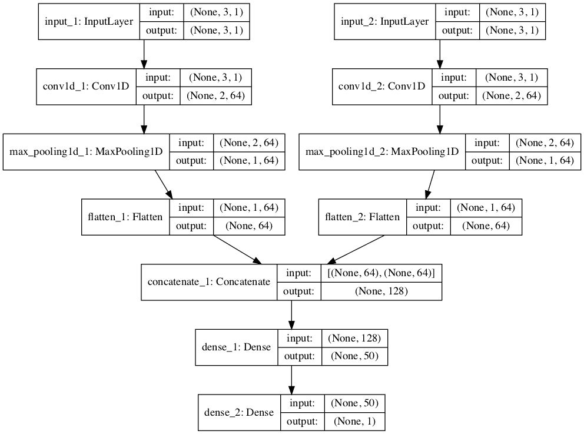
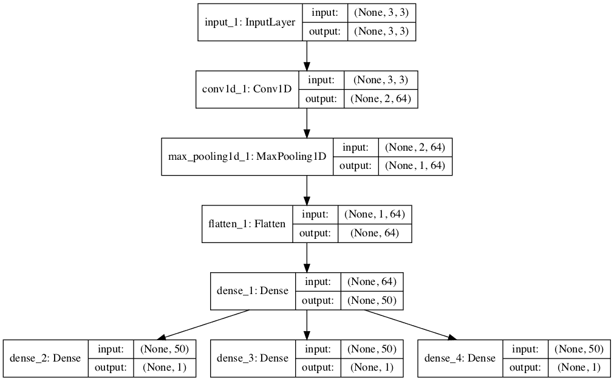

# 如何开发时间序列预测的卷积神经网络模型

> 原文： [https://machinelearningmastery.com/how-to-develop-convolutional-neural-network-models-for-time-series-forecasting/](https://machinelearningmastery.com/how-to-develop-convolutional-neural-network-models-for-time-series-forecasting/)

卷积神经网络模型（简称 CNN）可以应用于时间序列预测。

有许多类型的 CNN 模型可用于每种特定类型的时间序列预测问题。

在本教程中，您将了解如何针对一系列标准时间序列预测问题开发一套 CNN 模型。

本教程的目的是为每种类型的时间序列问题提供每个模型的独立示例，作为模板，您可以根据特定的时间序列预测问题进行复制和调整。

完成本教程后，您将了解：

*   如何开发 CNN 模型进行单变量时间序列预测。
*   如何开发 CNN 模型进行多元时间序列预测。
*   如何开发 CNN 模型进行多步时间序列预测。

这是一个庞大而重要的职位;您可能希望将其加入书签以供将来参考。

让我们开始吧。


如何开发用于时间序列预测的卷积神经网络模型
照片由[土地管理局](https://www.flickr.com/photos/blmoregon/35464087364/)，保留一些权利。

## 教程概述

在本教程中，我们将探讨如何为时间序列预测开发一套不同类型的 CNN 模型。

这些模型在小型设计的时间序列问题上进行了演示，旨在解决时间序列问题类型的风格。所选择的模型配置是任意的，并未针对每个问题进行优化;那不是目标。

本教程分为四个部分;他们是：

1.  单变量 CNN 模型
2.  多变量 CNN 模型
3.  多步 CNN 模型
4.  多变量多步 CNN 模型

## 单变量 CNN 模型

虽然传统上为二维图像数据开发，但 CNN 可用于模拟单变量时间序列预测问题。

单变量时间序列是由具有时间排序的单个观察序列组成的数据集，并且需要模型来从过去的一系列观察中学习以预测序列中的下一个值。

本节分为两部分;他们是：

1.  数据准备
2.  CNN 模型

### 数据准备

在对单变量系列进行建模之前，必须准备好它。

CNN 模型将学习将过去观察序列作为输入映射到输出观察的函数。因此，必须将观察序列转换为模型可以从中学习的多个示例。

考虑给定的单变量序列：

```py
[10, 20, 30, 40, 50, 60, 70, 80, 90]
```

我们可以将序列划分为多个称为样本的输入/输出模式，其中三个时间步长用作输入，一个时间步长用作正在学习的一步预测的输出。

```py
X,				y
10, 20, 30		40
20, 30, 40		50
30, 40, 50		60
...
```

下面的`split_sequence()`函数实现了这种行为，并将给定的单变量序列分成多个样本，其中每个样本具有指定的时间步长，输出是单个时间步长。

```py
# split a univariate sequence into samples
def split_sequence(sequence, n_steps):
	X, y = list(), list()
	for i in range(len(sequence)):
		# find the end of this pattern
		end_ix = i + n_steps
		# check if we are beyond the sequence
		if end_ix > len(sequence)-1:
			break
		# gather input and output parts of the pattern
		seq_x, seq_y = sequence[i:end_ix], sequence[end_ix]
		X.append(seq_x)
		y.append(seq_y)
	return array(X), array(y)
```

我们可以在上面的小型人为数据集上演示这个功能。

下面列出了完整的示例。

```py
# univariate data preparation
from numpy import array

# split a univariate sequence into samples
def split_sequence(sequence, n_steps):
	X, y = list(), list()
	for i in range(len(sequence)):
		# find the end of this pattern
		end_ix = i + n_steps
		# check if we are beyond the sequence
		if end_ix > len(sequence)-1:
			break
		# gather input and output parts of the pattern
		seq_x, seq_y = sequence[i:end_ix], sequence[end_ix]
		X.append(seq_x)
		y.append(seq_y)
	return array(X), array(y)

# define input sequence
raw_seq = [10, 20, 30, 40, 50, 60, 70, 80, 90]
# choose a number of time steps
n_steps = 3
# split into samples
X, y = split_sequence(raw_seq, n_steps)
# summarize the data
for i in range(len(X)):
	print(X[i], y[i])
```

运行该示例将单变量系列分成六个样本，其中每个样本具有三个输入时间步长和一个输出时间步长。

```py
[10 20 30] 40
[20 30 40] 50
[30 40 50] 60
[40 50 60] 70
[50 60 70] 80
[60 70 80] 90
```

现在我们知道如何准备一个单变量系列进行建模，让我们看看开发一个可以学习输入到输出映射的 CNN 模型。

### CNN 模型

一维 CNN 是 CNN 模型，其具有在 1D 序列上操作的卷积隐藏层。接下来可能在某些情况下可能是第二个卷积层，例如非常长的输入序列，然后是池化层，其作用是将卷积层的输出提取到最显着的元素。

卷积和汇集层之后是密集的完全连接层，其解释由模型的卷积部分提取的特征。在卷积层和密集层之间使用展平层以将特征映射减少为单个一维向量。

我们可以如下定义用于单变量时间序列预测的 1D CNN 模型。

```py
# define model
model = Sequential()
model.add(Conv1D(filters=64, kernel_size=2, activation='relu', input_shape=(n_steps, n_features)))
model.add(MaxPooling1D(pool_size=2))
model.add(Flatten())
model.add(Dense(50, activation='relu'))
model.add(Dense(1))
model.compile(optimizer='adam', loss='mse')
```

定义的关键是输入的形状;这就是模型期望的每个样本的输入，包括时间步数和特征数。

我们正在使用单变量系列，因此对于一个变量，要素的数量是一个。

输入的时间步数是我们在准备数据集时选择的数字，作为`split_sequence()`函数的参数。

每个样本的输入形状在第一个隐藏层定义的`input_shape`参数中指定。

我们几乎总是有多个样本，因此，模型将期望训练数据的输入组件具有尺寸或形状：

```py
[samples, timesteps, features]
```

我们在前一节中的`split_sequence()`函数输出具有[_ 样本，时间步长 _]形状​​的 X，因此我们可以轻松地对其进行整形，以便为一个特征提供额外的维度。

```py
# reshape from [samples, timesteps] into [samples, timesteps, features]
n_features = 1
X = X.reshape((X.shape[0], X.shape[1], n_features))
```

CNN 实际上并不将数据视为具有时间步长，而是将其视为可以执行卷积读取操作的序列，如一维图像。

在这个例子中，我们定义了一个带有 64 个滤波器映射和 2 的内核大小的卷积层。然后是最大池层和密集层来解释输入特征。指定输出层以预测单个数值。

使用随机梯度下降的有效 [Adam 版本拟合该模型，并使用均方误差或'`mse`'，损失函数进行优化。](https://machinelearningmastery.com/adam-optimization-algorithm-for-deep-learning/)

定义模型后，我们可以将其放在训练数据集上。

```py
# fit model
model.fit(X, y, epochs=1000, verbose=0)
```

在模型拟合后，我们可以使用它来进行预测。

我们可以通过提供输入来预测序列中的下一个值：

```py
[70, 80, 90]
```

并期望模型预测如下：

```py
[100]
```

该模型期望输入形状为[_ 样本，时间步长，特征 _]三维，因此，我们必须在进行预测之前对单个输入样本进行整形。

```py
# demonstrate prediction
x_input = array([70, 80, 90])
x_input = x_input.reshape((1, n_steps, n_features))
yhat = model.predict(x_input, verbose=0)
```

我们可以将所有这些结合在一起并演示如何开发单变量时间序列预测的 1D CNN 模型并进行单一预测。

```py
# univariate cnn example
from numpy import array
from keras.models import Sequential
from keras.layers import Dense
from keras.layers import Flatten
from keras.layers.convolutional import Conv1D
from keras.layers.convolutional import MaxPooling1D

# split a univariate sequence into samples
def split_sequence(sequence, n_steps):
	X, y = list(), list()
	for i in range(len(sequence)):
		# find the end of this pattern
		end_ix = i + n_steps
		# check if we are beyond the sequence
		if end_ix > len(sequence)-1:
			break
		# gather input and output parts of the pattern
		seq_x, seq_y = sequence[i:end_ix], sequence[end_ix]
		X.append(seq_x)
		y.append(seq_y)
	return array(X), array(y)

# define input sequence
raw_seq = [10, 20, 30, 40, 50, 60, 70, 80, 90]
# choose a number of time steps
n_steps = 3
# split into samples
X, y = split_sequence(raw_seq, n_steps)
# reshape from [samples, timesteps] into [samples, timesteps, features]
n_features = 1
X = X.reshape((X.shape[0], X.shape[1], n_features))
# define model
model = Sequential()
model.add(Conv1D(filters=64, kernel_size=2, activation='relu', input_shape=(n_steps, n_features)))
model.add(MaxPooling1D(pool_size=2))
model.add(Flatten())
model.add(Dense(50, activation='relu'))
model.add(Dense(1))
model.compile(optimizer='adam', loss='mse')
# fit model
model.fit(X, y, epochs=1000, verbose=0)
# demonstrate prediction
x_input = array([70, 80, 90])
x_input = x_input.reshape((1, n_steps, n_features))
yhat = model.predict(x_input, verbose=0)
print(yhat)
```

运行该示例准备数据，拟合模型并进行预测。

鉴于算法的随机性，您的结果可能会有所不同;尝试运行几次这个例子。

我们可以看到模型预测序列中的下一个值。

```py
[[101.67965]]
```

## 多变量 CNN 模型

多变量时间序列数据是指每个时间步长有多个观察值的数据。

对于多变量时间序列数据，我们可能需要两种主要模型;他们是：

1.  多输入系列。
2.  多个并联系列。

让我们依次看看每一个。

### 多输入系列

问题可能有两个或更多并行输入时间序列和输出时间序列，这取决于输入时间序列。

输入时间序列是平行的，因为每个系列都在同一时间步骤中进行观察。

我们可以通过两个并行输入时间序列的简单示例来演示这一点，其中输出序列是输入序列的简单添加。

```py
# define input sequence
in_seq1 = array([10, 20, 30, 40, 50, 60, 70, 80, 90])
in_seq2 = array([15, 25, 35, 45, 55, 65, 75, 85, 95])
out_seq = array([in_seq1[i]+in_seq2[i] for i in range(len(in_seq1))])
```

我们可以将这三个数据数组重新整形为单个数据集，其中每一行都是一个时间步，每列是一个单独的时间序列。

这是将并行时间序列存储在 CSV 文件中的标准方法。

```py
# convert to [rows, columns] structure
in_seq1 = in_seq1.reshape((len(in_seq1), 1))
in_seq2 = in_seq2.reshape((len(in_seq2), 1))
out_seq = out_seq.reshape((len(out_seq), 1))
# horizontally stack columns
dataset = hstack((in_seq1, in_seq2, out_seq))
```

下面列出了完整的示例。

```py
# multivariate data preparation
from numpy import array
from numpy import hstack
# define input sequence
in_seq1 = array([10, 20, 30, 40, 50, 60, 70, 80, 90])
in_seq2 = array([15, 25, 35, 45, 55, 65, 75, 85, 95])
out_seq = array([in_seq1[i]+in_seq2[i] for i in range(len(in_seq1))])
# convert to [rows, columns] structure
in_seq1 = in_seq1.reshape((len(in_seq1), 1))
in_seq2 = in_seq2.reshape((len(in_seq2), 1))
out_seq = out_seq.reshape((len(out_seq), 1))
# horizontally stack columns
dataset = hstack((in_seq1, in_seq2, out_seq))
print(dataset)
```

运行该示例将打印数据集，每个时间步长为一行，两个输入和一个输出并行时间序列分别为一列。

```py
[[ 10  15  25]
 [ 20  25  45]
 [ 30  35  65]
 [ 40  45  85]
 [ 50  55 105]
 [ 60  65 125]
 [ 70  75 145]
 [ 80  85 165]
 [ 90  95 185]]
```

与单变量时间序列一样，我们必须将这些数据组织成具有输入和输出样本的样本。

1D CNN 模型需要足够的上下文来学习从输入序列到输出值的映射。 CNN 可以支持并行输入时间序列作为单独的通道，如图像的红色，绿色和蓝色分量。因此，我们需要将数据分成样本，保持两个输入序列的观察顺序。

如果我们选择三个输入时间步长，那么第一个样本将如下所示：

输入：

```py
10, 15
20, 25
30, 35
```

输出：

```py
65
```

也就是说，每个并行系列的前三个时间步长被提供作为模型的输入，并且模型将其与第三时间步骤（在这种情况下为 65）的输出系列中的值相关联。

我们可以看到，在将时间序列转换为输入/输出样本以训练模型时，我们将不得不从输出时间序列中丢弃一些值，其中我们在先前时间步骤中没有输入时间序列中的值。反过来，选择输入时间步数的大小将对使用多少训练数据产生重要影响。

我们可以定义一个名为`split_sequences()`的函数，该函数将采用数据集，因为我们已经为时间步长和行定义了并行序列和返回输入/输出样本的列。

```py
# split a multivariate sequence into samples
def split_sequences(sequences, n_steps):
	X, y = list(), list()
	for i in range(len(sequences)):
		# find the end of this pattern
		end_ix = i + n_steps
		# check if we are beyond the dataset
		if end_ix > len(sequences):
			break
		# gather input and output parts of the pattern
		seq_x, seq_y = sequences[i:end_ix, :-1], sequences[end_ix-1, -1]
		X.append(seq_x)
		y.append(seq_y)
	return array(X), array(y)
```

我们可以使用每个输入时间序列的三个时间步长作为输入在我们的数据集上测试此函数。

下面列出了完整的示例。

```py
# multivariate data preparation
from numpy import array
from numpy import hstack

# split a multivariate sequence into samples
def split_sequences(sequences, n_steps):
	X, y = list(), list()
	for i in range(len(sequences)):
		# find the end of this pattern
		end_ix = i + n_steps
		# check if we are beyond the dataset
		if end_ix > len(sequences):
			break
		# gather input and output parts of the pattern
		seq_x, seq_y = sequences[i:end_ix, :-1], sequences[end_ix-1, -1]
		X.append(seq_x)
		y.append(seq_y)
	return array(X), array(y)

# define input sequence
in_seq1 = array([10, 20, 30, 40, 50, 60, 70, 80, 90])
in_seq2 = array([15, 25, 35, 45, 55, 65, 75, 85, 95])
out_seq = array([in_seq1[i]+in_seq2[i] for i in range(len(in_seq1))])
# convert to [rows, columns] structure
in_seq1 = in_seq1.reshape((len(in_seq1), 1))
in_seq2 = in_seq2.reshape((len(in_seq2), 1))
out_seq = out_seq.reshape((len(out_seq), 1))
# horizontally stack columns
dataset = hstack((in_seq1, in_seq2, out_seq))
# choose a number of time steps
n_steps = 3
# convert into input/output
X, y = split_sequences(dataset, n_steps)
print(X.shape, y.shape)
# summarize the data
for i in range(len(X)):
	print(X[i], y[i])
```

首先运行该示例打印`X`和`y`组件的形状。

我们可以看到`X`组件具有三维结构。

第一个维度是样本数，在本例中为 7.第二个维度是每个样本的时间步数，在这种情况下为 3，即为函数指定的值。最后，最后一个维度指定并行时间序列的数量或变量的数量，在这种情况下，两个并行序列为 2。

这是 1D CNN 作为输入所期望的精确三维结构。数据即可使用而无需进一步重塑。

然后我们可以看到每个样本的输入和输出都被打印出来，显示了两个输入序列中每个样本的三个时间步长以及每个样本的相关输出。

```py
(7, 3, 2) (7,)

[[10 15]
 [20 25]
 [30 35]] 65
[[20 25]
 [30 35]
 [40 45]] 85
[[30 35]
 [40 45]
 [50 55]] 105
[[40 45]
 [50 55]
 [60 65]] 125
[[50 55]
 [60 65]
 [70 75]] 145
[[60 65]
 [70 75]
 [80 85]] 165
[[70 75]
 [80 85]
 [90 95]] 185
```

我们现在准备在这个数据上安装一维 CNN 模型，指定每个输入样本的预期时间步长和特征数，在这种情况下分别为 3 和 2。

```py
# define model
model = Sequential()
model.add(Conv1D(filters=64, kernel_size=2, activation='relu', input_shape=(n_steps, n_features)))
model.add(MaxPooling1D(pool_size=2))
model.add(Flatten())
model.add(Dense(50, activation='relu'))
model.add(Dense(1))
model.compile(optimizer='adam', loss='mse')
```

在进行预测时，模型需要两个输入时间序列的三个时间步长。

我们可以预测输出系列中的下一个值，提供以下输入值：

```py
80,	 85
90,	 95
100, 105
```

具有三个时间步长和两个变量的一个样本的形状必须是[1,3,2]。

我们希望序列中的下一个值为 100 + 105 或 205。

```py
# demonstrate prediction
x_input = array([[80, 85], [90, 95], [100, 105]])
x_input = x_input.reshape((1, n_steps, n_features))
yhat = model.predict(x_input, verbose=0)
```

下面列出了完整的示例。

```py
# multivariate cnn example
from numpy import array
from numpy import hstack
from keras.models import Sequential
from keras.layers import Dense
from keras.layers import Flatten
from keras.layers.convolutional import Conv1D
from keras.layers.convolutional import MaxPooling1D

# split a multivariate sequence into samples
def split_sequences(sequences, n_steps):
	X, y = list(), list()
	for i in range(len(sequences)):
		# find the end of this pattern
		end_ix = i + n_steps
		# check if we are beyond the dataset
		if end_ix > len(sequences):
			break
		# gather input and output parts of the pattern
		seq_x, seq_y = sequences[i:end_ix, :-1], sequences[end_ix-1, -1]
		X.append(seq_x)
		y.append(seq_y)
	return array(X), array(y)

# define input sequence
in_seq1 = array([10, 20, 30, 40, 50, 60, 70, 80, 90])
in_seq2 = array([15, 25, 35, 45, 55, 65, 75, 85, 95])
out_seq = array([in_seq1[i]+in_seq2[i] for i in range(len(in_seq1))])
# convert to [rows, columns] structure
in_seq1 = in_seq1.reshape((len(in_seq1), 1))
in_seq2 = in_seq2.reshape((len(in_seq2), 1))
out_seq = out_seq.reshape((len(out_seq), 1))
# horizontally stack columns
dataset = hstack((in_seq1, in_seq2, out_seq))
# choose a number of time steps
n_steps = 3
# convert into input/output
X, y = split_sequences(dataset, n_steps)
# the dataset knows the number of features, e.g. 2
n_features = X.shape[2]
# define model
model = Sequential()
model.add(Conv1D(filters=64, kernel_size=2, activation='relu', input_shape=(n_steps, n_features)))
model.add(MaxPooling1D(pool_size=2))
model.add(Flatten())
model.add(Dense(50, activation='relu'))
model.add(Dense(1))
model.compile(optimizer='adam', loss='mse')
# fit model
model.fit(X, y, epochs=1000, verbose=0)
# demonstrate prediction
x_input = array([[80, 85], [90, 95], [100, 105]])
x_input = x_input.reshape((1, n_steps, n_features))
yhat = model.predict(x_input, verbose=0)
print(yhat)
```

运行该示例准备数据，拟合模型并进行预测。

```py
[[206.0161]]
```

还有另一种更精细的方法来模拟问题。

每个输入序列可以由单独的 CNN 处理，并且可以在对输出序列进行预测之前组合这些子模型中的每一个的输出。

我们可以将其称为多头 CNN 模型。根据正在建模的问题的具体情况，它可以提供更大的灵活性或更好的表现。例如，它允许您为每个输入系列配置不同的子模型，例如过滤器映射的数量和内核大小。

可以使用 [Keras 功能 API](https://machinelearningmastery.com/keras-functional-api-deep-learning/) 在 Keras 中定义此类型的模型。

首先，我们可以将第一个输入模型定义为 1D CNN，其输入层需要具有`n_steps`和 1 个特征的向量。

```py
# first input model
visible1 = Input(shape=(n_steps, n_features))
cnn1 = Conv1D(filters=64, kernel_size=2, activation='relu')(visible1)
cnn1 = MaxPooling1D(pool_size=2)(cnn1)
cnn1 = Flatten()(cnn1)
```

我们可以以相同的方式定义第二个输入子模型。

```py
# second input model
visible2 = Input(shape=(n_steps, n_features))
cnn2 = Conv1D(filters=64, kernel_size=2, activation='relu')(visible2)
cnn2 = MaxPooling1D(pool_size=2)(cnn2)
cnn2 = Flatten()(cnn2)
```

现在已经定义了两个输入子模型，我们可以将每个模型的输出合并为一个长向量，可以在对输出序列进行预测之前对其进行解释。

```py
# merge input models
merge = concatenate([cnn1, cnn2])
dense = Dense(50, activation='relu')(merge)
output = Dense(1)(dense)
```

然后我们可以将输入和输出联系在一起。

```py
model = Model(inputs=[visible1, visible2], outputs=output)
```

下图提供了该模型外观的示意图，包括每层输入和输出的形状。



多头 1D CNN 在多元时间序列预测中的应用

此模型要求输入作为两个元素的列表提供，其中列表中的每个元素包含一个子模型的数据。

为了实现这一点，我们可以将 3D 输入数据分成两个独立的输入数据阵列;这是从一个形状为[7,3,2]的数组到两个 3D 数组[7,3,1]

```py
# one time series per head
n_features = 1
# separate input data
X1 = X[:, :, 0].reshape(X.shape[0], X.shape[1], n_features)
X2 = X[:, :, 1].reshape(X.shape[0], X.shape[1], n_features)
```

然后可以提供这些数据以适合模型。

```py
# fit model
model.fit([X1, X2], y, epochs=1000, verbose=0)
```

类似地，我们必须在进行单个一步预测时将单个样本的数据准备为两个单独的二维数组。

```py
x_input = array([[80, 85], [90, 95], [100, 105]])
x1 = x_input[:, 0].reshape((1, n_steps, n_features))
x2 = x_input[:, 1].reshape((1, n_steps, n_features))
```

我们可以将所有这些结合在一起;下面列出了完整的示例。

```py
# multivariate multi-headed 1d cnn example
from numpy import array
from numpy import hstack
from keras.models import Model
from keras.layers import Input
from keras.layers import Dense
from keras.layers import Flatten
from keras.layers.convolutional import Conv1D
from keras.layers.convolutional import MaxPooling1D
from keras.layers.merge import concatenate

# split a multivariate sequence into samples
def split_sequences(sequences, n_steps):
	X, y = list(), list()
	for i in range(len(sequences)):
		# find the end of this pattern
		end_ix = i + n_steps
		# check if we are beyond the dataset
		if end_ix > len(sequences):
			break
		# gather input and output parts of the pattern
		seq_x, seq_y = sequences[i:end_ix, :-1], sequences[end_ix-1, -1]
		X.append(seq_x)
		y.append(seq_y)
	return array(X), array(y)

# define input sequence
in_seq1 = array([10, 20, 30, 40, 50, 60, 70, 80, 90])
in_seq2 = array([15, 25, 35, 45, 55, 65, 75, 85, 95])
out_seq = array([in_seq1[i]+in_seq2[i] for i in range(len(in_seq1))])
# convert to [rows, columns] structure
in_seq1 = in_seq1.reshape((len(in_seq1), 1))
in_seq2 = in_seq2.reshape((len(in_seq2), 1))
out_seq = out_seq.reshape((len(out_seq), 1))
# horizontally stack columns
dataset = hstack((in_seq1, in_seq2, out_seq))
# choose a number of time steps
n_steps = 3
# convert into input/output
X, y = split_sequences(dataset, n_steps)
# one time series per head
n_features = 1
# separate input data
X1 = X[:, :, 0].reshape(X.shape[0], X.shape[1], n_features)
X2 = X[:, :, 1].reshape(X.shape[0], X.shape[1], n_features)
# first input model
visible1 = Input(shape=(n_steps, n_features))
cnn1 = Conv1D(filters=64, kernel_size=2, activation='relu')(visible1)
cnn1 = MaxPooling1D(pool_size=2)(cnn1)
cnn1 = Flatten()(cnn1)
# second input model
visible2 = Input(shape=(n_steps, n_features))
cnn2 = Conv1D(filters=64, kernel_size=2, activation='relu')(visible2)
cnn2 = MaxPooling1D(pool_size=2)(cnn2)
cnn2 = Flatten()(cnn2)
# merge input models
merge = concatenate([cnn1, cnn2])
dense = Dense(50, activation='relu')(merge)
output = Dense(1)(dense)
model = Model(inputs=[visible1, visible2], outputs=output)
model.compile(optimizer='adam', loss='mse')
# fit model
model.fit([X1, X2], y, epochs=1000, verbose=0)
# demonstrate prediction
x_input = array([[80, 85], [90, 95], [100, 105]])
x1 = x_input[:, 0].reshape((1, n_steps, n_features))
x2 = x_input[:, 1].reshape((1, n_steps, n_features))
yhat = model.predict([x1, x2], verbose=0)
print(yhat)
```

运行该示例准备数据，拟合模型并进行预测。

```py
[[205.871]]
```

### 多个并联系列

另一个时间序列问题是存在多个并行时间序列并且必须为每个时间序列预测值的情况。

例如，给定上一节的数据：

```py
[[ 10  15  25]
 [ 20  25  45]
 [ 30  35  65]
 [ 40  45  85]
 [ 50  55 105]
 [ 60  65 125]
 [ 70  75 145]
 [ 80  85 165]
 [ 90  95 185]]
```

我们可能想要预测下一个时间步的三个时间序列中的每一个的值。

这可以称为多变量预测。

同样，必须将数据分成输入/输出样本以训练模型。

该数据集的第一个示例是：

输入：

```py
10, 15, 25
20, 25, 45
30, 35, 65
```

输出：

```py
40, 45, 85
```

下面的`split_sequences()`函数将分割多个并行时间序列，其中时间步长为行，每列一个系列为所需的输入/输出形状。

```py
# split a multivariate sequence into samples
def split_sequences(sequences, n_steps):
	X, y = list(), list()
	for i in range(len(sequences)):
		# find the end of this pattern
		end_ix = i + n_steps
		# check if we are beyond the dataset
		if end_ix > len(sequences)-1:
			break
		# gather input and output parts of the pattern
		seq_x, seq_y = sequences[i:end_ix, :], sequences[end_ix, :]
		X.append(seq_x)
		y.append(seq_y)
	return array(X), array(y)
```

我们可以在人为的问题上证明这一点;下面列出了完整的示例。

```py
# multivariate output data prep
from numpy import array
from numpy import hstack

# split a multivariate sequence into samples
def split_sequences(sequences, n_steps):
	X, y = list(), list()
	for i in range(len(sequences)):
		# find the end of this pattern
		end_ix = i + n_steps
		# check if we are beyond the dataset
		if end_ix > len(sequences)-1:
			break
		# gather input and output parts of the pattern
		seq_x, seq_y = sequences[i:end_ix, :], sequences[end_ix, :]
		X.append(seq_x)
		y.append(seq_y)
	return array(X), array(y)

# define input sequence
in_seq1 = array([10, 20, 30, 40, 50, 60, 70, 80, 90])
in_seq2 = array([15, 25, 35, 45, 55, 65, 75, 85, 95])
out_seq = array([in_seq1[i]+in_seq2[i] for i in range(len(in_seq1))])
# convert to [rows, columns] structure
in_seq1 = in_seq1.reshape((len(in_seq1), 1))
in_seq2 = in_seq2.reshape((len(in_seq2), 1))
out_seq = out_seq.reshape((len(out_seq), 1))
# horizontally stack columns
dataset = hstack((in_seq1, in_seq2, out_seq))
# choose a number of time steps
n_steps = 3
# convert into input/output
X, y = split_sequences(dataset, n_steps)
print(X.shape, y.shape)
# summarize the data
for i in range(len(X)):
	print(X[i], y[i])
```

首先运行该示例打印准备好的 X 和 y 组件的形状。

X 的形状是三维的，包括样品的数量（6），每个样品选择的时间步数（3），以及平行时间序列或特征的数量（3）。

y 的形状是二维的，正如我们可能期望的样本数量（6）和每个样本的时间变量数量（3）。

该数据已准备好在 1D CNN 模型中使用，该模型期望每个样本的 X 和 y 分量具有三维输入和二维输出形状。

然后，打印每个样本，显示每个样本的输入和输出分量。

```py
(6, 3, 3) (6, 3)

[[10 15 25]
 [20 25 45]
 [30 35 65]] [40 45 85]
[[20 25 45]
 [30 35 65]
 [40 45 85]] [ 50  55 105]
[[ 30  35  65]
 [ 40  45  85]
 [ 50  55 105]] [ 60  65 125]
[[ 40  45  85]
 [ 50  55 105]
 [ 60  65 125]] [ 70  75 145]
[[ 50  55 105]
 [ 60  65 125]
 [ 70  75 145]] [ 80  85 165]
[[ 60  65 125]
 [ 70  75 145]
 [ 80  85 165]] [ 90  95 185]
```

我们现在准备在这些数据上安装一维 CNN 模型。

在此模型中，通过`input_shape`参数为输入层指定时间步数和并行系列（特征）。

并行序列的数量也用于指定输出层中模型预测的值的数量;再次，这是三个。

```py
# define model
model = Sequential()
model.add(Conv1D(filters=64, kernel_size=2, activation='relu', input_shape=(n_steps, n_features)))
model.add(MaxPooling1D(pool_size=2))
model.add(Flatten())
model.add(Dense(50, activation='relu'))
model.add(Dense(n_features))
model.compile(optimizer='adam', loss='mse')
```

我们可以通过为每个系列提供三个时间步长的输入来预测三个并行系列中的每一个的下一个值。

```py
70, 75, 145
80, 85, 165
90, 95, 185
```

用于进行单个预测的输入的形状必须是 1 个样本，3 个时间步长和 3 个特征，或者[1,3,3]。

```py
# demonstrate prediction
x_input = array([[70,75,145], [80,85,165], [90,95,185]])
x_input = x_input.reshape((1, n_steps, n_features))
yhat = model.predict(x_input, verbose=0)
```

我们希望向量输出为：

```py
[100, 105, 205]
```

我们可以将所有这些结合在一起并演示下面的多变量输出时间序列预测的 1D CNN。

```py
# multivariate output 1d cnn example
from numpy import array
from numpy import hstack
from keras.models import Sequential
from keras.layers import Dense
from keras.layers import Flatten
from keras.layers.convolutional import Conv1D
from keras.layers.convolutional import MaxPooling1D

# split a multivariate sequence into samples
def split_sequences(sequences, n_steps):
	X, y = list(), list()
	for i in range(len(sequences)):
		# find the end of this pattern
		end_ix = i + n_steps
		# check if we are beyond the dataset
		if end_ix > len(sequences)-1:
			break
		# gather input and output parts of the pattern
		seq_x, seq_y = sequences[i:end_ix, :], sequences[end_ix, :]
		X.append(seq_x)
		y.append(seq_y)
	return array(X), array(y)

# define input sequence
in_seq1 = array([10, 20, 30, 40, 50, 60, 70, 80, 90])
in_seq2 = array([15, 25, 35, 45, 55, 65, 75, 85, 95])
out_seq = array([in_seq1[i]+in_seq2[i] for i in range(len(in_seq1))])
# convert to [rows, columns] structure
in_seq1 = in_seq1.reshape((len(in_seq1), 1))
in_seq2 = in_seq2.reshape((len(in_seq2), 1))
out_seq = out_seq.reshape((len(out_seq), 1))
# horizontally stack columns
dataset = hstack((in_seq1, in_seq2, out_seq))
# choose a number of time steps
n_steps = 3
# convert into input/output
X, y = split_sequences(dataset, n_steps)
# the dataset knows the number of features, e.g. 2
n_features = X.shape[2]
# define model
model = Sequential()
model.add(Conv1D(filters=64, kernel_size=2, activation='relu', input_shape=(n_steps, n_features)))
model.add(MaxPooling1D(pool_size=2))
model.add(Flatten())
model.add(Dense(50, activation='relu'))
model.add(Dense(n_features))
model.compile(optimizer='adam', loss='mse')
# fit model
model.fit(X, y, epochs=3000, verbose=0)
# demonstrate prediction
x_input = array([[70,75,145], [80,85,165], [90,95,185]])
x_input = x_input.reshape((1, n_steps, n_features))
yhat = model.predict(x_input, verbose=0)
print(yhat)
```

运行该示例准备数据，拟合模型并进行预测。

```py
[[100.11272 105.32213 205.53436]]
```

与多输入系列一样，还有另一种更精细的方法来模拟问题。

每个输出系列可以由单独的输出 CNN 模型处理。

我们可以将其称为多输出 CNN 模型。根据正在建模的问题的具体情况，它可以提供更大的灵活性或更好的表现。

可以使用 [Keras 功能 API](https://machinelearningmastery.com/keras-functional-api-deep-learning/) 在 Keras 中定义此类型的模型。

首先，我们可以将第一个输入模型定义为 1D CNN 模型。

```py
# define model
visible = Input(shape=(n_steps, n_features))
cnn = Conv1D(filters=64, kernel_size=2, activation='relu')(visible)
cnn = MaxPooling1D(pool_size=2)(cnn)
cnn = Flatten()(cnn)
cnn = Dense(50, activation='relu')(cnn)
```

然后，我们可以为我们希望预测的三个系列中的每一个定义一个输出层，其中每个输出子模型将预测单个时间步长。

```py
# define output 1
output1 = Dense(1)(cnn)
# define output 2
output2 = Dense(1)(cnn)
# define output 3
output3 = Dense(1)(cnn)
```

然后，我们可以将输入和输出层组合到一个模型中。

```py
# tie together
model = Model(inputs=visible, outputs=[output1, output2, output3])
model.compile(optimizer='adam', loss='mse')
```

为了使模型架构清晰，下面的示意图清楚地显示了模型的三个独立输出层以及每个层的输入和输出形状。



多输出 1D CNN 用于多元时间序列预测的图

在训练模型时，每个样本需要三个独立的输出阵列。我们可以通过将具有形状[7,3]的输出训练数据转换为具有形状[7,1]的三个阵列来实现这一点。

```py
# separate output
y1 = y[:, 0].reshape((y.shape[0], 1))
y2 = y[:, 1].reshape((y.shape[0], 1))
y3 = y[:, 2].reshape((y.shape[0], 1))
```

可以在训练期间将这些阵列提供给模型。

```py
# fit model
model.fit(X, [y1,y2,y3], epochs=2000, verbose=0)
```

将所有这些结合在一起，下面列出了完整的示例。

```py
# multivariate output 1d cnn example
from numpy import array
from numpy import hstack
from keras.models import Model
from keras.layers import Input
from keras.layers import Dense
from keras.layers import Flatten
from keras.layers.convolutional import Conv1D
from keras.layers.convolutional import MaxPooling1D

# split a multivariate sequence into samples
def split_sequences(sequences, n_steps):
	X, y = list(), list()
	for i in range(len(sequences)):
		# find the end of this pattern
		end_ix = i + n_steps
		# check if we are beyond the dataset
		if end_ix > len(sequences)-1:
			break
		# gather input and output parts of the pattern
		seq_x, seq_y = sequences[i:end_ix, :], sequences[end_ix, :]
		X.append(seq_x)
		y.append(seq_y)
	return array(X), array(y)

# define input sequence
in_seq1 = array([10, 20, 30, 40, 50, 60, 70, 80, 90])
in_seq2 = array([15, 25, 35, 45, 55, 65, 75, 85, 95])
out_seq = array([in_seq1[i]+in_seq2[i] for i in range(len(in_seq1))])
# convert to [rows, columns] structure
in_seq1 = in_seq1.reshape((len(in_seq1), 1))
in_seq2 = in_seq2.reshape((len(in_seq2), 1))
out_seq = out_seq.reshape((len(out_seq), 1))
# horizontally stack columns
dataset = hstack((in_seq1, in_seq2, out_seq))
# choose a number of time steps
n_steps = 3
# convert into input/output
X, y = split_sequences(dataset, n_steps)
# the dataset knows the number of features, e.g. 2
n_features = X.shape[2]
# separate output
y1 = y[:, 0].reshape((y.shape[0], 1))
y2 = y[:, 1].reshape((y.shape[0], 1))
y3 = y[:, 2].reshape((y.shape[0], 1))
# define model
visible = Input(shape=(n_steps, n_features))
cnn = Conv1D(filters=64, kernel_size=2, activation='relu')(visible)
cnn = MaxPooling1D(pool_size=2)(cnn)
cnn = Flatten()(cnn)
cnn = Dense(50, activation='relu')(cnn)
# define output 1
output1 = Dense(1)(cnn)
# define output 2
output2 = Dense(1)(cnn)
# define output 3
output3 = Dense(1)(cnn)
# tie together
model = Model(inputs=visible, outputs=[output1, output2, output3])
model.compile(optimizer='adam', loss='mse')
# fit model
model.fit(X, [y1,y2,y3], epochs=2000, verbose=0)
# demonstrate prediction
x_input = array([[70,75,145], [80,85,165], [90,95,185]])
x_input = x_input.reshape((1, n_steps, n_features))
yhat = model.predict(x_input, verbose=0)
print(yhat)
```

运行该示例准备数据，拟合模型并进行预测。

```py
[array([[100.96118]], dtype=float32),
 array([[105.502686]], dtype=float32),
 array([[205.98045]], dtype=float32)]
```

## 多步 CNN 模型

在实践中，1D CNN 模型在预测表示不同输出变量的向量输出（如在前面的示例中）或者表示一个变量的多个时间步长的向量输出方面几乎没有差别。

然而，训练数据的编制方式存在细微而重要的差异。在本节中，我们将演示使用向量模型开发多步预测模型的情况。

在我们查看模型的细节之前，让我们首先看一下多步预测的数据准备。

### 数据准备

与一步预测一样，用于多步时间序列预测的时间序列必须分为带有输入和输出组件的样本。

输入和输出组件都将包含多个时间步长，并且可以具有或不具有相同数量的步骤。

例如，给定单变量时间序列：

```py
[10, 20, 30, 40, 50, 60, 70, 80, 90]
```

我们可以使用最后三个时间步作为输入并预测接下来的两个时间步。

第一个样本如下：

输入：

```py
[10, 20, 30]
```

输出：

```py
[40, 50]
```

下面的`split_sequence()`函数实现了这种行为，并将给定的单变量时间序列分割为具有指定数量的输入和输出时间步长的样本。

```py
# split a univariate sequence into samples
def split_sequence(sequence, n_steps_in, n_steps_out):
	X, y = list(), list()
	for i in range(len(sequence)):
		# find the end of this pattern
		end_ix = i + n_steps_in
		out_end_ix = end_ix + n_steps_out
		# check if we are beyond the sequence
		if out_end_ix > len(sequence):
			break
		# gather input and output parts of the pattern
		seq_x, seq_y = sequence[i:end_ix], sequence[end_ix:out_end_ix]
		X.append(seq_x)
		y.append(seq_y)
	return array(X), array(y)
```

我们可以在小型设计数据集上演示此功能。

下面列出了完整的示例。

```py
# multi-step data preparation
from numpy import array

# split a univariate sequence into samples
def split_sequence(sequence, n_steps_in, n_steps_out):
	X, y = list(), list()
	for i in range(len(sequence)):
		# find the end of this pattern
		end_ix = i + n_steps_in
		out_end_ix = end_ix + n_steps_out
		# check if we are beyond the sequence
		if out_end_ix > len(sequence):
			break
		# gather input and output parts of the pattern
		seq_x, seq_y = sequence[i:end_ix], sequence[end_ix:out_end_ix]
		X.append(seq_x)
		y.append(seq_y)
	return array(X), array(y)

# define input sequence
raw_seq = [10, 20, 30, 40, 50, 60, 70, 80, 90]
# choose a number of time steps
n_steps_in, n_steps_out = 3, 2
# split into samples
X, y = split_sequence(raw_seq, n_steps_in, n_steps_out)
# summarize the data
for i in range(len(X)):
	print(X[i], y[i])
```

运行该示例将单变量系列拆分为输入和输出时间步骤，并打印每个系列的输入和输出组件。

```py
[10 20 30] [40 50]
[20 30 40] [50 60]
[30 40 50] [60 70]
[40 50 60] [70 80]
[50 60 70] [80 90]
```

既然我们知道如何为多步预测准备数据，那么让我们看一下可以学习这种映射的一维 CNN 模型。

### 向量输出模型

1D CNN 可以直接输出向量，可以解释为多步预测。

在前一节中看到这种方法是每个输出时间序列的一个时间步骤被预测为向量。

与前一节中单变量数据的 1D CNN 模型一样，必须首先对准备好的样本进行重新整形。 CNN 希望数据具有[_ 样本，时间步长，特征 _]的三维结构，在这种情况下，我们只有一个特征，因此重塑是直截了当的。

```py
# reshape from [samples, timesteps] into [samples, timesteps, features]
n_features = 1
X = X.reshape((X.shape[0], X.shape[1], n_features))
```

通过`n_steps_in`和`n_steps_out`变量中指定的输入和输出步数，我们可以定义一个多步骤时间序列预测模型。

```py
# define model
model = Sequential()
model.add(Conv1D(filters=64, kernel_size=2, activation='relu', input_shape=(n_steps_in, n_features)))
model.add(MaxPooling1D(pool_size=2))
model.add(Flatten())
model.add(Dense(50, activation='relu'))
model.add(Dense(n_steps_out))
model.compile(optimizer='adam', loss='mse')
```

该模型可以对单个样本进行预测。我们可以通过提供输入来预测数据集末尾之后的下两个步骤：

```py
[70, 80, 90]
```

我们希望预测的输出为：

```py
[100, 110]
```

正如模型所预期的那样，进行预测时输入数据的单个样本的形状对于 1 个样本，输入的 3 个时间步长和单个特征必须是[1,3,1]。

```py
# demonstrate prediction
x_input = array([70, 80, 90])
x_input = x_input.reshape((1, n_steps_in, n_features))
yhat = model.predict(x_input, verbose=0)
```

将所有这些结合在一起，下面列出了具有单变量时间序列的 1D CNN 用于多步预测。

```py
# univariate multi-step vector-output 1d cnn example
from numpy import array
from keras.models import Sequential
from keras.layers import Dense
from keras.layers import Flatten
from keras.layers.convolutional import Conv1D
from keras.layers.convolutional import MaxPooling1D

# split a univariate sequence into samples
def split_sequence(sequence, n_steps_in, n_steps_out):
	X, y = list(), list()
	for i in range(len(sequence)):
		# find the end of this pattern
		end_ix = i + n_steps_in
		out_end_ix = end_ix + n_steps_out
		# check if we are beyond the sequence
		if out_end_ix > len(sequence):
			break
		# gather input and output parts of the pattern
		seq_x, seq_y = sequence[i:end_ix], sequence[end_ix:out_end_ix]
		X.append(seq_x)
		y.append(seq_y)
	return array(X), array(y)

# define input sequence
raw_seq = [10, 20, 30, 40, 50, 60, 70, 80, 90]
# choose a number of time steps
n_steps_in, n_steps_out = 3, 2
# split into samples
X, y = split_sequence(raw_seq, n_steps_in, n_steps_out)
# reshape from [samples, timesteps] into [samples, timesteps, features]
n_features = 1
X = X.reshape((X.shape[0], X.shape[1], n_features))
# define model
model = Sequential()
model.add(Conv1D(filters=64, kernel_size=2, activation='relu', input_shape=(n_steps_in, n_features)))
model.add(MaxPooling1D(pool_size=2))
model.add(Flatten())
model.add(Dense(50, activation='relu'))
model.add(Dense(n_steps_out))
model.compile(optimizer='adam', loss='mse')
# fit model
model.fit(X, y, epochs=2000, verbose=0)
# demonstrate prediction
x_input = array([70, 80, 90])
x_input = x_input.reshape((1, n_steps_in, n_features))
yhat = model.predict(x_input, verbose=0)
print(yhat)
```

运行示例预测并打印序列中的后两个时间步骤。

```py
[[102.86651 115.08979]]
```

## 多变量多步 CNN 模型

在前面的部分中，我们研究了单变量，多变量和多步骤时间序列预测。

对于不同的问题，可以混合和匹配到目前为止呈现的不同类型的 1D CNN 模型。这也适用于涉及多变量和多步预测的时间序列预测问题，但可能更具挑战性。

在本节中，我们将探讨多变量多步骤时间序列预测的数据准备和建模的简短示例，作为模板来缓解这一挑战，具体来说：

1.  多输入多步输出。
2.  多个并行输入和多步输出。

也许最大的绊脚石是准备数据，所以这是我们关注的重点。

### 多输入多步输出

存在多变量时间序列预测问题，其中输出序列是分开的但取决于输入时间序列，并且输出序列需要多个时间步长。

例如，考虑前一部分的多变量时间序列：

```py
[[ 10  15  25]
 [ 20  25  45]
 [ 30  35  65]
 [ 40  45  85]
 [ 50  55 105]
 [ 60  65 125]
 [ 70  75 145]
 [ 80  85 165]
 [ 90  95 185]]
```

我们可以使用两个输入时间序列中的每一个的三个先前时间步骤来预测输出时间序列的两个时间步长。

输入：

```py
10, 15
20, 25
30, 35
```

输出：

```py
65
85
```

下面的`split_sequences()`函数实现了这种行为。

```py
# split a multivariate sequence into samples
def split_sequences(sequences, n_steps_in, n_steps_out):
	X, y = list(), list()
	for i in range(len(sequences)):
		# find the end of this pattern
		end_ix = i + n_steps_in
		out_end_ix = end_ix + n_steps_out-1
		# check if we are beyond the dataset
		if out_end_ix > len(sequences):
			break
		# gather input and output parts of the pattern
		seq_x, seq_y = sequences[i:end_ix, :-1], sequences[end_ix-1:out_end_ix, -1]
		X.append(seq_x)
		y.append(seq_y)
	return array(X), array(y)
```

我们可以在我们设计的数据集上证明这一点。下面列出了完整的示例。

```py
# multivariate multi-step data preparation
from numpy import array
from numpy import hstack

# split a multivariate sequence into samples
def split_sequences(sequences, n_steps_in, n_steps_out):
	X, y = list(), list()
	for i in range(len(sequences)):
		# find the end of this pattern
		end_ix = i + n_steps_in
		out_end_ix = end_ix + n_steps_out-1
		# check if we are beyond the dataset
		if out_end_ix > len(sequences):
			break
		# gather input and output parts of the pattern
		seq_x, seq_y = sequences[i:end_ix, :-1], sequences[end_ix-1:out_end_ix, -1]
		X.append(seq_x)
		y.append(seq_y)
	return array(X), array(y)

# define input sequence
in_seq1 = array([10, 20, 30, 40, 50, 60, 70, 80, 90])
in_seq2 = array([15, 25, 35, 45, 55, 65, 75, 85, 95])
out_seq = array([in_seq1[i]+in_seq2[i] for i in range(len(in_seq1))])
# convert to [rows, columns] structure
in_seq1 = in_seq1.reshape((len(in_seq1), 1))
in_seq2 = in_seq2.reshape((len(in_seq2), 1))
out_seq = out_seq.reshape((len(out_seq), 1))
# horizontally stack columns
dataset = hstack((in_seq1, in_seq2, out_seq))
# choose a number of time steps
n_steps_in, n_steps_out = 3, 2
# convert into input/output
X, y = split_sequences(dataset, n_steps_in, n_steps_out)
print(X.shape, y.shape)
# summarize the data
for i in range(len(X)):
	print(X[i], y[i])
```

首先运行该示例打印准备好的训练数据的形状。

我们可以看到样本的输入部分的形状是三维的，由六个样本组成，具有三个时间步长和两个输入时间序列的两个变量。

样本的输出部分对于六个样本是二维的，并且每个样本的两个时间步长是预测的。

然后打印制备的样品以确认数据是按照我们指定的方式制备的。

```py
(6, 3, 2) (6, 2)

[[10 15]
 [20 25]
 [30 35]] [65 85]
[[20 25]
 [30 35]
 [40 45]] [ 85 105]
[[30 35]
 [40 45]
 [50 55]] [105 125]
[[40 45]
 [50 55]
 [60 65]] [125 145]
[[50 55]
 [60 65]
 [70 75]] [145 165]
[[60 65]
 [70 75]
 [80 85]] [165 185]
```

我们现在可以开发用于多步预测的 1D CNN 模型。

在这种情况下，我们将演示向量输出模型。下面列出了完整的示例。

```py
# multivariate multi-step 1d cnn example
from numpy import array
from numpy import hstack
from keras.models import Sequential
from keras.layers import Dense
from keras.layers import Flatten
from keras.layers.convolutional import Conv1D
from keras.layers.convolutional import MaxPooling1D

# split a multivariate sequence into samples
def split_sequences(sequences, n_steps_in, n_steps_out):
	X, y = list(), list()
	for i in range(len(sequences)):
		# find the end of this pattern
		end_ix = i + n_steps_in
		out_end_ix = end_ix + n_steps_out-1
		# check if we are beyond the dataset
		if out_end_ix > len(sequences):
			break
		# gather input and output parts of the pattern
		seq_x, seq_y = sequences[i:end_ix, :-1], sequences[end_ix-1:out_end_ix, -1]
		X.append(seq_x)
		y.append(seq_y)
	return array(X), array(y)

# define input sequence
in_seq1 = array([10, 20, 30, 40, 50, 60, 70, 80, 90])
in_seq2 = array([15, 25, 35, 45, 55, 65, 75, 85, 95])
out_seq = array([in_seq1[i]+in_seq2[i] for i in range(len(in_seq1))])
# convert to [rows, columns] structure
in_seq1 = in_seq1.reshape((len(in_seq1), 1))
in_seq2 = in_seq2.reshape((len(in_seq2), 1))
out_seq = out_seq.reshape((len(out_seq), 1))
# horizontally stack columns
dataset = hstack((in_seq1, in_seq2, out_seq))
# choose a number of time steps
n_steps_in, n_steps_out = 3, 2
# convert into input/output
X, y = split_sequences(dataset, n_steps_in, n_steps_out)
# the dataset knows the number of features, e.g. 2
n_features = X.shape[2]
# define model
model = Sequential()
model.add(Conv1D(filters=64, kernel_size=2, activation='relu', input_shape=(n_steps_in, n_features)))
model.add(MaxPooling1D(pool_size=2))
model.add(Flatten())
model.add(Dense(50, activation='relu'))
model.add(Dense(n_steps_out))
model.compile(optimizer='adam', loss='mse')
# fit model
model.fit(X, y, epochs=2000, verbose=0)
# demonstrate prediction
x_input = array([[70, 75], [80, 85], [90, 95]])
x_input = x_input.reshape((1, n_steps_in, n_features))
yhat = model.predict(x_input, verbose=0)
print(yhat)
```

运行该示例适合模型并预测输出序列的下两个时间步骤超出数据集。

我们希望接下来的两个步骤是[185,205]。

这是一个具有挑战性的问题框架，数据非常少，模型的任意配置版本也很接近。

```py
[[185.57011 207.77893]]
```

### 多个并行输入和多步输出

并行时间序列的问题可能需要预测每个时间序列的多个时间步长。

例如，考虑前一部分的多变量时间序列：

```py
[[ 10  15  25]
 [ 20  25  45]
 [ 30  35  65]
 [ 40  45  85]
 [ 50  55 105]
 [ 60  65 125]
 [ 70  75 145]
 [ 80  85 165]
 [ 90  95 185]]
```

我们可以使用三个时间序列中的每一个的最后三个步骤作为模型的输入，并预测三个时间序列中的每一个的下一个时间步长作为输出。

训练数据集中的第一个样本如下。

输入：

```py
10, 15, 25
20, 25, 45
30, 35, 65
```

输出：

```py
40, 45, 85
50, 55, 105
```

下面的`split_sequences()`函数实现了这种行为。

```py
# split a multivariate sequence into samples
def split_sequences(sequences, n_steps_in, n_steps_out):
	X, y = list(), list()
	for i in range(len(sequences)):
		# find the end of this pattern
		end_ix = i + n_steps_in
		out_end_ix = end_ix + n_steps_out
		# check if we are beyond the dataset
		if out_end_ix > len(sequences):
			break
		# gather input and output parts of the pattern
		seq_x, seq_y = sequences[i:end_ix, :], sequences[end_ix:out_end_ix, :]
		X.append(seq_x)
		y.append(seq_y)
	return array(X), array(y)
```

我们可以在小型设计数据集上演示此功能。

下面列出了完整的示例。

```py
# multivariate multi-step data preparation
from numpy import array
from numpy import hstack
from keras.models import Sequential
from keras.layers import LSTM
from keras.layers import Dense
from keras.layers import RepeatVector
from keras.layers import TimeDistributed

# split a multivariate sequence into samples
def split_sequences(sequences, n_steps_in, n_steps_out):
	X, y = list(), list()
	for i in range(len(sequences)):
		# find the end of this pattern
		end_ix = i + n_steps_in
		out_end_ix = end_ix + n_steps_out
		# check if we are beyond the dataset
		if out_end_ix > len(sequences):
			break
		# gather input and output parts of the pattern
		seq_x, seq_y = sequences[i:end_ix, :], sequences[end_ix:out_end_ix, :]
		X.append(seq_x)
		y.append(seq_y)
	return array(X), array(y)

# define input sequence
in_seq1 = array([10, 20, 30, 40, 50, 60, 70, 80, 90])
in_seq2 = array([15, 25, 35, 45, 55, 65, 75, 85, 95])
out_seq = array([in_seq1[i]+in_seq2[i] for i in range(len(in_seq1))])
# convert to [rows, columns] structure
in_seq1 = in_seq1.reshape((len(in_seq1), 1))
in_seq2 = in_seq2.reshape((len(in_seq2), 1))
out_seq = out_seq.reshape((len(out_seq), 1))
# horizontally stack columns
dataset = hstack((in_seq1, in_seq2, out_seq))
# choose a number of time steps
n_steps_in, n_steps_out = 3, 2
# convert into input/output
X, y = split_sequences(dataset, n_steps_in, n_steps_out)
print(X.shape, y.shape)
# summarize the data
for i in range(len(X)):
	print(X[i], y[i])
```

首先运行该示例打印准备好的训练数据集的形状。

我们可以看到数据集的输入（`X`）和输出（`Y`）元素分别对于样本数，时间步长和变量或并行时间序列是三维的。 。

然后将每个系列的输入和输出元素并排打印，以便我们可以确认数据是按照我们的预期准备的。

```py
(5, 3, 3) (5, 2, 3)

[[10 15 25]
 [20 25 45]
 [30 35 65]] [[ 40  45  85]
 [ 50  55 105]]
[[20 25 45]
 [30 35 65]
 [40 45 85]] [[ 50  55 105]
 [ 60  65 125]]
[[ 30  35  65]
 [ 40  45  85]
 [ 50  55 105]] [[ 60  65 125]
 [ 70  75 145]]
[[ 40  45  85]
 [ 50  55 105]
 [ 60  65 125]] [[ 70  75 145]
 [ 80  85 165]]
[[ 50  55 105]
 [ 60  65 125]
 [ 70  75 145]] [[ 80  85 165]
 [ 90  95 185]]
```

我们现在可以为此数据集开发一维 CNN 模型。

在这种情况下，我们将使用向量输出模型。因此，我们必须展平每个样本的输出部分的三维结构，以便训练模型。这意味着，不是为每个系列预测两个步骤，而是对模型进行训练并预期直接预测六个数字的向量。

```py
# flatten output
n_output = y.shape[1] * y.shape[2]
y = y.reshape((y.shape[0], n_output))
```

下面列出了完整的示例。

```py
# multivariate output multi-step 1d cnn example
from numpy import array
from numpy import hstack
from keras.models import Sequential
from keras.layers import Dense
from keras.layers import Flatten
from keras.layers.convolutional import Conv1D
from keras.layers.convolutional import MaxPooling1D

# split a multivariate sequence into samples
def split_sequences(sequences, n_steps_in, n_steps_out):
	X, y = list(), list()
	for i in range(len(sequences)):
		# find the end of this pattern
		end_ix = i + n_steps_in
		out_end_ix = end_ix + n_steps_out
		# check if we are beyond the dataset
		if out_end_ix > len(sequences):
			break
		# gather input and output parts of the pattern
		seq_x, seq_y = sequences[i:end_ix, :], sequences[end_ix:out_end_ix, :]
		X.append(seq_x)
		y.append(seq_y)
	return array(X), array(y)

# define input sequence
in_seq1 = array([10, 20, 30, 40, 50, 60, 70, 80, 90])
in_seq2 = array([15, 25, 35, 45, 55, 65, 75, 85, 95])
out_seq = array([in_seq1[i]+in_seq2[i] for i in range(len(in_seq1))])
# convert to [rows, columns] structure
in_seq1 = in_seq1.reshape((len(in_seq1), 1))
in_seq2 = in_seq2.reshape((len(in_seq2), 1))
out_seq = out_seq.reshape((len(out_seq), 1))
# horizontally stack columns
dataset = hstack((in_seq1, in_seq2, out_seq))
# choose a number of time steps
n_steps_in, n_steps_out = 3, 2
# convert into input/output
X, y = split_sequences(dataset, n_steps_in, n_steps_out)
# flatten output
n_output = y.shape[1] * y.shape[2]
y = y.reshape((y.shape[0], n_output))
# the dataset knows the number of features, e.g. 2
n_features = X.shape[2]
# define model
model = Sequential()
model.add(Conv1D(filters=64, kernel_size=2, activation='relu', input_shape=(n_steps_in, n_features)))
model.add(MaxPooling1D(pool_size=2))
model.add(Flatten())
model.add(Dense(50, activation='relu'))
model.add(Dense(n_output))
model.compile(optimizer='adam', loss='mse')
# fit model
model.fit(X, y, epochs=7000, verbose=0)
# demonstrate prediction
x_input = array([[60, 65, 125], [70, 75, 145], [80, 85, 165]])
x_input = x_input.reshape((1, n_steps_in, n_features))
yhat = model.predict(x_input, verbose=0)
print(yhat)
```

运行该示例适合模型并预测超出数据集末尾的下两个时间步的三个时间步中的每一个的值。

我们希望这些系列和时间步骤的值如下：

```py
90, 95, 185
100, 105, 205
```

我们可以看到模型预测合理地接近预期值。

```py
[[ 90.47855 95.621284 186.02629 100.48118 105.80815 206.52821 ]]
```

## 摘要

在本教程中，您了解了如何针对一系列标准时间序列预测问题开发一套 CNN 模型。

具体来说，你学到了：

*   如何开发 CNN 模型进行单变量时间序列预测。
*   如何开发 CNN 模型进行多元时间序列预测。
*   如何开发 CNN 模型进行多步时间序列预测。

你有任何问题吗？
在下面的评论中提出您的问题，我会尽力回答。