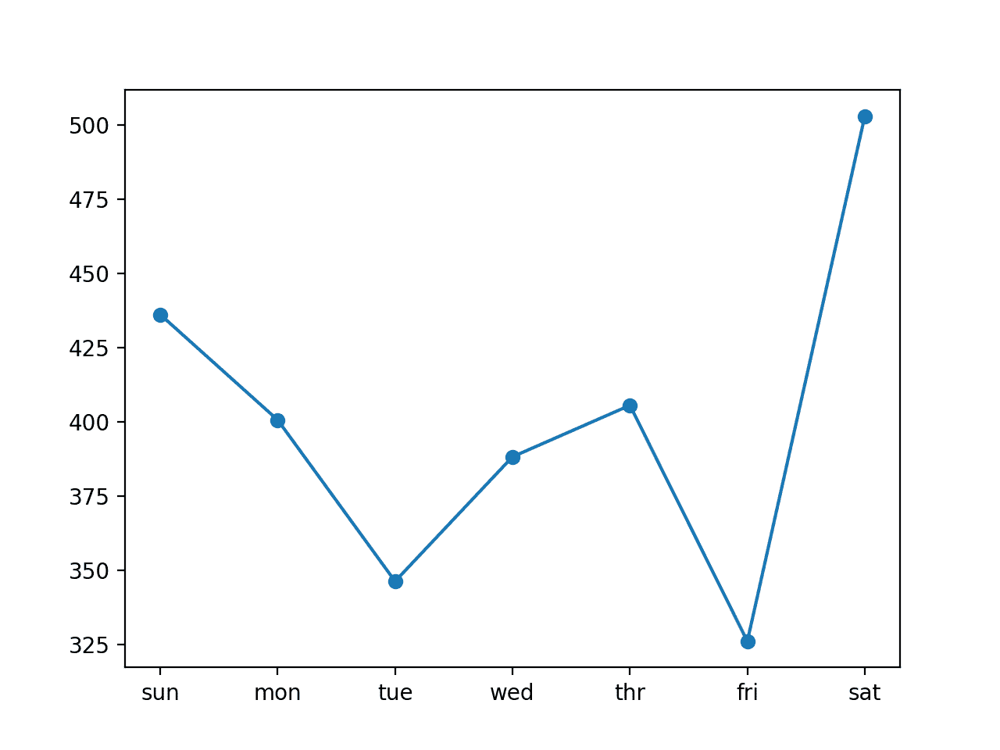
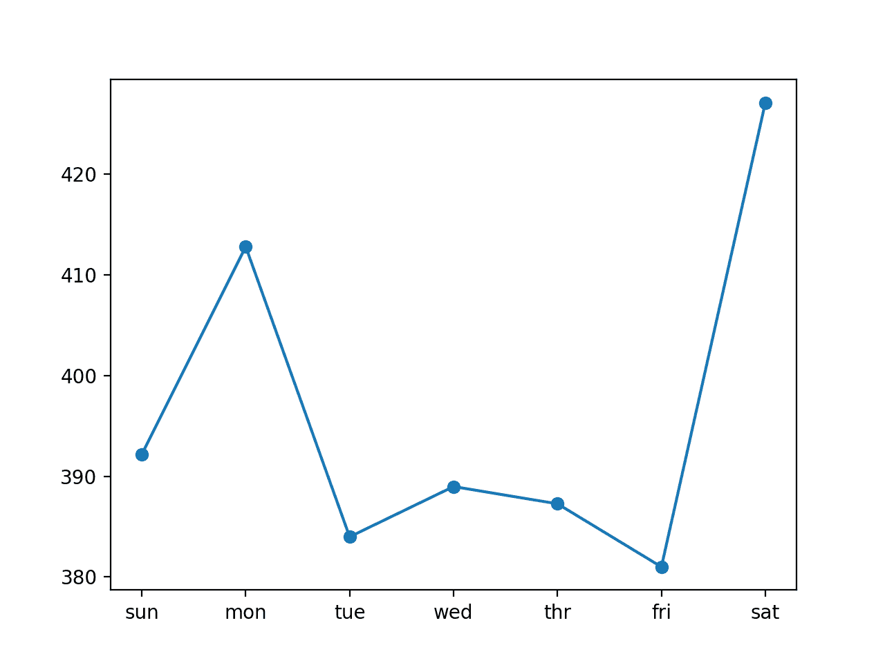
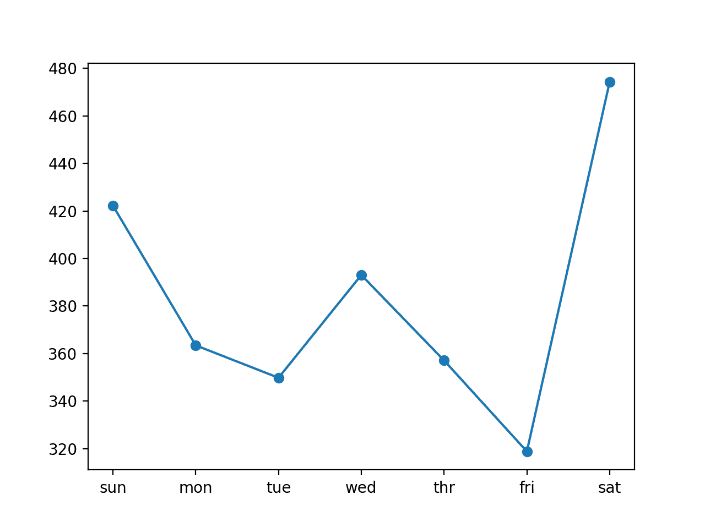

# 如何开发卷积神经网络用于多步时间序列预测

> 原文： [https://machinelearningmastery.com/how-to-develop-convolutional-neural-networks-for-multi-step-time-series-forecasting/](https://machinelearningmastery.com/how-to-develop-convolutional-neural-networks-for-multi-step-time-series-forecasting/)

鉴于智能电表的兴起以及太阳能电池板等发电技术的广泛采用，可提供大量的用电数据。

该数据代表了多变量时间序列的功率相关变量，而这些变量又可用于建模甚至预测未来的电力消耗。

与其他机器学习算法不同，卷积神经网络能够自动学习序列数据的特征，支持多变量数据，并且可以直接输出向量用于多步预测。因此，已经证明一维 CNN 表现良好，甚至在挑战性序列预测问题上实现了最先进的结果。

在本教程中，您将了解如何为多步时间序列预测开发一维卷积神经网络。

完成本教程后，您将了解：

*   如何开发 CNN 用于单变量数据的多步时间序列预测模型。
*   如何开发多变量数据的多通道多步时间序列预测模型。
*   如何开发多元数据的多头多步时间序列预测模型。

让我们开始吧。


如何开发用于多步时间序列预测的卷积神经网络
照片由 [Banalities](https://www.flickr.com/photos/richardsummers/4057257184/) ，保留一些权利。

## 教程概述

本教程分为七个部分;他们是：

1.  问题描述
2.  加载并准备数据集
3.  模型评估
4.  用于多步预测的 CNN
5.  具有单变量 CNN 的多步时间序列预测
6.  使用多通道 CNN 的多步时间序列预测
7.  具有多头 CNN 的多步时间序列预测

## 问题描述

'[家庭用电量](https://archive.ics.uci.edu/ml/datasets/individual+household+electric+power+consumption)'数据集是一个多变量时间序列数据集，描述了四年内单个家庭的用电量。

该数据是在 2006 年 12 月至 2010 年 11 月之间收集的，并且每分钟收集家庭内的能耗观察结果。

它是一个多变量系列，由七个变量组成（除日期和时间外）;他们是：

*   **global_active_power** ：家庭消耗的总有功功率（千瓦）。
*   **global_reactive_power** ：家庭消耗的总无功功率（千瓦）。
*   **电压**：平均电压（伏特）。
*   **global_intensity** ：平均电流强度（安培）。
*   **sub_metering_1** ：厨房的有功电能（瓦特小时的有功电能）。
*   **sub_metering_2** ：用于洗衣的有功能量（瓦特小时的有功电能）。
*   **sub_metering_3** ：气候控制系统的有功电能（瓦特小时的有功电能）。

有功和无功电能参考[交流电](https://en.wikipedia.org/wiki/AC_power)的技术细节。

可以通过从总活动能量中减去三个定义的子计量变量的总和来创建第四个子计量变量，如下所示：

```
sub_metering_remainder = (global_active_power * 1000 / 60) - (sub_metering_1 + sub_metering_2 + sub_metering_3)
```

## 加载并准备数据集

数据集可以从 UCI 机器学习库下载为单个 20 兆字节的.zip 文件：

*   [household_power_consumption.zip](https://archive.ics.uci.edu/ml/machine-learning-databases/00235/household_power_consumption.zip)

下载数据集并将其解压缩到当前工作目录中。您现在将拥有大约 127 兆字节的文件“ _household_power_consumption.txt_ ”并包含所有观察结果。

我们可以使用 _read_csv（）_ 函数来加载数据，并将前两列合并到一个日期时间列中，我们可以将其用作索引。

```
# load all data
dataset = read_csv('household_power_consumption.txt', sep=';', header=0, low_memory=False, infer_datetime_format=True, parse_dates={'datetime':[0,1]}, index_col=['datetime'])
```

接下来，我们可以用'_ 标记所有[缺失值](https://machinelearningmastery.com/handle-missing-timesteps-sequence-prediction-problems-python/)？_ '具有 _NaN_ 值的字符，这是一个浮点数。

这将允许我们将数据作为一个浮点值数组而不是混合类型（效率较低）。

```
# mark all missing values
dataset.replace('?', nan, inplace=True)
# make dataset numeric
dataset = dataset.astype('float32')
```

我们还需要填写缺失值，因为它们已被标记。

一种非常简单的方法是从前一天的同一时间复制观察。我们可以在一个名为 _fill_missing（）_ 的函数中实现它，该函数将从 24 小时前获取数据的 NumPy 数组并复制值。

```
# fill missing values with a value at the same time one day ago
def fill_missing(values):
	one_day = 60 * 24
	for row in range(values.shape[0]):
		for col in range(values.shape[1]):
			if isnan(values[row, col]):
				values[row, col] = values[row - one_day, col]
```

我们可以将此函数直接应用于 DataFrame 中的数据。

```
# fill missing
fill_missing(dataset.values)
```

现在，我们可以使用上一节中的计算创建一个包含剩余子计量的新列。

```
# add a column for for the remainder of sub metering
values = dataset.values
dataset['sub_metering_4'] = (values[:,0] * 1000 / 60) - (values[:,4] + values[:,5] + values[:,6])
```

我们现在可以将清理后的数据集版本保存到新文件中;在这种情况下，我们只需将文件扩展名更改为.csv，并将数据集保存为“ _household_power_consumption.csv_ ”。

```
# save updated dataset
dataset.to_csv('household_power_consumption.csv')
```

将所有这些结合在一起，下面列出了加载，清理和保存数据集的完整示例。

```
# load and clean-up data
from numpy import nan
from numpy import isnan
from pandas import read_csv
from pandas import to_numeric

# fill missing values with a value at the same time one day ago
def fill_missing(values):
	one_day = 60 * 24
	for row in range(values.shape[0]):
		for col in range(values.shape[1]):
			if isnan(values[row, col]):
				values[row, col] = values[row - one_day, col]

# load all data
dataset = read_csv('household_power_consumption.txt', sep=';', header=0, low_memory=False, infer_datetime_format=True, parse_dates={'datetime':[0,1]}, index_col=['datetime'])
# mark all missing values
dataset.replace('?', nan, inplace=True)
# make dataset numeric
dataset = dataset.astype('float32')
# fill missing
fill_missing(dataset.values)
# add a column for for the remainder of sub metering
values = dataset.values
dataset['sub_metering_4'] = (values[:,0] * 1000 / 60) - (values[:,4] + values[:,5] + values[:,6])
# save updated dataset
dataset.to_csv('household_power_consumption.csv')
```

运行该示例将创建新文件' _household_power_consumption.csv_ '，我们可以将其用作建模项目的起点。

## 模型评估

在本节中，我们将考虑如何开发和评估家庭电力数据集的预测模型。

本节分为四个部分;他们是：

1.  问题框架
2.  评估指标
3.  训练和测试集
4.  前瞻性验证

### 问题框架

有许多方法可以利用和探索家庭用电量数据集。

在本教程中，我们将使用这些数据来探索一个非常具体的问题;那是：

> 鉴于最近的耗电量，未来一周的预期耗电量是多少？

这要求预测模型预测未来七天每天的总有功功率。

从技术上讲，考虑到多个预测步骤，这个问题的框架被称为多步骤时间序列预测问题。利用多个输入变量的模型可以称为多变量多步时间序列预测模型。

这种类型的模型在规划支出方面可能有助于家庭。在供应方面，它也可能有助于规划特定家庭的电力需求。

数据集的这种框架还表明，将每分钟功耗的观察结果下采样到每日总数是有用的。这不是必需的，但考虑到我们对每天的总功率感兴趣，这是有道理的。

我们可以使用 pandas DataFrame 上的 [resample（）函数](https://pandas.pydata.org/pandas-docs/stable/generated/pandas.DataFrame.resample.html)轻松实现这一点。使用参数' _D_ '调用此函数允许按日期时间索引的加载数据按天分组（[查看所有偏移别名](http://pandas.pydata.org/pandas-docs/stable/timeseries.html#offset-aliases)）。然后，我们可以计算每天所有观测值的总和，并为八个变量中的每一个创建每日耗电量数据的新数据集。

下面列出了完整的示例。

```
# resample minute data to total for each day
from pandas import read_csv
# load the new file
dataset = read_csv('household_power_consumption.csv', header=0, infer_datetime_format=True, parse_dates=['datetime'], index_col=['datetime'])
# resample data to daily
daily_groups = dataset.resample('D')
daily_data = daily_groups.sum()
# summarize
print(daily_data.shape)
print(daily_data.head())
# save
daily_data.to_csv('household_power_consumption_days.csv')
```

运行该示例将创建一个新的每日总功耗数据集，并将结果保存到名为“ _household_power_consumption_days.csv_ ”的单独文件中。

我们可以将其用作数据集，用于拟合和评估所选问题框架的预测模型。

### 评估指标

预测将包含七个值，一个用于一周中的每一天。

多步预测问题通常分别评估每个预测时间步长。这有助于以下几个原因：

*   在特定提前期评论技能（例如+1 天 vs +3 天）。
*   在不同的交付时间基于他们的技能对比模型（例如，在+1 天的模型和在日期+5 的模型良好的模型）。

总功率的单位是千瓦，并且具有也在相同单位的误差度量将是有用的。均方根误差（RMSE）和平均绝对误差（MAE）都符合这个要求，尽管 RMSE 更常用，将在本教程中采用。与 MAE 不同，RMSE 更能预测预测误差。

此问题的表现指标是从第 1 天到第 7 天的每个提前期的 RMSE。

作为捷径，使用单个分数总结模型的表现以帮助模型选择可能是有用的。

可以使用的一个可能的分数是所有预测天数的 RMSE。

下面的函数 _evaluate_forecasts（）_ 将实现此行为并基于多个七天预测返回模型的表现。

```
# evaluate one or more weekly forecasts against expected values
def evaluate_forecasts(actual, predicted):
	scores = list()
	# calculate an RMSE score for each day
	for i in range(actual.shape[1]):
		# calculate mse
		mse = mean_squared_error(actual[:, i], predicted[:, i])
		# calculate rmse
		rmse = sqrt(mse)
		# store
		scores.append(rmse)
	# calculate overall RMSE
	s = 0
	for row in range(actual.shape[0]):
		for col in range(actual.shape[1]):
			s += (actual[row, col] - predicted[row, col])**2
	score = sqrt(s / (actual.shape[0] * actual.shape[1]))
	return score, scores
```

运行该函数将首先返回整个 RMSE，无论白天，然后每天返回一系列 RMSE 分数。

### 训练和测试集

我们将使用前三年的数据来训练预测模型和评估模型的最后一年。

给定数据集中的数据将分为标准周。这些是从周日开始到周六结束的周。

这是使用所选模型框架的现实且有用的方法，其中可以预测未来一周的功耗。它也有助于建模，其中模型可用于预测特定日期（例如星期三）或整个序列。

我们将数据拆分为标准周，从测试数据集向后工作。

数据的最后一年是 2010 年，2010 年的第一个星期日是 1 月 3 日。数据于 2010 年 11 月中旬结束，数据中最接近的最后一个星期六是 11 月 20 日。这给出了 46 周的测试数据。

下面提供了测试数据集的每日数据的第一行和最后一行以供确认。

```
2010-01-03,2083.4539999999984,191.61000000000055,350992.12000000034,8703.600000000033,3842.0,4920.0,10074.0,15888.233355799992
...
2010-11-20,2197.006000000004,153.76800000000028,346475.9999999998,9320.20000000002,4367.0,2947.0,11433.0,17869.76663959999
```

每日数据从 2006 年底开始。

数据集中的第一个星期日是 12 月 17 日，这是第二行数据。

将数据组织到标准周内为训练预测模型提供了 159 个完整的标准周。

```
2006-12-17,3390.46,226.0059999999994,345725.32000000024,14398.59999999998,2033.0,4187.0,13341.0,36946.66673200004
...
2010-01-02,1309.2679999999998,199.54600000000016,352332.8399999997,5489.7999999999865,801.0,298.0,6425.0,14297.133406600002
```

下面的函数 _split_dataset（）_ 将每日数据拆分为训练集和测试集，并将每个数据组织成标准周。

使用特定行偏移来使用数据集的知识来分割数据。然后使用 NumPy [split（）函数](https://docs.scipy.org/doc/numpy/reference/generated/numpy.split.html)将分割数据集组织成每周数据。

```
# split a univariate dataset into train/test sets
def split_dataset(data):
	# split into standard weeks
	train, test = data[1:-328], data[-328:-6]
	# restructure into windows of weekly data
	train = array(split(train, len(train)/7))
	test = array(split(test, len(test)/7))
	return train, test
```

我们可以通过加载每日数据集并打印列车和测试集的第一行和最后一行数据来测试此功能，以确认它们符合上述预期。

完整的代码示例如下所示。

```
# split into standard weeks
from numpy import split
from numpy import array
from pandas import read_csv

# split a univariate dataset into train/test sets
def split_dataset(data):
	# split into standard weeks
	train, test = data[1:-328], data[-328:-6]
	# restructure into windows of weekly data
	train = array(split(train, len(train)/7))
	test = array(split(test, len(test)/7))
	return train, test

# load the new file
dataset = read_csv('household_power_consumption_days.csv', header=0, infer_datetime_format=True, parse_dates=['datetime'], index_col=['datetime'])
train, test = split_dataset(dataset.values)
# validate train data
print(train.shape)
print(train[0, 0, 0], train[-1, -1, 0])
# validate test
print(test.shape)
print(test[0, 0, 0], test[-1, -1, 0])
```

运行该示例表明，列车数据集确实有 159 周的数据，而测试数据集有 46 周。

我们可以看到，第一行和最后一行的列车和测试数据集的总有效功率与我们定义为每组标准周界限的特定日期的数据相匹配。

```
(159, 7, 8)
3390.46 1309.2679999999998
(46, 7, 8)
2083.4539999999984 2197.006000000004
```

### 前瞻性验证

将使用称为[前进验证](https://machinelearningmastery.com/backtest-machine-learning-models-time-series-forecasting/)的方案评估模型。

这是需要模型进行一周预测的地方，然后该模型的实际数据可用于模型，以便它可以用作在随后一周进行预测的基础。这对于如何在实践中使用模型以及对模型有益，使其能够利用最佳可用数据都是现实的。

我们可以通过分离输入数据和输出/预测数据来证明这一点。

```
Input, 						Predict
[Week1]						Week2
[Week1 + Week2]				Week3
[Week1 + Week2 + Week3]		Week4
...
```

下面提供了评估此数据集上预测模型的前瞻性验证方法，命名为 _evaluate_model（）_。

标准周格式的训练和测试数据集作为参数提供给函数。提供了另一个参数 _n_input_ ，用于定义模型将用作输入以进行预测的先前观察的数量。

调用两个新函数：一个用于根据称为 _build_model（）_ 的训练数据构建模型，另一个用于使用该模型对每个新标准周进行预测，称为 _forecast（）_ 。这些将在后续章节中介绍。

我们正在使用神经网络，因此它们通常很难训练但很快就能进行评估。这意味着模型的首选用法是在历史数据上构建一次，并使用它们来预测前向验证的每个步骤。模型在评估期间是静态的（即未更新）。

这与训练更快的其他模型不同，其中当新数据可用时，模型可以重新拟合或更新前进验证的每个步骤。有了足够的资源，就可以通过这种方式使用神经网络，但在本教程中我们不会这样做。

下面列出了完整的 _evaluate_model（）_ 函数。

```
# evaluate a single model
def evaluate_model(train, test, n_input):
	# fit model
	model = build_model(train, n_input)
	# history is a list of weekly data
	history = [x for x in train]
	# walk-forward validation over each week
	predictions = list()
	for i in range(len(test)):
		# predict the week
		yhat_sequence = forecast(model, history, n_input)
		# store the predictions
		predictions.append(yhat_sequence)
		# get real observation and add to history for predicting the next week
		history.append(test[i, :])
	# evaluate predictions days for each week
	predictions = array(predictions)
	score, scores = evaluate_forecasts(test[:, :, 0], predictions)
	return score, scores
```

一旦我们对模型进行评估，我们就可以总结表现。

下面的函数名为 _summarize_scores（）_，将模型的表现显示为单行，以便与其他模型进行比较。

```
# summarize scores
def summarize_scores(name, score, scores):
	s_scores = ', '.join(['%.1f' % s for s in scores])
	print('%s: [%.3f] %s' % (name, score, s_scores))
```

我们现在已经开始评估数据集上的预测模型的所有元素。

## 用于多步预测的 CNN

卷积神经网络模型（简称 CNN）是一种深度神经网络，开发用于图像数据，如手写识别。

事实证明，它们在大规模训练时可以有效地挑战计算机视觉问题，例如识别和定位图像中的对象并自动描述图像内容。

它们是由两种主要类型的元素组成的模型：卷积层和池化层。

**卷积层**使用内核读取输入，例如 2D 图像或 1D 信号，该内核一次读取小段并跨越整个输入字段。每次读取都会导致对投影到滤镜图上的输入进行解释，并表示对输入的解释。

**汇集层**采用特征映射投影并将它们提取到最基本的元素，例如使用信号平均或信号最大化过程。

卷积和合并层可以在深度重复，提供输入信号的多层抽象。

这些网络的输出通常是一个或多个完全连接的层，用于解释已读取的内容并将此内部表示映射到类值。

有关卷积神经网络的更多信息，您可以看到帖子：

*   [用于机器学习的卷积神经网络的速成课程](https://machinelearningmastery.com/crash-course-convolutional-neural-networks/)

卷积神经网络可用于多步时间序列预测。

*   卷积层可以读取输入数据的序列并自动提取特征。
*   汇集层可以提取提取的特征，并将注意力集中在最显着的元素上。
*   完全连接的层可以解释内部表示并输出表示多个时间步长的向量。

该方法的主要优点是自动特征学习和模型直接输出多步向量的能力。

CNN 可用于递归或直接预测策略，其中模型使得一步预测和输出作为后续预测的输入被馈送，并且其中一个模型被开发用于每个预测的时间步长。或者，CNN 可用于预测整个输出序列，作为整个向量的一步预测。这是前馈神经网络的一般优点。

使用 CNN 的一个重要的第二个好处是它们可以支持多个 1D 输入以进行预测。如果多步输出序列是多个输入序列的函数，则这很有用。这可以使用两种不同的模型配置来实现。

*   **多输入通道**。这是每个输入序列作为单独的通道读取的地方，如图像的不同通道（例如红色，绿色和蓝色）。
*   **多输入磁头**。这是每个输入序列由不同的 CNN 子模型读取的地方，并且内部表示在被解释并用于进行预测之前被组合。

在本教程中，我们将探讨如何为多步时间序列预测开发三种不同类型的 CNN 模型;他们是：

*   CNN 用于使用单变量输入数据进行多步时间序列预测。
*   CNN 用于多步骤时间序列预测，通过信道提供多变量输入数据。
*   通过子模型使用多变量输入数据进行多步时间序列预测的 CNN。

将在家庭电力预测问题上开发和演示这些模型。如果一个模型比一个天真的模型更好地实现表现，那么该模型被认为是技术性的，在 7 天的预测中，该模型的总体 RMSE 约为 465 千瓦。

我们不会专注于调整这些模型以实现最佳表现;相反，与天真的预测相比，我们将在熟练的模型上停下来。选择的结构和超参数通过一些试验和错误来选择。

## 具有单变量 CNN 的多步时间序列预测

在本节中，我们将开发一个卷积神经网络，用于仅使用每日功耗的单变量序列进行多步时间序列预测。

具体来说，问题的框架是：

> 考虑到每日总耗电量的前几天，预测下一个标准周的每日耗电量。

用作输入的先前天数定义了 CNN 将读取并学习提取特征的数据的一维（1D）子序列。关于此输入的大小和性质的一些想法包括：

*   所有前几天，最多数年的数据。
*   前 7 天。
*   前两周。
*   前一个月。
*   前一年。
*   前一周和一周从一年前预测。

没有正确的答案;相反，可以测试每种方法和更多方法，并且可以使用模型的表现来选择导致最佳模型表现的输入的性质。

这些选择定义了有关实现的一些内容，例如：

*   如何准备训练数据以适应模型。
*   如何准备测试数据以评估模型。
*   如何使用该模型在未来使用最终模型进行预测。

一个好的起点是使用前七天。

1D CNN 模型期望数据具有以下形状：

```
[samples, timesteps, features]
```

一个样本将包含七个时间步骤，其中一个功能用于每日总耗电量的七天。

训练数据集有 159 周的数据，因此训练数据集的形状为：

```
[159, 7, 1]
```

这是一个好的开始。此格式的数据将使用先前的标准周来预测下一个标准周。一个问题是 159 个实例对于神经网络来说并不是很多。

创建更多训练数据的方法是在训练期间更改问题，以预测前七天的下一个七天，无论标准周。

这仅影响训练数据，测试问题保持不变：预测给定前一标准周的下一个标准周的每日功耗。

这将需要一点准备训练数据。

训练数据在标准周内提供八个变量，特别是形状[159,7,8]。第一步是展平数据，以便我们有八个时间序列序列。

```
# flatten data
data = data.reshape((data.shape[0]*data.shape[1], data.shape[2]))
```

然后，我们需要迭代时间步骤并将数据划分为重叠窗口;每次迭代沿着一个时间步移动并预测随后的七天。

例如：

```
Input, Output
[d01, d02, d03, d04, d05, d06, d07],	[d08, d09, d10, d11, d12, d13, d14]
[d02, d03, d04, d05, d06, d07, d08],	[d09, d10, d11, d12, d13, d14, d15]
...
```

我们可以通过跟踪输入和输出的开始和结束索引来实现这一点，因为我们在时间步长方面迭代展平数据的长度。

我们也可以通过参数化输入和输出的数量来实现这一点（例如 _n_input_ ， _n_out_ ），这样您就可以尝试不同的值或根据自己的问题进行调整。

下面是一个名为 _to_supervised（）_ 的函数，它采用周（历史）列表和用作输入和输出的时间步数，并以重叠移动窗口格式返回数据。

```
# convert history into inputs and outputs
def to_supervised(train, n_input, n_out=7):
	# flatten data
	data = train.reshape((train.shape[0]*train.shape[1], train.shape[2]))
	X, y = list(), list()
	in_start = 0
	# step over the entire history one time step at a time
	for _ in range(len(data)):
		# define the end of the input sequence
		in_end = in_start + n_input
		out_end = in_end + n_out
		# ensure we have enough data for this instance
		if out_end < len(data):
			x_input = data[in_start:in_end, 0]
			x_input = x_input.reshape((len(x_input), 1))
			X.append(x_input)
			y.append(data[in_end:out_end, 0])
		# move along one time step
		in_start += 1
	return array(X), array(y)
```

当我们在整个训练数据集上运行此函数时，我们将 159 个样本转换为 1,099 个;具体地，变换的数据集具有形状 _X = [1099,7,1]_ 和 _y = [1099,7]。_

接下来，我们可以在训练数据上定义和拟合 CNN 模型。

这个多步骤时间序列预测问题是一个自回归。这意味着它可能最好建模，其中接下来的七天是先前时间步骤的观测功能。这和相对少量的数据意味着需要一个小型号。

我们将使用一个具有一个卷积层的模型，其中包含 16 个滤波器，内核大小为 3.这意味着七次输入序列将通过卷积操作一次读取三个时间步，并且此操作将执行 16 次。在将内部表示展平为一个长向量之前，池化层将这些要素图减小其大小的 1/4。然后，在输出层预测序列中的下一个七天之前，由完全连接的层解释。

我们将使用均方误差损失函数，因为它与我们选择的 RMSE 误差度量非常匹配。我们将使用随机梯度下降的有效 [Adam](https://machinelearningmastery.com/adam-optimization-algorithm-for-deep-learning/) 实现，并将模型拟合 20 个时期，批量大小为 4。

小批量大小和算法的随机性意味着相同的模型将在每次训练时学习输入到输出的略微不同的映射。这意味着[结果可能会在评估模型时发生变化](https://machinelearningmastery.com/randomness-in-machine-learning/)。您可以尝试多次运行模型并计算模型表现的平均值。

下面的 _build_model（）_ 准备训练数据，定义模型，并将模型拟合到训练数据上，使拟合模型准备好进行预测。

```
# train the model
def build_model(train, n_input):
	# prepare data
	train_x, train_y = to_supervised(train, n_input)
	# define parameters
	verbose, epochs, batch_size = 0, 20, 4
	n_timesteps, n_features, n_outputs = train_x.shape[1], train_x.shape[2], train_y.shape[1]
	# define model
	model = Sequential()
	model.add(Conv1D(filters=16, kernel_size=3, activation='relu', input_shape=(n_timesteps,n_features)))
	model.add(MaxPooling1D(pool_size=2))
	model.add(Flatten())
	model.add(Dense(10, activation='relu'))
	model.add(Dense(n_outputs))
	model.compile(loss='mse', optimizer='adam')
	# fit network
	model.fit(train_x, train_y, epochs=epochs, batch_size=batch_size, verbose=verbose)
	return model
```

现在我们知道如何拟合模型，我们可以看看如何使用模型进行预测。

通常，模型期望数据在进行预测时具有相同的三维形状。

在这种情况下，输入模式的预期形状是一个样本，每天消耗的一个功能的七天：

```
[1, 7, 1]
```

在对测试集进行预测时以及在将来使用最终模型进行预测时，数据必须具有此形状。如果将输入天数更改为 14，则必须相应更改训练数据的形状和进行预测时新样本的形状，以便有 14 个时间步长。在使用模型时，您必须继续使用它。

我们正在使用前向验证来评估模型，如上一节中所述。

这意味着我们有前一周的观察结果，以预测下周。这些被收集到一系列标准周，称为历史。

为了预测下一个标准周，我们需要检索观察的最后几天。与训练数据一样，我们必须首先展平历史数据以删除每周结构，以便最终得到八个平行时间序列。

```
# flatten data
data = data.reshape((data.shape[0]*data.shape[1], data.shape[2]))
```

接下来，我们需要检索每日总功耗的最后七天（功能编号 0）。我们将像对训练数据那样进行参数化，以便将来可以修改模型用作输入的前几天的数量。

```
# retrieve last observations for input data
input_x = data[-n_input:, 0]
```

接下来，我们将输入重塑为预期的三维结构。

```
# reshape into [1, n_input, 1]
input_x = input_x.reshape((1, len(input_x), 1))
```

然后，我们使用拟合模型和输入数据进行预测，并检索七天输出的向量。

```
# forecast the next week
yhat = model.predict(input_x, verbose=0)
# we only want the vector forecast
yhat = yhat[0]
```

下面的 _forecast（）_ 函数实现了这个功能，并将模型拟合到训练数据集，到目前为止观察到的数据历史以及模型预期的输入时间步数。

```
# make a forecast
def forecast(model, history, n_input):
	# flatten data
	data = array(history)
	data = data.reshape((data.shape[0]*data.shape[1], data.shape[2]))
	# retrieve last observations for input data
	input_x = data[-n_input:, 0]
	# reshape into [1, n_input, 1]
	input_x = input_x.reshape((1, len(input_x), 1))
	# forecast the next week
	yhat = model.predict(input_x, verbose=0)
	# we only want the vector forecast
	yhat = yhat[0]
	return yhat
```

而已;我们现在拥有了所需的一切，我们需要通过 CNN 模型对单变量数据集的每日总功耗进行多步时间序列预测。

我们可以将所有这些结合在一起。下面列出了完整的示例。

```
# univariate multi-step cnn
from math import sqrt
from numpy import split
from numpy import array
from pandas import read_csv
from sklearn.metrics import mean_squared_error
from matplotlib import pyplot
from keras.models import Sequential
from keras.layers import Dense
from keras.layers import Flatten
from keras.layers.convolutional import Conv1D
from keras.layers.convolutional import MaxPooling1D

# split a univariate dataset into train/test sets
def split_dataset(data):
	# split into standard weeks
	train, test = data[1:-328], data[-328:-6]
	# restructure into windows of weekly data
	train = array(split(train, len(train)/7))
	test = array(split(test, len(test)/7))
	return train, test

# evaluate one or more weekly forecasts against expected values
def evaluate_forecasts(actual, predicted):
	scores = list()
	# calculate an RMSE score for each day
	for i in range(actual.shape[1]):
		# calculate mse
		mse = mean_squared_error(actual[:, i], predicted[:, i])
		# calculate rmse
		rmse = sqrt(mse)
		# store
		scores.append(rmse)
	# calculate overall RMSE
	s = 0
	for row in range(actual.shape[0]):
		for col in range(actual.shape[1]):
			s += (actual[row, col] - predicted[row, col])**2
	score = sqrt(s / (actual.shape[0] * actual.shape[1]))
	return score, scores

# summarize scores
def summarize_scores(name, score, scores):
	s_scores = ', '.join(['%.1f' % s for s in scores])
	print('%s: [%.3f] %s' % (name, score, s_scores))

# convert history into inputs and outputs
def to_supervised(train, n_input, n_out=7):
	# flatten data
	data = train.reshape((train.shape[0]*train.shape[1], train.shape[2]))
	X, y = list(), list()
	in_start = 0
	# step over the entire history one time step at a time
	for _ in range(len(data)):
		# define the end of the input sequence
		in_end = in_start + n_input
		out_end = in_end + n_out
		# ensure we have enough data for this instance
		if out_end < len(data):
			x_input = data[in_start:in_end, 0]
			x_input = x_input.reshape((len(x_input), 1))
			X.append(x_input)
			y.append(data[in_end:out_end, 0])
		# move along one time step
		in_start += 1
	return array(X), array(y)

# train the model
def build_model(train, n_input):
	# prepare data
	train_x, train_y = to_supervised(train, n_input)
	# define parameters
	verbose, epochs, batch_size = 0, 20, 4
	n_timesteps, n_features, n_outputs = train_x.shape[1], train_x.shape[2], train_y.shape[1]
	# define model
	model = Sequential()
	model.add(Conv1D(filters=16, kernel_size=3, activation='relu', input_shape=(n_timesteps,n_features)))
	model.add(MaxPooling1D(pool_size=2))
	model.add(Flatten())
	model.add(Dense(10, activation='relu'))
	model.add(Dense(n_outputs))
	model.compile(loss='mse', optimizer='adam')
	# fit network
	model.fit(train_x, train_y, epochs=epochs, batch_size=batch_size, verbose=verbose)
	return model

# make a forecast
def forecast(model, history, n_input):
	# flatten data
	data = array(history)
	data = data.reshape((data.shape[0]*data.shape[1], data.shape[2]))
	# retrieve last observations for input data
	input_x = data[-n_input:, 0]
	# reshape into [1, n_input, 1]
	input_x = input_x.reshape((1, len(input_x), 1))
	# forecast the next week
	yhat = model.predict(input_x, verbose=0)
	# we only want the vector forecast
	yhat = yhat[0]
	return yhat

# evaluate a single model
def evaluate_model(train, test, n_input):
	# fit model
	model = build_model(train, n_input)
	# history is a list of weekly data
	history = [x for x in train]
	# walk-forward validation over each week
	predictions = list()
	for i in range(len(test)):
		# predict the week
		yhat_sequence = forecast(model, history, n_input)
		# store the predictions
		predictions.append(yhat_sequence)
		# get real observation and add to history for predicting the next week
		history.append(test[i, :])
	# evaluate predictions days for each week
	predictions = array(predictions)
	score, scores = evaluate_forecasts(test[:, :, 0], predictions)
	return score, scores

# load the new file
dataset = read_csv('household_power_consumption_days.csv', header=0, infer_datetime_format=True, parse_dates=['datetime'], index_col=['datetime'])
# split into train and test
train, test = split_dataset(dataset.values)
# evaluate model and get scores
n_input = 7
score, scores = evaluate_model(train, test, n_input)
# summarize scores
summarize_scores('cnn', score, scores)
# plot scores
days = ['sun', 'mon', 'tue', 'wed', 'thr', 'fri', 'sat']
pyplot.plot(days, scores, marker='o', label='cnn')
pyplot.show()
```

运行该示例适合并评估模型，在所有七天内打印整体 RMSE，以及每个提前期的每日 RMSE。

鉴于算法的随机性，您的具体结果可能会有所不同。您可能想尝试几次运行该示例。

我们可以看到，在这种情况下，与天真的预测相比，该模型是巧妙的，实现了大约 404 千瓦的总体 RMSE，小于 465 千瓦的天真模型。

```
cnn: [404.411] 436.1, 400.6, 346.2, 388.2, 405.5, 326.0, 502.9
```

还创建了每日 RMSE 的图。该图显示，周二和周五可能比其他日子更容易预测，也许星期六在标准周结束时是最难预测的日子。



具有 7 天输入的单变量 CNN 每日 RMSE 的线图

我们可以通过更改 _n_input_ 变量来增加用作 7 到 14 之间输入的前几天的数量。

```
# evaluate model and get scores
n_input = 14
```

使用此更改重新运行示例首先会打印模型表现的摘要。

具体结果可能有所不同;尝试运行几次这个例子。

在这种情况下，我们可以看到整体 RMSE 进一步下降，这表明进一步调整输入大小以及模型的内核大小可能会带来更好的表现。

```
cnn: [396.497] 392.2, 412.8, 384.0, 389.0, 387.3, 381.0, 427.1
```

比较每日 RMSE 分数，我们看到一些更好，有些比使用第七输入更差。

这可以建议以某种方式使用两个不同大小的输入的益处，例如两种方法的集合或者可能是以不同方式读取训练数据的单个模型（例如，多头模型）。



单变量 CNN 每日 RMSE 的线图，具有 14 天输入

## 使用多通道 CNN 的多步时间序列预测

在本节中，我们将更新上一节中开发的 CNN，以使用八个时间序列变量中的每一个来预测下一个标准周的每日总功耗。

我们将通过将每个一维时间序列作为单独的输入通道提供给模型来实现此目的。

然后，CNN 将使用单独的内核并将每个输入序列读取到一组单独的过滤器映射上，主要是从每个输入时间序列变量中学习特征。

这对于那些输出序列是来自多个不同特征的先前时间步骤的观察的某些功能的问题是有帮助的，而不仅仅是（或包括）预测的特征。目前还不清楚功耗问题是否属于这种情况，但我们仍可以探索它。

首先，我们必须更新训练数据的准备工作，以包括所有八项功能，而不仅仅是每日消耗的一项功能。它需要一行：

```
X.append(data[in_start:in_end, :])
```

下面列出了具有此更改的完整 _to_supervised（）_ 功能。

```
# convert history into inputs and outputs
def to_supervised(train, n_input, n_out=7):
	# flatten data
	data = train.reshape((train.shape[0]*train.shape[1], train.shape[2]))
	X, y = list(), list()
	in_start = 0
	# step over the entire history one time step at a time
	for _ in range(len(data)):
		# define the end of the input sequence
		in_end = in_start + n_input
		out_end = in_end + n_out
		# ensure we have enough data for this instance
		if out_end < len(data):
			X.append(data[in_start:in_end, :])
			y.append(data[in_end:out_end, 0])
		# move along one time step
		in_start += 1
	return array(X), array(y)
```

我们还必须使用拟合模型更新用于进行预测的函数，以使用先前时间步骤中的所有八个特征。再次，另一个小变化：

```
# retrieve last observations for input data
input_x = data[-n_input:, :]
# reshape into [1, n_input, n]
input_x = input_x.reshape((1, input_x.shape[0], input_x.shape[1]))
```

具有此更改的完整 _forecast（）_ 如下所示：

```
# make a forecast
def forecast(model, history, n_input):
	# flatten data
	data = array(history)
	data = data.reshape((data.shape[0]*data.shape[1], data.shape[2]))
	# retrieve last observations for input data
	input_x = data[-n_input:, :]
	# reshape into [1, n_input, n]
	input_x = input_x.reshape((1, input_x.shape[0], input_x.shape[1]))
	# forecast the next week
	yhat = model.predict(input_x, verbose=0)
	# we only want the vector forecast
	yhat = yhat[0]
	return yhat
```

我们将在前面部分的最后一部分中使用 14 天的先前观察到 8 个输入变量，这导致表现稍好一些。

```
n_input = 14
```

最后，上一节中使用的模型在这个问题的新框架上表现不佳。

数据量的增加需要更大，更复杂的模型，这种模型需要更长时间的训练。

通过一些试验和错误，一个表现良好的模型使用两个卷积层，32 个滤波器映射，然后汇集，然后另一个卷积层，16 个特征映射和汇集。解释特征的完全连接层增加到 100 个节点，该模型适用于 70 个迭代，批量大小为 16 个样本。

下面列出了更新的 _build_model（）_ 函数，该函数定义并拟合训练数据集上的模型。

```
# train the model
def build_model(train, n_input):
	# prepare data
	train_x, train_y = to_supervised(train, n_input)
	# define parameters
	verbose, epochs, batch_size = 0, 70, 16
	n_timesteps, n_features, n_outputs = train_x.shape[1], train_x.shape[2], train_y.shape[1]
	# define model
	model = Sequential()
	model.add(Conv1D(filters=32, kernel_size=3, activation='relu', input_shape=(n_timesteps,n_features)))
	model.add(Conv1D(filters=32, kernel_size=3, activation='relu'))
	model.add(MaxPooling1D(pool_size=2))
	model.add(Conv1D(filters=16, kernel_size=3, activation='relu'))
	model.add(MaxPooling1D(pool_size=2))
	model.add(Flatten())
	model.add(Dense(100, activation='relu'))
	model.add(Dense(n_outputs))
	model.compile(loss='mse', optimizer='adam')
	# fit network
	model.fit(train_x, train_y, epochs=epochs, batch_size=batch_size, verbose=verbose)
	return model
```

我们现在拥有为多变量输入数据开发多通道 CNN 以进行多步时间序列预测所需的所有元素。

下面列出了完整的示例。

```
# multichannel multi-step cnn
from math import sqrt
from numpy import split
from numpy import array
from pandas import read_csv
from sklearn.metrics import mean_squared_error
from matplotlib import pyplot
from keras.models import Sequential
from keras.layers import Dense
from keras.layers import Flatten
from keras.layers.convolutional import Conv1D
from keras.layers.convolutional import MaxPooling1D

# split a univariate dataset into train/test sets
def split_dataset(data):
	# split into standard weeks
	train, test = data[1:-328], data[-328:-6]
	# restructure into windows of weekly data
	train = array(split(train, len(train)/7))
	test = array(split(test, len(test)/7))
	return train, test

# evaluate one or more weekly forecasts against expected values
def evaluate_forecasts(actual, predicted):
	scores = list()
	# calculate an RMSE score for each day
	for i in range(actual.shape[1]):
		# calculate mse
		mse = mean_squared_error(actual[:, i], predicted[:, i])
		# calculate rmse
		rmse = sqrt(mse)
		# store
		scores.append(rmse)
	# calculate overall RMSE
	s = 0
	for row in range(actual.shape[0]):
		for col in range(actual.shape[1]):
			s += (actual[row, col] - predicted[row, col])**2
	score = sqrt(s / (actual.shape[0] * actual.shape[1]))
	return score, scores

# summarize scores
def summarize_scores(name, score, scores):
	s_scores = ', '.join(['%.1f' % s for s in scores])
	print('%s: [%.3f] %s' % (name, score, s_scores))

# convert history into inputs and outputs
def to_supervised(train, n_input, n_out=7):
	# flatten data
	data = train.reshape((train.shape[0]*train.shape[1], train.shape[2]))
	X, y = list(), list()
	in_start = 0
	# step over the entire history one time step at a time
	for _ in range(len(data)):
		# define the end of the input sequence
		in_end = in_start + n_input
		out_end = in_end + n_out
		# ensure we have enough data for this instance
		if out_end < len(data):
			X.append(data[in_start:in_end, :])
			y.append(data[in_end:out_end, 0])
		# move along one time step
		in_start += 1
	return array(X), array(y)

# train the model
def build_model(train, n_input):
	# prepare data
	train_x, train_y = to_supervised(train, n_input)
	# define parameters
	verbose, epochs, batch_size = 0, 70, 16
	n_timesteps, n_features, n_outputs = train_x.shape[1], train_x.shape[2], train_y.shape[1]
	# define model
	model = Sequential()
	model.add(Conv1D(filters=32, kernel_size=3, activation='relu', input_shape=(n_timesteps,n_features)))
	model.add(Conv1D(filters=32, kernel_size=3, activation='relu'))
	model.add(MaxPooling1D(pool_size=2))
	model.add(Conv1D(filters=16, kernel_size=3, activation='relu'))
	model.add(MaxPooling1D(pool_size=2))
	model.add(Flatten())
	model.add(Dense(100, activation='relu'))
	model.add(Dense(n_outputs))
	model.compile(loss='mse', optimizer='adam')
	# fit network
	model.fit(train_x, train_y, epochs=epochs, batch_size=batch_size, verbose=verbose)
	return model

# make a forecast
def forecast(model, history, n_input):
	# flatten data
	data = array(history)
	data = data.reshape((data.shape[0]*data.shape[1], data.shape[2]))
	# retrieve last observations for input data
	input_x = data[-n_input:, :]
	# reshape into [1, n_input, n]
	input_x = input_x.reshape((1, input_x.shape[0], input_x.shape[1]))
	# forecast the next week
	yhat = model.predict(input_x, verbose=0)
	# we only want the vector forecast
	yhat = yhat[0]
	return yhat

# evaluate a single model
def evaluate_model(train, test, n_input):
	# fit model
	model = build_model(train, n_input)
	# history is a list of weekly data
	history = [x for x in train]
	# walk-forward validation over each week
	predictions = list()
	for i in range(len(test)):
		# predict the week
		yhat_sequence = forecast(model, history, n_input)
		# store the predictions
		predictions.append(yhat_sequence)
		# get real observation and add to history for predicting the next week
		history.append(test[i, :])
	# evaluate predictions days for each week
	predictions = array(predictions)
	score, scores = evaluate_forecasts(test[:, :, 0], predictions)
	return score, scores

# load the new file
dataset = read_csv('household_power_consumption_days.csv', header=0, infer_datetime_format=True, parse_dates=['datetime'], index_col=['datetime'])
# split into train and test
train, test = split_dataset(dataset.values)
# evaluate model and get scores
n_input = 14
score, scores = evaluate_model(train, test, n_input)
# summarize scores
summarize_scores('cnn', score, scores)
# plot scores
days = ['sun', 'mon', 'tue', 'wed', 'thr', 'fri', 'sat']
pyplot.plot(days, scores, marker='o', label='cnn')
pyplot.show()
```

运行该示例适合并评估模型，在所有七天内打印整体 RMSE，以及每个提前期的每日 RMSE。

鉴于算法的随机性，您的具体结果可能会有所不同。您可能想尝试几次运行该示例。

我们可以看到，在这种情况下，使用所有八个输入变量确实导致整体 RMSE 分数的另一个小幅下降。

```
cnn: [385.711] 422.2, 363.5, 349.8, 393.1, 357.1, 318.8, 474.3
```

对于每日 RMSE 分数，我们确实看到一些更好，一些比上一节中的单变量 CNN 更差。

最后一天，周六，仍然是充满挑战的预测日，周五是一个轻松的预测日。设计模型可能会有一些好处，专门用于减少更难预测天数的误差。

可能有趣的是，可以通过调谐模型或者可能是多个不同模型的集合来进一步降低每日分数的方差。比较使用 7 天甚至 21 天输入数据的模型的表现以查看是否可以进一步获得也可能是有趣的。



具有 14 天输入的多通道 CNN 每天 RMSE 的线图

## 具有多头 CNN 的多步时间序列预测

我们可以进一步扩展 CNN 模型，为每个输入变量设置一个单独的子 CNN 模型或头部，我们可以将其称为多头 CNN 模型。

这需要修改模型的准备，进而修改训练和测试数据集的准备。

从模型开始，我们必须为八个输入变量中的每一个定义一个单独的 CNN 模型。

模型的配置（包括层数及其超参数）也进行了修改，以更好地适应新方法。新配置不是最佳配置，只需稍加试错即可找到。

使用更灵活的[功能 API 来定义多头模型以定义 Keras 模型](https://machinelearningmastery.com/keras-functional-api-deep-learning/)。

我们可以遍历每个变量并创建一个子模型，该子模型采用 14 天数据的一维序列，并输出包含序列中学习特征摘要的平面向量。这些向量中的每一个可以通过串联合并以产生一个非常长的向量，然后在进行预测之前由一些完全连接的层解释。

在我们构建子模型时，我们会跟踪输入层并在列表中展平层。这样我们就可以在模型对象的定义中指定输入，并使用合并层中的展平层列表。

```
# create a channel for each variable
in_layers, out_layers = list(), list()
for i in range(n_features):
	inputs = Input(shape=(n_timesteps,1))
	conv1 = Conv1D(filters=32, kernel_size=3, activation='relu')(inputs)
	conv2 = Conv1D(filters=32, kernel_size=3, activation='relu')(conv1)
	pool1 = MaxPooling1D(pool_size=2)(conv2)
	flat = Flatten()(pool1)
	# store layers
	in_layers.append(inputs)
	out_layers.append(flat)
# merge heads
merged = concatenate(out_layers)
# interpretation
dense1 = Dense(200, activation='relu')(merged)
dense2 = Dense(100, activation='relu')(dense1)
outputs = Dense(n_outputs)(dense2)
model = Model(inputs=in_layers, outputs=outputs)
# compile model
model.compile(loss='mse', optimizer='adam')
```

使用该模型时，它将需要八个数组作为输入：每个子模型一个。

在训练模型，评估模型以及使用最终模型进行预测时，这是必需的。

我们可以通过创建一个 3D 数组列表来实现这一点，其中每个 3D 数组包含[_ 样本，时间步长，1_ ]，具有一个特征。

我们可以按以下格式准备训练数据集：

```
input_data = [train_x[:,:,i].reshape((train_x.shape[0],n_timesteps,1)) for i in range(n_features)]
```

下面列出了具有这些更改的更新的 _build_model（）_ 函数。

```
# train the model
def build_model(train, n_input):
	# prepare data
	train_x, train_y = to_supervised(train, n_input)
	# define parameters
	verbose, epochs, batch_size = 0, 25, 16
	n_timesteps, n_features, n_outputs = train_x.shape[1], train_x.shape[2], train_y.shape[1]
	# create a channel for each variable
	in_layers, out_layers = list(), list()
	for i in range(n_features):
		inputs = Input(shape=(n_timesteps,1))
		conv1 = Conv1D(filters=32, kernel_size=3, activation='relu')(inputs)
		conv2 = Conv1D(filters=32, kernel_size=3, activation='relu')(conv1)
		pool1 = MaxPooling1D(pool_size=2)(conv2)
		flat = Flatten()(pool1)
		# store layers
		in_layers.append(inputs)
		out_layers.append(flat)
	# merge heads
	merged = concatenate(out_layers)
	# interpretation
	dense1 = Dense(200, activation='relu')(merged)
	dense2 = Dense(100, activation='relu')(dense1)
	outputs = Dense(n_outputs)(dense2)
	model = Model(inputs=in_layers, outputs=outputs)
	# compile model
	model.compile(loss='mse', optimizer='adam')
	# plot the model
	plot_model(model, show_shapes=True, to_file='multiheaded_cnn.png')
	# fit network
	input_data = [train_x[:,:,i].reshape((train_x.shape[0],n_timesteps,1)) for i in range(n_features)]
	model.fit(input_data, train_y, epochs=epochs, batch_size=batch_size, verbose=verbose)
	return model
```

构建模型时，会创建模型结构图并将其保存到文件中。

注意：对 plot_model（）的调用要求安装 pygraphviz 和 pydot。如果这是一个问题，您可以注释掉这一行。

网络结构如下。


多头卷积神经网络的结构

接下来，我们可以在对测试数据集进行预测时更新输入样本的准备。

我们必须执行相同的更改，其中[1,14,8]的输入数组必须转换为八个 3D 数组的列表，每个数组都带有[1,14,1]。

```
input_x = [input_x[:,i].reshape((1,input_x.shape[0],1)) for i in range(input_x.shape[1])]
```

下面列出了具有此更改的 _forecast（）_ 函数。

```
# make a forecast
def forecast(model, history, n_input):
	# flatten data
	data = array(history)
	data = data.reshape((data.shape[0]*data.shape[1], data.shape[2]))
	# retrieve last observations for input data
	input_x = data[-n_input:, :]
	# reshape into n input arrays
	input_x = [input_x[:,i].reshape((1,input_x.shape[0],1)) for i in range(input_x.shape[1])]
	# forecast the next week
	yhat = model.predict(input_x, verbose=0)
	# we only want the vector forecast
	yhat = yhat[0]
	return yhat
```

而已。

我们可以将所有这些结合在一起;下面列出了完整的示例。

```
# multi headed multi-step cnn
from math import sqrt
from numpy import split
from numpy import array
from pandas import read_csv
from sklearn.metrics import mean_squared_error
from matplotlib import pyplot
from keras.models import Sequential
from keras.layers import Dense
from keras.layers import Flatten
from keras.layers.convolutional import Conv1D
from keras.layers.convolutional import MaxPooling1D
from keras.models import Model
from keras.layers import Input
from keras.layers.merge import concatenate

# split a univariate dataset into train/test sets
def split_dataset(data):
	# split into standard weeks
	train, test = data[1:-328], data[-328:-6]
	# restructure into windows of weekly data
	train = array(split(train, len(train)/7))
	test = array(split(test, len(test)/7))
	return train, test

# evaluate one or more weekly forecasts against expected values
def evaluate_forecasts(actual, predicted):
	scores = list()
	# calculate an RMSE score for each day
	for i in range(actual.shape[1]):
		# calculate mse
		mse = mean_squared_error(actual[:, i], predicted[:, i])
		# calculate rmse
		rmse = sqrt(mse)
		# store
		scores.append(rmse)
	# calculate overall RMSE
	s = 0
	for row in range(actual.shape[0]):
		for col in range(actual.shape[1]):
			s += (actual[row, col] - predicted[row, col])**2
	score = sqrt(s / (actual.shape[0] * actual.shape[1]))
	return score, scores

# summarize scores
def summarize_scores(name, score, scores):
	s_scores = ', '.join(['%.1f' % s for s in scores])
	print('%s: [%.3f] %s' % (name, score, s_scores))

# convert history into inputs and outputs
def to_supervised(train, n_input, n_out=7):
	# flatten data
	data = train.reshape((train.shape[0]*train.shape[1], train.shape[2]))
	X, y = list(), list()
	in_start = 0
	# step over the entire history one time step at a time
	for _ in range(len(data)):
		# define the end of the input sequence
		in_end = in_start + n_input
		out_end = in_end + n_out
		# ensure we have enough data for this instance
		if out_end < len(data):
			X.append(data[in_start:in_end, :])
			y.append(data[in_end:out_end, 0])
		# move along one time step
		in_start += 1
	return array(X), array(y)

# plot training history
def plot_history(history):
	# plot loss
	pyplot.subplot(2, 1, 1)
	pyplot.plot(history.history['loss'], label='train')
	pyplot.plot(history.history['val_loss'], label='test')
	pyplot.title('loss', y=0, loc='center')
	pyplot.legend()
	# plot rmse
	pyplot.subplot(2, 1, 2)
	pyplot.plot(history.history['rmse'], label='train')
	pyplot.plot(history.history['val_rmse'], label='test')
	pyplot.title('rmse', y=0, loc='center')
	pyplot.legend()
	pyplot.show()

# train the model
def build_model(train, n_input):
	# prepare data
	train_x, train_y = to_supervised(train, n_input)
	# define parameters
	verbose, epochs, batch_size = 0, 25, 16
	n_timesteps, n_features, n_outputs = train_x.shape[1], train_x.shape[2], train_y.shape[1]
	# create a channel for each variable
	in_layers, out_layers = list(), list()
	for i in range(n_features):
		inputs = Input(shape=(n_timesteps,1))
		conv1 = Conv1D(filters=32, kernel_size=3, activation='relu')(inputs)
		conv2 = Conv1D(filters=32, kernel_size=3, activation='relu')(conv1)
		pool1 = MaxPooling1D(pool_size=2)(conv2)
		flat = Flatten()(pool1)
		# store layers
		in_layers.append(inputs)
		out_layers.append(flat)
	# merge heads
	merged = concatenate(out_layers)
	# interpretation
	dense1 = Dense(200, activation='relu')(merged)
	dense2 = Dense(100, activation='relu')(dense1)
	outputs = Dense(n_outputs)(dense2)
	model = Model(inputs=in_layers, outputs=outputs)
	# compile model
	model.compile(loss='mse', optimizer='adam')
	# fit network
	input_data = [train_x[:,:,i].reshape((train_x.shape[0],n_timesteps,1)) for i in range(n_features)]
	model.fit(input_data, train_y, epochs=epochs, batch_size=batch_size, verbose=verbose)
	return model

# make a forecast
def forecast(model, history, n_input):
	# flatten data
	data = array(history)
	data = data.reshape((data.shape[0]*data.shape[1], data.shape[2]))
	# retrieve last observations for input data
	input_x = data[-n_input:, :]
	# reshape into n input arrays
	input_x = [input_x[:,i].reshape((1,input_x.shape[0],1)) for i in range(input_x.shape[1])]
	# forecast the next week
	yhat = model.predict(input_x, verbose=0)
	# we only want the vector forecast
	yhat = yhat[0]
	return yhat

# evaluate a single model
def evaluate_model(train, test, n_input):
	# fit model
	model = build_model(train, n_input)
	# history is a list of weekly data
	history = [x for x in train]
	# walk-forward validation over each week
	predictions = list()
	for i in range(len(test)):
		# predict the week
		yhat_sequence = forecast(model, history, n_input)
		# store the predictions
		predictions.append(yhat_sequence)
		# get real observation and add to history for predicting the next week
		history.append(test[i, :])
	# evaluate predictions days for each week
	predictions = array(predictions)
	score, scores = evaluate_forecasts(test[:, :, 0], predictions)
	return score, scores

# load the new file
dataset = read_csv('household_power_consumption_days.csv', header=0, infer_datetime_format=True, parse_dates=['datetime'], index_col=['datetime'])
# split into train and test
train, test = split_dataset(dataset.values)
# evaluate model and get scores
n_input = 14
score, scores = evaluate_model(train, test, n_input)
# summarize scores
summarize_scores('cnn', score, scores)
# plot scores
days = ['sun', 'mon', 'tue', 'wed', 'thr', 'fri', 'sat']
pyplot.plot(days, scores, marker='o', label='cnn')
pyplot.show()
```

运行该示例适合并评估模型，在所有七天内打印整体 RMSE，以及每个提前期的每日 RMSE。

鉴于算法的随机性，您的具体结果可能会有所不同。您可能想尝试几次运行该示例。

我们可以看到，在这种情况下，与天真的预测相比，整体 RMSE 非常熟练，但是所选择的配置可能不会比上一节中的多通道模型表现更好。

```
cnn: [396.116] 414.5, 385.5, 377.2, 412.1, 371.1, 380.6, 428.1
```

我们还可以看到每日 RMSE 分数的不同，更明显的概况，其中 Mon-Tue 和 Thu-Fri 可能比其他预测天更容易预测模型。

与其他预测模型结合使用时，这些结果可能很有用。

在架构中探索用于合并每个子模型的输出的替代方法可能是有趣的。


具有 14 天输入的多头 CNN 每天 RMSE 的线图

## 扩展

本节列出了一些扩展您可能希望探索的教程的想法。

*   **输入大小**。探索用作模型输入的更多或更少天数，例如三天，21 天，30 天等。
*   **模型调整**。调整模型的结构和超参数，并进一步平均提升模型表现。
*   **数据缩放**。探索数据扩展（例如标准化和规范化）是否可用于改善任何 CNN 模型的表现。
*   **学习诊断**。使用诊断，例如列车的学习曲线和验证损失以及均方误差，以帮助调整 CNN 模型的结构和超参数。
*   **不同的内核大小**。将多通道 CNN 与多头 CNN 结合使用，并为每个磁头使用不同的内核大小，以查看此配置是否可以进一步提高表现。

如果你探索任何这些扩展，我很想知道。

## 进一步阅读

如果您希望深入了解，本节将提供有关该主题的更多资源。

### API

*   [pandas.read_csv API](https://pandas.pydata.org/pandas-docs/stable/generated/pandas.read_csv.html)
*   [pandas.DataFrame.resample API](https://pandas.pydata.org/pandas-docs/stable/generated/pandas.DataFrame.resample.html)
*   [重采样偏移别名](http://pandas.pydata.org/pandas-docs/stable/timeseries.html#offset-aliases)
*   [sklearn.metrics.mean_squared_error API](http://scikit-learn.org/stable/modules/generated/sklearn.metrics.mean_squared_error.html)
*   [numpy.split API](https://docs.scipy.org/doc/numpy/reference/generated/numpy.split.html)

### 用品

*   [个人家庭用电量数据集，UCI 机器学习库](https://archive.ics.uci.edu/ml/datasets/individual+household+electric+power+consumption)。
*   [交流电源，维基百科](https://en.wikipedia.org/wiki/AC_power)。
*   [多步时间序列预测的 4 种策略](https://machinelearningmastery.com/multi-step-time-series-forecasting/)
*   [用于机器学习的卷积神经网络的速成课程](https://machinelearningmastery.com/crash-course-convolutional-neural-networks/)

## 摘要

在本教程中，您了解了如何为多步时间序列预测开发一维卷积神经网络。

具体来说，你学到了：

*   如何开发 CNN 用于单变量数据的多步时间序列预测模型。
*   如何开发多变量数据的多通道多步时间序列预测模型。
*   如何开发多元数据的多头多步时间序列预测模型。

你有任何问题吗？
在下面的评论中提出您的问题，我会尽力回答。