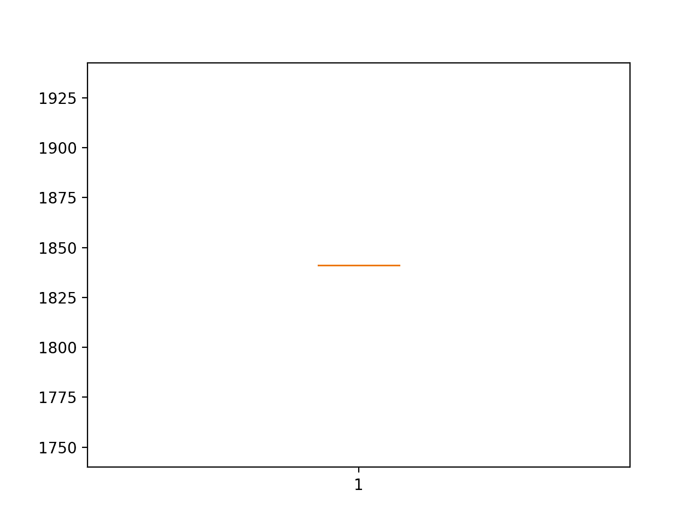
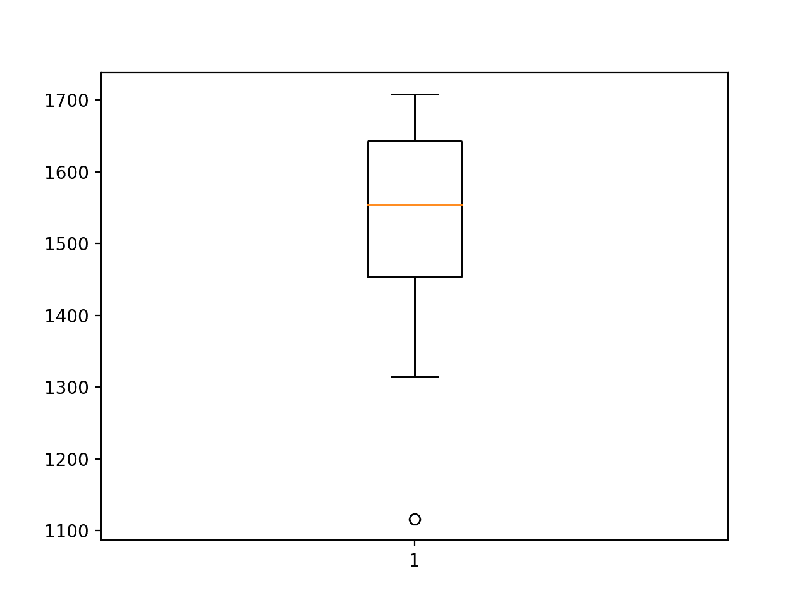
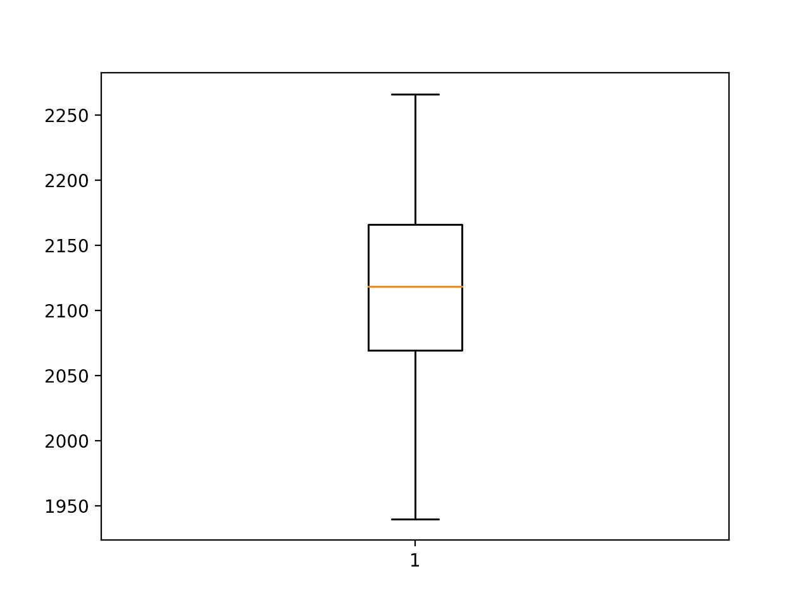
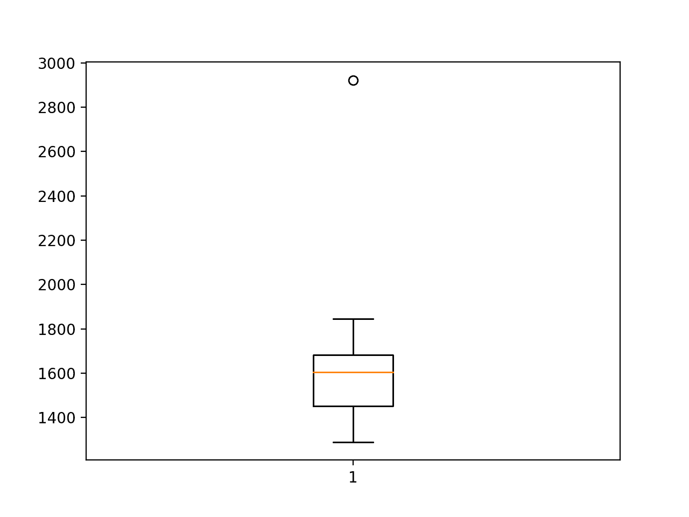

# 如何开发用于单变量时间序列预测的深度学习模型

> 原文： [https://machinelearningmastery.com/how-to-develop-deep-learning-models-for-univariate-time-series-forecasting/](https://machinelearningmastery.com/how-to-develop-deep-learning-models-for-univariate-time-series-forecasting/)

深度学习神经网络能够自动学习和从原始数据中提取特征。

神经网络的这一特征可用于时间序列预测问题，其中模型可以直接在原始观测上开发，而不需要使用归一化和标准化来扩展数据或通过差分使数据静止。

令人印象深刻的是，简单的深度学习神经网络模型能够进行熟练的预测，与朴素模型和调整 SARIMA 模型相比，单变量时间序列预测存在趋势和季节性成分且无需预处理的问题。

在本教程中，您将了解如何开发一套用于单变量时间序列预测的深度学习模型。

完成本教程后，您将了解：

*   如何使用前向验证开发一个强大的测试工具来评估神经网络模型的表现。
*   如何开发和评估简单多层感知机和卷积神经网络的时间序列预测。
*   如何开发和评估 LSTM，CNN-LSTM 和 ConvLSTM 神经网络模型用于时间序列预测。

让我们开始吧。


如何开发单变量时间序列预测的深度学习模型
照片由 [Nathaniel McQueen](https://www.flickr.com/photos/nmcqueenphotography/40518405705/) ，保留一些权利。

## 教程概述

本教程分为五个部分;他们是：

1.  问题描述
2.  模型评估测试线束
3.  多层感知机模型
4.  卷积神经网络模型
5.  循环神经网络模型

## 问题描述

'_ 月度汽车销售 _'数据集总结了 1960 年至 1968 年间加拿大魁北克省的月度汽车销量。

您可以从 [DataMarket](https://datamarket.com/data/set/22n4/monthly-car-sales-in-quebec-1960-1968#!ds=22n4&display=line) 了解有关数据集的更多信息。

直接从这里下载数据集：

*   [month-car-sales.csv](https://raw.githubusercontent.com/jbrownlee/Datasets/master/monthly-car-sales.csv)

在当前工作目录中使用文件名“ _monthly-car-sales.csv_ ”保存文件。

我们可以使用函数`read_csv()`将此数据集作为 Pandas 系列加载。

```py
# load
series = read_csv('monthly-car-sales.csv', header=0, index_col=0)
```

加载后，我们可以总结数据集的形状，以确定观察的数量。

```py
# summarize shape
print(series.shape)
```

然后我们可以创建该系列的线图，以了解该系列的结构。

```py
# plot
pyplot.plot(series)
pyplot.show()
```

我们可以将所有这些结合在一起;下面列出了完整的示例。

```py
# load and plot dataset
from pandas import read_csv
from matplotlib import pyplot
# load
series = read_csv('monthly-car-sales.csv', header=0, index_col=0)
# summarize shape
print(series.shape)
# plot
pyplot.plot(series)
pyplot.show()
```

首先运行该示例将打印数据集的形状。

```py
(108, 1)
```

该数据集是每月一次，有 9 年或 108 次观测。在我们的测试中，将使用去年或 12 个观测值作为测试集。

创建线图。数据集具有明显的趋势和季节性成分。季节性成分的期限可能是六个月或 12 个月。


月度汽车销售线图

从之前的实验中，我们知道一个幼稚的模型可以通过取预测月份的前三年的观测值的中位数来实现 1841.155 的均方根误差或 RMSE;例如：

```py
yhat = median(-12, -24, -36)
```

负指数是指相对于预测月份的历史数据末尾的序列中的观察值。

从之前的实验中，我们知道 SARIMA 模型可以达到 1551.842 的 RMSE，其配置为 SARIMA（0,0,0），（1,1,0），12 其中没有为趋势指定元素和季节性差异计算周期为 12，并使用一个季节的 AR 模型。

朴素模型的表现为被认为熟练的模型提供了下限。任何在过去 12 个月内达到低于 1841.155 的预测表现的模型都具有技巧。

SARIMA 模型的表现可以衡量问题的良好模型。任何在过去 12 个月内达到预测表现低于 1551.842 的模型都应采用 SARIMA 模型。

现在我们已经定义了模型技能的问题和期望，我们可以看看定义测试工具。

## 模型评估测试线束

在本节中，我们将开发一个测试工具，用于开发和评估不同类型的神经网络模型，用于单变量时间序列预测。

本节分为以下几部分：

1.  训练 - 测试分裂
2.  系列作为监督学习
3.  前瞻性验证
4.  重复评估
5.  总结表现
6.  工作示例

### 训练 - 测试分裂

第一步是将加载的系列分成训练和测试集。

我们将使用前八年（96 个观测值）进行训练，最后 12 个用于测试集。

下面的`train_test_split()`函数将拆分系列，将原始观察值和在测试集中使用的观察数作为参数。

```py
# split a univariate dataset into train/test sets
def train_test_split(data, n_test):
	return data[:-n_test], data[-n_test:]
```

### 系列作为监督学习

接下来，我们需要能够将单变量观测系列框架化为监督学习问题，以便我们可以训练神经网络模型。

系列的监督学习框架意味着需要将数据拆分为模型从中学习和概括的多个示例。

每个样本必须同时具有输入组件和输出组件。

输入组件将是一些先前的观察，例如三年或 36 个时间步骤。

输出组件将是下个月的总销售额，因为我们有兴趣开发一个模型来进行一步预测。

我们可以使用 pandas DataFrame 上的 [shift（）函数](http://pandas-docs.github.io/pandas-docs-travis/generated/pandas.DataFrame.shift.html)来实现它。它允许我们向下移动一列（向前移动）或向后移动（向后移动）。我们可以将该系列作为一列数据，然后创建列的多个副本，向前或向后移动，以便使用我们需要的输入和输出元素创建样本。

当一个系列向下移动时，会引入`NaN`值，因为我们没有超出系列开头的值。

例如，系列定义为列：

```py
(t)
1
2
3
4
```

可以预先移位和插入列：

```py
(t-1),		(t)
Nan,		1
1,			2
2,			3
3,			4
4			NaN
```

我们可以看到，在第二行，值 1 作为输入提供，作为前一时间步的观察，2 是系列中可以预测的下一个值，或者当 1 是预测模型时要学习的值作为输入呈现。

可以去除具有`NaN`值的行。

下面的`series_to_supervised()`函数实现了这种行为，允许您指定输入中使用的滞后观察数和每个样本的输出中使用的数。它还将删除具有`NaN`值的行，因为它们不能用于训练或测试模型。

```py
# transform list into supervised learning format
def series_to_supervised(data, n_in=1, n_out=1):
	df = DataFrame(data)
	cols = list()
	# input sequence (t-n, ... t-1)
	for i in range(n_in, 0, -1):
		cols.append(df.shift(i))
	# forecast sequence (t, t+1, ... t+n)
	for i in range(0, n_out):
		cols.append(df.shift(-i))
	# put it all together
	agg = concat(cols, axis=1)
	# drop rows with NaN values
	agg.dropna(inplace=True)
	return agg.values
```

### 前瞻性验证

可以使用[前进验证](https://machinelearningmastery.com/backtest-machine-learning-models-time-series-forecasting/)在测试集上评估时间序列预测模型。

前瞻性验证是一种方法，其中模型一次一个地对测试数据集中的每个观察做出预测。在对测试数据集中的时间步长进行每个预测之后，将预测的真实观察结果添加到测试数据集并使其可用于模型。

在进行后续预测之前，可以使用观察结果更简单的模型。考虑到更高的计算成本，更复杂的模型，例如神经网络，不会被改装。

然而，时间步骤的真实观察可以用作输入的一部分，用于在下一个时间步骤上做出预测。

首先，数据集分为训练集和测试集。我们将调用`train_test_split()`函数来执行此拆分并传入预先指定数量的观察值以用作测试数据。

对于给定配置，模型将适合训练数据集一次。

我们将定义一个通用的`model_fit()`函数来执行此操作，可以为我们稍后可能感兴趣的给定类型的神经网络填充该操作。该函数获取训练数据集和模型配置，并返回准备好做出预测的拟合模型。

```py
# fit a model
def model_fit(train, config):
	return None
```

枚举测试数据集的每个时间步。使用拟合模型做出预测。

同样，我们将定义一个名为`model_predict()`的通用函数，它采用拟合模型，历史和模型配置，并进行单个一步预测。

```py
# forecast with a pre-fit model
def model_predict(model, history, config):
	return 0.0
```

将预测添加到预测列表中，并将来自测试集的真实观察结果添加到用训练数据集中的所有观察结果播种的观察列表中。此列表在前向验证的每个步骤中构建，允许模型使用最新历史记录进行一步预测。

然后可以将所有预测与测试集中的真实值进行比较，并计算误差测量值。

我们将计算预测和真实值之间的均方根误差或 RMSE。

RMSE 计算为预测值与实际值之间的平方差的平均值的平方根。`measure_rmse()`使用 [mean_squared_error（）scikit-learn 函数](http://scikit-learn.org/stable/modules/generated/sklearn.metrics.mean_squared_error.html)在计算平方根之前首先计算均方误差或 MSE。

```py
# root mean squared error or rmse
def measure_rmse(actual, predicted):
	return sqrt(mean_squared_error(actual, predicted))
```

下面列出了将所有这些联系在一起的完整`walk_forward_validation()`函数。

它采用数据集，用作测试集的观察数量以及模型的配置，并返回测试集上模型表现的 RMSE。

```py
# walk-forward validation for univariate data
def walk_forward_validation(data, n_test, cfg):
	predictions = list()
	# split dataset
	train, test = train_test_split(data, n_test)
	# fit model
	model = model_fit(train, cfg)
	# seed history with training dataset
	history = [x for x in train]
	# step over each time-step in the test set
	for i in range(len(test)):
		# fit model and make forecast for history
		yhat = model_predict(model, history, cfg)
		# store forecast in list of predictions
		predictions.append(yhat)
		# add actual observation to history for the next loop
		history.append(test[i])
	# estimate prediction error
	error = measure_rmse(test, predictions)
	print(' > %.3f' % error)
	return error
```

### 重复评估

神经网络模型是随机的。

这意味着，在给定相同的模型配置和相同的训练数据集的情况下，每次训练模型时将产生不同的内部权重集，这反过来将具有不同的表现。

这是一个好处，允许模型自适应并找到复杂问题的高表现配置。

在评估模型的表现和选择用于做出预测的最终模型时，这也是一个问题。

为了解决模型评估问题，我们将通过前向验证多次评估模型配置，并将错误报告为每次评估的平均误差。

对于大型神经网络而言，这并不总是可行的，并且可能仅适用于能够在几分钟或几小时内完成的小型网络。

下面的`repeat_evaluate()`函数实现了这一点，并允许将重复次数指定为默认为 30 的可选参数，并返回模型表现得分列表：在本例中为 RMSE 值。

```py
# repeat evaluation of a config
def repeat_evaluate(data, config, n_test, n_repeats=30):
	# fit and evaluate the model n times
	scores = [walk_forward_validation(data, n_test, config) for _ in range(n_repeats)]
	return scores
```

### 总结表现

最后，我们需要从多个重复中总结模型的表现。

我们将首先使用汇总统计汇总表现，特别是平均值和标准差。

我们还将使用盒子和须状图绘制模型表现分数的分布，以帮助了解表现的传播。

下面的`summarize_scores()`函数实现了这一点，取了评估模型的名称和每次重复评估的分数列表，打印摘要并显示图表。

```py
# summarize model performance
def summarize_scores(name, scores):
	# print a summary
	scores_m, score_std = mean(scores), std(scores)
	print('%s: %.3f RMSE (+/- %.3f)' % (name, scores_m, score_std))
	# box and whisker plot
	pyplot.boxplot(scores)
	pyplot.show()
```

### 工作示例

现在我们已经定义了测试工具的元素，我们可以将它们绑定在一起并定义一个简单的持久性模型。

具体而言，我们将计算先前观察的子集相对于预测时间的中值。

我们不需要拟合模型，因此`model_fit()`函数将被实现为简单地返回 _ 无 _。

```py
# fit a model
def model_fit(train, config):
	return None
```

我们将使用配置来定义先前观察中的索引偏移列表，该列表相对于将被用作预测的预测时间。例如，12 将使用 12 个月前（-12）相对于预测时间的观察。

```py
# define config
config = [12, 24, 36]
```

可以实现 model_predict（）函数以使用此配置来收集观察值，然后返回这些观察值的中值。

```py
# forecast with a pre-fit model
def model_predict(model, history, config):
	values = list()
	for offset in config:
		values.append(history[-offset])
	return median(values)
```

下面列出了使用简单持久性模型使用框架的完整示例。

```py
# persistence
from math import sqrt
from numpy import mean
from numpy import std
from pandas import DataFrame
from pandas import concat
from pandas import read_csv
from sklearn.metrics import mean_squared_error
from matplotlib import pyplot

# split a univariate dataset into train/test sets
def train_test_split(data, n_test):
	return data[:-n_test], data[-n_test:]

# transform list into supervised learning format
def series_to_supervised(data, n_in=1, n_out=1):
	df = DataFrame(data)
	cols = list()
	# input sequence (t-n, ... t-1)
	for i in range(n_in, 0, -1):
		cols.append(df.shift(i))
	# forecast sequence (t, t+1, ... t+n)
	for i in range(0, n_out):
		cols.append(df.shift(-i))
	# put it all together
	agg = concat(cols, axis=1)
	# drop rows with NaN values
	agg.dropna(inplace=True)
	return agg.values

# root mean squared error or rmse
def measure_rmse(actual, predicted):
	return sqrt(mean_squared_error(actual, predicted))

# difference dataset
def difference(data, interval):
	return [data[i] - data[i - interval] for i in range(interval, len(data))]

# fit a model
def model_fit(train, config):
	return None

# forecast with a pre-fit model
def model_predict(model, history, config):
	values = list()
	for offset in config:
		values.append(history[-offset])
	return median(values)

# walk-forward validation for univariate data
def walk_forward_validation(data, n_test, cfg):
	predictions = list()
	# split dataset
	train, test = train_test_split(data, n_test)
	# fit model
	model = model_fit(train, cfg)
	# seed history with training dataset
	history = [x for x in train]
	# step over each time-step in the test set
	for i in range(len(test)):
		# fit model and make forecast for history
		yhat = model_predict(model, history, cfg)
		# store forecast in list of predictions
		predictions.append(yhat)
		# add actual observation to history for the next loop
		history.append(test[i])
	# estimate prediction error
	error = measure_rmse(test, predictions)
	print(' > %.3f' % error)
	return error

# repeat evaluation of a config
def repeat_evaluate(data, config, n_test, n_repeats=30):
	# fit and evaluate the model n times
	scores = [walk_forward_validation(data, n_test, config) for _ in range(n_repeats)]
	return scores

# summarize model performance
def summarize_scores(name, scores):
	# print a summary
	scores_m, score_std = mean(scores), std(scores)
	print('%s: %.3f RMSE (+/- %.3f)' % (name, scores_m, score_std))
	# box and whisker plot
	pyplot.boxplot(scores)
	pyplot.show()

series = read_csv('monthly-car-sales.csv', header=0, index_col=0)
data = series.values
# data split
n_test = 12
# define config
config = [12, 24, 36]
# grid search
scores = repeat_evaluate(data, config, n_test)
# summarize scores
summarize_scores('persistence', scores)
```

运行该示例将打印在最近 12 个月的数据中使用前向验证评估的模型的 RMSE。

该模型被评估 30 次，但由于该模型没有随机元素，因此每次得分相同。

```py
 > 1841.156
 > 1841.156
 > 1841.156
 > 1841.156
 > 1841.156
 > 1841.156
 > 1841.156
 > 1841.156
 > 1841.156
 > 1841.156
 > 1841.156
 > 1841.156
 > 1841.156
 > 1841.156
 > 1841.156
 > 1841.156
 > 1841.156
 > 1841.156
 > 1841.156
 > 1841.156
 > 1841.156
 > 1841.156
 > 1841.156
 > 1841.156
 > 1841.156
 > 1841.156
 > 1841.156
 > 1841.156
 > 1841.156
 > 1841.156
persistence: 1841.156 RMSE (+/- 0.000)
```

我们可以看到模型的 RMSE 是 1841，提供了表现的下限，通过它我们可以评估模型是否熟练掌握问题。



持久性 RMSE 预测汽车销售的盒子和晶须图

既然我们拥有强大的测试工具，我们就可以用它来评估一套神经网络模型。

## 多层感知机模型

我们将评估的第一个网络是多层感知机，简称 MLP。

这是一个简单的前馈神经网络模型，应该在考虑更复杂的模型之前进行评估。

MLP 可用于时间序列预测，方法是在先前时间步骤中进行多次观测，称为滞后观测，并将其用作输入要素并根据这些观测预测一个或多个时间步长。

这正是上一节中`series_to_supervised()`函数提供的问题的框架。

因此，训练数据集是样本列表，其中每个样本在预测时间之前的几个月具有一定数量的观察，并且预测是序列中的下个月。例如：

```py
X, 							y
month1, month2, month3,		month4
month2, month3, month4,		month5
month3, month4, month5,		month6
...
```

该模型将尝试概括这些样本，以便当提供超出模型已知的新样本时，它可以预测有用的东西;例如：

```py
X, 							y
month4, month5, month6,		???
```

我们将使用 Keras 深度学习库实现一个简单的 MLP。

该模型将具有输入层，其具有一些先前的观察结果。当我们定义第一个隐藏层时，可以使用`input_dim`参数指定。该模型将具有单个隐藏层，其具有一定数量的节点，然后是单个输出层。

我们将在隐藏层上使用经过校正的线性激活函数，因为它表现良好。我们将在输出层使用线性激活函数（默认值），因为我们正在预测连续值。

网络的损失函数将是均方误差损失或 MSE，我们将使用随机梯度下降的高效 [Adam 风格来训练网络。](https://machinelearningmastery.com/adam-optimization-algorithm-for-deep-learning/)

```py
# define model
model = Sequential()
model.add(Dense(n_nodes, activation='relu', input_dim=n_input))
model.add(Dense(1))
model.compile(loss='mse', optimizer='adam')
```

该模型将适合一些训练时期（对训练数据的暴露），并且可以指定批量大小以定义在每个时期内权重的更新频率。

下面列出了用于在训练数据集上拟合 MLP 模型的`model_fit()`函数。

该函数要求配置为具有以下配置超参数的列表：

*   **n_input** ：用作模型输入的滞后观察数。
*   **n_nodes** ：隐藏层中使用的节点数。
*   **n_epochs** ：将模型公开给整个训练数据集的次数。
*   **n_batch** ：更新权重的时期内的样本数。

```py
# fit a model
def model_fit(train, config):
	# unpack config
	n_input, n_nodes, n_epochs, n_batch = config
	# prepare data
	data = series_to_supervised(train, n_in=n_input)
	train_x, train_y = data[:, :-1], data[:, -1]
	# define model
	model = Sequential()
	model.add(Dense(n_nodes, activation='relu', input_dim=n_input))
	model.add(Dense(1))
	model.compile(loss='mse', optimizer='adam')
	# fit
	model.fit(train_x, train_y, epochs=n_epochs, batch_size=n_batch, verbose=0)
	return model
```

使用拟合 MLP 模型做出预测与调用`predict()`函数并传入做出预测所需的一个样本值输入值一样简单。

```py
yhat = model.predict(x_input, verbose=0)
```

为了使预测超出已知数据的限制，这要求将最后 n 个已知观察值作为数组并用作输入。

`predict()`函数在做出预测时需要一个或多个输入样本，因此提供单个样本需要数组具有`[1, n_input]`形状​​，其中`n_input`是模型期望作为输入的时间步数。

类似地，`predict()`函数返回一个预测数组，每个样本一个作为输入提供。在一个预测的情况下，将存在具有一个值的数组。

下面的`model_predict()`函数实现了这种行为，将模型，先前观察和模型配置作为参数，制定输入样本并进行一步预测，然后返回。

```py
# forecast with a pre-fit model
def model_predict(model, history, config):
	# unpack config
	n_input, _, _, _ = config
	# prepare data
	x_input = array(history[-n_input:]).reshape(1, n_input)
	# forecast
	yhat = model.predict(x_input, verbose=0)
	return yhat[0]
```

我们现在拥有在月度汽车销售数据集上评估 MLP 模型所需的一切。

进行模型超参数的简单网格搜索，并选择下面的配置。这可能不是最佳配置，但却是最好的配置。

*   **n_input** ：24（例如 24 个月）
*   **n_nodes** ：500
*   **n_epochs** ：100
*   **n_batch** ：100

此配置可以定义为列表：

```py
# define config
config = [24, 500, 100, 100]
```

请注意，当训练数据被构建为监督学习问题时，只有 72 个样本可用于训练模型。

使用 72 或更大的批量大小意味着使用批量梯度下降而不是小批量梯度下降来训练模型。这通常用于小数据集，并且意味着在每个时期结束时执行权重更新和梯度计算，而不是在每个时期内多次执行。

完整的代码示例如下所示。

```py
# evaluate mlp
from math import sqrt
from numpy import array
from numpy import mean
from numpy import std
from pandas import DataFrame
from pandas import concat
from pandas import read_csv
from sklearn.metrics import mean_squared_error
from keras.models import Sequential
from keras.layers import Dense
from matplotlib import pyplot

# split a univariate dataset into train/test sets
def train_test_split(data, n_test):
	return data[:-n_test], data[-n_test:]

# transform list into supervised learning format
def series_to_supervised(data, n_in=1, n_out=1):
	df = DataFrame(data)
	cols = list()
	# input sequence (t-n, ... t-1)
	for i in range(n_in, 0, -1):
		cols.append(df.shift(i))
	# forecast sequence (t, t+1, ... t+n)
	for i in range(0, n_out):
		cols.append(df.shift(-i))
	# put it all together
	agg = concat(cols, axis=1)
	# drop rows with NaN values
	agg.dropna(inplace=True)
	return agg.values

# root mean squared error or rmse
def measure_rmse(actual, predicted):
	return sqrt(mean_squared_error(actual, predicted))

# fit a model
def model_fit(train, config):
	# unpack config
	n_input, n_nodes, n_epochs, n_batch = config
	# prepare data
	data = series_to_supervised(train, n_in=n_input)
	train_x, train_y = data[:, :-1], data[:, -1]
	# define model
	model = Sequential()
	model.add(Dense(n_nodes, activation='relu', input_dim=n_input))
	model.add(Dense(1))
	model.compile(loss='mse', optimizer='adam')
	# fit
	model.fit(train_x, train_y, epochs=n_epochs, batch_size=n_batch, verbose=0)
	return model

# forecast with a pre-fit model
def model_predict(model, history, config):
	# unpack config
	n_input, _, _, _ = config
	# prepare data
	x_input = array(history[-n_input:]).reshape(1, n_input)
	# forecast
	yhat = model.predict(x_input, verbose=0)
	return yhat[0]

# walk-forward validation for univariate data
def walk_forward_validation(data, n_test, cfg):
	predictions = list()
	# split dataset
	train, test = train_test_split(data, n_test)
	# fit model
	model = model_fit(train, cfg)
	# seed history with training dataset
	history = [x for x in train]
	# step over each time-step in the test set
	for i in range(len(test)):
		# fit model and make forecast for history
		yhat = model_predict(model, history, cfg)
		# store forecast in list of predictions
		predictions.append(yhat)
		# add actual observation to history for the next loop
		history.append(test[i])
	# estimate prediction error
	error = measure_rmse(test, predictions)
	print(' > %.3f' % error)
	return error

# repeat evaluation of a config
def repeat_evaluate(data, config, n_test, n_repeats=30):
	# fit and evaluate the model n times
	scores = [walk_forward_validation(data, n_test, config) for _ in range(n_repeats)]
	return scores

# summarize model performance
def summarize_scores(name, scores):
	# print a summary
	scores_m, score_std = mean(scores), std(scores)
	print('%s: %.3f RMSE (+/- %.3f)' % (name, scores_m, score_std))
	# box and whisker plot
	pyplot.boxplot(scores)
	pyplot.show()

series = read_csv('monthly-car-sales.csv', header=0, index_col=0)
data = series.values
# data split
n_test = 12
# define config
config = [24, 500, 100, 100]
# grid search
scores = repeat_evaluate(data, config, n_test)
# summarize scores
summarize_scores('mlp', scores)
```

运行该示例为模型的 30 次重复评估中的每一次打印 RMSE。

在运行结束时，报告的平均和标准偏差 RMSE 约为 1,526 销售。

我们可以看到，平均而言，所选配置的表现优于朴素模型（1841.155）和 SARIMA 模型（1551.842）。

这是令人印象深刻的，因为该模型直接对原始数据进行操作而不进行缩放或数据静止。

```py
 > 1629.203
 > 1642.219
 > 1472.483
 > 1662.055
 > 1452.480
 > 1465.535
 > 1116.253
 > 1682.667
 > 1642.626
 > 1700.183
 > 1444.481
 > 1673.217
 > 1602.342
 > 1655.895
 > 1319.387
 > 1591.972
 > 1592.574
 > 1361.607
 > 1450.348
 > 1314.529
 > 1549.505
 > 1569.750
 > 1427.897
 > 1478.926
 > 1474.990
 > 1458.993
 > 1643.383
 > 1457.925
 > 1558.934
 > 1708.278
mlp: 1526.688 RMSE (+/- 134.789)
```

创建 RMSE 分数的方框和胡须图，以总结模型表现的传播。

这有助于理解分数的传播。我们可以看到，尽管平均而言模型的表现令人印象深刻，但传播幅度很大。标准偏差略大于 134 销售额，这意味着更糟糕的案例模型运行，误差与平均误差相差 2 或 3 个标准差可能比朴素模型差。

使用 MLP 模型的一个挑战是如何利用更高的技能并在多次运行中最小化模型的方差。

该问题通常适用于神经网络。您可以使用许多策略，但最简单的方法可能就是在所有可用数据上训练多个最终模型，并在做出预测时在集合中使用它们，例如：预测是 10 到 30 个模型的平均值。



多层感知机 RMSE 预测汽车销售的盒子和晶须图

## 卷积神经网络模型

卷积神经网络（CNN）是为二维图像数据开发的一种神经网络，尽管它们可用于一维数据，例如文本序列和时间序列。

当对一维数据进行操作时，CNN 读取一系列滞后观察并学习提取与做出预测相关的特征。

我们将定义具有两个卷积层的 CNN，用于从输入序列中提取特征。每个都将具有可配置数量的滤波器和内核大小，并将使用经过整流的线性激活功能。滤波器的数量决定了读取和投影加权输入的并行字段的数量。内核大小定义了网络沿输入序列读取时每个快照内读取的时间步数。

```py
model.add(Conv1D(filters=n_filters, kernel_size=n_kernel, activation='relu', input_shape=(n_input, 1)))
model.add(Conv1D(filters=n_filters, kernel_size=n_kernel, activation='relu'))
```

在卷积层之后使用最大池化层将加权输入特征提取为最显着的特征，将输入大小减小 1/4。汇总输入在被解释之前被平展为一个长向量，并用于进行一步预测。

```py
model.add(MaxPooling1D(pool_size=2))
model.add(Flatten())
model.add(Dense(1))
```

CNN 模型期望输入数据采用多个样本的形式，其中每个样本具有多个输入时间步长，与上一节中的 MLP 相同。

一个区别是 CNN 可以在每个时间步骤支持多个特征或类型的观察，其被解释为图像的通道。我们在每个时间步都只有一个特征，因此输入数据所需的三维形状将是[ _n_samples，n_input，1_ ]。

```py
train_x = train_x.reshape((train_x.shape[0], train_x.shape[1], 1))
```

下面列出了用于在训练数据集上拟合 CNN 模型的`model_fit()`函数。

该模型将以下五个配置参数作为列表：

*   **n_input** ：用作模型输入的滞后观察数。
*   **n_filters** ：并行滤波器的数量。
*   **n_kernel** ：每次读取输入序列时考虑的时间步数。
*   **n_epochs** ：将模型公开给整个训练数据集的次数。
*   **n_batch** ：更新权重的时期内的样本数。

```py
# fit a model
def model_fit(train, config):
	# unpack config
	n_input, n_filters, n_kernel, n_epochs, n_batch = config
	# prepare data
	data = series_to_supervised(train, n_in=n_input)
	train_x, train_y = data[:, :-1], data[:, -1]
	train_x = train_x.reshape((train_x.shape[0], train_x.shape[1], 1))
	# define model
	model = Sequential()
	model.add(Conv1D(filters=n_filters, kernel_size=n_kernel, activation='relu', input_shape=(n_input, 1)))
	model.add(Conv1D(filters=n_filters, kernel_size=n_kernel, activation='relu'))
	model.add(MaxPooling1D(pool_size=2))
	model.add(Flatten())
	model.add(Dense(1))
	model.compile(loss='mse', optimizer='adam')
	# fit
	model.fit(train_x, train_y, epochs=n_epochs, batch_size=n_batch, verbose=0)
	return model
```

使用拟合 CNN 模型做出预测非常类似于使用上一节中的拟合 MLP 模型做出预测。

一个区别在于我们要求我们指定在每个时间步骤观察到的特征数量，在这种情况下为 1.因此，当进行单个一步预测时，输入数组的形状必须是：

```py
[1, n_input, 1]
```

下面的`model_predict()`函数实现了这种行为。

```py
# forecast with a pre-fit model
def model_predict(model, history, config):
	# unpack config
	n_input, _, _, _, _ = config
	# prepare data
	x_input = array(history[-n_input:]).reshape((1, n_input, 1))
	# forecast
	yhat = model.predict(x_input, verbose=0)
	return yhat[0]
```

进行模型超参数的简单网格搜索，并选择下面的配置。这不是最佳配置，但却是最好的配置。

所选配置如下：

*   **n_input** ：36（例如 3 年或 3 * 12）
*   **n_filters** ：256
*   **n_kernel** ：3
*   **n_epochs** ：100
*   **n_batch** ：100（例如批量梯度下降）

这可以指定为如下列表：

```py
# define config
config = [36, 256, 3, 100, 100]
```

将所有这些结合在一起，下面列出了完整的示例。

```py
# evaluate cnn
from math import sqrt
from numpy import array
from numpy import mean
from numpy import std
from pandas import DataFrame
from pandas import concat
from pandas import read_csv
from sklearn.metrics import mean_squared_error
from keras.models import Sequential
from keras.layers import Dense
from keras.layers import Flatten
from keras.layers.convolutional import Conv1D
from keras.layers.convolutional import MaxPooling1D
from matplotlib import pyplot

# split a univariate dataset into train/test sets
def train_test_split(data, n_test):
	return data[:-n_test], data[-n_test:]

# transform list into supervised learning format
def series_to_supervised(data, n_in=1, n_out=1):
	df = DataFrame(data)
	cols = list()
	# input sequence (t-n, ... t-1)
	for i in range(n_in, 0, -1):
		cols.append(df.shift(i))
	# forecast sequence (t, t+1, ... t+n)
	for i in range(0, n_out):
		cols.append(df.shift(-i))
	# put it all together
	agg = concat(cols, axis=1)
	# drop rows with NaN values
	agg.dropna(inplace=True)
	return agg.values

# root mean squared error or rmse
def measure_rmse(actual, predicted):
	return sqrt(mean_squared_error(actual, predicted))

# fit a model
def model_fit(train, config):
	# unpack config
	n_input, n_filters, n_kernel, n_epochs, n_batch = config
	# prepare data
	data = series_to_supervised(train, n_in=n_input)
	train_x, train_y = data[:, :-1], data[:, -1]
	train_x = train_x.reshape((train_x.shape[0], train_x.shape[1], 1))
	# define model
	model = Sequential()
	model.add(Conv1D(filters=n_filters, kernel_size=n_kernel, activation='relu', input_shape=(n_input, 1)))
	model.add(Conv1D(filters=n_filters, kernel_size=n_kernel, activation='relu'))
	model.add(MaxPooling1D(pool_size=2))
	model.add(Flatten())
	model.add(Dense(1))
	model.compile(loss='mse', optimizer='adam')
	# fit
	model.fit(train_x, train_y, epochs=n_epochs, batch_size=n_batch, verbose=0)
	return model

# forecast with a pre-fit model
def model_predict(model, history, config):
	# unpack config
	n_input, _, _, _, _ = config
	# prepare data
	x_input = array(history[-n_input:]).reshape((1, n_input, 1))
	# forecast
	yhat = model.predict(x_input, verbose=0)
	return yhat[0]

# walk-forward validation for univariate data
def walk_forward_validation(data, n_test, cfg):
	predictions = list()
	# split dataset
	train, test = train_test_split(data, n_test)
	# fit model
	model = model_fit(train, cfg)
	# seed history with training dataset
	history = [x for x in train]
	# step over each time-step in the test set
	for i in range(len(test)):
		# fit model and make forecast for history
		yhat = model_predict(model, history, cfg)
		# store forecast in list of predictions
		predictions.append(yhat)
		# add actual observation to history for the next loop
		history.append(test[i])
	# estimate prediction error
	error = measure_rmse(test, predictions)
	print(' > %.3f' % error)
	return error

# repeat evaluation of a config
def repeat_evaluate(data, config, n_test, n_repeats=30):
	# fit and evaluate the model n times
	scores = [walk_forward_validation(data, n_test, config) for _ in range(n_repeats)]
	return scores

# summarize model performance
def summarize_scores(name, scores):
	# print a summary
	scores_m, score_std = mean(scores), std(scores)
	print('%s: %.3f RMSE (+/- %.3f)' % (name, scores_m, score_std))
	# box and whisker plot
	pyplot.boxplot(scores)
	pyplot.show()

series = read_csv('monthly-car-sales.csv', header=0, index_col=0)
data = series.values
# data split
n_test = 12
# define config
config = [36, 256, 3, 100, 100]
# grid search
scores = repeat_evaluate(data, config, n_test)
# summarize scores
summarize_scores('cnn', scores)
```

首先运行该示例，为每次重复的模型评估打印 RMSE。

在运行结束时，我们可以看到模型确实熟练，达到平均 RMSE 1,524.067，这比朴素模型，SARIMA 模型，甚至上一节中的 MLP 模型更好。

这是令人印象深刻的，因为该模型直接对原始数据进行操作而不进行缩放或数据静止。

分数的标准偏差很大，约为 57 个销售额，但却是前一部分 MLP 模型观察到的方差大小的 1/3。我们有信心在坏情况下（3 个标准偏差），模型 RMSE 将保持低于（优于）朴素模型的表现。

```py
> 1551.031
> 1495.743
> 1449.408
> 1526.017
> 1466.118
> 1566.535
> 1649.204
> 1455.782
> 1574.214
> 1541.790
> 1489.140
> 1506.035
> 1513.197
> 1530.714
> 1511.328
> 1471.518
> 1555.596
> 1552.026
> 1531.727
> 1472.978
> 1620.242
> 1424.153
> 1456.393
> 1581.114
> 1539.286
> 1489.795
> 1652.620
> 1537.349
> 1443.777
> 1567.179
cnn: 1524.067 RMSE (+/- 57.148)
```

创建分数的框和胡须图以帮助理解运行中的错误传播。

我们可以看到，差价看起来似乎偏向于更大的误差值，正如我们所预期的那样，尽管图的上部胡须（在这种情况下，最大误差不是异常值）仍然受限于 1,650 销售的 RMSE 。


卷积神经网络 RMSE 预测汽车销售的盒子和晶须图

## 循环神经网络模型

循环神经网络或 RNN 是那些类型的神经网络，其使用来自先前步骤的网络输出作为输入以尝试跨序列数据自动学习。

长短期内存或 LSTM 网络是一种 RNN，其实现解决了在序列数据上训练 RNN 导致稳定模型的一般困难。它通过学习控制每个节点内的循环连接的内部门的权重来实现这一点。

尽管针对序列数据进行了开发， [LSTM 尚未证明在时间序列预测问题上有效](https://machinelearningmastery.com/suitability-long-short-term-memory-networks-time-series-forecasting/)，其中输出是近期观测的函数，例如自动回归类型预测问题，例如汽车销售数据集。

然而，我们可以开发用于自回归问题的 LSTM 模型，并将其用作与其他神经网络模型进行比较的点。

在本节中，我们将探讨 LSTM 模型的三变量，用于单变量时间序列预测;他们是：

*   **LSTM** ：LSTM 网络原样。
*   **CNN-LSTM** ：学习输入功能的 CNN 网络和解释它们的 LSTM。
*   **ConvLSTM** ：CNN 和 LSTM 的组合，其中 LSTM 单元使用 CNN 的卷积过程读取输入数据。

### LSTM

LSTM 神经网络可用于单变量时间序列预测。

作为 RNN，它将一次一步地读取输入序列的每个时间步长。 LSTM 具有内部存储器，允许它在读取给定输入序列的步骤时累积内部状态。

在序列结束时，隐藏 LSTM 单元层中的每个节点将输出单个值。该值向量总结了 LSTM 从输入序列中学习或提取的内容。这可以在完成最终预测之前由完全连接的层解释。

```py
# define model
model = Sequential()
model.add(LSTM(n_nodes, activation='relu', input_shape=(n_input, 1)))
model.add(Dense(n_nodes, activation='relu'))
model.add(Dense(1))
model.compile(loss='mse', optimizer='adam')
```

与 CNN 一样，LSTM 可以在每个时间步骤支持多个变量或功能。由于汽车销售数据集在每个时间步都只有一个值，我们可以将其固定为 1，既可以在 input_shape 参数[ _n_input，1_ ]中定义网络输入，也可以定义形状输入样本。

```py
train_x = train_x.reshape((train_x.shape[0], train_x.shape[1], 1))
```

与不一次一步读取序列数据的 MLP 和 CNN 不同，如果数据是静止的，LSTM 确实表现更好。这意味着执行差异操作以消除趋势和季节性结构。

对于汽车销售数据集，我们可以通过执行季节性调整来制作数据信息，即从每个观察值中减去一年前的值。

```py
adjusted = value - value[-12]
```

这可以针对整个训练数据集系统地执行。这也意味着必须放弃观察的第一年，因为我们没有前一年的数据来区分它们。

下面的 _ 差异（）_ 函数将使提供的数据集与提供的偏移量不同，称为差异顺序，例如差异顺序。 12 前一个月的一年。

```py
# difference dataset
def difference(data, interval):
	return [data[i] - data[i - interval] for i in range(interval, len(data))]
```

我们可以使差值顺序成为模型的超参数，并且只有在提供非零值的情况下才执行操作。

下面提供了用于拟合 LSTM 模型的`model_fit()`函数。

该模型需要一个包含五个模型超参数的列表;他们是：

*   **n_input** ：用作模型输入的滞后观察数。
*   **n_nodes** ：隐藏层中使用的 LSTM 单元数。
*   **n_epochs** ：将模型公开给整个训练数据集的次数。
*   **n_batch** ：更新权重的时期内的样本数。
*   **n_diff** ：差值顺序或 0 如果不使用。

```py
# fit a model
def model_fit(train, config):
	# unpack config
	n_input, n_nodes, n_epochs, n_batch, n_diff = config
	# prepare data
	if n_diff > 0:
		train = difference(train, n_diff)
	data = series_to_supervised(train, n_in=n_input)
	train_x, train_y = data[:, :-1], data[:, -1]
	train_x = train_x.reshape((train_x.shape[0], train_x.shape[1], 1))
	# define model
	model = Sequential()
	model.add(LSTM(n_nodes, activation='relu', input_shape=(n_input, 1)))
	model.add(Dense(n_nodes, activation='relu'))
	model.add(Dense(1))
	model.compile(loss='mse', optimizer='adam')
	# fit
	model.fit(train_x, train_y, epochs=n_epochs, batch_size=n_batch, verbose=0)
	return model
```

使用 LSTM 模型做出预测与使用 CNN 模型做出预测相同。

单个输入必须具有样本，时间步长和特征的三维结构，在这种情况下，我们只有 1 个样本和 1 个特征：[ _1，n_input，1_ ]。

如果执行差异操作，我们必须添加模型做出预测后减去的值。在制定用于做出预测的单个输入之前，我们还必须区分历史数据。

下面的`model_predict()`函数实现了这种行为。

```py
# forecast with a pre-fit model
def model_predict(model, history, config):
	# unpack config
	n_input, _, _, _, n_diff = config
	# prepare data
	correction = 0.0
	if n_diff > 0:
		correction = history[-n_diff]
		history = difference(history, n_diff)
	x_input = array(history[-n_input:]).reshape((1, n_input, 1))
	# forecast
	yhat = model.predict(x_input, verbose=0)
	return correction + yhat[0]
```

进行模型超参数的简单网格搜索，并选择下面的配置。这不是最佳配置，但却是最好的配置。

所选配置如下：

*   **n_input** ：36（即 3 年或 3 * 12）
*   **n_nodes** ：50
*   **n_epochs** ：100
*   **n_batch** ：100（即批量梯度下降）
*   **n_diff** ：12（即季节性差异）

这可以指定为一个列表：

```py
# define config
config = [36, 50, 100, 100, 12]
```

将所有这些结合在一起，下面列出了完整的示例。

```py
# evaluate lstm
from math import sqrt
from numpy import array
from numpy import mean
from numpy import std
from pandas import DataFrame
from pandas import concat
from pandas import read_csv
from sklearn.metrics import mean_squared_error
from keras.models import Sequential
from keras.layers import Dense
from keras.layers import LSTM
from matplotlib import pyplot

# split a univariate dataset into train/test sets
def train_test_split(data, n_test):
	return data[:-n_test], data[-n_test:]

# transform list into supervised learning format
def series_to_supervised(data, n_in=1, n_out=1):
	df = DataFrame(data)
	cols = list()
	# input sequence (t-n, ... t-1)
	for i in range(n_in, 0, -1):
		cols.append(df.shift(i))
	# forecast sequence (t, t+1, ... t+n)
	for i in range(0, n_out):
		cols.append(df.shift(-i))
	# put it all together
	agg = concat(cols, axis=1)
	# drop rows with NaN values
	agg.dropna(inplace=True)
	return agg.values

# root mean squared error or rmse
def measure_rmse(actual, predicted):
	return sqrt(mean_squared_error(actual, predicted))

# difference dataset
def difference(data, interval):
	return [data[i] - data[i - interval] for i in range(interval, len(data))]

# fit a model
def model_fit(train, config):
	# unpack config
	n_input, n_nodes, n_epochs, n_batch, n_diff = config
	# prepare data
	if n_diff > 0:
		train = difference(train, n_diff)
	data = series_to_supervised(train, n_in=n_input)
	train_x, train_y = data[:, :-1], data[:, -1]
	train_x = train_x.reshape((train_x.shape[0], train_x.shape[1], 1))
	# define model
	model = Sequential()
	model.add(LSTM(n_nodes, activation='relu', input_shape=(n_input, 1)))
	model.add(Dense(n_nodes, activation='relu'))
	model.add(Dense(1))
	model.compile(loss='mse', optimizer='adam')
	# fit
	model.fit(train_x, train_y, epochs=n_epochs, batch_size=n_batch, verbose=0)
	return model

# forecast with a pre-fit model
def model_predict(model, history, config):
	# unpack config
	n_input, _, _, _, n_diff = config
	# prepare data
	correction = 0.0
	if n_diff > 0:
		correction = history[-n_diff]
		history = difference(history, n_diff)
	x_input = array(history[-n_input:]).reshape((1, n_input, 1))
	# forecast
	yhat = model.predict(x_input, verbose=0)
	return correction + yhat[0]

# walk-forward validation for univariate data
def walk_forward_validation(data, n_test, cfg):
	predictions = list()
	# split dataset
	train, test = train_test_split(data, n_test)
	# fit model
	model = model_fit(train, cfg)
	# seed history with training dataset
	history = [x for x in train]
	# step over each time-step in the test set
	for i in range(len(test)):
		# fit model and make forecast for history
		yhat = model_predict(model, history, cfg)
		# store forecast in list of predictions
		predictions.append(yhat)
		# add actual observation to history for the next loop
		history.append(test[i])
	# estimate prediction error
	error = measure_rmse(test, predictions)
	print(' > %.3f' % error)
	return error

# repeat evaluation of a config
def repeat_evaluate(data, config, n_test, n_repeats=30):
	# fit and evaluate the model n times
	scores = [walk_forward_validation(data, n_test, config) for _ in range(n_repeats)]
	return scores

# summarize model performance
def summarize_scores(name, scores):
	# print a summary
	scores_m, score_std = mean(scores), std(scores)
	print('%s: %.3f RMSE (+/- %.3f)' % (name, scores_m, score_std))
	# box and whisker plot
	pyplot.boxplot(scores)
	pyplot.show()

series = read_csv('monthly-car-sales.csv', header=0, index_col=0)
data = series.values
# data split
n_test = 12
# define config
config = [36, 50, 100, 100, 12]
# grid search
scores = repeat_evaluate(data, config, n_test)
# summarize scores
summarize_scores('lstm', scores)
```

运行该示例，我们可以看到每次重复评估模型的 RMSE。

在运行结束时，我们可以看到平均 RMSE 约为 2,109，这比朴素模型更差。这表明所选择的模型并不熟练，并且鉴于前面部分中用于查找模型配置的相同资源，它是最好的。

这提供了进一步的证据（虽然证据不足），LSTM，至少单独，可能不适合自回归型序列预测问题。

```py
> 2129.480
> 2169.109
> 2078.290
> 2257.222
> 2014.911
> 2197.283
> 2028.176
> 2110.718
> 2100.388
> 2157.271
> 1940.103
> 2086.588
> 1986.696
> 2168.784
> 2188.813
> 2086.759
> 2128.095
> 2126.467
> 2077.463
> 2057.679
> 2209.818
> 2067.082
> 1983.346
> 2157.749
> 2145.071
> 2266.130
> 2105.043
> 2128.549
> 1952.002
> 2188.287
lstm: 2109.779 RMSE (+/- 81.373)
```

还创建了一个盒子和胡须图，总结了 RMSE 分数的分布。

甚至模型的基本情况也没有达到朴素模型的表现。



长短期记忆神经网络 RMSE 预测汽车销售的盒子和晶须图

### CNN LSTM

我们已经看到 CNN 模型能够自动学习和从原始序列数据中提取特征而无需缩放或差分。

我们可以将此功能与 LSTM 结合使用，其中 CNN 模型应用于输入数据的子序列，其结果一起形成可由 LSTM 模型解释的提取特征的时间序列。

用于通过 LSTM 随时间读取多个子序列的 CNN 模型的这种组合称为 CNN-LSTM 模型。

该模型要求每个输入序列，例如， 36 个月，分为多个子序列，每个子序列由 CNN 模型读取，例如， 12 个时间步骤的 3 个子序列。将子序列划分多年可能是有意义的，但这只是一个假设，可以使用其他分裂，例如六个时间步骤的六个子序列。因此，对于子序列的数量和每个子序列参数的步数，使用`n_seq`和`n_steps`参数化该分裂。

```py
train_x = train_x.reshape((train_x.shape[0], n_seq, n_steps, 1))
```

每个样本的滞后观察数量简单（`n_seq * n_steps`）。

这是一个 4 维输入数组，现在尺寸为：

```py
[samples, subsequences, timesteps, features]
```

必须对每个输入子序列应用相同的 CNN 模型。

我们可以通过将整个 CNN 模型包装在`TimeDistributed`层包装器中来实现这一点。

```py
model = Sequential()
model.add(TimeDistributed(Conv1D(filters=n_filters, kernel_size=n_kernel, activation='relu', input_shape=(None,n_steps,1))))
model.add(TimeDistributed(Conv1D(filters=n_filters, kernel_size=n_kernel, activation='relu')))
model.add(TimeDistributed(MaxPooling1D(pool_size=2)))
model.add(TimeDistributed(Flatten()))
```

CNN 子模型的一个应用程序的输出将是向量。子模型到每个输入子序列的输出将是可由 LSTM 模型解释的时间序列的解释。接下来是完全连接的层，用于解释 LSTM 的结果，最后是输出层，用于进行一步预测。

```py
model.add(LSTM(n_nodes, activation='relu'))
model.add(Dense(n_nodes, activation='relu'))
model.add(Dense(1))
```

完整的`model_fit()`功能如下所示。

该模型需要一个包含七个超参数的列表;他们是：

*   **n_seq** ：样本中的子序列数。
*   **n_steps** ：每个子序列中的时间步数。
*   **n_filters** ：并行滤波器的数量。
*   **n_kernel** ：每次读取输入序列时考虑的时间步数。
*   **n_nodes** ：隐藏层中使用的 LSTM 单元数。
*   **n_epochs** ：将模型公开给整个训练数据集的次数。
*   **n_batch** ：更新权重的时期内的样本数。

```py
# fit a model
def model_fit(train, config):
	# unpack config
	n_seq, n_steps, n_filters, n_kernel, n_nodes, n_epochs, n_batch = config
	n_input = n_seq * n_steps
	# prepare data
	data = series_to_supervised(train, n_in=n_input)
	train_x, train_y = data[:, :-1], data[:, -1]
	train_x = train_x.reshape((train_x.shape[0], n_seq, n_steps, 1))
	# define model
	model = Sequential()
	model.add(TimeDistributed(Conv1D(filters=n_filters, kernel_size=n_kernel, activation='relu', input_shape=(None,n_steps,1))))
	model.add(TimeDistributed(Conv1D(filters=n_filters, kernel_size=n_kernel, activation='relu')))
	model.add(TimeDistributed(MaxPooling1D(pool_size=2)))
	model.add(TimeDistributed(Flatten()))
	model.add(LSTM(n_nodes, activation='relu'))
	model.add(Dense(n_nodes, activation='relu'))
	model.add(Dense(1))
	model.compile(loss='mse', optimizer='adam')
	# fit
	model.fit(train_x, train_y, epochs=n_epochs, batch_size=n_batch, verbose=0)
	return model
```

使用拟合模型做出预测与 LSTM 或 CNN 大致相同，尽管添加了将每个样本分成具有给定数量的时间步长的子序列。

```py
# prepare data
x_input = array(history[-n_input:]).reshape((1, n_seq, n_steps, 1))
```

更新后的`model_predict()`功能如下所示。

```py
# forecast with a pre-fit model
def model_predict(model, history, config):
	# unpack config
	n_seq, n_steps, _, _, _, _, _ = config
	n_input = n_seq * n_steps
	# prepare data
	x_input = array(history[-n_input:]).reshape((1, n_seq, n_steps, 1))
	# forecast
	yhat = model.predict(x_input, verbose=0)
	return yhat[0]
```

进行模型超参数的简单网格搜索，并选择下面的配置。这可能不是最佳配置，但它是最好的配置。

*   **n_seq** ：3（即 3 年）
*   **n_steps** ：12（即 1 个月）
*   **n_filters** ：64
*   **n_kernel** ：3
*   **n_nodes** ：100
*   **n_epochs** ：200
*   **n_batch** ：100（即批量梯度下降）

我们可以将配置定义为列表;例如：

```py
# define config
config = [3, 12, 64, 3, 100, 200, 100]
```

下面列出了评估用于预测单变量月度汽车销售的 CNN-LSTM 模型的完整示例。

```py
# evaluate cnn lstm
from math import sqrt
from numpy import array
from numpy import mean
from numpy import std
from pandas import DataFrame
from pandas import concat
from pandas import read_csv
from sklearn.metrics import mean_squared_error
from keras.models import Sequential
from keras.layers import Dense
from keras.layers import LSTM
from keras.layers import TimeDistributed
from keras.layers import Flatten
from keras.layers.convolutional import Conv1D
from keras.layers.convolutional import MaxPooling1D
from matplotlib import pyplot

# split a univariate dataset into train/test sets
def train_test_split(data, n_test):
	return data[:-n_test], data[-n_test:]

# transform list into supervised learning format
def series_to_supervised(data, n_in=1, n_out=1):
	df = DataFrame(data)
	cols = list()
	# input sequence (t-n, ... t-1)
	for i in range(n_in, 0, -1):
		cols.append(df.shift(i))
	# forecast sequence (t, t+1, ... t+n)
	for i in range(0, n_out):
		cols.append(df.shift(-i))
	# put it all together
	agg = concat(cols, axis=1)
	# drop rows with NaN values
	agg.dropna(inplace=True)
	return agg.values

# root mean squared error or rmse
def measure_rmse(actual, predicted):
	return sqrt(mean_squared_error(actual, predicted))

# fit a model
def model_fit(train, config):
	# unpack config
	n_seq, n_steps, n_filters, n_kernel, n_nodes, n_epochs, n_batch = config
	n_input = n_seq * n_steps
	# prepare data
	data = series_to_supervised(train, n_in=n_input)
	train_x, train_y = data[:, :-1], data[:, -1]
	train_x = train_x.reshape((train_x.shape[0], n_seq, n_steps, 1))
	# define model
	model = Sequential()
	model.add(TimeDistributed(Conv1D(filters=n_filters, kernel_size=n_kernel, activation='relu', input_shape=(None,n_steps,1))))
	model.add(TimeDistributed(Conv1D(filters=n_filters, kernel_size=n_kernel, activation='relu')))
	model.add(TimeDistributed(MaxPooling1D(pool_size=2)))
	model.add(TimeDistributed(Flatten()))
	model.add(LSTM(n_nodes, activation='relu'))
	model.add(Dense(n_nodes, activation='relu'))
	model.add(Dense(1))
	model.compile(loss='mse', optimizer='adam')
	# fit
	model.fit(train_x, train_y, epochs=n_epochs, batch_size=n_batch, verbose=0)
	return model

# forecast with a pre-fit model
def model_predict(model, history, config):
	# unpack config
	n_seq, n_steps, _, _, _, _, _ = config
	n_input = n_seq * n_steps
	# prepare data
	x_input = array(history[-n_input:]).reshape((1, n_seq, n_steps, 1))
	# forecast
	yhat = model.predict(x_input, verbose=0)
	return yhat[0]

# walk-forward validation for univariate data
def walk_forward_validation(data, n_test, cfg):
	predictions = list()
	# split dataset
	train, test = train_test_split(data, n_test)
	# fit model
	model = model_fit(train, cfg)
	# seed history with training dataset
	history = [x for x in train]
	# step over each time-step in the test set
	for i in range(len(test)):
		# fit model and make forecast for history
		yhat = model_predict(model, history, cfg)
		# store forecast in list of predictions
		predictions.append(yhat)
		# add actual observation to history for the next loop
		history.append(test[i])
	# estimate prediction error
	error = measure_rmse(test, predictions)
	print(' > %.3f' % error)
	return error

# repeat evaluation of a config
def repeat_evaluate(data, config, n_test, n_repeats=30):
	# fit and evaluate the model n times
	scores = [walk_forward_validation(data, n_test, config) for _ in range(n_repeats)]
	return scores

# summarize model performance
def summarize_scores(name, scores):
	# print a summary
	scores_m, score_std = mean(scores), std(scores)
	print('%s: %.3f RMSE (+/- %.3f)' % (name, scores_m, score_std))
	# box and whisker plot
	pyplot.boxplot(scores)
	pyplot.show()

series = read_csv('monthly-car-sales.csv', header=0, index_col=0)
data = series.values
# data split
n_test = 12
# define config
config = [3, 12, 64, 3, 100, 200, 100]
# grid search
scores = repeat_evaluate(data, config, n_test)
# summarize scores
summarize_scores('cnn-lstm', scores)
```

运行该示例为每次重复的模型评估打印 RMSE。

最终平均 RMSE 报告在约 1,626 的末尾，低于幼稚模型，但仍高于 SARIMA 模型。该分数的标准偏差也非常大，表明所选配置可能不如独立 CNN 模型稳定。

```py
 > 1543.533
 > 1421.895
 > 1467.927
 > 1441.125
 > 1750.995
 > 1321.498
 > 1571.657
 > 1845.298
 > 1621.589
 > 1425.065
 > 1675.232
 > 1807.288
 > 2922.295
 > 1391.861
 > 1626.655
 > 1633.177
 > 1667.572
 > 1577.285
 > 1590.235
 > 1557.385
 > 1784.982
 > 1664.839
 > 1741.729
 > 1437.992
 > 1772.076
 > 1289.794
 > 1685.976
 > 1498.123
 > 1618.627
 > 1448.361
cnn-lstm: 1626.735 RMSE (+/- 279.850)
```

还创建了一个盒子和胡须图，总结了 RMSE 分数的分布。

该图显示了一个非常差的表现异常值，仅低于 3,000 个销售额。



CNN-LSTM RMSE 预测汽车销售的盒子和晶须图

### ConvLSTM

作为读取每个 LSTM 单元内的输入序列的一部分，可以执行卷积运算。

这意味着，LSTM 不是一次一步地读取序列，而是使用卷积过程（如 CNN）一次读取观察的块或子序列。

这与使用 LSTM 首先读取提取特征并使用 LSTM 解释结果不同;这是作为 LSTM 的一部分在每个时间步执行 CNN 操作。

这种类型的模型称为卷积 LSTM，简称 ConvLSTM。它在 Keras 中作为 2D 数据称为 ConvLSTM2D 的层提供。我们可以通过假设我们有一行包含多列来配置它以用于 1D 序列数据。

与 CNN-LSTM 一样，输入数据被分成子序列，其中每个子序列具有固定数量的时间步长，尽管我们还必须指定每个子序列中的行数，在这种情况下固定为 1。

```py
train_x = train_x.reshape((train_x.shape[0], n_seq, 1, n_steps, 1))
```

形状是五维的，尺寸为：

```py
[samples, subsequences, rows, columns, features]
```

与 CNN 一样，ConvLSTM 层允许我们指定过滤器映射的数量以及读取输入序列时使用的内核的大小。

```py
model.add(ConvLSTM2D(filters=n_filters, kernel_size=(1,n_kernel), activation='relu', input_shape=(n_seq, 1, n_steps, 1)))
```

层的输出是一系列过滤器映射，在解释之前必须首先将其展平，然后是输出层。

该模型需要一个包含七个超参数的列表，与 CNN-LSTM 相同;他们是：

*   **n_seq** ：样本中的子序列数。
*   **n_steps** ：每个子序列中的时间步数。
*   **n_filters** ：并行滤波器的数量。
*   **n_kernel** ：每次读取输入序列时考虑的时间步数。
*   **n_nodes** ：隐藏层中使用的 LSTM 单元数。
*   **n_epochs** ：将模型公开给整个训练数据集的次数。
*   **n_batch** ：更新权重的时期内的样本数。

下面列出了实现所有这些功能的`model_fit()`函数。

```py
# fit a model
def model_fit(train, config):
	# unpack config
	n_seq, n_steps, n_filters, n_kernel, n_nodes, n_epochs, n_batch = config
	n_input = n_seq * n_steps
	# prepare data
	data = series_to_supervised(train, n_in=n_input)
	train_x, train_y = data[:, :-1], data[:, -1]
	train_x = train_x.reshape((train_x.shape[0], n_seq, 1, n_steps, 1))
	# define model
	model = Sequential()
	model.add(ConvLSTM2D(filters=n_filters, kernel_size=(1,n_kernel), activation='relu', input_shape=(n_seq, 1, n_steps, 1)))
	model.add(Flatten())
	model.add(Dense(n_nodes, activation='relu'))
	model.add(Dense(1))
	model.compile(loss='mse', optimizer='adam')
	# fit
	model.fit(train_x, train_y, epochs=n_epochs, batch_size=n_batch, verbose=0)
	return model
```

使用拟合模型以与 CNN-LSTM 相同的方式做出预测，尽管我们将附加行维度固定为 1。

```py
# prepare data
x_input = array(history[-n_input:]).reshape((1, n_seq, 1, n_steps, 1))
```

下面列出了用于进行单个一步预测的`model_predict()`函数。

```py
# forecast with a pre-fit model
def model_predict(model, history, config):
	# unpack config
	n_seq, n_steps, _, _, _, _, _ = config
	n_input = n_seq * n_steps
	# prepare data
	x_input = array(history[-n_input:]).reshape((1, n_seq, 1, n_steps, 1))
	# forecast
	yhat = model.predict(x_input, verbose=0)
	return yhat[0]
```

进行模型超参数的简单网格搜索，并选择下面的配置。

这可能不是最佳配置，但却是最好的配置。

*   **n_seq** ：3（即 3 年）
*   **n_steps** ：12（即 1 个月）
*   **n_filters** ：256
*   **n_kernel** ：3
*   **n_nodes** ：200
*   **n_epochs** ：200
*   **n_batch** ：100（即批量梯度下降）

我们可以将配置定义为列表;例如：

```py
# define config
config = [3, 12, 256, 3, 200, 200, 100]
```

我们可以将所有这些结合在一起。下面列出了评估每月汽车销售数据集一步预测的 ConvLSTM 模型的完整代码清单。

```py
# evaluate convlstm
from math import sqrt
from numpy import array
from numpy import mean
from numpy import std
from pandas import DataFrame
from pandas import concat
from pandas import read_csv
from sklearn.metrics import mean_squared_error
from keras.models import Sequential
from keras.layers import Dense
from keras.layers import Flatten
from keras.layers import ConvLSTM2D
from matplotlib import pyplot

# split a univariate dataset into train/test sets
def train_test_split(data, n_test):
	return data[:-n_test], data[-n_test:]

# transform list into supervised learning format
def series_to_supervised(data, n_in=1, n_out=1):
	df = DataFrame(data)
	cols = list()
	# input sequence (t-n, ... t-1)
	for i in range(n_in, 0, -1):
		cols.append(df.shift(i))
	# forecast sequence (t, t+1, ... t+n)
	for i in range(0, n_out):
		cols.append(df.shift(-i))
	# put it all together
	agg = concat(cols, axis=1)
	# drop rows with NaN values
	agg.dropna(inplace=True)
	return agg.values

# root mean squared error or rmse
def measure_rmse(actual, predicted):
	return sqrt(mean_squared_error(actual, predicted))

# difference dataset
def difference(data, interval):
	return [data[i] - data[i - interval] for i in range(interval, len(data))]

# fit a model
def model_fit(train, config):
	# unpack config
	n_seq, n_steps, n_filters, n_kernel, n_nodes, n_epochs, n_batch = config
	n_input = n_seq * n_steps
	# prepare data
	data = series_to_supervised(train, n_in=n_input)
	train_x, train_y = data[:, :-1], data[:, -1]
	train_x = train_x.reshape((train_x.shape[0], n_seq, 1, n_steps, 1))
	# define model
	model = Sequential()
	model.add(ConvLSTM2D(filters=n_filters, kernel_size=(1,n_kernel), activation='relu', input_shape=(n_seq, 1, n_steps, 1)))
	model.add(Flatten())
	model.add(Dense(n_nodes, activation='relu'))
	model.add(Dense(1))
	model.compile(loss='mse', optimizer='adam')
	# fit
	model.fit(train_x, train_y, epochs=n_epochs, batch_size=n_batch, verbose=0)
	return model

# forecast with a pre-fit model
def model_predict(model, history, config):
	# unpack config
	n_seq, n_steps, _, _, _, _, _ = config
	n_input = n_seq * n_steps
	# prepare data
	x_input = array(history[-n_input:]).reshape((1, n_seq, 1, n_steps, 1))
	# forecast
	yhat = model.predict(x_input, verbose=0)
	return yhat[0]

# walk-forward validation for univariate data
def walk_forward_validation(data, n_test, cfg):
	predictions = list()
	# split dataset
	train, test = train_test_split(data, n_test)
	# fit model
	model = model_fit(train, cfg)
	# seed history with training dataset
	history = [x for x in train]
	# step over each time-step in the test set
	for i in range(len(test)):
		# fit model and make forecast for history
		yhat = model_predict(model, history, cfg)
		# store forecast in list of predictions
		predictions.append(yhat)
		# add actual observation to history for the next loop
		history.append(test[i])
	# estimate prediction error
	error = measure_rmse(test, predictions)
	print(' > %.3f' % error)
	return error

# repeat evaluation of a config
def repeat_evaluate(data, config, n_test, n_repeats=30):
	# fit and evaluate the model n times
	scores = [walk_forward_validation(data, n_test, config) for _ in range(n_repeats)]
	return scores

# summarize model performance
def summarize_scores(name, scores):
	# print a summary
	scores_m, score_std = mean(scores), std(scores)
	print('%s: %.3f RMSE (+/- %.3f)' % (name, scores_m, score_std))
	# box and whisker plot
	pyplot.boxplot(scores)
	pyplot.show()

series = read_csv('monthly-car-sales.csv', header=0, index_col=0)
data = series.values
# data split
n_test = 12
# define config
config = [3, 12, 256, 3, 200, 200, 100]
# grid search
scores = repeat_evaluate(data, config, n_test)
# summarize scores
summarize_scores('convlstm', scores)
```

运行该示例为每次重复的模型评估打印 RMSE。

最终的平均 RMSE 报告在约 1,660 结束时，低于幼稚模型，但仍高于 SARIMA 模型。

这个结果可能与 CNN-LSTM 模型相当。该分数的标准偏差也非常大，表明所选配置可能不如独立 CNN 模型稳定。

```py
 > 1825.246
 > 1862.674
 > 1684.313
 > 1310.448
 > 2109.668
 > 1507.912
 > 1431.118
 > 1442.692
 > 1400.548
 > 1732.381
 > 1523.824
 > 1611.898
 > 1805.970
 > 1616.015
 > 1649.466
 > 1521.884
 > 2025.655
 > 1622.886
 > 2536.448
 > 1526.532
 > 1866.631
 > 1562.625
 > 1491.386
 > 1506.270
 > 1843.981
 > 1653.084
 > 1650.430
 > 1291.353
 > 1558.616
 > 1653.231
convlstm: 1660.840 RMSE (+/- 248.826)
```

还创建了一个盒子和胡须图，总结了 RMSE 分数的分布。


ConvLSTM RMSE 预测汽车销售的盒子和晶须图

## 扩展

本节列出了一些扩展您可能希望探索的教程的想法。

*   **数据准备**。探索数据准备（例如规范化，标准化和/或差异化）是否可以列出任何模型的表现。
*   **网格搜索超参数**。对一个模型实现超参数的网格搜索，以查看是否可以进一步提升表现。
*   **学习曲线诊断**。创建一个模型的单一拟合并查看数据集的训练和验证分割的学习曲线，然后使用学习曲线的诊断来进一步调整模型超参数以提高模型表现。
*   **历史规模**。探索一种模型的不同数量的历史数据（滞后输入），以了解您是否可以进一步提高模型表现
*   **减少最终模型的差异**。探索一种或多种策略来减少其中一种神经网络模型的方差。
*   **前进期间更新**。探索作为前进验证的一部分重新拟合或更新神经网络模型是否可以进一步提高模型表现。
*   **更多参数化**。探索为一个模型添加更多模型参数化，例如使用其他层。

如果你探索任何这些扩展，我很想知道。

## 进一步阅读

如果您希望深入了解，本节将提供有关该主题的更多资源。

*   [pandas.DataFrame.shift API](http://pandas-docs.github.io/pandas-docs-travis/generated/pandas.DataFrame.shift.html)
*   [sklearn.metrics.mean_squared_error API](http://scikit-learn.org/stable/modules/generated/sklearn.metrics.mean_squared_error.html)
*   [matplotlib.pyplot.boxplot API](https://matplotlib.org/api/_as_gen/matplotlib.pyplot.boxplot.html)
*   [Keras 序列模型 API](https://keras.io/models/sequential/)

## 摘要

在本教程中，您了解了如何开发一套用于单变量时间序列预测的深度学习模型。

具体来说，你学到了：

*   如何使用前向验证开发一个强大的测试工具来评估神经网络模型的表现。
*   如何开发和评估简单多层感知机和卷积神经网络的时间序列预测。
*   如何开发和评估 LSTM，CNN-LSTM 和 ConvLSTM 神经网络模型用于时间序列预测。

你有任何问题吗？
在下面的评论中提出您的问题，我会尽力回答。