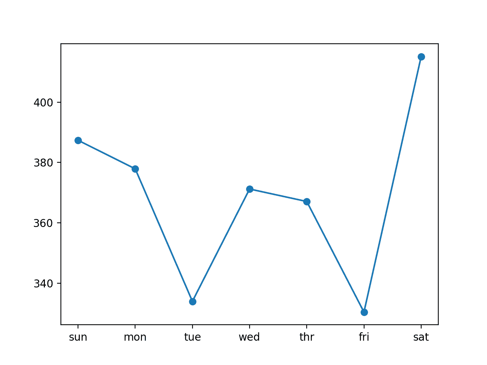
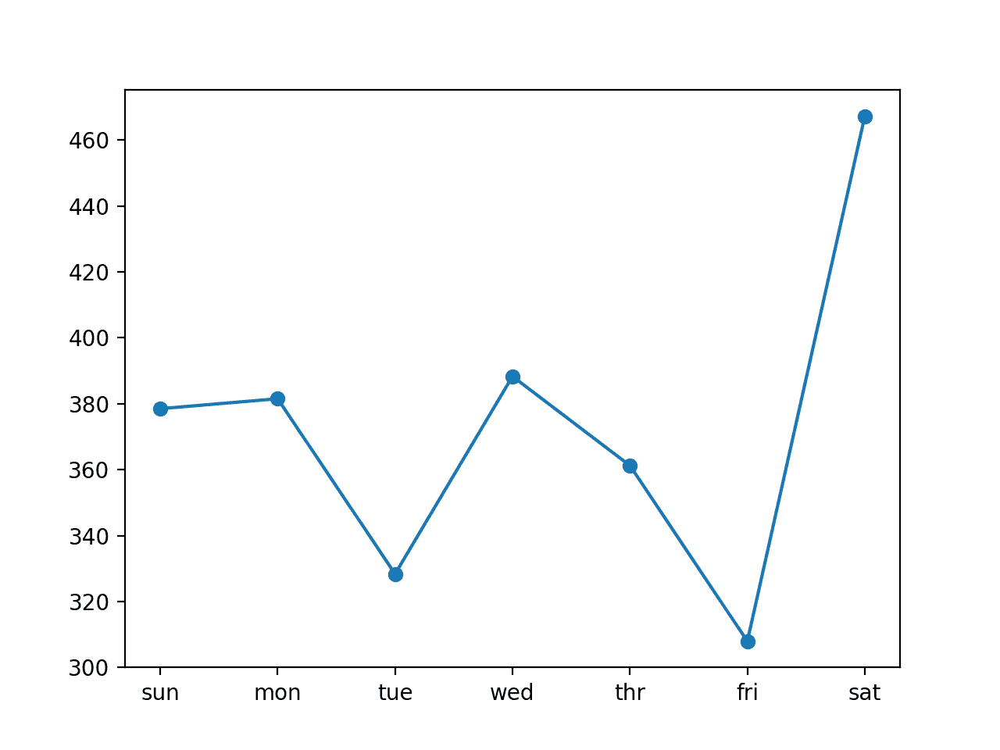

# 如何开发 LSTM 模型用于家庭用电的多步时间序列预测

> 原文： [https://machinelearningmastery.com/how-to-develop-lstm-models-for-multi-step-time-series-forecasting-of-household-power-consumption/](https://machinelearningmastery.com/how-to-develop-lstm-models-for-multi-step-time-series-forecasting-of-household-power-consumption/)

鉴于智能电表的兴起以及太阳能电池板等发电技术的广泛采用，可提供大量的用电数据。

该数据代表了多变量时间序列的功率相关变量，而这些变量又可用于建模甚至预测未来的电力消耗。

与其他机器学习算法不同，长期短期记忆循环神经网络能够自动学习序列数据的特征，支持多变量数据，并且可以输出可用于多步预测的可变长度序列。

在本教程中，您将了解如何开发长期短期记忆循环神经网络，用于家庭功耗的多步时间序列预测。

完成本教程后，您将了解：

*   如何开发和评估用于多步时间序列预测的单变量和多变量编码器 - 解码器 LSTM。
*   如何开发和评估用于多步时间序列预测的 CNN-LSTM 编码器 - 解码器模型。
*   如何开发和评估用于多步时间序列预测的 ConvLSTM 编码器 - 解码器模型。

让我们开始吧。

**注 1** ：这篇文章摘录自：“[深度学习时间序列预测](https://machinelearningmastery.com/deep-learning-for-time-series-forecasting/)”。看一下，如果您想获得更多关于在时间序列预测问题上充分利用深度学习方法的分步教程。

**Note2** ：这是一个相当高级的教程，如果你不熟悉 Python 中的时间序列预测，[从这里开始](https://machinelearningmastery.com/start-here/#timeseries)。如果您不熟悉时间序列的深度学习，[从这里开始](https://machinelearningmastery.com/start-here/#deep_learning_time_series)。如果你真的想开始使用时间序列的 LSTM，[从这里开始](https://machinelearningmastery.com/how-to-develop-lstm-models-for-time-series-forecasting/)。


如何开发 LSTM 模型的多步时间序列预测家庭用电量
照片由 [Ian Muttoo](https://www.flickr.com/photos/imuttoo/4257813689/) ，保留一些权利。

## 教程概述

本教程分为九个部分;他们是：

1.  问题描述
2.  加载并准备数据集
3.  模型评估
4.  用于多步预测的 LSTM
5.  具有单变量输入和向量输出的 LSTM 模型
6.  具有单变量输入的编码器 - 解码器 LSTM 模型
7.  具有多变量输入的编码器 - 解码器 LSTM 模型
8.  具有单变量输入的 CNN-LSTM 编码器 - 解码器模型
9.  具有单变量输入的 ConvLSTM 编码器 - 解码器模型

### Python 环境

本教程假设您安装了 Python SciPy 环境，理想情况下使用 Python 3。

您必须安装带有 TensorFlow 或 Theano 后端的 Keras（2.2 或更高版本）。

本教程还假设您安装了 scikit-learn，Pandas，NumPy 和 Matplotlib。

如果您需要有关环境的帮助，请参阅本教程：

*   [如何为机器学习和深度学习设置 Python 环境](https://machinelearningmastery.com/setup-python-environment-machine-learning-deep-learning-anaconda/)

本教程不需要 GPU，但您可以在 Amazon Web Services 上以低成本方式访问 GPU。在本教程中学习如何：

*   [如何设置亚马逊 AWS EC2 GPU 以训练 Keras 深度学习模型](https://machinelearningmastery.com/develop-evaluate-large-deep-learning-models-keras-amazon-web-services/)

让我们潜入。

## 问题描述

'[家庭用电量](https://archive.ics.uci.edu/ml/datasets/individual+household+electric+power+consumption)'数据集是一个多变量时间序列数据集，描述了四年内单个家庭的用电量。

有关此数据集的更多信息，请参阅帖子：

*   [如何加载和探索家庭用电数据](https://machinelearningmastery.com/how-to-load-and-explore-household-electricity-usage-data/)

该数据是在 2006 年 12 月至 2010 年 11 月之间收集的，并且每分钟收集家庭内的能耗观察结果。

它是一个多变量系列，由七个变量组成（除日期和时间外）;他们是：

*   **global_active_power** ：家庭消耗的总有功功率（千瓦）。
*   **global_reactive_power** ：家庭消耗的总无功功率（千瓦）。
*   **电压**：平均电压（伏特）。
*   **global_intensity** ：平均电流强度（安培）。
*   **sub_metering_1** ：厨房的有功电能（瓦特小时的有功电能）。
*   **sub_metering_2** ：用于洗衣的有功能量（瓦特小时的有功电能）。
*   **sub_metering_3** ：气候控制系统的有功电能（瓦特小时的有功电能）。

有功和无功电能参考[交流电](https://en.wikipedia.org/wiki/AC_power)的技术细节。

可以通过从总活动能量中减去三个定义的子计量变量的总和来创建第四个子计量变量，如下所示：

```py
sub_metering_remainder = (global_active_power * 1000 / 60) - (sub_metering_1 + sub_metering_2 + sub_metering_3)
```

## 加载并准备数据集

数据集可以从 UCI 机器学习库下载为单个 20 兆字节的.zip 文件：

*   [household_power_consumption.zip](https://archive.ics.uci.edu/ml/machine-learning-databases/00235/household_power_consumption.zip)

下载数据集并将其解压缩到当前工作目录中。您现在将拥有大约 127 兆字节的文件“`household_power_consumption.txt`”并包含所有观察结果。

我们可以使用`read_csv()`函数来加载数据，并将前两列合并到一个日期时间列中，我们可以将其用作索引。

```py
# load all data
dataset = read_csv('household_power_consumption.txt', sep=';', header=0, low_memory=False, infer_datetime_format=True, parse_dates={'datetime':[0,1]}, index_col=['datetime'])
```

接下来，我们可以用'_ 标记所有[缺失值](https://machinelearningmastery.com/handle-missing-timesteps-sequence-prediction-problems-python/)？_ '具有`NaN`值的字符，这是一个浮点数。

这将允许我们将数据作为一个浮点值数组而不是混合类型（效率较低）。

```py
# mark all missing values
dataset.replace('?', nan, inplace=True)
# make dataset numeric
dataset = dataset.astype('float32')
```

我们还需要填写缺失值，因为它们已被标记。

一种非常简单的方法是从前一天的同一时间复制观察。我们可以在一个名为`fill_missing()`的函数中实现它，该函数将从 24 小时前获取数据的 NumPy 数组并复制值。

```py
# fill missing values with a value at the same time one day ago
def fill_missing(values):
	one_day = 60 * 24
	for row in range(values.shape[0]):
		for col in range(values.shape[1]):
			if isnan(values[row, col]):
				values[row, col] = values[row - one_day, col]
```

我们可以将此函数直接应用于 DataFrame 中的数据。

```py
# fill missing
fill_missing(dataset.values)
```

现在，我们可以使用上一节中的计算创建一个包含剩余子计量的新列。

```py
# add a column for for the remainder of sub metering
values = dataset.values
dataset['sub_metering_4'] = (values[:,0] * 1000 / 60) - (values[:,4] + values[:,5] + values[:,6])
```

我们现在可以将清理后的数据集版本保存到新文件中;在这种情况下，我们只需将文件扩展名更改为.csv，并将数据集保存为“`household_power_consumption.csv`”。

```py
# save updated dataset
dataset.to_csv('household_power_consumption.csv')
```

将所有这些结合在一起，下面列出了加载，清理和保存数据集的完整示例。

```py
# load and clean-up data
from numpy import nan
from numpy import isnan
from pandas import read_csv
from pandas import to_numeric

# fill missing values with a value at the same time one day ago
def fill_missing(values):
	one_day = 60 * 24
	for row in range(values.shape[0]):
		for col in range(values.shape[1]):
			if isnan(values[row, col]):
				values[row, col] = values[row - one_day, col]

# load all data
dataset = read_csv('household_power_consumption.txt', sep=';', header=0, low_memory=False, infer_datetime_format=True, parse_dates={'datetime':[0,1]}, index_col=['datetime'])
# mark all missing values
dataset.replace('?', nan, inplace=True)
# make dataset numeric
dataset = dataset.astype('float32')
# fill missing
fill_missing(dataset.values)
# add a column for for the remainder of sub metering
values = dataset.values
dataset['sub_metering_4'] = (values[:,0] * 1000 / 60) - (values[:,4] + values[:,5] + values[:,6])
# save updated dataset
dataset.to_csv('household_power_consumption.csv')
```

运行该示例将创建新文件'`household_power_consumption.csv`'，我们可以将其用作建模项目的起点。

## 模型评估

在本节中，我们将考虑如何开发和评估家庭电力数据集的预测模型。

本节分为四个部分;他们是：

1.  问题框架
2.  评估指标
3.  训练和测试集
4.  前瞻性验证

### 问题框架

有许多方法可以利用和探索家庭用电量数据集。

在本教程中，我们将使用这些数据来探索一个非常具体的问题;那是：

> 鉴于最近的耗电量，未来一周的预期耗电量是多少？

这要求预测模型预测未来七天每天的总有功功率。

从技术上讲，考虑到多个预测步骤，这个问题的框架被称为多步骤时间序列预测问题。利用多个输入变量的模型可以称为多变量多步时间序列预测模型。

这种类型的模型在规划支出方面可能有助于家庭。在供应方面，它也可能有助于规划特定家庭的电力需求。

数据集的这种框架还表明，将每分钟功耗的观察结果下采样到每日总数是有用的。这不是必需的，但考虑到我们对每天的总功率感兴趣，这是有道理的。

我们可以使用 pandas DataFrame 上的 [resample（）函数](https://pandas.pydata.org/pandas-docs/stable/generated/pandas.DataFrame.resample.html)轻松实现这一点。使用参数'`D`'调用此函数允许按日期时间索引的加载数据按天分组（[查看所有偏移别名](http://pandas.pydata.org/pandas-docs/stable/timeseries.html#offset-aliases)）。然后，我们可以计算每天所有观测值的总和，并为八个变量中的每一个创建每日耗电量数据的新数据集。

下面列出了完整的示例。

```py
# resample minute data to total for each day
from pandas import read_csv
# load the new file
dataset = read_csv('household_power_consumption.csv', header=0, infer_datetime_format=True, parse_dates=['datetime'], index_col=['datetime'])
# resample data to daily
daily_groups = dataset.resample('D')
daily_data = daily_groups.sum()
# summarize
print(daily_data.shape)
print(daily_data.head())
# save
daily_data.to_csv('household_power_consumption_days.csv')
```

运行该示例将创建一个新的每日总功耗数据集，并将结果保存到名为“`household_power_consumption_days.csv`”的单独文件中。

我们可以将其用作数据集，用于拟合和评估所选问题框架的预测模型。

### 评估指标

预测将包含七个值，一个用于一周中的每一天。

多步预测问题通常分别评估每个预测时间步长。这有助于以下几个原因：

*   在特定提前期评论技能（例如+1 天 vs +3 天）。
*   在不同的交付时间基于他们的技能对比模型（例如，在+1 天的模型和在日期+5 的模型良好的模型）。

总功率的单位是千瓦，并且具有也在相同单位的误差度量将是有用的。均方根误差（RMSE）和平均绝对误差（MAE）都符合这个要求，尽管 RMSE 更常用，将在本教程中采用。与 MAE 不同，RMSE 更能预测预测误差。

此问题的表现指标是从第 1 天到第 7 天的每个提前期的 RMSE。

作为捷径，使用单个分数总结模型的表现以帮助模型选择可能是有用的。

可以使用的一个可能的分数是所有预测天数的 RMSE。

下面的函数`evaluate_forecasts()`将实现此行为并基于多个七天预测返回模型的表现。

```py
# evaluate one or more weekly forecasts against expected values
def evaluate_forecasts(actual, predicted):
	scores = list()
	# calculate an RMSE score for each day
	for i in range(actual.shape[1]):
		# calculate mse
		mse = mean_squared_error(actual[:, i], predicted[:, i])
		# calculate rmse
		rmse = sqrt(mse)
		# store
		scores.append(rmse)
	# calculate overall RMSE
	s = 0
	for row in range(actual.shape[0]):
		for col in range(actual.shape[1]):
			s += (actual[row, col] - predicted[row, col])**2
	score = sqrt(s / (actual.shape[0] * actual.shape[1]))
	return score, scores
```

运行该函数将首先返回整个 RMSE，无论白天，然后每天返回一系列 RMSE 分数。

### 训练和测试集

我们将使用前三年的数据来训练预测模型和评估模型的最后一年。

给定数据集中的数据将分为标准周。这些是从周日开始到周六结束的周。

这是使用所选模型框架的现实且有用的方法，其中可以预测未来一周的功耗。它也有助于建模，其中模型可用于预测特定日期（例如星期三）或整个序列。

我们将数据拆分为标准周，从测试数据集向后工作。

数据的最后一年是 2010 年，2010 年的第一个星期日是 1 月 3 日。数据于 2010 年 11 月中旬结束，数据中最接近的最后一个星期六是 11 月 20 日。这给出了 46 周的测试数据。

下面提供了测试数据集的每日数据的第一行和最后一行以供确认。

```py
2010-01-03,2083.4539999999984,191.61000000000055,350992.12000000034,8703.600000000033,3842.0,4920.0,10074.0,15888.233355799992
...
2010-11-20,2197.006000000004,153.76800000000028,346475.9999999998,9320.20000000002,4367.0,2947.0,11433.0,17869.76663959999
```

每日数据从 2006 年底开始。

数据集中的第一个星期日是 12 月 17 日，这是第二行数据。

将数据组织到标准周内为训练预测模型提供了 159 个完整的标准周。

```py
2006-12-17,3390.46,226.0059999999994,345725.32000000024,14398.59999999998,2033.0,4187.0,13341.0,36946.66673200004
...
2010-01-02,1309.2679999999998,199.54600000000016,352332.8399999997,5489.7999999999865,801.0,298.0,6425.0,14297.133406600002
```

下面的函数`split_dataset()`将每日数据拆分为训练集和测试集，并将每个数据组织成标准周。

使用特定行偏移来使用数据集的知识来分割数据。然后使用 NumPy [split（）函数](https://docs.scipy.org/doc/numpy/reference/generated/numpy.split.html)将分割数据集组织成每周数据。

```py
# split a univariate dataset into train/test sets
def split_dataset(data):
	# split into standard weeks
	train, test = data[1:-328], data[-328:-6]
	# restructure into windows of weekly data
	train = array(split(train, len(train)/7))
	test = array(split(test, len(test)/7))
	return train, test
```

我们可以通过加载每日数据集并打印训练和测试集的第一行和最后一行数据来测试此功能，以确认它们符合上述预期。

完整的代码示例如下所示。

```py
# split into standard weeks
from numpy import split
from numpy import array
from pandas import read_csv

# split a univariate dataset into train/test sets
def split_dataset(data):
	# split into standard weeks
	train, test = data[1:-328], data[-328:-6]
	# restructure into windows of weekly data
	train = array(split(train, len(train)/7))
	test = array(split(test, len(test)/7))
	return train, test

# load the new file
dataset = read_csv('household_power_consumption_days.csv', header=0, infer_datetime_format=True, parse_dates=['datetime'], index_col=['datetime'])
train, test = split_dataset(dataset.values)
# validate train data
print(train.shape)
print(train[0, 0, 0], train[-1, -1, 0])
# validate test
print(test.shape)
print(test[0, 0, 0], test[-1, -1, 0])
```

运行该示例表明，训练数据集确实有 159 周的数据，而测试数据集有 46 周。

我们可以看到，第一行和最后一行的训练和测试数据集的总有效功率与我们定义为每组标准周界限的特定日期的数据相匹配。

```py
(159, 7, 8)
3390.46 1309.2679999999998
(46, 7, 8)
2083.4539999999984 2197.006000000004
```

### 前瞻性验证

将使用称为[前进验证](https://machinelearningmastery.com/backtest-machine-learning-models-time-series-forecasting/)的方案评估模型。

这是需要模型进行一周预测的地方，然后该模型的实际数据可用于模型，以便它可以用作在随后一周做出预测的基础。这对于如何在实践中使用模型以及对模型有益而使其能够利用最佳可用数据都是现实的。

我们可以通过分离输入数据和输出/预测数据来证明这一点。

```py
Input, 						Predict
[Week1]						Week2
[Week1 + Week2]				Week3
[Week1 + Week2 + Week3]		Week4
...
```

评估该数据集上的预测模型的前瞻性验证方法在下面提供名为 _evaluate_model（）_。

标准周格式的训练和测试数据集作为参数提供给函数。提供了另一个参数 n_input，用于定义模型将用作输入以做出预测的先前观察的数量。

调用两个新函数：一个用于根据称为`build_model()`的训练数据构建模型，另一个用于使用该模型对每个新标准周做出预测，称为 _forecast（）_。这些将在后续章节中介绍。

我们正在使用神经网络，因此，它们通常很难训练，但很快就能进行评估。这意味着模型的首选用法是在历史数据上构建一次，并使用它们来预测前向验证的每个步骤。模型在评估期间是静态的（即未更新）。

这与其他模型不同，这些模型可以更快地进行训练，在新数据可用时，可以重新拟合或更新模型的每个步骤。有了足够的资源，就可以通过这种方式使用神经网络，但在本教程中我们不会这样做。

下面列出了完整的`evaluate_model()`函数。

```py
# evaluate a single model
def evaluate_model(train, test, n_input):
	# fit model
	model = build_model(train, n_input)
	# history is a list of weekly data
	history = [x for x in train]
	# walk-forward validation over each week
	predictions = list()
	for i in range(len(test)):
		# predict the week
		yhat_sequence = forecast(model, history, n_input)
		# store the predictions
		predictions.append(yhat_sequence)
		# get real observation and add to history for predicting the next week
		history.append(test[i, :])
	# evaluate predictions days for each week
	predictions = array(predictions)
	score, scores = evaluate_forecasts(test[:, :, 0], predictions)
	return score, scores
```

一旦我们对模型进行评估，我们就可以总结表现。

以下名为`summarize_scores()`的函数将模型的表现显示为单行，以便与其他模型进行比较。

```py
# summarize scores
def summarize_scores(name, score, scores):
	s_scores = ', '.join(['%.1f' % s for s in scores])
	print('%s: [%.3f] %s' % (name, score, s_scores))
```

我们现在已经开始评估数据集上的预测模型的所有元素。

## 用于多步预测的 LSTM

循环神经网络或 RNN 专门用于工作，学习和预测序列数据。

循环神经网络是神经网络，其中来自一个时间步长的网络输出在随后的时间步骤中被提供作为输入。这允许模型基于当前时间步长的输入和对先前时间步骤中输出的直接知识来决定预测什么。

也许最成功和最广泛使用的 RNN 是长期短期记忆网络，或简称 LSTM。它之所以成功，是因为它克服了训练复现神经网络所带来的挑战，从而产生了稳定的模型。除了利用先前时间步的输出的循环连接之外，LSTM 还具有内部存储器，其操作类似于局部变量，允许它们在输入序列上累积状态。

有关 Recurrent Neural Networks 的更多信息，请参阅帖子：

*   [深度学习的循环神经网络崩溃课程](https://machinelearningmastery.com/crash-course-recurrent-neural-networks-deep-learning/)

有关长期短期内存网络的更多信息，请参阅帖子：

*   [专家对长短期记忆网络的简要介绍](https://machinelearningmastery.com/gentle-introduction-long-short-term-memory-networks-experts/)

LSTM 在多步时间序列预测方面具有许多优势;他们是：

*   **序列的原生支持**。 LSTM 是一种循环网络，因此设计用于将序列数据作为输入，不像其他模型，其中滞后观察必须作为输入特征呈现。
*   **多变量输入**。 LSTM 直接支持多变量输入的多个并行输入序列，不同于其中多变量输入以平面结构呈现的其他模型。
*   **向量输出**。与其他神经网络一样，LSTM 能够将输入数据直接映射到可以表示多个输出时间步长的输出向量。

此外，已经开发了专门设计用于进行多步序列预测的专用架构，通常称为序列到序列预测，或简称为 seq2seq。这很有用，因为多步时间序列预测是一种 seq2seq 预测。

针对 seq2seq 问题设计的循环神经网络架构的示例是编码器 - 解码器 LSTM。

编码器 - 解码器 LSTM 是由两个子模型组成的模型：一个称为编码器，其读取输入序列并将其压缩为固定长度的内部表示，以及称为解码器的输出模型，其解释内部表示并使用它预测输出序列。

事实证明，序列预测的编码器 - 解码器方法比直接输出向量更有效，并且是首选方法。

通常，已经发现 LSTM 在自回归类型问题上不是非常有效。这些是预测下一个时间步长是最近时间步长的函数。

有关此问题的更多信息，请参阅帖子：

*   [关于 LSTM 对时间序列预测的适用性](https://machinelearningmastery.com/suitability-long-short-term-memory-networks-time-series-forecasting/)

一维卷积神经网络（CNN）已证明在自动学习输入序列的特征方面是有效的。

一种流行的方法是将 CNN 与 LSTM 组合，其中 CNN 作为编码器来学习输入数据的子序列的特征，这些子序列作为 LSTM 的时间步长提供。该架构称为 [CNN-LSTM](https://machinelearningmastery.com/cnn-long-short-term-memory-networks/) 。

有关此体系结构的更多信息，请参阅帖子：

*   [CNN 长短期记忆网络](https://machinelearningmastery.com/cnn-long-short-term-memory-networks/)

CNN LSTM 架构的功率变化是 ConvLSTM，它直接在 LSTM 的单元内使用输入子序列的卷积读取。事实证明，这种方法对于时间序列分类非常有效，并且可以适用于多步骤时间序列预测。

在本教程中，我们将探索一套用于多步时间序列预测的 LSTM 架构。具体来说，我们将看看如何开发以下模型：

*   **LSTM** 模型，带有向量输出，用于多变量预测，具有单变量输入数据。
*   **编码器 - 解码器 LSTM** 模型，用于使用单变量输入数据进行多步预测。
*   **编码器 - 解码器 LSTM** 模型，用于多变量输入数据的多步预测。
*   **CNN-LSTM 编码器 - 解码器**模型，用于使用单变量输入数据进行多步预测。
*   **ConvLSTM 编码器 - 解码器**模型，用于使用单变量输入数据进行多步预测。

如果您不熟悉使用 LSTM 进行时间序列预测，我强烈推荐这篇文章：

*   [如何为时间序列预测开发 LSTM 模型](https://machinelearningmastery.com/how-to-develop-lstm-models-for-time-series-forecasting/)

将在家庭电力预测问题上开发和演示这些模型。如果一个模型比一个朴素的模型更好地实现表现，那么该模型被认为是技术性的，在 7 天的预测中，该模型的总体 RMSE 约为 465 千瓦。

我们不会专注于调整这些模型以实现最佳表现;相反，与朴素的预测相比，我们将停止熟练的模型。选择的结构和超参数通过一些试验和错误来选择。分数应仅作为示例，而不是研究问题的最佳模型或配置。

鉴于模型的随机性，[良好实践](https://machinelearningmastery.com/evaluate-skill-deep-learning-models/)是多次评估给定模型并报告测试数据集的平均表现。为了简洁起见并保持代码简单，我们将在本教程中介绍单行模型。

我们无法知道哪种方法对于给定的多步预测问题最有效。探索一套方法是个好主意，以便发现哪些方法最适合您的特定数据集。

## 具有单变量输入和向量输出的 LSTM 模型

我们将从开发一个简单或香草 LSTM 模型开始，该模型读取每日总功耗的天数，并预测每日功耗的下一个标准周的向量输出。

这将为后续章节中开发的更精细的模型奠定基础。

用作输入的前几天定义了 LSTM 将读取并学习提取特征的数据的一维（1D）子序列。关于此输入的大小和性质的一些想法包括：

*   所有前几天，最多数年的数据。
*   前 7 天。
*   前两周。
*   前一个月。
*   前一年。
*   前一周和一周从一年前预测。

没有正确的答案;相反，可以测试每种方法和更多方法，并且可以使用模型的表现来选择导致最佳模型表现的输入的性质。

这些选择定义了一些东西：

*   如何准备训练数据以适应模型。
*   如何准备测试数据以评估模型。
*   如何使用该模型在未来使用最终模型做出预测。

一个好的起点是使用前七天。

LSTM 模型期望数据具有以下形状：

```py
[samples, timesteps, features]
```

一个样本将包含七个时间步骤，其中一个功能用于每日总耗电量的七天。

训练数据集有 159 周的数据，因此训练数据集的形状为：

```py
[159, 7, 1]
```

这是一个好的开始。此格式的数据将使用先前的标准周来预测下一个标准周。一个问题是训练神经网络的 159 个实例并不是很多。

创建更多训练数据的方法是在训练期间更改问题，以预测前七天的下一个七天，无论标准周。

这仅影响训练数据，并且测试问题保持不变：预测给定前一标准周的下一个标准周的每日功耗。

这将需要一点准备训练数据。

训练数据在标准周内提供八个变量，特别是形状[ _159,7,8_ ]。第一步是展平数据，以便我们有八个时间序列序列。

```py
# flatten data
data = train.reshape((train.shape[0]*train.shape[1], train.shape[2]))
```

然后，我们需要迭代时间步骤并将数据划分为重叠窗口;每次迭代沿着一个时间步移动并预测随后的七天。

例如：

```py
Input, Output
[d01, d02, d03, d04, d05, d06, d07], [d08, d09, d10, d11, d12, d13, d14]
[d02, d03, d04, d05, d06, d07, d08], [d09, d10, d11, d12, d13, d14, d15]
...
```

我们可以通过跟踪输入和输出的开始和结束索引来实现这一点，因为我们在时间步长方面迭代展平数据的长度。

我们也可以通过参数化输入和输出的数量来实现这一点（例如`n_input`，`n_out`），这样您就可以尝试不同的值或根据自己的问题进行调整。

下面是一个名为`to_supervised()`的函数，它采用周（历史）列表和用作输入和输出的时间步数，并以重叠移动窗口格式返回数据。

```py
# convert history into inputs and outputs
def to_supervised(train, n_input, n_out=7):
	# flatten data
	data = train.reshape((train.shape[0]*train.shape[1], train.shape[2]))
	X, y = list(), list()
	in_start = 0
	# step over the entire history one time step at a time
	for _ in range(len(data)):
		# define the end of the input sequence
		in_end = in_start + n_input
		out_end = in_end + n_out
		# ensure we have enough data for this instance
		if out_end < len(data):
			x_input = data[in_start:in_end, 0]
			x_input = x_input.reshape((len(x_input), 1))
			X.append(x_input)
			y.append(data[in_end:out_end, 0])
		# move along one time step
		in_start += 1
	return array(X), array(y)
```

当我们在整个训练数据集上运行此函数时，我们将 159 个样本转换为 1,099 个;具体地，变换的数据集具有形状 _X = [1099,7,1]_ 和 _y = [1099,7]。_

接下来，我们可以在训练数据上定义和拟合 LSTM 模型。

这个多步骤时间序列预测问题是一个自回归。这意味着它可能最好建模，其中接下来的七天是先前时间步骤的观测功能。这和相对少量的数据意味着需要一个小型号。

我们将开发一个具有 200 个单元的单个隐藏 LSTM 层的模型。隐藏层中的单元数与输入序列中的时间步数无关。 LSTM 层之后是具有 200 个节点的完全连接层，其将解释 LSTM 层学习的特征。最后，输出层将直接预测具有七个元素的向量，输出序列中每天一个元素。

我们将使用均方误差损失函数，因为它与我们选择的 RMSE 误差度量非常匹配。我们将使用随机梯度下降的高效 [Adam 实现](https://machinelearningmastery.com/adam-optimization-algorithm-for-deep-learning/)，并将模型拟合 70 个时期，批量大小为 16。

小批量大小和算法的随机性意味着相同的模型将在每次训练时学习输入到输出的略微不同的映射。这意味着评估模型时结果可能会有所不同。您可以尝试多次运行模型并计算模型表现的平均值。

下面的`build_model()`准备训练数据，定义模型，并将模型拟合到训练数据上，使拟合模型准备好做出预测。

```py
# train the model
def build_model(train, n_input):
	# prepare data
	train_x, train_y = to_supervised(train, n_input)
	# define parameters
	verbose, epochs, batch_size = 0, 70, 16
	n_timesteps, n_features, n_outputs = train_x.shape[1], train_x.shape[2], train_y.shape[1]
	# define model
	model = Sequential()
	model.add(LSTM(200, activation='relu', input_shape=(n_timesteps, n_features)))
	model.add(Dense(100, activation='relu'))
	model.add(Dense(n_outputs))
	model.compile(loss='mse', optimizer='adam')
	# fit network
	model.fit(train_x, train_y, epochs=epochs, batch_size=batch_size, verbose=verbose)
	return model
```

现在我们知道如何拟合模型，我们可以看看如何使用模型做出预测。

通常，模型期望数据在做出预测时具有相同的三维形状。

在这种情况下，输入模式的预期形状是一个样本，每天消耗的一个功能的七天：

```py
[1, 7, 1]
```

在对测试集做出预测时以及在将来使用最终模型做出预测时，数据必须具有此形状。如果在输入天数为 14 时更改数字，则必须相应更改训练数据的形状和做出预测时新样本的形状，以便有 14 个时间步长。在使用模型时，您必须继续使用它。

我们正在使用前向验证来评估模型，如上一节中所述。

这意味着我们有前一周的观察结果，以预测下周。这些被收集到一系列称为历史的标准周。

为了预测下一个标准周，我们需要检索观察的最后几天。与训练数据一样，我们必须首先展平历史数据以删除每周结构，以便最终得到八个平行时间序列。

```py
# flatten data
data = data.reshape((data.shape[0]*data.shape[1], data.shape[2]))
```

接下来，我们需要检索每日总功耗的最后七天（特征索引 0）。

我们将对训练数据进行参数化，以便将来可以修改模型输入的前几天的数量。

```py
# retrieve last observations for input data
input_x = data[-n_input:, 0]
```

接下来，我们将输入重塑为预期的三维结构。

```py
# reshape into [1, n_input, 1]
input_x = input_x.reshape((1, len(input_x), 1))
```

然后，我们使用拟合模型和输入数据做出预测，并检索七天输出的向量。

```py
# forecast the next week
yhat = model.predict(input_x, verbose=0)
# we only want the vector forecast
yhat = yhat[0]
```

下面的`forecast()`函数实现了这个功能，并将模型拟合到训练数据集，到目前为止观察到的数据历史以及模型预期的输入时间步数。

```py
# make a forecast
def forecast(model, history, n_input):
	# flatten data
	data = array(history)
	data = data.reshape((data.shape[0]*data.shape[1], data.shape[2]))
	# retrieve last observations for input data
	input_x = data[-n_input:, 0]
	# reshape into [1, n_input, 1]
	input_x = input_x.reshape((1, len(input_x), 1))
	# forecast the next week
	yhat = model.predict(input_x, verbose=0)
	# we only want the vector forecast
	yhat = yhat[0]
	return yhat
```

而已;我们现在拥有了所需的一切，我们需要通过 LSTM 模型对单日数据集的每日总功耗进行多步时间序列预测。

我们可以将所有这些结合在一起。下面列出了完整的示例。

```py
# univariate multi-step lstm
from math import sqrt
from numpy import split
from numpy import array
from pandas import read_csv
from sklearn.metrics import mean_squared_error
from matplotlib import pyplot
from keras.models import Sequential
from keras.layers import Dense
from keras.layers import Flatten
from keras.layers import LSTM

# split a univariate dataset into train/test sets
def split_dataset(data):
	# split into standard weeks
	train, test = data[1:-328], data[-328:-6]
	# restructure into windows of weekly data
	train = array(split(train, len(train)/7))
	test = array(split(test, len(test)/7))
	return train, test

# evaluate one or more weekly forecasts against expected values
def evaluate_forecasts(actual, predicted):
	scores = list()
	# calculate an RMSE score for each day
	for i in range(actual.shape[1]):
		# calculate mse
		mse = mean_squared_error(actual[:, i], predicted[:, i])
		# calculate rmse
		rmse = sqrt(mse)
		# store
		scores.append(rmse)
	# calculate overall RMSE
	s = 0
	for row in range(actual.shape[0]):
		for col in range(actual.shape[1]):
			s += (actual[row, col] - predicted[row, col])**2
	score = sqrt(s / (actual.shape[0] * actual.shape[1]))
	return score, scores

# summarize scores
def summarize_scores(name, score, scores):
	s_scores = ', '.join(['%.1f' % s for s in scores])
	print('%s: [%.3f] %s' % (name, score, s_scores))

# convert history into inputs and outputs
def to_supervised(train, n_input, n_out=7):
	# flatten data
	data = train.reshape((train.shape[0]*train.shape[1], train.shape[2]))
	X, y = list(), list()
	in_start = 0
	# step over the entire history one time step at a time
	for _ in range(len(data)):
		# define the end of the input sequence
		in_end = in_start + n_input
		out_end = in_end + n_out
		# ensure we have enough data for this instance
		if out_end < len(data):
			x_input = data[in_start:in_end, 0]
			x_input = x_input.reshape((len(x_input), 1))
			X.append(x_input)
			y.append(data[in_end:out_end, 0])
		# move along one time step
		in_start += 1
	return array(X), array(y)

# train the model
def build_model(train, n_input):
	# prepare data
	train_x, train_y = to_supervised(train, n_input)
	# define parameters
	verbose, epochs, batch_size = 0, 70, 16
	n_timesteps, n_features, n_outputs = train_x.shape[1], train_x.shape[2], train_y.shape[1]
	# define model
	model = Sequential()
	model.add(LSTM(200, activation='relu', input_shape=(n_timesteps, n_features)))
	model.add(Dense(100, activation='relu'))
	model.add(Dense(n_outputs))
	model.compile(loss='mse', optimizer='adam')
	# fit network
	model.fit(train_x, train_y, epochs=epochs, batch_size=batch_size, verbose=verbose)
	return model

# make a forecast
def forecast(model, history, n_input):
	# flatten data
	data = array(history)
	data = data.reshape((data.shape[0]*data.shape[1], data.shape[2]))
	# retrieve last observations for input data
	input_x = data[-n_input:, 0]
	# reshape into [1, n_input, 1]
	input_x = input_x.reshape((1, len(input_x), 1))
	# forecast the next week
	yhat = model.predict(input_x, verbose=0)
	# we only want the vector forecast
	yhat = yhat[0]
	return yhat

# evaluate a single model
def evaluate_model(train, test, n_input):
	# fit model
	model = build_model(train, n_input)
	# history is a list of weekly data
	history = [x for x in train]
	# walk-forward validation over each week
	predictions = list()
	for i in range(len(test)):
		# predict the week
		yhat_sequence = forecast(model, history, n_input)
		# store the predictions
		predictions.append(yhat_sequence)
		# get real observation and add to history for predicting the next week
		history.append(test[i, :])
	# evaluate predictions days for each week
	predictions = array(predictions)
	score, scores = evaluate_forecasts(test[:, :, 0], predictions)
	return score, scores

# load the new file
dataset = read_csv('household_power_consumption_days.csv', header=0, infer_datetime_format=True, parse_dates=['datetime'], index_col=['datetime'])
# split into train and test
train, test = split_dataset(dataset.values)
# evaluate model and get scores
n_input = 7
score, scores = evaluate_model(train, test, n_input)
# summarize scores
summarize_scores('lstm', score, scores)
# plot scores
days = ['sun', 'mon', 'tue', 'wed', 'thr', 'fri', 'sat']
pyplot.plot(days, scores, marker='o', label='lstm')
pyplot.show()
```

运行该示例适合并评估模型，在所有七天内打印整体 RMSE，以及每个提前期的每日 RMSE。

鉴于算法的随机性，您的具体结果可能会有所不同。您可能想尝试几次运行该示例。

我们可以看到，在这种情况下，与朴素的预测相比，该模型是巧妙的，实现了大约 399 千瓦的总体 RMSE，小于 465 千瓦的朴素模型。

```py
lstm: [399.456] 419.4, 422.1, 384.5, 395.1, 403.9, 317.7, 441.5
```

还创建了每日 RMSE 的图。

该图显示，周二和周五可能比其他日子更容易预测，也许星期六在标准周结束时是最难预测的日子。


具有向量输出和 7 天输入的单变量 LSTM 的每日 RMSE 线图

我们可以通过更改`n_input`变量来增加用作 7 到 14 之间输入的前几天的数量。

```py
# evaluate model and get scores
n_input = 14
```

使用此更改重新运行示例首先会打印模型表现的摘要。

具体结果可能有所不同;尝试运行几次这个例子。

在这种情况下，我们可以看到整体 RMSE 进一步下降到大约 370 千瓦，这表明进一步调整输入大小以及模型中节点的数量可能会带来更好的表现。

```py
lstm: [370.028] 387.4, 377.9, 334.0, 371.2, 367.1, 330.4, 415.1
```

比较每日 RMSE 分数，我们看到一些更好，有些比使用七天输入更差。

这可以建议以某种方式使用两个不同大小的输入的益处，例如两种方法的集合或者可能是以不同方式读取训练数据的单个模型（例如，多头模型）。



具有向量输出和 14 天输入的单变量 LSTM 每日 RMSE 的线图

## 具有单变量输入的编码器 - 解码器 LSTM 模型

在本节中，我们可以更新 vanilla LSTM 以使用编码器 - 解码器模型。

这意味着模型不会直接输出向量序列。相反，该模型将包括两个子模型，即用于读取和编码输入序列的编码器，以及将读取编码输入序列并对输出序列中的每个元素进行一步预测的解码器。

差异是微妙的，因为实际上两种方法实际上都预测了序列输出。

重要的区别在于，在解码器中使用 LSTM 模型，允许它既知道序列中前一天的预测值，又在输出序列时累积内部状态。

让我们仔细看看这个模型是如何定义的。

和以前一样，我们定义了一个包含 200 个单位的 LSTM 隐藏层。这是解码器模型，它将读取输入序列并输出一个 200 元素向量（每个单元一个输出），用于捕获输入序列中的特征。我们将使用 14 天的总功耗作为输入。

```py
# define model
model = Sequential()
model.add(LSTM(200, activation='relu', input_shape=(n_timesteps, n_features)))
```

我们将使用一种易于在 Keras 中实现的简单编码器 - 解码器架构，它与 LSTM 自动编码器的架构有很多相似之处。

首先，输入序列的内部表示重复多次，输出序列中的每个时间步长一次。该序列的向量将被呈现给 LSTM 解码器。

```py
model.add(RepeatVector(7))
```

然后，我们将解码器定义为具有 200 个单位的 LSTM 隐藏层。重要的是，解码器将输出整个序列，而不仅仅是输出序列末尾的输出，就像我们对编码器一样。这意味着 200 个单位中的每一个都将为七天中的每一天输出一个值，表示输出序列中每天预测的基础。

```py
model.add(LSTM(200, activation='relu', return_sequences=True))
```

然后，我们将使用完全连接的层来解释最终输出层之前的输出序列中的每个时间步长。重要的是，输出层预测输出序列中的单个步骤，而不是一次七天，

这意味着我们将使用应用于输出序列中每个步骤的相同层。这意味着将使用相同的完全连接的层和输出层来处理由解码器提供的每个时间步长。为此，我们将解释层和输出层包装在 [TimeDistributed 包装器](https://machinelearningmastery.com/timedistributed-layer-for-long-short-term-memory-networks-in-python/)中，该包装器允许包装层用于解码器的每个时间步长。

```py
model.add(TimeDistributed(Dense(100, activation='relu')))
model.add(TimeDistributed(Dense(1)))
```

这允许 LSTM 解码器找出输出序列中的每个步骤所需的上下文以及包裹的密集层以分别解释每个时间步骤，同时重用相同的权重来执行解释。另一种方法是展平 LSTM 解码器创建的所有结构并直接输出向量。您可以尝试将其作为扩展程序来查看它的比较方式。

因此，网络输出具有与输入相同结构的三维向量，其尺寸为[_ 样本，时间步长，特征 _]。

只有一个功能，每日消耗的总功率，总有七个功能。因此，单个一周的预测将具有以下大小：[ _1,7,1_ ]。

因此，在训练模型时，我们必须重新构造输出数据（`y`）以具有三维结构而不是[_ 样本的二维结构，特征 _]用于上一节。

```py
# reshape output into [samples, timesteps, features]
train_y = train_y.reshape((train_y.shape[0], train_y.shape[1], 1))
```

我们可以将所有这些绑定到下面列出的更新的`build_model()`函数中。

```py
# train the model
def build_model(train, n_input):
	# prepare data
	train_x, train_y = to_supervised(train, n_input)
	# define parameters
	verbose, epochs, batch_size = 0, 20, 16
	n_timesteps, n_features, n_outputs = train_x.shape[1], train_x.shape[2], train_y.shape[1]
	# reshape output into [samples, timesteps, features]
	train_y = train_y.reshape((train_y.shape[0], train_y.shape[1], 1))
	# define model
	model = Sequential()
	model.add(LSTM(200, activation='relu', input_shape=(n_timesteps, n_features)))
	model.add(RepeatVector(n_outputs))
	model.add(LSTM(200, activation='relu', return_sequences=True))
	model.add(TimeDistributed(Dense(100, activation='relu')))
	model.add(TimeDistributed(Dense(1)))
	model.compile(loss='mse', optimizer='adam')
	# fit network
	model.fit(train_x, train_y, epochs=epochs, batch_size=batch_size, verbose=verbose)
	return model
```

下面列出了编码器 - 解码器模型的完整示例。

```py
# univariate multi-step encoder-decoder lstm
from math import sqrt
from numpy import split
from numpy import array
from pandas import read_csv
from sklearn.metrics import mean_squared_error
from matplotlib import pyplot
from keras.models import Sequential
from keras.layers import Dense
from keras.layers import Flatten
from keras.layers import LSTM
from keras.layers import RepeatVector
from keras.layers import TimeDistributed

# split a univariate dataset into train/test sets
def split_dataset(data):
	# split into standard weeks
	train, test = data[1:-328], data[-328:-6]
	# restructure into windows of weekly data
	train = array(split(train, len(train)/7))
	test = array(split(test, len(test)/7))
	return train, test

# evaluate one or more weekly forecasts against expected values
def evaluate_forecasts(actual, predicted):
	scores = list()
	# calculate an RMSE score for each day
	for i in range(actual.shape[1]):
		# calculate mse
		mse = mean_squared_error(actual[:, i], predicted[:, i])
		# calculate rmse
		rmse = sqrt(mse)
		# store
		scores.append(rmse)
	# calculate overall RMSE
	s = 0
	for row in range(actual.shape[0]):
		for col in range(actual.shape[1]):
			s += (actual[row, col] - predicted[row, col])**2
	score = sqrt(s / (actual.shape[0] * actual.shape[1]))
	return score, scores

# summarize scores
def summarize_scores(name, score, scores):
	s_scores = ', '.join(['%.1f' % s for s in scores])
	print('%s: [%.3f] %s' % (name, score, s_scores))

# convert history into inputs and outputs
def to_supervised(train, n_input, n_out=7):
	# flatten data
	data = train.reshape((train.shape[0]*train.shape[1], train.shape[2]))
	X, y = list(), list()
	in_start = 0
	# step over the entire history one time step at a time
	for _ in range(len(data)):
		# define the end of the input sequence
		in_end = in_start + n_input
		out_end = in_end + n_out
		# ensure we have enough data for this instance
		if out_end < len(data):
			x_input = data[in_start:in_end, 0]
			x_input = x_input.reshape((len(x_input), 1))
			X.append(x_input)
			y.append(data[in_end:out_end, 0])
		# move along one time step
		in_start += 1
	return array(X), array(y)

# train the model
def build_model(train, n_input):
	# prepare data
	train_x, train_y = to_supervised(train, n_input)
	# define parameters
	verbose, epochs, batch_size = 0, 20, 16
	n_timesteps, n_features, n_outputs = train_x.shape[1], train_x.shape[2], train_y.shape[1]
	# reshape output into [samples, timesteps, features]
	train_y = train_y.reshape((train_y.shape[0], train_y.shape[1], 1))
	# define model
	model = Sequential()
	model.add(LSTM(200, activation='relu', input_shape=(n_timesteps, n_features)))
	model.add(RepeatVector(n_outputs))
	model.add(LSTM(200, activation='relu', return_sequences=True))
	model.add(TimeDistributed(Dense(100, activation='relu')))
	model.add(TimeDistributed(Dense(1)))
	model.compile(loss='mse', optimizer='adam')
	# fit network
	model.fit(train_x, train_y, epochs=epochs, batch_size=batch_size, verbose=verbose)
	return model

# make a forecast
def forecast(model, history, n_input):
	# flatten data
	data = array(history)
	data = data.reshape((data.shape[0]*data.shape[1], data.shape[2]))
	# retrieve last observations for input data
	input_x = data[-n_input:, 0]
	# reshape into [1, n_input, 1]
	input_x = input_x.reshape((1, len(input_x), 1))
	# forecast the next week
	yhat = model.predict(input_x, verbose=0)
	# we only want the vector forecast
	yhat = yhat[0]
	return yhat

# evaluate a single model
def evaluate_model(train, test, n_input):
	# fit model
	model = build_model(train, n_input)
	# history is a list of weekly data
	history = [x for x in train]
	# walk-forward validation over each week
	predictions = list()
	for i in range(len(test)):
		# predict the week
		yhat_sequence = forecast(model, history, n_input)
		# store the predictions
		predictions.append(yhat_sequence)
		# get real observation and add to history for predicting the next week
		history.append(test[i, :])
	# evaluate predictions days for each week
	predictions = array(predictions)
	score, scores = evaluate_forecasts(test[:, :, 0], predictions)
	return score, scores

# load the new file
dataset = read_csv('household_power_consumption_days.csv', header=0, infer_datetime_format=True, parse_dates=['datetime'], index_col=['datetime'])
# split into train and test
train, test = split_dataset(dataset.values)
# evaluate model and get scores
n_input = 14
score, scores = evaluate_model(train, test, n_input)
# summarize scores
summarize_scores('lstm', score, scores)
# plot scores
days = ['sun', 'mon', 'tue', 'wed', 'thr', 'fri', 'sat']
pyplot.plot(days, scores, marker='o', label='lstm')
pyplot.show()
```

运行该示例适合模型并总结测试数据集的表现。

鉴于算法的随机性，您的具体结果可能会有所不同。您可能想尝试几次运行该示例。

我们可以看到，在这种情况下，该模型非常巧妙，总体 RMSE 得分约为 372 千瓦。

```py
lstm: [372.595] 379.5, 399.8, 339.6, 372.2, 370.9, 309.9, 424.8
```

还创建了每日 RMSE 的线图，显示了与上一节中看到的类似的错误模式。


具有 14 天输入的单变量编码器 - 解码器 LSTM 每天 RMSE 的线图

## 具有多变量输入的编码器 - 解码器 LSTM 模型

在本节中，我们将更新上一节中开发的编码器 - 解码器 LSTM，以使用八个时间序列变量中的每一个来预测下一个标准周的每日总功耗。

我们将通过将每个一维时间序列作为单独的输入序列提供给模型来实现此目的。

LSTM 将依次创建每个输入序列的内部表示，其将由解码器一起解释。

使用多变量输入有助于那些输出序列是来自多个不同特征的先前时间步骤的观察的某些功能的问题，而不仅仅是（或包括）预测的特征。目前还不清楚功耗问题是否属于这种情况，但我们仍可以探索它。

首先，我们必须更新训练数据的准备工作，以包括所有八项功能，而不仅仅是每日消耗的一项功能。它需要单行更改：

```py
X.append(data[in_start:in_end, :])
```

下面列出了具有此更改的完整`to_supervised()`功能。

```py
# convert history into inputs and outputs
def to_supervised(train, n_input, n_out=7):
	# flatten data
	data = train.reshape((train.shape[0]*train.shape[1], train.shape[2]))
	X, y = list(), list()
	in_start = 0
	# step over the entire history one time step at a time
	for _ in range(len(data)):
		# define the end of the input sequence
		in_end = in_start + n_input
		out_end = in_end + n_out
		# ensure we have enough data for this instance
		if out_end < len(data):
			X.append(data[in_start:in_end, :])
			y.append(data[in_end:out_end, 0])
		# move along one time step
		in_start += 1
	return array(X), array(y)
```

我们还必须使用拟合模型更新用于做出预测的函数，以使用先前时间步骤中的所有八个特征。

再次，另一个小变化：

```py
# retrieve last observations for input data
input_x = data[-n_input:, :]
# reshape into [1, n_input, n]
input_x = input_x.reshape((1, input_x.shape[0], input_x.shape[1]))
```

下面列出了具有此更改的完整`forecast()`函数：

```py
# make a forecast
def forecast(model, history, n_input):
	# flatten data
	data = array(history)
	data = data.reshape((data.shape[0]*data.shape[1], data.shape[2]))
	# retrieve last observations for input data
	input_x = data[-n_input:, :]
	# reshape into [1, n_input, n]
	input_x = input_x.reshape((1, input_x.shape[0], input_x.shape[1]))
	# forecast the next week
	yhat = model.predict(input_x, verbose=0)
	# we only want the vector forecast
	yhat = yhat[0]
	return yhat
```

直接使用相同的模型架构和配置，尽管我们将训练时期的数量从 20 增加到 50，因为输入数据量增加了 8 倍。

下面列出了完整的示例。

```py
# multivariate multi-step encoder-decoder lstm
from math import sqrt
from numpy import split
from numpy import array
from pandas import read_csv
from sklearn.metrics import mean_squared_error
from matplotlib import pyplot
from keras.models import Sequential
from keras.layers import Dense
from keras.layers import Flatten
from keras.layers import LSTM
from keras.layers import RepeatVector
from keras.layers import TimeDistributed

# split a univariate dataset into train/test sets
def split_dataset(data):
	# split into standard weeks
	train, test = data[1:-328], data[-328:-6]
	# restructure into windows of weekly data
	train = array(split(train, len(train)/7))
	test = array(split(test, len(test)/7))
	return train, test

# evaluate one or more weekly forecasts against expected values
def evaluate_forecasts(actual, predicted):
	scores = list()
	# calculate an RMSE score for each day
	for i in range(actual.shape[1]):
		# calculate mse
		mse = mean_squared_error(actual[:, i], predicted[:, i])
		# calculate rmse
		rmse = sqrt(mse)
		# store
		scores.append(rmse)
	# calculate overall RMSE
	s = 0
	for row in range(actual.shape[0]):
		for col in range(actual.shape[1]):
			s += (actual[row, col] - predicted[row, col])**2
	score = sqrt(s / (actual.shape[0] * actual.shape[1]))
	return score, scores

# summarize scores
def summarize_scores(name, score, scores):
	s_scores = ', '.join(['%.1f' % s for s in scores])
	print('%s: [%.3f] %s' % (name, score, s_scores))

# convert history into inputs and outputs
def to_supervised(train, n_input, n_out=7):
	# flatten data
	data = train.reshape((train.shape[0]*train.shape[1], train.shape[2]))
	X, y = list(), list()
	in_start = 0
	# step over the entire history one time step at a time
	for _ in range(len(data)):
		# define the end of the input sequence
		in_end = in_start + n_input
		out_end = in_end + n_out
		# ensure we have enough data for this instance
		if out_end < len(data):
			X.append(data[in_start:in_end, :])
			y.append(data[in_end:out_end, 0])
		# move along one time step
		in_start += 1
	return array(X), array(y)

# train the model
def build_model(train, n_input):
	# prepare data
	train_x, train_y = to_supervised(train, n_input)
	# define parameters
	verbose, epochs, batch_size = 0, 50, 16
	n_timesteps, n_features, n_outputs = train_x.shape[1], train_x.shape[2], train_y.shape[1]
	# reshape output into [samples, timesteps, features]
	train_y = train_y.reshape((train_y.shape[0], train_y.shape[1], 1))
	# define model
	model = Sequential()
	model.add(LSTM(200, activation='relu', input_shape=(n_timesteps, n_features)))
	model.add(RepeatVector(n_outputs))
	model.add(LSTM(200, activation='relu', return_sequences=True))
	model.add(TimeDistributed(Dense(100, activation='relu')))
	model.add(TimeDistributed(Dense(1)))
	model.compile(loss='mse', optimizer='adam')
	# fit network
	model.fit(train_x, train_y, epochs=epochs, batch_size=batch_size, verbose=verbose)
	return model

# make a forecast
def forecast(model, history, n_input):
	# flatten data
	data = array(history)
	data = data.reshape((data.shape[0]*data.shape[1], data.shape[2]))
	# retrieve last observations for input data
	input_x = data[-n_input:, :]
	# reshape into [1, n_input, n]
	input_x = input_x.reshape((1, input_x.shape[0], input_x.shape[1]))
	# forecast the next week
	yhat = model.predict(input_x, verbose=0)
	# we only want the vector forecast
	yhat = yhat[0]
	return yhat

# evaluate a single model
def evaluate_model(train, test, n_input):
	# fit model
	model = build_model(train, n_input)
	# history is a list of weekly data
	history = [x for x in train]
	# walk-forward validation over each week
	predictions = list()
	for i in range(len(test)):
		# predict the week
		yhat_sequence = forecast(model, history, n_input)
		# store the predictions
		predictions.append(yhat_sequence)
		# get real observation and add to history for predicting the next week
		history.append(test[i, :])
	# evaluate predictions days for each week
	predictions = array(predictions)
	score, scores = evaluate_forecasts(test[:, :, 0], predictions)
	return score, scores

# load the new file
dataset = read_csv('household_power_consumption_days.csv', header=0, infer_datetime_format=True, parse_dates=['datetime'], index_col=['datetime'])
# split into train and test
train, test = split_dataset(dataset.values)
# evaluate model and get scores
n_input = 14
score, scores = evaluate_model(train, test, n_input)
# summarize scores
summarize_scores('lstm', score, scores)
# plot scores
days = ['sun', 'mon', 'tue', 'wed', 'thr', 'fri', 'sat']
pyplot.plot(days, scores, marker='o', label='lstm')
pyplot.show()
```

运行该示例适合模型并总结测试数据集的表现。

实验发现该模型看起来不如单变量情况稳定，并且可能与输入的八个变量的不同尺度有关。

鉴于算法的随机性，您的具体结果可能会有所不同。您可能想尝试几次运行该示例。

我们可以看到，在这种情况下，该模型非常巧妙，总体 RMSE 得分约为 376 千瓦。

```py
lstm: [376.273] 378.5, 381.5, 328.4, 388.3, 361.2, 308.0, 467.2
```

还创建了每日 RMSE 的线图。



具有 14 天输入的多变量编码器 - 解码器 LSTM 每天 RMSE 的线图

## 具有单变量输入的 CNN-LSTM 编码器 - 解码器模型

卷积神经网络或 CNN 可以用作编码器 - 解码器架构中的编码器。

CNN 不直接支持序列输入;相反，1D CNN 能够读取序列输入并自动学习显着特征。然后可以按照正常情况由 LSTM 解码器解释这些。我们将使用 CNN 和 LSTM 的混合模型称为 [CNN-LSTM 模型](https://machinelearningmastery.com/cnn-long-short-term-memory-networks/)，在这种情况下，我们在编码器 - 解码器架构中一起使用它们。

CNN 期望输入数据具有与 LSTM 模型相同的 3D 结构，尽管多个特征被读取为最终具有相同效果的不同通道。

我们将简化示例并关注具有单变量输入的 CNN-LSTM，但它可以很容易地更新以使用多变量输入，这是一个练习。

和以前一样，我们将使用包含 14 天每日总功耗的输入序列。

我们将为编码器定义一个简单但有效的 CNN 架构，该架构由两个卷积层和一个最大池层组成，其结果随后被展平。

第一个卷积层读取输入序列并将结果投影到要素图上。第二个对第一层创建的要素图执行相同的操作，尝试放大任何显着特征。我们将在每个卷积层使用 64 个特征映射，并以三个时间步长的内核大小读取输入序列。

最大池化层通过将 1/4 的值保持为最大（最大）信号来简化特征映射。然后将汇集层之后的蒸馏特征映射平展为一个长向量，然后可以将其用作解码过程的输入。

```py
model.add(Conv1D(filters=64, kernel_size=3, activation='relu', input_shape=(n_timesteps,n_features)))
model.add(Conv1D(filters=64, kernel_size=3, activation='relu'))
model.add(MaxPooling1D(pool_size=2))
model.add(Flatten())
```

解码器与前面部分中定义的相同。

唯一的另一个变化是将训练时期的数量设置为 20。

下面列出了具有这些更改的`build_model()`函数。

```py
# train the model
def build_model(train, n_input):
	# prepare data
	train_x, train_y = to_supervised(train, n_input)
	# define parameters
	verbose, epochs, batch_size = 0, 20, 16
	n_timesteps, n_features, n_outputs = train_x.shape[1], train_x.shape[2], train_y.shape[1]
	# reshape output into [samples, timesteps, features]
	train_y = train_y.reshape((train_y.shape[0], train_y.shape[1], 1))
	# define model
	model = Sequential()
	model.add(Conv1D(filters=64, kernel_size=3, activation='relu', input_shape=(n_timesteps,n_features)))
	model.add(Conv1D(filters=64, kernel_size=3, activation='relu'))
	model.add(MaxPooling1D(pool_size=2))
	model.add(Flatten())
	model.add(RepeatVector(n_outputs))
	model.add(LSTM(200, activation='relu', return_sequences=True))
	model.add(TimeDistributed(Dense(100, activation='relu')))
	model.add(TimeDistributed(Dense(1)))
	model.compile(loss='mse', optimizer='adam')
	# fit network
	model.fit(train_x, train_y, epochs=epochs, batch_size=batch_size, verbose=verbose)
	return model
```

我们现在准备尝试使用 CNN 编码器的编码器 - 解码器架构。

完整的代码清单如下。

```py
# univariate multi-step encoder-decoder cnn-lstm
from math import sqrt
from numpy import split
from numpy import array
from pandas import read_csv
from sklearn.metrics import mean_squared_error
from matplotlib import pyplot
from keras.models import Sequential
from keras.layers import Dense
from keras.layers import Flatten
from keras.layers import LSTM
from keras.layers import RepeatVector
from keras.layers import TimeDistributed
from keras.layers.convolutional import Conv1D
from keras.layers.convolutional import MaxPooling1D

# split a univariate dataset into train/test sets
def split_dataset(data):
	# split into standard weeks
	train, test = data[1:-328], data[-328:-6]
	# restructure into windows of weekly data
	train = array(split(train, len(train)/7))
	test = array(split(test, len(test)/7))
	return train, test

# evaluate one or more weekly forecasts against expected values
def evaluate_forecasts(actual, predicted):
	scores = list()
	# calculate an RMSE score for each day
	for i in range(actual.shape[1]):
		# calculate mse
		mse = mean_squared_error(actual[:, i], predicted[:, i])
		# calculate rmse
		rmse = sqrt(mse)
		# store
		scores.append(rmse)
	# calculate overall RMSE
	s = 0
	for row in range(actual.shape[0]):
		for col in range(actual.shape[1]):
			s += (actual[row, col] - predicted[row, col])**2
	score = sqrt(s / (actual.shape[0] * actual.shape[1]))
	return score, scores

# summarize scores
def summarize_scores(name, score, scores):
	s_scores = ', '.join(['%.1f' % s for s in scores])
	print('%s: [%.3f] %s' % (name, score, s_scores))

# convert history into inputs and outputs
def to_supervised(train, n_input, n_out=7):
	# flatten data
	data = train.reshape((train.shape[0]*train.shape[1], train.shape[2]))
	X, y = list(), list()
	in_start = 0
	# step over the entire history one time step at a time
	for _ in range(len(data)):
		# define the end of the input sequence
		in_end = in_start + n_input
		out_end = in_end + n_out
		# ensure we have enough data for this instance
		if out_end < len(data):
			x_input = data[in_start:in_end, 0]
			x_input = x_input.reshape((len(x_input), 1))
			X.append(x_input)
			y.append(data[in_end:out_end, 0])
		# move along one time step
		in_start += 1
	return array(X), array(y)

# train the model
def build_model(train, n_input):
	# prepare data
	train_x, train_y = to_supervised(train, n_input)
	# define parameters
	verbose, epochs, batch_size = 0, 20, 16
	n_timesteps, n_features, n_outputs = train_x.shape[1], train_x.shape[2], train_y.shape[1]
	# reshape output into [samples, timesteps, features]
	train_y = train_y.reshape((train_y.shape[0], train_y.shape[1], 1))
	# define model
	model = Sequential()
	model.add(Conv1D(filters=64, kernel_size=3, activation='relu', input_shape=(n_timesteps,n_features)))
	model.add(Conv1D(filters=64, kernel_size=3, activation='relu'))
	model.add(MaxPooling1D(pool_size=2))
	model.add(Flatten())
	model.add(RepeatVector(n_outputs))
	model.add(LSTM(200, activation='relu', return_sequences=True))
	model.add(TimeDistributed(Dense(100, activation='relu')))
	model.add(TimeDistributed(Dense(1)))
	model.compile(loss='mse', optimizer='adam')
	# fit network
	model.fit(train_x, train_y, epochs=epochs, batch_size=batch_size, verbose=verbose)
	return model

# make a forecast
def forecast(model, history, n_input):
	# flatten data
	data = array(history)
	data = data.reshape((data.shape[0]*data.shape[1], data.shape[2]))
	# retrieve last observations for input data
	input_x = data[-n_input:, 0]
	# reshape into [1, n_input, 1]
	input_x = input_x.reshape((1, len(input_x), 1))
	# forecast the next week
	yhat = model.predict(input_x, verbose=0)
	# we only want the vector forecast
	yhat = yhat[0]
	return yhat

# evaluate a single model
def evaluate_model(train, test, n_input):
	# fit model
	model = build_model(train, n_input)
	# history is a list of weekly data
	history = [x for x in train]
	# walk-forward validation over each week
	predictions = list()
	for i in range(len(test)):
		# predict the week
		yhat_sequence = forecast(model, history, n_input)
		# store the predictions
		predictions.append(yhat_sequence)
		# get real observation and add to history for predicting the next week
		history.append(test[i, :])
	# evaluate predictions days for each week
	predictions = array(predictions)
	score, scores = evaluate_forecasts(test[:, :, 0], predictions)
	return score, scores

# load the new file
dataset = read_csv('household_power_consumption_days.csv', header=0, infer_datetime_format=True, parse_dates=['datetime'], index_col=['datetime'])
# split into train and test
train, test = split_dataset(dataset.values)
# evaluate model and get scores
n_input = 14
score, scores = evaluate_model(train, test, n_input)
# summarize scores
summarize_scores('lstm', score, scores)
# plot scores
days = ['sun', 'mon', 'tue', 'wed', 'thr', 'fri', 'sat']
pyplot.plot(days, scores, marker='o', label='lstm')
pyplot.show()
```

运行该示例适合模型并总结测试数据集的表现。

一些实验表明，使用两个卷积层使得模型比仅使用单个层更稳定。

鉴于算法的随机性，您的具体结果可能会有所不同。您可能想尝试几次运行该示例。

我们可以看到，在这种情况下，该模型非常巧妙，总体 RMSE 得分约为 372 千瓦。

```py
lstm: [372.055] 383.8, 381.6, 339.1, 371.8, 371.8, 319.6, 427.2
```

还创建了每日 RMSE 的线图。


具有 14 天输入的单变量编码器 - 解码器 CNN LSTM 每天 RMSE 的线图

## 具有单变量输入的 ConvLSTM 编码器 - 解码器模型

CNN-LSTM 方法的进一步扩展是执行 CNN 的卷积（例如 CNN 如何读取输入序列数据）作为每个时间步长的 LSTM 的一部分。

这种组合称为卷积 LSTM，简称 ConvLSTM，CNN-LSTM 也用于时空数据。

与直接读取数据以计算内部状态和状态转换的 LSTM 不同，与解释 CNN 模型输出的 CNN-LSTM 不同，ConvLSTM 直接使用卷积作为读取 LSTM 单元本身输入的一部分。

有关如何在 LSTM 单元内计算 ConvLSTM 方程的更多信息，请参阅文章：

*   [卷积 LSTM 网络：用于降水预报的机器学习方法](https://arxiv.org/abs/1506.04214v1)，2015。

Keras 库提供 [ConvLSTM2D 类](https://keras.io/layers/recurrent/#convlstm2d)，支持用于 2D 数据的 ConvLSTM 模型。它可以配置为 1D 多变量时间序列预测。

默认情况下，ConvLSTM2D 类要求输入数据具有以下形状：

```py
[samples, timesteps, rows, cols, channels]
```

其中每个时间步长数据被定义为（_ 行*列 _）数据点的图像。

我们正在使用一个总功耗的一维序列，如果我们假设我们使用两周的数据作为输入，我们可以将其解释为具有 14 列的一行。

对于 ConvLSTM，这将是一次读取：也就是说，LSTM 将读取 14 天的一个时间步长并在这些时间步骤之间执行卷积。

这不太理想。

相反，我们可以将 14 天分成两个子序列，长度为七天。然后，ConvLSTM 可以读取两个时间步骤，并在每个步骤中的七天数据上执行 CNN 过程。

对于这个选择的问题框架，ConvLSTM2D 的输入因此是：

```py
[n, 2, 1, 7, 1]
```

要么：

*   **样本**：n，用于训练数据集中的示例数。
*   **时间**：2，对于我们拆分 14 天窗口的两个子序列。
*   **行**：1，用于每个子序列的一维形状。
*   **列**：7，每个子序列中的七天。
*   **频道**：1，我们正在使用的单一功能作为输入。

您可以探索其他配置，例如将 21 天的输入分为七天的三个子序列，和/或提供所有八个功能或通道作为输入。

我们现在可以为 ConvLSTM2D 模型准备数据。

首先，我们必须将训练数据集重塑为[_ 样本，时间步长，行，列，通道 _]的预期结构。

```py
# reshape into subsequences [samples, time steps, rows, cols, channels]
train_x = train_x.reshape((train_x.shape[0], n_steps, 1, n_length, n_features))
```

然后，我们可以将编码器定义为 ConvLSTM 隐藏层，然后是准备好解码的展平层。

```py
model.add(ConvLSTM2D(filters=64, kernel_size=(1,3), activation='relu', input_shape=(n_steps, 1, n_length, n_features)))
model.add(Flatten())
```

我们还将参数化子序列的数量（`n_steps`）和每个子序列的长度（`n_length`）并将它们作为参数传递。

模型和训练的其余部分是相同的。下面列出了具有这些更改的`build_model()`函数。

```py
# train the model
def build_model(train, n_steps, n_length, n_input):
	# prepare data
	train_x, train_y = to_supervised(train, n_input)
	# define parameters
	verbose, epochs, batch_size = 0, 20, 16
	n_timesteps, n_features, n_outputs = train_x.shape[1], train_x.shape[2], train_y.shape[1]
	# reshape into subsequences [samples, time steps, rows, cols, channels]
	train_x = train_x.reshape((train_x.shape[0], n_steps, 1, n_length, n_features))
	# reshape output into [samples, timesteps, features]
	train_y = train_y.reshape((train_y.shape[0], train_y.shape[1], 1))
	# define model
	model = Sequential()
	model.add(ConvLSTM2D(filters=64, kernel_size=(1,3), activation='relu', input_shape=(n_steps, 1, n_length, n_features)))
	model.add(Flatten())
	model.add(RepeatVector(n_outputs))
	model.add(LSTM(200, activation='relu', return_sequences=True))
	model.add(TimeDistributed(Dense(100, activation='relu')))
	model.add(TimeDistributed(Dense(1)))
	model.compile(loss='mse', optimizer='adam')
	# fit network
	model.fit(train_x, train_y, epochs=epochs, batch_size=batch_size, verbose=verbose)
	return model
```

该模型期望五维数据作为输入。因此，我们还必须在做出预测时更新`forecast()`函数中单个样本的准备。

```py
# reshape into [samples, time steps, rows, cols, channels]
input_x = input_x.reshape((1, n_steps, 1, n_length, 1))
```

具有此变化的`forecast()`函数以及参数化子序列如下所示。

```py
# make a forecast
def forecast(model, history, n_steps, n_length, n_input):
	# flatten data
	data = array(history)
	data = data.reshape((data.shape[0]*data.shape[1], data.shape[2]))
	# retrieve last observations for input data
	input_x = data[-n_input:, 0]
	# reshape into [samples, time steps, rows, cols, channels]
	input_x = input_x.reshape((1, n_steps, 1, n_length, 1))
	# forecast the next week
	yhat = model.predict(input_x, verbose=0)
	# we only want the vector forecast
	yhat = yhat[0]
	return yhat
```

我们现在拥有评估编码器 - 解码器架构的所有元素，用于多步时间序列预测，其中 ConvLSTM 用作编码器。

完整的代码示例如下所示。

```py
# univariate multi-step encoder-decoder convlstm
from math import sqrt
from numpy import split
from numpy import array
from pandas import read_csv
from sklearn.metrics import mean_squared_error
from matplotlib import pyplot
from keras.models import Sequential
from keras.layers import Dense
from keras.layers import Flatten
from keras.layers import LSTM
from keras.layers import RepeatVector
from keras.layers import TimeDistributed
from keras.layers import ConvLSTM2D

# split a univariate dataset into train/test sets
def split_dataset(data):
	# split into standard weeks
	train, test = data[1:-328], data[-328:-6]
	# restructure into windows of weekly data
	train = array(split(train, len(train)/7))
	test = array(split(test, len(test)/7))
	return train, test

# evaluate one or more weekly forecasts against expected values
def evaluate_forecasts(actual, predicted):
	scores = list()
	# calculate an RMSE score for each day
	for i in range(actual.shape[1]):
		# calculate mse
		mse = mean_squared_error(actual[:, i], predicted[:, i])
		# calculate rmse
		rmse = sqrt(mse)
		# store
		scores.append(rmse)
	# calculate overall RMSE
	s = 0
	for row in range(actual.shape[0]):
		for col in range(actual.shape[1]):
			s += (actual[row, col] - predicted[row, col])**2
	score = sqrt(s / (actual.shape[0] * actual.shape[1]))
	return score, scores

# summarize scores
def summarize_scores(name, score, scores):
	s_scores = ', '.join(['%.1f' % s for s in scores])
	print('%s: [%.3f] %s' % (name, score, s_scores))

# convert history into inputs and outputs
def to_supervised(train, n_input, n_out=7):
	# flatten data
	data = train.reshape((train.shape[0]*train.shape[1], train.shape[2]))
	X, y = list(), list()
	in_start = 0
	# step over the entire history one time step at a time
	for _ in range(len(data)):
		# define the end of the input sequence
		in_end = in_start + n_input
		out_end = in_end + n_out
		# ensure we have enough data for this instance
		if out_end < len(data):
			x_input = data[in_start:in_end, 0]
			x_input = x_input.reshape((len(x_input), 1))
			X.append(x_input)
			y.append(data[in_end:out_end, 0])
		# move along one time step
		in_start += 1
	return array(X), array(y)

# train the model
def build_model(train, n_steps, n_length, n_input):
	# prepare data
	train_x, train_y = to_supervised(train, n_input)
	# define parameters
	verbose, epochs, batch_size = 0, 20, 16
	n_timesteps, n_features, n_outputs = train_x.shape[1], train_x.shape[2], train_y.shape[1]
	# reshape into subsequences [samples, time steps, rows, cols, channels]
	train_x = train_x.reshape((train_x.shape[0], n_steps, 1, n_length, n_features))
	# reshape output into [samples, timesteps, features]
	train_y = train_y.reshape((train_y.shape[0], train_y.shape[1], 1))
	# define model
	model = Sequential()
	model.add(ConvLSTM2D(filters=64, kernel_size=(1,3), activation='relu', input_shape=(n_steps, 1, n_length, n_features)))
	model.add(Flatten())
	model.add(RepeatVector(n_outputs))
	model.add(LSTM(200, activation='relu', return_sequences=True))
	model.add(TimeDistributed(Dense(100, activation='relu')))
	model.add(TimeDistributed(Dense(1)))
	model.compile(loss='mse', optimizer='adam')
	# fit network
	model.fit(train_x, train_y, epochs=epochs, batch_size=batch_size, verbose=verbose)
	return model

# make a forecast
def forecast(model, history, n_steps, n_length, n_input):
	# flatten data
	data = array(history)
	data = data.reshape((data.shape[0]*data.shape[1], data.shape[2]))
	# retrieve last observations for input data
	input_x = data[-n_input:, 0]
	# reshape into [samples, time steps, rows, cols, channels]
	input_x = input_x.reshape((1, n_steps, 1, n_length, 1))
	# forecast the next week
	yhat = model.predict(input_x, verbose=0)
	# we only want the vector forecast
	yhat = yhat[0]
	return yhat

# evaluate a single model
def evaluate_model(train, test, n_steps, n_length, n_input):
	# fit model
	model = build_model(train, n_steps, n_length, n_input)
	# history is a list of weekly data
	history = [x for x in train]
	# walk-forward validation over each week
	predictions = list()
	for i in range(len(test)):
		# predict the week
		yhat_sequence = forecast(model, history, n_steps, n_length, n_input)
		# store the predictions
		predictions.append(yhat_sequence)
		# get real observation and add to history for predicting the next week
		history.append(test[i, :])
	# evaluate predictions days for each week
	predictions = array(predictions)
	score, scores = evaluate_forecasts(test[:, :, 0], predictions)
	return score, scores

# load the new file
dataset = read_csv('household_power_consumption_days.csv', header=0, infer_datetime_format=True, parse_dates=['datetime'], index_col=['datetime'])
# split into train and test
train, test = split_dataset(dataset.values)
# define the number of subsequences and the length of subsequences
n_steps, n_length = 2, 7
# define the total days to use as input
n_input = n_length * n_steps
score, scores = evaluate_model(train, test, n_steps, n_length, n_input)
# summarize scores
summarize_scores('lstm', score, scores)
# plot scores
days = ['sun', 'mon', 'tue', 'wed', 'thr', 'fri', 'sat']
pyplot.plot(days, scores, marker='o', label='lstm')
pyplot.show()
```

运行该示例适合模型并总结测试数据集的表现。

一些实验表明，使用两个卷积层使得模型比仅使用单个层更稳定。

我们可以看到，在这种情况下，该模型非常巧妙，总体 RMSE 得分约为 367 千瓦。

```py
lstm: [367.929] 416.3, 379.7, 334.7, 362.3, 374.7, 284.8, 406.7
```

还创建了每日 RMSE 的线图。


具有 14 天输入的单变量编码器 - 解码器 ConvLSTM 每天 RMSE 的线图

## 扩展

本节列出了一些扩展您可能希望探索的教程的想法。

*   **输入大小**。探索用作模型输入的更多或更少天数，例如三天，21 天，30 天等。
*   **模型调整**。调整模型的结构和超参数，并进一步平均提升模型表现。
*   **数据缩放**。探索数据扩展（例如标准化和规范化）是否可用于改善任何 LSTM 模型的表现。
*   **学习诊断**。使用诊断，例如训练的学习曲线和验证损失以及均方误差，以帮助调整 LSTM 模型的结构和超参数。

如果你探索任何这些扩展，我很想知道。

## 进一步阅读

如果您希望深入了解，本节将提供有关该主题的更多资源。

### 帖子

*   [多步时间序列预测的 4 种策略](https://machinelearningmastery.com/multi-step-time-series-forecasting/)
*   [深度学习的循环神经网络崩溃课程](https://machinelearningmastery.com/crash-course-recurrent-neural-networks-deep-learning/)
*   [专家对长短期记忆网络的简要介绍](https://machinelearningmastery.com/gentle-introduction-long-short-term-memory-networks-experts/)
*   [关于 LSTM 对时间序列预测的适用性](https://machinelearningmastery.com/suitability-long-short-term-memory-networks-time-series-forecasting/)
*   [CNN 长短期记忆网络](https://machinelearningmastery.com/cnn-long-short-term-memory-networks/)
*   [如何开发 Keras 中序列到序列预测的编码器 - 解码器模型](https://machinelearningmastery.com/develop-encoder-decoder-model-sequence-sequence-prediction-keras/)

### API

*   [pandas.read_csv API](https://pandas.pydata.org/pandas-docs/stable/generated/pandas.read_csv.html)
*   [pandas.DataFrame.resample API](https://pandas.pydata.org/pandas-docs/stable/generated/pandas.DataFrame.resample.html)
*   [重采样偏移别名](http://pandas.pydata.org/pandas-docs/stable/timeseries.html#offset-aliases)
*   [sklearn.metrics.mean_squared_error API](http://scikit-learn.org/stable/modules/generated/sklearn.metrics.mean_squared_error.html)
*   [numpy.split API](https://docs.scipy.org/doc/numpy/reference/generated/numpy.split.html)

### 用品

*   [个人家庭用电量数据集，UCI 机器学习库](https://archive.ics.uci.edu/ml/datasets/individual+household+electric+power+consumption)。
*   [交流电源，维基百科](https://en.wikipedia.org/wiki/AC_power)。
*   [卷积 LSTM 网络：用于降水预报的机器学习方法](https://arxiv.org/abs/1506.04214v1)，2015。

## 摘要

在本教程中，您了解了如何开发长期短时记忆循环神经网络，用于家庭功耗的多步时间序列预测。

具体来说，你学到了：

*   如何开发和评估用于多步时间序列预测的单变量和多变量编码器 - 解码器 LSTM。
*   如何开发和评估用于多步时间序列预测的 CNN-LSTM 编码器 - 解码器模型。
*   如何开发和评估用于多步时间序列预测的 ConvLSTM 编码器 - 解码器模型。

你有任何问题吗？
在下面的评论中提出您的问题，我会尽力回答。

**注**：这篇文章摘自“[深度学习时间序列预测](https://machinelearningmastery.com/deep-learning-for-time-series-forecasting/)”一书。看一下，如果您想获得更多关于在时间序列预测问题上充分利用深度学习方法的分步教程。