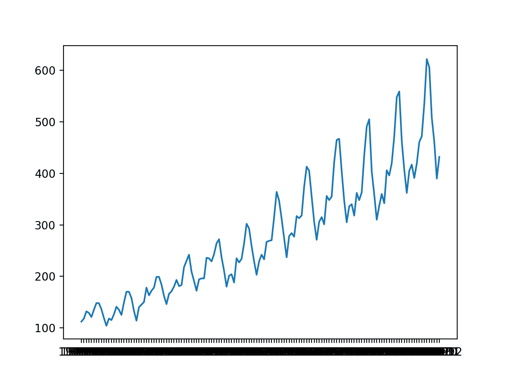

# 如何为时间序列预测网格搜索深度学习模型

> 原文： [https://machinelearningmastery.com/how-to-grid-search-deep-learning-models-for-time-series-forecasting/](https://machinelearningmastery.com/how-to-grid-search-deep-learning-models-for-time-series-forecasting/)

网格搜索通常不是我们可以使用深度学习方法执行的操作。

这是因为深度学习方法通​​常需要大量数据和大型模型，因此需要花费数小时，数天或数周才能训练的模型。

在数据集较小的情况下，例如单变量时间序列，可以使用网格搜索来调整深度学习模型的超参数。

在本教程中，您将了解如何为深度学习模型开发网格搜索超参数框架。

完成本教程后，您将了解：

*   如何开发用于调整模型超参数的通用网格搜索框架。
*   如何在航空公司乘客单变量时间序列预测问题上对多层感知机模型进行网格搜索超参数。
*   如何使框架适应卷积和长期短期记忆神经网络的网格搜索超参数。

让我们开始吧。


如何网格搜索时间序列预测的深度学习模型
照片由 [Hannes Flo](https://www.flickr.com/photos/hannesflo/40192605640/) ，保留一些权利。

## 教程概述

本教程分为五个部分;他们是：

1.  时间序列问题
2.  网格搜索框架
3.  网格搜索多层感知机
4.  网格搜索卷积神经网络
5.  网格搜索长短期记忆网络

## 时间序列问题

'_ 月度航空公司乘客 _'数据集总结了 1949 年至 1960 年期间航空公司每月数千人的国际旅客总数。

直接从这里下载数据集：

*   [monthly-airline-passengers.csv](https://raw.githubusercontent.com/jbrownlee/Datasets/master/airline-passengers.csv)

在当前工作目录中使用文件名“ _monthly-airline-passengers.csv_ ”保存文件。

我们可以使用函数`read_csv()`将此数据集作为 Pandas 系列加载。

```py
# load
series = read_csv('monthly-airline-passengers.csv', header=0, index_col=0)
```

加载后，我们可以总结数据集的形状，以确定观察的数量。

```py
# summarize shape
print(series.shape)
```

然后我们可以创建该系列的线图，以了解该系列的结构。

```py
# plot
pyplot.plot(series)
pyplot.show()
```

我们可以将所有这些结合在一起;下面列出了完整的示例。

```py
# load and plot dataset
from pandas import read_csv
from matplotlib import pyplot
# load
series = read_csv('monthly-airline-passengers.csv', header=0, index_col=0)
# summarize shape
print(series.shape)
# plot
pyplot.plot(series)
pyplot.show()
```

首先运行该示例将打印数据集的形状。

```py
(144, 1)
```

该数据集是每月一次，有 12 年或 144 次观测。在我们的测试中，我们将使用去年或 12 个观测值作为测试集。

创建线图。数据集具有明显的趋势和季节性成分。季节性成分的期限为 12 个月。



每月国际航空公司乘客的线路情节

在本教程中，我们将介绍用于网格搜索的工具，但我们不会针对此问题优化模型超参数。相反，我们将演示如何通常网格搜索深度学习模型超参数，并找到与朴素模型相比具有一定技巧的模型。

从之前的实验中，一个朴素的模型可以通过持续 12 个月前的值（相对指数-12）来实现 50.70 的均方根误差或 RMSE（记住单位是数千名乘客）。

这个朴素模型的表现提供了一个被认为适合这个问题的模型的约束。任何在过去 12 个月内达到低于 50.70 的预测表现的模型都具有技巧。

应该注意的是，调谐的 ETS 模型可以实现 17.09 的 RMSE，并且调谐的 SARIMA 可以实现 13.89 的 RMSE。这些为这个问题提供了一个调整良好的深度学习模型的预期的下限。

现在我们已经定义了模型技能的问题和期望，我们可以看看定义网格搜索测试工具。

## 网格搜索框架

在本节中，我们将开发一个网格搜索测试工具，可用于评估不同神经网络模型的一系列超参数，例如 MLP，CNN 和 LSTM。

本节分为以下几部分：

1.  训练 - 测试分裂
2.  系列作为监督学习
3.  前瞻性验证
4.  重复评估
5.  总结表现
6.  工作示例

### 训练 - 测试分裂

第一步是将加载的系列分成训练和测试集。

我们将使用前 11 年（132 个观测值）进行训练，最后 12 个用于测试集。

下面的`train_test_split()`函数将拆分系列，将原始观察值和在测试集中使用的观察数作为参数。

```py
# split a univariate dataset into train/test sets
def train_test_split(data, n_test):
	return data[:-n_test], data[-n_test:]
```

### 系列作为监督学习

接下来，我们需要能够将单变量观测系列框架化为监督学习问题，以便我们可以训练神经网络模型。

系列的监督学习框架意味着数据需要分成模型从中学习和概括的多个示例。

每个样本必须同时具有输入组件和输出组件。

输入组件将是一些先前的观察，例如三年或 36 个时间步骤。

输出组件将是下个月的总销售额，因为我们有兴趣开发一个模型来进行一步预测。

我们可以使用 pandas DataFrame 上的 [shift（）函数](https://pandas.pydata.org/pandas-docs/stable/generated/pandas.DataFrame.shift.html)来实现它。它允许我们向下移动一列（向前移动）或向后移动（向后移动）。我们可以将该系列作为一列数据，然后创建列的多个副本，向前或向后移动，以便使用我们需要的输入和输出元素创建样本。

当一个系列向下移动时，会引入 NaN 值，因为我们没有超出系列开头的值。

例如，系列定义为列：

```py
(t)
1
2
3
4
```

此列可以预先移位并作为列插入：

```py
(t-1),		(t)
Nan,		1
1,			2
2,			3
3,			4
4			NaN
```

我们可以看到，在第二行，值 1 作为输入提供，作为前一时间步的观察，2 是系列中可以预测的下一个值，或者当 1 是预测模型时要学习的值作为输入呈现。

可以删除具有 NaN 值的行。

下面的`series_to_supervised()`函数实现了这种行为，允许您指定输入中使用的滞后观察数和每个样本的输出中使用的数。它还将删除具有 NaN 值的行，因为它们不能用于训练或测试模型。

```py
# transform list into supervised learning format
def series_to_supervised(data, n_in=1, n_out=1):
	df = DataFrame(data)
	cols = list()
	# input sequence (t-n, ... t-1)
	for i in range(n_in, 0, -1):
		cols.append(df.shift(i))
	# forecast sequence (t, t+1, ... t+n)
	for i in range(0, n_out):
		cols.append(df.shift(-i))
	# put it all together
	agg = concat(cols, axis=1)
	# drop rows with NaN values
	agg.dropna(inplace=True)
	return agg.values
```

### 前瞻性验证

可以使用前向验证在测试集上评估时间序列预测模型。

前瞻性验证是一种方法，其中模型一次一个地对测试数据集中的每个观察做出预测。在对测试数据集中的时间步长进行每个预测之后，将预测的真实观察结果添加到测试数据集并使其可用于模型。

在进行后续预测之前，可以使用观察结果更简单的模型。考虑到更高的计算成本，更复杂的模型，例如神经网络，不会被改装。

然而，时间步骤的真实观察可以用作输入的一部分，用于在下一个时间步骤上做出预测。

首先，数据集分为训练集和测试集。我们将调用`train_test_split()`函数来执行此拆分并传入预先指定数量的观察值以用作测试数据。

对于给定配置，模型将适合训练数据集一次。

我们将定义一个通用的`model_fit()`函数来执行此操作，可以为我们稍后可能感兴趣的给定类型的神经网络填充该操作。该函数获取训练数据集和模型配置，并返回准备好做出预测的拟合模型。

```py
# fit a model
def model_fit(train, config):
	return None
```

枚举测试数据集的每个时间步。使用拟合模型做出预测。

同样，我们将定义一个名为`model_predict()`的通用函数，它采用拟合模型，历史和模型配置，并进行单个一步预测。

```py
# forecast with a pre-fit model
def model_predict(model, history, config):
	return 0.0
```

将预测添加到预测列表中，并将来自测试集的真实观察结果添加到用训练数据集中的所有观察结果播种的观察列表中。此列表在前向验证的每个步骤中构建，允许模型使用最新历史记录进行一步预测。

然后可以将所有预测与测试集中的真实值进行比较，并计算误差测量值。

我们将计算预测和真实值之间的均方根误差或 RMSE。

RMSE 计算为预测值与实际值之间的平方差的平均值的平方根。`measure_rmse()`使用 [mean_squared_error（）scikit-learn](http://scikit-learn.org/stable/modules/generated/sklearn.metrics.mean_squared_error.html) 函数在计算平方根之前首先计算均方误差或 MSE。

```py
# root mean squared error or rmse
def measure_rmse(actual, predicted):
	return sqrt(mean_squared_error(actual, predicted))
```

下面列出了将所有这些联系在一起的完整`walk_forward_validation()`函数。

它采用数据集，用作测试集的观察数量以及模型的配置，并返回测试集上模型表现的 RMSE。

```py
# walk-forward validation for univariate data
def walk_forward_validation(data, n_test, cfg):
	predictions = list()
	# split dataset
	train, test = train_test_split(data, n_test)
	# fit model
	model = model_fit(train, cfg)
	# seed history with training dataset
	history = [x for x in train]
	# step over each time-step in the test set
	for i in range(len(test)):
		# fit model and make forecast for history
		yhat = model_predict(model, history, cfg)
		# store forecast in list of predictions
		predictions.append(yhat)
		# add actual observation to history for the next loop
		history.append(test[i])
	# estimate prediction error
	error = measure_rmse(test, predictions)
	print(' > %.3f' % error)
	return error
```

### 重复评估

神经网络模型是随机的。

这意味着，在给定相同的模型配置和相同的训练数据集的情况下，每次训练模型时将产生不同的内部权重集，这反过来将具有不同的表现。

这是一个好处，允许模型自适应并找到复杂问题的高表现配置。

在评估模型的表现和选择用于做出预测的最终模型时，这也是一个问题。

为了解决模型评估问题，我们将通过[前进验证](https://machinelearningmastery.com/backtest-machine-learning-models-time-series-forecasting/)多次评估模型配置，并将错误报告为每次评估的平均误差。

对于大型神经网络而言，这并不总是可行的，并且可能仅适用于能够在几分钟或几小时内完成的小型网络。

下面的`repeat_evaluate()`函数实现了这一点，并允许将重复次数指定为默认为 10 的可选参数，并返回所有重复的平均 RMSE 分数。

```py
# score a model, return None on failure
def repeat_evaluate(data, config, n_test, n_repeats=10):
	# convert config to a key
	key = str(config)
	# fit and evaluate the model n times
	scores = [walk_forward_validation(data, n_test, config) for _ in range(n_repeats)]
	# summarize score
	result = mean(scores)
	print('> Model[%s] %.3f' % (key, result))
	return (key, result)
```

### 网格搜索

我们现在拥有框架的所有部分。

剩下的就是驱动搜索的功能。我们可以定义`grid_search()`函数，该函数获取数据集，要搜索的配置列表以及用作测试集的观察数量并执行搜索。

一旦为每个配置计算平均分数，配置列表将按升序排序，以便首先列出最佳分数。

完整的功能如下所列。

```py
# grid search configs
def grid_search(data, cfg_list, n_test):
	# evaluate configs
	scores = scores = [score_model(data, n_test, cfg) for cfg in cfg_list]
	# sort configs by error, asc
	scores.sort(key=lambda tup: tup[1])
	return scores
```

### 工作示例

现在我们已经定义了测试工具的元素，我们可以将它们绑定在一起并定义一个简单的持久性模型。

我们不需要拟合模型，因此`model_fit()`函数将被实现为简单地返回 None。

```py
# fit a model
def model_fit(train, config):
	return None
```

我们将使用配置来定义先前观察中的索引偏移列表，该列表相对于将被用作预测的预测时间。例如，12 将使用 12 个月前（-12）相对于预测时间的观察。

```py
# define config
cfg_list = [1, 6, 12, 24, 36]
```

可以实现`model_predict()`函数以使用此配置将值保持在负相对偏移处。

```py
# forecast with a pre-fit model
def model_predict(model, history, offset):
	history[-offset]
```

下面列出了使用简单持久性模型使用框架的完整示例。

```py
# grid search persistence models for airline passengers
from math import sqrt
from numpy import mean
from pandas import read_csv
from sklearn.metrics import mean_squared_error

# split a univariate dataset into train/test sets
def train_test_split(data, n_test):
	return data[:-n_test], data[-n_test:]

# root mean squared error or rmse
def measure_rmse(actual, predicted):
	return sqrt(mean_squared_error(actual, predicted))

# fit a model
def model_fit(train, config):
	return None

# forecast with a pre-fit model
def model_predict(model, history, offset):
	return history[-offset]

# walk-forward validation for univariate data
def walk_forward_validation(data, n_test, cfg):
	predictions = list()
	# split dataset
	train, test = train_test_split(data, n_test)
	# fit model
	model = model_fit(train, cfg)
	# seed history with training dataset
	history = [x for x in train]
	# step over each time-step in the test set
	for i in range(len(test)):
		# fit model and make forecast for history
		yhat = model_predict(model, history, cfg)
		# store forecast in list of predictions
		predictions.append(yhat)
		# add actual observation to history for the next loop
		history.append(test[i])
	# estimate prediction error
	error = measure_rmse(test, predictions)
	print(' > %.3f' % error)
	return error

# score a model, return None on failure
def repeat_evaluate(data, config, n_test, n_repeats=10):
	# convert config to a key
	key = str(config)
	# fit and evaluate the model n times
	scores = [walk_forward_validation(data, n_test, config) for _ in range(n_repeats)]
	# summarize score
	result = mean(scores)
	print('> Model[%s] %.3f' % (key, result))
	return (key, result)

# grid search configs
def grid_search(data, cfg_list, n_test):
	# evaluate configs
	scores = scores = [repeat_evaluate(data, cfg, n_test) for cfg in cfg_list]
	# sort configs by error, asc
	scores.sort(key=lambda tup: tup[1])
	return scores

# define dataset
series = read_csv('monthly-airline-passengers.csv', header=0, index_col=0)
data = series.values
# data split
n_test = 12
# model configs
cfg_list = [1, 6, 12, 24, 36]
# grid search
scores = grid_search(data, cfg_list, n_test)
print('done')
# list top 10 configs
for cfg, error in scores[:10]:
	print(cfg, error)
```

运行该示例将打印在最近 12 个月的数据中使用前向验证评估的模型的 RMSE。

每个模型配置被评估 10 次，但是，因为模型没有随机元素，所以每次得分都相同。

在运行结束时，将报告前三个执行模型配置的配置和 RMSE。

我们可以看到，正如我们可能预期的那样，持续一年前的值（相对偏移-12）导致持久性模型的最佳表现。

```py
...
 > 110.274
 > 110.274
 > 110.274
> Model[36] 110.274
done
12 50.708316214732804
1 53.1515129919491
24 97.10990337413241
36 110.27352356753639
6 126.73495965991387
```

现在我们有一个强大的网格搜索模型超参数测试工具，我们可以用它来评估一套神经网络模型。

## 网格搜索多层感知机

我们可能希望调整 MLP 的许多方面。

我们将定义一个非常简单的模型，其中包含一个隐藏层，并定义五个超参数进行调整。他们是：

*   **n_input** ：用作模型输入的先前输入数（例如 12 个月）。
*   **n_nodes** ：隐藏层中使用的节点数（例如 50）。
*   **n_epochs** ：训练时期的数量（例如 1000）。
*   **n_batch** ：每个小批量中包含的样本数（例如 32）。
*   **n_diff** ：差分顺序（例如 0 或 12）。

现代神经网络可以通过很少的预处理来处理原始数据，例如缩放和差分。然而，当涉及时间序列数据时，有时差异系列可以使问题更容易建模。

回想一下，[差分](https://machinelearningmastery.com/remove-trends-seasonality-difference-transform-python/)是数据的变换，使得从当前观察中减去先前观察的值，去除趋势或季节性结构。

我们将为网格搜索测试工具添加差异支持，以防它为您的特定问题增加价值。它确实为内部航空公司乘客数据集增加了价值。

下面的 _ 差异（）_ 函数将计算数据集的给定顺序的差异。

```py
# difference dataset
def difference(data, order):
	return [data[i] - data[i - order] for i in range(order, len(data))]
```

差异将是可选的，其中 0 的顺序表示没有差异，而 1 阶或 12 阶将要求在拟合模型之前差异数据并且模型的预测需要在返回预测之前反转差分。

我们现在可以定义在测试工具中安装 MLP 模型所需的元素。

首先，我们必须解压缩超参数列表。

```py
# unpack config
n_input, n_nodes, n_epochs, n_batch, n_diff = config
```

接下来，我们必须准备数据，包括差分，将数据转换为监督格式，并分离出数据样本的输入和输出方面。

```py
# prepare data
if n_diff > 0:
	train = difference(train, n_diff)
# transform series into supervised format
data = series_to_supervised(train, n_in=n_input)
# separate inputs and outputs
train_x, train_y = data[:, :-1], data[:, -1]
```

我们现在可以使用提供的配置定义和拟合模型。

```py
# define model
model = Sequential()
model.add(Dense(n_nodes, activation='relu', input_dim=n_input))
model.add(Dense(1))
model.compile(loss='mse', optimizer='adam')
# fit model
model.fit(train_x, train_y, epochs=n_epochs, batch_size=n_batch, verbose=0)
```

下面列出了`model_fit()`函数的完整实现。

```py
# fit a model
def model_fit(train, config):
	# unpack config
	n_input, n_nodes, n_epochs, n_batch, n_diff = config
	# prepare data
	if n_diff > 0:
		train = difference(train, n_diff)
	# transform series into supervised format
	data = series_to_supervised(train, n_in=n_input)
	# separate inputs and outputs
	train_x, train_y = data[:, :-1], data[:, -1]
	# define model
	model = Sequential()
	model.add(Dense(n_nodes, activation='relu', input_dim=n_input))
	model.add(Dense(1))
	model.compile(loss='mse', optimizer='adam')
	# fit model
	model.fit(train_x, train_y, epochs=n_epochs, batch_size=n_batch, verbose=0)
	return model
```

五个选择的超参数绝不是要调整的模型的唯一或最佳超参数。您可以修改该功能以调整其他参数，例如更多隐藏层的添加和大小等等。

一旦模型适合，我们就可以使用它来做出预测。

如果数据差异，则必须反转差异以预测模型。这涉及将历史的相对偏移处的值添加回模型预测的值。

```py
# invert difference
correction = 0.0
if n_diff > 0:
	correction = history[-n_diff]
...
# correct forecast if it was differenced
return correction + yhat[0]
```

这也意味着必须区分历史记录，以便用于做出预测的输入数据具有预期的形式。

```py
# calculate difference
history = difference(history, n_diff)
```

准备好之后，我们可以使用历史数据创建单个样本作为模型的输入，以进行一步预测。

一个样本的形状必须是[1，n_input]，其中`n_input`是要使用的滞后观察数的选定数量。

```py
# shape input for model
x_input = array(history[-n_input:]).reshape((1, n_input))
```

最后，可以做出预测。

```py
# make forecast
yhat = model.predict(x_input, verbose=0)
```

下面列出了`model_predict()`函数的完整实现。

接下来，我们必须定义要为每个超参数尝试的值范围。

我们可以定义`model_configs()`函数，该函数创建要尝试的不同参数组合的列表。

我们将定义一小部分配置作为示例，包括 12 个月的差异，我们预计这将是必需的。建议您尝试使用独立模型，查看学习曲线诊断图，并使用有关域的信息来设置超参数值到网格搜索的范围。

我们还鼓励您重复网格搜索以缩小显示更好表现的值范围。

下面列出了`model_configs()`函数的实现。

```py
# create a list of configs to try
def model_configs():
	# define scope of configs
	n_input = [12]
	n_nodes = [50, 100]
	n_epochs = [100]
	n_batch = [1, 150]
	n_diff = [0, 12]
	# create configs
	configs = list()
	for i in n_input:
		for j in n_nodes:
			for k in n_epochs:
				for l in n_batch:
					for m in n_diff:
						cfg = [i, j, k, l, m]
						configs.append(cfg)
	print('Total configs: %d' % len(configs))
	return configs
```

我们现在拥有网格搜索 MLP 模型所需的所有部分，用于单变量时间序列预测问题。

下面列出了完整的示例。

```py
# grid search mlps for airline passengers
from math import sqrt
from numpy import array
from numpy import mean
from pandas import DataFrame
from pandas import concat
from pandas import read_csv
from sklearn.metrics import mean_squared_error
from keras.models import Sequential
from keras.layers import Dense

# split a univariate dataset into train/test sets
def train_test_split(data, n_test):
	return data[:-n_test], data[-n_test:]

# transform list into supervised learning format
def series_to_supervised(data, n_in=1, n_out=1):
	df = DataFrame(data)
	cols = list()
	# input sequence (t-n, ... t-1)
	for i in range(n_in, 0, -1):
		cols.append(df.shift(i))
	# forecast sequence (t, t+1, ... t+n)
	for i in range(0, n_out):
		cols.append(df.shift(-i))
	# put it all together
	agg = concat(cols, axis=1)
	# drop rows with NaN values
	agg.dropna(inplace=True)
	return agg.values

# root mean squared error or rmse
def measure_rmse(actual, predicted):
	return sqrt(mean_squared_error(actual, predicted))

# difference dataset
def difference(data, order):
	return [data[i] - data[i - order] for i in range(order, len(data))]

# fit a model
def model_fit(train, config):
	# unpack config
	n_input, n_nodes, n_epochs, n_batch, n_diff = config
	# prepare data
	if n_diff > 0:
		train = difference(train, n_diff)
	# transform series into supervised format
	data = series_to_supervised(train, n_in=n_input)
	# separate inputs and outputs
	train_x, train_y = data[:, :-1], data[:, -1]
	# define model
	model = Sequential()
	model.add(Dense(n_nodes, activation='relu', input_dim=n_input))
	model.add(Dense(1))
	model.compile(loss='mse', optimizer='adam')
	# fit model
	model.fit(train_x, train_y, epochs=n_epochs, batch_size=n_batch, verbose=0)
	return model

# forecast with the fit model
def model_predict(model, history, config):
	# unpack config
	n_input, _, _, _, n_diff = config
	# prepare data
	correction = 0.0
	if n_diff > 0:
		correction = history[-n_diff]
		history = difference(history, n_diff)
	# shape input for model
	x_input = array(history[-n_input:]).reshape((1, n_input))
	# make forecast
	yhat = model.predict(x_input, verbose=0)
	# correct forecast if it was differenced
	return correction + yhat[0]

# walk-forward validation for univariate data
def walk_forward_validation(data, n_test, cfg):
	predictions = list()
	# split dataset
	train, test = train_test_split(data, n_test)
	# fit model
	model = model_fit(train, cfg)
	# seed history with training dataset
	history = [x for x in train]
	# step over each time-step in the test set
	for i in range(len(test)):
		# fit model and make forecast for history
		yhat = model_predict(model, history, cfg)
		# store forecast in list of predictions
		predictions.append(yhat)
		# add actual observation to history for the next loop
		history.append(test[i])
	# estimate prediction error
	error = measure_rmse(test, predictions)
	print(' > %.3f' % error)
	return error

# score a model, return None on failure
def repeat_evaluate(data, config, n_test, n_repeats=10):
	# convert config to a key
	key = str(config)
	# fit and evaluate the model n times
	scores = [walk_forward_validation(data, n_test, config) for _ in range(n_repeats)]
	# summarize score
	result = mean(scores)
	print('> Model[%s] %.3f' % (key, result))
	return (key, result)

# grid search configs
def grid_search(data, cfg_list, n_test):
	# evaluate configs
	scores = scores = [repeat_evaluate(data, cfg, n_test) for cfg in cfg_list]
	# sort configs by error, asc
	scores.sort(key=lambda tup: tup[1])
	return scores

# create a list of configs to try
def model_configs():
	# define scope of configs
	n_input = [12]
	n_nodes = [50, 100]
	n_epochs = [100]
	n_batch = [1, 150]
	n_diff = [0, 12]
	# create configs
	configs = list()
	for i in n_input:
		for j in n_nodes:
			for k in n_epochs:
				for l in n_batch:
					for m in n_diff:
						cfg = [i, j, k, l, m]
						configs.append(cfg)
	print('Total configs: %d' % len(configs))
	return configs

# define dataset
series = read_csv('monthly-airline-passengers.csv', header=0, index_col=0)
data = series.values
# data split
n_test = 12
# model configs
cfg_list = model_configs()
# grid search
scores = grid_search(data, cfg_list, n_test)
print('done')
# list top 3 configs
for cfg, error in scores[:3]:
	print(cfg, error)
```

运行该示例，我们可以看到框架总共要评估八种配置。

每个配置将被评估 10 次;这意味着将使用前向验证创建和评估 10 个模型，以在报告这 10 个分数的平均值并用于对配置进行评分之前计算 RMSE 分数。

然后对得分进行排序，最后报告具有最低 RMSE 的前 3 个配置。与报告 RMSE 为 50.70 的幼稚模型相比，发现了一种熟练的模型配置。

我们可以看到 18.98 的最佳 RMSE 是通过[12,100,100,1,12]的配置实现的，我们知道可以解释为：

*   **n_input** ：12
*   **n_nodes** ：100
*   **n_epochs** ：100
*   **n_batch** ：1
*   **n_diff** ：12

下面列出了网格搜索的截断示例输出。

鉴于算法的随机性，您的具体分数可能会有所不同。

```py
Total configs: 8
 > 20.707
 > 29.111
 > 17.499
 > 18.918
 > 28.817
...
 > 21.015
 > 20.208
 > 18.503
> Model[[12, 100, 100, 150, 12]] 19.674
done
[12, 100, 100, 1, 12] 18.982720013625606
[12, 50, 100, 150, 12] 19.33004059448595
[12, 100, 100, 1, 0] 19.5389405532858
```

## 网格搜索卷积神经网络

我们现在可以将框架调整为网格搜索 CNN 模型。

可以像使用 MLP 模型一样搜索大量相同的超参数集，除了隐藏层中的节点数可以由卷积层中的滤波器映射数和内核大小替换。

在 CNN 模型中选择的网格搜索超参数集如下：

*   **n_input** ：用作模型输入的先前输入数（例如 12 个月）。
*   **n_filters** ：卷积层中的滤波器映射的数量（例如 32）。
*   **n_kernel** ：卷积层中的内核大小（例如 3）。
*   **n_epochs** ：训练时期的数量（例如 1000）。
*   **n_batch** ：每个小批量中包含的样本数（例如 32）。
*   **n_diff** ：差分顺序（例如 0 或 12）。

您可能希望研究的一些额外的超参数是在池化层之前使用两个卷积层，重复卷积和池化层模式，使用丢失等等。

我们将定义一个非常简单的 CNN 模型，其中包含一个卷积层和一个最大池池。

```py
# define model
model = Sequential()
model.add(Conv1D(filters=n_filters, kernel_size=n_kernel, activation='relu', input_shape=(n_input, n_features)))
model.add(MaxPooling1D(pool_size=2))
model.add(Flatten())
model.add(Dense(1))
model.compile(loss='mse', optimizer='adam')
```

必须以与 MLP 相同的方式准备数据。

与期望输入数据具有[样本，特征]形状的 MLP 不同，1D CNN 模型期望数据具有[_ 样本，时间步长，特征 _]的形状，其中特征映射到通道上并且在此案例 1 是我们每个月测量的一个变量。

```py
# reshape input data into [samples, timesteps, features]
n_features = 1
train_x = train_x.reshape((train_x.shape[0], train_x.shape[1], n_features))
```

下面列出了`model_fit()`函数的完整实现。

```py
# fit a model
def model_fit(train, config):
	# unpack config
	n_input, n_filters, n_kernel, n_epochs, n_batch, n_diff = config
	# prepare data
	if n_diff > 0:
		train = difference(train, n_diff)
	# transform series into supervised format
	data = series_to_supervised(train, n_in=n_input)
	# separate inputs and outputs
	train_x, train_y = data[:, :-1], data[:, -1]
	# reshape input data into [samples, timesteps, features]
	n_features = 1
	train_x = train_x.reshape((train_x.shape[0], train_x.shape[1], n_features))
	# define model
	model = Sequential()
	model.add(Conv1D(filters=n_filters, kernel_size=n_kernel, activation='relu', input_shape=(n_input, n_features)))
	model.add(MaxPooling1D(pool_size=2))
	model.add(Flatten())
	model.add(Dense(1))
	model.compile(loss='mse', optimizer='adam')
	# fit
	model.fit(train_x, train_y, epochs=n_epochs, batch_size=n_batch, verbose=0)
	return model
```

使用拟合 CNN 模型做出预测非常类似于使用拟合 MLP 做出预测。

同样，唯一的区别是一个样本值的输入数据必须具有三维形状。

```py
x_input = array(history[-n_input:]).reshape((1, n_input, 1))
```

下面列出了`model_predict()`函数的完整实现。

```py
# forecast with the fit model
def model_predict(model, history, config):
	# unpack config
	n_input, _, _, _, _, n_diff = config
	# prepare data
	correction = 0.0
	if n_diff > 0:
		correction = history[-n_diff]
		history = difference(history, n_diff)
	x_input = array(history[-n_input:]).reshape((1, n_input, 1))
	# forecast
	yhat = model.predict(x_input, verbose=0)
	return correction + yhat[0]
```

最后，我们可以定义要评估的模型的配置列表。和以前一样，我们可以通过定义超参数值列表来尝试将它们组合成一个列表。我们将尝试少量配置以确保示例在合理的时间内执行。

完整的`model_configs()`功能如下所示。

```py
# create a list of configs to try
def model_configs():
	# define scope of configs
	n_input = [12]
	n_filters = [64]
	n_kernels = [3, 5]
	n_epochs = [100]
	n_batch = [1, 150]
	n_diff = [0, 12]
	# create configs
	configs = list()
	for a in n_input:
		for b in n_filters:
			for c in n_kernels:
				for d in n_epochs:
					for e in n_batch:
						for f in n_diff:
							cfg = [a,b,c,d,e,f]
							configs.append(cfg)
	print('Total configs: %d' % len(configs))
	return configs
```

我们现在拥有网格搜索卷积神经网络的超参数所需的所有元素，用于单变量时间序列预测。

下面列出了完整的示例。

```py
# grid search cnn for airline passengers
from math import sqrt
from numpy import array
from numpy import mean
from pandas import DataFrame
from pandas import concat
from pandas import read_csv
from sklearn.metrics import mean_squared_error
from keras.models import Sequential
from keras.layers import Dense
from keras.layers import Flatten
from keras.layers.convolutional import Conv1D
from keras.layers.convolutional import MaxPooling1D

# split a univariate dataset into train/test sets
def train_test_split(data, n_test):
	return data[:-n_test], data[-n_test:]

# transform list into supervised learning format
def series_to_supervised(data, n_in=1, n_out=1):
	df = DataFrame(data)
	cols = list()
	# input sequence (t-n, ... t-1)
	for i in range(n_in, 0, -1):
		cols.append(df.shift(i))
	# forecast sequence (t, t+1, ... t+n)
	for i in range(0, n_out):
		cols.append(df.shift(-i))
	# put it all together
	agg = concat(cols, axis=1)
	# drop rows with NaN values
	agg.dropna(inplace=True)
	return agg.values

# root mean squared error or rmse
def measure_rmse(actual, predicted):
	return sqrt(mean_squared_error(actual, predicted))

# difference dataset
def difference(data, order):
	return [data[i] - data[i - order] for i in range(order, len(data))]

# fit a model
def model_fit(train, config):
	# unpack config
	n_input, n_filters, n_kernel, n_epochs, n_batch, n_diff = config
	# prepare data
	if n_diff > 0:
		train = difference(train, n_diff)
	# transform series into supervised format
	data = series_to_supervised(train, n_in=n_input)
	# separate inputs and outputs
	train_x, train_y = data[:, :-1], data[:, -1]
	# reshape input data into [samples, timesteps, features]
	n_features = 1
	train_x = train_x.reshape((train_x.shape[0], train_x.shape[1], n_features))
	# define model
	model = Sequential()
	model.add(Conv1D(filters=n_filters, kernel_size=n_kernel, activation='relu', input_shape=(n_input, n_features)))
	model.add(MaxPooling1D(pool_size=2))
	model.add(Flatten())
	model.add(Dense(1))
	model.compile(loss='mse', optimizer='adam')
	# fit
	model.fit(train_x, train_y, epochs=n_epochs, batch_size=n_batch, verbose=0)
	return model

# forecast with the fit model
def model_predict(model, history, config):
	# unpack config
	n_input, _, _, _, _, n_diff = config
	# prepare data
	correction = 0.0
	if n_diff > 0:
		correction = history[-n_diff]
		history = difference(history, n_diff)
	x_input = array(history[-n_input:]).reshape((1, n_input, 1))
	# forecast
	yhat = model.predict(x_input, verbose=0)
	return correction + yhat[0]

# walk-forward validation for univariate data
def walk_forward_validation(data, n_test, cfg):
	predictions = list()
	# split dataset
	train, test = train_test_split(data, n_test)
	# fit model
	model = model_fit(train, cfg)
	# seed history with training dataset
	history = [x for x in train]
	# step over each time-step in the test set
	for i in range(len(test)):
		# fit model and make forecast for history
		yhat = model_predict(model, history, cfg)
		# store forecast in list of predictions
		predictions.append(yhat)
		# add actual observation to history for the next loop
		history.append(test[i])
	# estimate prediction error
	error = measure_rmse(test, predictions)
	print(' > %.3f' % error)
	return error

# score a model, return None on failure
def repeat_evaluate(data, config, n_test, n_repeats=10):
	# convert config to a key
	key = str(config)
	# fit and evaluate the model n times
	scores = [walk_forward_validation(data, n_test, config) for _ in range(n_repeats)]
	# summarize score
	result = mean(scores)
	print('> Model[%s] %.3f' % (key, result))
	return (key, result)

# grid search configs
def grid_search(data, cfg_list, n_test):
	# evaluate configs
	scores = scores = [repeat_evaluate(data, cfg, n_test) for cfg in cfg_list]
	# sort configs by error, asc
	scores.sort(key=lambda tup: tup[1])
	return scores

# create a list of configs to try
def model_configs():
	# define scope of configs
	n_input = [12]
	n_filters = [64]
	n_kernels = [3, 5]
	n_epochs = [100]
	n_batch = [1, 150]
	n_diff = [0, 12]
	# create configs
	configs = list()
	for a in n_input:
		for b in n_filters:
			for c in n_kernels:
				for d in n_epochs:
					for e in n_batch:
						for f in n_diff:
							cfg = [a,b,c,d,e,f]
							configs.append(cfg)
	print('Total configs: %d' % len(configs))
	return configs

# define dataset
series = read_csv('monthly-airline-passengers.csv', header=0, index_col=0)
data = series.values
# data split
n_test = 12
# model configs
cfg_list = model_configs()
# grid search
scores = grid_search(data, cfg_list, n_test)
print('done')
# list top 10 configs
for cfg, error in scores[:3]:
	print(cfg, error)
```

运行该示例，我们可以看到只评估了八种不同的配置。

我们可以看到[12,64,5,100,1,12]的配置实现了 18.89 的 RMSE，与实现 50.70 的朴素预测模型相比，这是巧妙的。

我们可以将此配置解压缩为：

*   **n_input** ：12
*   **n_filters** ：64
*   **n_kernel** ：5
*   **n_epochs** ：100
*   **n_batch** ：1
*   **n_diff** ：12

下面列出了网格搜索的截断示例输出。

鉴于算法的随机性，您的具体分数可能会有所不同。

```py
Total configs: 8
 > 23.372
 > 28.317
 > 31.070
...
 > 20.923
 > 18.700
 > 18.210
> Model[[12, 64, 5, 100, 150, 12]] 19.152
done
[12, 64, 5, 100, 1, 12] 18.89593462072732
[12, 64, 5, 100, 150, 12] 19.152486150334234
[12, 64, 3, 100, 150, 12] 19.44680151564605
```

## 网格搜索长短期记忆网络

我们现在可以采用网格搜索 LSTM 模型的超参数。

LSTM 模型的超参数将与 MLP 相同;他们是：

*   **n_input** ：用作模型输入的先前输入数（例如 12 个月）。
*   **n_nodes** ：隐藏层中使用的节点数（例如 50）。
*   **n_epochs** ：训练时期的数量（例如 1000）。
*   **n_batch** ：每个小批量中包含的样本数（例如 32）。
*   **n_diff** ：差分顺序（例如 0 或 12）。

我们将定义一个简单的 LSTM 模型，该模型具有单个隐藏的 LSTM 层和指定该层中单元数的节点数。

```py
# define model
model = Sequential()
model.add(LSTM(n_nodes, activation='relu', input_shape=(n_input, n_features)))
model.add(Dense(n_nodes, activation='relu'))
model.add(Dense(1))
model.compile(loss='mse', optimizer='adam')
# fit model
model.fit(train_x, train_y, epochs=n_epochs, batch_size=n_batch, verbose=0)
```

探索调整其他配置（例如使用双向输入层，栈式 LSTM 层，甚至是具有 CNN 或 ConvLSTM 输入模型的混合模型）可能会很有趣。

与 CNN 模型一样，LSTM 模型期望输入数据具有样本，时间步长和特征的三维形状。

```py
# reshape input data into [samples, timesteps, features]
n_features = 1
train_x = train_x.reshape((train_x.shape[0], train_x.shape[1], n_features))
```

下面列出了`model_fit()`函数的完整实现。

```py
# fit a model
def model_fit(train, config):
	# unpack config
	n_input, n_nodes, n_epochs, n_batch, n_diff = config
	# prepare data
	if n_diff > 0:
		train = difference(train, n_diff)
	# transform series into supervised format
	data = series_to_supervised(train, n_in=n_input)
	# separate inputs and outputs
	train_x, train_y = data[:, :-1], data[:, -1]
	# reshape input data into [samples, timesteps, features]
	n_features = 1
	train_x = train_x.reshape((train_x.shape[0], train_x.shape[1], n_features))
	# define model
	model = Sequential()
	model.add(LSTM(n_nodes, activation='relu', input_shape=(n_input, n_features)))
	model.add(Dense(n_nodes, activation='relu'))
	model.add(Dense(1))
	model.compile(loss='mse', optimizer='adam')
	# fit model
	model.fit(train_x, train_y, epochs=n_epochs, batch_size=n_batch, verbose=0)
	return model
```

与 CNN 一样，用于做出预测的单个输入样本也必须重新形成预期的三维结构。

```py
# reshape sample into [samples, timesteps, features]
x_input = array(history[-n_input:]).reshape((1, n_input, 1))
```

完整的`model_predict()`功能如下所示。

```py
# forecast with the fit model
def model_predict(model, history, config):
	# unpack config
	n_input, _, _, _, n_diff = config
	# prepare data
	correction = 0.0
	if n_diff > 0:
		correction = history[-n_diff]
		history = difference(history, n_diff)
	# reshape sample into [samples, timesteps, features]
	x_input = array(history[-n_input:]).reshape((1, n_input, 1))
	# forecast
	yhat = model.predict(x_input, verbose=0)
	return correction + yhat[0]
```

我们现在可以定义用于创建要评估的模型配置列表的函数。

训练的 LSTM 模型比 MLP 和 CNN 模型慢得多;因此，您可能希望评估每次运行的配置更少。

我们将定义一组非常简单的两种配置来探索：随机和批量梯度下降。

```py
# create a list of configs to try
def model_configs():
	# define scope of configs
	n_input = [12]
	n_nodes = [100]
	n_epochs = [50]
	n_batch = [1, 150]
	n_diff = [12]
	# create configs
	configs = list()
	for i in n_input:
		for j in n_nodes:
			for k in n_epochs:
				for l in n_batch:
					for m in n_diff:
						cfg = [i, j, k, l, m]
						configs.append(cfg)
	print('Total configs: %d' % len(configs))
	return configs
```

我们现在拥有了针对 LSTM 模型的网格搜索超参数所需的一切，用于单变量时间序列预测。

下面列出了完整的示例。

```py
# grid search lstm for airline passengers
from math import sqrt
from numpy import array
from numpy import mean
from pandas import DataFrame
from pandas import concat
from pandas import read_csv
from sklearn.metrics import mean_squared_error
from keras.models import Sequential
from keras.layers import Dense
from keras.layers import LSTM

# split a univariate dataset into train/test sets
def train_test_split(data, n_test):
	return data[:-n_test], data[-n_test:]

# transform list into supervised learning format
def series_to_supervised(data, n_in=1, n_out=1):
	df = DataFrame(data)
	cols = list()
	# input sequence (t-n, ... t-1)
	for i in range(n_in, 0, -1):
		cols.append(df.shift(i))
	# forecast sequence (t, t+1, ... t+n)
	for i in range(0, n_out):
		cols.append(df.shift(-i))
	# put it all together
	agg = concat(cols, axis=1)
	# drop rows with NaN values
	agg.dropna(inplace=True)
	return agg.values

# root mean squared error or rmse
def measure_rmse(actual, predicted):
	return sqrt(mean_squared_error(actual, predicted))

# difference dataset
def difference(data, order):
	return [data[i] - data[i - order] for i in range(order, len(data))]

# fit a model
def model_fit(train, config):
	# unpack config
	n_input, n_nodes, n_epochs, n_batch, n_diff = config
	# prepare data
	if n_diff > 0:
		train = difference(train, n_diff)
	# transform series into supervised format
	data = series_to_supervised(train, n_in=n_input)
	# separate inputs and outputs
	train_x, train_y = data[:, :-1], data[:, -1]
	# reshape input data into [samples, timesteps, features]
	n_features = 1
	train_x = train_x.reshape((train_x.shape[0], train_x.shape[1], n_features))
	# define model
	model = Sequential()
	model.add(LSTM(n_nodes, activation='relu', input_shape=(n_input, n_features)))
	model.add(Dense(n_nodes, activation='relu'))
	model.add(Dense(1))
	model.compile(loss='mse', optimizer='adam')
	# fit model
	model.fit(train_x, train_y, epochs=n_epochs, batch_size=n_batch, verbose=0)
	return model

# forecast with the fit model
def model_predict(model, history, config):
	# unpack config
	n_input, _, _, _, n_diff = config
	# prepare data
	correction = 0.0
	if n_diff > 0:
		correction = history[-n_diff]
		history = difference(history, n_diff)
	# reshape sample into [samples, timesteps, features]
	x_input = array(history[-n_input:]).reshape((1, n_input, 1))
	# forecast
	yhat = model.predict(x_input, verbose=0)
	return correction + yhat[0]

# walk-forward validation for univariate data
def walk_forward_validation(data, n_test, cfg):
	predictions = list()
	# split dataset
	train, test = train_test_split(data, n_test)
	# fit model
	model = model_fit(train, cfg)
	# seed history with training dataset
	history = [x for x in train]
	# step over each time-step in the test set
	for i in range(len(test)):
		# fit model and make forecast for history
		yhat = model_predict(model, history, cfg)
		# store forecast in list of predictions
		predictions.append(yhat)
		# add actual observation to history for the next loop
		history.append(test[i])
	# estimate prediction error
	error = measure_rmse(test, predictions)
	print(' > %.3f' % error)
	return error

# score a model, return None on failure
def repeat_evaluate(data, config, n_test, n_repeats=10):
	# convert config to a key
	key = str(config)
	# fit and evaluate the model n times
	scores = [walk_forward_validation(data, n_test, config) for _ in range(n_repeats)]
	# summarize score
	result = mean(scores)
	print('> Model[%s] %.3f' % (key, result))
	return (key, result)

# grid search configs
def grid_search(data, cfg_list, n_test):
	# evaluate configs
	scores = scores = [repeat_evaluate(data, cfg, n_test) for cfg in cfg_list]
	# sort configs by error, asc
	scores.sort(key=lambda tup: tup[1])
	return scores

# create a list of configs to try
def model_configs():
	# define scope of configs
	n_input = [12]
	n_nodes = [100]
	n_epochs = [50]
	n_batch = [1, 150]
	n_diff = [12]
	# create configs
	configs = list()
	for i in n_input:
		for j in n_nodes:
			for k in n_epochs:
				for l in n_batch:
					for m in n_diff:
						cfg = [i, j, k, l, m]
						configs.append(cfg)
	print('Total configs: %d' % len(configs))
	return configs

# define dataset
series = read_csv('monthly-airline-passengers.csv', header=0, index_col=0)
data = series.values
# data split
n_test = 12
# model configs
cfg_list = model_configs()
# grid search
scores = grid_search(data, cfg_list, n_test)
print('done')
# list top 10 configs
for cfg, error in scores[:3]:
	print(cfg, error)
```

运行该示例，我们可以看到只评估了两个不同的配置。

我们可以看到[12,100,50,1,12]的配置实现了 21.24 的 RMSE，与实现 50.70 的朴素预测模型相比，这是巧妙的。

该模型需要更多的调整，并且可以使用混合配置做得更好，例如将 CNN 模型作为输入。

我们可以将此配置解压缩为：

*   **n_input** ：12
*   **n_nodes** ：100
*   **n_epochs** ：50
*   **n_batch** ：1
*   **n_diff** ：12

下面列出了网格搜索的截断示例输出。

鉴于算法的随机性，您的具体分数可能会有所不同。

```py
Total configs: 2
 > 20.488
 > 17.718
 > 21.213
...
 > 22.300
 > 20.311
 > 21.322
> Model[[12, 100, 50, 150, 12]] 21.260
done
[12, 100, 50, 1, 12] 21.243775750634093
[12, 100, 50, 150, 12] 21.259553398553606
```

## 扩展

本节列出了一些扩展您可能希望探索的教程的想法。

*   **更多配置**。探索其中一个模型的大型配置套件，看看您是否能找到能够提高表现的配置。
*   **数据缩放**。更新网格搜索框架以在拟合模型和反转变换以做出预测之前还支持数据的缩放（标准化和/或标准化）。
*   **网络架构**。探索网格搜索给定模型的更大架构更改，例如添加更多隐藏层。
*   **新数据集**。在新的单变量时间序列数据集中探索给定模型的网格搜索。
*   **多变量**。更新网格搜索框架以支持小的多变量时间序列数据集，例如具有多个输入变量的数据集。

如果你探索任何这些扩展，我很想知道。

## 进一步阅读

如果您希望深入了解，本节将提供有关该主题的更多资源。

*   [如何使用 Keras 网格搜索 Python 中的深度学习模型的超参数](https://machinelearningmastery.com/grid-search-hyperparameters-deep-learning-models-python-keras/)
*   [Keras 核心层 API](https://keras.io/layers/core/)
*   [Keras 卷积层 API](https://keras.io/layers/convolutional/)
*   [Keras Recurrent Layers API](https://keras.io/layers/recurrent/)

## 摘要

在本教程中，您了解了如何为深度学习模型开发网格搜索超参数框架。

具体来说，你学到了：

*   如何开发用于调整模型超参数的通用网格搜索框架。
*   如何在航空公司乘客单变量时间序列预测问题上对多层感知机模型进行网格搜索超参数。
*   如何使框架适应卷积和长期短期记忆神经网络的网格搜索超参数。

你有任何问题吗？
在下面的评论中提出您的问题，我会尽力回答。