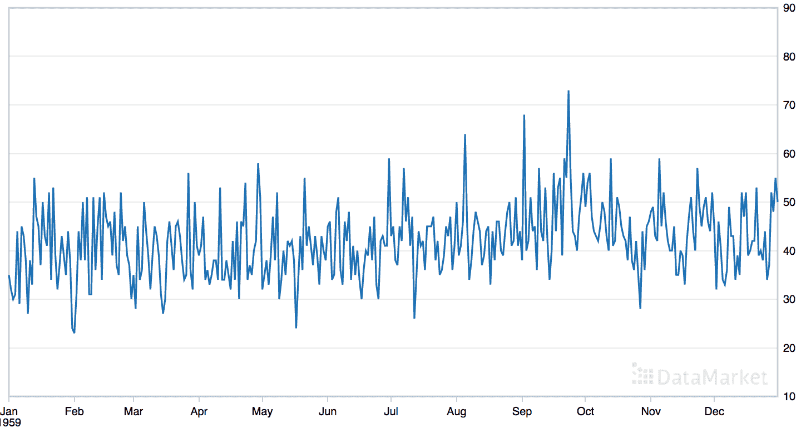
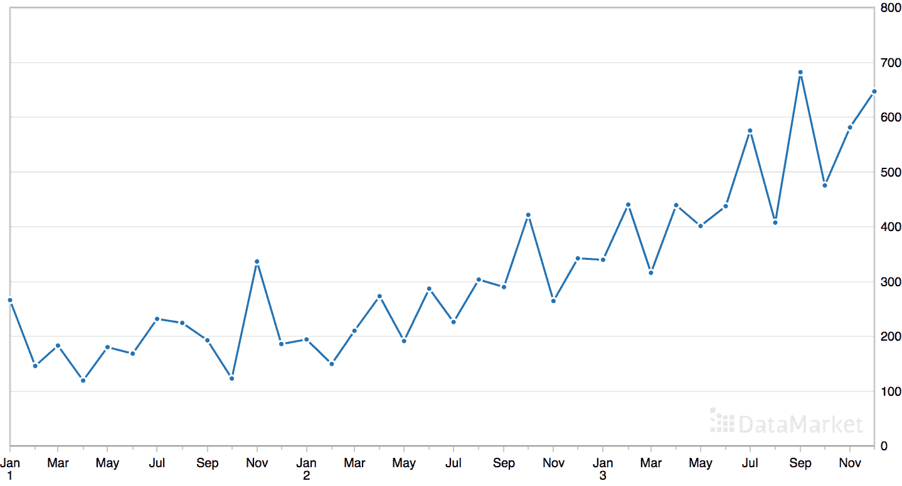
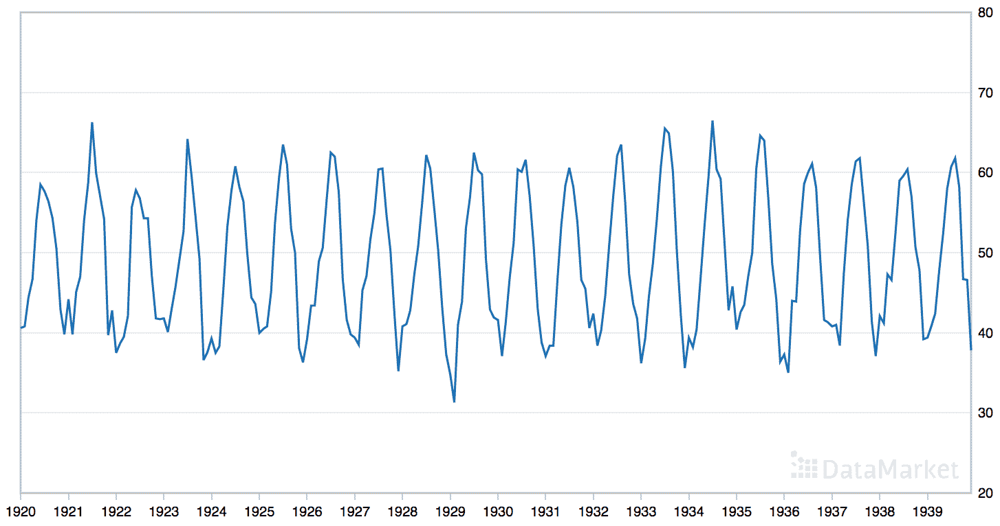
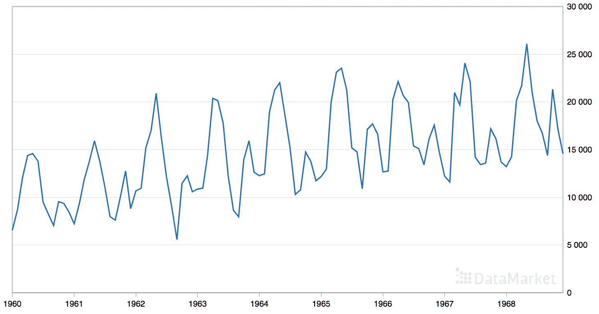

# 如何在 Python 中进行时间序列预测的网格搜索三次指数平滑

> 原文： [https://machinelearningmastery.com/how-to-grid-search-triple-exponential-smoothing-for-time-series-forecasting-in-python/](https://machinelearningmastery.com/how-to-grid-search-triple-exponential-smoothing-for-time-series-forecasting-in-python/)

指数平滑是单变量数据的时间序列预测方法，可以扩展为支持具有系统趋势或季节性成分的数据。

通常的做法是使用优化过程来查找模型超参数，这些参数导致指数平滑模型具有给定时间序列数据集的最佳表现。此实践仅适用于模型用于描述水平，趋势和季节性的指数结构的系数。

还可以自动优化指数平滑模型的其他超参数，例如是否对趋势和季节性分量建模，如果是，是否使用加法或乘法方法对它们进行建模。

在本教程中，您将了解如何开发一个框架，用于网格搜索所有指数平滑模型超参数，以进行单变量时间序列预测。

完成本教程后，您将了解：

*   如何使用前向验证从头开始开发网格搜索 ETS 模型的框架。
*   如何为女性出生日常时间序列数据网格搜索 ETS 模型超参数。
*   如何针对洗发水销售，汽车销售和温度的月度时间序列数据网格搜索 ETS 模型超参数。

让我们开始吧。

*   **Oct8 / 2018** ：更新了 ETS 模型的拟合，以使用 NumPy 阵列修复乘法趋势/季节性问题（感谢 Amit Amola）。


如何在 Python 中进行时间序列预测的网格搜索三次指数平滑
照片由 [john mcsporran](https://www.flickr.com/photos/127130111@N06/16375806988/) 拍摄，保留一些权利。

## 教程概述

本教程分为六个部分;他们是：

1.  时间序列预测的指数平滑
2.  开发网格搜索框架
3.  案例研究 1：没有趋势或季节性
4.  案例研究 2：趋势
5.  案例研究 3：季节性
6.  案例研究 4：趋势和季节性

## 时间序列预测的指数平滑

指数平滑是单变量数据的时间序列预测方法。

像 Box-Jenkins ARIMA 系列方法这样的时间序列方法开发了一种模型，其中预测是近期过去观察或滞后的加权线性和。

指数平滑预测方法的类似之处在于预测是过去观察的加权和，但模型明确地使用指数减小的权重用于过去的观察。

具体而言，过去的观察以几何减小的比率加权。

> 使用指数平滑方法产生的预测是过去观测的加权平均值，随着观测结果的变化，权重呈指数衰减。换句话说，观察越近，相关重量越高。

- 第 171 页，[预测：原则和实践](https://amzn.to/2xlJsfV)，2013。

指数平滑方法可以被视为对等，并且是流行的 Box-Jenkins ARIMA 类时间序列预测方法的替代方法。

总的来说，这些方法有时被称为 ETS 模型，参考 _ 错误 _，_ 趋势 _ 和 _ 季节性 _ 的显式建模。

指数平滑有三种类型;他们是：

*   **单指数平滑**或 SES，用于没有趋势或季节性的单变量数据。
*   **双指数平滑**用于支持趋势的单变量数据。
*   **三重指数平滑**，或 Holt-Winters 指数平滑，支持趋势和季节性。

三指数平滑模型通过趋势性质（加法，乘法或无）的性质和季节性的性质（加法，乘法或无）来表示单指数和双指数平滑，以及任何阻尼趋势。

## 开发网格搜索框架

在本节中，我们将为给定的单变量时间序列预测问题开发一个网格搜索指数平滑模型超参数的框架。

我们将使用 statsmodels 库提供的 [Holt-Winters 指数平滑](http://www.statsmodels.org/dev/generated/statsmodels.tsa.holtwinters.ExponentialSmoothing.html)的实现。

该模型具有超参数，可控制为系列，趋势和季节性执行的指数的性质，具体为：

*   **smoothing_level** （`alpha`）：该级别的平滑系数。
*   **smoothing_slope** （`beta`）：趋势的平滑系数。
*   **smoothing_seasonal** （`gamma`）：季节性成分的平滑系数。
*   **damping_slope** （`phi`）：阻尼趋势的系数。

在定义模型时，可以指定所有这四个超参数。如果未指定它们，库将自动调整模型并找到这些超参数的最佳值（例如 _optimized = True_ ）。

还有其他超参数，模型不会自动调整您可能想要指定的;他们是：

*   **趋势**：趋势分量的类型，作为加法的“_ 加 _”或乘法的“`mul`”。可以通过将趋势设置为“无”来禁用对趋势建模。
*   **阻尼**：趋势分量是否应该被阻尼，无论是真还是假。
*   **季节性**：季节性成分的类型，为“_ 添加 _”为添加剂或“`mul`”为乘法。可以通过将季节性组件设置为“无”来禁用它。
*   **seasonal_periods** ：季节性时间段内的时间步数，例如在一年一度的季节性结构中 12 个月 12 个月。
*   **use_boxcox** ：是否执行系列的幂变换（True / False）或指定变换的 lambda。

如果您对问题了解得足以指定其中一个或多个参数，则应指定它们。如果没有，您可以尝试网格搜索这些参数。

我们可以通过定义一个适合具有给定配置的模型的函数来开始，并进行一步预测。

下面的`exp_smoothing_forecast()`实现了这种行为。

该函数采用连续先前观察的数组或列表以及用于配置模型的配置参数列表。

配置参数依次为：趋势类型，阻尼类型，季节性类型，季节周期，是否使用 Box-Cox 变换，以及在拟合模型时是否消除偏差。

```py
# one-step Holt Winter's Exponential Smoothing forecast
def exp_smoothing_forecast(history, config):
	t,d,s,p,b,r = config
	# define model model
	history = array(history)
	model = ExponentialSmoothing(history, trend=t, damped=d, seasonal=s, seasonal_periods=p)
	# fit model
	model_fit = model.fit(optimized=True, use_boxcox=b, remove_bias=r)
	# make one step forecast
	yhat = model_fit.predict(len(history), len(history))
	return yhat[0]
```

接下来，我们需要建立一些函数，通过[前向验证](https://machinelearningmastery.com/backtest-machine-learning-models-time-series-forecasting/)重复拟合和评估模型，包括将数据集拆分为训练和测试集并评估一步预测。

我们可以使用给定指定大小的分割的切片来分割列表或 NumPy 数据数组，例如，从测试集中的数据中使用的时间步数。

下面的`train_test_split()`函数为提供的数据集和要在测试集中使用的指定数量的时间步骤实现此功能。

```py
# split a univariate dataset into train/test sets
def train_test_split(data, n_test):
	return data[:-n_test], data[-n_test:]
```

在对测试数据集中的每个步骤做出预测之后，需要将它们与测试集进行比较以计算错误分数。

时间序列预测有许多流行的错误分数。在这种情况下，我们将使用均方根误差（RMSE），但您可以将其更改为您的首选度量，例如 MAPE，MAE 等

下面的`measure_rmse()`函数将根据实际（测试集）和预测值列表计算 RMSE。

```py
# root mean squared error or rmse
def measure_rmse(actual, predicted):
	return sqrt(mean_squared_error(actual, predicted))
```

我们现在可以实现前向验证方案。这是评估尊重观测时间顺序的时间序列预测模型的标准方法。

首先，使用`train_test_split()`函数将提供的单变量时间序列数据集分成训练集和测试集。然后枚举测试集中的观察数。对于每一个，我们在所有历史记录中拟合模型并进行一步预测。然后将对时间步骤的真实观察添加到历史中，并重复该过程。调用`exp_smoothing_forecast()`函数以适合模型并做出预测。最后，通过调用`measure_rmse()`函数，将所有一步预测与实际测试集进行比较，计算错误分数。

下面的`walk_forward_validation()`函数实现了这一点，采用了单变量时间序列，在测试集中使用的一些时间步骤，以及一组模型配置。

```py
# walk-forward validation for univariate data
def walk_forward_validation(data, n_test, cfg):
	predictions = list()
	# split dataset
	train, test = train_test_split(data, n_test)
	# seed history with training dataset
	history = [x for x in train]
	# step over each time-step in the test set
	for i in range(len(test)):
		# fit model and make forecast for history
		yhat = exp_smoothing_forecast(history, cfg)
		# store forecast in list of predictions
		predictions.append(yhat)
		# add actual observation to history for the next loop
		history.append(test[i])
	# estimate prediction error
	error = measure_rmse(test, predictions)
	return error
```

如果您对进行多步预测感兴趣，可以在`exp_smoothing_forecast()`函数中更改`predict()`的调用，并更改 _ 中的错误计算 measure_rmse（）_ 功能。

我们可以使用不同的模型配置列表重复调用 _walk_forward_validation（）_。

一个可能的问题是，可能不会为模型调用模型配置的某些组合，并且会抛出异常，例如，指定数据中季节性结构的一些但不是所有方面。

此外，某些型号还可能会对某些数据发出警告，例如：来自 statsmodels 库调用的线性代数库。

我们可以在网格搜索期间捕获异常并忽略警告，方法是将所有调用包含在`walk_forward_validation()`中，并使用 try-except 和 block 来忽略警告。我们还可以添加调试支持来禁用这些保护，以防我们想要查看实际情况。最后，如果确实发生错误，我们可以返回 _ 无 _ 结果;否则，我们可以打印一些关于评估的每个模型的技能的信息。当评估大量模型时，这很有用。

下面的`score_model()`函数实现了这个并返回（键和结果）的元组，其中键是测试模型配置的字符串版本。

```py
# score a model, return None on failure
def score_model(data, n_test, cfg, debug=False):
	result = None
	# convert config to a key
	key = str(cfg)
	# show all warnings and fail on exception if debugging
	if debug:
		result = walk_forward_validation(data, n_test, cfg)
	else:
		# one failure during model validation suggests an unstable config
		try:
			# never show warnings when grid searching, too noisy
			with catch_warnings():
				filterwarnings("ignore")
				result = walk_forward_validation(data, n_test, cfg)
		except:
			error = None
	# check for an interesting result
	if result is not None:
		print(' > Model[%s] %.3f' % (key, result))
	return (key, result)
```

接下来，我们需要一个循环来测试不同模型配置的列表。

这是驱动网格搜索过程的主要功能，并将为每个模型配置调用`score_model()`函数。

通过并行评估模型配置，我们可以大大加快网格搜索过程。一种方法是使用 [Joblib 库](https://pythonhosted.org/joblib/)。

我们可以定义一个`Parallel`对象，其中包含要使用的核心数，并将其设置为硬件中检测到的 CPU 核心数。

```py
executor = Parallel(n_jobs=cpu_count(), backend='multiprocessing')
```

然后我们可以创建一个并行执行的任务列表，这将是对我们拥有的每个模型配置的`score_model()`函数的一次调用。

```py
tasks = (delayed(score_model)(data, n_test, cfg) for cfg in cfg_list)
```

最后，我们可以使用`Parallel`对象并行执行任务列表。

```py
scores = executor(tasks)
```

而已。

我们还可以提供评估所有模型配置的非并行版本，以防我们想要调试某些内容。

```py
scores = [score_model(data, n_test, cfg) for cfg in cfg_list]
```

评估配置列表的结果将是元组列表，每个元组都有一个名称，该名称总结了特定的模型配置，并且使用该配置评估的模型的错误为 RMSE，如果出现错误则为 None。

我们可以使用“无”过滤掉所有分数。

```py
scores = [r for r in scores if r[1] != None]
```

然后我们可以按照升序排列列表中的所有元组（最好是第一个），然后返回此分数列表以供审阅。

给定单变量时间序列数据集，模型配置列表（列表列表）以及在测试集中使用的时间步数，下面的`grid_search()`函数实现此行为。可选的并行参数允许对所有内核的模型进行开启或关闭调整，默认情况下处于打开状态。

```py
# grid search configs
def grid_search(data, cfg_list, n_test, parallel=True):
	scores = None
	if parallel:
		# execute configs in parallel
		executor = Parallel(n_jobs=cpu_count(), backend='multiprocessing')
		tasks = (delayed(score_model)(data, n_test, cfg) for cfg in cfg_list)
		scores = executor(tasks)
	else:
		scores = [score_model(data, n_test, cfg) for cfg in cfg_list]
	# remove empty results
	scores = [r for r in scores if r[1] != None]
	# sort configs by error, asc
	scores.sort(key=lambda tup: tup[1])
	return scores
```

我们差不多完成了。

剩下要做的唯一事情是定义模型配置列表以尝试数据集。

我们可以一般地定义它。我们可能想要指定的唯一参数是系列中季节性组件的周期性（如果存在）。默认情况下，我们假设没有季节性组件。

下面的`exp_smoothing_configs()`函数将创建要评估的模型配置列表。

可以指定季节性时段的可选列表，您甚至可以更改该功能以指定您可能了解的有关时间序列的其他元素。

从理论上讲，有 72 种可能的模型配置需要评估，但在实践中，许多模型配置无效并会导致我们将陷入和忽略的错误。

```py
# create a set of exponential smoothing configs to try
def exp_smoothing_configs(seasonal=[None]):
	models = list()
	# define config lists
	t_params = ['add', 'mul', None]
	d_params = [True, False]
	s_params = ['add', 'mul', None]
	p_params = seasonal
	b_params = [True, False]
	r_params = [True, False]
	# create config instances
	for t in t_params:
		for d in d_params:
			for s in s_params:
				for p in p_params:
					for b in b_params:
						for r in r_params:
							cfg = [t,d,s,p,b,r]
							models.append(cfg)
	return models
```

我们现在有一个网格搜索三重指数平滑模型超参数的框架，通过一步前进验证。

它是通用的，适用于作为列表或 NumPy 数组提供的任何内存中单变量时间序列。

我们可以通过在人为设计的 10 步数据集上进行测试来确保所有部分协同工作。

下面列出了完整的示例。

```py
# grid search holt winter's exponential smoothing
from math import sqrt
from multiprocessing import cpu_count
from joblib import Parallel
from joblib import delayed
from warnings import catch_warnings
from warnings import filterwarnings
from statsmodels.tsa.holtwinters import ExponentialSmoothing
from sklearn.metrics import mean_squared_error
from numpy import array

# one-step Holt Winter’s Exponential Smoothing forecast
def exp_smoothing_forecast(history, config):
	t,d,s,p,b,r = config
	# define model
	history = array(history)
	model = ExponentialSmoothing(history, trend=t, damped=d, seasonal=s, seasonal_periods=p)
	# fit model
	model_fit = model.fit(optimized=True, use_boxcox=b, remove_bias=r)
	# make one step forecast
	yhat = model_fit.predict(len(history), len(history))
	return yhat[0]

# root mean squared error or rmse
def measure_rmse(actual, predicted):
	return sqrt(mean_squared_error(actual, predicted))

# split a univariate dataset into train/test sets
def train_test_split(data, n_test):
	return data[:-n_test], data[-n_test:]

# walk-forward validation for univariate data
def walk_forward_validation(data, n_test, cfg):
	predictions = list()
	# split dataset
	train, test = train_test_split(data, n_test)
	# seed history with training dataset
	history = [x for x in train]
	# step over each time-step in the test set
	for i in range(len(test)):
		# fit model and make forecast for history
		yhat = exp_smoothing_forecast(history, cfg)
		# store forecast in list of predictions
		predictions.append(yhat)
		# add actual observation to history for the next loop
		history.append(test[i])
	# estimate prediction error
	error = measure_rmse(test, predictions)
	return error

# score a model, return None on failure
def score_model(data, n_test, cfg, debug=False):
	result = None
	# convert config to a key
	key = str(cfg)
	# show all warnings and fail on exception if debugging
	if debug:
		result = walk_forward_validation(data, n_test, cfg)
	else:
		# one failure during model validation suggests an unstable config
		try:
			# never show warnings when grid searching, too noisy
			with catch_warnings():
				filterwarnings("ignore")
				result = walk_forward_validation(data, n_test, cfg)
		except:
			error = None
	# check for an interesting result
	if result is not None:
		print(' > Model[%s] %.3f' % (key, result))
	return (key, result)

# grid search configs
def grid_search(data, cfg_list, n_test, parallel=True):
	scores = None
	if parallel:
		# execute configs in parallel
		executor = Parallel(n_jobs=cpu_count(), backend='multiprocessing')
		tasks = (delayed(score_model)(data, n_test, cfg) for cfg in cfg_list)
		scores = executor(tasks)
	else:
		scores = [score_model(data, n_test, cfg) for cfg in cfg_list]
	# remove empty results
	scores = [r for r in scores if r[1] != None]
	# sort configs by error, asc
	scores.sort(key=lambda tup: tup[1])
	return scores

# create a set of exponential smoothing configs to try
def exp_smoothing_configs(seasonal=[None]):
	models = list()
	# define config lists
	t_params = ['add', 'mul', None]
	d_params = [True, False]
	s_params = ['add', 'mul', None]
	p_params = seasonal
	b_params = [True, False]
	r_params = [True, False]
	# create config instances
	for t in t_params:
		for d in d_params:
			for s in s_params:
				for p in p_params:
					for b in b_params:
						for r in r_params:
							cfg = [t,d,s,p,b,r]
							models.append(cfg)
	return models

if`_name_`== '__main__':
	# define dataset
	data = [10.0, 20.0, 30.0, 40.0, 50.0, 60.0, 70.0, 80.0, 90.0, 100.0]
	print(data)
	# data split
	n_test = 4
	# model configs
	cfg_list = exp_smoothing_configs()
	# grid search
	scores = grid_search(data, cfg_list, n_test)
	print('done')
	# list top 3 configs
	for cfg, error in scores[:3]:
		print(cfg, error)
```

首先运行该示例打印设计的时间序列数据集。

接下来，在评估模型配置及其错误时报告它们。

最后，报告前三种配置的配置和错误。

```py
[10.0, 20.0, 30.0, 40.0, 50.0, 60.0, 70.0, 80.0, 90.0, 100.0]

 > Model[[None, False, None, None, True, True]] 1.380
 > Model[[None, False, None, None, True, False]] 10.000
 > Model[[None, False, None, None, False, True]] 2.563
 > Model[[None, False, None, None, False, False]] 10.000
done

[None, False, None, None, True, True] 1.379824445857423
[None, False, None, None, False, True] 2.5628662672606612
[None, False, None, None, False, False] 10.0
```

我们不报告模型本身优化的模型参数。假设您可以通过指定更广泛的超参数来再次获得相同的结果，并允许库找到相同的内部参数。

您可以通过重新配置具有相同配置的独立模型并在模型拟合上打印'`params`'属性的内容来访问这些内部参数;例如：

```py
print(model_fit.params)
```

现在我们有了一个强大的网格搜索框架来搜索 ETS 模型超参数，让我们在一套标准的单变量时间序列数据集上进行测试。

选择数据集用于演示目的;我并不是说 ETS 模型是每个数据集的最佳方法，在某些情况下，SARIMA 或其他东西可能更合适。

## 案例研究 1：没有趋势或季节性

“每日女性分娩”数据集总结了 1959 年美国加利福尼亚州每日女性总分娩数。

数据集没有明显的趋势或季节性成分。



每日女性出生数据集的线图

您可以从 [DataMarket](https://datamarket.com/data/set/235k/daily-total-female-births-in-california-1959#!ds=235k&display=line) 了解有关数据集的更多信息。

直接从这里下载数据集：

*   [每日总数 - 女性分娩.sv](https://raw.githubusercontent.com/jbrownlee/Datasets/master/daily-total-female-births.csv)

在当前工作目录中使用文件名“ _daily-total-female-births.csv_ ”保存文件。

我们可以使用函数`read_csv()`将此数据集作为 Pandas 系列加载。

```py
series = read_csv('daily-total-female-births.csv', header=0, index_col=0)
```

数据集有一年或 365 个观测值。我们将使用前 200 个进行训练，将剩余的 165 个作为测试集。

下面列出了搜索每日女性单变量时间序列预测问题的完整示例网格。

```py
# grid search ets models for daily female births
from math import sqrt
from multiprocessing import cpu_count
from joblib import Parallel
from joblib import delayed
from warnings import catch_warnings
from warnings import filterwarnings
from statsmodels.tsa.holtwinters import ExponentialSmoothing
from sklearn.metrics import mean_squared_error
from pandas import read_csv
from numpy import array

# one-step Holt Winter’s Exponential Smoothing forecast
def exp_smoothing_forecast(history, config):
	t,d,s,p,b,r = config
	# define model
	history = array(history)
	model = ExponentialSmoothing(history, trend=t, damped=d, seasonal=s, seasonal_periods=p)
	# fit model
	model_fit = model.fit(optimized=True, use_boxcox=b, remove_bias=r)
	# make one step forecast
	yhat = model_fit.predict(len(history), len(history))
	return yhat[0]

# root mean squared error or rmse
def measure_rmse(actual, predicted):
	return sqrt(mean_squared_error(actual, predicted))

# split a univariate dataset into train/test sets
def train_test_split(data, n_test):
	return data[:-n_test], data[-n_test:]

# walk-forward validation for univariate data
def walk_forward_validation(data, n_test, cfg):
	predictions = list()
	# split dataset
	train, test = train_test_split(data, n_test)
	# seed history with training dataset
	history = [x for x in train]
	# step over each time-step in the test set
	for i in range(len(test)):
		# fit model and make forecast for history
		yhat = exp_smoothing_forecast(history, cfg)
		# store forecast in list of predictions
		predictions.append(yhat)
		# add actual observation to history for the next loop
		history.append(test[i])
	# estimate prediction error
	error = measure_rmse(test, predictions)
	return error

# score a model, return None on failure
def score_model(data, n_test, cfg, debug=False):
	result = None
	# convert config to a key
	key = str(cfg)
	# show all warnings and fail on exception if debugging
	if debug:
		result = walk_forward_validation(data, n_test, cfg)
	else:
		# one failure during model validation suggests an unstable config
		try:
			# never show warnings when grid searching, too noisy
			with catch_warnings():
				filterwarnings("ignore")
				result = walk_forward_validation(data, n_test, cfg)
		except:
			error = None
	# check for an interesting result
	if result is not None:
		print(' > Model[%s] %.3f' % (key, result))
	return (key, result)

# grid search configs
def grid_search(data, cfg_list, n_test, parallel=True):
	scores = None
	if parallel:
		# execute configs in parallel
		executor = Parallel(n_jobs=cpu_count(), backend='multiprocessing')
		tasks = (delayed(score_model)(data, n_test, cfg) for cfg in cfg_list)
		scores = executor(tasks)
	else:
		scores = [score_model(data, n_test, cfg) for cfg in cfg_list]
	# remove empty results
	scores = [r for r in scores if r[1] != None]
	# sort configs by error, asc
	scores.sort(key=lambda tup: tup[1])
	return scores

# create a set of exponential smoothing configs to try
def exp_smoothing_configs(seasonal=[None]):
	models = list()
	# define config lists
	t_params = ['add', 'mul', None]
	d_params = [True, False]
	s_params = ['add', 'mul', None]
	p_params = seasonal
	b_params = [True, False]
	r_params = [True, False]
	# create config instances
	for t in t_params:
		for d in d_params:
			for s in s_params:
				for p in p_params:
					for b in b_params:
						for r in r_params:
							cfg = [t,d,s,p,b,r]
							models.append(cfg)
	return models

if`_name_`== '__main__':
	# load dataset
	series = read_csv('daily-total-female-births.csv', header=0, index_col=0)
	data = series.values
	# data split
	n_test = 165
	# model configs
	cfg_list = exp_smoothing_configs()
	# grid search
	scores = grid_search(data[:,0], cfg_list, n_test)
	print('done')
	# list top 3 configs
	for cfg, error in scores[:3]:
		print(cfg, error)
```

运行该示例可能需要几分钟，因为在现代硬件上安装每个 ETS 模型大约需要一分钟。

在评估模型时打印模型配置和 RMSE 在运行结束时报告前三个模型配置及其错误。

我们可以看到最好的结果是大约 6.96 个出生的 RMSE，具有以下配置：

*   **趋势**：乘法
*   **阻尼**：错误
*   **季节性**：无
*   **季节性时期**：无
*   **Box-Cox 变换**：是的
*   **删除偏差**：是的

令人惊讶的是，假设乘法趋势的模型比不具有乘法趋势的模型表现得更好。

除非我们抛弃假设和网格搜索模型，否则我们不会知道情况就是这样。

```py
 > Model[['add', False, None, None, True, True]] 7.081
 > Model[['add', False, None, None, True, False]] 7.113
 > Model[['add', False, None, None, False, True]] 7.112
 > Model[['add', False, None, None, False, False]] 7.115
 > Model[['add', True, None, None, True, True]] 7.118
 > Model[['add', True, None, None, True, False]] 7.170
 > Model[['add', True, None, None, False, True]] 7.113
 > Model[['add', True, None, None, False, False]] 7.126
 > Model[['mul', True, None, None, True, True]] 7.118
 > Model[['mul', True, None, None, True, False]] 7.170
 > Model[['mul', True, None, None, False, True]] 7.113
 > Model[['mul', True, None, None, False, False]] 7.126
 > Model[['mul', False, None, None, True, True]] 6.961
 > Model[['mul', False, None, None, True, False]] 6.985
 > Model[[None, False, None, None, True, True]] 7.169
 > Model[[None, False, None, None, True, False]] 7.212
 > Model[[None, False, None, None, False, True]] 7.117
 > Model[[None, False, None, None, False, False]] 7.126
done

['mul', False, None, None, True, True] 6.960703917145126
['mul', False, None, None, True, False] 6.984513598720297
['add', False, None, None, True, True] 7.081359856193836
```

## 案例研究 2：趋势

“洗发水”数据集总结了三年内洗发水的月销售额。

数据集包含明显的趋势，但没有明显的季节性成分。



月度洗发水销售数据集的线图

您可以从 [DataMarket](https://datamarket.com/data/set/22r0/sales-of-shampoo-over-a-three-year-period#!ds=22r0&display=line) 了解有关数据集的更多信息。

直接从这里下载数据集：

*   [shampoo.csv](https://raw.githubusercontent.com/jbrownlee/Datasets/master/shampoo.csv)

在当前工作目录中使用文件名“shampoo.csv”保存文件。

我们可以使用函数`read_csv()`将此数据集作为 Pandas 系列加载。

```py
# parse dates
def custom_parser(x):
	return datetime.strptime('195'+x, '%Y-%m')

# load dataset
series = read_csv('shampoo.csv', header=0, index_col=0, date_parser=custom_parser)
```

数据集有三年，或 36 个观测值。我们将使用前 24 个用于训练，其余 12 个用作测试集。

下面列出了搜索洗发水销售单变量时间序列预测问题的完整示例网格。

```py
# grid search ets models for monthly shampoo sales
from math import sqrt
from multiprocessing import cpu_count
from joblib import Parallel
from joblib import delayed
from warnings import catch_warnings
from warnings import filterwarnings
from statsmodels.tsa.holtwinters import ExponentialSmoothing
from sklearn.metrics import mean_squared_error
from pandas import read_csv
from numpy import array

# one-step Holt Winter’s Exponential Smoothing forecast
def exp_smoothing_forecast(history, config):
	t,d,s,p,b,r = config
	# define model
	history = array(history)
	model = ExponentialSmoothing(history, trend=t, damped=d, seasonal=s, seasonal_periods=p)
	# fit model
	model_fit = model.fit(optimized=True, use_boxcox=b, remove_bias=r)
	# make one step forecast
	yhat = model_fit.predict(len(history), len(history))
	return yhat[0]

# root mean squared error or rmse
def measure_rmse(actual, predicted):
	return sqrt(mean_squared_error(actual, predicted))

# split a univariate dataset into train/test sets
def train_test_split(data, n_test):
	return data[:-n_test], data[-n_test:]

# walk-forward validation for univariate data
def walk_forward_validation(data, n_test, cfg):
	predictions = list()
	# split dataset
	train, test = train_test_split(data, n_test)
	# seed history with training dataset
	history = [x for x in train]
	# step over each time-step in the test set
	for i in range(len(test)):
		# fit model and make forecast for history
		yhat = exp_smoothing_forecast(history, cfg)
		# store forecast in list of predictions
		predictions.append(yhat)
		# add actual observation to history for the next loop
		history.append(test[i])
	# estimate prediction error
	error = measure_rmse(test, predictions)
	return error

# score a model, return None on failure
def score_model(data, n_test, cfg, debug=False):
	result = None
	# convert config to a key
	key = str(cfg)
	# show all warnings and fail on exception if debugging
	if debug:
		result = walk_forward_validation(data, n_test, cfg)
	else:
		# one failure during model validation suggests an unstable config
		try:
			# never show warnings when grid searching, too noisy
			with catch_warnings():
				filterwarnings("ignore")
				result = walk_forward_validation(data, n_test, cfg)
		except:
			error = None
	# check for an interesting result
	if result is not None:
		print(' > Model[%s] %.3f' % (key, result))
	return (key, result)

# grid search configs
def grid_search(data, cfg_list, n_test, parallel=True):
	scores = None
	if parallel:
		# execute configs in parallel
		executor = Parallel(n_jobs=cpu_count(), backend='multiprocessing')
		tasks = (delayed(score_model)(data, n_test, cfg) for cfg in cfg_list)
		scores = executor(tasks)
	else:
		scores = [score_model(data, n_test, cfg) for cfg in cfg_list]
	# remove empty results
	scores = [r for r in scores if r[1] != None]
	# sort configs by error, asc
	scores.sort(key=lambda tup: tup[1])
	return scores

# create a set of exponential smoothing configs to try
def exp_smoothing_configs(seasonal=[None]):
	models = list()
	# define config lists
	t_params = ['add', 'mul', None]
	d_params = [True, False]
	s_params = ['add', 'mul', None]
	p_params = seasonal
	b_params = [True, False]
	r_params = [True, False]
	# create config instances
	for t in t_params:
		for d in d_params:
			for s in s_params:
				for p in p_params:
					for b in b_params:
						for r in r_params:
							cfg = [t,d,s,p,b,r]
							models.append(cfg)
	return models

if`_name_`== '__main__':
	# load dataset
	series = read_csv('shampoo.csv', header=0, index_col=0)
	data = series.values
	# data split
	n_test = 12
	# model configs
	cfg_list = exp_smoothing_configs()
	# grid search
	scores = grid_search(data[:,0], cfg_list, n_test)
	print('done')
	# list top 3 configs
	for cfg, error in scores[:3]:
		print(cfg, error)
```

鉴于存在少量观察，运行该示例很快。

在评估模型时打印模型配置和 RMSE。在运行结束时报告前三个模型配置及其错误。

我们可以看到最好的结果是 RMSE 约为 83.74 销售，具有以下配置：

*   **趋势**：乘法
*   **阻尼**：错误
*   **季节性**：无
*   **季节性时期**：无
*   **Box-Cox 变换**：错误
*   **删除偏差**：错误

```py
 > Model[['add', False, None, None, False, True]] 106.431
 > Model[['add', False, None, None, False, False]] 104.874
 > Model[['add', True, None, None, False, False]] 103.069
 > Model[['add', True, None, None, False, True]] 97.918
 > Model[['mul', True, None, None, False, True]] 95.337
 > Model[['mul', True, None, None, False, False]] 102.152
 > Model[['mul', False, None, None, False, True]] 86.406
 > Model[['mul', False, None, None, False, False]] 83.747
 > Model[[None, False, None, None, False, True]] 99.416
 > Model[[None, False, None, None, False, False]] 108.031
done

['mul', False, None, None, False, False] 83.74666940175238
['mul', False, None, None, False, True] 86.40648953786152
['mul', True, None, None, False, True] 95.33737598817238
```

## 案例研究 3：季节性

“月平均温度”数据集总结了 1920 至 1939 年华氏诺丁汉城堡的月平均气温，以华氏度为单位。

数据集具有明显的季节性成分，没有明显的趋势。



月平均气温数据集的线图

您可以从 [DataMarket](https://datamarket.com/data/set/22li/mean-monthly-air-temperature-deg-f-nottingham-castle-1920-1939#!ds=22li&display=line) 了解有关数据集的更多信息。

直接从这里下载数据集：

*   [monthly-mean-temp.csv](https://raw.githubusercontent.com/jbrownlee/Datasets/master/monthly-mean-temp.csv)

在当前工作目录中使用文件名“monthly-mean-temp.csv”保存文件。

我们可以使用函数`read_csv()`将此数据集作为 Pandas 系列加载。

```py
series = read_csv('monthly-mean-temp.csv', header=0, index_col=0)
```

数据集有 20 年，或 240 个观测值。

我们将数据集修剪为过去五年的数据（60 个观测值），以加快模型评估过程，并使用去年或 12 个观测值来测试集。

```py
# trim dataset to 5 years
data = data[-(5*12):]
```

季节性成分的周期约为一年，或 12 个观测值。

在准备模型配置时，我们将此作为调用`exp_smoothing_configs()`函数的季节性时段。

```py
# model configs
cfg_list = exp_smoothing_configs(seasonal=[0, 12])
```

下面列出了搜索月平均温度时间序列预测问题的完整示例网格。

```py
# grid search ets hyperparameters for monthly mean temp dataset
from math import sqrt
from multiprocessing import cpu_count
from joblib import Parallel
from joblib import delayed
from warnings import catch_warnings
from warnings import filterwarnings
from statsmodels.tsa.holtwinters import ExponentialSmoothing
from sklearn.metrics import mean_squared_error
from pandas import read_csv
from numpy import array

# one-step Holt Winter’s Exponential Smoothing forecast
def exp_smoothing_forecast(history, config):
	t,d,s,p,b,r = config
	# define model
	history = array(history)
	model = ExponentialSmoothing(history, trend=t, damped=d, seasonal=s, seasonal_periods=p)
	# fit model
	model_fit = model.fit(optimized=True, use_boxcox=b, remove_bias=r)
	# make one step forecast
	yhat = model_fit.predict(len(history), len(history))
	return yhat[0]

# root mean squared error or rmse
def measure_rmse(actual, predicted):
	return sqrt(mean_squared_error(actual, predicted))

# split a univariate dataset into train/test sets
def train_test_split(data, n_test):
	return data[:-n_test], data[-n_test:]

# walk-forward validation for univariate data
def walk_forward_validation(data, n_test, cfg):
	predictions = list()
	# split dataset
	train, test = train_test_split(data, n_test)
	# seed history with training dataset
	history = [x for x in train]
	# step over each time-step in the test set
	for i in range(len(test)):
		# fit model and make forecast for history
		yhat = exp_smoothing_forecast(history, cfg)
		# store forecast in list of predictions
		predictions.append(yhat)
		# add actual observation to history for the next loop
		history.append(test[i])
	# estimate prediction error
	error = measure_rmse(test, predictions)
	return error

# score a model, return None on failure
def score_model(data, n_test, cfg, debug=False):
	result = None
	# convert config to a key
	key = str(cfg)
	# show all warnings and fail on exception if debugging
	if debug:
		result = walk_forward_validation(data, n_test, cfg)
	else:
		# one failure during model validation suggests an unstable config
		try:
			# never show warnings when grid searching, too noisy
			with catch_warnings():
				filterwarnings("ignore")
				result = walk_forward_validation(data, n_test, cfg)
		except:
			error = None
	# check for an interesting result
	if result is not None:
		print(' > Model[%s] %.3f' % (key, result))
	return (key, result)

# grid search configs
def grid_search(data, cfg_list, n_test, parallel=True):
	scores = None
	if parallel:
		# execute configs in parallel
		executor = Parallel(n_jobs=cpu_count(), backend='multiprocessing')
		tasks = (delayed(score_model)(data, n_test, cfg) for cfg in cfg_list)
		scores = executor(tasks)
	else:
		scores = [score_model(data, n_test, cfg) for cfg in cfg_list]
	# remove empty results
	scores = [r for r in scores if r[1] != None]
	# sort configs by error, asc
	scores.sort(key=lambda tup: tup[1])
	return scores

# create a set of exponential smoothing configs to try
def exp_smoothing_configs(seasonal=[None]):
	models = list()
	# define config lists
	t_params = ['add', 'mul', None]
	d_params = [True, False]
	s_params = ['add', 'mul', None]
	p_params = seasonal
	b_params = [True, False]
	r_params = [True, False]
	# create config instances
	for t in t_params:
		for d in d_params:
			for s in s_params:
				for p in p_params:
					for b in b_params:
						for r in r_params:
							cfg = [t,d,s,p,b,r]
							models.append(cfg)
	return models

if`_name_`== '__main__':
	# load dataset
	series = read_csv('monthly-mean-temp.csv', header=0, index_col=0)
	data = series.values
	# trim dataset to 5 years
	data = data[-(5*12):]
	# data split
	n_test = 12
	# model configs
	cfg_list = exp_smoothing_configs(seasonal=[0,12])
	# grid search
	scores = grid_search(data[:,0], cfg_list, n_test)
	print('done')
	# list top 3 configs
	for cfg, error in scores[:3]:
		print(cfg, error)
```

鉴于大量数据，运行示例相对较慢。

在评估模型时打印模型配置和 RMSE。在运行结束时报告前三个模型配置及其错误。

我们可以看到最好的结果是大约 1.50 度的 RMSE，具有以下配置：

*   **趋势**：无
*   **阻尼**：错误
*   **季节性**：添加剂
*   **季节性时期**：12
*   **Box-Cox 变换**：错误
*   **删除偏差**：错误

```py
 > Model[['add', True, 'mul', 12, True, False]] 1.659
 > Model[['add', True, 'mul', 12, True, True]] 1.663
 > Model[['add', True, 'mul', 12, False, True]] 1.603
 > Model[['add', True, 'mul', 12, False, False]] 1.609
 > Model[['mul', False, None, 0, True, True]] 4.920
 > Model[['mul', False, None, 0, True, False]] 4.881
 > Model[['mul', False, None, 0, False, True]] 4.838
 > Model[['mul', False, None, 0, False, False]] 4.813
 > Model[['add', True, 'add', 12, False, True]] 1.568
 > Model[['mul', False, None, 12, True, True]] 4.920
 > Model[['add', True, 'add', 12, False, False]] 1.555
 > Model[['add', True, 'add', 12, True, False]] 1.638
 > Model[['add', True, 'add', 12, True, True]] 1.646
 > Model[['mul', False, None, 12, True, False]] 4.881
 > Model[['mul', False, None, 12, False, True]] 4.838
 > Model[['mul', False, None, 12, False, False]] 4.813
 > Model[['add', True, None, 0, True, True]] 4.654
 > Model[[None, False, 'add', 12, True, True]] 1.508
 > Model[['add', True, None, 0, True, False]] 4.597
 > Model[['add', True, None, 0, False, True]] 4.800
 > Model[[None, False, 'add', 12, True, False]] 1.507
 > Model[['add', True, None, 0, False, False]] 4.760
 > Model[[None, False, 'add', 12, False, True]] 1.502
 > Model[['add', True, None, 12, True, True]] 4.654
 > Model[[None, False, 'add', 12, False, False]] 1.502
 > Model[['add', True, None, 12, True, False]] 4.597
 > Model[[None, False, 'mul', 12, True, True]] 1.507
 > Model[['add', True, None, 12, False, True]] 4.800
 > Model[[None, False, 'mul', 12, True, False]] 1.507
 > Model[['add', True, None, 12, False, False]] 4.760
 > Model[[None, False, 'mul', 12, False, True]] 1.502
 > Model[['add', False, 'add', 12, True, True]] 1.859
 > Model[[None, False, 'mul', 12, False, False]] 1.502
 > Model[[None, False, None, 0, True, True]] 5.188
 > Model[[None, False, None, 0, True, False]] 5.143
 > Model[[None, False, None, 0, False, True]] 5.187
 > Model[[None, False, None, 0, False, False]] 5.143
 > Model[[None, False, None, 12, True, True]] 5.188
 > Model[[None, False, None, 12, True, False]] 5.143
 > Model[[None, False, None, 12, False, True]] 5.187
 > Model[[None, False, None, 12, False, False]] 5.143
 > Model[['add', False, 'add', 12, True, False]] 1.825
 > Model[['add', False, 'add', 12, False, True]] 1.706
 > Model[['add', False, 'add', 12, False, False]] 1.710
 > Model[['add', False, 'mul', 12, True, True]] 1.882
 > Model[['add', False, 'mul', 12, True, False]] 1.739
 > Model[['add', False, 'mul', 12, False, True]] 1.580
 > Model[['add', False, 'mul', 12, False, False]] 1.581
 > Model[['add', False, None, 0, True, True]] 4.980
 > Model[['add', False, None, 0, True, False]] 4.900
 > Model[['add', False, None, 0, False, True]] 5.203
 > Model[['add', False, None, 0, False, False]] 5.151
 > Model[['add', False, None, 12, True, True]] 4.980
 > Model[['add', False, None, 12, True, False]] 4.900
 > Model[['add', False, None, 12, False, True]] 5.203
 > Model[['add', False, None, 12, False, False]] 5.151
 > Model[['mul', True, 'add', 12, True, True]] 19.353
 > Model[['mul', True, 'add', 12, True, False]] 9.807
 > Model[['mul', True, 'add', 12, False, True]] 11.696
 > Model[['mul', True, 'add', 12, False, False]] 2.847
 > Model[['mul', True, None, 0, True, True]] 4.607
 > Model[['mul', True, None, 0, True, False]] 4.570
 > Model[['mul', True, None, 0, False, True]] 4.630
 > Model[['mul', True, None, 0, False, False]] 4.596
 > Model[['mul', True, None, 12, True, True]] 4.607
 > Model[['mul', True, None, 12, True, False]] 4.570
 > Model[['mul', True, None, 12, False, True]] 4.630
 > Model[['mul', True, None, 12, False, False]] 4.593
 > Model[['mul', False, 'add', 12, True, True]] 4.230
 > Model[['mul', False, 'add', 12, True, False]] 4.157
 > Model[['mul', False, 'add', 12, False, True]] 1.538
 > Model[['mul', False, 'add', 12, False, False]] 1.520
done

[None, False, 'add', 12, False, False] 1.5015527325330889
[None, False, 'add', 12, False, True] 1.5015531225114707
[None, False, 'mul', 12, False, False] 1.501561363221282
```

## 案例研究 4：趋势和季节性

“月度汽车销售”数据集总结了 1960 年至 1968 年间加拿大魁北克省的月度汽车销量。

数据集具有明显的趋势和季节性成分。



月度汽车销售数据集的线图

您可以从 [DataMarket](https://datamarket.com/data/set/22n4/monthly-car-sales-in-quebec-1960-1968#!ds=22n4&display=line) 了解有关数据集的更多信息。

直接从这里下载数据集：

*   [month-car-sales.csv](https://raw.githubusercontent.com/jbrownlee/Datasets/master/monthly-car-sales.csv)

在当前工作目录中使用文件名“monthly-car-sales.csv”保存文件。

我们可以使用函数`read_csv()`将此数据集作为 Pandas 系列加载。

```py
series = read_csv('monthly-car-sales.csv', header=0, index_col=0)
```

数据集有九年，或 108 个观测值。我们将使用去年或 12 个观测值作为测试集。

季节性成分的期限可能是六个月或 12 个月。在准备模型配置时，我们将尝试将两者作为调用`exp_smoothing_configs()`函数的季节性时段。

```py
# model configs
cfg_list = exp_smoothing_configs(seasonal=[0,6,12])
```

下面列出了搜索月度汽车销售时间序列预测问题的完整示例网格。

```py
# grid search ets models for monthly car sales
from math import sqrt
from multiprocessing import cpu_count
from joblib import Parallel
from joblib import delayed
from warnings import catch_warnings
from warnings import filterwarnings
from statsmodels.tsa.holtwinters import ExponentialSmoothing
from sklearn.metrics import mean_squared_error
from pandas import read_csv
from numpy import array

# one-step Holt Winter’s Exponential Smoothing forecast
def exp_smoothing_forecast(history, config):
	t,d,s,p,b,r = config
	# define model
	history = array(history)
	model = ExponentialSmoothing(history, trend=t, damped=d, seasonal=s, seasonal_periods=p)
	# fit model
	model_fit = model.fit(optimized=True, use_boxcox=b, remove_bias=r)
	# make one step forecast
	yhat = model_fit.predict(len(history), len(history))
	return yhat[0]

# root mean squared error or rmse
def measure_rmse(actual, predicted):
	return sqrt(mean_squared_error(actual, predicted))

# split a univariate dataset into train/test sets
def train_test_split(data, n_test):
	return data[:-n_test], data[-n_test:]

# walk-forward validation for univariate data
def walk_forward_validation(data, n_test, cfg):
	predictions = list()
	# split dataset
	train, test = train_test_split(data, n_test)
	# seed history with training dataset
	history = [x for x in train]
	# step over each time-step in the test set
	for i in range(len(test)):
		# fit model and make forecast for history
		yhat = exp_smoothing_forecast(history, cfg)
		# store forecast in list of predictions
		predictions.append(yhat)
		# add actual observation to history for the next loop
		history.append(test[i])
	# estimate prediction error
	error = measure_rmse(test, predictions)
	return error

# score a model, return None on failure
def score_model(data, n_test, cfg, debug=False):
	result = None
	# convert config to a key
	key = str(cfg)
	# show all warnings and fail on exception if debugging
	if debug:
		result = walk_forward_validation(data, n_test, cfg)
	else:
		# one failure during model validation suggests an unstable config
		try:
			# never show warnings when grid searching, too noisy
			with catch_warnings():
				filterwarnings("ignore")
				result = walk_forward_validation(data, n_test, cfg)
		except:
			error = None
	# check for an interesting result
	if result is not None:
		print(' > Model[%s] %.3f' % (key, result))
	return (key, result)

# grid search configs
def grid_search(data, cfg_list, n_test, parallel=True):
	scores = None
	if parallel:
		# execute configs in parallel
		executor = Parallel(n_jobs=cpu_count(), backend='multiprocessing')
		tasks = (delayed(score_model)(data, n_test, cfg) for cfg in cfg_list)
		scores = executor(tasks)
	else:
		scores = [score_model(data, n_test, cfg) for cfg in cfg_list]
	# remove empty results
	scores = [r for r in scores if r[1] != None]
	# sort configs by error, asc
	scores.sort(key=lambda tup: tup[1])
	return scores

# create a set of exponential smoothing configs to try
def exp_smoothing_configs(seasonal=[None]):
	models = list()
	# define config lists
	t_params = ['add', 'mul', None]
	d_params = [True, False]
	s_params = ['add', 'mul', None]
	p_params = seasonal
	b_params = [True, False]
	r_params = [True, False]
	# create config instances
	for t in t_params:
		for d in d_params:
			for s in s_params:
				for p in p_params:
					for b in b_params:
						for r in r_params:
							cfg = [t,d,s,p,b,r]
							models.append(cfg)
	return models

if`_name_`== '__main__':
	# load dataset
	series = read_csv('monthly-car-sales.csv', header=0, index_col=0)
	data = series.values
	# data split
	n_test = 12
	# model configs
	cfg_list = exp_smoothing_configs(seasonal=[0,6,12])
	# grid search
	scores = grid_search(data[:,0], cfg_list, n_test)
	print('done')
	# list top 3 configs
	for cfg, error in scores[:3]:
		print(cfg, error)
```

鉴于大量数据，运行示例很慢。

在评估模型时打印模型配置和 RMSE。在运行结束时报告前三个模型配置及其错误。

我们可以看到最好的结果是具有以下配置的约 1,672 销售额的 RMSE：

*   **趋势**：添加剂
*   **阻尼**：错误
*   **季节性**：添加剂
*   **季节性时期**：12
*   **Box-Cox 变换**：错误
*   **删除偏差**：是的

这有点令人惊讶，因为我猜想六个月的季节性模型将是首选方法。

```py
 > Model[['add', True, 'add', 6, False, True]] 3240.433
 > Model[['add', True, 'add', 6, False, False]] 3226.384
 > Model[['add', True, 'add', 6, True, False]] 2836.535
 > Model[['add', True, 'add', 6, True, True]] 2784.852
 > Model[['add', True, 'add', 12, False, False]] 1696.173
 > Model[['add', True, 'add', 12, False, True]] 1721.746
 > Model[[None, False, 'add', 6, True, True]] 3204.874
 > Model[['add', True, 'add', 12, True, False]] 2064.937
 > Model[['add', True, 'add', 12, True, True]] 2098.844
 > Model[[None, False, 'add', 6, True, False]] 3190.972
 > Model[[None, False, 'add', 6, False, True]] 3147.623
 > Model[[None, False, 'add', 6, False, False]] 3126.527
 > Model[[None, False, 'add', 12, True, True]] 1834.910
 > Model[[None, False, 'add', 12, True, False]] 1872.081
 > Model[[None, False, 'add', 12, False, True]] 1736.264
 > Model[[None, False, 'add', 12, False, False]] 1807.325
 > Model[[None, False, 'mul', 6, True, True]] 2993.566
 > Model[[None, False, 'mul', 6, True, False]] 2979.123
 > Model[[None, False, 'mul', 6, False, True]] 3025.876
 > Model[[None, False, 'mul', 6, False, False]] 3009.999
 > Model[['add', True, 'mul', 6, True, True]] 2956.728
 > Model[[None, False, 'mul', 12, True, True]] 1972.547
 > Model[[None, False, 'mul', 12, True, False]] 1989.234
 > Model[[None, False, 'mul', 12, False, True]] 1925.010
 > Model[[None, False, 'mul', 12, False, False]] 1941.217
 > Model[[None, False, None, 0, True, True]] 3801.741
 > Model[[None, False, None, 0, True, False]] 3783.966
 > Model[[None, False, None, 0, False, True]] 3801.560
 > Model[[None, False, None, 0, False, False]] 3783.966
 > Model[[None, False, None, 6, True, True]] 3801.741
 > Model[[None, False, None, 6, True, False]] 3783.966
 > Model[[None, False, None, 6, False, True]] 3801.560
 > Model[[None, False, None, 6, False, False]] 3783.966
 > Model[[None, False, None, 12, True, True]] 3801.741
 > Model[[None, False, None, 12, True, False]] 3783.966
 > Model[[None, False, None, 12, False, True]] 3801.560
 > Model[[None, False, None, 12, False, False]] 3783.966
 > Model[['add', True, 'mul', 6, True, False]] 2932.827
 > Model[['mul', True, 'mul', 12, True, True]] 1953.405
 > Model[['add', True, 'mul', 6, False, True]] 2997.259
 > Model[['mul', True, 'mul', 12, True, False]] 1960.242
 > Model[['add', True, 'mul', 6, False, False]] 2979.248
 > Model[['mul', True, 'mul', 12, False, True]] 1907.792
 > Model[['add', True, 'mul', 12, True, True]] 1972.550
 > Model[['add', True, 'mul', 12, True, False]] 1989.236
 > Model[['mul', True, None, 0, True, True]] 3951.024
 > Model[['mul', True, None, 0, True, False]] 3930.394
 > Model[['mul', True, None, 0, False, True]] 3947.281
 > Model[['mul', True, None, 0, False, False]] 3926.082
 > Model[['mul', True, None, 6, True, True]] 3951.026
 > Model[['mul', True, None, 6, True, False]] 3930.389
 > Model[['mul', True, None, 6, False, True]] 3946.654
 > Model[['mul', True, None, 6, False, False]] 3926.026
 > Model[['mul', True, None, 12, True, True]] 3951.027
 > Model[['mul', True, None, 12, True, False]] 3930.368
 > Model[['mul', True, None, 12, False, True]] 3942.037
 > Model[['mul', True, None, 12, False, False]] 3920.756
 > Model[['add', True, 'mul', 12, False, True]] 1750.480
 > Model[['mul', False, 'add', 6, True, False]] 5043.557
 > Model[['mul', False, 'add', 6, False, True]] 7425.711
 > Model[['mul', False, 'add', 6, False, False]] 7448.455
 > Model[['mul', False, 'add', 12, True, True]] 2160.794
 > Model[['mul', False, 'add', 12, True, False]] 2346.478
 > Model[['mul', False, 'add', 12, False, True]] 16303.868
 > Model[['mul', False, 'add', 12, False, False]] 10268.636
 > Model[['mul', False, 'mul', 12, True, True]] 3012.036
 > Model[['mul', False, 'mul', 12, True, False]] 3005.824
 > Model[['add', True, 'mul', 12, False, False]] 1774.636
 > Model[['mul', False, 'mul', 12, False, True]] 14676.476
 > Model[['add', True, None, 0, True, True]] 3935.674
 > Model[['mul', False, 'mul', 12, False, False]] 13988.754
 > Model[['mul', False, None, 0, True, True]] 3804.906
 > Model[['mul', False, None, 0, True, False]] 3805.342
 > Model[['mul', False, None, 0, False, True]] 3778.444
 > Model[['mul', False, None, 0, False, False]] 3798.003
 > Model[['mul', False, None, 6, True, True]] 3804.906
 > Model[['mul', False, None, 6, True, False]] 3805.342
 > Model[['mul', False, None, 6, False, True]] 3778.456
 > Model[['mul', False, None, 6, False, False]] 3798.007
 > Model[['add', True, None, 0, True, False]] 3915.499
 > Model[['mul', False, None, 12, True, True]] 3804.906
 > Model[['mul', False, None, 12, True, False]] 3805.342
 > Model[['mul', False, None, 12, False, True]] 3778.457
 > Model[['mul', False, None, 12, False, False]] 3797.989
 > Model[['add', True, None, 0, False, True]] 3924.442
 > Model[['add', True, None, 0, False, False]] 3905.627
 > Model[['add', True, None, 6, True, True]] 3935.658
 > Model[['add', True, None, 6, True, False]] 3913.420
 > Model[['add', True, None, 6, False, True]] 3924.287
 > Model[['add', True, None, 6, False, False]] 3913.618
 > Model[['add', True, None, 12, True, True]] 3935.673
 > Model[['add', True, None, 12, True, False]] 3913.428
 > Model[['add', True, None, 12, False, True]] 3924.487
 > Model[['add', True, None, 12, False, False]] 3913.529
 > Model[['add', False, 'add', 6, True, True]] 3220.532
 > Model[['add', False, 'add', 6, True, False]] 3199.766
 > Model[['add', False, 'add', 6, False, True]] 3243.478
 > Model[['add', False, 'add', 6, False, False]] 3226.955
 > Model[['add', False, 'add', 12, True, True]] 1833.481
 > Model[['add', False, 'add', 12, True, False]] 1833.511
 > Model[['add', False, 'add', 12, False, True]] 1672.554
 > Model[['add', False, 'add', 12, False, False]] 1680.845
 > Model[['add', False, 'mul', 6, True, True]] 3014.447
 > Model[['add', False, 'mul', 6, True, False]] 3016.207
 > Model[['add', False, 'mul', 6, False, True]] 3025.870
 > Model[['add', False, 'mul', 6, False, False]] 3010.015
 > Model[['add', False, 'mul', 12, True, True]] 1982.087
 > Model[['add', False, 'mul', 12, True, False]] 1981.089
 > Model[['add', False, 'mul', 12, False, True]] 1898.045
 > Model[['add', False, 'mul', 12, False, False]] 1894.397
 > Model[['add', False, None, 0, True, True]] 3815.765
 > Model[['add', False, None, 0, True, False]] 3813.234
 > Model[['add', False, None, 0, False, True]] 3805.649
 > Model[['add', False, None, 0, False, False]] 3809.864
 > Model[['add', False, None, 6, True, True]] 3815.765
 > Model[['add', False, None, 6, True, False]] 3813.234
 > Model[['add', False, None, 6, False, True]] 3805.619
 > Model[['add', False, None, 6, False, False]] 3809.846
 > Model[['add', False, None, 12, True, True]] 3815.765
 > Model[['add', False, None, 12, True, False]] 3813.234
 > Model[['add', False, None, 12, False, True]] 3805.638
 > Model[['add', False, None, 12, False, False]] 3809.837
 > Model[['mul', True, 'add', 6, True, False]] 4099.032
 > Model[['mul', True, 'add', 6, False, True]] 3818.567
 > Model[['mul', True, 'add', 6, False, False]] 3745.142
 > Model[['mul', True, 'add', 12, True, True]] 2203.354
 > Model[['mul', True, 'add', 12, True, False]] 2284.172
 > Model[['mul', True, 'add', 12, False, True]] 2842.605
 > Model[['mul', True, 'add', 12, False, False]] 2086.899
done

['add', False, 'add', 12, False, True] 1672.5539372356582
['add', False, 'add', 12, False, False] 1680.845043013083
['add', True, 'add', 12, False, False] 1696.1734099400082
```

## 扩展

本节列出了一些扩展您可能希望探索的教程的想法。

*   **数据转换**。更新框架以支持可配置的数据转换，例如规范化和标准化。
*   **地块预测**。更新框架以重新拟合具有最佳配置的模型并预测整个测试数据集，然后将预测与测试集中的实际观察值进行比较。
*   **调整历史数量**。更新框架以调整用于拟合模型的历史数据量（例如，在 10 年最高温度数据的情况下）。

如果你探索任何这些扩展，我很想知道。

## 进一步阅读

如果您希望深入了解，本节将提供有关该主题的更多资源。

### 图书

*   第 7 章指数平滑，[预测：原则和实践](https://amzn.to/2xlJsfV)，2013。
*   第 6.4 节。时间序列分析简介，[工程统计手册](https://www.itl.nist.gov/div898/handbook/)，2012。
*   [实际时间序列预测与 R](https://amzn.to/2LGKzKm) ，2016 年。

### 蜜蜂

*   [statsmodels.tsa.holtwinters.ExponentialSmoothing API](http://www.statsmodels.org/dev/generated/statsmodels.tsa.holtwinters.ExponentialSmoothing.html)
*   [statsmodels.tsa.holtwinters.HoltWintersResults API](http://www.statsmodels.org/dev/generated/statsmodels.tsa.holtwinters.HoltWintersResults.html)
*   [Joblib：运行 Python 函数作为管道作业](https://pythonhosted.org/joblib/)

### 用品

*   [维基百科上的指数平滑](https://en.wikipedia.org/wiki/Exponential_smoothing)

## 摘要

在本教程中，您了解了如何开发一个框架，用于网格搜索所有指数平滑模型超参数，以进行单变量时间序列预测。

具体来说，你学到了：

*   如何使用前向验证从头开始开发网格搜索 ETS 模型的框架。
*   如何为出生日常时间序列数据网格搜索 ETS 模型超参数。
*   如何为洗发水销售，汽车销售和温度的月度时间序列数据网格搜索 ETS 模型超参数。

你有任何问题吗？
在下面的评论中提出您的问题，我会尽力回答。