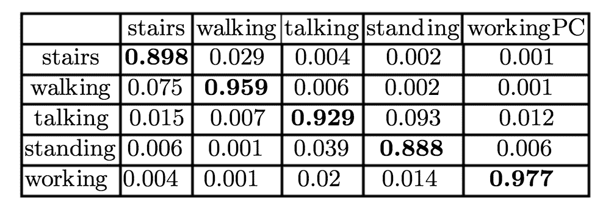
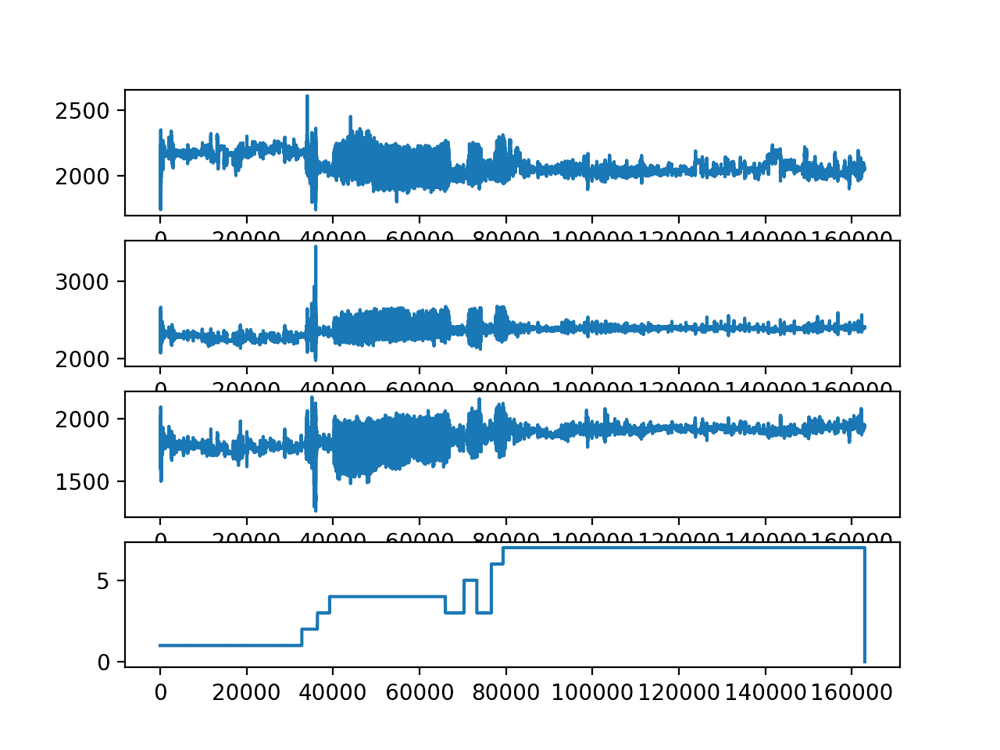

# 一个标准的人类活动识别问题的温和介绍

> 原文： [https://machinelearningmastery.com/how-to-load-and-explore-a-standard-human-activity-recognition-problem/](https://machinelearningmastery.com/how-to-load-and-explore-a-standard-human-activity-recognition-problem/)

人类活动识别是将由专用线束或智能电话记录的加速度计数据序列分类为已知的明确定义的运动的问题。

鉴于每秒产生大量观测结果，观测的时间性质以及缺乏将加速度计数据与已知运动联系起来的明确方法，这是一个具有挑战性的问题。

该问题的经典方法涉及来自基于固定大小窗口的时间序列数据的手工制作特征和训练机器学习模型，例如决策树的集合。困难在于此功能工程需要该领域的深厚专业知识。

最近，诸如循环神经网络和一维卷积神经网络或 CNN 的深度学习方法已经被证明在很少或没有数据特征工程的情况下提供具有挑战性的活动识别任务的最新结果。

在本教程中，您将发现用于时间序列分类的标准人类活动识别数据集以及如何在建模之前探索数据集。

完成本教程后，您将了解：

*   如何加载和准备人类活动识别时间序列分类数据。
*   如何探索和可视化时间序列分类数据，以生成建模的想法。
*   一套用于构建问题，准备数据，建模和评估人类活动识别模型的方法。

让我们开始吧。


标准人类活动识别问题的温和介绍
[tgraham](https://www.flickr.com/photos/tgraham/2546626192/) 的照片，保留一些权利。

## 教程概述

本教程分为 8 个部分;他们是：

1.  人类活动识别
2.  问题描述
3.  加载数据集
4.  绘制单个主题的跟踪
5.  绘制总活动持续时间
6.  绘制每个主题的痕迹
7.  绘制痕量观测的直方图
8.  建模问题的方法

## 人类活动识别

[人类活动识别](https://en.wikipedia.org/wiki/Activity_recognition)或简称 HAR，是基于使用传感器的移动痕迹来预测人正在做什么的问题。

运动通常是正常的室内活动，例如站立，坐着，跳跃和上楼梯。传感器通常位于主体上，例如智能手机或背心，并且经常以三维（x，y，z）记录加速度计数据。

这个想法是，一旦主体的活动被识别和知道，智能计算机系统就可以提供帮助。

这是一个具有挑战性的问题，因为没有明确的分析方法将传感器数据与一般方式的特定动作联系起来。由于收集了大量的传感器数据（例如，每秒数十或数百次观察），并且在开发预测模型时从这些数据中经典使用手工制作的特征和启发式，因此在技术上具有挑战性。

最近，深度学习方法已经在 HAR 问题上取得了成功，因为它们能够自动学习更高阶的特征。

> 基于传感器的活动识别从大量低水平传感器读数中寻找关于人类活动的深刻的高级知识。传统的模式识别方法在过去几年中取得了巨大的进步。然而，这些方法通常严重依赖于启发式手工特征提取，这可能会妨碍它们的泛化表现。 [...]最近，深度学习的最新进展使得可以执行自动高级特征提取，从而在许多领域实现了有希望的表现。

- [基于传感器的活动识别深度学习：调查](https://arxiv.org/abs/1707.03502)

## 问题描述

收集数据集“来自单个胸部安装的加速度计数据集的 _ 活动识别”并由 Casale，Pujol 等人提供。来自西班牙巴塞罗那大学。_

它可以从 UCI 机器学习库免费获得：

*   [来自单个胸部加速计数据集](https://archive.ics.uci.edu/ml/datasets/Activity+Recognition+from+Single+Chest-Mounted+Accelerometer)，UCI 机器学习库的活动识别。

在 2011 年论文“[使用可穿戴设备的加速度计数据](https://link.springer.com/chapter/10.1007/978-3-642-21257-4_36)[人类活动识别](https://link.springer.com/chapter/10.1007/978-3-642-21257-4_36)”中描述并使用该数据集作为序列分类模型的基础。

数据集由来自 15 个不同科目的未校准加速度计数据组成，每个科目执行 7 项活动。每个受试者佩戴定制的胸部加速度计，并以 52Hz（每秒 52 次观察）收集数据。


每个主题佩戴的定制胸部系统的照片。
取自“使用可穿戴设备从加速度计数据中识别人体活动”。

每个受试者以连续的顺序进行和记录七项活动。

所开展的具体活动包括：

*   1：在计算机工作（workingPC）。
*   2：站起来，走路，上下楼梯。
*   3：站立（站立）。
*   4：散步（醒来）。
*   5：上/下楼梯（楼梯）。
*   6：与某人散步和交谈。
*   7：站立时说话（说话）。

该论文使用了数据的一个子集，特别是 14 个主题和 5 个活动。目前尚不清楚为什么没有使用其他 2 项活动（2 和 6）。

> 数据来自 14 名测试者，3 名女性和 11 名年龄在 27 岁至 35 岁之间的男性。[...]所收集的数据由上下楼梯步行 33 分钟，步行 82 分钟，说话 115 分钟组成。保持站立的分钟数和 86 分钟的电脑工作时间。

- [使用可穿戴设备从加速计数据识别人类活动](https://link.springer.com/chapter/10.1007/978-3-642-21257-4_36)，2011。

本文的重点是从数据开发手工制作的功能，以及机器学习算法的开发。

数据被分成一秒钟的观察窗口（52），窗口之间有 50％的重叠。

> 我们使用 52 个样本的窗口从数据中提取特征，对应于 1 秒的加速度计数据，窗口之间有 50％的重叠。从每个窗口，我们建议提取以下特征：窗口中加速度积分的均方根值，以及 Minmax 和的平均值。 [...]尽管如此，为了完成这组特征，我们添加了已被证明对人类活动识别有用的特征，如：平均值，标准偏差，偏度，峰度，加速度计轴的每对成对之间的相关性（不包括幅度） ，七级小波分解系数的能量。通过这种方式，我们获得了 319 维特征向量。

- [使用可穿戴设备从加速计数据识别人类活动](https://link.springer.com/chapter/10.1007/978-3-642-21257-4_36)，2011。

使用 5 倍交叉验证拟合和评估一套机器学习模型，并获得 94％的准确度。



随机森林的混淆矩阵在数据集上进行评估。
取自“使用可穿戴设备从加速度计数据中识别人体活动”。

## 加载数据集

数据集可以直接从 UCI 机器学习库下载。

*   [下载数据集](https://archive.ics.uci.edu/ml/machine-learning-databases/00287/Activity%20Recognition%20from%20Single%20Chest-Mounted%20Accelerometer.zip)

将数据集解压缩到名为“ _HAR_ ”的新目录中。

该目录包含 CSV 文件列表，每个主题一个（1-15）和自述文件。

每个文件包含 5 列，行号，x，y 和 z 加速度计读数以及 0 到 7 的类号，其中类 0 表示“无活动”，类 1-7 对应于上一节中列出的活动。

例如，下面是文件“ _1.csv_ ”的前 5 行：

```py
0,1502,2215,2153,1
1,1667,2072,2047,1
2,1611,1957,1906,1
3,1601,1939,1831,1
4,1643,1965,1879,1
...
```

首先，我们可以将每个文件作为单个 NumPy 数组加载并删除第一列。

下面名为 _load_dataset（）_ 的函数将加载 HAR 目录中的所有 CSV 文件，删除第一列并返回 15 个 NumPy 数组的列表。

```py
# load sequence for each subject, returns a list of numpy arrays
def load_dataset(prefix=''):
	subjects = list()
	directory = prefix + 'HAR/'
	for name in listdir(directory):
		filename = directory + '/' + name
		if not filename.endswith('.csv'):
			continue
		df = read_csv(filename, header=None)
		# drop row number
		values = df.values[:, 1:]
		subjects.append(values)
	return subjects
```

下面列出了完整的示例。

```py
# load dataset
from os import listdir
from pandas import read_csv

# load sequence for each subject, returns a list of numpy arrays
def load_dataset(prefix=''):
	subjects = list()
	directory = prefix + 'HAR/'
	for name in listdir(directory):
		filename = directory + '/' + name
		if not filename.endswith('.csv'):
			continue
		df = read_csv(filename, header=None)
		# drop row number
		values = df.values[:, 1:]
		subjects.append(values)
	return subjects

# load
subjects = load_dataset()
print('Loaded %d subjects' % len(subjects))
```

运行该示例将加载所有数据并打印已加载主题的数量。

```py
Loaded 15 subjects
```

注意，目录中的文件是按文件顺序导航的，这可能与主题顺序不同，例如 _10.csv_ 以文件顺序出现在 _2.csv_ 之前。我相信这在本教程中无关紧要。

现在我们知道了如何加载数据，我们可以通过一些可视化来探索它。

## 绘制单个主题的跟踪

良好的第一个可视化是绘制单个主题的数据。

我们可以为给定主题的每个变量创建一个图形，包括 x，y 和 z 加速度计数据，以及相关的类类值。

下面的函数 _plot_subject（）_ 将绘制给定主题的数据。

```py
# plot the x, y, z acceleration and activities for a single subject
def plot_subject(subject):
	pyplot.figure()
	# create a plot for each column
	for col in range(subject.shape[1]):
		pyplot.subplot(subject.shape[1], 1, col+1)
		pyplot.plot(subject[:,col])
	pyplot.show()
```

我们可以将它与上一节中的数据加载结合起来，并绘制第一个加载主题的数据。

```py
# plot a subject
from os import listdir
from pandas import read_csv
from matplotlib import pyplot

# load sequence for each subject, returns a list of numpy arrays
def load_dataset(prefix=''):
	subjects = list()
	directory = prefix + 'HAR/'
	for name in listdir(directory):
		filename = directory + '/' + name
		if not filename.endswith('.csv'):
			continue
		df = read_csv(filename, header=None)
		# drop row number
		values = df.values[:, 1:]
		subjects.append(values)
	return subjects

# plot the x, y, z acceleration and activities for a single subject
def plot_subject(subject):
	pyplot.figure()
	# create a plot for each column
	for col in range(subject.shape[1]):
		pyplot.subplot(subject.shape[1], 1, col+1)
		pyplot.plot(subject[:,col])
	pyplot.show()

# load
subjects = load_dataset()
print('Loaded %d subjects' % len(subjects))
# plot activities for a single subject
plot_subject(subjects[0])
```

运行该示例为第一个加载主题的每个变量创建一个线图。

我们可以在序列的开头看到一些非常大的运动，这可能是一个可以被删除的异常或异常行为。

我们还可以看到主题多次执行某些操作。例如，仔细查看类变量的图（底部图）表明受试者按以下顺序执行活动：1,2,0,3,0,4,3,5,3,6,7。活动 3 进行了两次。


第一个加载主题的 x，y，z 和类的线图。

我们可以重新运行此代码并绘制第二个加载的主题（可能是 _10.csv_ ）。

```py
...
# plot activities for a single subject
plot_subject(subjects[1])
```

运行该示例会创建一个类似的图。

我们可以看到更多细节，这表明在上一个情节开头看到的大异常值可能是从该主题的痕迹中清除了值。

我们看到类似的活动序列，活动 3 再次发生两次。

我们还可以看到，某些活动的执行时间比其他活动长得多。这可能会影响模型区分活动的能力，例如：两个受试者的活动 3（站立）相对于所进行的其他活动具有非常少的数据。



第二个加载主题的 x，y，z 和类的线图。

## 绘制总活动持续时间

上一节提出了一个问题，即我们对所有主题的每项活动进行了多长时间或多少次观察。

如果一项活动的数据多于另一项活动，这可能很重要，这表明不太好的活动可能难以建模。

我们可以通过按活动和主题对所有观察进行分组来研究这一点，并绘制分布图。这将了解每个主题在跟踪过程中花费多长时间执行每项活动。

首先，我们可以为每个主题分组活动。

我们可以通过为每个主题创建字典并按活动存储所有跟踪数据来完成此操作。下面的 _group_by_activity（）_ 功能将为每个主题执行此分组。

```py
# returns a list of dict, where each dict has one sequence per activity
def group_by_activity(subjects, activities):
	grouped = [{a:s[s[:,-1]==a] for a in activities} for s in subjects]
	return grouped
```

接下来，我们可以计算每个主题的每个活动的总持续时间。

我们知道加速度计数据是以 52Hz 记录的，因此我们可以将每个活动的每个跟踪的长度除以 52，以便以秒为单位总结持续时间。

以下名为 _plot_durations（）_ 的函数将计算每个主题的每个活动的持续时间，并将结果绘制为箱线图。盒状和须状图是总结每个活动的 15 个持续时间的有用方式，因为它描述了持续时间的扩展而不假设分布。

```py
# calculate total duration in sec for each activity per subject and plot
def plot_durations(grouped, activities):
	# calculate the lengths for each activity for each subject
	freq = 52
	durations = [[len(s[a])/freq for s in grouped] for a in activities]
	pyplot.boxplot(durations, labels=activities)
	pyplot.show()
```

下面列出了绘制活动持续时间分布的完整示例。

```py
# durations by activity
from os import listdir
from pandas import read_csv
from matplotlib import pyplot

# load sequence for each subject, returns a list of numpy arrays
def load_dataset(prefix=''):
	subjects = list()
	directory = prefix + 'HAR/'
	for name in listdir(directory):
		filename = directory + '/' + name
		if not filename.endswith('.csv'):
			continue
		df = read_csv(filename, header=None)
		# drop row number
		values = df.values[:, 1:]
		subjects.append(values)
	return subjects

# returns a list of dict, where each dict has one sequence per activity
def group_by_activity(subjects, activities):
	grouped = [{a:s[s[:,-1]==a] for a in activities} for s in subjects]
	return grouped

# calculate total duration in sec for each activity per subject and plot
def plot_durations(grouped, activities):
	# calculate the lengths for each activity for each subject
	freq = 52
	durations = [[len(s[a])/freq for s in grouped] for a in activities]
	pyplot.boxplot(durations, labels=activities)
	pyplot.show()

# load
subjects = load_dataset()
print('Loaded %d subjects' % len(subjects))
# group traces by activity for each subject
activities = [i for i in range(0,8)]
grouped = group_by_activity(subjects, activities)
# plot durations
plot_durations(grouped, activities)
```

运行该示例绘制了每个主题的活动持续时间的分布。

我们可以看到，对于活动 0（无活动），2（站立，行走和上下楼梯），5（上/下楼梯）和 6（步行和说话）的观察相对较少。

这可能表明为什么活动 2 和 6 被排除在原始论文的实验之外。

我们还可以看到每个主题在活动 1（站立，行走和上下楼梯）和活动 7（站立时说话）上花费了大量时间。这些活动可能过多。准备模型数据可能有益于对这些活动进行欠采样或对其他活动进行采样。


每个受试者活动持续时间分布的箱线图

## 绘制每个主题的痕迹

接下来，查看每个主题的跟踪数据可能会很有趣。

一种方法是在单个图形上绘制单个主题的所有迹线，然后垂直排列所有图形。这将允许跨主题和主题内的痕迹进行比较。

以下名为 _plot_subjects（）_ 的函数将在单独的图上绘制 15 个主题中每个主题的加速度计数据。每个 x，y 和 z 数据的迹线分别绘制为橙色，绿色和蓝色。

```py
# plot the x, y, z acceleration for each subject
def plot_subjects(subjects):
	pyplot.figure()
	# create a plot for each subject
	for i in range(len(subjects)):
		pyplot.subplot(len(subjects), 1, i+1)
		# plot each of x, y and z
		for j in range(subjects[i].shape[1]-1):
			pyplot.plot(subjects[i][:,j])
	pyplot.show()
```

下面列出了完整的示例。

```py
# plot accelerometer data for all subjects
from os import listdir
from pandas import read_csv
from matplotlib import pyplot

# load sequence for each subject, returns a list of numpy arrays
def load_dataset(prefix=''):
	subjects = list()
	directory = prefix + 'HAR/'
	for name in listdir(directory):
		filename = directory + '/' + name
		if not filename.endswith('.csv'):
			continue
		df = read_csv(filename, header=None)
		# drop row number
		values = df.values[:, 1:]
		subjects.append(values)
	return subjects

# plot the x, y, z acceleration for each subject
def plot_subjects(subjects):
	pyplot.figure()
	# create a plot for each subject
	for i in range(len(subjects)):
		pyplot.subplot(len(subjects), 1, i+1)
		# plot each of x, y and z
		for j in range(subjects[i].shape[1]-1):
			pyplot.plot(subjects[i][:,j])
	pyplot.show()

# load
subjects = load_dataset()
print('Loaded %d subjects' % len(subjects))
# plot trace data for each subject
plot_subjects(subjects)
```

运行该示例将创建一个包含 15 个图的图形。

我们正在研究一般而非具体的趋势。

*   我们可以看到很多橙色和绿色以及非常小的蓝色，这表明 z 数据在建模这个问题时可能不太重要。
*   我们可以看到跟踪数据在 x 和 y 跟踪的相同时间发生相同的一般变化，这表明可能只需要一个数据轴来拟合预测模型。
*   我们可以看到每个受试者在序列开始时（前 60 秒）在迹线中具有相同的大尖峰，可能与实验的启动有关。
*   我们可以在跟踪数据中看到跨主题的类似结构，尽管某些迹线看起来比其他迹线更柔和，例如比较第一和第二个图上的幅度。

每个受试者可具有不同的完整迹线长度，因此通过 x 轴的直接比较可能是不合理的（例如，同时执行类似的活动）。无论如何，我们并不真正关心这个问题。


所有 15 名受试者的加速度计跟踪数据的线图。

痕迹似乎具有相同的一般比例，但受试者之间的幅度差异表明，每个受试者重新缩放数据可能比跨受试者缩放更有意义。

这对于训练数据可能是有意义的，但对于缩放测试对象的数据可能在方法上具有挑战性。它需要或假设在预测活动之前可以获得整个跟踪。这对于模型的离线使用很好，但不能在线使用模型。它还表明，使用预先校准的跟踪数据（例如以固定规模进入的数据）可以更容易地在线使用模型。

## 绘制痕量观测的直方图

上一节中关于跨不同主题的显着不同尺度可能性的观点可能会给这个数据集的建模带来挑战。

我们可以通过绘制加速度计数据的每个轴的观测分布的直方图来探索这一点。

与上一节一样，我们可以为每个主题创建一个绘图，然后将所有主题的绘图与相同的 x 轴垂直对齐，以帮助发现展开的明显差异。

更新的 _plot_subjects（）_ 函数用于绘制直方图而不是线图，如下所示。 _hist（）_ 函数用于为加速度计数据的每个轴创建直方图，并且使用大量箱（100）来帮助展开图中的数据。子图也都共享相同的 x 轴以帮助进行比较。

```py
# plot the x, y, z acceleration for each subject
def plot_subjects(subjects):
	pyplot.figure()
	# create a plot for each subject
	xaxis = None
	for i in range(len(subjects)):
		ax = pyplot.subplot(len(subjects), 1, i+1, sharex=xaxis)
		if i == 0:
			xaxis = ax
		# plot a histogram of x data
		for j in range(subjects[i].shape[1]-1):
			pyplot.hist(subjects[i][:,j], bins=100)
	pyplot.show()
```

下面列出了完整的示例

```py
# plot histograms of trace data for all subjects
from os import listdir
from pandas import read_csv
from matplotlib import pyplot

# load sequence for each subject, returns a list of numpy arrays
def load_dataset(prefix=''):
	subjects = list()
	directory = prefix + 'HAR/'
	for name in listdir(directory):
		filename = directory + '/' + name
		if not filename.endswith('.csv'):
			continue
		df = read_csv(filename, header=None)
		# drop row number
		values = df.values[:, 1:]
		subjects.append(values)
	return subjects

# plot the x, y, z acceleration for each subject
def plot_subjects(subjects):
	pyplot.figure()
	# create a plot for each subject
	xaxis = None
	for i in range(len(subjects)):
		ax = pyplot.subplot(len(subjects), 1, i+1, sharex=xaxis)
		if i == 0:
			xaxis = ax
		# plot a histogram of x data
		for j in range(subjects[i].shape[1]-1):
			pyplot.hist(subjects[i][:,j], bins=100)
	pyplot.show()

# load
subjects = load_dataset()
print('Loaded %d subjects' % len(subjects))
# plot trace data for each subject
plot_subjects(subjects)
```

运行该示例将创建一个包含 15 个图的单个图形，每个图形对应一个图形，以及每个图表的 3 个加速度计数据的 3 个直方图。

蓝色，橙色和绿色三种颜色代表 x，y 和 z 轴。

该图表明加速度计的每个轴的分布是高斯分布或者非常接近高斯分布。这可以帮助沿着加速度计数据的每个轴进行简单的离群值检测和移除。

该图确实有助于显示主题内的分布与主题之间的分布差异。

在每个主题内，共同模式是 x（蓝色）和 z（绿色）一起分组到左边，y 数据（橙色）分开到右边。 y 的分布通常更尖锐，因为 x 和 z 的分布更平坦。

在整个主题中，我们可以看到一般的聚类值约为 2,000（无论单位是多少），尽管有很多差异。这种显着的分布差异确实表明在执行任何跨主题建模之前，需要至少标准化（转换为零均值和单位方差）每个轴和每个主体的数据。


每个受试者的加速度计数据的直方图

## 建模问题的方法

在本节中，我们将基于对数据集的上述探索，探索针对该问题的数据准备和建模的一些想法和方法。

这些可能有助于特别是对该数据集建模，但也有助于人类活动识别，甚至是一般的时间序列分类问题。

### 问题框架

尽管所有方法都围绕时间序列分类的思想，但有许多方法可以将数据构建为预测建模问题。

要考虑的两种主要方法是：

*   **每个受试者**：每个受试者的痕量数据的模型活动分类。
*   **交叉主题**：跨主题的跟踪数据的模型活动分类。

后者，交叉主题，是更理想的，但如果目标是深刻理解给定的主题，例如前者也可能是有趣的。家中的个性化模型。

在建模过程中构建数据的两种主要方法包括：

*   **分段活动**：跟踪数据可以按活动预先分段，并且可以针对每个活动对整个跟踪或其特征进行训练的模型。
*   **滑动窗口**：每个主体的连续轨迹被分成滑动窗口，有或没有重叠，窗口的每个活动的模式被视为要预测的活动。

就模型的实际使用而言，前一种方法可能不太现实，但可能是更容易建模的问题。后者是原始论文中使用的问题的框架，其中制备了具有 50％重叠的 1 秒窗口。

我没有看到问题框架中的重叠的好处，除了加倍训练数据集的大小，这可能有益于深度神经网络。事实上，我预计它可能会导致过度模型。

### 数据准备

数据表明在建模过程中可能有用的一些准备方案：

*   将加速度计观测值下采样到几分之一秒可能是有帮助的，例如， 1 / 4,1 / 2,1,2 秒。
*   截断原始数据的前 60 秒可能是谨慎的，因为它似乎与实验的启动有关，并且所有主体当时正在执行活动 1（在计算机上工作）。
*   使用简单的离群值检测和去除方法（例如，每个轴的平均值的标准差的 3 到 4 倍的值）可能是有用的。
*   也许删除具有相对较少观察的活动将是明智的，或者导致对预测方法（例如，活动 0,2 和 6）的更公平的评估。
*   也许通过对代表性不足的活动进行过度采样或对训练数据集中过度代表的活动进行抽样调整来重新平衡活动可能有助于建模。
*   尝试不同的窗口尺寸将是有趣的（例如 1,5,10,30 秒），尤其是在对观察的下采样的确证中。
*   对于任何跨主题模型，几乎肯定需要标准化每个主题的数据。在每个受试者标准化后对受试者的数据进行标准化也可能是有用的。

如前一节所述，每个主题的数据标准化确实引入了方法问题，并且无论如何都可以使用，因为需要来自原始硬件系统的校准观察。

### 问题建模

我建议使用神经网络来探索这个问题。

与使用特征工程和特定于域的手工制作特征的论文中使用的方法不同，直接对原始数据进行建模（下采样或其他方式）将是有用且通用的。

首先，我建议使用强大的方法（如随机森林或梯度增强机器）发现表现基线。然后探索特别适合时间序列分类问题的神经网络方法。

可能适合的两种类型的神经网络架构是：

*   卷积神经网络或 CNN。
*   循环神经网络或 RNN，特别是长短期记忆或 LSTM。

第三个是两者的混合：

*   CNN LSTMs。

CNN 能够从输入序列中提取特征，例如输入加速度计数据的窗口。诸如 LSTM 之类的 RNN 能够直接从长序列的输入数据中学习，并学习数据中的长期关系。

我希望序列数据中几乎没有因果关系，除了每个主题看起来他们正在执行相同的人为行动序列，我们不想学习。朴素地，这可能表明 CNN 更适合于在给定一系列观察到的加速度计数据的情况下预测活动。

一维 CNN 已广泛用于此类问题，其中一个通道用于加速度计数据的每个轴。一个很好的简单起点是直接在序列数据的窗口上拟合 CNN 模型。这是 2014 年题为“[使用移动传感器进行人类活动识别的卷积神经网络](https://ieeexplore.ieee.org/abstract/document/7026300/)”的论文中描述的方法，并且从下面的图中可以看出更清楚。


用于人类活动识别的 1D CNN 架构的示例
取自“使用移动传感器的用于人类活动识别的卷积神经网络”。

CNN LSTM 可用于 CNN 学习观察子序列的表示，然后 LSTM 学习这些子序列。

例如，CNN 可以提取一秒钟的加速度计数据，然后可以重复 30 秒，以向 LSTM 提供 30 个 CNN 解释数据的时间步长。

我希望这三个方法对这个问题和类似的问题都很有意思。

### 模型评估

我不认为窗口的重叠是有用的，并且实际上如果在交叉验证期间跟踪数据的部分在列车和测试数据集中都可用，则实际上可能导致轻微的误导性结果。然而，它会增加训练数据的数量。

我认为重要的是将数据暴露给模型，同时保持观察的时间顺序。对于给定主题，来自单个活动的多个窗口可能看起来相似，并且随机改组和分离窗口以训练测试数据可能导致误导结果。

我不建议在原始论文中使用随机改组的 k-fold 交叉验证。我希望这会带来乐观的结果，每个 15 个主题的痕迹中有一秒钟的数据窗口混合在一起进行训练和测试。

也许对这些数据中的模型进行公平评估将是按主题使用留一法交叉验证或 LOOCV。这是模型适合前 14 个主题并在第 15 个主题的所有窗口上进行评估的地方。重复该过程，其中每个受试者有机会被用作保持测试数据集。

按主题分割数据集避免了在模型评估期间与各个窗口的时间排序相关的任何问题，因为所有窗口都将保证新的/看不见的数据。

如果你探索这些建模思想中的任何一个，我很想知道。

## 进一步阅读

如果您希望深入了解，本节将提供有关该主题的更多资源。

### 文件

*   [使用加速度计进行活动识别的综合研究](http://mdpi.com/2227-9709/5/2/27)，2018
*   [基于传感器的活动识别深度学习：调查](https://arxiv.org/abs/1707.03502)，2017。
*   [使用可穿戴设备从加速度计数据识别人类活动](https://link.springer.com/chapter/10.1007/978-3-642-21257-4_36)，2011。
*   [用于使用移动传感器识别人类活动的卷积神经网络](https://ieeexplore.ieee.org/abstract/document/7026300/)，2014。

### API

*   [sklearn.preprocessing.StandardScaler API](http://scikit-learn.org/stable/modules/generated/sklearn.preprocessing.StandardScaler.html)
*   [sklearn.preprocessing.MinMaxScaler API](http://scikit-learn.org/stable/modules/generated/sklearn.preprocessing.MinMaxScaler.html)
*   [keras.utils.to_categorical API](https://keras.io/utils/#to_categorical)
*   [Keras 卷积层](https://keras.io/layers/convolutional/)

### 用品

*   [活动识别，维基百科](https://en.wikipedia.org/wiki/Activity_recognition)
*   [来自单个胸部加速计数据集](https://archive.ics.uci.edu/ml/datasets/Activity+Recognition+from+Single+Chest-Mounted+Accelerometer)，UCI 机器学习库的活动识别。

## 摘要

在本教程中，您发现了一个用于时间序列分类的标准人类活动识别数据集。

具体来说，你学到了：

*   如何加载和准备人类活动识别时间序列分类数据。
*   如何探索和可视化时间序列分类数据，以生成建模的想法。
*   一套用于构建问题，准备数据，建模和评估人类活动识别模型的方法。

你有任何问题吗？
在下面的评论中提出您的问题，我会尽力回答。