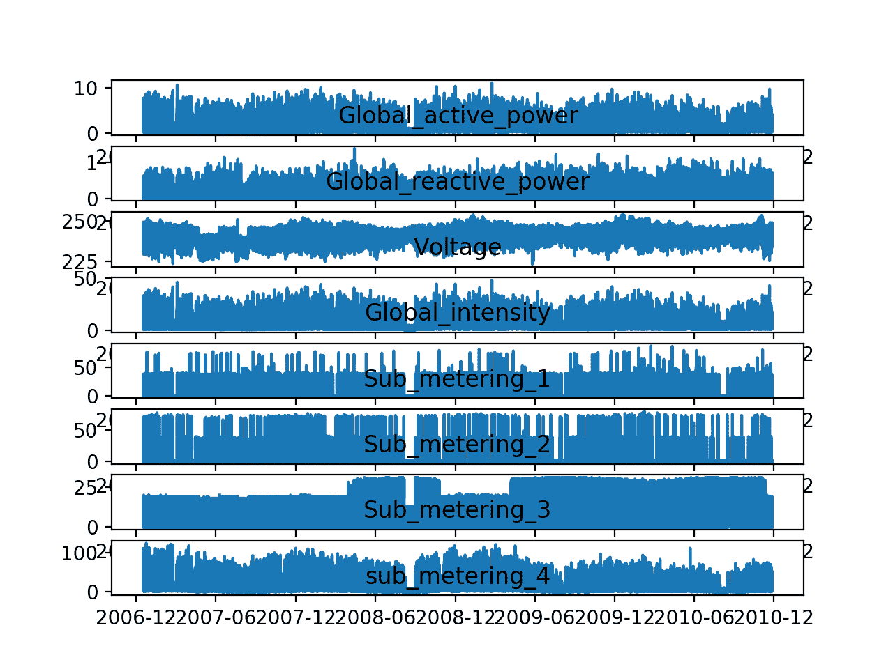
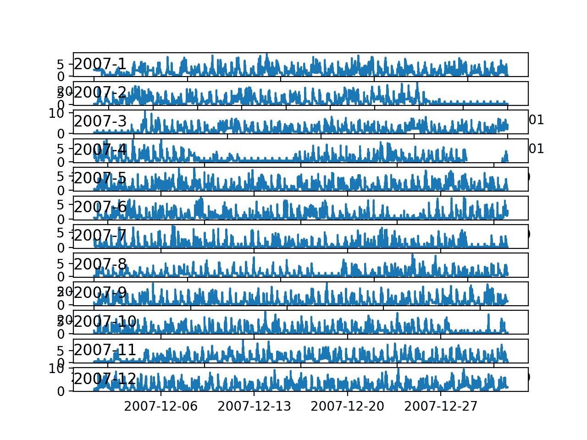
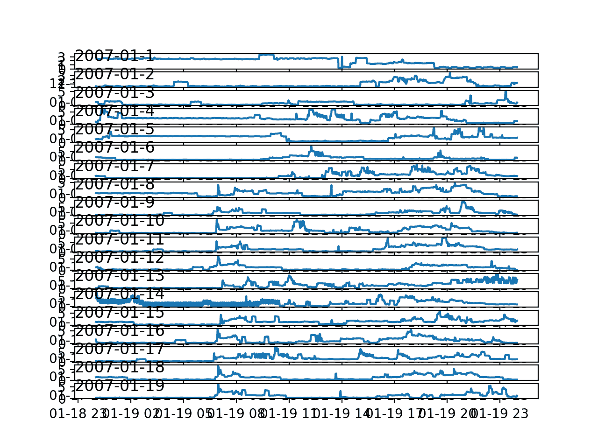
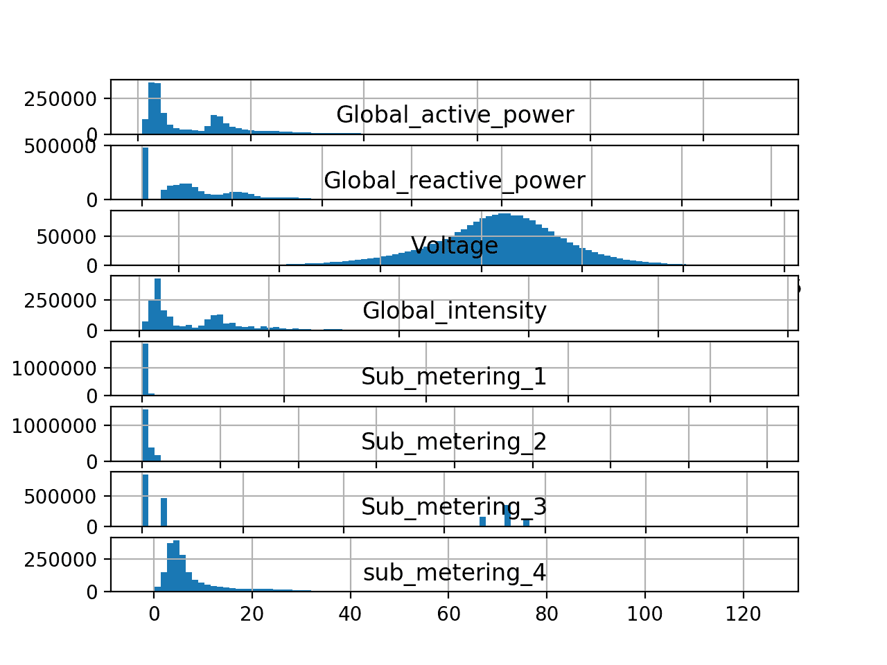

# 如何加载和探索家庭用电数据

> 原文： [https://machinelearningmastery.com/how-to-load-and-explore-household-electricity-usage-data/](https://machinelearningmastery.com/how-to-load-and-explore-household-electricity-usage-data/)

鉴于智能电表的兴起以及太阳能电池板等发电技术的广泛采用，可提供大量的用电数据。

该数据代表功率相关变量的多变量时间序列，而这些变量又可用于建模甚至预测未来的电力消耗。

在本教程中，您将发现用于多步时间序列预测的家庭功耗数据集，以及如何使用探索性分析更好地理解原始数据。

完成本教程后，您将了解：

*   家庭用电量数据集，描述四年内单个房屋的用电量。
*   如何使用一系列线图来探索和理解数据集，用于数据分布的系列数据和直方图。
*   如何使用对问题的新理解来考虑预测问题的不同框架，可以准备数据的方式以及可以使用的建模方法。

让我们开始吧。


如何加载和探索家庭用电数据
[Sheila Sund](https://www.flickr.com/photos/sheila_sund/24762233519/) 的照片，保留一些权利。

## 教程概述

本教程分为五个部分;他们是：

1.  功耗数据集
2.  加载数据集
3.  随着时间的推移观察模式
4.  时间序列数据分布
5.  关于建模的想法

## 家庭用电量数据集

[家庭用电量](https://archive.ics.uci.edu/ml/datasets/individual+household+electric+power+consumption)数据集是一个多变量时间序列数据集，描述了四年内单个家庭的用电量。

该数据是在 2006 年 12 月至 2010 年 11 月之间收集的，并且每分钟收集家庭内的能耗观察结果。

它是一个多变量系列，由七个变量组成（除日期和时间外）;他们是：

*   **global_active_power** ：家庭消耗的总有功功率（千瓦）。
*   **global_reactive_power** ：家庭消耗的总无功功率（千瓦）。
*   **电压**：平均电压（伏特）。
*   **global_intensity** ：平均电流强度（安培）。
*   **sub_metering_1** ：厨房的有功电能（瓦特小时的有功电能）。
*   **sub_metering_2** ：用于洗衣的有功能量（瓦特小时的有功电能）。
*   **sub_metering_3** ：气候控制系统的有功电能（瓦特小时的有功电能）。

有功和无功电能参考[交流电](https://en.wikipedia.org/wiki/AC_power)的技术细节。

一般而言，有功能量是家庭消耗的实际功率，而无功能量是线路中未使用的功率。

我们可以看到，数据集通过房屋中的主电路，特别是厨房，洗衣房和气候控制，提供有功功率以及有功功率的某种划分。这些不是家庭中的所有电路。

通过首先将有功能量转换为瓦特小时，然后以瓦时为单位减去其他亚计量有功能量，可以从有功能量计算剩余瓦特小时，如下所示：

```py
sub_metering_remainder = (global_active_power * 1000 / 60) - (sub_metering_1 + sub_metering_2 + sub_metering_3)
```

数据集似乎是在没有开创性参考文件的情况下提供的。

尽管如此，该数据集已成为评估多步预测的时间序列预测和机器学习方法的标准，特别是用于预测有功功率。此外，尚不清楚数据集中的其他特征是否可以使模型在预测有功功率方面受益。

## 加载数据集

数据集可以从 UCI 机器学习库下载为单个 20 兆字节的.zip 文件：

*   [household_power_consumption.zip](https://archive.ics.uci.edu/ml/machine-learning-databases/00235/household_power_consumption.zip)

下载数据集并将其解压缩到当前工作目录中。您现在将拥有大约 127 兆字节的文件“`household_power_consumption.txt`”并包含所有观察结果

检查数据文件。

以下是原始数据文件中的前五行数据（和标题）。

```py
Date;Time;Global_active_power;Global_reactive_power;Voltage;Global_intensity;Sub_metering_1;Sub_metering_2;Sub_metering_3
16/12/2006;17:24:00;4.216;0.418;234.840;18.400;0.000;1.000;17.000
16/12/2006;17:25:00;5.360;0.436;233.630;23.000;0.000;1.000;16.000
16/12/2006;17:26:00;5.374;0.498;233.290;23.000;0.000;2.000;17.000
16/12/2006;17:27:00;5.388;0.502;233.740;23.000;0.000;1.000;17.000
16/12/2006;17:28:00;3.666;0.528;235.680;15.800;0.000;1.000;17.000
...
```

我们可以看到数据列用分号分隔（'_;_ '）。

据报道，该数据在该时间段内每天有一行。

数据确实缺少值;例如，我们可以在 28/4/2007 左右看到 2-3 天的缺失数据。

```py
...
28/4/2007;00:20:00;0.492;0.208;236.240;2.200;0.000;0.000;0.000
28/4/2007;00:21:00;?;?;?;?;?;?;
28/4/2007;00:22:00;?;?;?;?;?;?;
28/4/2007;00:23:00;?;?;?;?;?;?;
28/4/2007;00:24:00;?;?;?;?;?;?;
...
```

我们可以通过将数据文件作为 Pandas DataFrame 加载并总结加载的数据来启动。

我们可以使用 [read_csv（）函数](https://pandas.pydata.org/pandas-docs/stable/generated/pandas.read_csv.html)来加载数据。

使用此功能很容易加载数据，但正确加载它有点棘手。

具体来说，我们需要做一些自定义的事情：

*   将列之间的单独值指定为分号（sep =';'）
*   指定第 0 行具有列的名称（header = 0）
*   指定我们有大量的 RAM 来避免警告我们将数据作为对象数组而不是数组加载，因为缺少数据的'？'值（low_memory = False）。
*   指定 Pandas 在解析日期时尝试推断日期时间格式是可以的，这样会更快（infer_datetime_format = True）
*   指定我们要将日期和时间列一起解析为名为“datetime”的新列（parse_dates = {'datetime'：[0,1]}）
*   指定我们希望新的“datetime”列成为 DataFrame 的索引（index_col = ['datetime']）。

将所有这些放在一起，我们现在可以加载数据并汇总加载的形状和前几行。

```py
# load all data
dataset = read_csv('household_power_consumption.txt', sep=';', header=0, low_memory=False, infer_datetime_format=True, parse_dates={'datetime':[0,1]}, index_col=['datetime'])
# summarize
print(dataset.shape)
print(dataset.head())
```

接下来，我们可以使用带有 NaN 值的“？”字符标记所有缺失值，这是一个浮点数。

这将允许我们将数据作为一个浮点值数组而不是混合类型来处理，效率较低。

```py
# mark all missing values
dataset.replace('?', nan, inplace=True)
```

现在，我们可以使用上一节中的计算创建一个包含剩余子计量的新列。

```py
# add a column for for the remainder of sub metering
values = dataset.values.astype('float32')
dataset['sub_metering_4'] = (values[:,0] * 1000 / 60) - (values[:,4] + values[:,5] + values[:,6])
```

我们现在可以将清理后的数据集版本保存到新文件中;在这种情况下，我们只需将文件扩展名更改为.csv，并将数据集保存为“`household_power_consumption.csv`”。

```py
# save updated dataset
dataset.to_csv('household_power_consumption.csv')
```

为了确认我们没有弄乱，我们可以重新加载数据集并汇总前五行。

```py
# load the new file
dataset = read_csv('household_power_consumption.csv', header=None)
print(dataset.head())
```

将所有这些结合在一起，下面列出了加载，清理和保存数据集的完整示例。

```py
# load and clean-up data
from numpy import nan
from pandas import read_csv
# load all data
dataset = read_csv('household_power_consumption.txt', sep=';', header=0, low_memory=False, infer_datetime_format=True, parse_dates={'datetime':[0,1]}, index_col=['datetime'])
# summarize
print(dataset.shape)
print(dataset.head())
# mark all missing values
dataset.replace('?', nan, inplace=True)
# add a column for for the remainder of sub metering
values = dataset.values.astype('float32')
dataset['sub_metering_4'] = (values[:,0] * 1000 / 60) - (values[:,4] + values[:,5] + values[:,6])
# save updated dataset
dataset.to_csv('household_power_consumption.csv')
# load the new dataset and summarize
dataset = read_csv('household_power_consumption.csv', header=0, infer_datetime_format=True, parse_dates=['datetime'], index_col=['datetime'])
print(dataset.head())
```

运行该示例首先加载原始数据并汇总加载数据的形状和前五行。

```py
(2075259, 7)

                    Global_active_power      ...       Sub_metering_3
datetime                                     ...
2006-12-16 17:24:00               4.216      ...                 17.0
2006-12-16 17:25:00               5.360      ...                 16.0
2006-12-16 17:26:00               5.374      ...                 17.0
2006-12-16 17:27:00               5.388      ...                 17.0
2006-12-16 17:28:00               3.666      ...                 17.0
```

然后清理数据集并将其保存到新文件中。

我们加载这个新文件并再次打印前五行，显示删除日期和时间列以及添加新的子计量列。

```py
                     Global_active_power       ...        sub_metering_4
datetime                                       ...
2006-12-16 17:24:00                4.216       ...             52.266670
2006-12-16 17:25:00                5.360       ...             72.333336
2006-12-16 17:26:00                5.374       ...             70.566666
2006-12-16 17:27:00                5.388       ...             71.800000
2006-12-16 17:28:00                3.666       ...             43.100000
```

我们可以查看新的'`household_power_consumption.csv`'文件并检查缺失的观察结果是否用空列标记，大熊猫将正确读作 NaN，例如第 190,499 行：

```py
...
2007-04-28 00:20:00,0.492,0.208,236.240,2.200,0.000,0.000,0.0,8.2
2007-04-28 00:21:00,,,,,,,,
2007-04-28 00:22:00,,,,,,,,
2007-04-28 00:23:00,,,,,,,,
2007-04-28 00:24:00,,,,,,,,
2007-04-28 00:25:00,,,,,,,,
...
```

现在我们已经清理了数据集版本，我们可以使用可视化进一步调查它。

## 随着时间的推移观察模式

数据是多变量时间序列，理解时间序列的最佳方法是创建线图。

我们可以从为八个变量中的每一个创建单独的线图开始。

下面列出了完整的示例。

```py
# line plots
from pandas import read_csv
from matplotlib import pyplot
# load the new file
dataset = read_csv('household_power_consumption.csv', header=0, infer_datetime_format=True, parse_dates=['datetime'], index_col=['datetime'])
# line plot for each variable
pyplot.figure()
for i in range(len(dataset.columns)):
	pyplot.subplot(len(dataset.columns), 1, i+1)
	name = dataset.columns[i]
	pyplot.plot(dataset[name])
	pyplot.title(name, y=0)
pyplot.show()
```

运行该示例将创建一个包含八个子图的单个图像，每个图对应一个变量。

这给了我们四分之一分钟观测的真正高水平。我们可以看到'`Sub_metering_3`'（环境控制）中可能没有直接映射到炎热或寒冷年份的有趣事情。也许安装了新系统。

有趣的是，'`sub_metering_4`'的贡献似乎随着时间的推移而减少，或呈现下降趋势，可能与'`Sub_metering_3`系列末尾的稳固增长相匹配”。

这些观察确实强调了在拟合和评估任何模型时遵守该数据的子序列的时间顺序的需要。

我们或许可以在'`Global_active_power`'和其他一些变量中看到季节性影响的波动。

有一些尖刻的用法可能与特定时期相匹配，例如周末。



功耗数据集中每个变量的线图

让我们放大并专注于'`Global_active_power`'或'_ 有功功率 _'。

我们可以为每年创建一个新的有效功率图，以查看这些年来是否存在任何共同模式。 2006 年的第一年，有不到一个月的数据，所以将其从情节中删除。

下面列出了完整的示例。

```py
# yearly line plots
from pandas import read_csv
from matplotlib import pyplot
# load the new file
dataset = read_csv('household_power_consumption.csv', header=0, infer_datetime_format=True, parse_dates=['datetime'], index_col=['datetime'])
# plot active power for each year
years = ['2007', '2008', '2009', '2010']
pyplot.figure()
for i in range(len(years)):
	# prepare subplot
	ax = pyplot.subplot(len(years), 1, i+1)
	# determine the year to plot
	year = years[i]
	# get all observations for the year
	result = dataset[str(year)]
	# plot the active power for the year
	pyplot.plot(result['Global_active_power'])
	# add a title to the subplot
	pyplot.title(str(year), y=0, loc='left')
pyplot.show()
```

运行该示例将创建一个包含四个线图的单个图像，一个数据集中的每年全年（或大部分为全年）数据。

我们可以看到多年来的一些共同的总体模式，例如 2 月至 3 月左右和 8 月至 9 月左右，我们看到消费明显减少。

在夏季月份（北半球的年中），我们似乎也看到了下降的趋势，并且可能在冬季月份向地块的边缘消耗更多。这些可能显示出消费的年度季节性模式。

我们还可以在至少第一，第三和第四个图中看到一些缺失数据。


大多数年份的有功功率线图

我们可以继续放大消费量，并在 2007 年的 12 个月中查看有功功率。

这可能有助于梳理整个月的总体结构，例如每日和每周模式。

下面列出了完整的示例。

```py
# monthly line plots
from pandas import read_csv
from matplotlib import pyplot
# load the new file
dataset = read_csv('household_power_consumption.csv', header=0, infer_datetime_format=True, parse_dates=['datetime'], index_col=['datetime'])
# plot active power for each year
months = [x for x in range(1, 13)]
pyplot.figure()
for i in range(len(months)):
	# prepare subplot
	ax = pyplot.subplot(len(months), 1, i+1)
	# determine the month to plot
	month = '2007-' + str(months[i])
	# get all observations for the month
	result = dataset[month]
	# plot the active power for the month
	pyplot.plot(result['Global_active_power'])
	# add a title to the subplot
	pyplot.title(month, y=0, loc='left')
pyplot.show()
```

运行该示例将创建一个包含 12 个线图的单个图像，2007 年每个月一个。

我们可以看到每个月内的日耗电的符号波。这很好，因为我们期望在功耗方面有某种日常模式。

我们可以看到，有很少的日子消费很少，例如 8 月和 4 月。这些可能代表住宅无人居住且耗电量最小的假期。



一年内所有月的有功功率线图

最后，我们可以放大一个级别，并仔细查看每日级别的功耗。

我们预计每天会有一些消费模式，也许一周内的天数差异。

下面列出了完整的示例。

```py
# daily line plots
from pandas import read_csv
from matplotlib import pyplot
# load the new file
dataset = read_csv('household_power_consumption.csv', header=0, infer_datetime_format=True, parse_dates=['datetime'], index_col=['datetime'])
# plot active power for each year
days = [x for x in range(1, 20)]
pyplot.figure()
for i in range(len(days)):
	# prepare subplot
	ax = pyplot.subplot(len(days), 1, i+1)
	# determine the day to plot
	day = '2007-01-' + str(days[i])
	# get all observations for the day
	result = dataset[day]
	# plot the active power for the day
	pyplot.plot(result['Global_active_power'])
	# add a title to the subplot
	pyplot.title(day, y=0, loc='left')
pyplot.show()
```

运行该示例将创建一个包含 20 个线图的单个图像，一个用于 2007 年 1 月的前 20 天。

这些日子有共同之处;例如，很多天消费开始于凌晨 6 点到 7 点左右。

有些日子显示当天中午消费量下降，如果大多数人都不在家，这可能是有意义的。

我们确实看到有些日子有一些强烈的隔夜消费，在北半球，1 月可能与使用的供暖系统相匹配。

如预期的那样，一年中的时间，特别是它带来的季节和天气，将是对这些数据进行建模的重要因素。



一个月内 20 天的有功功率线图

## 时间序列数据分布

另一个需要考虑的重要领域是变量的分布。

例如，知道观测的分布是高斯分布还是其他分布可能是有趣的。

我们可以通过查看直方图来调查数据的分布。

我们可以通过为时间序列中的每个变量创建直方图来开始。

下面列出了完整的示例。

```py
# histogram plots
from pandas import read_csv
from matplotlib import pyplot
# load the new file
dataset = read_csv('household_power_consumption.csv', header=0, infer_datetime_format=True, parse_dates=['datetime'], index_col=['datetime'])
# histogram plot for each variable
pyplot.figure()
for i in range(len(dataset.columns)):
	pyplot.subplot(len(dataset.columns), 1, i+1)
	name = dataset.columns[i]
	dataset[name].hist(bins=100)
	pyplot.title(name, y=0)
pyplot.show()
```

运行该示例会为 8 个变量中的每个变量创建一个单独的直方图。

我们可以看到，有功和无功功率，强度以及分计量功率都是偏向低瓦特小时或千瓦值的分布。

我们还可以看到电压数据的分布是强高斯分布的。



功耗数据集中每个变量的直方图

有功功率的分布似乎是双模态的，这意味着它看起来像有两组平均观察结果。

我们可以通过查看四年全年数据的有功功耗分布来进一步研究。

下面列出了完整的示例。

```py
# yearly histogram plots
from pandas import read_csv
from matplotlib import pyplot
# load the new file
dataset = read_csv('household_power_consumption.csv', header=0, infer_datetime_format=True, parse_dates=['datetime'], index_col=['datetime'])
# plot active power for each year
years = ['2007', '2008', '2009', '2010']
pyplot.figure()
for i in range(len(years)):
	# prepare subplot
	ax = pyplot.subplot(len(years), 1, i+1)
	# determine the year to plot
	year = years[i]
	# get all observations for the year
	result = dataset[str(year)]
	# plot the active power for the year
	result['Global_active_power'].hist(bins=100)
	# zoom in on the distribution
	ax.set_xlim(0, 5)
	# add a title to the subplot
	pyplot.title(str(year), y=0, loc='right')
pyplot.show()
```

运行该示例将创建一个包含四个数字的单个图，每个图表在 2007 年到 2010 年之间的每一年。

我们可以看到这些年来有功功率消耗的分布看起来非常相似。分布确实是双峰的，一个峰值约为 0.3 千瓦，也许另一个峰值约为 1.3 千瓦。

分配到更高的千瓦值有一个长尾。它可能为将数据离散化并将其分为峰 1，峰 2 或长尾的概念敞开大门。这些用于一天或一小时的组或群集可能有助于开发预测模型。


大多数年份的有功功率直方图

所确定的群体可能在一年中的季节中变化。

我们可以通过查看一年中每个月的有功功率分布来研究这一点。

下面列出了完整的示例。

```py
# monthly histogram plots
from pandas import read_csv
from matplotlib import pyplot
# load the new file
dataset = read_csv('household_power_consumption.csv', header=0, infer_datetime_format=True, parse_dates=['datetime'], index_col=['datetime'])
# plot active power for each year
months = [x for x in range(1, 13)]
pyplot.figure()
for i in range(len(months)):
	# prepare subplot
	ax = pyplot.subplot(len(months), 1, i+1)
	# determine the month to plot
	month = '2007-' + str(months[i])
	# get all observations for the month
	result = dataset[month]
	# plot the active power for the month
	result['Global_active_power'].hist(bins=100)
	# zoom in on the distribution
	ax.set_xlim(0, 5)
	# add a title to the subplot
	pyplot.title(month, y=0, loc='right')
pyplot.show()
```

运行该示例将创建一个包含 12 个图的图像，2007 年每个月一个。

我们每个月可以看到相同的数据分布。图中的轴似乎对齐（给定相似的比例），我们可以看到峰值在北半球温暖的月份向下移动，并在较冷的月份向上移动。

在 12 月至 3 月的较冷月份，我们还可以看到更大或更突出的尾部朝向更大的千瓦值。


一年内所有月份的有功功率直方图

## 关于建模的想法

现在我们知道了如何加载和探索数据集，我们可以提出一些关于如何建模数据集的想法。

在本节中，我们将在处理数据时仔细研究三个主要方面;他们是：

*   问题框架
*   数据准备
*   建模方法

### 问题框架

似乎没有关于数据集的开创性出版物来演示在预测建模问题中构建数据的预期方法。

因此，我们可能会猜测可能使用这些数据的有用方法。

这些数据仅适用于单个家庭，但也许有效的建模方法可以推广到类似的家庭。

也许数据集最有用的框架是预测未来有效功耗的间隔。

四个例子包括：

*   预测第二天的每小时消耗量。
*   预测下周的每日消费量。
*   预测下个月的每日消费量。
*   预测下一年的月消费量。

通常，这些类型的预测问题称为多步预测。使用所有变量的模型可称为多变量多步预测模型。

这些模型中的每一个都不限于预测微小数据，而是可以将问题建模为所选预测分辨率或低于所选预测分辨率。

按规模预测消费可以帮助公用事业公司预测需求，这是一个广泛研究和重要的问题。

### 数据准备

在为建模准备这些数据时有很大的灵活性。

具体的数据准备方法及其益处实际上取决于所选择的问题框架和建模方法。不过，下面列出了可能有用的一般数据准备方法：

*   每日差异可用于调整数据中的每日循环。
*   年度差异可用于调整数据中的任何年度周期。
*   归一化可以帮助将具有不同单位的变量减少到相同的比例。

有许多简单的人为因素可能有助于数据的工程特征，反过来可能使特定的日子更容易预测。

一些例子包括：

*   指示一天中的时间，以说明人们回家的可能性。
*   指示一天是工作日还是周末。
*   指示某一天是否是北美公众假期。

这些因素对于预测月度数据可能要少得多，也许在每周数据的程度上要少得多。

更一般的功能可能包括：

*   指示季节，这可能导致使用的环境控制系统的类型或数量。

### 建模方法

对于这个问题，可能有四类方法可能很有趣;他们是：

*   朴素的方法。
*   经典线性方法。
*   机器学习方法。
*   深度学习方法。

#### 朴素的方法

朴素的方法将包括做出非常简单但通常非常有效的假设的方法。

一些例子包括：

*   明天将和今天一样。
*   明天将与去年的这一天相同。
*   明天将是过去几天的平均值。

#### 经典线性方法

经典线性方法包括对单变量时间序列预测非常有效的技术。

两个重要的例子包括：

*   SARIMA
*   ETS（三指数平滑）

他们需要丢弃其他变量，并将模型的参数配置或调整到数据集的特定框架。还可以直接支持与调整日常和季节性结构数据相关的问题。

#### 机器学习方法

机器学习方法要求将问题构成监督学习问题。

这将要求将系列的滞后观察框架化为输入特征，从而丢弃数据中的时间关系。

可以探索一套非线性和集合方法，包括：

*   k-最近邻居。
*   支持向量机
*   决策树
*   随机森林
*   梯度增压机

需要特别注意确保这些模型的拟合和评估保留了数据中的时间结构。这很重要，因此该方法无法通过利用未来的观测结果来“欺骗”。

这些方法通常与大量变量无关，可能有助于弄清楚是否可以利用其他变量并为预测模型增加价值。

#### 深度学习方法

通常，神经网络在自回归类型问题上未被证明非常有效。

然而，诸如卷积神经网络的技术能够从原始数据（包括一维信号数据）自动学习复杂特征。并且诸如长短期存储器网络之类的循环神经网络能够直接学习输入数据的多个并行序列。

此外，这些方法的组合，例如 CNN LSTM 和 ConvLSTM，已经证明在时间序列分类任务上是有效的。

这些方法可能能够利用大量基于分钟的数据和多个输入变量。

## 进一步阅读

如果您希望深入了解，本节将提供有关该主题的更多资源。

*   [个人家庭用电量数据集，UCI 机器学习库](https://archive.ics.uci.edu/ml/datasets/individual+household+electric+power+consumption)。
*   [交流电源，维基百科。](https://en.wikipedia.org/wiki/AC_power#Active,_reactive,_and_apparent_power)
*   [pandas.read_csv API](https://pandas.pydata.org/pandas-docs/stable/generated/pandas.read_csv.html)

## 摘要

在本教程中，您发现了用于多步时间序列预测的家庭功耗数据集，以及如何使用探索性分析更好地理解原始数据。

具体来说，你学到了：

*   家庭用电量数据集，描述四年内单个房屋的用电量。
*   如何使用一系列线图来探索和理解数据集，用于数据分布的系列数据和直方图。
*   如何使用对问题的新理解来考虑预测问题的不同框架，可以准备数据的方式以及可以使用的建模方法。

你有任何问题吗？
在下面的评论中提出您的问题，我会尽力回答。