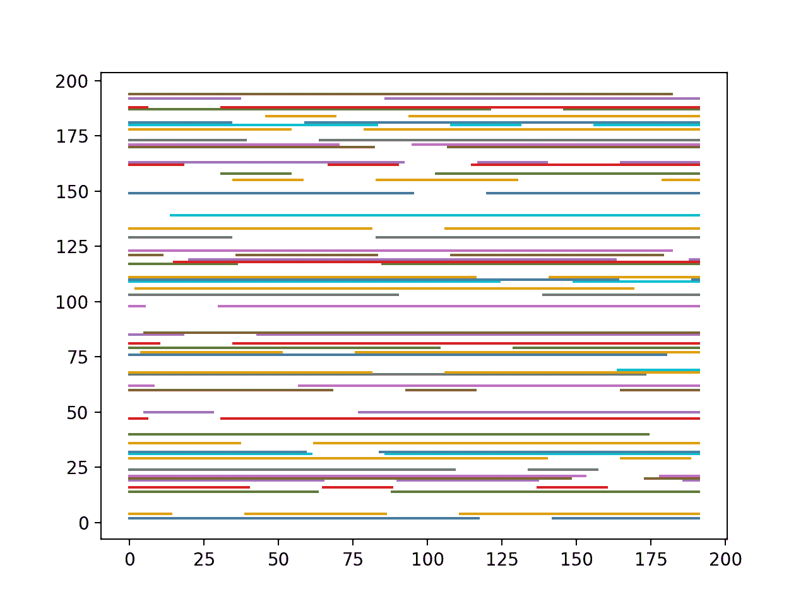
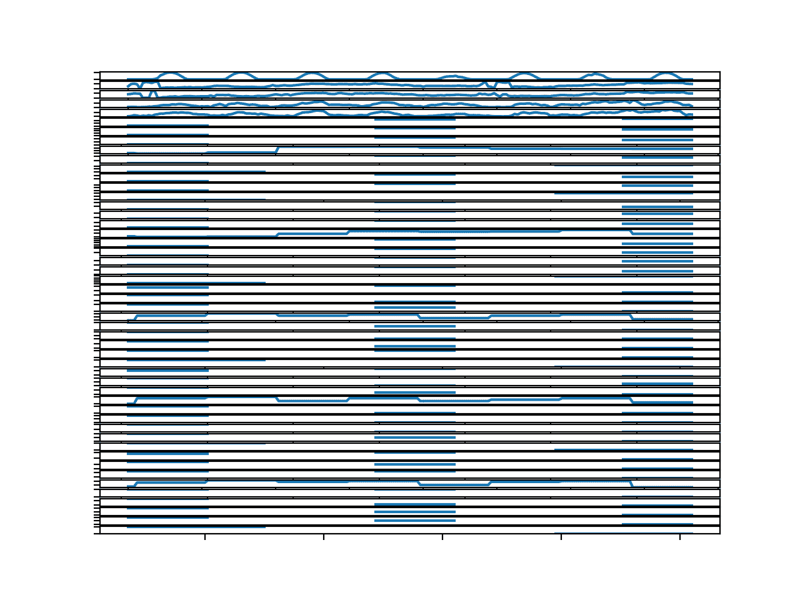
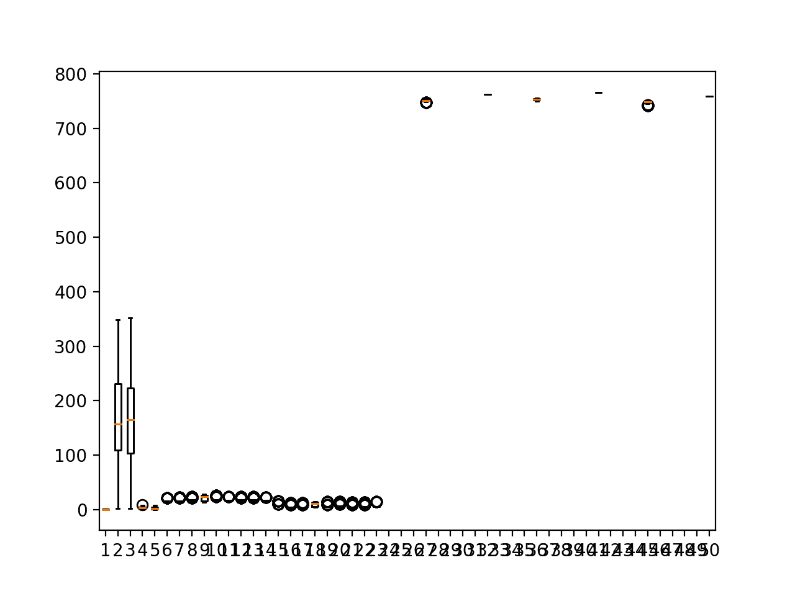
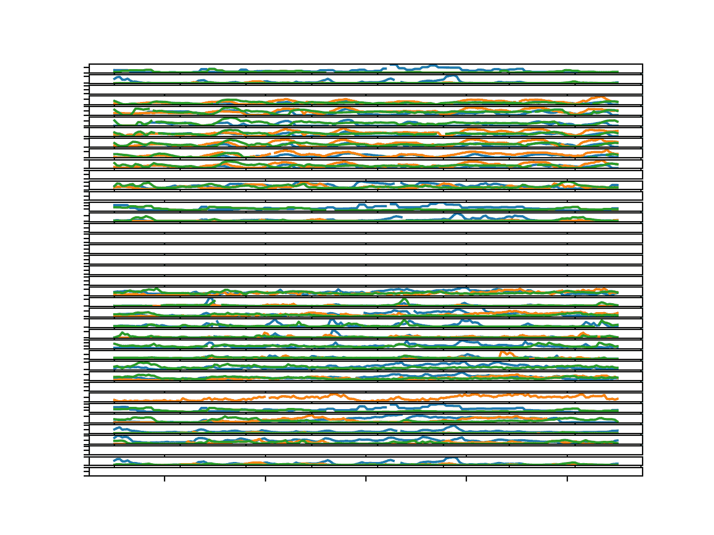
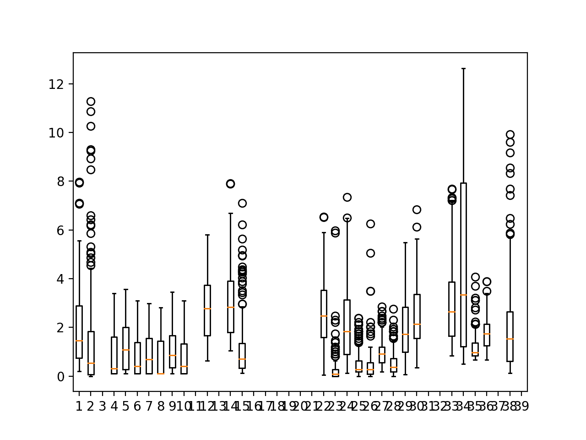
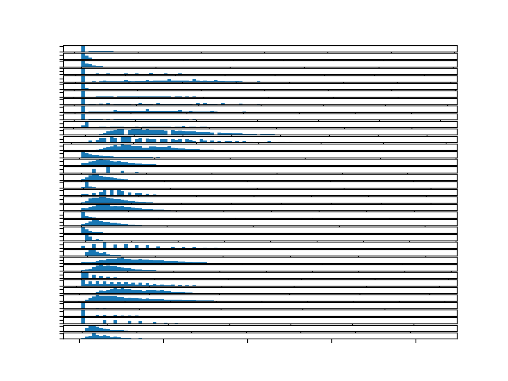

# 如何加载，可视化和探索复杂的多变量多步时间序列预测数据集

> 原文： [https://machinelearningmastery.com/how-to-load-visualize-and-explore-a-complex-multivariate-multistep-time-series-forecasting-dataset/](https://machinelearningmastery.com/how-to-load-visualize-and-explore-a-complex-multivariate-multistep-time-series-forecasting-dataset/)

实时世界时间序列预测具有挑战性，其原因不仅限于问题特征，例如具有多个输入变量，需要预测多个时间步骤，以及需要对多个物理站点执行相同类型的预测。

EMC Data Science Global Hackathon 数据集或简称“_ 空气质量预测 _”数据集描述了多个站点的天气状况，需要预测随后三天的空气质量测量结果。

在本教程中，您将发现并探索空气质量预测数据集，该数据集代表具有挑战性的多变量，多站点和多步骤时间序列预测问题。

完成本教程后，您将了解：

*   如何加载和探索数据集的块结构。
*   如何探索和可视化数据集的输入和目标变量。
*   如何使用新的理解来概述一系列方法来构建问题，准备数据和建模数据集。

让我们开始吧。

*   **Update Apr / 2019** ：修正了计算总缺失值的错误（感谢 zhangzhe）。


如何加载，可视化和探索复杂的多变量多步时间序列预测数据集
照片由 [H Matthew Howarth](https://www.flickr.com/photos/flatworldsedge/7874109806/) ，保留一些权利。

## 教程概述

本教程分为七个部分;他们是：

1.  问题描述
2.  加载数据集
3.  块数据结构
4.  输入变量
5.  目标变量
6.  与目标变量的皱痕
7.  关于建模的思考

## 问题描述

EMC Data Science Global Hackathon 数据集或简称“_ 空气质量预测 _”数据集描述了多个站点的天气状况，需要预测随后三天的空气质量测量结果。

具体而言，对于多个站点，每小时提供 8 天的温度，压力，风速和风向等天气观测。目标是预测未来三天在多个地点的空气质量测量。预测的提前期不是连续的;相反，必须在 72 小时预测期内预测具体的提前期;他们是：

```py
+1, +2, +3, +4, +5, +10, +17, +24, +48, +72
```

此外，数据集被划分为不相交但连续的数据块，其中 8 天的数据随后是需要预测的 3 天。

并非所有站点或块都可以获得所有观察结果，并且并非所有站点和块都可以使用所有输出变量。必须解决大部分缺失数据。

该数据集被用作 2012 年 Kaggle 网站上[短期机器学习竞赛](https://www.kaggle.com/c/dsg-hackathon)（或黑客马拉松）的基础。

根据从参与者中扣留的真实观察结果评估竞赛的提交，并使用平均绝对误差（MAE）进行评分。提交要求在由于缺少数据而无法预测的情况下指定-1,000,000 的值。实际上，提供了一个插入缺失值的模板，并且要求所有提交都采用（模糊的是什么）。

获胜者在滞留测试集（[私人排行榜](https://www.kaggle.com/c/dsg-hackathon/leaderboard)）上使用随机森林在滞后观察中获得了 0.21058 的 MAE。该帖子中提供了此解决方案的说明：

*   [把所有东西都扔进随机森林：Ben Hamner 赢得空气质量预测黑客马拉松](http://blog.kaggle.com/2012/05/01/chucking-everything-into-a-random-forest-ben-hamner-on-winning-the-air-quality-prediction-hackathon/)，2012。

在本教程中，我们将探索此数据集，以便更好地了解预测问题的性质，并提出如何建模的方法。

## 加载数据集

第一步是下载数据集并将其加载到内存中。

数据集可以从 Kaggle 网站免费下载。您可能必须创建一个帐户并登录才能下载数据集。

下载整个数据集，例如“_ 将所有 _”下载到您的工作站并使用名为' _AirQualityPrediction_ '的文件夹解压缩当前工作目录中的存档

*   [EMC 数据科学全球黑客马拉松（空气质量预测）数据](https://www.kaggle.com/c/dsg-hackathon/data)

你应该在 _AirQualityPrediction /_ 文件夹中有五个文件;他们是：

*   SiteLocations.csv
*   SiteLocations_with_more_sites.csv
*   SubmissionZerosExceptNAs.csv
*   TrainingData.csv
*   sample_code.r

我们的重点将是包含训练数据集的' _TrainingData.csv_ '，特别是块中的数据，其中每个块是八个连续的观察日和目标变量。

在撰写本文时，测试数据集（每个块的剩余三天）不可用于此数据集。

打开' _TrainingData.csv_ '文件并查看内容。解压缩的数据文件相对较小（21 兆字节），很容易适应 RAM。

查看文件的内容，我们可以看到数据文件包含标题行。

我们还可以看到丢失的数据标有' _NA_ '值，Pandas 将自动转换为 _NumPy.NaN_ 。

我们可以看到'_ 工作日 _'列包含作为字符串的日期，而所有其他数据都是数字。

以下是数据文件的前几行供参考。

```py
"rowID","chunkID","position_within_chunk","month_most_common","weekday","hour","Solar.radiation_64","WindDirection..Resultant_1","WindDirection..Resultant_1018","WindSpeed..Resultant_1","WindSpeed..Resultant_1018","Ambient.Max.Temperature_14","Ambient.Max.Temperature_22","Ambient.Max.Temperature_50","Ambient.Max.Temperature_52","Ambient.Max.Temperature_57","Ambient.Max.Temperature_76","Ambient.Max.Temperature_2001","Ambient.Max.Temperature_3301","Ambient.Max.Temperature_6005","Ambient.Min.Temperature_14","Ambient.Min.Temperature_22","Ambient.Min.Temperature_50","Ambient.Min.Temperature_52","Ambient.Min.Temperature_57","Ambient.Min.Temperature_76","Ambient.Min.Temperature_2001","Ambient.Min.Temperature_3301","Ambient.Min.Temperature_6005","Sample.Baro.Pressure_14","Sample.Baro.Pressure_22","Sample.Baro.Pressure_50","Sample.Baro.Pressure_52","Sample.Baro.Pressure_57","Sample.Baro.Pressure_76","Sample.Baro.Pressure_2001","Sample.Baro.Pressure_3301","Sample.Baro.Pressure_6005","Sample.Max.Baro.Pressure_14","Sample.Max.Baro.Pressure_22","Sample.Max.Baro.Pressure_50","Sample.Max.Baro.Pressure_52","Sample.Max.Baro.Pressure_57","Sample.Max.Baro.Pressure_76","Sample.Max.Baro.Pressure_2001","Sample.Max.Baro.Pressure_3301","Sample.Max.Baro.Pressure_6005","Sample.Min.Baro.Pressure_14","Sample.Min.Baro.Pressure_22","Sample.Min.Baro.Pressure_50","Sample.Min.Baro.Pressure_52","Sample.Min.Baro.Pressure_57","Sample.Min.Baro.Pressure_76","Sample.Min.Baro.Pressure_2001","Sample.Min.Baro.Pressure_3301","Sample.Min.Baro.Pressure_6005","target_1_57","target_10_4002","target_10_8003","target_11_1","target_11_32","target_11_50","target_11_64","target_11_1003","target_11_1601","target_11_4002","target_11_8003","target_14_4002","target_14_8003","target_15_57","target_2_57","target_3_1","target_3_50","target_3_57","target_3_1601","target_3_4002","target_3_6006","target_4_1","target_4_50","target_4_57","target_4_1018","target_4_1601","target_4_2001","target_4_4002","target_4_4101","target_4_6006","target_4_8003","target_5_6006","target_7_57","target_8_57","target_8_4002","target_8_6004","target_8_8003","target_9_4002","target_9_8003"
1,1,1,10,"Saturday",21,0.01,117,187,0.3,0.3,NA,NA,NA,14.9,NA,NA,NA,NA,NA,NA,NA,NA,5.8,NA,NA,NA,NA,NA,NA,NA,NA,747,NA,NA,NA,NA,NA,NA,NA,NA,750,NA,NA,NA,NA,NA,NA,NA,NA,743,NA,NA,NA,NA,NA,2.67923294292042,6.1816228132982,NA,0.114975168664303,0.114975168664303,0.114975168664303,0.114975168664303,0.114975168664303,0.114975168664303,0.114975168664303,NA,2.38965627997991,NA,5.56815355612325,0.690015329704154,NA,NA,NA,NA,NA,NA,2.84349016287551,0.0920223353681394,1.69321097077376,0.368089341472558,0.184044670736279,0.368089341472558,0.276067006104418,0.892616653070952,1.74842437199465,NA,NA,5.1306307034019,1.34160578423204,2.13879182993514,3.01375212399952,NA,5.67928016629218,NA
2,1,2,10,"Saturday",22,0.01,231,202,0.5,0.6,NA,NA,NA,14.9,NA,NA,NA,NA,NA,NA,NA,NA,5.8,NA,NA,NA,NA,NA,NA,NA,NA,747,NA,NA,NA,NA,NA,NA,NA,NA,750,NA,NA,NA,NA,NA,NA,NA,NA,743,NA,NA,NA,NA,NA,2.67923294292042,8.47583334194495,NA,0.114975168664303,0.114975168664303,0.114975168664303,0.114975168664303,0.114975168664303,0.114975168664303,0.114975168664303,NA,1.99138023331659,NA,5.56815355612325,0.923259948195698,NA,NA,NA,NA,NA,NA,3.1011527019063,0.0920223353681394,1.94167127626774,0.368089341472558,0.184044670736279,0.368089341472558,0.368089341472558,1.73922213845783,2.14412041407765,NA,NA,5.1306307034019,1.19577906855465,2.72209869264472,3.88871241806389,NA,7.42675098668978,NA
3,1,3,10,"Saturday",23,0.01,247,227,0.5,1.5,NA,NA,NA,14.9,NA,NA,NA,NA,NA,NA,NA,NA,5.8,NA,NA,NA,NA,NA,NA,NA,NA,747,NA,NA,NA,NA,NA,NA,NA,NA,750,NA,NA,NA,NA,NA,NA,NA,NA,743,NA,NA,NA,NA,NA,2.67923294292042,8.92192983362627,NA,0.114975168664303,0.114975168664303,0.114975168664303,0.114975168664303,0.114975168664303,0.114975168664303,0.114975168664303,NA,1.7524146053186,NA,5.56815355612325,0.680296803933673,NA,NA,NA,NA,NA,NA,3.06434376775904,0.0920223353681394,2.52141198908702,0.460111676840697,0.184044670736279,0.368089341472558,0.368089341472558,1.7852333061419,1.93246904273093,NA,NA,5.13639545700122,1.40965825154816,3.11096993445111,3.88871241806389,NA,7.68373198968942,NA
4,1,4,10,"Sunday",0,0.01,219,218,0.2,1.2,NA,NA,NA,14,NA,NA,NA,NA,NA,NA,NA,NA,4.8,NA,NA,NA,NA,NA,NA,NA,NA,751,NA,NA,NA,NA,NA,NA,NA,NA,754,NA,NA,NA,NA,NA,NA,NA,NA,748,NA,NA,NA,NA,NA,2.67923294292042,5.09824561921501,NA,0.114975168664303,0.114975168664303,0.114975168664303,0.114975168664303,0.114975168664303,0.114975168664303,0.114975168664303,NA,2.38965627997991,NA,5.6776192223642,0.612267123540305,NA,NA,NA,NA,NA,NA,3.21157950434806,0.184044670736279,2.374176252498,0.460111676840697,0.184044670736279,0.368089341472558,0.276067006104418,1.86805340797323,2.08890701285676,NA,NA,5.21710200739181,1.47771071886428,2.04157401948354,3.20818774490271,NA,4.83124285639335,NA
...
```

我们可以使用 Pandas [read_csv（）函数](https://pandas.pydata.org/pandas-docs/stable/generated/pandas.read_csv.html)将数据文件加载到内存中，并在第 0 行指定标题行。

```py
# load dataset
dataset = read_csv('AirQualityPrediction/TrainingData.csv', header=0)
```

我们还可以快速了解数据集中有多少缺失数据。我们可以通过首先修剪前几列来删除字符串工作日数据并将剩余列转换为浮点值来实现。

```py
# trim and transform to floats
values = dataset.values
data = values[:, 6:].astype('float32')
```

然后，我们可以计算缺失观测的总数和缺失的值的百分比。

```py
# summarize amount of missing data
total_missing = count_nonzero(isnan(data))
percent_missing = total_missing / data.size * 100
print('Total Missing: %d/%d (%.1f%%)' % (total_missing, data.size, percent_missing))
```

下面列出了完整的示例。

```py
# load dataset
from numpy import isnan
from numpy import count_nonzero
from pandas import read_csv
# load dataset
dataset = read_csv('AirQualityPrediction/TrainingData.csv', header=0)
# summarize
print(dataset.shape)
# trim and transform to floats
values = dataset.values
data = values[:, 6:].astype('float32')
# summarize amount of missing data
total_missing = count_nonzero(isnan(data))
percent_missing = total_missing / data.size * 100
print('Total Missing: %d/%d (%.1f%%)' % (total_missing, data.size, percent_missing))
```

首先运行该示例将打印已加载数据集的形状。

我们可以看到我们有大约 37,000 行和 95 列。我们知道这些数字是误导的，因为数据实际上被分成块，并且列被分成不同站点的相同观察。

我们还可以看到有超过 40％的数据丢失。这很多。数据非常不完整，在建模问题之前我们必须很好地理解这一点。

```py
(37821, 95)
Total Missing: 1922092/3366069 (57.1%)
```

## 块数据结构

一个很好的起点是根据块来查看数据。

### 块持续时间

我们可以通过'chunkID'变量（列索引 1）对数据进行分组。

如果每个块是 8 天并且观察是每小时的，那么我们期望每块（8 * 24）或 192 行数据。

如果有 37,821 行数据，则必须有大于或小于 192 小时的块，因为 37,821 / 192 大约是 196.9 块。

我们首先将数据拆分成块。我们可以先获得唯一的块标识符列表。

```py
chunk_ids = unique(values[:, 1])
```

然后，我们可以收集每个块标识符的所有行，并将它们存储在字典中以便于访问。

```py
chunks = dict()
# sort rows by chunk id
for chunk_id in chunk_ids:
	selection = values[:, chunk_ix] == chunk_id
	chunks[chunk_id] = values[selection, :]
```

下面定义了一个名为 _to_chunks（）_ 的函数，它接受加载数据的 NumPy 数组，并将 _chunk_id_ 的字典返回到块的行。

```py
# split the dataset by 'chunkID', return a dict of id to rows
def to_chunks(values, chunk_ix=1):
	chunks = dict()
	# get the unique chunk ids
	chunk_ids = unique(values[:, chunk_ix])
	# group rows by chunk id
	for chunk_id in chunk_ids:
		selection = values[:, chunk_ix] == chunk_id
		chunks[chunk_id] = values[selection, :]
	return chunks
```

数据文件中的' _position_within_chunk_ '表示块内行的顺序。在这个阶段，我们假设行已经排序，不需要排序。原始数据文件的略读似乎证实了这一假设。

一旦数据被分类成块，我们就可以计算每个块中的行数并查看分布，例如使用框和胡须图。

```py
# plot distribution of chunk durations
def plot_chunk_durations(chunks):
	# chunk durations in hours
	chunk_durations = [len(v) for k,v in chunks.items()]
	# boxplot
	pyplot.subplot(2, 1, 1)
	pyplot.boxplot(chunk_durations)
	# histogram
	pyplot.subplot(2, 1, 2)
	pyplot.hist(chunk_durations)
	# histogram
	pyplot.show()
```

下面列出了将所有这些联系在一起的完整示例

```py
# split data into chunks
from numpy import unique
from pandas import read_csv
from matplotlib import pyplot

# split the dataset by 'chunkID', return a dict of id to rows
def to_chunks(values, chunk_ix=1):
	chunks = dict()
	# get the unique chunk ids
	chunk_ids = unique(values[:, chunk_ix])
	# group rows by chunk id
	for chunk_id in chunk_ids:
		selection = values[:, chunk_ix] == chunk_id
		chunks[chunk_id] = values[selection, :]
	return chunks

# plot distribution of chunk durations
def plot_chunk_durations(chunks):
	# chunk durations in hours
	chunk_durations = [len(v) for k,v in chunks.items()]
	# boxplot
	pyplot.subplot(2, 1, 1)
	pyplot.boxplot(chunk_durations)
	# histogram
	pyplot.subplot(2, 1, 2)
	pyplot.hist(chunk_durations)
	# histogram
	pyplot.show()

# load dataset
dataset = read_csv('AirQualityPrediction/TrainingData.csv', header=0)
# group data by chunks
values = dataset.values
chunks = to_chunks(values)
print('Total Chunks: %d' % len(chunks))
# plot chunk durations
plot_chunk_durations(chunks)
```

首先运行该示例将打印数据集中的块数。

我们可以看到有 208，这表明每小时观察的数量确实必须在各个块之间变化。

```py
Total Chunks: 208
```

创建框和胡须图以及块持续时间的直方图。我们可以看到中位数确实是 192，这意味着大多数块有八天的观察或接近它。

我们还可以看到持续时间长达约 25 行的长尾。虽然这些案例并不多，但鉴于缺乏数据，我们预计这将是一个挑战。

该分布还提出了关于每个块内的观察结果可能是多么连续的问题。


盒子和须状图以及以小时为单位的块长度的直方图

### 大块连续性

了解在没有完整八天数据的那些块中观察是否连续（或不连续）可能会有所帮助。

考虑这一点的一种方法是为每个不连续的块创建线图并显示观察中的间隙。

我们可以在一个地块上做到这一点。每个块都有一个唯一的标识符，从 1 到 208，我们可以使用它作为序列的值，并通过 _NaN_ 值在 8 天间隔内标记缺失的观察值，这些值不会出现在图上。

反过来说，我们可以假设我们对一个块中的所有时间步都有 NaN 值，然后使用' _position_within_chunk_ '列（索引 2）来确定具有值的时间步长并用它们标记它们。块 ID。

下面的 _plot_discontinuous_chunks（）_ 实现了这种行为，在同一个图上为每个缺少行的块创建一个系列或行。期望的是，突破线将帮助我们看到这些不完整的块是多么连续或不连续。

```py
# plot chunks that do not have all data
def plot_discontiguous_chunks(chunks, row_in_chunk_ix=2):
	n_steps = 8 * 24
	for c_id,rows in chunks.items():
		# skip chunks with all data
		if rows.shape[0] == n_steps:
			continue
		# create empty series
		series = [nan for _ in range(n_steps)]
		# mark all rows with data
		for row in rows:
			# convert to zero offset
			r_id = row[row_in_chunk_ix] - 1
			# mark value
			series[r_id] = c_id
		# plot
		pyplot.plot(series)
	pyplot.show()
```

下面列出了完整的示例。

```py
# plot discontiguous chunks
from numpy import nan
from numpy import unique
from pandas import read_csv
from matplotlib import pyplot

# split the dataset by 'chunkID', return a dict of id to rows
def to_chunks(values, chunk_ix=1):
	chunks = dict()
	# get the unique chunk ids
	chunk_ids = unique(values[:, chunk_ix])
	# group rows by chunk id
	for chunk_id in chunk_ids:
		selection = values[:, chunk_ix] == chunk_id
		chunks[chunk_id] = values[selection, :]
	return chunks

# plot chunks that do not have all data
def plot_discontiguous_chunks(chunks, row_in_chunk_ix=2):
	n_steps = 8 * 24
	for c_id,rows in chunks.items():
		# skip chunks with all data
		if rows.shape[0] == n_steps:
			continue
		# create empty series
		series = [nan for _ in range(n_steps)]
		# mark all rows with data
		for row in rows:
			# convert to zero offset
			r_id = row[row_in_chunk_ix] - 1
			# mark value
			series[r_id] = c_id
		# plot
		pyplot.plot(series)
	pyplot.show()

# load dataset
dataset = read_csv('AirQualityPrediction/TrainingData.csv', header=0)
# group data by chunks
values = dataset.values
chunks = to_chunks(values)
# plot discontiguous chunks
plot_discontiguous_chunks(chunks)
```

运行该示例会为每个缺少数据的块创建一个带有一行的图形。

每个块的行中断的数量和长度给出了每个块中的观察结果是多么不连续的概念。

许多块确实有很长的连续数据，这是建模的一个好兆头。

在某些情况下，块的观察结果非常少，而且存在的观察结果是小的连续斑块。模型可能具有挑战性。

此外，并非所有这些块都在块的末尾有观察结果：需要预测之前的时间段。对于那些寻求坚持最近观察的模型而言，这些将是一个挑战。

块内系列数据的不连续性也将使评估模型具有挑战性。例如，人们不能简单地将块数据分成两半，在前半部分进行训练，在观察结果不完整时对第二部分进行测试。至少，当考虑不完整的块数据时。



具有不连续观察的块的线图

### 块内的每日覆盖率

块的不连续性也表明，查看每个块所覆盖的小时数可能很重要。

一天中的时间在环境数据中很重要，并且假设每个块包含相同的每日或每周周期的模型可能会发生绊倒，如果一天的开始和结束时间不同。

我们可以通过绘制每个块的第一个小时（每天 24 小时）的分布来快速检查这一点。

柱状图中的区间数设置为 24，因此我们可以清楚地看到 24 小时内每天每小时的分布。

此外，当收集块的第一个小时时，我们小心只从那些具有所有八天数据的块中收集它，以防丢失数据的块在块的开头没有观察，我们知道发生。

```py
# plot distribution of chunk start hour
def plot_chunk_start_hour(chunks, hour_in_chunk_ix=5):
	# chunk start hour
	chunk_start_hours = [v[0, hour_in_chunk_ix] for k,v in chunks.items() if len(v)==192]
	# boxplot
	pyplot.subplot(2, 1, 1)
	pyplot.boxplot(chunk_start_hours)
	# histogram
	pyplot.subplot(2, 1, 2)
	pyplot.hist(chunk_start_hours, bins=24)
	# histogram
	pyplot.show()
```

下面列出了完整的示例。

```py
# plot distribution of chunk start hour
from numpy import nan
from numpy import unique
from pandas import read_csv
from matplotlib import pyplot

# split the dataset by 'chunkID', return a dict of id to rows
def to_chunks(values, chunk_ix=1):
	chunks = dict()
	# get the unique chunk ids
	chunk_ids = unique(values[:, chunk_ix])
	# group rows by chunk id
	for chunk_id in chunk_ids:
		selection = values[:, chunk_ix] == chunk_id
		chunks[chunk_id] = values[selection, :]
	return chunks

# plot distribution of chunk start hour
def plot_chunk_start_hour(chunks, hour_in_chunk_ix=5):
	# chunk start hour
	chunk_start_hours = [v[0, hour_in_chunk_ix] for k,v in chunks.items() if len(v)==192]
	# boxplot
	pyplot.subplot(2, 1, 1)
	pyplot.boxplot(chunk_start_hours)
	# histogram
	pyplot.subplot(2, 1, 2)
	pyplot.hist(chunk_start_hours, bins=24)
	# histogram
	pyplot.show()

# load dataset
dataset = read_csv('AirQualityPrediction/TrainingData.csv', header=0)
# group data by chunks
values = dataset.values
chunks = to_chunks(values)
# plot distribution of chunk start hour
plot_chunk_start_hour(chunks)
```

运行该示例将创建一个框和胡须图以及每个块中第一个小时的直方图。

我们可以看到当天 24 小时内合理均匀的开始时间分布。

此外，这意味着每个块的预测间隔也将在 24 小时内变化。这为可能期望标准三天预测期（午夜至午夜）的模型增加了皱纹。


每个块内观察的第一个小时的分布

现在我们已经了解了数据的块结构，让我们仔细研究描述气象观测的输入变量。

## 输入变量

有 56 个输入变量。

前六个（索引 0 到 5）是块的元数据信息和观察的时间。他们是：

```py
rowID
chunkID
position_within_chunk
month_most_common
weekday
hour
```

其余 50 个描述了特定地点的气象信息;他们是：

```py
Solar.radiation_64
WindDirection..Resultant_1
WindDirection..Resultant_1018
WindSpeed..Resultant_1
WindSpeed..Resultant_1018
Ambient.Max.Temperature_14
Ambient.Max.Temperature_22
Ambient.Max.Temperature_50
Ambient.Max.Temperature_52
Ambient.Max.Temperature_57
Ambient.Max.Temperature_76
Ambient.Max.Temperature_2001
Ambient.Max.Temperature_3301
Ambient.Max.Temperature_6005
Ambient.Min.Temperature_14
Ambient.Min.Temperature_22
Ambient.Min.Temperature_50
Ambient.Min.Temperature_52
Ambient.Min.Temperature_57
Ambient.Min.Temperature_76
Ambient.Min.Temperature_2001
Ambient.Min.Temperature_3301
Ambient.Min.Temperature_6005
Sample.Baro.Pressure_14
Sample.Baro.Pressure_22
Sample.Baro.Pressure_50
Sample.Baro.Pressure_52
Sample.Baro.Pressure_57
Sample.Baro.Pressure_76
Sample.Baro.Pressure_2001
Sample.Baro.Pressure_3301
Sample.Baro.Pressure_6005
Sample.Max.Baro.Pressure_14
Sample.Max.Baro.Pressure_22
Sample.Max.Baro.Pressure_50
Sample.Max.Baro.Pressure_52
Sample.Max.Baro.Pressure_57
Sample.Max.Baro.Pressure_76
Sample.Max.Baro.Pressure_2001
Sample.Max.Baro.Pressure_3301
Sample.Max.Baro.Pressure_6005
Sample.Min.Baro.Pressure_14
Sample.Min.Baro.Pressure_22
Sample.Min.Baro.Pressure_50
Sample.Min.Baro.Pressure_52
Sample.Min.Baro.Pressure_57
Sample.Min.Baro.Pressure_76
Sample.Min.Baro.Pressure_2001
Sample.Min.Baro.Pressure_3301
Sample.Min.Baro.Pressure_6005
```

真的，只有八个气象输入变量：

```py
Solar.radiation
WindDirection..Resultant
WindSpeed..Resultant
Ambient.Max.Temperature
Ambient.Min.Temperature
Sample.Baro.Pressure
Sample.Max.Baro.Pressure
Sample.Min.Baro.Pressure
```

这些变量记录在 23 个独特的站点中;他们是：

```py
1, 14, 22, 50, 52, 57, 64, 76, 1018, 2001, 3301, 6005
```

数据非常复杂。

并非所有变量都记录在所有站点上。

目标变量中使用的站点标识符有一些重叠，例如 1,50,64 等。

目标变量中使用的站点标识符未在输入变量中使用，例如 4002.还有在输入中使用的站点标识符，这些站点标识符未在目标标识符中使用，例如 15。

这表明，至少并非所有变量都记录在所有位置。这些录制站在各个站点之间是异构的。此外，对于仅收集给定类型的度量或收集所有度量的站点，可能存在一些特殊情况。

让我们仔细看看输入变量的数据。

### 块的输入的时间结构

我们可以从查看每个块的输入结构和分布开始。

所有八天观察的前几个块的块大小为 1,3 和 5。

我们可以枚举所有输入列并为每个输入列创建一个线图。这将为每个输入变量创建一个时间序列线图，以便大致了解每个输入变量的变化情况。

我们可以针对几个块重复这一点，以了解时间结构如何在块之间有所不同。

下面名为 _plot_chunk_inputs（）_ 的函数获取块格式的数据和要绘制的块 ID 列表。它将创建一个包含 50 个线图的图形，每个输入变量一个，每个图块 n 行，每个块一个。

```py
# plot all inputs for one or more chunk ids
def plot_chunk_inputs(chunks, c_ids):
	pyplot.figure()
	inputs = range(6, 56)
	for i in range(len(inputs)):
		ax = pyplot.subplot(len(inputs), 1, i+1)
		ax.set_xticklabels([])
		ax.set_yticklabels([])
		column = inputs[i]
		for chunk_id in c_ids:
			rows = chunks[chunk_id]
			pyplot.plot(rows[:,column])
	pyplot.show()
```

下面列出了完整的示例。

```py
# plot inputs for a chunk
from numpy import unique
from pandas import read_csv
from matplotlib import pyplot

# split the dataset by 'chunkID', return a dict of id to rows
def to_chunks(values, chunk_ix=1):
	chunks = dict()
	# get the unique chunk ids
	chunk_ids = unique(values[:, chunk_ix])
	# group rows by chunk id
	for chunk_id in chunk_ids:
		selection = values[:, chunk_ix] == chunk_id
		chunks[chunk_id] = values[selection, :]
	return chunks

# plot all inputs for one or more chunk ids
def plot_chunk_inputs(chunks, c_ids):
	pyplot.figure()
	inputs = range(6, 56)
	for i in range(len(inputs)):
		ax = pyplot.subplot(len(inputs), 1, i+1)
		ax.set_xticklabels([])
		ax.set_yticklabels([])
		column = inputs[i]
		for chunk_id in c_ids:
			rows = chunks[chunk_id]
			pyplot.plot(rows[:,column])
	pyplot.show()

# load data
dataset = read_csv('AirQualityPrediction/TrainingData.csv', header=0)
# group data by chunks
values = dataset.values
chunks = to_chunks(values)
# plot inputs for some chunks
plot_chunk_inputs(chunks, [1])
```

运行该示例将创建一个包含 50 个线图的单个图形，每个图形用于每个气象输入变量。

这些图很难看，因此您可能希望增加所创建图形的大小。

我们可以看到前五个变量的观察看起来非常完整;这些是太阳辐射，风速和风向。其余变量看起来非常不完整，至少对于这个块而言。



1 个块的所有输入变量的并行时间序列线图

我们可以更新示例并绘制前三个块的输入变量，并进行完整的八天观察。

```py
plot_chunk_inputs(chunks, [1, 3 ,5])
```

运行该示例将创建相同的 50 个线图，每个图每个图有三个系列或线，每个块一个。

同样，该图使单个图很难看到，因此您可能需要增加图的大小以更好地查看模式。

我们可以看到这三个图在每个线图中都显示出类似的结构。这是有帮助的发现，因为它表明跨多个块建模相同的变量可能是有用的。


3 个块的所有输入变量的并行时间序列线图

它确实提出了关于变量的分布是否在不同站点之间差异很大的问题。

### 输入数据分布

我们可以使用 box 和 whisker 图粗略地查看输入变量的分布。

下面的 _plot_chunk_input_boxplots（）_ 将为每个输入要素创建一个盒子和胡须，用于一个块的数据。

```py
# boxplot for input variables for a chuck
def plot_chunk_input_boxplots(chunks, c_id):
	rows = chunks[c_id]
	pyplot.boxplot(rows[:,6:56])
	pyplot.show()
```

下面列出了完整的示例。

```py
# boxplots of inputs for a chunk
from numpy import unique
from numpy import isnan
from numpy import count_nonzero
from pandas import read_csv
from matplotlib import pyplot

# split the dataset by 'chunkID', return a dict of id to rows
def to_chunks(values, chunk_ix=1):
	chunks = dict()
	# get the unique chunk ids
	chunk_ids = unique(values[:, chunk_ix])
	# group rows by chunk id
	for chunk_id in chunk_ids:
		selection = values[:, chunk_ix] == chunk_id
		chunks[chunk_id] = values[selection, :]
	return chunks

# boxplot for input variables for a chuck
def plot_chunk_input_boxplots(chunks, c_id):
	rows = chunks[c_id]
	pyplot.boxplot(rows[:,6:56])
	pyplot.show()

# load data
dataset = read_csv('TrainingData.csv', header=0)
# group data by chunks
values = dataset.values
chunks = to_chunks(values)
# boxplot for input variables
plot_chunk_input_boxplots(chunks, 1)
```

运行该示例将创建 50 个箱图，每个输入变量用于训练数据集中第一个块中的观察。

我们可以看到相同类型的变量可能具有相同的观察范围，并且每组变量似乎具有不同的单位。也许是风向的度数，压力的百帕斯卡，温度的摄氏度等等。



一个块的输入变量的框和胡须图

对于八种变量类型中的每一种，进一步研究观察的分布和扩散可能是有趣的。这是一个进一步的练习。

我们对输入变量有一些粗略的想法，也许它们可能对预测目标变量很有用。我们无法确定。

我们现在可以将注意力转向目标变量。

## 目标变量

预测问题的目标是预测多个站点的多个变量，为期三天。

有 39 个时间序列变量可供预测。

从列标题中，它们是：

```py
"target_1_57","target_10_4002","target_10_8003","target_11_1","target_11_32","target_11_50","target_11_64","target_11_1003","target_11_1601","target_11_4002","target_11_8003","target_14_4002","target_14_8003","target_15_57","target_2_57","target_3_1","target_3_50","target_3_57","target_3_1601","target_3_4002","target_3_6006","target_4_1","target_4_50","target_4_57","target_4_1018","target_4_1601","target_4_2001","target_4_4002","target_4_4101","target_4_6006","target_4_8003","target_5_6006","target_7_57","target_8_57","target_8_4002","target_8_6004","target_8_8003","target_9_4002","target_9_8003"
```

这些列标题的命名约定是：

```py
target_[variable identifier]_[site identifier]]
```

我们可以使用一点 regex 将这些列标题转换为变量 id 和 site id 的小数据集。

结果如下：

```py
var, site
1,57
10,4002
10,8003
11,1
11,32
11,50
11,64
11,1003
11,1601
11,4002
11,8003
14,4002
14,8003
15,57
2,57
3,1
3,50
3,57
3,1601
3,4002
3,6006
4,1
4,50
4,57
4,1018
4,1601
4,2001
4,4002
4,4101
4,6006
4,8003
5,6006
7,57
8,57
8,4002
8,6004
8,8003
9,4002
9,8003
```

有用的是，目标按变量 id 分组。

我们可以看到，可能需要跨多个站点预测一个变量;例如，在站点 1,32,50 等处预测的变量 11，等等：

```py
var, site
11,1
11,32
11,50
11,64
11,1003
11,1601
11,4002
11,8003
```

我们可以看到，对于给定的站点，可能需要预测不同的变量。例如，站点 50 需要变量 11,3 和 4：

```py
var, site
11,50
3,50
4,50
```

我们可以将目标的小数据集保存到名为“ _targets.txt_ ”的文件中并加载它以进行快速分析。

```py
# summarize targets
from numpy import unique
from pandas import read_csv
# load dataset
dataset = read_csv('targets.txt', header=0)
values = dataset.values
# summarize unique
print('Unique Variables: %d' % len(unique(values[:, 0])))
print('Unique Sites: %d' % len(unique(values[:, 1])))
```

运行该示例将打印唯一变量和站点的数量。

如果我们预测所有站点的所有变量，我们可以看到 39 个目标变量远小于（12 * 14）168。

```py
Unique Variables: 12
Unique Sites: 14
```

让我们仔细看看目标变量的数据。

### 大块目标的时间结构

我们可以从每个块的目标结构和分布开始。

所有八天观察的前几个块的块大小为 1,3 和 5。

我们可以枚举所有目标列，并为每个列创建一个线图。这将为每个目标变量创建一个时间序列线图，以大致了解它如何随时间变化。

我们可以针对几个块重复这一点，以大致了解时间结构如何在块之间变化。

下面的函数名为 _plot_chunk_targets（）_，以块格式和块 ID 列表绘制。它将创建一个包含 39 个线图的图形，每个目标变量一个，每个图块 n 行，每个块一个。

```py
# plot all targets for one or more chunk ids
def plot_chunk_targets(chunks, c_ids):
	pyplot.figure()
	targets = range(56, 95)
	for i in range(len(targets)):
		ax = pyplot.subplot(len(targets), 1, i+1)
		ax.set_xticklabels([])
		ax.set_yticklabels([])
		column = targets[i]
		for chunk_id in c_ids:
			rows = chunks[chunk_id]
			pyplot.plot(rows[:,column])
	pyplot.show()
```

下面列出了完整的示例。

```py
# plot targets for a chunk
from numpy import unique
from pandas import read_csv
from matplotlib import pyplot

# split the dataset by 'chunkID', return a dict of id to rows
def to_chunks(values, chunk_ix=1):
	chunks = dict()
	# get the unique chunk ids
	chunk_ids = unique(values[:, chunk_ix])
	# group rows by chunk id
	for chunk_id in chunk_ids:
		selection = values[:, chunk_ix] == chunk_id
		chunks[chunk_id] = values[selection, :]
	return chunks

# plot all targets for one or more chunk ids
def plot_chunk_targets(chunks, c_ids):
	pyplot.figure()
	targets = range(56, 95)
	for i in range(len(targets)):
		ax = pyplot.subplot(len(targets), 1, i+1)
		ax.set_xticklabels([])
		ax.set_yticklabels([])
		column = targets[i]
		for chunk_id in c_ids:
			rows = chunks[chunk_id]
			pyplot.plot(rows[:,column])
	pyplot.show()

# load data
dataset = read_csv('AirQualityPrediction/TrainingData.csv', header=0)
# group data by chunks
values = dataset.values
chunks = to_chunks(values)
# plot targets for some chunks
plot_chunk_targets(chunks, [1])
```

运行该示例将为块标识符“1”创建一个包含 39 个线图的单个图形。

这些图很小，但大致了解变量的时间结构。

我们可以看到，有多个变量没有这个块的数据。这些不能直接预测，也可能不是间接预测。

这表明除了没有所有站点的所有变量之外，甚至列标题中指定的变量也可能不存在于某些块中。

我们还可以在一些系列中看到缺失值的中断。这表明即使我们可能对块中的每个时间步进行观察，我们也可能没有块中所有变量的连续序列。

许多情节都有一个循环结构。大多数都有八个峰值，很可能对应于块内八天的观察。这种季节性结构可以直接建模，也可以在建模时从数据中删除，并添加回预测的时间间隔。

该系列似乎没有任何趋势。


1 个块的所有目标变量的并行时间序列线图

我们可以重新运行该示例并使用完整数据绘制前三个块的目标变量。

```py
# plot targets for some chunks
plot_chunk_targets(chunks, [1, 3 ,5])
```

运行该示例将创建一个图形，其中包含 39 个图形和每个图形的三个时间序列，一个用于每个块的目标。

绘图很忙，您可能希望增加绘图窗口的大小，以便更好地查看目标变量的块之间的比较。

对于许多具有循环日常结构的变量，我们可以看到在整个块中重复的结构。

这是令人鼓舞的，因为它表明为站点建模变量可能对块有所帮助。

此外，曲线 3 至 10 对应于七个不同位置的变量 11。这些图中时间结构的字符串相似性表明，对跨站点使用的每个变量的数据建模可能是有益的。



3 个块的所有目标变量的并行时间序列线图

### 目标变量的箱线图分布

查看目标变量的分布也很有用。

我们可以首先通过为每个目标变量创建框和晶须图来查看每个目标变量的分布。

可以为每个目标并排创建单独的箱图，允许在相同比例下直接比较值的形状和范围。

```py
# boxplot for target variables for a chuck
def plot_chunk_targets_boxplots(chunks, c_id):
	rows = chunks[c_id]
	pyplot.boxplot(rows[:,56:])
	pyplot.show()
```

下面列出了完整的示例。

```py
# boxplots of targets for a chunk
from numpy import unique
from numpy import isnan
from numpy import count_nonzero
from pandas import read_csv
from matplotlib import pyplot

# split the dataset by 'chunkID', return a dict of id to rows
def to_chunks(values, chunk_ix=1):
	chunks = dict()
	# get the unique chunk ids
	chunk_ids = unique(values[:, chunk_ix])
	# group rows by chunk id
	for chunk_id in chunk_ids:
		selection = values[:, chunk_ix] == chunk_id
		chunks[chunk_id] = values[selection, :]
	return chunks

# boxplot for target variables for a chuck
def plot_chunk_targets_boxplots(chunks, c_id):
	rows = chunks[c_id]
	pyplot.boxplot(rows[:,56:])
	pyplot.show()

# load data
dataset = read_csv('AirQualityPrediction/TrainingData.csv', header=0)
# group data by chunks
values = dataset.values
chunks = to_chunks(values)
# boxplot for target variables
plot_chunk_targets_boxplots(chunks, 1)
```

运行该示例将创建一个包含 39 个箱图的图形，第一个块的 39 个目标变量中的每一个都有一个。

我们可以看到许多变量的中位数接近零或一;我们还可以看到大多数变量存在大的不对称差异，这表明变量可能与异常值存在偏差。

令人鼓舞的是，7 个站点的变量 11 的 4-10 的箱形图显示了类似的分布。这进一步证明了数据可以按变量分组并用于拟合可跨站点使用的模型。



一个块的目标变量的框和胡须图

我们可以使用跨所有块的数据重新创建此图，以查看数据集范围的模式。

下面列出了完整的示例。

```py
# boxplots of targets for all chunks
from pandas import read_csv
from matplotlib import pyplot

# boxplot for all target variables
def plot_target_boxplots(values):
	pyplot.boxplot(values[:,56:])
	pyplot.show()

# load data
dataset = read_csv('AirQualityPrediction/TrainingData.csv', header=0)
# boxplot for target variables
values = dataset.values
plot_target_boxplots(values)
```

运行该示例将创建一个新图形，显示整个训练数据集的 39 个框和胡须图，而不管块是什么。

这有点乱，圆圈异常值掩盖了主要的数据分布。

我们可以看到异常值确实扩展到 5 到 10 个单位。这表明在建模时可能在标准化和/或重新缩放目标方面有一些用处。

也许最有用的发现是，有些目标没有任何（或非常多）数据而不管块数。这些列可能应该从数据集中排除。


所有训练数据的目标变量的框和胡须图

### 显然空目标列

我们可以通过创建每列缺失数据比率的条形图来进一步研究明显的缺失数据，不包括开头的元数据列（例如前五列）。

下面的 _plot_col_percentage_missing（）_ 函数实现了这个功能。

```py
# bar chart of the ratio of missing data per column
def plot_col_percentage_missing(values, ix_start=5):
	ratios = list()
	# skip early columns, with meta data or strings
	for col in range(ix_start, values.shape[1]):
		col_data = values[:, col].astype('float32')
		ratio = count_nonzero(isnan(col_data)) / len(col_data) * 100
		ratios.append(ratio)
		if ratio > 90.0:
			print(col, ratio)
	col_id = [x for x in range(ix_start, values.shape[1])]
	pyplot.bar(col_id, ratios)
	pyplot.show()
```

下面列出了完整的示例。

```py
# summarize missing data per column
from numpy import isnan
from numpy import count_nonzero
from pandas import read_csv
from matplotlib import pyplot

# bar chart of the ratio of missing data per column
def plot_col_percentage_missing(values, ix_start=5):
	ratios = list()
	# skip early columns, with meta data or strings
	for col in range(ix_start, values.shape[1]):
		col_data = values[:, col].astype('float32')
		ratio = count_nonzero(isnan(col_data)) / len(col_data) * 100
		ratios.append(ratio)
		if ratio > 90.0:
			print(ratio)
	col_id = [x for x in range(ix_start, values.shape[1])]
	pyplot.bar(col_id, ratios)
	pyplot.show()

# load data
dataset = read_csv('AirQualityPrediction/TrainingData.csv', header=0)
# plot ratio of missing data per column
values = dataset.values
plot_col_percentage_missing(values)
```

如果比率高于 90％，则首先运行示例打印列 id（零偏移）和缺失数据的比率。

我们可以看到，实际上没有非 NaN 数据为零的列，但可能有二十多个（12）具有超过 90％的缺失数据。

有趣的是，其中七个是目标变量（指数 56 或更高）。

```py
11 91.48885539779488
20 91.48885539779488
29 91.48885539779488
38 91.48885539779488
47 91.48885539779488
58 95.38880516115385
66 96.9805134713519
68 95.38880516115385
72 97.31630575606145
86 95.38880516115385
92 95.38880516115385
94 95.38880516115385
```

创建列索引号与缺失数据比率的条形图。

我们可以看到，对于缺失数据的比率可能存在一些分层，群集低于 10％，群集约为 70％，群集高于 90％。

我们还可以看到输入变量和目标变量之间的分离，前者非常规则，因为它们显示了在不同站点测量的相同变量类型。

某些目标变量的这些少量数据表明除了过去的观察之外还需要利用其他因素来进行预测。


每列缺失数据百分比的条形图

### 目标变量的直方图分布

目标变量的分布不整齐，至少可以是非高斯分布，或者最差的是高度多模态。

我们可以通过查看目标变量的直方图来查看单个块的数据。

matplotlib 中 _hist（）_ 函数的一个问题是它对 NaN 值不稳健。我们可以通过在绘制之前检查每列是否具有非 NaN 值并排除具有 NaN 值的行来克服此问题。

下面的函数执行此操作，并为一个或多个块的每个目标变量创建一个直方图。

```py
# plot distribution of targets for one or more chunk ids
def plot_chunk_targets_hist(chunks, c_ids):
	pyplot.figure()
	targets = range(56, 95)
	for i in range(len(targets)):
		ax = pyplot.subplot(len(targets), 1, i+1)
		ax.set_xticklabels([])
		ax.set_yticklabels([])
		column = targets[i]
		for chunk_id in c_ids:
			rows = chunks[chunk_id]
			# extract column of interest
			col = rows[:,column].astype('float32')
			# check for some data to plot
			if count_nonzero(isnan(col)) < len(rows):
				# only plot non-nan values
				pyplot.hist(col[~isnan(col)], bins=100)
	pyplot.show()
```

下面列出了完整的示例。

```py
# plot distribution of targets for a chunk
from numpy import unique
from numpy import isnan
from numpy import count_nonzero
from pandas import read_csv
from matplotlib import pyplot

# split the dataset by 'chunkID', return a dict of id to rows
def to_chunks(values, chunk_ix=1):
	chunks = dict()
	# get the unique chunk ids
	chunk_ids = unique(values[:, chunk_ix])
	# group rows by chunk id
	for chunk_id in chunk_ids:
		selection = values[:, chunk_ix] == chunk_id
		chunks[chunk_id] = values[selection, :]
	return chunks

# plot distribution of targets for one or more chunk ids
def plot_chunk_targets_hist(chunks, c_ids):
	pyplot.figure()
	targets = range(56, 95)
	for i in range(len(targets)):
		ax = pyplot.subplot(len(targets), 1, i+1)
		ax.set_xticklabels([])
		ax.set_yticklabels([])
		column = targets[i]
		for chunk_id in c_ids:
			rows = chunks[chunk_id]
			# extract column of interest
			col = rows[:,column].astype('float32')
			# check for some data to plot
			if count_nonzero(isnan(col)) < len(rows):
				# only plot non-nan values
				pyplot.hist(col[~isnan(col)], bins=100)
	pyplot.show()

# load data
dataset = read_csv('AirQualityPrediction/TrainingData.csv', header=0)
# group data by chunks
values = dataset.values
chunks = to_chunks(values)
# plot targets for some chunks
plot_chunk_targets_hist(chunks, [1])
```

运行该示例将创建一个包含 39 个直方图的图形，一个用于第一个块的每个目标变量。

情节难以阅读，但是大量的垃圾箱会显示变量的分布。

可以公平地说，也许没有一个目标变量具有明显的高斯分布。许多人的右侧尾部可能有偏斜的分布。

其他变量具有看似非常离散的分布，可能是所选测量设备或测量尺度的人工产物。


一个块的每个目标变量的直方图

我们可以使用所有块的目标变量重新创建相同的图。

下面列出了完整的示例。

```py
# plot distribution of all targets
from numpy import isnan
from numpy import count_nonzero
from pandas import read_csv
from matplotlib import pyplot

# plot histogram for each target variable
def plot_target_hist(values):
	pyplot.figure()
	targets = range(56, 95)
	for i in range(len(targets)):
		ax = pyplot.subplot(len(targets), 1, i+1)
		ax.set_xticklabels([])
		ax.set_yticklabels([])
		column = targets[i]
		# extract column of interest
		col = values[:,column].astype('float32')
		# check for some data to plot
		if count_nonzero(isnan(col)) < len(values):
			# only plot non-nan values
			pyplot.hist(col[~isnan(col)], bins=100)
	pyplot.show()

# load data
dataset = read_csv('AirQualityPrediction/TrainingData.csv', header=0)
# plot targets for all chunks
values = dataset.values
plot_target_hist(values)
```

运行该示例将创建一个包含 39 个直方图的图形，一个用于训练数据集中的每个目标变量。

我们可以看到更全面的分布，更具洞察力。

第一批情节可能显示出高度倾斜的分布，其核心可能是也可能不是高斯分布。

我们可以看到许多具有间隙的类高斯分布，这表明对高斯分布的连续变量施加了离散测量。

我们还可以看到一些显示指数分布的变量。

总之，这表明使用[功率变换](https://machinelearningmastery.com/power-transform-time-series-forecast-data-python/)来探索将数据重塑为更高斯，和/或使用不依赖于变量的高斯分布的非参数建模方法。例如，可以预期经典线性方法具有困难时间。



整个训练数据集的每个目标变量的直方图

## 与目标变量的皱痕

比赛结束后，提供数据的人 [David Chudzicki](https://www.linkedin.com/in/david-chudzicki-3ba1a92a/) 总结了 12 个输出变量的真实含义。

这是在标题为“[目标变量确实是](https://www.kaggle.com/c/dsg-hackathon/discussion/1830)”的表格帖子中提供的，部分复制如下：

```py
Description						Target Variable
Carbon monoxide, 				8
Sulfur dioxide, 				4
SO2 max 5-min avg, 				3
Nitric oxide (NO),				10
Nitrogen dioxide (NO2),			14
Oxides of nitrogen (NOx), 		9
Ozone,							11
PM10 Total 0-10um STP, 			5
OC CSN Unadjusted PM2.5 LC TOT,	15
Total Nitrate PM2.5 LC, 		2
EC CSN PM2.5 LC TOT, 			1
Total Carbon PM2.5 LC TOT, 		7
Sulfate PM2.5 LC, 				8
PM2.5 Raw Data, 				4
PM2.5 AQI & Speciation Mass, 	3
```

这很有意思，因为我们可以看到目标变量本质上是气象的，并且与竞争的名称所暗示的空气质量有关。

问题是数据集中有 15 个变量，只有 12 种不同类型的目标变量。

此问题的原因是数据集中的相同目标变量可用于表示不同的目标变量。特别：

*   目标 8 可以是'_ 一氧化碳 _'或'_ 硫酸盐 PM2.5LC_ '的数据。
*   目标 4 可以是'_ 二氧化硫 _'或' _PM2.5 原始数据 _'的数据。
*   目标 3 可以是' _SO2 最大 5 分钟平均 _'或' _PM2.5 AQI＆amp;形态质量 _'。

根据变量的名称，将数据加倍到相同的目标变量，使用具有不同化学特征的变量，甚至可能使用例如测量的变量。它似乎是偶然的而不是战略性的。

目前尚不清楚，但很可能目标代表一个块中的一个变量，但可能代表块之间的不同变量。或者，变量可能在每个块内的站点之间不同。在前一种情况下，这意味着期望跨块的这些目标变量的一致性的模型，这是一个非常合理的假设，可能有困难。在后者中，模型可以将变量位点组合视为不同的变量。

可以通过比较这些变量在块之间的分布和比例来梳理差异。

这是令人失望的，并且取决于模型技能的重要性，可能需要从数据集中删除这些变量，这些变量是很多目标变量（39 个中的 20 个）。

## 关于建模的思考

在本节中，我们将利用我们发现的有关该问题的方法，并提出一些建模此问题的方法。

我喜欢这个数据集;它是凌乱的，现实的，抵制朴素的方法。

本节分为四个部分;他们是：

*   取景。
*   数据准备。
*   造型。
*   评价。

### 取景

该问题通常被视为多变量多步骤时间序列预测问题。

此外，需要跨多个站点预测多个变量，这是时间序列预测问题的常见结构细分，例如，预测不同物理位置（例如商店或车站）的可变物。

让我们来看看数据的一些可能的框架。

#### 按变量和站点单变量

第一种方法可能是将每个站点的每个变量视为单变量时间序列预测问题。

对模型进行 8 天的每小时观察，并要求预测三天，从中获取并使用或评估预测提前期的特定子集。

在一些选择的情况下，这可能是可能的，这可以通过一些进一步的数据分析来确认。

然而，数据通常抵抗这种框架，因为并非所有块都对每个目标变量进行了 8 天的观察。此外，目标变量的时间序列可能非常不连续，即使不是大多数（90％到 95％）不完整。

我们可以放松对模型所需的先前数据的结构和数量的期望，设计模型以利用可用的任何东西。

这种方法每块需要 39 个模型，总共需要（208 * 39）或 8,112 个独立模型。这听起来有可能，但可能比我们从工程角度更喜欢的可扩展性。

可变站点组合可以跨块建模，仅需要 39 个模型。

#### 单变量变量

目标变量可以跨站点聚合。

我们还可以放松使用滞后时间进行预测，并使用零填充或输入缺失值来显示可用的内容，或者甚至是滞后观察而忽略前置时间。

然后，我们可以根据给定变量的先前观察结果对问题进行框架，预测接下来的三天。

这些模型可能有更多可以使用，但会忽略基于站点的任何变量差异。这可能是也可能不是没有理由的，可以通过比较跨站点的变量分布来检查。

有 12 个独特的变量。

我们可以为每个块建模每个变量，给出（208 * 12）或 2,496 个模型。在块上建模 12 个变量可能更有意义，只需要 12 个模型。

#### 多变量模型

也许一个或多个目标变量依赖于一个或多个气象变量，甚至依赖于其他目标变量。

这可以通过调查每个目标变量和每个输入变量之间的相关性以及其他目标变量来探索。

如果存在或可以假设这样的依赖性，则不仅可以预测具有更完整数据的变量，还可以预测具有 90％以上缺失数据的目标变量。

这些模型可以使用先前气象观测的一些子集和/或目标变量观测作为输入。数据的不连续性可能需要放宽输入变量的传统滞后时间结构，允许模型使用可用于特定预测的任何内容。

## 数据准备

根据模型的选择，输入和目标变量可能会受益于某些数据准备，例如：

*   标准化。
*   正常化。
*   功率变换，高斯。
*   季节性差异，存在季节性结构。

为了解决丢失的数据，在某些情况下，可能需要通过简单的持久性或平均来进行估算。

在其他情况下，并且取决于模型的选择，可以直接从 NaN 值学习作为观察（例如 XGBoost 可以这样做）或填充 0 值并屏蔽输入（例如 LSTM 可以这样做）。

研究降尺度输入到 2,4 或 12 小时数据或类似数据以试图填补不连续数据中的空白，例如，可能是有趣的。每小时从 12 小时数据预测。

### 造型

建模可能需要一些原型来发现在方法和选择的输入观察方面有效的方法。

#### 经典方法

可能存在具有完整数据的块的罕见示例，其中诸如 ETS 或 SARIMA 的经典方法可用于单变量预测。

通常，该问题抵制经典方法。

#### 机器学习

一个很好的选择是使用非线性机器学习方法，这些方法与输入数据的时间结构无关，利用任何可用的东西。

此类模型可用于递归或直接策略以预测提前期。直接策略可能更有意义，每个所需的提前期有一个模型。

有 10 个交付周期和 39 个目标变量，在这种情况下，直接策略需要（39 * 10）或 390 个模型。

对问题建模的直接方法的缺点是模型无法利用预测区间中目标变量之间的任何依赖关系，特别是跨站点，跨变量或跨越提前期。如果这些依赖存在（并且肯定会存在），则可以在使用第二层集合模型时添加它们的味道。

特征选择可用于发现变量和/或滞后时间，这可以在预测每个目标变量和提前期时提供最大价值。

这种方法将提供很大的灵活性，正如竞争中所示，决策树的集合在很少调整的情况下表现良好。

#### 深度学习

与机器学习方法一样，深度学习方法可能能够使用任何可用的多变量数据来进行预测。

对于这个问题，两类神经网络可能值得探索：

*   卷积神经网络或 CNN。
*   循环神经网络，特别是长短期记忆网络或 LSTM。

CNN 能够将多变量输入时间序列数据的长序列提取到小特征映射中，并且实质上从与预测最相关的序列中学习特征。它们在输入序列中处理噪声和特征不变性的能力可能是有用的。与其他神经网络一样，CNN 可以输出向量以预测预测的提前期。

LSTM 旨在处理序列数据，并可通过屏蔽直接支持丢失的数据。它们也能够从长输入序列自动进行特征学习，单独或与 CNN 结合可以很好地解决这个问题。与编码器 - 解码器架构一起，LSTM 网络可用于本地预测多个交付周期。

### 评估

一种反映竞争中使用的朴素方法可能最适合评估模型。

也就是说，将每个块分成训练和测试集，在这种情况下使用前五天的数据进行训练，其余三个用于测试。

通过在整个数据集上进行训练并将预测提交给 Kaggle 网站以评估所保持的测试数据集，最终确定模型可能是有趣的。

## 进一步阅读

如果您希望深入了解，本节将提供有关该主题的更多资源。

*   [标准多变量，多步骤和多站点时间序列预测问题](https://machinelearningmastery.com/standard-multivariate-multi-step-multi-site-time-series-forecasting-problem/)
*   [EMC 数据科学全球黑客马拉松（空气质量预测）](https://www.kaggle.com/c/dsg-hackathon/data)
*   [将所有东西放入随机森林：Ben Hamner 赢得空气质量预测黑客马拉松](http://blog.kaggle.com/2012/05/01/chucking-everything-into-a-random-forest-ben-hamner-on-winning-the-air-quality-prediction-hackathon/)
*   [EMC 数据科学全球黑客马拉松（空气质量预测）的获奖代码](https://github.com/benhamner/Air-Quality-Prediction-Hackathon-Winning-Model)
*   [分区模型的一般方法？](https://www.kaggle.com/c/dsg-hackathon/discussion/1821)

## 摘要

在本教程中，您发现并探索了空气质量预测数据集，该数据集代表了具有挑战性的多变量，多站点和多步骤时间序列预测问题。

具体来说，你学到了：

*   如何加载和探索数据集的块结构。
*   如何探索和可视化数据集的输入和目标变量。
*   如何使用新的理解来概述一系列方法来构建问题，准备数据和建模数据集。

你有任何问题吗？
在下面的评论中提出您的问题，我会尽力回答。