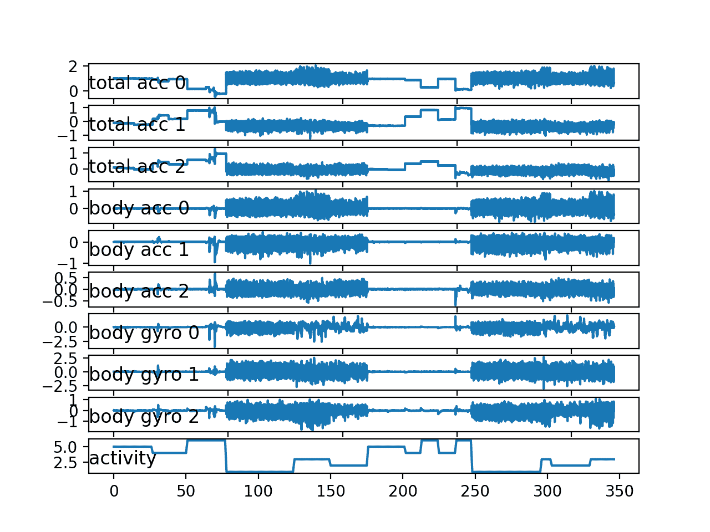
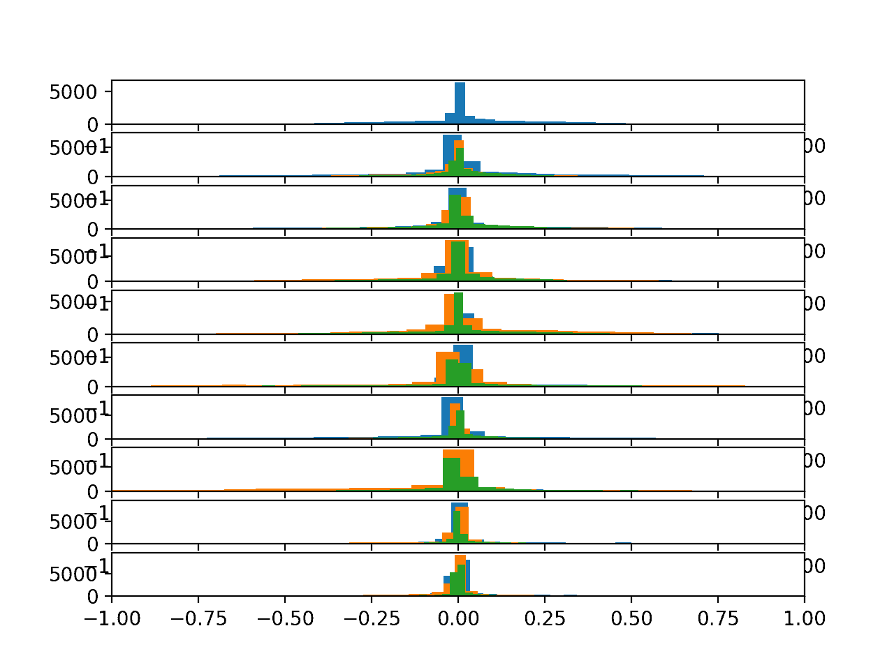
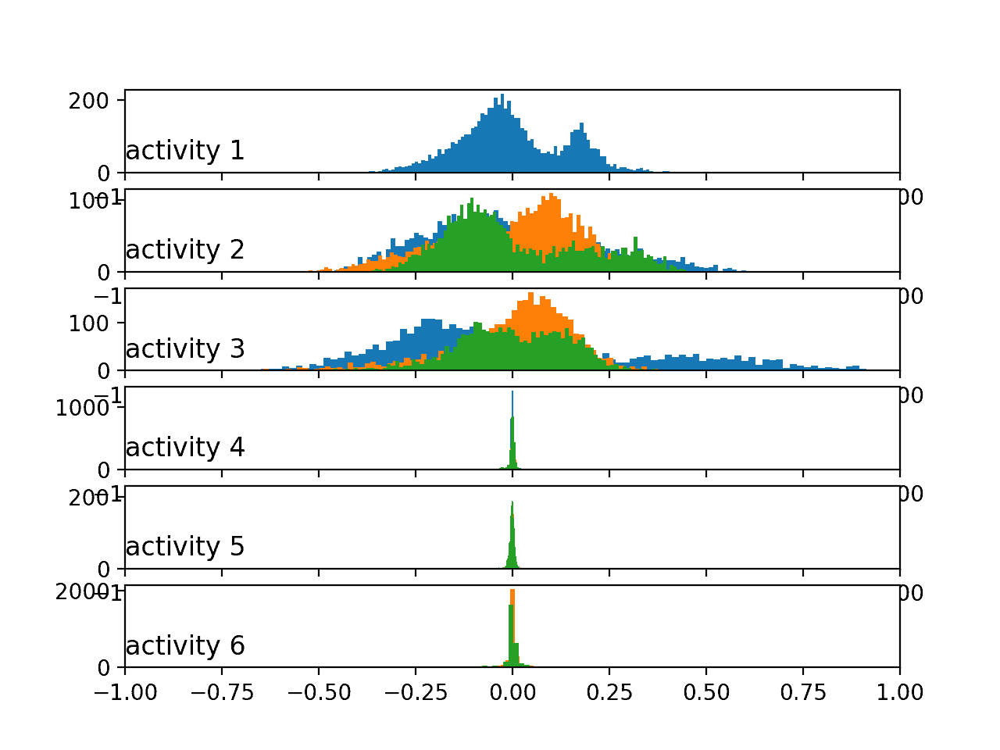

# 如何从智能手机数据模拟人类活动

> 原文： [https://machinelearningmastery.com/how-to-model-human-activity-from-smartphone-data/](https://machinelearningmastery.com/how-to-model-human-activity-from-smartphone-data/)

人类活动识别是将由专用线束或智能电话记录的加速度计数据序列分类为已知的明确定义的运动的问题。

鉴于每秒产生大量观测结果，观测的时间性质以及缺乏将加速度计数据与已知运动联系起来的明确方法，这是一个具有挑战性的问题。

该问题的经典方法涉及基于固定大小的窗口和训练机器学习模型（例如决策树的集合）的时间序列数据中的手工制作特征。困难在于此功能工程需要该领域的深厚专业知识。

最近，诸如循环神经网络和一维卷积神经网络（CNN）之类的深度学习方法已经被证明在很少或没有数据特征工程的情况下提供具有挑战性的活动识别任务的最新结果。

在本教程中，您将发现用于时间序列分类的'_ 活动识别使用智能手机 _'数据集，以及如何加载和探索数据集以使其为预测建模做好准备。

完成本教程后，您将了解：

*   如何下载数据集并将其加载到内存中。
*   如何使用线图，直方图和箱线图来更好地理解运动数据的结构。
*   如何建模问题，包括框架，数据准备，建模和评估。

让我们开始吧。


如何从智能手机数据模拟人类活动
照片由[摄影师](https://www.flickr.com/photos/corker888/23930933844/)，保留一些权利。

## 教程概述

本教程分为 10 个部分;他们是：

1.  人类活动识别
2.  使用智能手机数据集进行活动识别
3.  下载数据集
4.  加载数据
5.  活动类平衡
6.  绘制一个主题的时间序列数据
7.  绘制每个主题的直方图
8.  绘制每个活动的直方图
9.  绘制活动持续时间箱图
10.  建模方法

## 1.人类活动识别

[人类活动识别](https://en.wikipedia.org/wiki/Activity_recognition)，或简称为 HAR，是基于使用传感器的移动痕迹来预测人正在做什么的问题。

运动通常是正常的室内活动，例如站立，坐着，跳跃和上楼梯。

传感器通常位于主体上，例如智能手机或背心，并且经常以三维（x，y，z）记录加速度计数据。

> 人类活动识别（HAR）旨在识别由一个人对他/她自己和周围环境进行一组观察所执行的动作。识别可以通过利用从各种来源（例如环境或身体佩戴的传感器）检索的信息来实现。

- [使用智能手机进行人类活动识别的公共领域数据集](https://upcommons.upc.edu/handle/2117/20897)，2013 年。

这个想法是，一旦主体的活动被识别和知道，智能计算机系统就可以提供帮助。

这是一个具有挑战性的问题，因为没有明确的分析方法将传感器数据与一般方式的特定动作联系起来。由于收集了大量的传感器数据（例如，每秒数十或数百次观察），并且在开发预测模型时从这些数据中经典使用手工制作的特征和启发式，因此在技术上具有挑战性。

最近，深度学习方法已经成功地证明了 HAR 问题，因为它们能够自动学习更高阶的特征。

> 基于传感器的活动识别从大量低水平传感器读数中寻找关于人类活动的深刻的高级知识。传统的模式识别方法在过去几年中取得了巨大的进步。然而，这些方法通常严重依赖于启发式手工特征提取，这可能会妨碍它们的泛化表现。 [...]最近，深度学习的最新进展使得可以执行自动高级特征提取，从而在许多领域实现了有希望的表现。

- [基于传感器的活动识别深度学习：调查](https://arxiv.org/abs/1707.03502)

## 2.使用智能手机数据集识别活动

标准人类活动识别数据集是 2012 年提供的“_ 活动识别使用智能手机 _”数据集。

它由 Davide Anguita 等人准备并提供。来自意大利热那亚大学的 2013 年论文“[使用智能手机进行人类活动识别的公共领域数据集](https://upcommons.upc.edu/handle/2117/20897)”中对该数据集进行了全面描述。该数据集在他们的 2012 年论文中用机器学习算法建模，标题为“[使用多类硬件友好支持向量机](https://link.springer.com/chapter/10.1007/978-3-642-35395-6_30)在智能手机上进行人类活动识别。“

数据集可用，可以从 UCI 机器学习库免费下载：

*   [使用智能手机数据集进行人类活动识别](https://archive.ics.uci.edu/ml/datasets/human+activity+recognition+using+smartphones)

该数据来自 30 名年龄在 19 至 48 岁之间的受试者，他们进行 6 项标准活动中的一项，同时佩戴记录运动数据的腰部智能手机。记录执行活动的每个受试者的视频，并从这些视频手动标记移动数据。

以下是在记录其移动数据的同时执行活动的主体的示例视频。

&lt;iframe allow="autoplay; encrypted-media" allowfullscreen="" frameborder="0" height="375" src="https://www.youtube.com/embed/XOEN9W05_4A?feature=oembed" width="500"&gt;&lt;/iframe&gt;

进行的六项活动如下：

1.  步行
2.  走上楼
3.  走楼下
4.  坐在
5.  常设
6.  铺设

记录的运动数据是来自智能手机的 x，y 和 z 加速度计数据（线性加速度）和陀螺仪数据（角速度），特别是[三星 Galaxy S II](https://en.wikipedia.org/wiki/Samsung_Galaxy_S_II) 。

以 50Hz（即每秒 50 个数据点）记录观察结果。每个受试者进行两次活动，一次是左侧设备，另一次是右侧设备。

> 选择了一组 30 名志愿者，年龄从 19 岁到 48 岁不等。每个人都被要求遵循活动协议，同时佩戴腰部安装的三星 Galaxy S II 智能手机。六个选定的 ADL 是站立，坐下，放下，走路，走楼下和楼上。每个受试者执行两次协议：在第一次试验中，智能手机固定在皮带的左侧，而第二次试验由用户自己放置为首选

- [使用智能手机进行人类活动识别的公共领域数据集](https://upcommons.upc.edu/handle/2117/20897)，2013。

原始数据不可用。相反，可以使用预处理版本的数据集。

预处理步骤包括：

*   使用噪声滤波器预处理加速度计和陀螺仪。
*   将数据拆分为 2.56 秒（128 个数据点）的固定窗口，重叠率为 50％。
*   将加速度计数据分割为重力（总）和身体运动分量。

> 使用中值滤波器和具有 20Hz 截止频率的 3 阶低通巴特沃斯滤波器对这些信号进行预处理以降低噪声。 [...]加速度信号，具有重力和身体运动成分，使用另一个巴特沃斯低通滤波器分离成身体加速度和重力。

- [使用智能手机进行人类活动识别的公共领域数据集](https://upcommons.upc.edu/handle/2117/20897)，2013 年。

特征工程应用于窗口数据，并且提供具有这些工程特征的数据的副本。

从每个窗口提取在人类活动识别领域中常用的许多时间和频率特征。结果是 561 元素的特征向量。

根据受试者的数据，将数据集分成训练（70％）和测试（30％）组。列车 21 个，测试 9 个。

这表明问题的框架，其中一系列运动活动被用作输入来预测当前正在进行的活动的部分（2.56 秒），其中使用已知受试者训练的模型来预测新受试者的运动活动。 。

使用旨在用于智能手机的支持向量机（例如定点算术）的早期实验结果导致测试数据集的预测准确度为 89％，实现与未修改的 SVM 实现类似的结果。

> 该方法适用于标准支持向量机（SVM）并利用定点算法来降低计算成本。与传统 SVM 的比较表明，计算成本方面有显着改善，同时保持了相似的精度[...]

- [智能手机上的人类活动识别使用多类硬件友好支持向量机](https://link.springer.com/chapter/10.1007/978-3-642-35395-6_30)，2012。

现在我们已经熟悉了预测问题，我们将看看加载和探索这个数据集。

## 3.下载数据集

该数据集是免费提供的，可以从 UCI 机器学习库下载。

数据以单个 zip 文件的形式提供，大小约为 58 兆字节。此下载的直接链接如下：

*   [UCI HAR Dataset.zip](https://archive.ics.uci.edu/ml/machine-learning-databases/00240/UCI%20HAR%20Dataset.zip)

下载数据集并将所有文件解压缩到当前工作目录中名为“ _HARDataset_ ”的新目录中。

检查解压缩的内容，您会注意到以下几点：

*   存在“ _train_ ”和“ _test_ ”文件夹，其包含用于建模的数据的分割部分（例如，70％/ 30％）。
*   有一个“ _README.txt_ ”文件，其中包含数据集的详细技术说明和解压缩文件的内容。
*   有一个“ _features.txt_ ”文件，其中包含工程特性的技术说明。

“ _train_ ”和“ _test_ ”文件夹的内容类似（例如文件夹和文件名），尽管它们包含的特定数据存在差异。

检查“train”文件夹显示了一些重要元素：

*   包含预处理数据的“ _Inertial Signals_ ”文件夹。
*   “ _X_train.txt_ ”文件，包含用于拟合模型的工程特征。
*   “ _y_train.txt_ ”包含每个观察的类标签（1-6）。
*   “ _subject_train.txt_ ”文件，其中包含数据文件中每一行的映射及其主题标识符（1-30）。

每个文件中的行数匹配，表示每行是每个数据文件中的一个记录。

“ _Inertial Signals_ ”目录包含 9 个文件。

*   _x，y 和 z 轴的重力加速度 _ 数据文件： _total_acc_x_train.txt_ ， _total_acc_y_train.txt_ ， _total_acc_z_train.txt_ 。
*   _x，y 和 z 轴的身体加速度 _ 数据文件： _body_acc_x_train.txt_ ， _body_acc_y_train.txt_ ，body_acc_z_train.txt。
*   _x，y 和 z 轴的体陀螺 _ 数据文件： _body_gyro_x_train.txt_ ， _body_gyro_y_train.txt_ ， _body_gyro_z_train.txt_ 。

该结构在“ _test_ ”目录中进行镜像。

我们将把注意力集中在“_ 惯性信号 _”中的数据，因为这是开发可以学习合适表示的机器学习模型中最有趣的，而不是使用特定于域的特征工程。

检查数据文件显示列由空格分隔，值显示为缩放到-1,1。此缩放可以通过数据集随附的 _README.txt_ 文件中的注释确认。

现在我们知道了我们拥有的数据，我们可以弄清楚如何将其加载到内存中。

## 4.加载数据

在本节中，我们将开发一些代码来将数据集加载到内存中。

首先，我们需要加载一个文件。

我们可以使用 [read_csv（）Pandas 函数](http://pandas.pydata.org/pandas-docs/stable/generated/pandas.read_csv.html)来加载单个数据文件，并指定该文件没有标题并使用空格分隔列。

```py
dataframe = read_csv(filepath, header=None, delim_whitespace=True)
```

我们可以将它包装在名为 _load_file（）_ 的函数中。下面列出了此功能的完整示例。

```py
# load dataset
from pandas import read_csv

# load a single file as a numpy array
def load_file(filepath):
	dataframe = read_csv(filepath, header=None, delim_whitespace=True)
	return dataframe.values

data = load_file('HARDataset/train/Inertial Signals/total_acc_y_train.txt')
print(data.shape)
```

运行该示例加载文件' _total_acc_y_train.txt_ '，返回 NumPy 数组，并打印数组的形状。

我们可以看到训练数据由 7,352 行或数据窗口组成，其中每个窗口有 128 个观察值。

```py
(7352, 128)
```

接下来，将一组文件（例如所有身体加速度数据文件）作为单个组加载将是有用的。

理想情况下，在处理多变量时间序列数据时，以下列格式构建数据非常有用：

```py
[samples, timesteps, features]
```

这有助于分析，并且是对诸如卷积神经网络和循环神经网络的深度学习模型的期望。

我们可以通过多次调用上面的 _load_file（）_ 函数来实现这一点，对于组中的每个文件一次。

一旦我们将每个文件作为 NumPy 数组加载，我们就可以将所有三个数组组合或堆叠在一起。我们可以使用 [dstack（）NumPy 函数](https://www.numpy.org/devdocs/reference/generated/numpy.dstack.html)来确保每个数组的堆叠方式使得要素在第三维中分离，正如我们所希望的那样。

函数 _load_group（）_ 对文件名列表实现此行为，如下所示。

```py
# load a list of files, such as x, y, z data for a given variable
def load_group(filenames, prefix=''):
	loaded = list()
	for name in filenames:
		data = load_file(prefix + name)
		loaded.append(data)
	# stack group so that features are the 3rd dimension
	loaded = dstack(loaded)
	return loaded
```

我们可以通过加载所有总加速文件来演示此功能。

下面列出了完整的示例。

```py
# load dataset
from numpy import dstack
from pandas import read_csv

# load a single file as a numpy array
def load_file(filepath):
	dataframe = read_csv(filepath, header=None, delim_whitespace=True)
	return dataframe.values

# load a list of files, such as x, y, z data for a given variable
def load_group(filenames, prefix=''):
	loaded = list()
	for name in filenames:
		data = load_file(prefix + name)
		loaded.append(data)
	# stack group so that features are the 3rd dimension
	loaded = dstack(loaded)
	return loaded

# load the total acc data
filenames = ['total_acc_x_train.txt', 'total_acc_y_train.txt', 'total_acc_z_train.txt']
total_acc = load_group(filenames, prefix='HARDataset/train/Inertial Signals/')
print(total_acc.shape)
```

运行该示例将打印返回的 NumPy 数组的形状，显示数据集的三个要素 x，y 和 z 的预期样本数和时间步长。

```py
(7352, 128, 3)
```

最后，我们可以使用到目前为止开发的两个函数来加载列车和测试数据集的所有数据。

给定列车和测试文件夹中的并行结构，我们可以开发一个新函数来加载给定文件夹的所有输入和输出数据。该函数可以构建要加载的所有 9 个数据文件的列表，将它们作为一个具有 9 个特征的 NumPy 数组加载，然后加载包含输出类的数据文件。

下面的 _load_dataset（）_ 函数实现了这种行为。它可以被称为“ _train_ ”组或“ _test_ ”组，作为字符串参数传递。

```py
# load a dataset group, such as train or test
def load_dataset(group, prefix=''):
	filepath = prefix + group + '/Inertial Signals/'
	# load all 9 files as a single array
	filenames = list()
	# total acceleration
	filenames += ['total_acc_x_'+group+'.txt', 'total_acc_y_'+group+'.txt', 'total_acc_z_'+group+'.txt']
	# body acceleration
	filenames += ['body_acc_x_'+group+'.txt', 'body_acc_y_'+group+'.txt', 'body_acc_z_'+group+'.txt']
	# body gyroscope
	filenames += ['body_gyro_x_'+group+'.txt', 'body_gyro_y_'+group+'.txt', 'body_gyro_z_'+group+'.txt']
	# load input data
	X = load_group(filenames, filepath)
	# load class output
	y = load_file(prefix + group + '/y_'+group+'.txt')
	return X, y
```

下面列出了完整的示例。

```py
# load dataset
from numpy import dstack
from pandas import read_csv

# load a single file as a numpy array
def load_file(filepath):
	dataframe = read_csv(filepath, header=None, delim_whitespace=True)
	return dataframe.values

# load a list of files, such as x, y, z data for a given variable
def load_group(filenames, prefix=''):
	loaded = list()
	for name in filenames:
		data = load_file(prefix + name)
		loaded.append(data)
	# stack group so that features are the 3rd dimension
	loaded = dstack(loaded)
	return loaded

# load a dataset group, such as train or test
def load_dataset(group, prefix=''):
	filepath = prefix + group + '/Inertial Signals/'
	# load all 9 files as a single array
	filenames = list()
	# total acceleration
	filenames += ['total_acc_x_'+group+'.txt', 'total_acc_y_'+group+'.txt', 'total_acc_z_'+group+'.txt']
	# body acceleration
	filenames += ['body_acc_x_'+group+'.txt', 'body_acc_y_'+group+'.txt', 'body_acc_z_'+group+'.txt']
	# body gyroscope
	filenames += ['body_gyro_x_'+group+'.txt', 'body_gyro_y_'+group+'.txt', 'body_gyro_z_'+group+'.txt']
	# load input data
	X = load_group(filenames, filepath)
	# load class output
	y = load_file(prefix + group + '/y_'+group+'.txt')
	return X, y

# load all train
trainX, trainy = load_dataset('train', 'HARDataset/')
print(trainX.shape, trainy.shape)
# load all test
testX, testy = load_dataset('test', 'HARDataset/')
print(testX.shape, testy.shape)
```

运行该示例将加载训练和测试数据集。

我们可以看到测试数据集有 2,947 行窗口数据。正如预期的那样，我们可以看到列车和测试装置中的窗口大小匹配，并且每个列车和测试用例中的输出（y）大小与样本数量相匹配。

```py
(7352, 128, 9) (7352, 1)
(2947, 128, 9) (2947, 1)
```

既然我们知道如何加载数据，我们就可以开始探索它了。

## 5.活动类平衡

对数据进行良好的首次检查是调查每项活动的平衡。

我们相信，30 个科目中的每一个都进行了六项活动。

确认此期望将检查数据是否确实平衡，使模型更容易，并确认我们正确加载和解释数据集。

我们可以开发一个函数来总结输出变量的细分，例如： y 变量。

下面的函数 _class_breakdown（）_ 实现了这种行为，首先将提供的 NumPy 数组包装在 DataFrame 中，按类值对行进行分组，并计算每个组的大小（行数）。然后总结结果，包括计数和百分比。

```py
# summarize the balance of classes in an output variable column
def class_breakdown(data):
	# convert the numpy array into a dataframe
	df = DataFrame(data)
	# group data by the class value and calculate the number of rows
	counts = df.groupby(0).size()
	# retrieve raw rows
	counts = counts.values
	# summarize
	for i in range(len(counts)):
		percent = counts[i] / len(df) * 100
		print('Class=%d, total=%d, percentage=%.3f' % (i+1, counts[i], percent))
```

总结列车和测试数据集中类的细分以确保它们具有类似的细分可能是有用的，然后将结果与组合数据集的细分进行比较。

下面列出了完整的示例。

```py
# summarize class balance
from numpy import array
from numpy import vstack
from pandas import read_csv
from pandas import DataFrame

# load a single file as a numpy array
def load_file(filepath):
	dataframe = read_csv(filepath, header=None, delim_whitespace=True)
	return dataframe.values

# summarize the balance of classes in an output variable column
def class_breakdown(data):
	# convert the numpy array into a dataframe
	df = DataFrame(data)
	# group data by the class value and calculate the number of rows
	counts = df.groupby(0).size()
	# retrieve raw rows
	counts = counts.values
	# summarize
	for i in range(len(counts)):
		percent = counts[i] / len(df) * 100
		print('Class=%d, total=%d, percentage=%.3f' % (i+1, counts[i], percent))

# load train file
trainy = load_file('HARDataset/train/y_train.txt')
# summarize class breakdown
print('Train Dataset')
class_breakdown(trainy)

# load test file
testy = load_file('HARDataset/test/y_test.txt')
# summarize class breakdown
print('Test Dataset')
class_breakdown(testy)

# summarize combined class breakdown
print('Both')
combined = vstack((trainy, testy))
class_breakdown(combined)
```

首先运行该示例总结了训练集的细分。我们可以看到每个类的非常相似的分布在数据集的 13％到 19％之间徘徊。

测试集和两个数据集上的结果看起来非常相似。

使用数据集可能是安全的，假设每个列车和测试集以及每个主题可以平衡类的分布。

```py
Train Dataset
Class=1, total=1226, percentage=16.676
Class=2, total=1073, percentage=14.595
Class=3, total=986, percentage=13.411
Class=4, total=1286, percentage=17.492
Class=5, total=1374, percentage=18.689
Class=6, total=1407, percentage=19.138

Test Dataset
Class=1, total=496, percentage=16.831
Class=2, total=471, percentage=15.982
Class=3, total=420, percentage=14.252
Class=4, total=491, percentage=16.661
Class=5, total=532, percentage=18.052
Class=6, total=537, percentage=18.222

Both
Class=1, total=1722, percentage=16.720
Class=2, total=1544, percentage=14.992
Class=3, total=1406, percentage=13.652
Class=4, total=1777, percentage=17.254
Class=5, total=1906, percentage=18.507
Class=6, total=1944, percentage=18.876
```

## 6.绘制一个主题的时间序列数据

我们正在处理时间序列数据，因此导入检查是创建原始数据的线图。

原始数据由每个变量的时间序列数据窗口组成，窗口确实有 50％的重叠。这表明我们可能会在观察中看到一些重复作为线图，除非重叠被删除。

我们可以从使用上面开发的函数加载训练数据集开始。

```py
# load data
trainX, trainy = load_dataset('train', 'HARDataset/')
```

接下来，我们可以在' _train_ '目录中加载' _subject_train.txt_ '，该目录提供行到它所属主题的映射。

我们可以使用 _load_file（）_ 函数加载这个文件。加载后，我们还可以使用 _unique（）_ NumPy 函数来检索训练数据集中的唯一主题列表。

```py
sub_map = load_file('HARDataset/train/subject_train.txt')
train_subjects = unique(sub_map)
print(train_subjects)
```

接下来，我们需要一种方法来检索单个主题的所有行，例如科目编号 1。

我们可以通过查找属于给定主题的所有行号并使用这些行号从训练数据集中加载的 X 和 y 数据中选择样本来完成此操作。

下面的 _data_for_subject（）_ 函数实现了这种行为。它将获取加载的训练数据，行号到主题的加载映射，以及我们感兴趣的主题的主题标识号，并将返回 _X_ 和 _y_ 仅针对该主题的数据。

```py
# get all data for one subject
def data_for_subject(X, y, sub_map, sub_id):
	# get row indexes for the subject id
	ix = [i for i in range(len(sub_map)) if sub_map[i]==sub_id]
	# return the selected samples
	return X[ix, :, :], y[ix]
```

现在我们有一个主题的数据，我们可以绘制它。

数据由具有重叠的窗口组成。我们可以编写一个函数来消除这种重叠，并将窗口向下挤压给定变量，将其压缩成一个可以直接绘制为线图的长序列。

下面的 _to_series（）_ 函数对给定变量实现此行为，例如窗户阵列。

```py
# convert a series of windows to a 1D list
def to_series(windows):
	series = list()
	for window in windows:
		# remove the overlap from the window
		half = int(len(window) / 2) - 1
		for value in window[-half:]:
			series.append(value)
	return series
```

最后，我们有足够的情节来绘制数据。我们可以依次绘制主题的九个变量中的每一个，以及活动水平的最终图。

每个系列将具有相同数量的时间步长（x 轴的长度），因此，为每个变量创建一个子图并垂直对齐所有图可能很有用，这样我们就可以比较每个变量的运动。

下面的 _plot_subject（）_ 函数为单个主题的 _X_ 和 _y_ 数据实现此行为。该函数采用与 _load_dataset（）_ 函数中加载的变量（第 3 轴）相同的顺序。每个情节都会添加粗略的标题，因此我们不会轻易混淆我们正在看的内容。

```py
# plot the data for one subject
def plot_subject(X, y):
	pyplot.figure()
	# determine the total number of plots
	n, off = X.shape[2] + 1, 0
	# plot total acc
	for i in range(3):
		pyplot.subplot(n, 1, off+1)
		pyplot.plot(to_series(X[:, :, off]))
		pyplot.title('total acc '+str(i), y=0, loc='left')
		off += 1
	# plot body acc
	for i in range(3):
		pyplot.subplot(n, 1, off+1)
		pyplot.plot(to_series(X[:, :, off]))
		pyplot.title('body acc '+str(i), y=0, loc='left')
		off += 1
	# plot body gyro
	for i in range(3):
		pyplot.subplot(n, 1, off+1)
		pyplot.plot(to_series(X[:, :, off]))
		pyplot.title('body gyro '+str(i), y=0, loc='left')
		off += 1
	# plot activities
	pyplot.subplot(n, 1, n)
	pyplot.plot(y)
	pyplot.title('activity', y=0, loc='left')
	pyplot.show()
```

下面列出了完整的示例。

```py
# plot all vars for one subject
from numpy import array
from numpy import dstack
from numpy import unique
from pandas import read_csv
from matplotlib import pyplot

# load a single file as a numpy array
def load_file(filepath):
	dataframe = read_csv(filepath, header=None, delim_whitespace=True)
	return dataframe.values

# load a list of files, such as x, y, z data for a given variable
def load_group(filenames, prefix=''):
	loaded = list()
	for name in filenames:
		data = load_file(prefix + name)
		loaded.append(data)
	# stack group so that features are the 3rd dimension
	loaded = dstack(loaded)
	return loaded

# load a dataset group, such as train or test
def load_dataset(group, prefix=''):
	filepath = prefix + group + '/Inertial Signals/'
	# load all 9 files as a single array
	filenames = list()
	# total acceleration
	filenames += ['total_acc_x_'+group+'.txt', 'total_acc_y_'+group+'.txt', 'total_acc_z_'+group+'.txt']
	# body acceleration
	filenames += ['body_acc_x_'+group+'.txt', 'body_acc_y_'+group+'.txt', 'body_acc_z_'+group+'.txt']
	# body gyroscope
	filenames += ['body_gyro_x_'+group+'.txt', 'body_gyro_y_'+group+'.txt', 'body_gyro_z_'+group+'.txt']
	# load input data
	X = load_group(filenames, filepath)
	# load class output
	y = load_file(prefix + group + '/y_'+group+'.txt')
	return X, y

# get all data for one subject
def data_for_subject(X, y, sub_map, sub_id):
	# get row indexes for the subject id
	ix = [i for i in range(len(sub_map)) if sub_map[i]==sub_id]
	# return the selected samples
	return X[ix, :, :], y[ix]

# convert a series of windows to a 1D list
def to_series(windows):
	series = list()
	for window in windows:
		# remove the overlap from the window
		half = int(len(window) / 2) - 1
		for value in window[-half:]:
			series.append(value)
	return series

# plot the data for one subject
def plot_subject(X, y):
	pyplot.figure()
	# determine the total number of plots
	n, off = X.shape[2] + 1, 0
	# plot total acc
	for i in range(3):
		pyplot.subplot(n, 1, off+1)
		pyplot.plot(to_series(X[:, :, off]))
		pyplot.title('total acc '+str(i), y=0, loc='left')
		off += 1
	# plot body acc
	for i in range(3):
		pyplot.subplot(n, 1, off+1)
		pyplot.plot(to_series(X[:, :, off]))
		pyplot.title('body acc '+str(i), y=0, loc='left')
		off += 1
	# plot body gyro
	for i in range(3):
		pyplot.subplot(n, 1, off+1)
		pyplot.plot(to_series(X[:, :, off]))
		pyplot.title('body gyro '+str(i), y=0, loc='left')
		off += 1
	# plot activities
	pyplot.subplot(n, 1, n)
	pyplot.plot(y)
	pyplot.title('activity', y=0, loc='left')
	pyplot.show()

# load data
trainX, trainy = load_dataset('train', 'HARDataset/')
# load mapping of rows to subjects
sub_map = load_file('HARDataset/train/subject_train.txt')
train_subjects = unique(sub_map)
print(train_subjects)
# get the data for one subject
sub_id = train_subjects[0]
subX, suby = data_for_subject(trainX, trainy, sub_map, sub_id)
print(subX.shape, suby.shape)
# plot data for subject
plot_subject(subX, suby)
```

运行该示例将打印训练数据集中的唯一主题，第一个主题的数据样本，并创建一个包含 10 个图的图形，每个图形对应九个输入变量和输出类别。

```py
[ 1 3 5 6 7 8 11 14 15 16 17 19 21 22 23 25 26 27 28 29 30]
(341, 128, 9) (341, 1)
```

在图中，我们可以看到与活动 1,2 和 3 相对应的大运动周期：步行活动。对于编号较高的活动，4,5 和 6（坐，站立和铺设），我们还可以看到更少的活动（即相对直线）。

这是我们正确加载解释原始数据集的确认。

我们可以看到这个主题已经执行了两次相同的一般活动顺序，并且一些活动执行了两次以上。这表明，对于特定主题，我们不应假设可能已执行的活动或其顺序。

我们还可以看到一些固定活动的相对较大的运动，例如铺设。这些可能是异常值或与活动转换相关。可以将这些观察结果平滑或移除为异常值。

最后，我们在九个变量中看到了很多共性。很可能只需要这些迹线的一部分来开发预测模型。



单个主题的所有变量的线图

我们可以通过做一个小的改动来重新运行另一个主题的例子，例如：选择训练数据集中第二个主题的标识符。

```py
# get the data for one subject
sub_id = train_subjects[1]
```

第二个主题的情节显示出类似的行为，没有任何意外。

活动的双重序列确实比第一个主题更加规律。


第二个单个主题的所有变量的线图

## 7.绘制每个受试者的直方图

由于问题是框架，我们有兴趣使用一些科目的运动数据来预测其他科目的运动活动。

这表明跨学科的运动数据必须有规律性。我们知道数据已经在-1 和 1 之间缩放，可能是每个受试者，这表明检测到的运动的幅度将是相似的。

我们还期望运动数据的分布在不同主题之间是相似的，因为它们执行相同的动作。

我们可以通过绘制和比较受试者的运动数据的直方图来检查这一点。一种有用的方法是为每个受试者创建一个图并绘制给定数据的所有三个轴（例如总加速度），然后对多个受试者重复此操作。可以修改绘图以使用相同的轴并水平对齐，以便可以比较跨主题的每个变量的分布。

下面的 _plot_subject_histograms（）_ 函数实现了这种行为。该函数采用加载的数据集和行到主题的映射以及要绘制的最大主题数，默认情况下固定为 10。

为每个主题创建一个绘图，并将一个数据类型的三个变量绘制为具有 100 个二进制位的直方图，以帮助使分布明显。每个图共享相同的轴，该轴固定在-1 和 1 的边界。

```py
# plot histograms for multiple subjects
def plot_subject_histograms(X, y, sub_map, n=10):
	pyplot.figure()
	# get unique subjects
	subject_ids = unique(sub_map[:,0])
	# enumerate subjects
	xaxis = None
	for k in range(n):
		sub_id = subject_ids[k]
		# get data for one subject
		subX, _ = data_for_subject(X, y, sub_map, sub_id)
		# total acc
		for i in range(3):
			ax = pyplot.subplot(n, 1, k+1, sharex=xaxis)
			ax.set_xlim(-1,1)
			if k == 0:
				xaxis = ax
			pyplot.hist(to_series(subX[:,:,i]), bins=100)
	pyplot.show()
```

下面列出了完整的示例。

```py
# plot histograms for multiple subjects
from numpy import array
from numpy import unique
from numpy import dstack
from pandas import read_csv
from matplotlib import pyplot

# load a single file as a numpy array
def load_file(filepath):
	dataframe = read_csv(filepath, header=None, delim_whitespace=True)
	return dataframe.values

# load a list of files, such as x, y, z data for a given variable
def load_group(filenames, prefix=''):
	loaded = list()
	for name in filenames:
		data = load_file(prefix + name)
		loaded.append(data)
	# stack group so that features are the 3rd dimension
	loaded = dstack(loaded)
	return loaded

# load a dataset group, such as train or test
def load_dataset(group, prefix=''):
	filepath = prefix + group + '/Inertial Signals/'
	# load all 9 files as a single array
	filenames = list()
	# total acceleration
	filenames += ['total_acc_x_'+group+'.txt', 'total_acc_y_'+group+'.txt', 'total_acc_z_'+group+'.txt']
	# body acceleration
	filenames += ['body_acc_x_'+group+'.txt', 'body_acc_y_'+group+'.txt', 'body_acc_z_'+group+'.txt']
	# body gyroscope
	filenames += ['body_gyro_x_'+group+'.txt', 'body_gyro_y_'+group+'.txt', 'body_gyro_z_'+group+'.txt']
	# load input data
	X = load_group(filenames, filepath)
	# load class output
	y = load_file(prefix + group + '/y_'+group+'.txt')
	return X, y

# get all data for one subject
def data_for_subject(X, y, sub_map, sub_id):
	# get row indexes for the subject id
	ix = [i for i in range(len(sub_map)) if sub_map[i]==sub_id]
	# return the selected samples
	return X[ix, :, :], y[ix]

# convert a series of windows to a 1D list
def to_series(windows):
	series = list()
	for window in windows:
		# remove the overlap from the window
		half = int(len(window) / 2) - 1
		for value in window[-half:]:
			series.append(value)
	return series

# plot histograms for multiple subjects
def plot_subject_histograms(X, y, sub_map, n=10):
	pyplot.figure()
	# get unique subjects
	subject_ids = unique(sub_map[:,0])
	# enumerate subjects
	xaxis = None
	for k in range(n):
		sub_id = subject_ids[k]
		# get data for one subject
		subX, _ = data_for_subject(X, y, sub_map, sub_id)
		# total acc
		for i in range(3):
			ax = pyplot.subplot(n, 1, k+1, sharex=xaxis)
			ax.set_xlim(-1,1)
			if k == 0:
				xaxis = ax
			pyplot.hist(to_series(subX[:,:,i]), bins=100)
	pyplot.show()

# load training dataset
X, y = load_dataset('train', 'HARDataset/')
# load mapping of rows to subjects
sub_map = load_file('HARDataset/train/subject_train.txt')
# plot histograms for subjects
plot_subject_histograms(X, y, sub_map)
```

运行该示例将创建一个包含 10 个绘图的单个图形，其中包含总加速度数据的三个轴的直方图。

给定图上的三个轴中的每一个具有不同的颜色，具体地，x，y 和 z 分别是蓝色，橙色和绿色。

我们可以看到给定轴的分布确实看起来是高斯分布的，具有大的独立数据组。

我们可以看到一些分布对齐（例如，中间的主要组大约为 0.0），这表明对象之间的运动数据可能存在一些连续性，至少对于这些数据而言。


10 个受试者的总加速度数据的直方图

我们可以更新 _plot_subject_histograms（）_ 函数，接下来绘制身体加速度的分布。更新的功能如下所示。

```py
# plot histograms for multiple subjects
def plot_subject_histograms(X, y, sub_map, n=10):
	pyplot.figure()
	# get unique subjects
	subject_ids = unique(sub_map[:,0])
	# enumerate subjects
	xaxis = None
	for k in range(n):
		sub_id = subject_ids[k]
		# get data for one subject
		subX, _ = data_for_subject(X, y, sub_map, sub_id)
		# body acc
		for i in range(3):
			ax = pyplot.subplot(n, 1, k+1, sharex=xaxis)
			ax.set_xlim(-1,1)
			if k == 0:
				xaxis = ax
			pyplot.hist(to_series(subX[:,:,3+i]), bins=100)
	pyplot.show()
```

运行更新的示例会创建具有非常不同结果的相同图表。

在这里，我们可以看到所有数据聚集在一个主题内和主题之间的轴上。这表明数据可能是中心的（零均值）。跨受试者的这种强一致性可能有助于建模，并且可能表明总加速度数据中受试者之间的差异可能不那么有用。


10 名受试者的身体加速度数据的直方图

最后，我们可以为陀螺仪数据生成一个最终图。

更新的功能如下所示。

```py
# plot histograms for multiple subjects
def plot_subject_histograms(X, y, sub_map, n=10):
	pyplot.figure()
	# get unique subjects
	subject_ids = unique(sub_map[:,0])
	# enumerate subjects
	xaxis = None
	for k in range(n):
		sub_id = subject_ids[k]
		# get data for one subject
		subX, _ = data_for_subject(X, y, sub_map, sub_id)
		# body acc
		for i in range(3):
			ax = pyplot.subplot(n, 1, k+1, sharex=xaxis)
			ax.set_xlim(-1,1)
			if k == 0:
				xaxis = ax
			pyplot.hist(to_series(subX[:,:,6+i]), bins=100)
	pyplot.show()
```

运行该示例显示与身体加速度数据非常相似的结果。

我们看到每个轴上的每个轴的高斯分布的可能性很高，以 0.0 为中心。分布更宽一些，显示更加丰富的尾巴，但这对于跨主题的运动数据建模是一个令人鼓舞的发现。



10 名受试者的身体陀螺仪数据的直方图

## 8.绘制每个活动的直方图

我们有兴趣根据活动数据区分活动。

最简单的情况是区分单个主题的活动。调查此问题的一种方法是按活动审查主题的移动数据分布。我们希望看到单个主题的不同活动的运动数据之间的分布存在一些差异。

我们可以通过创建每个活动的直方图来检查这一点，每个图上给定数据类型的三个轴。同样，可以水平排列图以比较每个数据轴的活动分布。我们希望看到各地活动的分布存在差异。

首先，我们必须按活动对主题的跟踪进行分组。下面的 _data_by_activity（）_ 函数实现了这种行为。

```py
# group data by activity
def data_by_activity(X, y, activities):
	# group windows by activity
	return {a:X[y[:,0]==a, :, :] for a in activities}
```

我们现在可以为给定主题的每个活动创建绘图。

下面的 _plot_activity_histograms（）_ 函数为给定主题的跟踪数据实现此功能。

首先，按活动对数据进行分组，然后为每个活动创建一个子图，并将数据类型的每个轴添加为直方图。该函数仅枚举数据的前三个特征，即总加速度变量。

```py
# plot histograms for each activity for a subject
def plot_activity_histograms(X, y):
	# get a list of unique activities for the subject
	activity_ids = unique(y[:,0])
	# group windows by activity
	grouped = data_by_activity(X, y, activity_ids)
	# plot per activity, histograms for each axis
	pyplot.figure()
	xaxis = None
	for k in range(len(activity_ids)):
		act_id = activity_ids[k]
		# total acceleration
		for i in range(3):
			ax = pyplot.subplot(len(activity_ids), 1, k+1, sharex=xaxis)
			ax.set_xlim(-1,1)
			if k == 0:
				xaxis = ax
			pyplot.hist(to_series(grouped[act_id][:,:,i]), bins=100)
			pyplot.title('activity '+str(act_id), y=0, loc='left')
	pyplot.show()
```

下面列出了完整的示例。

```py
# plot histograms per activity for a subject
from numpy import array
from numpy import dstack
from numpy import unique
from pandas import read_csv
from matplotlib import pyplot

# load a single file as a numpy array
def load_file(filepath):
	dataframe = read_csv(filepath, header=None, delim_whitespace=True)
	return dataframe.values

# load a list of files, such as x, y, z data for a given variable
def load_group(filenames, prefix=''):
	loaded = list()
	for name in filenames:
		data = load_file(prefix + name)
		loaded.append(data)
	# stack group so that features are the 3rd dimension
	loaded = dstack(loaded)
	return loaded

# load a dataset group, such as train or test
def load_dataset(group, prefix=''):
	filepath = prefix + group + '/Inertial Signals/'
	# load all 9 files as a single array
	filenames = list()
	# total acceleration
	filenames += ['total_acc_x_'+group+'.txt', 'total_acc_y_'+group+'.txt', 'total_acc_z_'+group+'.txt']
	# body acceleration
	filenames += ['body_acc_x_'+group+'.txt', 'body_acc_y_'+group+'.txt', 'body_acc_z_'+group+'.txt']
	# body gyroscope
	filenames += ['body_gyro_x_'+group+'.txt', 'body_gyro_y_'+group+'.txt', 'body_gyro_z_'+group+'.txt']
	# load input data
	X = load_group(filenames, filepath)
	# load class output
	y = load_file(prefix + group + '/y_'+group+'.txt')
	return X, y

# get all data for one subject
def data_for_subject(X, y, sub_map, sub_id):
	# get row indexes for the subject id
	ix = [i for i in range(len(sub_map)) if sub_map[i]==sub_id]
	# return the selected samples
	return X[ix, :, :], y[ix]

# convert a series of windows to a 1D list
def to_series(windows):
	series = list()
	for window in windows:
		# remove the overlap from the window
		half = int(len(window) / 2) - 1
		for value in window[-half:]:
			series.append(value)
	return series

# group data by activity
def data_by_activity(X, y, activities):
	# group windows by activity
	return {a:X[y[:,0]==a, :, :] for a in activities}

# plot histograms for each activity for a subject
def plot_activity_histograms(X, y):
	# get a list of unique activities for the subject
	activity_ids = unique(y[:,0])
	# group windows by activity
	grouped = data_by_activity(X, y, activity_ids)
	# plot per activity, histograms for each axis
	pyplot.figure()
	xaxis = None
	for k in range(len(activity_ids)):
		act_id = activity_ids[k]
		# total acceleration
		for i in range(3):
			ax = pyplot.subplot(len(activity_ids), 1, k+1, sharex=xaxis)
			ax.set_xlim(-1,1)
			if k == 0:
				xaxis = ax
			pyplot.hist(to_series(grouped[act_id][:,:,i]), bins=100)
			pyplot.title('activity '+str(act_id), y=0, loc='left')
	pyplot.show()

# load data
trainX, trainy = load_dataset('train', 'HARDataset/')
# load mapping of rows to subjects
sub_map = load_file('HARDataset/train/subject_train.txt')
train_subjects = unique(sub_map)
# get the data for one subject
sub_id = train_subjects[0]
subX, suby = data_for_subject(trainX, trainy, sub_map, sub_id)
# plot data for subject
plot_activity_histograms(subX, suby)
```

运行该示例将创建包含六个子图的图，每个子图用于列车数据集中第一个主题的每个活动。总加速度数据的 x，y 和 z 轴中的每一个分别具有蓝色，橙色和绿色直方图。

我们可以看到每个活动都有不同的数据分布，大运动（前三个活动）与固定活动（最后三个活动）之间存在显着差异。前三个活动的数据分布看起来是高斯的，可能有不同的均值和标准偏差。后一活动的分布看起来是多模态的（即多个峰值）。


按活动计算的总加速度数据的直方图

我们可以使用 _plot_activity_histograms（）_ 的更新版本重新运行相同的示例，该版本将绘制车身加速度数据。

更新的功能如下所示。

```py
# plot histograms for each activity for a subject
def plot_activity_histograms(X, y):
	# get a list of unique activities for the subject
	activity_ids = unique(y[:,0])
	# group windows by activity
	grouped = data_by_activity(X, y, activity_ids)
	# plot per activity, histograms for each axis
	pyplot.figure()
	xaxis = None
	for k in range(len(activity_ids)):
		act_id = activity_ids[k]
		# total acceleration
		for i in range(3):
			ax = pyplot.subplot(len(activity_ids), 1, k+1, sharex=xaxis)
			ax.set_xlim(-1,1)
			if k == 0:
				xaxis = ax
			pyplot.hist(to_series(grouped[act_id][:,:,3+i]), bins=100)
			pyplot.title('activity '+str(act_id), y=0, loc='left')
	pyplot.show()
```

运行更新的示例会创建一个新的图。

在这里，我们可以看到在动作与静止活动之间的活动中有更多类似的分布。在动态活动的情况下数据看起来是双峰的，并且在静止活动的情况下可能是高斯的或指数的。

我们通过活动看到的总体对体加速度分布的模式反映了我们在上一节中使用相同数据类型看到的对象。也许总加速度数据是区分活动的关键。



通过活动的身体加速度数据的直方图

最后，我们可以再次更新示例以绘制陀螺仪数据的每个活动的直方图。

更新的功能如下所示。

```py
# plot histograms for each activity for a subject
def plot_activity_histograms(X, y):
	# get a list of unique activities for the subject
	activity_ids = unique(y[:,0])
	# group windows by activity
	grouped = data_by_activity(X, y, activity_ids)
	# plot per activity, histograms for each axis
	pyplot.figure()
	xaxis = None
	for k in range(len(activity_ids)):
		act_id = activity_ids[k]
		# total acceleration
		for i in range(3):
			ax = pyplot.subplot(len(activity_ids), 1, k+1, sharex=xaxis)
			ax.set_xlim(-1,1)
			if k == 0:
				xaxis = ax
			pyplot.hist(to_series(grouped[act_id][:,:,6+i]), bins=100)
			pyplot.title('activity '+str(act_id), y=0, loc='left')
	pyplot.show()
```

运行该示例将创建具有与身体加速度数据类似的模式的绘图，尽管可能显示胖尾高斯分布而不是动态活动的双峰分布。


通过活动的身体陀螺仪数据的直方图

所有这些图都是为第一个主题创建的，我们期望在其他主题的活动中看到类似的运动数据分布和关系。

## 9.绘制活动持续时间箱图

需要考虑的最后一个方面是受试者在每项活动上花费的时间。

这与班级的平衡密切相关。如果活动（类）在数据集中通常是平衡的，那么我们期望特定主题在其跟踪过程中的活动平衡也将相当平衡。

我们可以通过计算每个主题在每个活动上花费的时间（样本或行数）并查看每个活动的持续时间分布来确认这一点。

审查这些数据的一种方便方法是将分布总结为箱线图，显示中位数（线），中间 50％（方框），数据的一般范围（四分位数间距）和异常值（以点为单位） 。

下面的函数 _plot_activity_durations_by_subject（）_ 通过首先按主题分割数据集，然后按活动分割主题数据并计算在每个活动上花费的行，然后最终创建持续时间测量的每个活动的箱线图来实现此行为。

```py
# plot activity durations by subject
def plot_activity_durations_by_subject(X, y, sub_map):
	# get unique subjects and activities
	subject_ids = unique(sub_map[:,0])
	activity_ids = unique(y[:,0])
	# enumerate subjects
	activity_windows = {a:list() for a in activity_ids}
	for sub_id in subject_ids:
		# get data for one subject
		_, subj_y = data_for_subject(X, y, sub_map, sub_id)
		# count windows by activity
		for a in activity_ids:
			activity_windows[a].append(len(subj_y[subj_y[:,0]==a]))
	# organize durations into a list of lists
	durations = [activity_windows[a] for a in activity_ids]
	pyplot.boxplot(durations, labels=activity_ids)
	pyplot.show()
```

下面列出了完整的示例。

```py
# plot durations of each activity by subject
from numpy import array
from numpy import dstack
from numpy import unique
from pandas import read_csv
from matplotlib import pyplot

# load a single file as a numpy array
def load_file(filepath):
	dataframe = read_csv(filepath, header=None, delim_whitespace=True)
	return dataframe.values

# load a list of files, such as x, y, z data for a given variable
def load_group(filenames, prefix=''):
	loaded = list()
	for name in filenames:
		data = load_file(prefix + name)
		loaded.append(data)
	# stack group so that features are the 3rd dimension
	loaded = dstack(loaded)
	return loaded

# load a dataset group, such as train or test
def load_dataset(group, prefix=''):
	filepath = prefix + group + '/Inertial Signals/'
	# load all 9 files as a single array
	filenames = list()
	# total acceleration
	filenames += ['total_acc_x_'+group+'.txt', 'total_acc_y_'+group+'.txt', 'total_acc_z_'+group+'.txt']
	# body acceleration
	filenames += ['body_acc_x_'+group+'.txt', 'body_acc_y_'+group+'.txt', 'body_acc_z_'+group+'.txt']
	# body gyroscope
	filenames += ['body_gyro_x_'+group+'.txt', 'body_gyro_y_'+group+'.txt', 'body_gyro_z_'+group+'.txt']
	# load input data
	X = load_group(filenames, filepath)
	# load class output
	y = load_file(prefix + group + '/y_'+group+'.txt')
	return X, y

# get all data for one subject
def data_for_subject(X, y, sub_map, sub_id):
	# get row indexes for the subject id
	ix = [i for i in range(len(sub_map)) if sub_map[i]==sub_id]
	# return the selected samples
	return X[ix, :, :], y[ix]

# convert a series of windows to a 1D list
def to_series(windows):
	series = list()
	for window in windows:
		# remove the overlap from the window
		half = int(len(window) / 2) - 1
		for value in window[-half:]:
			series.append(value)
	return series

# group data by activity
def data_by_activity(X, y, activities):
	# group windows by activity
	return {a:X[y[:,0]==a, :, :] for a in activities}

# plot activity durations by subject
def plot_activity_durations_by_subject(X, y, sub_map):
	# get unique subjects and activities
	subject_ids = unique(sub_map[:,0])
	activity_ids = unique(y[:,0])
	# enumerate subjects
	activity_windows = {a:list() for a in activity_ids}
	for sub_id in subject_ids:
		# get data for one subject
		_, subj_y = data_for_subject(X, y, sub_map, sub_id)
		# count windows by activity
		for a in activity_ids:
			activity_windows[a].append(len(subj_y[subj_y[:,0]==a]))
	# organize durations into a list of lists
	durations = [activity_windows[a] for a in activity_ids]
	pyplot.boxplot(durations, labels=activity_ids)
	pyplot.show()

# load training dataset
X, y = load_dataset('train', 'HARDataset/')
# load mapping of rows to subjects
sub_map = load_file('HARDataset/train/subject_train.txt')
# plot durations
plot_activity_durations_by_subject(X, y, sub_map)
```

运行该示例将创建六个箱形图，每个活动一个。

每个箱图总结了训练数据集中每个活动花费的时间（行数或窗口数）。

我们可以看到，受试者在静止活动（4,5 和 6）上花费的时间更多，在动作活动中花费的时间更少（1,2 和 3），3 的分布最小，或者时间花费最少。

活动的分布并不大，这表明不需要削减较长时间的活动或过度采样活动。尽管如果运动活动的预测模型的技能通常更差，这些方法仍然可用。


火车组上每个受试者的活动持续时间的箱线图

我们可以使用以下附加行为训练数据创建类似的箱线图。

```py
# load test dataset
X, y = load_dataset('test', 'HARDataset/')
# load mapping of rows to subjects
sub_map = load_file('HARDataset/test/subject_test.txt')
# plot durations
plot_activity_durations_by_subject(X, y, sub_map)
```

运行更新的示例显示了活动之间的类似关系。

这是令人鼓舞的，这表明测试和训练数据集确实可以合理地代表整个数据集。


测试集上每个受试者的活动持续时间的箱线图

现在我们已经探索了数据集，我们可以建议一些关于如何建模的想法。

## 10.建模方法

在本节中，我们总结了一些建模活动识别数据集的方法。

这些想法分为项目的主题。

### 问题框架

第一个重要的考虑因素是预测问题的框架。

原始作品中描述的问题的框架是基于已知主体的运动数据和活动，根据运动数据预测新主体的活动。

我们可以总结为：

*   给出一个移动数据窗口预测活动。

这是一个合理而有用的问题框架。

将提供的数据构建为预测问题的其他一些可能方法包括：

*   在给定移动数据的时间步长的情况下预测活动。
*   给出多个移动数据窗口的预测活动。
*   给定多个移动数据窗口的预测活动序列。
*   给出预分段活动的一系列移动数据的预测活动。
*   给定移动数据的时间步长，预测活动停止或转换。
*   给定移动数据窗口预测静止或非静止活动

其中一些框架可能过于具有挑战性或太容易。

然而，这些框架提供了探索和理解数据集的其他方法。

### 数据准备

在使用原始数据训练模型之前可能需要一些数据准备。

数据似乎已经缩放到范围[-1,1]。

在建模之前可以执行的一些其他数据转换包括：

*   跨学科规范化。
*   每个科目的标准化。
*   跨学科标准化。
*   轴功能选择。
*   数据类型功能选择。
*   信号异常检测和清除。
*   删除过多代表活动的窗口。
*   对代表性不足的活动进行过采样。
*   将信号数据下采样到 1 / 4,1 / 2,1,2 或其他部分。

### 预测建模

通常，问题是时间序列多类分类问题。

正如我们所看到的，它也可以被构造为二元分类问题和多步时间序列分类问题。

最初的论文探讨了在数据集版本中使用经典机器学习算法，其中从每个数据窗口设计了特征。具体地说，是一种改进的支持向量机

数据集的特征工程版本上的 SVM 结果可以提供问题表现的基线。

从这一点扩展，在该版本的数据集上评估多个线性，非线性和集合机器学习算法可以提供改进的基准。

问题的焦点可能是数据集的未设计或原始版本。

在这里，可以探索模型复杂性的进展，以确定最合适的问题模型;一些候选模型包括：

*   常见的线性，非线性和集成机器学习算法。
*   多层感知器。
*   卷积神经网络，特别是 1D CNN。
*   循环神经网络，特别是 LSTM。
*   CNN 和 LSTMS 的杂交体，例如 CNN-LSTM 和 ConvLSTM。

### 模型评估

在原始论文中对模型的评估涉及使用 70％和 30％比率的受试者对数据进行训练/测试分割。

对这种预先定义的数据分割的探索表明，这两组都能够合理地代表整个数据集。

另一种替代方法可以是每个受试者使用留一法交叉验证或 LOOCV。除了为每个受试者提供用作保留测试集的机会之外，该方法还将提供可以平均和总结的 30 个分数的群体，这可以提供更稳健的结果。

使用分类精度和混淆矩阵表示模型表现，两者都适用于预测问题的多类性质。

具体而言，混淆矩阵将有助于确定某些类别比其他类别更容易或更具挑战性，例如静止活动与涉及运动的活动相比。

## 进一步阅读

如果您希望深入了解，本节将提供有关该主题的更多资源。

### 文件

*   [基于传感器的活动识别的深度学习：一项调查](https://arxiv.org/abs/1707.03502)。
*   [使用智能手机进行人类活动识别的公共领域数据集](https://upcommons.upc.edu/handle/2117/20897)，2013 年。
*   [智能手机上的人类活动识别使用多类硬件友好支持向量机](https://link.springer.com/chapter/10.1007/978-3-642-35395-6_30)，2012。

### API

*   [pandas.read_csv API](http://pandas.pydata.org/pandas-docs/stable/generated/pandas.read_csv.html)
*   [numpy.dstack API](https://www.numpy.org/devdocs/reference/generated/numpy.dstack.html)

### 用品

*   [使用智能手机数据集进行人类活动识别，UCI 机器学习库](https://archive.ics.uci.edu/ml/datasets/human+activity+recognition+using+smartphones)
*   [活动识别，维基百科](https://en.wikipedia.org/wiki/Activity_recognition)
*   [使用智能手机传感器](https://www.youtube.com/watch?v=XOEN9W05_4A)，视频的活动识别实验。

## 摘要

在本教程中，您发现了使用智能手机数据集进行时间序列分类的活动识别，以及如何加载和浏览数据集以使其为预测建模做好准备。

具体来说，你学到了：

*   如何下载数据集并将其加载到内存中。
*   如何使用线图，直方图和箱线图来更好地理解运动数据的结构。
*   如何建模问题包括框架，数据准备，建模和评估。

你有任何问题吗？
在下面的评论中提出您的问题，我会尽力回答。