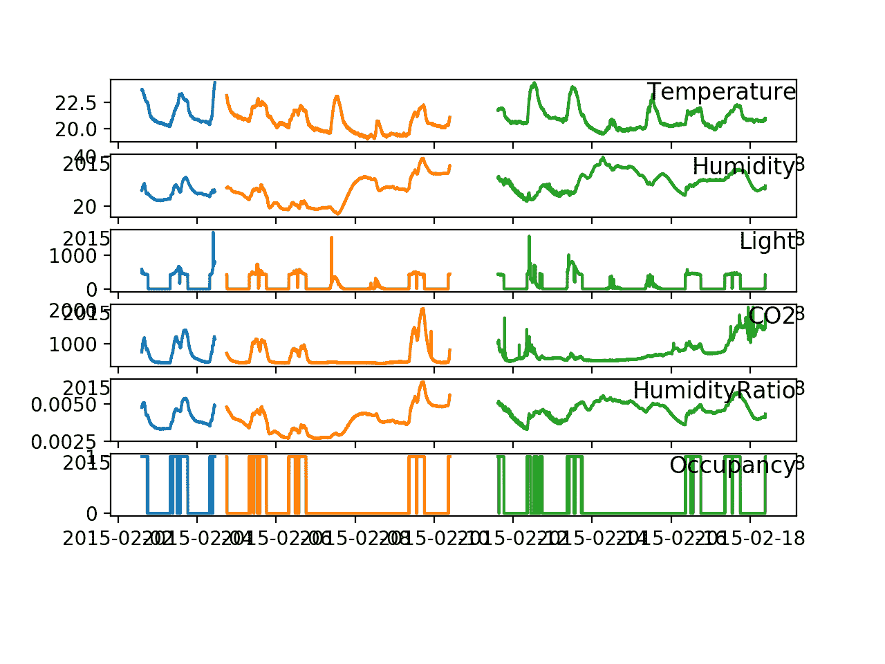

# 如何根据环境因素预测房间占用率

> 原文： [https://machinelearningmastery.com/how-to-predict-room-occupancy-based-on-environmental-factors/](https://machinelearningmastery.com/how-to-predict-room-occupancy-based-on-environmental-factors/)

诸如 Arduino 设备之类的小型计算机可以在建筑物内用于记录环境变量，从中可以预测简单和有用的属性。

一个示例是基于诸如温度，湿度和相关措施的环境措施来预测房间是否被占用。

这是一种称为房间占用分类的常见时间序列分类问题。

在本教程中，您将发现一个标准的多变量时间序列分类问题，用于使用环境变量的测量来预测房间占用率。

完成本教程后，您将了解：

*   机器学习中的占用检测标准时间序列分类问题。
*   如何加载和可视化多变量时间序列分类数据。
*   如何开发简单的幼稚和逻辑回归模型，以达到近乎完美的技能。

让我们开始吧。

*   **更新 Oct / 2018** ：更新了数据集来源的描述（我真的搞砸了），谢谢 Luis Candanedo。

## 教程概述

本教程分为四个部分;他们是：

1.  占用检测问题描述
2.  数据可视化
3.  连接数据集
4.  简单的预测模型

## 占用检测问题描述

标准时间序列分类数据集是 UCI 机器学习库中可用的“_ 占用检测 _”问题。

*   [占用检测数据集，UCI 机器学习库](https://archive.ics.uci.edu/ml/datasets/Occupancy+Detection+)

这是一个二元分类问题，需要使用诸如温度和湿度的环境因素的观察来分类房间是否被占用或未被占用。

该数据集在 2016 年论文“[使用统计学习模型](https://www.sciencedirect.com/science/article/pii/S0378778815304357)”的 Luis M. Candanedo 和 VéroniqueFeldheim 的光，温度，湿度和 CO2 测量的办公室精确占用检测中进行了描述。

通过使用一套环境传感器监控办公室并使用摄像机确定房间是否被占用来收集数据集。

> 监测办公室房间的以下变量：温度，湿度，光照和二氧化碳水平。采用微控制器来获取数据。 ZigBee 无线电连接到它并用于将信息传输到记录站。数码相机用于确定房间是否被占用。相机时间每分钟标记图片，并且手动研究这些图片以标记数据。

- [使用统计学习模型](https://www.sciencedirect.com/science/article/pii/S0378778815304357)，2016 年，通过光照，温度，湿度和 CO2 测量精确占用办公室。

数据提供日期时间信息和多天每分钟采取的六项环境措施，具体为：

*   温度以摄氏度为单位。
*   相对湿度百分比。
*   以勒克斯测量的光。
*   二氧化碳以百万分之一计。
*   湿度比，源自温度和相对湿度，以千克水蒸气/千克空气测量。
*   占用率为 1 表示占用，0 表示未占用。

该数据集已用于许多简单的建模机器学习论文中。例如，参见文章“[基于可见光的占用推断使用集合学习](https://ieeexplore.ieee.org/document/8302496/)，”2018 以获得进一步的参考。

## 数据可视化

这些数据以 CSV 格式提供三个文件，声称是用于训练，验证和测试的数据分割。

这三个文件如下：

*   **datatest.txt** （测试）：从 2015-02-02 14:19:00 到 2015-02-04 10:43:00
*   **datatraining.txt** （火车）：从 2015-02-04 17:51:00 到 2015-02-10 09:33:00
*   **datatest2.txt** （val）：从 2015-02-11 14:48:00 到 2015-02-18 09:19:00

最初显而易见的是，数据中的分割在时间上并不是连续的，并且存在差距。

测试数据集在训练和验证数据集之前及时。也许这是文件命名约定中的错误。我们还可以看到数据从 2 月 2 日延伸到 2 月 18 日，该日期跨越 17 个日历日，而不是 20 个日历日。

从这里下载文件并将它们放在当前的工作目录中：

*   [占用检测数据集，UCI 机器学习库](https://archive.ics.uci.edu/ml/datasets/Occupancy+Detection+)

每个文件都包含一个标题行，但包含一个行号的列，该列不包括标题行中的条目。

为了正确加载数据文件，请更新每个文件的标题行，如下所示：

从：

```
"date","Temperature","Humidity","Light","CO2","HumidityRatio","Occupancy"
```

至：

```
"no","date","Temperature","Humidity","Light","CO2","HumidityRatio","Occupancy"
```

下面是带有修改的 _datatraining.txt_ 文件的前五行示例。

```
"no","date","Temperature","Humidity","Light","CO2","HumidityRatio","Occupancy"
"1","2015-02-04 17:51:00",23.18,27.272,426,721.25,0.00479298817650529,1
"2","2015-02-04 17:51:59",23.15,27.2675,429.5,714,0.00478344094931065,1
"3","2015-02-04 17:53:00",23.15,27.245,426,713.5,0.00477946352442199,1
"4","2015-02-04 17:54:00",23.15,27.2,426,708.25,0.00477150882608175,1
"5","2015-02-04 17:55:00",23.1,27.2,426,704.5,0.00475699293331518,1
...
```

然后我们可以使用 Pandas _read_csv（）_ 函数加载数据文件，如下所示：

```
# load all data
data1 = read_csv('datatest.txt', header=0, index_col=1, parse_dates=True, squeeze=True)
data2 = read_csv('datatraining.txt', header=0, index_col=1, parse_dates=True, squeeze=True)
data3 = read_csv('datatest2.txt', header=0, index_col=1, parse_dates=True, squeeze=True)
```

加载后，我们可以为六个系列中的每一个创建一个图，清楚地显示三个数据集的及时分离。

下面列出了完整的示例。

```
from pandas import read_csv
from matplotlib import pyplot
# load all data
data1 = read_csv('datatest.txt', header=0, index_col=1, parse_dates=True, squeeze=True)
data2 = read_csv('datatraining.txt', header=0, index_col=1, parse_dates=True, squeeze=True)
data3 = read_csv('datatest2.txt', header=0, index_col=1, parse_dates=True, squeeze=True)
# determine the number of features
n_features = data1.values.shape[1]
pyplot.figure()
for i in range(1, n_features):
	# specify the subpout
	pyplot.subplot(n_features, 1, i)
	# plot data from each set
	pyplot.plot(data1.index, data1.values[:, i])
	pyplot.plot(data2.index, data2.values[:, i])
	pyplot.plot(data3.index, data3.values[:, i])
	# add a readable name to the plot
	pyplot.title(data1.columns[i], y=0.5, loc='right')
pyplot.show()
```

运行该示例会为每个数据集创建一个具有不同颜色的绘图：

*   _datatest.txt_ （测试）：蓝色
*   _datatraining.txt_ （火车）：橙色
*   _datatest2.txt_ （val）：绿色

我们可以看到测试和训练集之间的小差距以及列车和验证集之间的较大差距。

我们还可以看到每个变量的系列中相应的结构（峰值）和房间占用率。



线图显示所有变量和每个数据集的时间序列图

## 连接数据集

我们可以通过保留数据的时间一致性并将所有三个集合连接成一个数据集来简化数据集，删除“ _no_ ”列。

这将允许临时测试问题的简单直接框架（在下一部分中），该临时框架可以在临时一致的方式上使用特殊列车/测试装置尺寸进行测试。

**注意**：这种简化不考虑数据中的时间间隙，并且依赖于先前时​​间步骤的一系列观察的算法可能需要不同的数据组织。

下面的示例加载数据，将其连接到时间上一致的数据集，并将结果保存到名为“ _combined.csv_ ”的新文件中。

```
from pandas import read_csv
from pandas import concat
# load all data
data1 = read_csv('datatest.txt', header=0, index_col=1, parse_dates=True, squeeze=True)
data2 = read_csv('datatraining.txt', header=0, index_col=1, parse_dates=True, squeeze=True)
data3 = read_csv('datatest2.txt', header=0, index_col=1, parse_dates=True, squeeze=True)
# vertically stack and maintain temporal order
data = concat([data1, data2, data3])
# drop row number
data.drop('no', axis=1, inplace=True)
# save aggregated dataset
data.to_csv('combined.csv')
```

运行该示例将连接的数据集保存到新文件' _combined.csv_ '。

## 简单的预测模型

该问题最简单的表述是根据当前的环境条件预测占用率。

我将此称为直接模型，因为它没有利用先前时间步骤的环境措施的观察结果。从技术上讲，这不是序列分类，它只是一个直接的分类问题，其中观察是在时间上排序的。

这似乎是我从文献中略读的问题的标准表达，令人失望的是，论文似乎使用了 UCI 网站上标注的训练/验证/测试数据。

我们将使用上一节中描述的组合数据集，并通过将最后 30％的数据作为测试集保留来评估模型技能。例如：

```
# load the dataset
data = read_csv('combined.csv', header=0, index_col=0, parse_dates=True, squeeze=True)
values = data.values
# split data into inputs and outputs
X, y = values[:, :-1], values[:, -1]
# split the dataset
trainX, testX, trainy, testy = train_test_split(X, y, test_size=0.3, shuffle=False, random_state=1)
```

接下来，我们可以从一个朴素的预测模型开始评估数据集的一些模型。

### 天真的模型

这个问题的一个简单模型是预测最突出的阶级结果。

这称为零规则，或原始预测算法。我们将评估测试集中每个示例的所有 0（未占用）和全 1（占用）的预测，并使用精度度量来评估方法。

下面是一个函数，它将根据测试集和选择的结果变量执行这种天真的预测

```
def naive_prediction(testX, value):
	return [value for x in range(len(testX))]
```

下面列出了完整的示例。

```
# naive prediction model
from pandas import read_csv
from sklearn.metrics import accuracy_score
from sklearn.model_selection import train_test_split
from sklearn.metrics import accuracy_score
# load the dataset
data = read_csv('../datasets/occupancy_data/combined.csv', header=0, index_col=0, parse_dates=True, squeeze=True)
values = data.values
# split data into inputs and outputs
X, y = values[:, :-1], values[:, -1]
# split the dataset
trainX, testX, trainy, testy = train_test_split(X, y, test_size=0.3, shuffle=False, random_state=1)

# make a naive prediction
def naive_prediction(testX, value):
	return [value for x in range(len(testX))]

# evaluate skill of predicting each class value
for value in [0, 1]:
	# forecast
	yhat = naive_prediction(testX, value)
	# evaluate
	score = accuracy_score(testy, yhat)
	# summarize
	print('Naive=%d score=%.3f' % (value, score))
```

运行该示例打印天真预测和相关分数。

通过预测全部 0，我们可以看到基线分数约为 82％的准确度。都没有入住。

对于任何被认为对该问题熟练的模型，它必须达到 82％或更高的技能。

```
Naive=0 score=0.822
Naive=1 score=0.178
```

### Logistic 回归

文献的摘要显示了应用于该问题的一系列复杂的神经网络模型。

首先，让我们尝试一个简单的逻辑回归分类算法。

下面列出了完整的示例。

```
# logistic regression
from pandas import read_csv
from sklearn.metrics import accuracy_score
from sklearn.model_selection import train_test_split
from sklearn.metrics import accuracy_score
from sklearn.linear_model import LogisticRegression
# load the dataset
data = read_csv('combined.csv', header=0, index_col=0, parse_dates=True, squeeze=True)
values = data.values
# split data into inputs and outputs
X, y = values[:, :-1], values[:, -1]
# split the dataset
trainX, testX, trainy, testy = train_test_split(X, y, test_size=0.3, shuffle=False, random_state=1)
# define the model
model = LogisticRegression()
# fit the model on the training set
model.fit(trainX, trainy)
# predict the test set
yhat = model.predict(testX)
# evaluate model skill
score = accuracy_score(testy, yhat)
print(score)
```

运行该示例在训练数据集上拟合逻辑回归模型并预测测试数据集。

该模型的技能大约 99％准确，显示出天真方法的技巧。

通常，我建议在建模之前对数据进行居中和规范化，但是一些试验和错误表明，未缩放数据的模型更加熟练。

```
0.992704280155642
```

乍一看这是一个令人印象深刻的结果。

尽管测试设置与研究文献中的测试设置不同，但是报告的非常简单模型的技能优于更复杂的神经网络模型。

### 特征选择和 Logistic 回归

仔细观察时间序列图可以看出房间被占用的时间与环境措施的峰值之间存在明显的关系。

这是有道理的，并解释了为什么这个问题实际上很容易建模。

我们可以通过单独测试每个环境度量的简单逻辑回归模型来进一步简化模型。我们的想法是，我们不需要所有数据来预测占用率;或许只是其中一项措施就足够了。

这是最简单的特征选择类型，其中创建模型并单独评估每个特征。更高级的方法可以考虑每个特征子组。

下面列出了使用五个输入功能中的每一个单独测试逻辑模型的完整示例。

```
# logistic regression feature selection
from pandas import read_csv
from sklearn.metrics import accuracy_score
from sklearn.model_selection import train_test_split
from sklearn.metrics import accuracy_score
from sklearn.linear_model import LogisticRegression
# load the dataset
data = read_csv('combined.csv', header=0, index_col=0, parse_dates=True, squeeze=True)
values = data.values
# basic feature selection
features = [0, 1, 2, 3, 4]
for f in features:
	# split data into inputs and outputs
	X, y = values[:, f].reshape((len(values), 1)), values[:, -1]
	# split the dataset
	trainX, testX, trainy, testy = train_test_split(X, y, test_size=0.3, shuffle=False, random_state=1)
	# define the model
	model = LogisticRegression()
	# fit the model on the training set
	model.fit(trainX, trainy)
	# predict the test set
	yhat = model.predict(testX)
	# evaluate model skill
	score = accuracy_score(testy, yhat)
	print('feature=%d, name=%s, score=%.3f' % (f, data.columns[f], score))
```

运行该示例将打印特征索引，名称以及在该特征上训练的逻辑模型的技能，并在测试集上进行评估。

我们可以看到只需要“ _Light_ ”变量就可以在此数据集上实现 99％的准确率。

记录环境变量的实验室很可能有一个光传感器，当房间被占用时，它会打开内部灯。

或者，也许在白天记录光（例如通过窗户的阳光），并且房间在每天或每周工作日被占用。

至少，本教程的结果会询问有关使用此数据集的任何研究论文的一些难题，因为显然它不是一个具有挑战性的预测问题。

```
feature=0, name=Temperature, score=0.799
feature=1, name=Humidity, score=0.822
feature=2, name=Light, score=0.991
feature=3, name=CO2, score=0.763
feature=4, name=HumidityRatio, score=0.822
```

## 扩展

这些数据可能仍然有待进一步调查。

一些想法包括：

*   如果移除光柱，问题可能会更具挑战性。
*   也许问题可以被描述为真正的多变量时间序列分类，其中在模型中使用滞后观察。
*   也许在预测中可以利用环境变量中的明显峰值。

我简单地尝试了这些模型而没有令人兴奋的结果。

如果您浏览任何这些扩展或在线查找一些示例，请在下面的评论中告诉我们。

## 进一步阅读

如果您希望深入了解，本节将提供有关该主题的更多资源。

*   [占用检测数据集，UCI 机器学习库](https://archive.ics.uci.edu/ml/datasets/Occupancy+Detection+)
*   [GitHub 上的占用检测数据](https://github.com/LuisM78/Occupancy-detection-data)
*   [支持需求驱动的 HVAC 运行的基于多传感器的占用估计模型](https://dl.acm.org/citation.cfm?id=2339455)，2012。
*   [使用统计学习模型](https://www.sciencedirect.com/science/article/pii/S0378778815304357)，2016 年对光线，温度，湿度和 CO2 测量的办公室进行精确的占用检测。
*   [基于可见光的占用推断使用集成学习](https://ieeexplore.ieee.org/document/8302496/)，2018。

## 摘要

在本教程中，您发现了一个标准的多变量时间序列分类问题，用于使用环境变量的度量来预测房间占用率。

具体来说，你学到了：

*   机器学习中的占用检测标准时间序列分类问题。
*   如何加载和可视化多变量时间序列分类数据。
*   如何开发简单的幼稚和逻辑回归模型，以达到近乎完美的技能。

你有任何问题吗？
在下面的评论中提出您的问题，我会尽力回答。