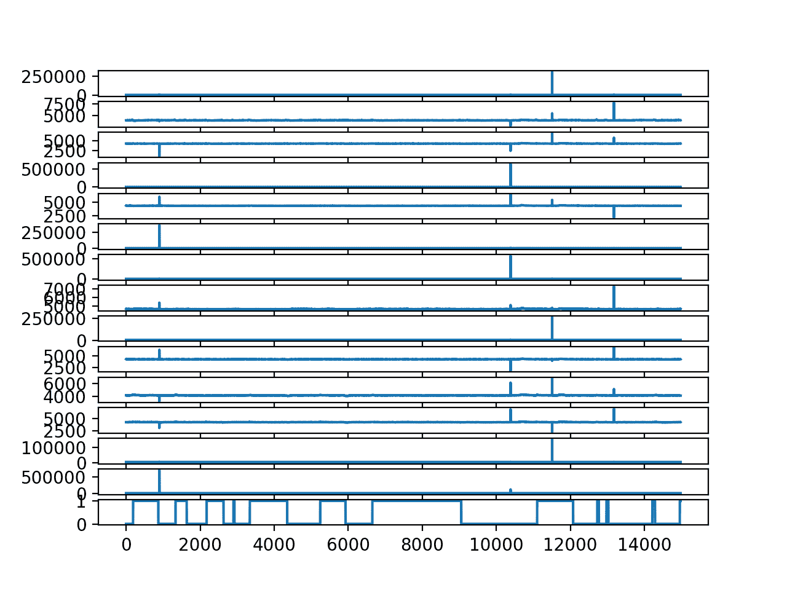
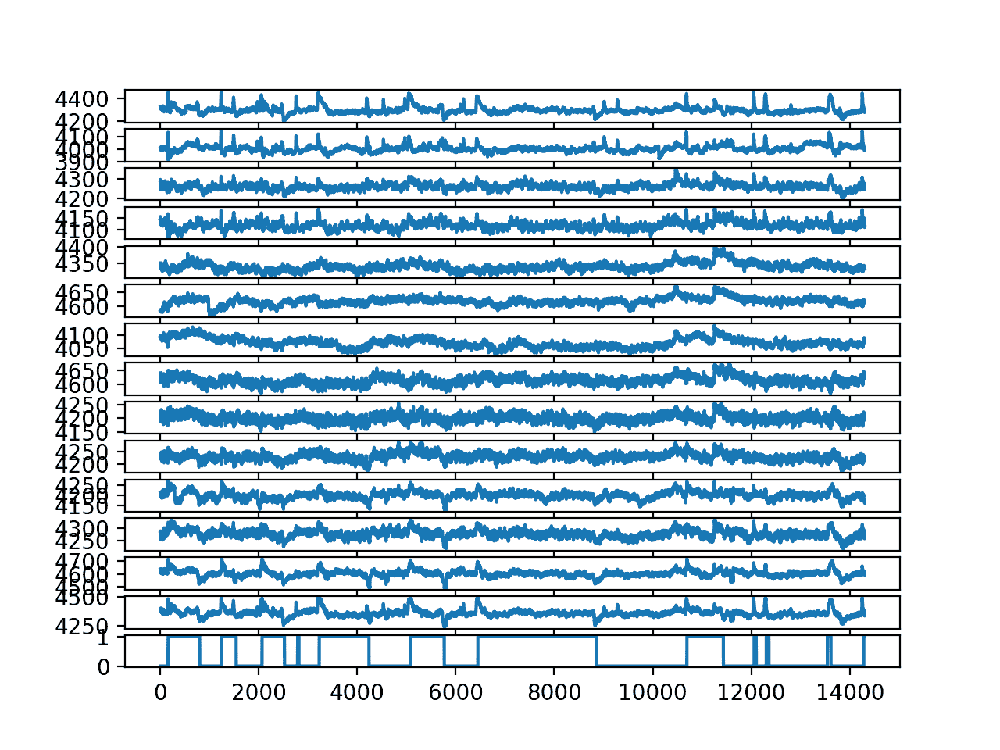

# 如何使用脑波预测人眼是打开还是关闭

> 原文： [https://machinelearningmastery.com/how-to-predict-whether-eyes-are-open-or-closed-using-brain-waves/](https://machinelearningmastery.com/how-to-predict-whether-eyes-are-open-or-closed-using-brain-waves/)

#### 
评估机器学习方法进行时间序列预测时如何避免方法错误的案例研究。

评估关于时间序列预测问题的机器学习模型具有挑战性。

在问题框架或模型评估中很容易产生一个小错误，这会产生令人印象深刻的结果，但会导致无效的发现。

一个有趣的时间序列分类问题是仅基于他们的脑波数据（EEG）来预测受试者的眼睛是开放还是闭合。

在本教程中，您将发现在评估时间序列预测模型时，基于脑电波和常见方法陷阱预测眼睛是开放还是闭合的问题。

通过本教程，您将了解在评估时间序列预测问题的机器学习算法时如何避免常见陷阱。这些陷阱既吸引了初学者，也吸引了专业从业者和学者。

完成本教程后，您将了解：

*   眼睛状态预测问题和您可以使用的标准机器学习数据集。
*   如何重现熟练的结果来预测 Python 中脑波的眼睛状态。
*   如何在评估预测模型时发现一个有趣的方法缺陷。

让我们开始吧。

## 教程概述

本教程分为七个部分;他们是：

1.  从脑波预测开/闭眼
2.  数据可视化和删除异常值
3.  开发预测模型
4.  模型评估方法的问题
5.  用时间顺序训练分裂训练
6.  前瞻性验证
7.  外卖和重点课程

## 从脑波预测开/闭眼

在这篇文章中，我们将仔细研究一个问题，即根据脑波数据预测受试者眼睛是开放还是闭合。

Oliver Rosler 和 David Suendermann 为他们的 2013 年论文题为“[迈向使用 EEG 的眼睛状态预测的第一步](http://suendermann.com/su/pdf/aihls2013.pdf)”描述了这个问题。

我看到了这个数据集，我不得不知道更多。

具体地，当对象打开和闭合眼睛时，通过摄像机记录，由单个人进行脑电图（EEG）记录 117 秒（刚好不到两分钟）。然后手动记录 EEG 迹线中每个时间步的打开/关闭状态。

使用 [Emotiv EEG Neuroheadset](https://www.emotiv.com/) 记录 EEG，产生 14 条痕迹。


EEG 传感器位于受试者身上的卡通
取自“使用 EEG 进行眼状态预测的第一步”，2013 年。

输出变量是二进制的，这意味着这是一个两类分类问题。

在 117 秒内总共进行了 14,980 次观测（行），这意味着每秒约有 128 次观测。

语料库由 14,977 个实例组成，每个实例具有 15 个属性（14 个属性表示电极和眼睛状态的值）。实例按时间顺序存储在语料库中，以便能够分析时间依赖性。语料库的 8,255（55.12％）个实例对应于睁眼，6,722（44.88％）个实例对应于闭眼状态。

*   [使用脑电图进行眼状态预测的第一步](http://suendermann.com/su/pdf/aihls2013.pdf)，2013。

还有一些脑电图观察具有远大于预期的幅度。这些可能是异常值，可以使用简单的统计方法识别和删除，例如删除与平均值有 3 到 4 个标准偏差的行。

该问题的最简单的框架是在当前时间步长给出 EEG 迹线的情况下预测眼睛状态（打开/关闭）。该问题的更高级框架可以寻求对每个 EEG 迹线的多变量时间序列建模以便预测当前眼睛状态。

## 数据可视化和删除异常值

数据集可以从 UCI 机器学习库免费下载：

*   [脑电图眼状态数据集](https://archive.ics.uci.edu/ml/datasets/EEG+Eye+State)

原始数据采用 ARFF 格式（在 Weka 中使用），但可以通过删除 ARFF 标头转换为 CSV。

下面是删除了 ARFF 标题的前五行数据的示例。

```py
4329.23,4009.23,4289.23,4148.21,4350.26,4586.15,4096.92,4641.03,4222.05,4238.46,4211.28,4280.51,4635.9,4393.85,0
4324.62,4004.62,4293.85,4148.72,4342.05,4586.67,4097.44,4638.97,4210.77,4226.67,4207.69,4279.49,4632.82,4384.1,0
4327.69,4006.67,4295.38,4156.41,4336.92,4583.59,4096.92,4630.26,4207.69,4222.05,4206.67,4282.05,4628.72,4389.23,0
4328.72,4011.79,4296.41,4155.9,4343.59,4582.56,4097.44,4630.77,4217.44,4235.38,4210.77,4287.69,4632.31,4396.41,0
4326.15,4011.79,4292.31,4151.28,4347.69,4586.67,4095.9,4627.69,4210.77,4244.1,4212.82,4288.21,4632.82,4398.46,0
...
```

我们可以将数据作为 DataFrame 加载，并绘制每个 EEG 轨迹和输出变量（打开/关闭状态）的时间序列。

完整的代码示例如下所示。

该示例假定您具有 CSV 格式的数据集副本，文件名为“`EEG_Eye_State.csv`”，与代码位于同一目录中。

```py
# visualize dataset
from pandas import read_csv
from matplotlib import pyplot
# load the dataset
data = read_csv('EEG_Eye_State.csv', header=None)
# retrieve data as numpy array
values = data.values
# create a subplot for each time series
pyplot.figure()
for i in range(values.shape[1]):
	pyplot.subplot(values.shape[1], 1, i+1)
	pyplot.plot(values[:, i])
pyplot.show()
```

运行该示例会为每个 EEG 跟踪和输出变量创建一个线图。

我们可以看到异常值清除每条迹线中的数据。我们还可以分别以 0/1 看到眼睛的开/关状态。



每个 EEG 轨迹和输出变量的线图

去除异常值以更好地理解 EEG 痕迹与眼睛的开/闭状态之间的关系是有用的。

下面的示例将删除所有具有 EEG 观测值的行，这些行是平均值的四个标准偏差或更多。数据集将保存到名为“`EEG_Eye_State_no_outliers.csv`”的新文件中。

这是[离群值检测和删除](https://machinelearningmastery.com/how-to-use-statistics-to-identify-outliers-in-data/)的快速而肮脏的实现，但是完成了工作。我相信你可以设计出更高效的实施方案。

```py
# remove outliers from the EEG data
from pandas import read_csv
from numpy import mean
from numpy import std
from numpy import delete
from numpy import savetxt
# load the dataset.
data = read_csv('EEG_Eye_State.csv', header=None)
values = data.values
# step over each EEG column
for i in range(values.shape[1] - 1):
	# calculate column mean and standard deviation
	data_mean, data_std = mean(values[:,i]), std(values[:,i])
	# define outlier bounds
	cut_off = data_std * 4
	lower, upper = data_mean - cut_off, data_mean + cut_off
	# remove too small
	too_small = [j for j in range(values.shape[0]) if values[j,i] < lower]
	values = delete(values, too_small, 0)
	print('>deleted %d rows' % len(too_small))
	# remove too large
	too_large = [j for j in range(values.shape[0]) if values[j,i] > upper]
	values = delete(values, too_large, 0)
	print('>deleted %d rows' % len(too_large))
# save the results to a new file
savetxt('EEG_Eye_State_no_outliers.csv', values, delimiter=',')
```

运行该示例总结了删除的行，因为 EEG 数据中的每一列都针对平均值之上和之下的异常值进行处理。

```py
>deleted 0 rows
>deleted 1 rows
>deleted 2 rows
>deleted 1 rows
>deleted 0 rows
>deleted 142 rows
>deleted 0 rows
>deleted 48 rows
>deleted 0 rows
>deleted 153 rows
>deleted 0 rows
>deleted 43 rows
>deleted 0 rows
>deleted 0 rows
>deleted 0 rows
>deleted 15 rows
>deleted 0 rows
>deleted 5 rows
>deleted 10 rows
>deleted 0 rows
>deleted 21 rows
>deleted 53 rows
>deleted 0 rows
>deleted 12 rows
>deleted 58 rows
>deleted 53 rows
>deleted 0 rows
>deleted 59 rows
```

我们现在可以通过加载新的'`EEG_Eye_State_no_outliers.csv`'文件来显示没有异常值的数据。

```py
# visualize dataset without outliers
from pandas import read_csv
from matplotlib import pyplot
# load the dataset
data = read_csv('EEG_Eye_State_no_outliers.csv', header=None)
# retrieve data as numpy array
values = data.values
# create a subplot for each time series
pyplot.figure()
for i in range(values.shape[1]):
	pyplot.subplot(values.shape[1], 1, i+1)
	pyplot.plot(values[:, i])
pyplot.show()
```

运行该示例可创建更好的绘图，清晰显示眼睛闭合时的正峰值（1）和眼睛打开时的负峰值（0）。



每个 EEG 轨迹的线图和没有异常值的输出变量

## 开发预测模型

最简单的预测模型是基于当前的 EEG 观察来预测眼睛开/闭状态，忽略跟踪信息。

直观地说，人们不会期望这是有效的，然而，这是 Rosler 和 Suendermann 2013 年论文中使用的方法。

具体来说，他们使用这种问题框架的 10 倍交叉验证评估了 [Weka 软件](https://machinelearningmastery.com/applied-machine-learning-weka-mini-course/)中的一大套分类算法。他们使用多种方法实现了超过 90％的准确度，包括基于实例的方法，如 [k-最近邻](https://machinelearningmastery.com/k-nearest-neighbors-for-machine-learning/)和 KStar。

> 然而，基于实例的学习器，如 IB1 和 KStar，再次大大超过了决策树。后者实现了明显的最佳表现，分类错误率仅为 3.2％。

- [使用 EEG 进行眼状态预测的第一步](http://suendermann.com/su/pdf/aihls2013.pdf)，2013。

在许多其他论文中，类似的方法和发现与相同和相似的数据集一起使用。

当我读到这篇文章时，我很惊讶，因此转载了结果。

完整示例如下所列，k = 3 KNN。

```py
# knn for predicting eye state
from pandas import read_csv
from sklearn.metrics import accuracy_score
from sklearn.model_selection import KFold
from sklearn.neighbors import KNeighborsClassifier
from numpy import mean
# load the dataset
data = read_csv('EEG_Eye_State_no_outliers.csv', header=None)
values = data.values
# evaluate knn using 10-fold cross-validation
scores = list()
kfold = KFold(10, shuffle=True, random_state=1)
for train_ix, test_ix in kfold.split(values):
	# define train/test X/y
	trainX, trainy = values[train_ix, :-1], values[train_ix, -1]
	testX, testy = values[test_ix, :-1], values[test_ix, -1]
	# define model
	model = KNeighborsClassifier(n_neighbors=3)
	# fit model on train set
	model.fit(trainX, trainy)
	# forecast test set
	yhat = model.predict(testX)
	# evaluate predictions
	score = accuracy_score(testy, yhat)
	# store
	scores.append(score)
	print('>%.3f' % score)
# calculate mean score across each run
print('Final Score: %.3f' % (mean(scores)))
```

运行该示例打印交叉验证的每个折叠的得分，并且在所有 10 倍中平均得分为 97％。

```py
>0.970
>0.975
>0.978
>0.977
>0.973
>0.979
>0.978
>0.976
>0.974
>0.969
Final Score: 0.975
```

非常令人印象深刻！

但是感觉有些不对劲。

我有兴趣了解在开放到封闭和关闭到开放的每个过渡期间如何考虑数据中清晰峰值的模型。

我尝试使用我自己的测试工具来考虑数据的时间顺序的每个模型表现得更糟。

为什么？

提示：考虑所选模型评估策略和表现最佳的算法类型。

## 模型评估方法的问题

**免责声明**：我没有打电话给论文或相关论文的作者。我不在乎。根据我的经验，大多数发表的论文都无法复制或存在重大的方法缺陷（包括我写的很多东西）。我只对学习和教学感兴趣。

时间序列模型的评估方法存在方法上的缺陷。

我教导了这个缺陷，但在阅读了论文并重现结果之后，它仍然让我绊倒了。

我希望通过这个例子来说明它将帮助你解决自己的预测问题。

模型评估中的方法缺陷是使用 k 折交叉验证。具体而言，以不遵守观察的时间顺序的方式评估模型。

这个问题的关键是找到基于实例的方法，比如 k-最近邻，因为它对这个问题非常熟练。 KNN 将在数据集中寻找`k`最相似的行，并计算输出状态的模式作为预测。

通过在评估模型时不考虑实例的时间顺序，它允许模型使用来自未来的信息做出预测。这在 KNN 算法中特别明显。

由于观测频率高（每秒 128 次），最相似的行将是在过去和未来的预测实例中及时相邻的行。

我们可以通过一些小实验来更清楚地说明这一点。

## 用时间顺序训练分裂训练

我们可以做的第一个测试是评估 KNN 模型的技能，当数据集被洗牌时，以及当数据集不是时，训练/测试分割。

在分割之前对数据进行混洗的情况下，我们期望结果类似于上一节中的交叉验证结果，特别是如果测试集是数据集的 10％。

如果关于时间排序和基于实例的方法在未来使用相邻示例的重要性的理论是正确的，那么我们期望在拆分之前数据集未被洗牌的测试更糟糕。

首先，下面的示例将数据集拆分为训练/测试拆分，分别为 90％/ 10％的数据。在拆分之前对数据集进行洗牌。

```py
# knn for predicting eye state
from pandas import read_csv
from sklearn.metrics import accuracy_score
from sklearn.model_selection import train_test_split
from sklearn.neighbors import KNeighborsClassifier
# load the dataset
data = read_csv('EEG_Eye_State_no_outliers.csv', header=None)
values = data.values
# split data into inputs and outputs
X, y = values[:, :-1], values[:, -1]
# split the dataset
trainX, testX, trainy, testy = train_test_split(X, y, test_size=0.1, shuffle=True, random_state=1)
# define model
model = KNeighborsClassifier(n_neighbors=3)
# fit model on train set
model.fit(trainX, trainy)
# forecast test set
yhat = model.predict(testX)
# evaluate predictions
score = accuracy_score(testy, yhat)
print(score)
```

运行该示例，我们可以看到，确实，该技能与我们在交叉验证示例中看到的或与其接近的技能相匹配，准确率为 96％。

```py
0.9699510831586303
```

接下来，我们重复实验，而不是在拆分之前对数据集进行洗牌。

这意味着训练数据是关于观测的时间排序的前 90％的数据，并且测试数据集是数据的最后 10％或约 1,400 个观测值。

```py
# knn for predicting eye state
from pandas import read_csv
from sklearn.metrics import accuracy_score
from sklearn.model_selection import train_test_split
from sklearn.neighbors import KNeighborsClassifier
# load the dataset
data = read_csv('EEG_Eye_State_no_outliers.csv', header=None)
values = data.values
# split data into inputs and outputs
X, y = values[:, :-1], values[:, -1]
# split the dataset
trainX, testX, trainy, testy = train_test_split(X, y, test_size=0.1, shuffle=False, random_state=1)
# define model
model = KNeighborsClassifier(n_neighbors=3)
# fit model on train set
model.fit(trainX, trainy)
# forecast test set
yhat = model.predict(testX)
# evaluate predictions
score = accuracy_score(testy, yhat)
print(score)
```

运行该示例显示模型技能更差，为 52％。

```py
0.5269042627533194
```

这是一个好的开始，但不是确定的。

考虑到我们可以在结果变量图上看到非常短的开/关间隔，有可能最后 10％的数据集难以预测。

我们可以重复实验并及时使用前 10％的数据进行测试，最后 90％的数据用于训练。我们可以通过在使用 [flip（）函数](https://docs.scipy.org/doc/numpy/reference/generated/numpy.flip.html)分割数据之前反转行的顺序来实现。

```py
# knn for predicting eye state
from pandas import read_csv
from sklearn.metrics import accuracy_score
from sklearn.model_selection import train_test_split
from sklearn.neighbors import KNeighborsClassifier
from numpy import flip
# load the dataset
data = read_csv('EEG_Eye_State_no_outliers.csv', header=None)
values = data.values
# reverse order of rows
values = flip(values, 0)
# split data into inputs and outputs
X, y = values[:, :-1], values[:, -1]
# split the dataset
trainX, testX, trainy, testy = train_test_split(X, y, test_size=0.1, shuffle=False, random_state=1)
# define model
model = KNeighborsClassifier(n_neighbors=3)
# fit model on train set
model.fit(trainX, trainy)
# forecast test set
yhat = model.predict(testX)
# evaluate predictions
score = accuracy_score(testy, yhat)
print(score)
```

运行实验产生类似的结果，准确度约为 52％。

这提供了更多的证据，证明不是特定的连续观察块导致模型技能差。

```py
0.5290006988120196
```

看起来需要立即相邻的观察来做出良好的预测。

## 前瞻性验证

模型可能需要过去（但不是未来）的相邻观察，以便进行熟练的预测。

这听起来很合理，但也有问题。

然而，我们可以使用测试集上的前向验证来实现这一点。这是允许模型在预测时间步骤之前使用所有观察的地方，因为我们在测试数据集中的每个新时间步骤验证新模型。

有关前进验证的更多信息，请参阅帖子：

*   [如何对时间序列预测的机器学习模型进行反向测试](https://machinelearningmastery.com/backtest-machine-learning-models-time-series-forecasting/)

下面的示例使用前向验证评估 KNN 的技能，使用最后 10％的数据集（约 10 秒），遵守时间顺序。

```py
# knn for predicting eye state
from pandas import read_csv
from sklearn.metrics import accuracy_score
from sklearn.model_selection import train_test_split
from sklearn.neighbors import KNeighborsClassifier
from numpy import array
# load the dataset
data = read_csv('EEG_Eye_State_no_outliers.csv', header=None)
values = data.values
# split data into inputs and outputs
X, y = values[:, :-1], values[:, -1]
# split the dataset
trainX, testX, trainy, testy = train_test_split(X, y, test_size=0.1, shuffle=False, random_state=1)
# walk-forward validation
historyX, historyy = [x for x in trainX], [x for x in trainy]
predictions = list()
for i in range(len(testy)):
	# define model
	model = KNeighborsClassifier(n_neighbors=3)
	# fit model on train set
	model.fit(array(historyX), array(historyy))
	# forecast the next time step
	yhat = model.predict([testX[i, :]])[0]
	# store prediction
	predictions.append(yhat)
	# add real observation to history
	historyX.append(testX[i, :])
	historyy.append(testy[i])
# evaluate predictions
score = accuracy_score(testy, predictions)
print(score)
```

运行该示例可提供令人印象深刻的模型技能，准确率约为 95％。

```py
0.9531795946890287
```

我们可以进一步推进此测试，并且在做出预测时仅将先前的 10 个观测值用于模型。

下面列出了完整的示例。

```py
# knn for predicting eye state
from pandas import read_csv
from sklearn.metrics import accuracy_score
from sklearn.model_selection import train_test_split
from sklearn.neighbors import KNeighborsClassifier
from numpy import array
# load the dataset
data = read_csv('EEG_Eye_State_no_outliers.csv', header=None)
values = data.values
# split data into inputs and outputs
X, y = values[:, :-1], values[:, -1]
# split the dataset
trainX, testX, trainy, testy = train_test_split(X, y, test_size=0.1, shuffle=False, random_state=1)
# walk-forward validation
historyX, historyy = [x for x in trainX], [x for x in trainy]
predictions = list()
for i in range(len(testy)):
	# define model
	model = KNeighborsClassifier(n_neighbors=3)
	# fit model on a small subset of the train set
	tmpX, tmpy = array(historyX)[-10:,:], array(historyy)[-10:]
	model.fit(tmpX, tmpy)
	# forecast the next time step
	yhat = model.predict([testX[i, :]])[0]
	# store prediction
	predictions.append(yhat)
	# add real observation to history
	historyX.append(testX[i, :])
	historyy.append(testy[i])
# evaluate predictions
score = accuracy_score(testy, predictions)
print(score)
```

运行该示例可以进一步提高模型技能，准确率接近 99％。

我预计，当迹线从开放到闭合或从闭合到开放转变时，唯一出现的错误是 EEG 系列拐点处的错误，这是问题的实际难点部分。这方面需要进一步调查。

```py
0.9923130677847659
```

实际上，我们已经确认该模型需要相邻的观测结果及其结果才能做出预测，并且它只能在过去而不是未来的相邻观测中做得很好。

这是有趣的。但这一发现在实践中没有用。

如果部署了该模型，则需要模型知道最近过去的眼睛打开/关闭状态，例如之前的 128 秒。

这将无法使用。

基于脑波预测眼睛状态的模型的整体思想是让它在没有这种确认的情况下运行。

## 外卖和重点课程

让我们回顾一下到目前为止我们学到的东西：

**1.模型评估方法必须考虑到观测的时间顺序。**

这意味着使用 k-fold 交叉验证在方法上无效，该交叉验证不按时间分层（例如，随机抽取或使用随机选择的行）。

这也意味着使用在分割之前混洗数据的训练/测试分割在方法上是无效的。

我们在模型的高技能评估中看到了这一点，与模型的低技能相比，在模型的低技能时，在预测时间无法获得直接相邻的观测时间。

**2.模型评估方法必须对最终模型的使用有意义。**

这意味着即使您使用的方法尊重观察的时间顺序，模型也应该只有在实际使用模型时可用的信息。

我们在模型的高技能下看到了这一点，这种方法遵循了观察顺序的前瞻性验证方法，但提供了可用的信息，例如眼睛状态，如果模型在实践中使用则无法获得。

关键是从使用最终模型的问题框架开始，然后向后工作到可用的数据，以及在框架中评估模型的方法，该框架仅在可用的信息下运行取景。

当您试图了解其他人的工作时，这会倍加适用。

**前进**

希望，无论是在评估自己的预测模型时，还是在评估其他模型时，这都会有所帮助。

那么，如果提供原始数据，您将如何解决此问题？

我认为这个问题的关键是在从开眼到闭眼或闭眼到开眼的过渡时 EEG 数据中明显的正/负峰值。我希望有效的模型可以利用这个特征，可能使用半秒钟或类似的先前脑电图观察。

甚至可以使用单个迹线而不是 15 个，以及来自信号处理的简单峰值检测方法，而不是机器学习方法。

如果你对此有所了解，请告诉我。我很想看看你发现了什么。

## 进一步阅读

如果您希望深入了解，本节将提供有关该主题的更多资源。

*   [脑电图眼状态数据集，UCI 机器学习库](https://archive.ics.uci.edu/ml/datasets/EEG+Eye+State)
*   [使用脑电图进行眼状态预测的第一步](http://suendermann.com/su/pdf/aihls2013.pdf)，2013。
*   [EEG 眼睛状态识别使用增量属性学习和时间序列分类](https://www.hindawi.com/journals/mpe/2014/365101/)，2014。

## 摘要

在本教程中，您发现了在评估时间序列预测模型时基于脑电波和常见方法陷阱预测眼睛是开放还是闭合的问题。

具体来说，你学到了：

*   眼睛状态预测问题和您可以使用的标准机器学习数据集。
*   如何重现熟练的结果来预测 Python 中脑波的眼睛状态。
*   如何在评估预测模型时发现一个有趣的方法缺陷。

你有任何问题吗？
在下面的评论中提出您的问题，我会尽力回答。