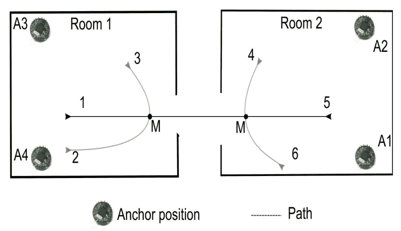
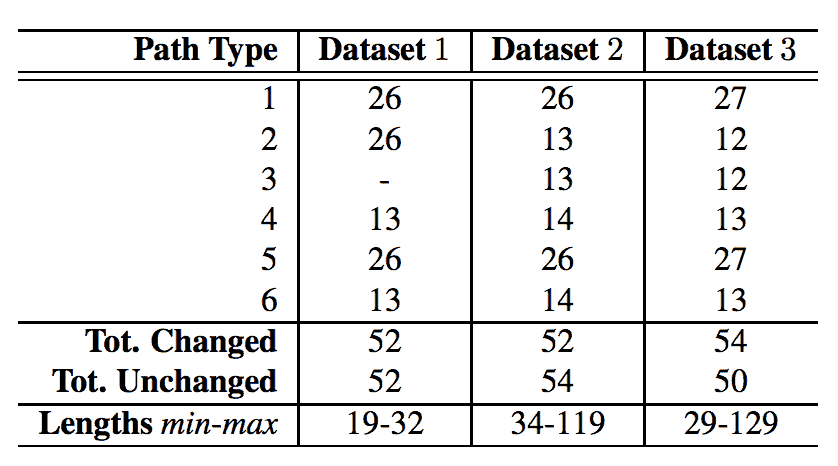
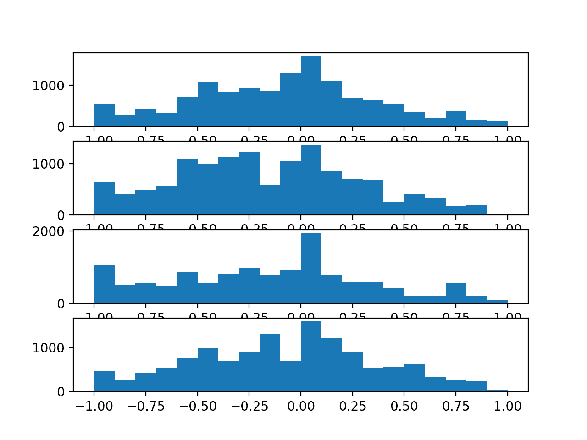
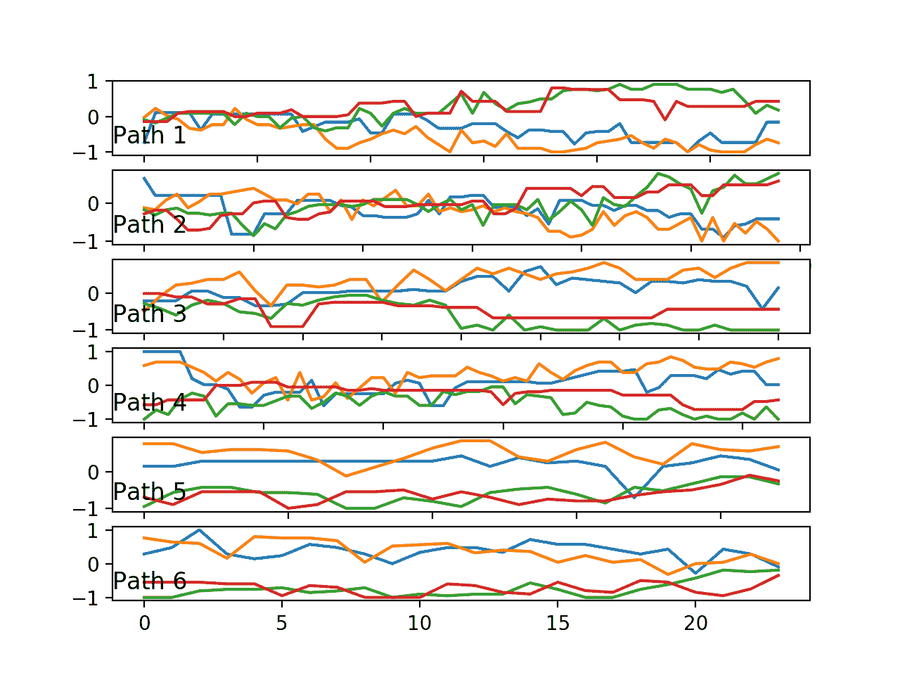
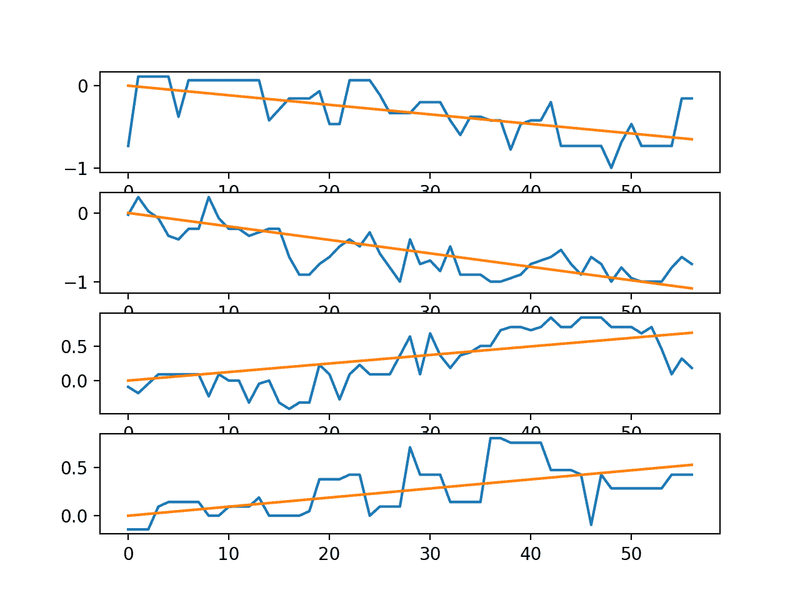
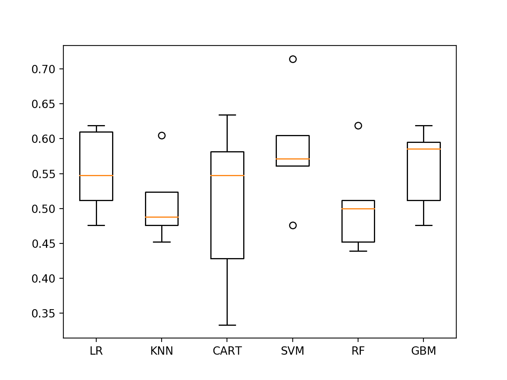
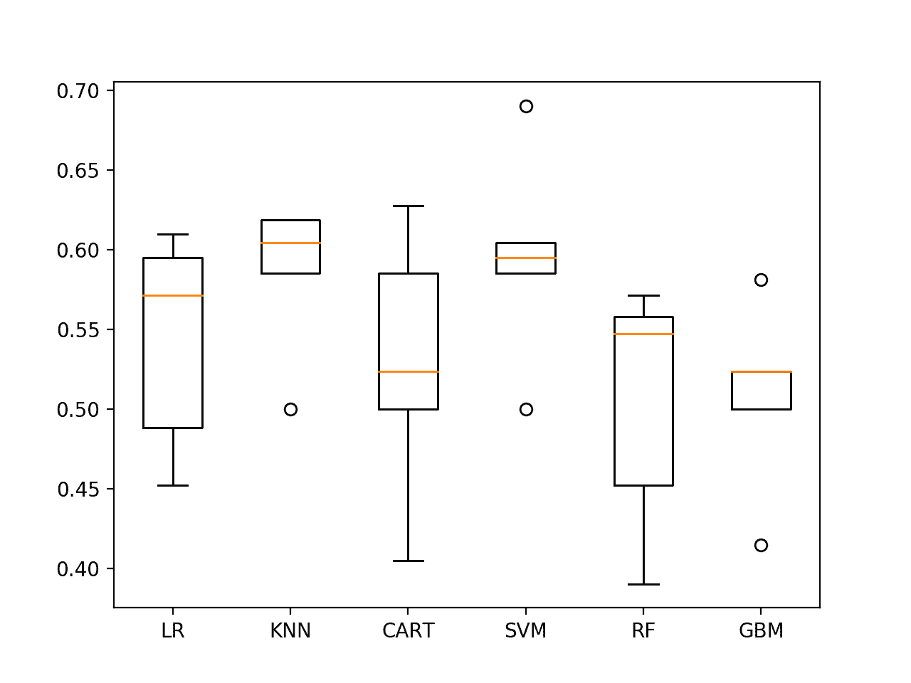

# 基于机器学习算法的室内运动时间序列分类

> 原文： [https://machinelearningmastery.com/indoor-movement-time-series-classification-with-machine-learning-algorithms/](https://machinelearningmastery.com/indoor-movement-time-series-classification-with-machine-learning-algorithms/)

室内运动预测涉及使用无线传感器强度数据来预测建筑物内的对象的位置和运动。

这是一个具有挑战性的问题，因为没有直接的分析模型将来自多个传感器的信号强度数据的可变长度轨迹转换为用户行为。

'_ 室内用户移动 _'数据集是标准且免费提供的时间序列分类问题。

在本教程中，您将发现室内运动预测时间序列分类问题以及如何设计功能并评估问题的机器学习算法。

完成本教程后，您将了解：

*   基于传感器强度预测房间运动的时间序列分类问题。
*   如何调查数据以便更好地理解问题以及如何从原始数据中设计特征以做出预测建模。
*   如何检查一套分类算法并调整一种算法以进一步提高问题的表现。

让我们开始吧。

*   **更新 Sept / 2018** ：添加了指向数据集镜像的链接。


室内运动时间序列分类与机器学习算法
照片由 [Nola Tularosa](https://www.flickr.com/photos/nolatularosa/3238977118/) ，保留一些权利。

## 教程概述

本教程分为五个部分;他们是：

1.  室内用户运动预测
2.  室内运动预测数据集
3.  模型评估
4.  数据准备
5.  算法抽查

## 室内用户运动预测

“_ 室内用户移动 _”预测问题涉及基于由环境中的无线检测器测量的信号强度的变化来确定个体是否已经在房间之间移动。

收集数据集并由 Davide Bacciu 等人提供。来自意大利比萨大学的 2011 年论文“[通过油藏计算](https://pdfs.semanticscholar.org/40c2/393e1874c3fd961fdfff02402c24ccf1c3d7.pdf#page=13)预测异构室内环境中的用户运动”作为探索一种类似于反复神经网络称为“油藏计算”的方法论的数据集。 “

问题是预测室内用户定位和运动模式的更普遍问题的特殊情况。

通过在环境中定位四个无线传感器并在主题上定位一个来收集数据。当四个无线传感器检测到并记录传感器强度的时间序列时，受试者穿过环境。

结果是由可变长度时间序列组成的数据集，其中四个变量描述通过明确定义的静态环境的轨迹，以及运动是否导致环境中的主题更衣室的分类。

这是一个具有挑战性的问题，因为没有明显和通用的方法将信号强度数据与环境中的主题位置相关联。

> RSS 与被跟踪对象的位置之间的关系不能容易地形成分析模型，因为它强烈依赖于环境的特征以及所涉及的无线设备。一世

- [通过油藏计算预测异构室内环境中的用户移动](https://pdfs.semanticscholar.org/40c2/393e1874c3fd961fdfff02402c24ccf1c3d7.pdf#page=13)，2011。

在受控的实验条件下收集数据。

传感器被放置在三对两个连接的房间中，其中包含典型的办公家具。两个传感器放置在两个房间的每个房间的角落中，并且受试者走过房间中的六条预定路径中的一条。预测是在每条路径的某个点上进行的，这可能会也可能不会导致房间的变化。

下面的动画片清楚地表明了传感器位置（A1-A4），可能行走的六条可能路径，以及将做出预测的两个点（M）。



两个房间概述，传感器位置和 6 个预定义路径。
取自“通过油藏计算预测异构室内环境中的用户移动”。

从三对两个房间收集三个数据集，其中走路径并进行传感器测量，称为数据集 1，数据集 2 和数据集 3。

下表摘自论文，总结了三个数据集中每个数据集中走的路径数，房间更改总数和非房间更改（类标签）以及时间序列输入的长度。



从三对两个房间收集的传感器数据摘要。
取自“通过油藏计算预测异构室内环境中的用户移动”。

从技术上讲，数据由多变量时间序列输入和分类输出组成，可以描述为时间序列分类问题。

> 来自四个锚的 RSS 值被组织成对应于从起始点到标记 M 的轨迹测量的不同长度的序列。目标分类标签与每个输入序列相关联以指示用户是否将要改变其位置（房间）或不。

- [通过油藏计算预测异构室内环境中的用户移动](https://pdfs.semanticscholar.org/40c2/393e1874c3fd961fdfff02402c24ccf1c3d7.pdf#page=13)，2011。

## 室内运动预测数据集

数据集可从 UCI 机器学习库免费获得：

*   [来自 RSS 数据集的室内用户移动预测，UCI 机器学习库](https://archive.ics.uci.edu/ml/datasets/Indoor+User+Movement+Prediction+from+RSS+data)

如果上述网站出现故障（可能发生），这里是指向数据集镜像的直接链接：

*   [IndoorMovement.zip](https://raw.githubusercontent.com/jbrownlee/Datasets/master/IndoorMovement.zip)

数据可以下载为包含以下显着文件的.zip 文件：

*   **dataset / MovementAAL_RSS _ ???。csv** 每个动作的 RSS 曲线，文件名中的'???'标记从 1 到 311 的曲目编号。
*   **dataset / MovementAAL_target.csv** 跟踪号到输出类值或目标的映射。
*   **groups / MovementAAL_DatasetGroup.csv** 跟踪编号到数据集组 1,2 或 3 的映射，标记记录跟踪的一对房间。
*   **groups / MovementAAL_Paths.csv** 跟踪号码到路径类型 1-6 的映射，在上面的卡通图中标记。

提供的数据已经标准化。

具体来说，每个输入变量被标准化为每个数据集（一对房间）的范围[-1,1]，输出类变量标记为-1 表示房间之间没有过渡，而+1 表示通过房间过渡。

> [...]放置数据包括 4 维 RSS 测量的时间序列（NU = 4），对应于每个数据集独立地在[-1,1]范围内归一化的 4 个锚点[...]

- [通过油藏计算预测异构室内环境中的用户移动](https://pdfs.semanticscholar.org/40c2/393e1874c3fd961fdfff02402c24ccf1c3d7.pdf#page=13)，2011。

如果预标准化分布差异很大，则在跨数据集组合观察时，按数据集缩放数据可能（或可能不）引入额外的挑战。

给定跟踪文​​件中的一个跟踪的时间序列按时间顺序提供，其中一行记录单个时间步的观察结果。数据以 8Hz 记录，这意味着数据中的八个时间步长经过了一秒的时钟时间。

下面是一个跟踪示例，取自' _dataset / MovementAAL_RSS_1.csv_ '，其输出目标为'1'（发生房间转换），来自第 1 组（第一对房间）和是路径 1（房间之间从左到右的直射）。

```py
#RSS_anchor1, RSS_anchor2, RSS_anchor3, RSS_anchor4
-0.90476,-0.48,0.28571,0.3
-0.57143,-0.32,0.14286,0.3
-0.38095,-0.28,-0.14286,0.35
-0.28571,-0.2,-0.47619,0.35
-0.14286,-0.2,0.14286,-0.2
-0.14286,-0.2,0.047619,0
-0.14286,-0.16,-0.38095,0.2
-0.14286,-0.04,-0.61905,-0.2
-0.095238,-0.08,0.14286,-0.55
-0.047619,0.04,-0.095238,0.05
-0.19048,-0.04,0.095238,0.4
-0.095238,-0.04,-0.14286,0.35
-0.33333,-0.08,-0.28571,-0.2
-0.2381,0.04,0.14286,0.35
0,0.08,0.14286,0.05
-0.095238,0.04,0.095238,0.1
-0.14286,-0.2,0.14286,0.5
-0.19048,0.04,-0.42857,0.3
-0.14286,-0.08,-0.2381,0.15
-0.33333,0.16,-0.14286,-0.8
-0.42857,0.16,-0.28571,-0.1
-0.71429,0.16,-0.28571,0.2
-0.095238,-0.08,0.095238,0.35
-0.28571,0.04,0.14286,0.2
0,0.04,0.14286,0.1
0,0.04,-0.047619,-0.05
-0.14286,-0.6,-0.28571,-0.1
```

如第一篇论文所述，数据集以两种特定方式（实验设置或 ES）使用，以评估问题的预测模型，指定为 ES1 和 ES2。

*   **ES1** ：合并数据集 1 和 2，将其分为训练（80％）和测试（20％）集以评估模型。
*   **ES2** ：合并用作训练集的数据集 1 和 2（66％），数据集 3 用作测试集（34％）以评估模型。

ES1 案例评估模型以概括两对已知房间内的移动，即具有已知几何形状的房间。 ES2 案例试图推广从两个房间到第三个看不见的房间的运动：一个更难的问题。

2011 年的论文报告了 ES1 上大约 95％的分类准确率和 ES2 大约 89％的表现，经过对一套算法的一些测试后，我非常令人印象深刻。

## 加载和探索数据集

在本节中，我们将数据加载到内存中并使用摘要和可视化进行探索，以帮助更好地了解问题的建模方式。

首先，下载数据集并将下载的存档解压缩到当前工作目录中。

### 加载数据集

目标，组和路径文件可以直接作为 Pandas DataFrames 加载。

```py
# load mapping files
from pandas import read_csv
target_mapping = read_csv('dataset/MovementAAL_target.csv', header=0)
group_mapping = read_csv('groups/MovementAAL_DatasetGroup.csv', header=0)
paths_mapping = read_csv('groups/MovementAAL_Paths.csv', header=0)
```

信号强度曲线存储在 _ 数据集/_ 目录中的单独文件中。

这些可以通过迭代目录中的所有文件并直接加载序列来加载。因为每个序列都有一个可变长度（可变行数），我们可以为列表中的每个跟踪存储 NumPy 数组。

```py
# load sequences and targets into memory
from pandas import read_csv
from os import listdir
sequences = list()
directory = 'dataset'
target_mapping = None
for name in listdir(directory):
	filename = directory + '/' + name
	if filename.endswith('_target.csv'):
		continue
	df = read_csv(filename, header=0)
	values = df.values
	sequences.append(values)
```

我们可以将所有这些绑定到一个名为`load_dataset()`的函数中，并将数据加载到内存中。

下面列出了完整的示例。

```py
# load user movement dataset into memory
from pandas import read_csv
from os import listdir

# return list of traces, and arrays for targets, groups and paths
def load_dataset(prefix=''):
	grps_dir, data_dir = prefix+'groups/', prefix+'dataset/'
	# load mapping files
	targets = read_csv(data_dir + 'MovementAAL_target.csv', header=0)
	groups = read_csv(grps_dir + 'MovementAAL_DatasetGroup.csv', header=0)
	paths = read_csv(grps_dir + 'MovementAAL_Paths.csv', header=0)
	# load traces
	sequences = list()
	target_mapping = None
	for name in listdir(data_dir):
		filename = data_dir + name
		if filename.endswith('_target.csv'):
			continue
		df = read_csv(filename, header=0)
		values = df.values
		sequences.append(values)
	return sequences, targets.values[:,1], groups.values[:,1], paths.values[:,1]

# load dataset
sequences, targets, groups, paths = load_dataset()
# summarize shape of the loaded data
print(len(sequences), targets.shape, groups.shape, paths.shape)
```

运行该示例加载数据并显示已从磁盘正确加载 314 条跟踪及其相关输出（目标为-1 或+1），数据集编号（组为 1,2 或 3）和路径编号（路径为 1） -6）。

```py
314 (314,) (314,) (314,)
```

### 基本信息

我们现在可以仔细查看加载的数据，以更好地理解或确认我们对问题的理解。

我们从论文中了解到，数据集在两个类别方面是合理平衡的。我们可以通过总结所有观察的类别细分来证实这一点。

```py
# summarize class breakdown
class1,class2 = len(targets[targets==-1]), len(targets[targets==1])
print('Class=-1: %d %.3f%%' % (class1, class1/len(targets)*100))
print('Class=+1: %d %.3f%%' % (class2, class2/len(targets)*100))
```

接下来，我们可以通过绘制原始值的直方图来查看四个锚点中每一个的传感器强度值的分布。

这要求我们创建一个包含所有观察行的数组，以便我们可以绘制每列的分布。`vstack()`NumPy 函数将为我们完成这项工作。

```py
# histogram for each anchor point
all_rows = vstack(sequences)
pyplot.figure()
variables = [0, 1, 2, 3]
for v in variables:
	pyplot.subplot(len(variables), 1, v+1)
	pyplot.hist(all_rows[:, v], bins=20)
pyplot.show()
```

最后，另一个有趣的方面是跟踪长度的分布。

我们可以使用直方图来总结这种分布。

```py
# histogram for trace lengths
trace_lengths = [len(x) for x in sequences]
pyplot.hist(trace_lengths, bins=50)
pyplot.show()
```

综合这些，下面列出了加载和汇总数据的完整示例。

```py
# summarize simple information about user movement data
from os import listdir
from numpy import array
from numpy import vstack
from pandas import read_csv
from matplotlib import pyplot

# return list of traces, and arrays for targets, groups and paths
def load_dataset(prefix=''):
	grps_dir, data_dir = prefix+'groups/', prefix+'dataset/'
	# load mapping files
	targets = read_csv(data_dir + 'MovementAAL_target.csv', header=0)
	groups = read_csv(grps_dir + 'MovementAAL_DatasetGroup.csv', header=0)
	paths = read_csv(grps_dir + 'MovementAAL_Paths.csv', header=0)
	# load traces
	sequences = list()
	target_mapping = None
	for name in listdir(data_dir):
		filename = data_dir + name
		if filename.endswith('_target.csv'):
			continue
		df = read_csv(filename, header=0)
		values = df.values
		sequences.append(values)
	return sequences, targets.values[:,1], groups.values[:,1], paths.values[:,1]

# load dataset
sequences, targets, groups, paths = load_dataset()
# summarize class breakdown
class1,class2 = len(targets[targets==-1]), len(targets[targets==1])
print('Class=-1: %d %.3f%%' % (class1, class1/len(targets)*100))
print('Class=+1: %d %.3f%%' % (class2, class2/len(targets)*100))
# histogram for each anchor point
all_rows = vstack(sequences)
pyplot.figure()
variables = [0, 1, 2, 3]
for v in variables:
	pyplot.subplot(len(variables), 1, v+1)
	pyplot.hist(all_rows[:, v], bins=20)
pyplot.show()
# histogram for trace lengths
trace_lengths = [len(x) for x in sequences]
pyplot.hist(trace_lengths, bins=50)
pyplot.show()
```

首先运行该示例总结了观察的类分布。

结果证实了我们对完整数据集的期望在两个阶段结果的观察方面几乎完全平衡。

```py
Class=-1: 156 49.682%
Class=+1: 158 50.318%
```

接下来，创建每个锚点的传感器强度的直方图，总结数据分布。

我们可以看到每个变量的分布接近正常，显示出类似高斯的形状。我们也可以看到围绕-1 的观测数据太多。这可能表示可以标记甚至从序列中过滤掉的通用“无强度”观察结果。

调查分布是否按路径类型甚至数据集编号更改可能会很有趣。



每个锚点的传感器强度值的直方图

最后，创建序列长度的直方图。

我们可以看到长度在 25,40 和 60 之间的序列簇。我们还可以看到，如果我们想要修剪长序列，那么最长约 70 个时间步长可能是合适的。最小长度似乎是 19。


传感器强度序列长度的直方图

### 时间序列图

我们正在处理时间序列数据，因此我们实际查看序列的一些示例非常重要。

我们可以按路径对轨迹进行分组，并为每条路径绘制一条轨迹的示例。期望不同路径的迹线在某些方面可能看起来不同。

```py
# group sequences by paths
paths = [1,2,3,4,5,6]
seq_paths = dict()
for path in paths:
	seq_paths[path] = [sequences[j] for j in range(len(paths)) if paths[j]==path]
# plot one example of a trace for each path
pyplot.figure()
for i in paths:
	pyplot.subplot(len(paths), 1, i)
	# line plot each variable
	for j in [0, 1, 2, 3]:
		pyplot.plot(seq_paths[i][0][:, j], label='Anchor ' + str(j+1))
	pyplot.title('Path ' + str(i), y=0, loc='left')
pyplot.show()
```

我们还可以绘制一个迹线的每个系列以及线性回归模型预测的趋势。这将使该系列中的任何趋势变得明显。

我们可以使用 [lstsq（）NumPy 函数](https://docs.scipy.org/doc/numpy/reference/generated/numpy.linalg.lstsq.html)对给定系列拟合线性回归。

下面的函数`regress()`将一系列作为单个变量，通过最小二乘拟合线性回归模型，并预测每个时间步的输出返回捕获数据趋势的序列。

```py
# fit a linear regression function and return the predicted values for the series
def regress(y):
	# define input as the time step
	X = array([i for i in range(len(y))]).reshape(len(y), 1)
	# fit linear regression via least squares
	b = lstsq(X, y)[0][0]
	# predict trend on time step
	yhat = b * X[:,0]
	return yhat
```

我们可以使用该函数绘制单个迹线中每个变量的时间序列的趋势。

```py
# plot series for a single trace with trend
seq = sequences[0]
variables = [0, 1, 2, 3]
pyplot.figure()
for i in variables:
	pyplot.subplot(len(variables), 1, i+1)
	# plot the series
	pyplot.plot(seq[:,i])
	# plot the trend
	pyplot.plot(regress(seq[:,i]))
pyplot.show()
```

将所有这些结合在一起，下面列出了完整的示例。

```py
# plot series data
from os import listdir
from numpy import array
from numpy import vstack
from numpy.linalg import lstsq
from pandas import read_csv
from matplotlib import pyplot

# return list of traces, and arrays for targets, groups and paths
def load_dataset(prefix=''):
	grps_dir, data_dir = prefix+'groups/', prefix+'dataset/'
	# load mapping files
	targets = read_csv(data_dir + 'MovementAAL_target.csv', header=0)
	groups = read_csv(grps_dir + 'MovementAAL_DatasetGroup.csv', header=0)
	paths = read_csv(grps_dir + 'MovementAAL_Paths.csv', header=0)
	# load traces
	sequences = list()
	target_mapping = None
	for name in listdir(data_dir):
		filename = data_dir + name
		if filename.endswith('_target.csv'):
			continue
		df = read_csv(filename, header=0)
		values = df.values
		sequences.append(values)
	return sequences, targets.values[:,1], groups.values[:,1], paths.values[:,1]

# fit a linear regression function and return the predicted values for the series
def regress(y):
	# define input as the time step
	X = array([i for i in range(len(y))]).reshape(len(y), 1)
	# fit linear regression via least squares
	b = lstsq(X, y)[0][0]
	# predict trend on time step
	yhat = b * X[:,0]
	return yhat

# load dataset
sequences, targets, groups, paths = load_dataset()
# group sequences by paths
paths = [1,2,3,4,5,6]
seq_paths = dict()
for path in paths:
	seq_paths[path] = [sequences[j] for j in range(len(paths)) if paths[j]==path]
# plot one example of a trace for each path
pyplot.figure()
for i in paths:
	pyplot.subplot(len(paths), 1, i)
	# line plot each variable
	for j in [0, 1, 2, 3]:
		pyplot.plot(seq_paths[i][0][:, j], label='Anchor ' + str(j+1))
	pyplot.title('Path ' + str(i), y=0, loc='left')
pyplot.show()
# plot series for a single trace with trend
seq = sequences[0]
variables = [0, 1, 2, 3]
pyplot.figure()
for i in variables:
	pyplot.subplot(len(variables), 1, i+1)
	# plot the series
	pyplot.plot(seq[:,i])
	# plot the trend
	pyplot.plot(regress(seq[:,i]))
pyplot.show()
```

运行该示例将创建一个包含六个图形的图表，每个图形对应六个路径中的每一个。给定的图显示了单个迹线的线图，其中包含迹线的四个变量，每个锚点一个。

也许所选择的迹线代表每条路径，也许不是。

我们可以看到一些明显的差异：

*   **随时间变化的变量分组**。成对变量可以组合在一起，或者所有变量可以在给定时间组合在一起。
*   **随时间变化的趋势**。变量聚集在一起向中间或分散到极端。

理想情况下，如果行为的这些变化是预测性的，则预测模型必须提取这些特征，或者将这些特征的摘要作为输入呈现。



六条路径中每条路径的一条迹线（4 个变量）的线图。

创建第二个图，显示单个迹线中四个系列的线图以及趋势线。

我们可以看到，至少对于这种迹线，当用户在环境中移动时，传感器强度数据有明显的趋势。这可能表明有机会在建模之前使数据静止或使用迹线中的每个系列的趋势（观察或系数）作为预测模型的输入。



具有趋势线的单个迹线中的时间序列的线图

## 模型评估

有许多方法可以拟合和评估此数据的模型。

鉴于类的平衡，分类准确率似乎是一个良好的首先评估指标。通过预测概率和探索 ROC 曲线上的阈值，可以在将来寻求更多的细微差别。

我看到使用这些数据的两个主要主题：

*   **同房**：一个房间里的痕迹训练的模型可以预测那个房间里新痕迹的结果吗？
*   **不同的房间**：一个或两个房间的痕迹训练模型可以预测不同房间的新痕迹的结果吗？

本文中描述并总结的 ES1 和 ES2 案例探讨了这些问题，并提供了一个有用的起点。

首先，我们必须将加载的跟踪和目标分成三组。

```py
# separate traces
seq1 = [sequences[i] for i in range(len(groups)) if groups[i]==1]
seq2 = [sequences[i] for i in range(len(groups)) if groups[i]==2]
seq3 = [sequences[i] for i in range(len(groups)) if groups[i]==3]
print(len(seq1),len(seq2),len(seq3))
# separate target
targets1 = [targets[i] for i in range(len(groups)) if groups[i]==1]
targets2 = [targets[i] for i in range(len(groups)) if groups[i]==2]
targets3 = [targets[i] for i in range(len(groups)) if groups[i]==3]
print(len(targets1),len(targets2),len(targets3))
```

在 ES1 的情况下，我们可以使用 k 折交叉验证，其中 k = 5，使用与论文相同的比率，并且重复评估为评估提供了一些稳健性。

我们可以使用 scikit-learn 中的 [cross_val_score（）函数](http://scikit-learn.org/stable/modules/generated/sklearn.model_selection.cross_val_score.html)来评估模型，然后计算得分的均值和标准差。

```py
# evaluate model for ES1
from numpy import mean
from numpy import std
from sklearn.model_selection import cross_val_score
...
scores = cross_val_score(model, X, y, scoring='accuracy', cv=5, n_jobs=-1)
m, s = mean(scores), std(scores)
```

在 ES2 的情况下，我们可以将模型拟合到数据集 1 和 2 上，并直接测试数据集 3 上的模型技能。

## 数据准备

输入数据如何为预测问题构建灵活性。

我想到了两种方法：

*   **自动特征学习**。深度神经网络能够自动进行特征学习，而循环神经网络可以直接支持多变量多步输入数据。可以使用循环神经网络，例如 LSTM 或 1D CNN。可以将序列填充为相同的长度，例如 70 个时间步长，并且可以使用掩蔽层来忽略填充的时间步长。
*   **特色工程**。或者，可变长度序列可以概括为单个固定长度向量，并提供给标准机器学习模型用于预测。这需要仔细的特征工程，以便为模型提供足够的跟踪描述，以学习到输出类的映射。

两者都是有趣的方法。

作为第一步，我们将通过手动特征工程准备更传统的固定长度向量输入。

以下是有关可以包含在向量中的功能的一些想法：

*   变量的第一个，中间或最后 n 个观测值。
*   变量的第一个，中间或最后 n 个观测值的平均值或标准差。
*   最后和第 n 个观察结果之间的差异
*   对变量的第一，中或最后 n 个观察值的差异。
*   变量的所有，第一，中间或最后 n 个观测值的线性回归系数。
*   线性回归预测变量的第一，中间或最后 n 个观测值的趋势。

此外，原始值可能不需要数据缩放，因为数据已经缩放到-1 到 1 的范围。如果添加了不同单位的新功能，则可能需要缩放。

一些变量确实显示出一些趋势，这表明可能差异变量可能有助于梳理信号。

每个变量的分布接近高斯分布，因此一些算法可能会受益于标准化，甚至可能是 Box-Cox 变换。

## 算法抽查

在本节中，我们将对具有不同工程特性集的一套标准机器学习算法的默认配置进行抽查。

现场检查是一种有用的技术，可快速清除输入和输出之间的映射是否有任何信号需要学习，因为大多数测试方法都会提取一些东西。该方法还可以提出可能值得进一步研究的方法。

缺点是每种方法都没有给出它最好的机会（配置）以显示它可以对问题做什么，这意味着任何进一步研究的方法都会受到第一批结果的偏见。

在这些测试中，我们将研究一套六种不同类型的算法，具体来说：

*   逻辑回归。
*   k-最近邻居。
*   决策树。
*   支持向量机。
*   随机森林。
*   梯度增压机。

我们将在关注时间序列变量末尾的特征上测试这些方法的默认配置，因为它们可能最能预测房间转换是否会发生。

### 最后`n`观察

最后`n`观察结果可能预示着运动是否会导致房间过渡。

跟踪数据中最小的时间步长为 19，因此，我们将使用 _n = 19_ 作为起点。

下面名为`create_dataset()`的函数将使用平面一维向量中每条迹线的最后`n`观测值创建一个固定长度向量，然后将目标添加为最后一个元素向量。

简单的机器学习算法需要对跟踪数据进行扁平化。

```py
# create a fixed 1d vector for each trace with output variable
def create_dataset(sequences, targets):
	# create the transformed dataset
	transformed = list()
	n_vars = 4
	n_steps = 19
	# process each trace in turn
	for i in range(len(sequences)):
		seq = sequences[i]
		vector = list()
		# last n observations
		for row in range(1, n_steps+1):
			for col in range(n_vars):
				vector.append(seq[-row, col])
		# add output
		vector.append(targets[i])
		# store
		transformed.append(vector)
	# prepare array
	transformed = array(transformed)
	transformed = transformed.astype('float32')
	return transformed
```

我们可以像以前一样加载数据集，并将其分类到数据集 1,2 和 3 中，如“_ 模型评估 _”部分所述。

然后我们可以调用`create_dataset()`函数来创建 ES1 和 ES2 案例所需的数据集，特别是 ES1 组合数据集 1 和 2，而 ES2 使用数据集 1 和 2 作为训练集，数据集 3 作为测试集。

下面列出了完整的示例。

```py
# prepare fixed length vector dataset
from os import listdir
from numpy import array
from numpy import savetxt
from pandas import read_csv

# return list of traces, and arrays for targets, groups and paths
def load_dataset(prefix=''):
	grps_dir, data_dir = prefix+'groups/', prefix+'dataset/'
	# load mapping files
	targets = read_csv(data_dir + 'MovementAAL_target.csv', header=0)
	groups = read_csv(grps_dir + 'MovementAAL_DatasetGroup.csv', header=0)
	paths = read_csv(grps_dir + 'MovementAAL_Paths.csv', header=0)
	# load traces
	sequences = list()
	target_mapping = None
	for name in listdir(data_dir):
		filename = data_dir + name
		if filename.endswith('_target.csv'):
			continue
		df = read_csv(filename, header=0)
		values = df.values
		sequences.append(values)
	return sequences, targets.values[:,1], groups.values[:,1], paths.values[:,1]

# create a fixed 1d vector for each trace with output variable
def create_dataset(sequences, targets):
	# create the transformed dataset
	transformed = list()
	n_vars = 4
	n_steps = 19
	# process each trace in turn
	for i in range(len(sequences)):
		seq = sequences[i]
		vector = list()
		# last n observations
		for row in range(1, n_steps+1):
			for col in range(n_vars):
				vector.append(seq[-row, col])
		# add output
		vector.append(targets[i])
		# store
		transformed.append(vector)
	# prepare array
	transformed = array(transformed)
	transformed = transformed.astype('float32')
	return transformed

# load dataset
sequences, targets, groups, paths = load_dataset()
# separate traces
seq1 = [sequences[i] for i in range(len(groups)) if groups[i]==1]
seq2 = [sequences[i] for i in range(len(groups)) if groups[i]==2]
seq3 = [sequences[i] for i in range(len(groups)) if groups[i]==3]
# separate target
targets1 = [targets[i] for i in range(len(groups)) if groups[i]==1]
targets2 = [targets[i] for i in range(len(groups)) if groups[i]==2]
targets3 = [targets[i] for i in range(len(groups)) if groups[i]==3]
# create ES1 dataset
es1 = create_dataset(seq1+seq2, targets1+targets2)
print('ES1: %s' % str(es1.shape))
savetxt('es1.csv', es1, delimiter=',')
# create ES2 dataset
es2_train = create_dataset(seq1+seq2, targets1+targets2)
es2_test = create_dataset(seq3, targets3)
print('ES2 Train: %s' % str(es2_train.shape))
print('ES2 Test: %s' % str(es2_test.shape))
savetxt('es2_train.csv', es2_train, delimiter=',')
savetxt('es2_test.csv', es2_test, delimiter=',')
```

运行该示例创建三个新的 CSV 文件，特别是'`es1.csv`'，'`es2_train.csv`'和'`es2_test.csv`'用于 ES1 和分别为 ES2 病例。

还总结了这些数据集的形状。

```py
ES1: (210, 77)
ES2 Train: (210, 77)
ES2 Test: (104, 77)
```

接下来，我们可以评估 ES1 数据集上的模型。

经过一些测试后，似乎标准化数据集会为那些依赖距离值（KNN 和 SVM）的方法带来更好的模型技能，并且通常对其他方法没有影响。因此，使用管道来评估首先标准化数据集的每个算法。

下面列出了新数据集上的抽样检查算法的完整示例。

```py
# spot check for ES1
from numpy import mean
from numpy import std
from pandas import read_csv
from matplotlib import pyplot
from sklearn.model_selection import cross_val_score
from sklearn.pipeline import Pipeline
from sklearn.preprocessing import StandardScaler
from sklearn.linear_model import LogisticRegression
from sklearn.neighbors import KNeighborsClassifier
from sklearn.tree import DecisionTreeClassifier
from sklearn.svm import SVC
from sklearn.ensemble import RandomForestClassifier
from sklearn.ensemble import GradientBoostingClassifier
# load dataset
dataset = read_csv('es1.csv', header=None)
# split into inputs and outputs
values = dataset.values
X, y = values[:, :-1], values[:, -1]
# create a list of models to evaluate
models, names = list(), list()
# logistic
models.append(LogisticRegression())
names.append('LR')
# knn
models.append(KNeighborsClassifier())
names.append('KNN')
# cart
models.append(DecisionTreeClassifier())
names.append('CART')
# svm
models.append(SVC())
names.append('SVM')
# random forest
models.append(RandomForestClassifier())
names.append('RF')
# gbm
models.append(GradientBoostingClassifier())
names.append('GBM')
# evaluate models
all_scores = list()
for i in range(len(models)):
	# create a pipeline for the model
	s = StandardScaler()
	p = Pipeline(steps=[('s',s), ('m',models[i])])
	scores = cross_val_score(p, X, y, scoring='accuracy', cv=5, n_jobs=-1)
	all_scores.append(scores)
	# summarize
	m, s = mean(scores)*100, std(scores)*100
	print('%s %.3f%% +/-%.3f' % (names[i], m, s))
# plot
pyplot.boxplot(all_scores, labels=names)
pyplot.show()
```

运行该示例打印每个算法的估计表现，包括超过 5 倍交叉验证的平均值和标准差。

结果表明 SVM 可能值得以 58％的准确度更详细地查看。

```py
LR 55.285% +/-5.518
KNN 50.897% +/-5.310
CART 50.501% +/-10.922
SVM 58.551% +/-7.707
RF 50.442% +/-6.355
GBM 55.749% +/-5.423
```

结果也显示为显示分数分布的盒须图。

同样，SVM 似乎具有良好的平均表现和紧密的方差。



使用最近 19 次观察在 ES1 上进行抽样检查算法

### 最后`n`使用填充进行观察

我们可以将每条迹线填充到固定长度。

这将提供在每个序列中包括更多先前`n`观察结果的灵活性。`n`的选择也必须与添加到较短序列的填充值的增加相平衡，这反过来可能对模型在这些序列上的表现产生负面影响。

我们可以通过将 0.0 值添加到每个变量序列的开头来填充每个序列，直到最大长度，例如，达到了 200 个时间步长。我们可以使用 [pad（）NumPy 函数](https://docs.scipy.org/doc/numpy/reference/generated/numpy.pad.html)来完成此操作。

```py
from numpy import pad
...
# pad sequences
max_length = 200
seq = pad(seq, ((max_length-len(seq),0),(0,0)), 'constant', constant_values=(0.0))
```

具有填充支持的`create_dataset()`功能的更新版本如下。

我们将尝试 _n = 25_ 以包括每个载体中每个序列中的 25 个最后观察结果。虽然您可能想要探索其他配置是否会带来更好的技能，但可以通过一些试验和错误找到此值。

```py
# create a fixed 1d vector for each trace with output variable
def create_dataset(sequences, targets):
	# create the transformed dataset
	transformed = list()
	n_vars, n_steps, max_length = 4, 25, 200
	# process each trace in turn
	for i in range(len(sequences)):
		seq = sequences[i]
		# pad sequences
		seq = pad(seq, ((max_length-len(seq),0),(0,0)), 'constant', constant_values=(0.0))
		vector = list()
		# last n observations
		for row in range(1, n_steps+1):
			for col in range(n_vars):
				vector.append(seq[-row, col])
		# add output
		vector.append(targets[i])
		# store
		transformed.append(vector)
	# prepare array
	transformed = array(transformed)
	transformed = transformed.astype('float32')
	return transformed
```

使用新功能再次运行脚本会创建更新的 CSV 文件。

```py
ES1: (210, 101)
ES2 Train: (210, 101)
ES2 Test: (104, 101)
```

同样，重新运行数据上的抽样检查脚本会导致 SVM 模型技能的小幅提升，并且还表明 KNN 可能值得进一步调查。

```py
LR 54.344% +/-6.195
KNN 58.562% +/-4.456
CART 52.837% +/-7.650
SVM 59.515% +/-6.054
RF 50.396% +/-7.069
GBM 50.873% +/-5.416
```

KNN 和 SVM 的箱形图显示出良好的表现和相对紧密的标准偏差。



使用最近 25 次观察对 ES1 上的抽样检查算法

我们可以更新点检查到网格搜索 KNN 算法的一组 k 值，看看是否可以通过一点调整进一步改进模型的技能。

下面列出了完整的示例。

```py
# spot check for ES1
from numpy import mean
from numpy import std
from pandas import read_csv
from matplotlib import pyplot
from sklearn.model_selection import cross_val_score
from sklearn.neighbors import KNeighborsClassifier
from sklearn.pipeline import Pipeline
from sklearn.preprocessing import StandardScaler

# load dataset
dataset = read_csv('es1.csv', header=None)
# split into inputs and outputs
values = dataset.values
X, y = values[:, :-1], values[:, -1]
# try a range of k values
all_scores, names = list(), list()
for k in range(1,22):
	# evaluate
	scaler = StandardScaler()
	model = KNeighborsClassifier(n_neighbors=k)
	pipeline = Pipeline(steps=[('s',scaler), ('m',model)])
	names.append(str(k))
	scores = cross_val_score(pipeline, X, y, scoring='accuracy', cv=5, n_jobs=-1)
	all_scores.append(scores)
	# summarize
	m, s = mean(scores)*100, std(scores)*100
	print('k=%d %.3f%% +/-%.3f' % (k, m, s))
# plot
pyplot.boxplot(all_scores, labels=names)
pyplot.show()
```

运行该示例打印精度的均值和标准差，k 值从 1 到 21。

我们可以看到 _k = 7_ 导致最佳技能为 62.872％。

```py
k=1 49.534% +/-4.407
k=2 49.489% +/-4.201
k=3 56.599% +/-6.923
k=4 55.660% +/-6.600
k=5 58.562% +/-4.456
k=6 59.991% +/-7.901
k=7 62.872% +/-8.261
k=8 59.538% +/-5.528
k=9 57.633% +/-4.723
k=10 59.074% +/-7.164
k=11 58.097% +/-7.583
k=12 58.097% +/-5.294
k=13 57.179% +/-5.101
k=14 57.644% +/-3.175
k=15 59.572% +/-5.481
k=16 59.038% +/-1.881
k=17 59.027% +/-2.981
k=18 60.490% +/-3.368
k=19 60.014% +/-2.497
k=20 58.562% +/-2.018
k=21 58.131% +/-3.084
```

`k`值的准确度得分的框和胡须图显示，`k`值约为 7，例如 5 和 6，也在数据集上产生稳定且表现良好的模型。


通过最后 25 次观察，对 ES1 上的 KNN 邻居进行抽查

### 在 ES2 上评估 KNN

现在我们已经了解了一个表示（ _n = 25_ ）和一个模型（KNN， _k = 7_ ），它们具有一定的随机预测技能，我们可以测试该方法在更难的 ES2 数据集上。

每个模型都在数据集 1 和 2 的组合上进行训练，然后在数据集 3 上进行评估。不使用 k 折交叉验证程序，因此我们希望得分是有噪声的。

下面列出了 ES2 算法的完整抽样检查。

```py
# spot check for ES2
from pandas import read_csv
from matplotlib import pyplot
from sklearn.metrics import accuracy_score
from sklearn.linear_model import LogisticRegression
from sklearn.neighbors import KNeighborsClassifier
from sklearn.tree import DecisionTreeClassifier
from sklearn.svm import SVC
from sklearn.ensemble import RandomForestClassifier
from sklearn.ensemble import GradientBoostingClassifier
from sklearn.pipeline import Pipeline
from sklearn.preprocessing import StandardScaler
# load dataset
train = read_csv('es2_train.csv', header=None)
test = read_csv('es2_test.csv', header=None)
# split into inputs and outputs
trainX, trainy = train.values[:, :-1], train.values[:, -1]
testX, testy = test.values[:, :-1], test.values[:, -1]
# create a list of models to evaluate
models, names = list(), list()
# logistic
models.append(LogisticRegression())
names.append('LR')
# knn
models.append(KNeighborsClassifier())
names.append('KNN')
# knn
models.append(KNeighborsClassifier(n_neighbors=7))
names.append('KNN-7')
# cart
models.append(DecisionTreeClassifier())
names.append('CART')
# svm
models.append(SVC())
names.append('SVM')
# random forest
models.append(RandomForestClassifier())
names.append('RF')
# gbm
models.append(GradientBoostingClassifier())
names.append('GBM')
# evaluate models
all_scores = list()
for i in range(len(models)):
	# create a pipeline for the model
	scaler = StandardScaler()
	model = Pipeline(steps=[('s',scaler), ('m',models[i])])
	# fit
	# model = models[i]
	model.fit(trainX, trainy)
	# predict
	yhat = model.predict(testX)
	# evaluate
	score = accuracy_score(testy, yhat) * 100
	all_scores.append(score)
	# summarize
	print('%s %.3f%%' % (names[i], score))
# plot
pyplot.bar(names, all_scores)
pyplot.show()
```

运行该示例报告 ES2 方案的模型准确率。

我们可以看到 KNN 表现良好，并且发现在 ES1 上表现良好的七个邻居的 KNN 在 ES2 上也表现良好。

```py
LR 45.192%
KNN 54.808%
KNN-7 57.692%
CART 53.846%
SVM 51.923%
RF 53.846%
GBM 52.885%
```

精度分数的条形图有助于使方法之间的表现相对差异更加清晰。


ES2 上模型准确率的条形图

所选择的表示和模型配置确实具有超过预测的技能，准确度为 50％。

进一步调整可能会使模型具有更好的技能，我们距离 ES1 和 ES2 分别报告的 95％和 89％准确度还有很长的路要走。

### 扩展

本节列出了一些扩展您可能希望探索的教程的想法。

*   **数据准备**。有很多机会可以探索更多的数据准备方法，例如归一化，差分和功率变换。
*   **特色工程**。进一步的特征工程可以产生更好的表现模型，例如每个序列的开始，中间和结束的统计以及趋势信息。
*   **调整**。只有 KNN 算法才有机会进行调整;梯度增强等其他模型可以从超参数的微调中受益。
*   **RNNs** 。该序列分类任务似乎非常适合于循环神经网络，例如支持可变长度多变量输入的 LSTM。对该数据集进行的一些初步测试（由我自己）显示出非常不稳定的结果，但更广泛的调查可能会给出更好甚至更好的结果。

如果你探索任何这些扩展，我很想知道。

## 进一步阅读

如果您希望深入了解，本节将提供有关该主题的更多资源。

### 文件

*   [通过油藏计算预测用户在异质室内环境中的移动](https://pdfs.semanticscholar.org/40c2/393e1874c3fd961fdfff02402c24ccf1c3d7.pdf#page=13)，2011。
*   [环境辅助生活应用中储层计算的实验表征](https://link.springer.com/article/10.1007/s00521-013-1364-4)，2014。

### API

*   [sklearn.model_selection.cross_val_score API](http://scikit-learn.org/stable/modules/generated/sklearn.model_selection.cross_val_score.html)
*   [numpy.linalg.lstsq API](https://docs.scipy.org/doc/numpy/reference/generated/numpy.linalg.lstsq.html)
*   [numpy.pad API](https://docs.scipy.org/doc/numpy/reference/generated/numpy.pad.html)

### 用品

*   [来自 RSS 数据集的室内用户移动预测，UCI 机器学习库](https://archive.ics.uci.edu/ml/datasets/Indoor+User+Movement+Prediction+from+RSS+data)
*   [通过油藏计算预测非均质室内环境中的用户移动，Paolo Barsocchi 主页](http://wnlab.isti.cnr.it/paolo/index.php/dataset/6rooms)。
*   [来自 RSS 数据集](https://github.com/Laurae2/Indoor_Prediction)的室内用户移动预测，Laurae [法语]。

## 摘要

在本教程中，您发现了室内运动预测时间序列分类问题以及如何设计功能并评估问题的机器学习算法。

具体来说，你学到了：

*   基于传感器强度预测房间运动的时间序列分类问题。
*   如何调查数据以便更好地理解问题以及如何从原始数据中设计特征以做出预测建模。
*   如何检查一套分类算法并调整一种算法以进一步提高问题的表现。

你有任何问题吗？
在下面的评论中提出您的问题，我会尽力回答。