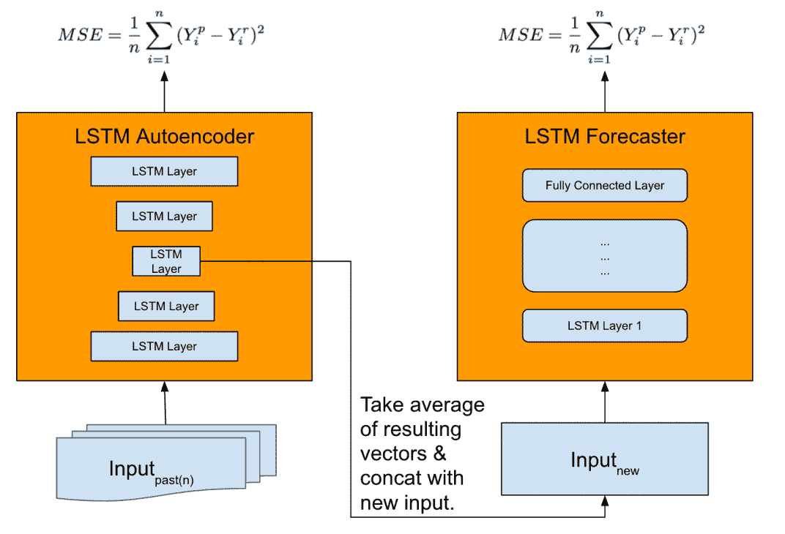
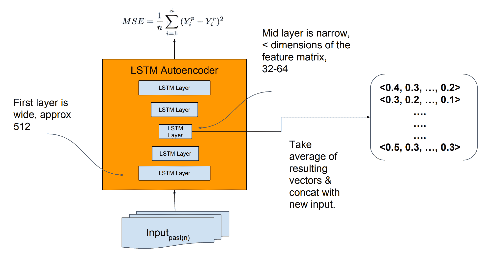

# 用于罕见事件时间序列预测的 LSTM 模型体系结构

> 原文： [https://machinelearningmastery.com/lstm-model-architecture-for-rare-event-time-series-forecasting/](https://machinelearningmastery.com/lstm-model-architecture-for-rare-event-time-series-forecasting/)

使用 LSTM 直接进行时间序列预测几乎没有成功。

这是令人惊讶的，因为已知神经网络能够学习复杂的非线性关系，并且 LSTM 可能是能够直接支持多变量序列预测问题的最成功的循环神经网络类型。

最近在 [Uber AI Labs](http://uber.ai/) 上进行的一项研究表明，LSTM 的自动特征学习功能及其处理输入序列的能力如何在端到端模型中得到利用，可用于驱动需求预测适用于公众假期等罕见事件。

在本文中，您将发现一种为时间序列预测开发可扩展的端到端 LSTM 模型的方法。

阅读这篇文章后，你会知道：

*   跨多个站点的多变量，多步骤预测的挑战，在这种情况下是城市。
*   用于时间序列预测的 LSTM 模型架构，包括单独的自动编码器和预测子模型。
*   所提出的 LSTM 架构在罕见事件中的技能需求预测以及在不相关的预测问题上重用训练模型的能力。

让我们开始吧。

## 概观

在这篇文章中，我们将通过 [Nikolay Laptev](http://roseyu.com/time-series-workshop/) 等人回顾 2017 年题为“Uber 神经网络的[时间序列极端事件预测”的论文。在 ICML 2017 时间序列研讨会上发表。](http://roseyu.com/time-series-workshop/submissions/TSW2017_paper_3.pdf)

这篇文章分为四个部分;他们是：

1.  动机
2.  数据集
3.  模型
4.  发现

## 动机

该工作的目标是为多步骤时间序列预测开发端到端预测模型，该模型可以处理多变量输入（例如，多输入时间序列）。

该模型的目的是预测优步驾驶员对乘车共享的需求，特别是预测具有挑战性日子的需求，例如假期，其中经典模型的不确定性很高。

通常，这种类型的假期需求预测属于称为极端事件预测的研究领域。

> 极端事件预测已成为估算乘车共享和其他应用的峰值电力需求，交通拥堵严重性和激增定价的热门话题。事实上，有一个称为极值理论（EVT）的统计分支直接处理这一挑战。

- [优步神经网络的时间序列极端事件预测](http://roseyu.com/time-series-workshop/submissions/TSW2017_paper_3.pdf)，2017。

描述了两种现有方法：

*   **经典预测方法**：每个时间序列开发模型时，可能根据需要拟合。
*   **两步法**：经典模型与机器学习模型结合使用。

这些现有模型的难度激发了对单个端到端模型的需求。

此外，还需要一个可以跨区域推广的模型，特别是针对每个城市收集的数据。这意味着在一些或所有城市训练的模型可用数据并用于在一些或所有城市做出预测。

我们可以将此概括为一个模型的一般需求，该模型支持多变量输入，进行多步预测，并在多个站点（在这种情况下为城市）中进行概括。

## 数据集

该模型适用于 Uber 数据集，该数据集包括美国顶级城市五年的匿名乘车共享数据。

> 在人口方面，美国各大城市完成旅行的五年历史记录用于提供美国所有主要假期的预测。

- [优步神经网络的时间序列极端事件预测](http://roseyu.com/time-series-workshop/submissions/TSW2017_paper_3.pdf)，2017。

每个预测的输入包括每个骑行的信息，以及天气，城市和假日变量。

> 为了避免缺乏数据，我们使用其他功能，包括天气信息（例如降水，风速，温度）和城市级信息（例如，当前旅行，当前用户，当地假期）。

- [优步神经网络的时间序列极端事件预测](http://roseyu.com/time-series-workshop/submissions/TSW2017_paper_3.pdf)，2017。

下面的图表提供了一年六个变量的样本。

模型
的缩放多变量输入来自“优步神经网络的时间序列极端事件预测”。

通过将历史数据拆分为输入和输出变量的滑动窗口来创建训练数据集。

本文未指定实验中使用的回顾和预测范围的具体大小。

时间序列建模的滑动窗口方法
取自“优步神经网络的时间序列极端事件预测”。

通过对每批样品的观察值进行标准化来缩放时间序列数据，并且每个输入序列被去除趋势，但是没有去季节化。

> 神经网络对未缩放的数据很敏感，因此我们将每个小批量标准化。此外，我们发现，与去调味相反，降低数据的趋势可以产生更好的结果。

- [优步神经网络的时间序列极端事件预测](http://roseyu.com/time-series-workshop/submissions/TSW2017_paper_3.pdf)，2017。

## 模型

LSTM，例如 Vanilla LSTMs 在问题上进行了评估并表现出相对较差的表现。

这并不奇怪，因为它反映了其他地方的发现。

> 我们最初的 LSTM 实施相对于最先进的方法没有表现出优越的表现。

- [优步神经网络的时间序列极端事件预测](http://roseyu.com/time-series-workshop/submissions/TSW2017_paper_3.pdf)，2017。

使用了更精细的架构，包括两个 LSTM 模型：

*   **特征提取器**：用于将输入序列提取到特征向量的模型，该特征向量可以用作做出预测的输入。
*   **Forecaster** ：使用提取的特征和其他输入做出预测的模型。

开发了 LSTM 自动编码器模型用作特征提取模型，并使用 [Stacked LSTM](https://machinelearningmastery.com/stacked-long-short-term-memory-networks/) 作为预测模型。

> 我们发现香草 LSTM 模型的表现比我们的基线差。因此，我们提出了一种新架构，它利用自动编码器进行特征提取，与基线相比实现了卓越的表现。

- [优步神经网络的时间序列极端事件预测](http://roseyu.com/time-series-workshop/submissions/TSW2017_paper_3.pdf)，2017。

在做出预测时，首先将时间序列数据提供给自动编码器，自动编码器被压缩为平均和连接的多个特征向量。然后将特征向量作为输入提供给预测模型以做出预测。

> ...该模型首先通过自动特征提取对网络进行填充，这对于在大规模特殊事件期间捕获复杂的时间序列动态至关重要。 [...]然后通过集合技术（例如，平均或其他方法）聚合特征向量。然后将最终向量与新输入连接并馈送到 LSTM 预测器做出预测。

- [优步神经网络的时间序列极端事件预测](http://roseyu.com/time-series-workshop/submissions/TSW2017_paper_3.pdf)，2017。

目前尚不清楚在做出预测时究竟是什么给自动编码器提供了什么，尽管我们可能猜测这是一个多变量时间序列，用于预测在预测时间间隔之前观察的城市。

作为自动编码器输入的多变量时间序列将导致可以连接的多个编码向量（每个系列一个）。目前尚不清楚平均在这一点上可能采取什么角色，尽管我们可能猜测它是执行自动编码过程的多个模型的平均值。

特征提取模型和预测模型概述
取自“优步神经网络的时间序列极端事件预测”。

作者评论说，可以将自动编码器作为预测模型的一部分，并对此进行评估，但单独的模型可以提高表现。

> 但是，拥有一个单独的自动编码器模块可以在我们的经验中产生更好的结果。

- [优步神经网络的时间序列极端事件预测](http://roseyu.com/time-series-workshop/submissions/TSW2017_paper_3.pdf)，2017。

在展示纸张时使用的幻灯片中提供了所开发模型的更多细节。

自动编码器的输入是 512 LSTM 单位，自动编码器中的瓶颈用于创建 32 或 64 LSTM 单位的编码特征向量。

用于特征提取的 LSTM 自动编码器的详细信息
取自“优步神经网络的时间序列极端事件预测”。

使用'_ 新输入 _'将编码的特征向量提供给预测模型，尽管未指定此新输入是什么;我们可以猜测这是一个时间序列，也许是预测区间之前的观测预测的城市的多变量时间序列。或者，从这个系列中提取的特征[论文中的博客文章暗示](https://eng.uber.com/neural-networks/)（尽管我对这篇文章和幻灯片与此相矛盾时持怀疑态度）。

该模型接受了大量数据的训练，这是堆叠 LSTM 或一般 LSTM 的一般要求。

> 所描述的生产神经网络模型在数千个时间序列上进行训练，每个时间序列具有数千个数据点。

- [优步神经网络的时间序列极端事件预测](http://roseyu.com/time-series-workshop/submissions/TSW2017_paper_3.pdf)，2017。

在进行新的预测时，不会对该模型进行再训练。

还使用引导程序实现了估算预测不确定性的有趣方法。

它分别使用自动编码器和预测模型分别估计模型不确定性和预测不确定性。输入被提供给给定模型并且使用了激活的丢失（如幻灯片中所评论的）。该过程重复 100 次，模型和预测误差项用于预测不确定性的估计。

预测不确定性估计概述
取自“优步神经网络的时间序列极端事件预测”。

这种预测不确定性的方法可能更好地描述于 2017 年论文“[优步时间序列的深度和自信预测](https://arxiv.org/abs/1709.01907)”。

## 发现

对该模型进行了评估，特别关注美国城市对美国假期的需求预测。

没有具体说明模型评估的具体情况。

新的广义 LSTM 预测模型被发现优于优步使用的现有模型，如果我们假设现有模型得到了很好的调整，这可能会令人印象深刻。

> 结果显示，与包含单变量时间序列和机器学习模型的当前专有方法相比，预测准确率提高了 2％-18％。

- [优步神经网络的时间序列极端事件预测](http://roseyu.com/time-series-workshop/submissions/TSW2017_paper_3.pdf)，2017。

然后将在 Uber 数据集上训练的模型直接应用于由[约 1,500 个月的单变量时间序列预测数据集]组成的 [M3-竞赛数据集](https://www.sciencedirect.com/science/article/pii/S0169207000000571)的子集。

这是一种转移学习，一种非常理想的目标，允许跨问题域重用深度学习模型。

令人惊讶的是，该模型表现良好，与表现最佳的方法相比并不是很好，但比许多复杂模型更好。结果表明，可能通过微调（例如在其他转移学习案例研究中完成），该模型可以重复使用并且技巧娴熟。

LSTM 模型在优步数据上的表现和对 M3 数据集的评估
取自“优步神经网络的时间序列极端事件预测”。

重要的是，作者提出，深度 LSTM 模型对时间序列预测的最有益应用可能是：

*   有大量的时间序列。
*   每个系列都有大量的观察结果。
*   时间序列之间存在很强的相关性。

> 根据我们的经验，选择时间序列的神经网络模型有三个标准：（a）时间序列的数量（b）时间序列的长度和（c）时间序列之间的相关性。如果（a），（b）和（c）高，则神经网络可能是正确的选择，否则经典的时间序列方法可能效果最好。

- [优步神经网络的时间序列极端事件预测](http://roseyu.com/time-series-workshop/submissions/TSW2017_paper_3.pdf)，2017。

通过本文介绍中使用的幻灯片很好地总结了这一点。

应用 LSTM 进行时间序列预测的经验教训
取自“优步神经网络的时间序列极端事件预测”幻灯片。

## 进一步阅读

如果您希望深入了解，本节将提供有关该主题的更多资源。

*   [优步神经网络的时间序列极端事件预测](http://roseyu.com/time-series-workshop/submissions/TSW2017_paper_3.pdf)，2017。
*   [优步工程极端事件预测与循环神经网络](https://eng.uber.com/neural-networks/)，2017 年。
*   [优步神经网络的时间序列建模](https://forecasters.org/wp-content/uploads/gravity_forms/7-c6dd08fee7f0065037affb5b74fec20a/2017/07/Laptev_Nikolay_ISF2017.pdf)，Slides，2017。
*   [时间序列极端事件预测案例研究](https://prezi.com/l16la1_bmfii/time-series-extreme-event-forecasting-case-study/)，幻灯片 2018。
*   [时间序列研讨会，ICML 2017](http://roseyu.com/time-series-workshop/)
*   [优步时间序列的深度和自信预测](https://arxiv.org/abs/1709.01907)，2017。

## 摘要

在这篇文章中，您发现了一个可扩展的端到端 LSTM 模型，用于时间序列预测。

具体来说，你学到了：

*   跨多个站点的多变量，多步骤预测的挑战，在这种情况下是城市。
*   用于时间序列预测的 LSTM 模型架构，包括单独的自动编码器和预测子模型。
*   所提出的 LSTM 架构在罕见事件中的技能需求预测以及在不相关的预测问题上重用训练模型的能力。

你有任何问题吗？
在下面的评论中提出您的问题，我会尽力回答。