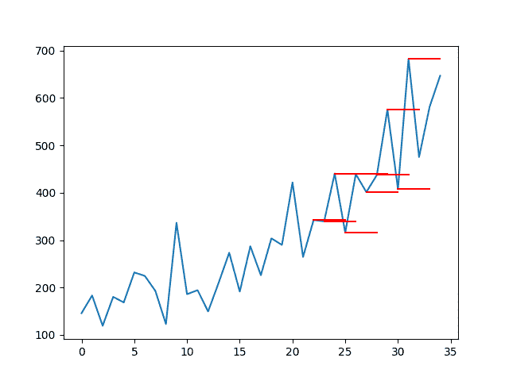

# Python 中长短期记忆网络的多步时间序列预测

> 原文： [https://machinelearningmastery.com/multi-step-time-series-forecasting-long-short-term-memory-networks-python/](https://machinelearningmastery.com/multi-step-time-series-forecasting-long-short-term-memory-networks-python/)

长期短期记忆网络或 LSTM 是一种可以学习和预测长序列的循环神经网络。

除了学习长序列之外，LSTM 的一个好处是它们可以学习进行一次性多步预测，这对于时间序列预测可能是有用的。

LSTM 的一个难点是它们配置起来很棘手，需要大量准备才能以正确的格式获取数据进行学习。

在本教程中，您将了解如何使用 Keras 在 Python 中开发用于多步骤时间序列预测的 LSTM。

完成本教程后，您将了解：

*   如何为多步时间序列预测准备数据。
*   如何开发 LSTM 模型进行多步时间序列预测。
*   如何评估多步时间序列预测。

让我们开始吧。


Python 中长期短期记忆网络的多步时间序列预测
[Tom Babich](https://www.flickr.com/photos/100308777@N07/10345460005/) 的照片，保留一些权利。

## 教程概述

本教程分为 4 个部分;他们是：

1.  洗发水销售数据集
2.  数据准备和模型评估
3.  持久性模型
4.  多步骤 LSTM

### 环境

本教程假定您已安装 Python SciPy 环境。您可以在此示例中使用 Python 2 或 3。

本教程假设您安装了 TensorFlow 或 Theano 后端的 Keras v2.0 或更高版本。

本教程还假设您安装了 scikit-learn，Pandas，NumPy 和 Matplotlib。

如果您在设置 Python 环境时需要帮助，请参阅以下帖子：

*   [如何使用 Anaconda 设置用于机器学习和深度学习的 Python 环境](http://machinelearningmastery.com/setup-python-environment-machine-learning-deep-learning-anaconda/)

接下来，让我们看看标准时间序列预测问题，我们可以将其用作此实验的上下文。

## 洗发水销售数据集

该数据集描述了 3 年期间每月洗发水的销售数量。

单位是销售计数，有 36 个观察。原始数据集归功于 Makridakis，Wheelwright 和 Hyndman（1998）。

[您可以在此处下载并了解有关数据集的更多信息](https://datamarket.com/data/set/22r0/sales-of-shampoo-over-a-three-year-period)。

下面的示例加载并创建已加载数据集的图。

```py
# load and plot dataset
from pandas import read_csv
from pandas import datetime
from matplotlib import pyplot
# load dataset
def parser(x):
	return datetime.strptime('190'+x, '%Y-%m')
series = read_csv('shampoo-sales.csv', header=0, parse_dates=[0], index_col=0, squeeze=True, date_parser=parser)
# summarize first few rows
print(series.head())
# line plot
series.plot()
pyplot.show()
```

运行该示例将数据集作为 Pandas Series 加载并打印前 5 行。

```py
Month
1901-01-01    266.0
1901-02-01    145.9
1901-03-01    183.1
1901-04-01    119.3
1901-05-01    180.3
Name: Sales, dtype: float64
```

然后创建该系列的线图，显示明显的增加趋势。


洗发水销售数据集的线图

接下来，我们将看一下实验中使用的模型配置和测试工具。

## 数据准备和模型评估

本节介绍本教程中使用的数据准备和模型评估

### 数据拆分

我们将 Shampoo Sales 数据集分为两部分：训练和测试集。

前两年的数据将用于训练数据集，剩余的一年数据将用于测试集。

将使用训练数据集开发模型，并对测试数据集做出预测。

作为参考，过去 12 个月的观察如下：

```py
"3-01",339.7
"3-02",440.4
"3-03",315.9
"3-04",439.3
"3-05",401.3
"3-06",437.4
"3-07",575.5
"3-08",407.6
"3-09",682.0
"3-10",475.3
"3-11",581.3
"3-12",646.9
```

### 多步预测

我们将设计一个多步预测。

对于数据集最后 12 个月的特定月份，我们将需要进行 3 个月的预测。

这是历史观察（t-1，t-2，... t-n）预测 t，t + 1 和 t + 2。

具体而言，从第 2 年 12​​月开始，我们必须预测 1 月，2 月和 3 月。从 1 月开始，我们必须预测 2 月，3 月和 4 月。一直到 10 月，11 月，12 月预测从 9 月到 3 年。

需要总共 10 个 3 个月的预测，如下：

```py
Dec,	Jan, Feb, Mar
Jan,	Feb, Mar, Apr
Feb,	Mar, Apr, May
Mar,	Apr, May, Jun
Apr, 	May, Jun, Jul
May,	Jun, Jul, Aug
Jun,	Jul, Aug, Sep
Jul,	Aug, Sep, Oct
Aug,	Sep, Oct, Nov
Sep,	Oct, Nov, Dec
```

### 模型评估

将使用滚动预测场景，也称为前进模型验证。

测试数据集的每个时间步骤将一次一个地走。将使用模型对时间步长做出预测，然后将从测试集中获取下个月的实际预期值，并使其可用于下一时间步的预测模型。

这模仿了一个真实世界的场景，每个月都会有新的洗发水销售观察结果，并用于下个月的预测。

这将通过训练和测试数据集的结构进行模拟。

将收集关于测试数据集的所有预测并计算错误分数以总结每个预测时间步骤的模型技能。将使用均方根误差（RMSE），因为它会对大错误进行处罚，并产生与预测数据相同的分数，即每月洗发水销售额。

## 持久性模型

时间序列预测的良好基线是持久性模型。

这是一个预测模型，其中最后一个观察结果是持续的。由于它的简单性，它通常被称为朴素的预测。

您可以在帖子中了解有关时间序列预测的持久性模型的更多信息：

*   [如何使用 Python 进行时间序列预测的基线预测](http://machinelearningmastery.com/persistence-time-series-forecasting-with-python/)

### 准备数据

第一步是将数据从一系列转换为监督学习问题。

这是从数字列表到输入和输出模式列表。我们可以使用一个名为`series_to_supervised()`的预先准备的函数来实现这一点。

有关此功能的更多信息，请参阅帖子：

*   [如何将时间序列转换为 Python 中的监督学习问题](http://machinelearningmastery.com/convert-time-series-supervised-learning-problem-python)

该功能如下所列。

```py
# convert time series into supervised learning problem
def series_to_supervised(data, n_in=1, n_out=1, dropnan=True):
	n_vars = 1 if type(data) is list else data.shape[1]
	df = DataFrame(data)
	cols, names = list(), list()
	# input sequence (t-n, ... t-1)
	for i in range(n_in, 0, -1):
		cols.append(df.shift(i))
		names += [('var%d(t-%d)' % (j+1, i)) for j in range(n_vars)]
	# forecast sequence (t, t+1, ... t+n)
	for i in range(0, n_out):
		cols.append(df.shift(-i))
		if i == 0:
			names += [('var%d(t)' % (j+1)) for j in range(n_vars)]
		else:
			names += [('var%d(t+%d)' % (j+1, i)) for j in range(n_vars)]
	# put it all together
	agg = concat(cols, axis=1)
	agg.columns = names
	# drop rows with NaN values
	if dropnan:
		agg.dropna(inplace=True)
	return agg
```

可以通过将加载的系列值传入`n_in`值 1 和 n_out 值 3 来调用该函数;例如：

```py
supervised = series_to_supervised(raw_values, 1, 3)
```

接下来，我们可以将监督学习数据集分成训练和测试集。

我们知道，在这种形式中，最后 10 行包含最后一年的数据。这些行包含测试集，其余数据构成训练数据集。

我们可以将所有这些放在一个新函数中，该函数接受加载的系列和一些参数，并返回准备建模的训练和测试集。

```py
# transform series into train and test sets for supervised learning
def prepare_data(series, n_test, n_lag, n_seq):
	# extract raw values
	raw_values = series.values
	raw_values = raw_values.reshape(len(raw_values), 1)
	# transform into supervised learning problem X, y
	supervised = series_to_supervised(raw_values, n_lag, n_seq)
	supervised_values = supervised.values
	# split into train and test sets
	train, test = supervised_values[0:-n_test], supervised_values[-n_test:]
	return train, test
```

我们可以使用 Shampoo 数据集对此进行测试。下面列出了完整的示例。

```py
from pandas import DataFrame
from pandas import concat
from pandas import read_csv
from pandas import datetime

# date-time parsing function for loading the dataset
def parser(x):
	return datetime.strptime('190'+x, '%Y-%m')

# convert time series into supervised learning problem
def series_to_supervised(data, n_in=1, n_out=1, dropnan=True):
	n_vars = 1 if type(data) is list else data.shape[1]
	df = DataFrame(data)
	cols, names = list(), list()
	# input sequence (t-n, ... t-1)
	for i in range(n_in, 0, -1):
		cols.append(df.shift(i))
		names += [('var%d(t-%d)' % (j+1, i)) for j in range(n_vars)]
	# forecast sequence (t, t+1, ... t+n)
	for i in range(0, n_out):
		cols.append(df.shift(-i))
		if i == 0:
			names += [('var%d(t)' % (j+1)) for j in range(n_vars)]
		else:
			names += [('var%d(t+%d)' % (j+1, i)) for j in range(n_vars)]
	# put it all together
	agg = concat(cols, axis=1)
	agg.columns = names
	# drop rows with NaN values
	if dropnan:
		agg.dropna(inplace=True)
	return agg

# transform series into train and test sets for supervised learning
def prepare_data(series, n_test, n_lag, n_seq):
	# extract raw values
	raw_values = series.values
	raw_values = raw_values.reshape(len(raw_values), 1)
	# transform into supervised learning problem X, y
	supervised = series_to_supervised(raw_values, n_lag, n_seq)
	supervised_values = supervised.values
	# split into train and test sets
	train, test = supervised_values[0:-n_test], supervised_values[-n_test:]
	return train, test

# load dataset
series = read_csv('shampoo-sales.csv', header=0, parse_dates=[0], index_col=0, squeeze=True, date_parser=parser)
# configure
n_lag = 1
n_seq = 3
n_test = 10
# prepare data
train, test = prepare_data(series, n_test, n_lag, n_seq)
print(test)
print('Train: %s, Test: %s' % (train.shape, test.shape))
```

首先运行该示例将打印整个测试数据集，即最后 10 行。还打印了训练测试数据集的形状和大小。

```py
[[ 342.3  339.7  440.4  315.9]
 [ 339.7  440.4  315.9  439.3]
 [ 440.4  315.9  439.3  401.3]
 [ 315.9  439.3  401.3  437.4]
 [ 439.3  401.3  437.4  575.5]
 [ 401.3  437.4  575.5  407.6]
 [ 437.4  575.5  407.6  682\. ]
 [ 575.5  407.6  682\.   475.3]
 [ 407.6  682\.   475.3  581.3]
 [ 682\.   475.3  581.3  646.9]]
Train: (23, 4), Test: (10, 4)
```

我们可以看到测试数据集第一行的单个输入值（第一列）与第二年 12 月的洗发水销售中的观察结果相符：

```py
"2-12",342.3
```

我们还可以看到每行包含 4 列用于 1 个输入，3 个输出值用于每个观察。

### 做出预测

下一步是进行持久性预测。

我们可以在名为`persistence()`的函数中轻松实现持久性预测，该函数将最后一次观察和预测步骤的数量保持不变。此函数返回包含预测的数组。

```py
# make a persistence forecast
def persistence(last_ob, n_seq):
	return [last_ob for i in range(n_seq)]
```

然后，我们可以在测试数据集中的每个时间步骤调用此函数，从第 2 年的 12 月到第 3 年的 9 月。

下面是一个函数 _make_forecasts（）_，它执行此操作并将数据集的训练，测试和配置作为参数，并返回预测列表。

```py
# evaluate the persistence model
def make_forecasts(train, test, n_lag, n_seq):
	forecasts = list()
	for i in range(len(test)):
		X, y = test[i, 0:n_lag], test[i, n_lag:]
		# make forecast
		forecast = persistence(X[-1], n_seq)
		# store the forecast
		forecasts.append(forecast)
	return forecasts
```

我们可以调用这个函数如下：

```py
forecasts = make_forecasts(train, test, 1, 3)
```

### 评估预测

最后一步是评估预测。

我们可以通过计算多步预测的每个时间步长的 RMSE 来做到这一点，在这种情况下给出 3 个 RMSE 分数。下面的函数`evaluate_forecasts()`计算并打印每个预测时间步的 RMSE。

```py
# evaluate the RMSE for each forecast time step
def evaluate_forecasts(test, forecasts, n_lag, n_seq):
	for i in range(n_seq):
		actual = test[:,(n_lag+i)]
		predicted = [forecast[i] for forecast in forecasts]
		rmse = sqrt(mean_squared_error(actual, predicted))
		print('t+%d RMSE: %f' % ((i+1), rmse))
```

我们可以这样称呼它：

```py
evaluate_forecasts(test, forecasts, 1, 3)
```

在原始数据集的上下文中绘制预测图也有助于了解 RMSE 分数如何与上下文中的问题相关联。

我们可以首先绘制整个 Shampoo 数据集，然后将每个预测绘制为红线。下面的函数`plot_forecasts()`将创建并显示此图。

```py
# plot the forecasts in the context of the original dataset
def plot_forecasts(series, forecasts, n_test):
	# plot the entire dataset in blue
	pyplot.plot(series.values)
	# plot the forecasts in red
	for i in range(len(forecasts)):
		off_s = len(series) - n_test + i
		off_e = off_s + len(forecasts[i])
		xaxis = [x for x in range(off_s, off_e)]
		pyplot.plot(xaxis, forecasts[i], color='red')
	# show the plot
	pyplot.show()
```

我们可以按如下方式调用该函数。请注意，12 个月内在测试集上保留的观察数为 12，而上述使用的 10 个监督学习输入/输出模式则为 10。

```py
# plot forecasts
plot_forecasts(series, forecasts, 12)
```

我们可以通过将持久预测与原始数据集中的实际持久值相关联来使绘图更好。

这将需要将最后观察到的值添加到预测的前面。以下是具有此改进的`plot_forecasts()`功能的更新版本。

```py
# plot the forecasts in the context of the original dataset
def plot_forecasts(series, forecasts, n_test):
	# plot the entire dataset in blue
	pyplot.plot(series.values)
	# plot the forecasts in red
	for i in range(len(forecasts)):
		off_s = len(series) - 12 + i - 1
		off_e = off_s + len(forecasts[i]) + 1
		xaxis = [x for x in range(off_s, off_e)]
		yaxis = [series.values[off_s]] + forecasts[i]
		pyplot.plot(xaxis, yaxis, color='red')
	# show the plot
	pyplot.show()
```

### 完整的例子

我们可以将所有这些部分组合在一起。

下面列出了多步持久性预测的完整代码示例。

```py
from pandas import DataFrame
from pandas import concat
from pandas import read_csv
from pandas import datetime
from sklearn.metrics import mean_squared_error
from math import sqrt
from matplotlib import pyplot

# date-time parsing function for loading the dataset
def parser(x):
	return datetime.strptime('190'+x, '%Y-%m')

# convert time series into supervised learning problem
def series_to_supervised(data, n_in=1, n_out=1, dropnan=True):
	n_vars = 1 if type(data) is list else data.shape[1]
	df = DataFrame(data)
	cols, names = list(), list()
	# input sequence (t-n, ... t-1)
	for i in range(n_in, 0, -1):
		cols.append(df.shift(i))
		names += [('var%d(t-%d)' % (j+1, i)) for j in range(n_vars)]
	# forecast sequence (t, t+1, ... t+n)
	for i in range(0, n_out):
		cols.append(df.shift(-i))
		if i == 0:
			names += [('var%d(t)' % (j+1)) for j in range(n_vars)]
		else:
			names += [('var%d(t+%d)' % (j+1, i)) for j in range(n_vars)]
	# put it all together
	agg = concat(cols, axis=1)
	agg.columns = names
	# drop rows with NaN values
	if dropnan:
		agg.dropna(inplace=True)
	return agg

# transform series into train and test sets for supervised learning
def prepare_data(series, n_test, n_lag, n_seq):
	# extract raw values
	raw_values = series.values
	raw_values = raw_values.reshape(len(raw_values), 1)
	# transform into supervised learning problem X, y
	supervised = series_to_supervised(raw_values, n_lag, n_seq)
	supervised_values = supervised.values
	# split into train and test sets
	train, test = supervised_values[0:-n_test], supervised_values[-n_test:]
	return train, test

# make a persistence forecast
def persistence(last_ob, n_seq):
	return [last_ob for i in range(n_seq)]

# evaluate the persistence model
def make_forecasts(train, test, n_lag, n_seq):
	forecasts = list()
	for i in range(len(test)):
		X, y = test[i, 0:n_lag], test[i, n_lag:]
		# make forecast
		forecast = persistence(X[-1], n_seq)
		# store the forecast
		forecasts.append(forecast)
	return forecasts

# evaluate the RMSE for each forecast time step
def evaluate_forecasts(test, forecasts, n_lag, n_seq):
	for i in range(n_seq):
		actual = test[:,(n_lag+i)]
		predicted = [forecast[i] for forecast in forecasts]
		rmse = sqrt(mean_squared_error(actual, predicted))
		print('t+%d RMSE: %f' % ((i+1), rmse))

# plot the forecasts in the context of the original dataset
def plot_forecasts(series, forecasts, n_test):
	# plot the entire dataset in blue
	pyplot.plot(series.values)
	# plot the forecasts in red
	for i in range(len(forecasts)):
		off_s = len(series) - n_test + i - 1
		off_e = off_s + len(forecasts[i]) + 1
		xaxis = [x for x in range(off_s, off_e)]
		yaxis = [series.values[off_s]] + forecasts[i]
		pyplot.plot(xaxis, yaxis, color='red')
	# show the plot
	pyplot.show()

# load dataset
series = read_csv('shampoo-sales.csv', header=0, parse_dates=[0], index_col=0, squeeze=True, date_parser=parser)
# configure
n_lag = 1
n_seq = 3
n_test = 10
# prepare data
train, test = prepare_data(series, n_test, n_lag, n_seq)
# make forecasts
forecasts = make_forecasts(train, test, n_lag, n_seq)
# evaluate forecasts
evaluate_forecasts(test, forecasts, n_lag, n_seq)
# plot forecasts
plot_forecasts(series, forecasts, n_test+2)
```

首先运行该示例为每个预测的时间步骤打印 RMSE。

这为我们提供了每个时间步的表现基线，我们希望 LSTM 能够表现出色。

```py
t+1 RMSE: 144.535304
t+2 RMSE: 86.479905
t+3 RMSE: 121.149168
```

还创建了原始时间序列与多步持久性预测的关系图。这些行连接到每个预测的相应输入值。

此上下文显示了持久性预测实际上是多么幼稚。



具有多步持续性预测的洗发水销售数据集线图

## 多步 LSTM 网络

在本节中，我们将使用持久性示例作为起点，并查看将 LSTM 拟合到训练数据所需的更改，并对测试数据集进行多步预测。

### 准备数据

在我们使用它来训练 LSTM 之前，必须准备好数据。

具体而言，还需要进行两项更改：

1.  **固定**。数据显示必须通过差分消除的增加趋势。
2.  **比例**。必须将数据的比例缩小到-1 到 1 之间的值，即 LSTM 单元的激活功能。

我们可以引入一个函数使数据静止称为 _difference（）_。这会将一系列值转换为一系列差异，这是一种更简单的表示方式。

```py
# create a differenced series
def difference(dataset, interval=1):
	diff = list()
	for i in range(interval, len(dataset)):
		value = dataset[i] - dataset[i - interval]
		diff.append(value)
	return Series(diff)
```

我们可以使用 sklearn 库中的`MinMaxScaler`来缩放数据。

将这些放在一起，我们可以更新`prepare_data()`函数以首先区分数据并重新调整它，然后执行转换为监督学习问题并训练测试集，就像我们之前使用持久性示例一样。

除了训练和测试数据集之外，该函数现在返回一个缩放器。

```py
# transform series into train and test sets for supervised learning
def prepare_data(series, n_test, n_lag, n_seq):
	# extract raw values
	raw_values = series.values
	# transform data to be stationary
	diff_series = difference(raw_values, 1)
	diff_values = diff_series.values
	diff_values = diff_values.reshape(len(diff_values), 1)
	# rescale values to -1, 1
	scaler = MinMaxScaler(feature_range=(-1, 1))
	scaled_values = scaler.fit_transform(diff_values)
	scaled_values = scaled_values.reshape(len(scaled_values), 1)
	# transform into supervised learning problem X, y
	supervised = series_to_supervised(scaled_values, n_lag, n_seq)
	supervised_values = supervised.values
	# split into train and test sets
	train, test = supervised_values[0:-n_test], supervised_values[-n_test:]
	return scaler, train, test
```

我们可以调用这个函数如下：

```py
# prepare data
scaler, train, test = prepare_data(series, n_test, n_lag, n_seq)
```

### 适合 LSTM 网络

接下来，我们需要将 LSTM 网络模型与训练数据相匹配。

这首先要求将训练数据集从 2D 阵列[_ 样本，特征 _]转换为 3D 阵列[_ 样本，时间步长，特征 _]。我们将时间步长固定为 1，因此这种变化很简单。

接下来，我们需要设计一个 LSTM 网络。我们将使用一个简单的结构，其中 1 个隐藏层具有 1 个 LSTM 单元，然后是具有线性激活和 3 个输出值的输出层。网络将使用均方误差丢失函数和有效的 ADAM 优化算法。

LSTM 是有状态的;这意味着我们必须在每个训练时代结束时手动重置网络状态。该网络将适合 1500 个时代。

必须使用相同的批量大小进行训练和预测，并且我们需要在测试数据集的每个时间步做出预测。这意味着必须使用批量大小为 1。批量大小为 1 也称为在线学习，因为在每个训练模式之后的训练期间将更新网络权重（与小批量或批量更新相反）。

我们可以将所有这些放在一个名为`fit_lstm()`的函数中。该函数采用了许多可用于稍后调整网络的关键参数，并且该函数返回适合 LSTM 模型以备预测。

```py
# fit an LSTM network to training data
def fit_lstm(train, n_lag, n_seq, n_batch, nb_epoch, n_neurons):
	# reshape training into [samples, timesteps, features]
	X, y = train[:, 0:n_lag], train[:, n_lag:]
	X = X.reshape(X.shape[0], 1, X.shape[1])
	# design network
	model = Sequential()
	model.add(LSTM(n_neurons, batch_input_shape=(n_batch, X.shape[1], X.shape[2]), stateful=True))
	model.add(Dense(y.shape[1]))
	model.compile(loss='mean_squared_error', optimizer='adam')
	# fit network
	for i in range(nb_epoch):
		model.fit(X, y, epochs=1, batch_size=n_batch, verbose=0, shuffle=False)
		model.reset_states()
	return model
```

该函数可以调用如下：

```py
# fit model
model = fit_lstm(train, 1, 3, 1, 1500, 1)
```

网络配置没有调整;如果你愿意，尝试不同的参数。

在下面的评论中报告您的发现。我很想看看你能得到什么。

### 进行 LSTM 预测

下一步是使用适合的 LSTM 网络做出预测。

通过调用 _model.predict（）_，可以使用拟合 LSTM 网络进行单个预测。同样，必须将数据格式化为具有[_ 样本，时间步长，特征 _]格式的 3D 阵列。

我们可以将它包装成一个名为`forecast_lstm()`的函数。

```py
# make one forecast with an LSTM,
def forecast_lstm(model, X, n_batch):
	# reshape input pattern to [samples, timesteps, features]
	X = X.reshape(1, 1, len(X))
	# make forecast
	forecast = model.predict(X, batch_size=n_batch)
	# convert to array
	return [x for x in forecast[0, :]]
```

我们可以从`make_forecasts()`函数调用此函数并更新它以接受模型作为参数。更新版本如下所示。

```py
# evaluate the persistence model
def make_forecasts(model, n_batch, train, test, n_lag, n_seq):
	forecasts = list()
	for i in range(len(test)):
		X, y = test[i, 0:n_lag], test[i, n_lag:]
		# make forecast
		forecast = forecast_lstm(model, X, n_batch)
		# store the forecast
		forecasts.append(forecast)
	return forecasts
```

可以按如下方式调用`make_forecasts()`函数的更新版本：

```py
# make forecasts
forecasts = make_forecasts(model, 1, train, test, 1, 3)
```

### 反转变换

在做出预测之后，我们需要反转变换以将值返回到原始比例。

这是必要的，以便我们可以计算与其他模型相当的错误分数和图，例如上面的持久性预测。

我们可以使用提供`inverse_transform()`函数的`MinMaxScaler`对象直接反转预测的比例。

我们可以通过将最后一个观察值（前几个月的洗发水销售额）添加到第一个预测值来反转差异，然后将值传播到预测值之下。

这有点儿繁琐;我们可以在函数名`inverse_difference()`中包含行为，它将预测之前的最后观察值和预测作为参数，并返回反向预测。

```py
# invert differenced forecast
def inverse_difference(last_ob, forecast):
	# invert first forecast
	inverted = list()
	inverted.append(forecast[0] + last_ob)
	# propagate difference forecast using inverted first value
	for i in range(1, len(forecast)):
		inverted.append(forecast[i] + inverted[i-1])
	return inverted
```

将它们放在一起，我们可以创建一个`inverse_transform()`函数，该函数可以处理每个预测，首先反转比例，然后反转差异，将预测恢复到原始比例。

```py
# inverse data transform on forecasts
def inverse_transform(series, forecasts, scaler, n_test):
	inverted = list()
	for i in range(len(forecasts)):
		# create array from forecast
		forecast = array(forecasts[i])
		forecast = forecast.reshape(1, len(forecast))
		# invert scaling
		inv_scale = scaler.inverse_transform(forecast)
		inv_scale = inv_scale[0, :]
		# invert differencing
		index = len(series) - n_test + i - 1
		last_ob = series.values[index]
		inv_diff = inverse_difference(last_ob, inv_scale)
		# store
		inverted.append(inv_diff)
	return inverted
```

我们可以使用以下预测来调用此函数：

```py
# inverse transform forecasts and test
forecasts = inverse_transform(series, forecasts, scaler, n_test+2)
```

我们还可以反转输出部分测试数据集上的变换，以便我们可以正确计算 RMSE 分数，如下所示：

```py
actual = [row[n_lag:] for row in test]
actual = inverse_transform(series, actual, scaler, n_test+2)
```

我们还可以简化 RMSE 分数的计算，以期望测试数据仅包含输出值，如下所示：

```py
def evaluate_forecasts(test, forecasts, n_lag, n_seq):
	for i in range(n_seq):
		actual = [row[i] for row in test]
		predicted = [forecast[i] for forecast in forecasts]
		rmse = sqrt(mean_squared_error(actual, predicted))
		print('t+%d RMSE: %f' % ((i+1), rmse))
```

### 完整的例子

我们可以将所有这些部分组合在一起，使 LSTM 网络适应多步骤时间序列预测问题。

完整的代码清单如下。

```py
from pandas import DataFrame
from pandas import Series
from pandas import concat
from pandas import read_csv
from pandas import datetime
from sklearn.metrics import mean_squared_error
from sklearn.preprocessing import MinMaxScaler
from keras.models import Sequential
from keras.layers import Dense
from keras.layers import LSTM
from math import sqrt
from matplotlib import pyplot
from numpy import array

# date-time parsing function for loading the dataset
def parser(x):
	return datetime.strptime('190'+x, '%Y-%m')

# convert time series into supervised learning problem
def series_to_supervised(data, n_in=1, n_out=1, dropnan=True):
	n_vars = 1 if type(data) is list else data.shape[1]
	df = DataFrame(data)
	cols, names = list(), list()
	# input sequence (t-n, ... t-1)
	for i in range(n_in, 0, -1):
		cols.append(df.shift(i))
		names += [('var%d(t-%d)' % (j+1, i)) for j in range(n_vars)]
	# forecast sequence (t, t+1, ... t+n)
	for i in range(0, n_out):
		cols.append(df.shift(-i))
		if i == 0:
			names += [('var%d(t)' % (j+1)) for j in range(n_vars)]
		else:
			names += [('var%d(t+%d)' % (j+1, i)) for j in range(n_vars)]
	# put it all together
	agg = concat(cols, axis=1)
	agg.columns = names
	# drop rows with NaN values
	if dropnan:
		agg.dropna(inplace=True)
	return agg

# create a differenced series
def difference(dataset, interval=1):
	diff = list()
	for i in range(interval, len(dataset)):
		value = dataset[i] - dataset[i - interval]
		diff.append(value)
	return Series(diff)

# transform series into train and test sets for supervised learning
def prepare_data(series, n_test, n_lag, n_seq):
	# extract raw values
	raw_values = series.values
	# transform data to be stationary
	diff_series = difference(raw_values, 1)
	diff_values = diff_series.values
	diff_values = diff_values.reshape(len(diff_values), 1)
	# rescale values to -1, 1
	scaler = MinMaxScaler(feature_range=(-1, 1))
	scaled_values = scaler.fit_transform(diff_values)
	scaled_values = scaled_values.reshape(len(scaled_values), 1)
	# transform into supervised learning problem X, y
	supervised = series_to_supervised(scaled_values, n_lag, n_seq)
	supervised_values = supervised.values
	# split into train and test sets
	train, test = supervised_values[0:-n_test], supervised_values[-n_test:]
	return scaler, train, test

# fit an LSTM network to training data
def fit_lstm(train, n_lag, n_seq, n_batch, nb_epoch, n_neurons):
	# reshape training into [samples, timesteps, features]
	X, y = train[:, 0:n_lag], train[:, n_lag:]
	X = X.reshape(X.shape[0], 1, X.shape[1])
	# design network
	model = Sequential()
	model.add(LSTM(n_neurons, batch_input_shape=(n_batch, X.shape[1], X.shape[2]), stateful=True))
	model.add(Dense(y.shape[1]))
	model.compile(loss='mean_squared_error', optimizer='adam')
	# fit network
	for i in range(nb_epoch):
		model.fit(X, y, epochs=1, batch_size=n_batch, verbose=0, shuffle=False)
		model.reset_states()
	return model

# make one forecast with an LSTM,
def forecast_lstm(model, X, n_batch):
	# reshape input pattern to [samples, timesteps, features]
	X = X.reshape(1, 1, len(X))
	# make forecast
	forecast = model.predict(X, batch_size=n_batch)
	# convert to array
	return [x for x in forecast[0, :]]

# evaluate the persistence model
def make_forecasts(model, n_batch, train, test, n_lag, n_seq):
	forecasts = list()
	for i in range(len(test)):
		X, y = test[i, 0:n_lag], test[i, n_lag:]
		# make forecast
		forecast = forecast_lstm(model, X, n_batch)
		# store the forecast
		forecasts.append(forecast)
	return forecasts

# invert differenced forecast
def inverse_difference(last_ob, forecast):
	# invert first forecast
	inverted = list()
	inverted.append(forecast[0] + last_ob)
	# propagate difference forecast using inverted first value
	for i in range(1, len(forecast)):
		inverted.append(forecast[i] + inverted[i-1])
	return inverted

# inverse data transform on forecasts
def inverse_transform(series, forecasts, scaler, n_test):
	inverted = list()
	for i in range(len(forecasts)):
		# create array from forecast
		forecast = array(forecasts[i])
		forecast = forecast.reshape(1, len(forecast))
		# invert scaling
		inv_scale = scaler.inverse_transform(forecast)
		inv_scale = inv_scale[0, :]
		# invert differencing
		index = len(series) - n_test + i - 1
		last_ob = series.values[index]
		inv_diff = inverse_difference(last_ob, inv_scale)
		# store
		inverted.append(inv_diff)
	return inverted

# evaluate the RMSE for each forecast time step
def evaluate_forecasts(test, forecasts, n_lag, n_seq):
	for i in range(n_seq):
		actual = [row[i] for row in test]
		predicted = [forecast[i] for forecast in forecasts]
		rmse = sqrt(mean_squared_error(actual, predicted))
		print('t+%d RMSE: %f' % ((i+1), rmse))

# plot the forecasts in the context of the original dataset
def plot_forecasts(series, forecasts, n_test):
	# plot the entire dataset in blue
	pyplot.plot(series.values)
	# plot the forecasts in red
	for i in range(len(forecasts)):
		off_s = len(series) - n_test + i - 1
		off_e = off_s + len(forecasts[i]) + 1
		xaxis = [x for x in range(off_s, off_e)]
		yaxis = [series.values[off_s]] + forecasts[i]
		pyplot.plot(xaxis, yaxis, color='red')
	# show the plot
	pyplot.show()

# load dataset
series = read_csv('shampoo-sales.csv', header=0, parse_dates=[0], index_col=0, squeeze=True, date_parser=parser)
# configure
n_lag = 1
n_seq = 3
n_test = 10
n_epochs = 1500
n_batch = 1
n_neurons = 1
# prepare data
scaler, train, test = prepare_data(series, n_test, n_lag, n_seq)
# fit model
model = fit_lstm(train, n_lag, n_seq, n_batch, n_epochs, n_neurons)
# make forecasts
forecasts = make_forecasts(model, n_batch, train, test, n_lag, n_seq)
# inverse transform forecasts and test
forecasts = inverse_transform(series, forecasts, scaler, n_test+2)
actual = [row[n_lag:] for row in test]
actual = inverse_transform(series, actual, scaler, n_test+2)
# evaluate forecasts
evaluate_forecasts(actual, forecasts, n_lag, n_seq)
# plot forecasts
plot_forecasts(series, forecasts, n_test+2)
```

首先运行该示例为每个预测的时间步骤打印 RMSE。

我们可以看到，每个预测时间步长的分数比持久性预测更好，在某些情况下要好得多。

这表明配置的 LSTM 确实掌握了问题的技巧。

值得注意的是，RMSE 并没有像预期的那样随着预测范围的长度而变得越来越差。这是因为 t + 2 似乎比 t + 1 更容易预测。这可能是因为向下滴答比系列中记录的向上滴答更容易预测（这可以通过对结果进行更深入的分析来确认）。

```py
t+1 RMSE: 95.973221
t+2 RMSE: 78.872348
t+3 RMSE: 105.613951
```

还创建了系列（蓝色）和预测（红色）的线图。

该图显示，尽管模型的技能更好，但有些预测并不是很好，而且还有很大的改进空间。


洗发水销售数据集的线图与多步骤 LSTM 预测

## 扩展

如果您希望超越本教程，可以考虑一些扩展。

*   **更新 LSTM** 。更改示例以在新数据可用时重新安装或更新 LSTM。一个 10 秒的训练时期应该足以重新训练一个新的观察。
*   **调整 LSTM** 。网格搜索教程中使用的一些 LSTM 参数，例如时期数，神经元数和层数，以查看是否可以进一步提升表现。
*   **Seq2Seq** 。使用 LSTM 的编解码器范例来预测每个序列，看看它是否提供任何好处。
*   **时间范围**。尝试预测不同的时间范围，并了解网络的行为在不同的交付周期中如何变化。

你尝试过这些扩展吗？
在评论中分享您的结果;我很想听听它。

## 摘要

在本教程中，您了解了如何为多步时间序列预测开发 LSTM 网络。

具体来说，你学到了：

*   如何开发多步时间序列预测的持久性模型。
*   如何开发 LSTM 网络进行多步时间序列预测。
*   如何评估和绘制多步时间序列预测的结果。

您对 LSTM 的多步骤时间序列预测有任何疑问吗？
在下面的评论中提出您的问题，我会尽力回答。