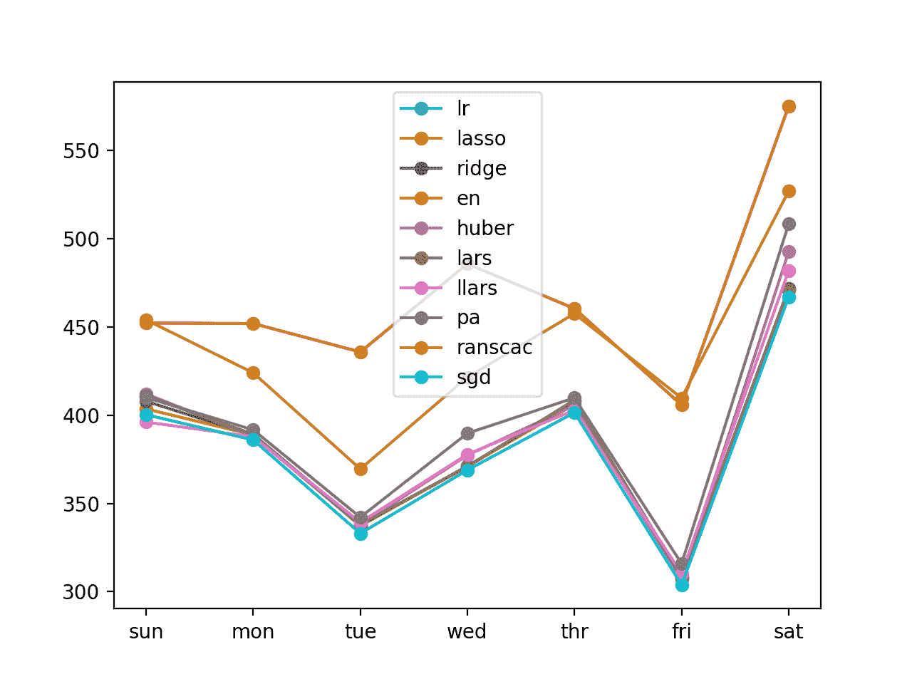
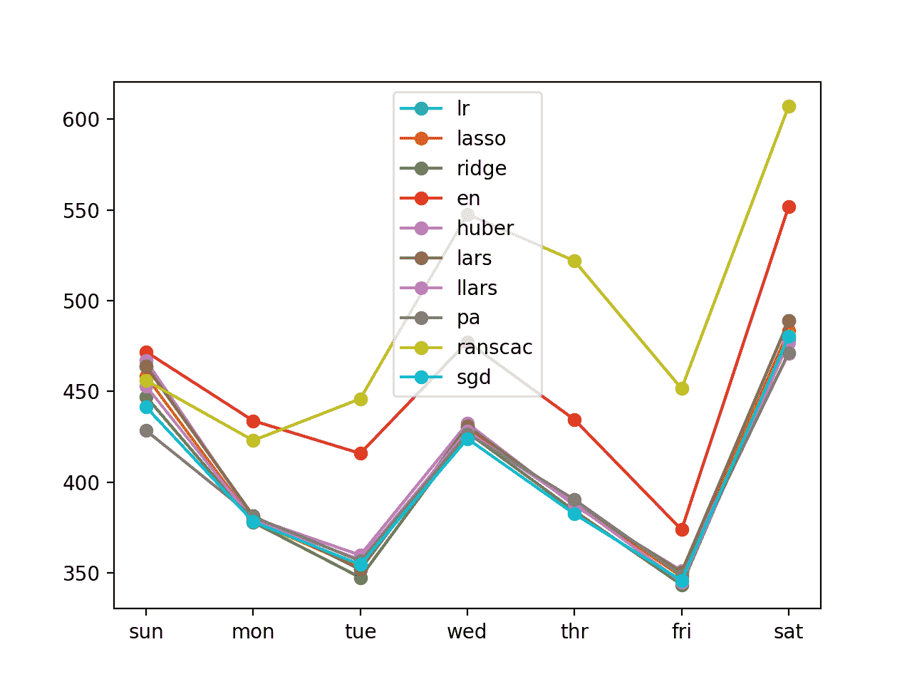

# 家庭用电机器学习的多步时间序列预测

> 原文： [https://machinelearningmastery.com/multi-step-time-series-forecasting-with-machine-learning-models-for-household-electricity-consumption/](https://machinelearningmastery.com/multi-step-time-series-forecasting-with-machine-learning-models-for-household-electricity-consumption/)

鉴于智能电表的兴起以及太阳能电池板等发电技术的广泛采用，可提供大量的用电数据。

该数据代表了多变量时间序列的功率相关变量，而这些变量又可用于建模甚至预测未来的电力消耗。

机器学习算法预测单个值，不能直接用于多步预测。可以使用机器学习算法进行多步预测的两种策略是递归和直接方法。

在本教程中，您将了解如何使用机器学习算法开发递归和直接多步预测模型。

完成本教程后，您将了解：

*   如何开发一个评估线性，非线性和集成机器学习算法的框架，用于多步时间序列预测。
*   如何使用递归多步时间序列预测策略评估机器学习算法。
*   如何使用直接的每日和每个引导时间多步时间序列预测策略来评估机器学习算法。

让我们开始吧。


用于家庭用电的机器学习模型的多步骤时间序列预测
照片由 [Sean McMenemy](https://www.flickr.com/photos/seanfx/9827244314/) ，保留一些权利。

## 教程概述

本教程分为五个部分;他们是：

1.  问题描述
2.  加载并准备数据集
3.  模型评估
4.  递归多步预测
5.  直接多步预测

## 问题描述

'[家庭用电量](https://archive.ics.uci.edu/ml/datasets/individual+household+electric+power+consumption)'数据集是一个多变量时间序列数据集，描述了四年内单个家庭的用电量。

该数据是在 2006 年 12 月至 2010 年 11 月之间收集的，并且每分钟收集家庭内的能耗观察结果。

它是一个多变量系列，由七个变量组成（除日期和时间外）;他们是：

*   **global_active_power** ：家庭消耗的总有功功率（千瓦）。
*   **global_reactive_power** ：家庭消耗的总无功功率（千瓦）。
*   **电压**：平均电压（伏特）。
*   **global_intensity** ：平均电流强度（安培）。
*   **sub_metering_1** ：厨房的有功电能（瓦特小时的有功电能）。
*   **sub_metering_2** ：用于洗衣的有功能量（瓦特小时的有功电能）。
*   **sub_metering_3** ：气候控制系统的有功电能（瓦特小时的有功电能）。

有功和无功电能参考[交流电](https://en.wikipedia.org/wiki/AC_power)的技术细节。

可以通过从总活动能量中减去三个定义的子计量变量的总和来创建第四个子计量变量，如下所示：

```py
sub_metering_remainder = (global_active_power * 1000 / 60) - (sub_metering_1 + sub_metering_2 + sub_metering_3)
```

## 加载并准备数据集

数据集可以从 UCI 机器学习库下载为单个 20 兆字节的.zip 文件：

*   [household_power_consumption.zip](https://archive.ics.uci.edu/ml/machine-learning-databases/00235/household_power_consumption.zip)

下载数据集并将其解压缩到当前工作目录中。您现在将拥有大约 127 兆字节的文件“ _household_power_consumption.txt_ ”并包含所有观察结果。

我们可以使用 _read_csv（）_ 函数来加载数据，并将前两列合并到一个日期时间列中，我们可以将其用作索引。

```py
# load all data
dataset = read_csv('household_power_consumption.txt', sep=';', header=0, low_memory=False, infer_datetime_format=True, parse_dates={'datetime':[0,1]}, index_col=['datetime'])
```

接下来，我们可以用'_ 标记所有[缺失值](https://machinelearningmastery.com/handle-missing-timesteps-sequence-prediction-problems-python/)？_ '具有 _NaN_ 值的字符，这是一个浮点数。

这将允许我们将数据作为一个浮点值数组而不是混合类型（效率较低）。

```py
# mark all missing values
dataset.replace('?', nan, inplace=True)
# make dataset numeric
dataset = dataset.astype('float32')
```

我们还需要填写缺失值，因为它们已被标记。

一种非常简单的方法是从前一天的同一时间复制观察。我们可以在一个名为 _fill_missing（）_ 的函数中实现它，该函数将从 24 小时前获取数据的 NumPy 数组并复制值。

```py
# fill missing values with a value at the same time one day ago
def fill_missing(values):
	one_day = 60 * 24
	for row in range(values.shape[0]):
		for col in range(values.shape[1]):
			if isnan(values[row, col]):
				values[row, col] = values[row - one_day, col]
```

我们可以将此函数直接应用于 DataFrame 中的数据。

```py
# fill missing
fill_missing(dataset.values)
```

现在，我们可以使用上一节中的计算创建一个包含剩余子计量的新列。

```py
# add a column for for the remainder of sub metering
values = dataset.values
dataset['sub_metering_4'] = (values[:,0] * 1000 / 60) - (values[:,4] + values[:,5] + values[:,6])
```

我们现在可以将清理后的数据集版本保存到新文件中;在这种情况下，我们只需将文件扩展名更改为.csv，并将数据集保存为“ _household_power_consumption.csv_ ”。

```py
# save updated dataset
dataset.to_csv('household_power_consumption.csv')
```

将所有这些结合在一起，下面列出了加载，清理和保存数据集的完整示例。

```py
# load and clean-up data
from numpy import nan
from numpy import isnan
from pandas import read_csv
from pandas import to_numeric

# fill missing values with a value at the same time one day ago
def fill_missing(values):
	one_day = 60 * 24
	for row in range(values.shape[0]):
		for col in range(values.shape[1]):
			if isnan(values[row, col]):
				values[row, col] = values[row - one_day, col]

# load all data
dataset = read_csv('household_power_consumption.txt', sep=';', header=0, low_memory=False, infer_datetime_format=True, parse_dates={'datetime':[0,1]}, index_col=['datetime'])
# mark all missing values
dataset.replace('?', nan, inplace=True)
# make dataset numeric
dataset = dataset.astype('float32')
# fill missing
fill_missing(dataset.values)
# add a column for for the remainder of sub metering
values = dataset.values
dataset['sub_metering_4'] = (values[:,0] * 1000 / 60) - (values[:,4] + values[:,5] + values[:,6])
# save updated dataset
dataset.to_csv('household_power_consumption.csv')
```

运行该示例将创建新文件' _household_power_consumption.csv_ '，我们可以将其用作建模项目的起点。

## 模型评估

在本节中，我们将考虑如何开发和评估家庭电力数据集的预测模型。

本节分为四个部分;他们是：

1.  问题框架
2.  评估指标
3.  训练和测试集
4.  前瞻性验证

### 问题框架

有许多方法可以利用和探索家庭用电量数据集。

在本教程中，我们将使用这些数据来探索一个非常具体的问题;那是：

> 鉴于最近的耗电量，未来一周的预期耗电量是多少？

这要求预测模型预测未来七天每天的总有功功率。

从技术上讲，考虑到多个预测步骤，这个问题的框架被称为多步骤时间序列预测问题。利用多个输入变量的模型可以称为多变量多步时间序列预测模型。

这种类型的模型在规划支出方面可能有助于家庭。在供应方面，它也可能有助于规划特定家庭的电力需求。

数据集的这种框架还表明，将每分钟功耗的观察结果下采样到每日总数是有用的。这不是必需的，但考虑到我们对每天的总功率感兴趣，这是有道理的。

我们可以使用 pandas DataFrame 上的 [resample（）函数](https://pandas.pydata.org/pandas-docs/stable/generated/pandas.DataFrame.resample.html)轻松实现这一点。使用参数' _D_ '调用此函数允许按日期时间索引的加载数据按天分组（[查看所有偏移别名](http://pandas.pydata.org/pandas-docs/stable/timeseries.html#offset-aliases)）。然后，我们可以计算每天所有观测值的总和，并为八个变量中的每一个创建每日耗电量数据的新数据集。

下面列出了完整的示例。

```py
# resample minute data to total for each day
from pandas import read_csv
# load the new file
dataset = read_csv('household_power_consumption.csv', header=0, infer_datetime_format=True, parse_dates=['datetime'], index_col=['datetime'])
# resample data to daily
daily_groups = dataset.resample('D')
daily_data = daily_groups.sum()
# summarize
print(daily_data.shape)
print(daily_data.head())
# save
daily_data.to_csv('household_power_consumption_days.csv')
```

运行该示例将创建一个新的每日总功耗数据集，并将结果保存到名为“ _household_power_consumption_days.csv_ ”的单独文件中。

我们可以将其用作数据集，用于拟合和评估所选问题框架的预测模型。

### 评估指标

预测将包含七个值，一个用于一周中的每一天。

多步预测问题通常分别评估每个预测时间步长。这有助于以下几个原因：

*   在特定提前期评论技能（例如+1 天 vs +3 天）。
*   在不同的交付时间基于他们的技能对比模型（例如，在+1 天的模型和在日期+5 的模型良好的模型）。

总功率的单位是千瓦，并且具有也在相同单位的误差度量将是有用的。均方根误差（RMSE）和平均绝对误差（MAE）都符合这个要求，尽管 RMSE 更常用，将在本教程中采用。与 MAE 不同，RMSE 更能预测预测误差。

此问题的表现指标是从第 1 天到第 7 天的每个提前期的 RMSE。

作为捷径，使用单个分数总结模型的表现以帮助模型选择可能是有用的。

可以使用的一个可能的分数是所有预测天数的 RMSE。

下面的函数 _evaluate_forecasts（）_ 将实现此行为并基于多个七天预测返回模型的表现。

```py
# evaluate one or more weekly forecasts against expected values
def evaluate_forecasts(actual, predicted):
	scores = list()
	# calculate an RMSE score for each day
	for i in range(actual.shape[1]):
		# calculate mse
		mse = mean_squared_error(actual[:, i], predicted[:, i])
		# calculate rmse
		rmse = sqrt(mse)
		# store
		scores.append(rmse)
	# calculate overall RMSE
	s = 0
	for row in range(actual.shape[0]):
		for col in range(actual.shape[1]):
			s += (actual[row, col] - predicted[row, col])**2
	score = sqrt(s / (actual.shape[0] * actual.shape[1]))
	return score, scores
```

运行该函数将首先返回整个 RMSE，无论白天，然后每天返回一系列 RMSE 分数。

### 训练和测试集

我们将使用前三年的数据来训练预测模型和评估模型的最后一年。

给定数据集中的数据将分为标准周。这些是从周日开始到周六结束的周。

这是使用所选模型框架的现实且有用的方法，其中可以预测未来一周的功耗。它也有助于建模，其中模型可用于预测特定日期（例如星期三）或整个序列。

我们将数据拆分为标准周，从测试数据集向后工作。

数据的最后一年是 2010 年，2010 年的第一个星期日是 1 月 3 日。数据于 2010 年 11 月中旬结束，数据中最接近的最后一个星期六是 11 月 20 日。这给出了 46 周的测试数据。

下面提供了测试数据集的每日数据的第一行和最后一行以供确认。

```py
2010-01-03,2083.4539999999984,191.61000000000055,350992.12000000034,8703.600000000033,3842.0,4920.0,10074.0,15888.233355799992
...
2010-11-20,2197.006000000004,153.76800000000028,346475.9999999998,9320.20000000002,4367.0,2947.0,11433.0,17869.76663959999
```

每日数据从 2006 年底开始。

数据集中的第一个星期日是 12 月 17 日，这是第二行数据。

将数据组织到标准周内为训练预测模型提供了 159 个完整的标准周。

```py
2006-12-17,3390.46,226.0059999999994,345725.32000000024,14398.59999999998,2033.0,4187.0,13341.0,36946.66673200004
...
2010-01-02,1309.2679999999998,199.54600000000016,352332.8399999997,5489.7999999999865,801.0,298.0,6425.0,14297.133406600002
```

下面的函数 _split_dataset（）_ 将每日数据拆分为训练集和测试集，并将每个数据组织成标准周。

使用特定行偏移来使用数据集的知识来分割数据。然后使用 NumPy [split（）函数](https://docs.scipy.org/doc/numpy/reference/generated/numpy.split.html)将分割数据集组织成每周数据。

```py
# split a univariate dataset into train/test sets
def split_dataset(data):
	# split into standard weeks
	train, test = data[1:-328], data[-328:-6]
	# restructure into windows of weekly data
	train = array(split(train, len(train)/7))
	test = array(split(test, len(test)/7))
	return train, test
```

我们可以通过加载每日数据集并打印训练和测试集的第一行和最后一行数据来测试此功能，以确认它们符合上述预期。

完整的代码示例如下所示。

```py
# split into standard weeks
from numpy import split
from numpy import array
from pandas import read_csv

# split a univariate dataset into train/test sets
def split_dataset(data):
	# split into standard weeks
	train, test = data[1:-328], data[-328:-6]
	# restructure into windows of weekly data
	train = array(split(train, len(train)/7))
	test = array(split(test, len(test)/7))
	return train, test

# load the new file
dataset = read_csv('household_power_consumption_days.csv', header=0, infer_datetime_format=True, parse_dates=['datetime'], index_col=['datetime'])
train, test = split_dataset(dataset.values)
# validate train data
print(train.shape)
print(train[0, 0, 0], train[-1, -1, 0])
# validate test
print(test.shape)
print(test[0, 0, 0], test[-1, -1, 0])
```

运行该示例表明，训练数据集确实有 159 周的数据，而测试数据集有 46 周。

我们可以看到，第一行和最后一行的训练和测试数据集的总有效功率与我们定义为每组标准周界限的特定日期的数据相匹配。

```py
(159, 7, 8)
3390.46 1309.2679999999998
(46, 7, 8)
2083.4539999999984 2197.006000000004
```

### 前瞻性验证

将使用称为前向验证的方案来评估模型。

这是需要模型进行一周预测的地方，然后该模型的实际数据可用于模型，以便它可以用作在随后一周进行预测的基础。这对于如何在实践中使用模型以及对模型有益，使其能够利用最佳可用数据都是现实的。

我们可以通过分离输入数据和输出/预测数据来证明这一点。

```py
Input, 						Predict
[Week1]						Week2
[Week1 + Week2]				Week3
[Week1 + Week2 + Week3]		Week4
...
```

评估此数据集上的预测模型的前瞻性验证方法在下面的函数中提供，名为 _evaluate_model（）_。

提供 scikit-learn 模型对象作为函数的参数，以及训练和测试数据集。提供了另一个参数 _n_input_ ，用于定义模型将用作输入以进行预测的先前观察的数量。

关于 scikit-learn 模型如何适合并进行预测的细节将在后面的章节中介绍。

然后使用先前定义的 _evaluate_forecasts（）_ 函数，针对测试数据集评估模型所做的预测。

```py
# evaluate a single model
def evaluate_model(model, train, test, n_input):
	# history is a list of weekly data
	history = [x for x in train]
	# walk-forward validation over each week
	predictions = list()
	for i in range(len(test)):
		# predict the week
		yhat_sequence = ...
		# store the predictions
		predictions.append(yhat_sequence)
		# get real observation and add to history for predicting the next week
		history.append(test[i, :])
	predictions = array(predictions)
	# evaluate predictions days for each week
	score, scores = evaluate_forecasts(test[:, :, 0], predictions)
	return score, scores
```

一旦我们对模型进行评估，我们就可以总结表现。

下面的函数名为 _summarize_scores（）_，将模型的表现显示为单行，以便与其他模型进行比较。

```py
# summarize scores
def summarize_scores(name, score, scores):
	s_scores = ', '.join(['%.1f' % s for s in scores])
	print('%s: [%.3f] %s' % (name, score, s_scores))
```

我们现在已经开始评估数据集上的预测模型的所有元素。

## 递归多步预测

大多数预测建模算法将采用一些观测值作为输入并预测单个输出值。

因此，它们不能直接用于进行多步骤时间序列预测。

这适用于大多数线性，非线性和整体机器学习算法。

可以使用机器学习算法进行多步时间序列预测的一种方法是递归地使用它们。

这涉及对一个时间步进行预测，进行预测，并将其作为输入馈送到模型中，以便预测随后的时间步。重复该过程直到预测到所需数量的步骤。

例如：

```py
X = [x1, x2, x3]
y1 = model.predict(X)

X = [x2, x3, y1]
y2 = model.predict(X)

X = [x3, y1, y2]
y3 = model.predict(X)

...
```

在本节中，我们将开发一个测试工具，用于拟合和评估 scikit-learn 中提供的机器学习算法，使用递归模型进行多步预测。

第一步是将窗口格式的准备好的训练数据转换为单个单变量系列。

下面的 _to_series（）_ 功能会将每周多变量数据列表转换为每日消耗的单变量单变量系列。

```py
# convert windows of weekly multivariate data into a series of total power
def to_series(data):
	# extract just the total power from each week
	series = [week[:, 0] for week in data]
	# flatten into a single series
	series = array(series).flatten()
	return series
```

接下来，需要将每日电力的顺序转换成适合于监督学习问题的输入和输出。

预测将是前几天消耗的总功率的一些函数。我们可以选择用作输入的前几天数，例如一周或两周。总会有一个输出：第二天消耗的总功率。

该模型将适合先前时间步骤的真实观察结果。我们需要迭代消耗的每日功率序列并将其分成输入和输出。这称为滑动窗口数据表示。

下面的 _to_supervised（）_ 函数实现了这种行为。

它将每周数据列表作为输入，以及用作创建的每个样本的输入的前几天的数量。

第一步是将历史记录转换为单个数据系列。然后枚举该系列，每个时间步创建一个输入和输出对。这个问题的框架将允许模型学习根据前几天的观察结果预测一周中的任何一天。该函数返回输入（X）和输出（y），以便训练模型。

```py
# convert history into inputs and outputs
def to_supervised(history, n_input):
	# convert history to a univariate series
	data = to_series(history)
	X, y = list(), list()
	ix_start = 0
	# step over the entire history one time step at a time
	for i in range(len(data)):
		# define the end of the input sequence
		ix_end = ix_start + n_input
		# ensure we have enough data for this instance
		if ix_end < len(data):
			X.append(data[ix_start:ix_end])
			y.append(data[ix_end])
		# move along one time step
		ix_start += 1
	return array(X), array(y)
```

scikit-learn 库允许将模型用作管道的一部分。这允许在拟合模型之前自动应用数据变换。更重要的是，变换以正确的方式准备，在那里准备或适合训练数据并应用于测试数据。这可以在评估模型时防止数据泄漏。

在通过在训练数据集上拟合每个模型之前创建管道来评估模型时，我们可以使用此功能。在使用模型之前，我们将标准化和标准化数据。

下面的 _make_pipeline（）_ 函数实现了这种行为，返回一个可以像模型一样使用的 Pipeline，例如它可以适合它，它可以做出预测。

每列执行标准化和规范化操作。在 _to_supervised（）_ 功能中，我们基本上将一列数据（总功率）分成多个列，例如，七天七天的输入观察。这意味着输入数据中的七列中的每一列将具有用于标准化的不同均值和标准偏差以及用于归一化的不同最小值和最大值。

鉴于我们使用了滑动窗口，几乎所有值都会出现在每列中，因此，这可能不是问题。但重要的是要注意，在将数据拆分为输入和输出之前将数据缩放为单个列会更加严格。

```py
# create a feature preparation pipeline for a model
def make_pipeline(model):
	steps = list()
	# standardization
	steps.append(('standardize', StandardScaler()))
	# normalization
	steps.append(('normalize', MinMaxScaler()))
	# the model
	steps.append(('model', model))
	# create pipeline
	pipeline = Pipeline(steps=steps)
	return pipeline
```

我们可以将这些元素组合成一个名为 _sklearn_predict（）_ 的函数，如下所示。

该函数采用 scikit-learn 模型对象，训练数据，称为历史记录以及用作输入的指定数量的前几天。它将训练数据转换为输入和输出，将模型包装在管道中，使其适合，并使用它进行预测。

```py
# fit a model and make a forecast
def sklearn_predict(model, history, n_input):
	# prepare data
	train_x, train_y = to_supervised(history, n_input)
	# make pipeline
	pipeline = make_pipeline(model)
	# fit the model
	pipeline.fit(train_x, train_y)
	# predict the week, recursively
	yhat_sequence = forecast(pipeline, train_x[-1, :], n_input)
	return yhat_sequence
```

模型将使用训练数据集中的最后一行作为输入以进行预测。

_forecast（）_ 函数将使用该模型进行递归多步预测。

递归预测涉及迭代多步预测所需的七天中的每一天。

将模型的输入数据作为 _input_data_ 列表的最后几个观察值。此列表附有训练数据最后一行的所有观察结果，当我们使用模型进行预测时，它们会添加到此列表的末尾。因此，我们可以从该列表中获取最后的 _n_input_ 观测值，以实现提供先前输出作为输入的效果。

该模型用于对准备好的输入数据进行预测，并将输出添加到我们将返回的实际输出序列的列表和输入数据列表中，我们将从中输出观察值作为模型的输入。下一次迭代。

```py
# make a recursive multi-step forecast
def forecast(model, input_x, n_input):
	yhat_sequence = list()
	input_data = [x for x in input_x]
	for j in range(7):
		# prepare the input data
		X = array(input_data[-n_input:]).reshape(1, n_input)
		# make a one-step forecast
		yhat = model.predict(X)[0]
		# add to the result
		yhat_sequence.append(yhat)
		# add the prediction to the input
		input_data.append(yhat)
	return yhat_sequence
```

我们现在拥有使用递归多步预测策略来拟合和评估 scikit-learn 模型的所有元素。

我们可以更新上一节中定义的 _evaluate_model（）_ 函数来调用 _sklearn_predict（）_ 函数。更新的功能如下所示。

```py
# evaluate a single model
def evaluate_model(model, train, test, n_input):
	# history is a list of weekly data
	history = [x for x in train]
	# walk-forward validation over each week
	predictions = list()
	for i in range(len(test)):
		# predict the week
		yhat_sequence = sklearn_predict(model, history, n_input)
		# store the predictions
		predictions.append(yhat_sequence)
		# get real observation and add to history for predicting the next week
		history.append(test[i, :])
	predictions = array(predictions)
	# evaluate predictions days for each week
	score, scores = evaluate_forecasts(test[:, :, 0], predictions)
	return score, scores
```

一个重要的最终函数是 _get_models（）_，它定义了一个 scikit-learn 模型对象的字典，映射到我们可以用于报告的简写名称。

我们将从评估一套线性算法开始。我们期望这些表现类似于自回归模型（例如，如果使用七天的输入，则为 AR（7））。

具有十个线性模型的 _get_models（）_ 函数定义如下。

这是一个抽查，我们对各种算法的一般表现感兴趣，而不是优化任何给定的算法。

```py
# prepare a list of ml models
def get_models(models=dict()):
	# linear models
	models['lr'] = LinearRegression()
	models['lasso'] = Lasso()
	models['ridge'] = Ridge()
	models['en'] = ElasticNet()
	models['huber'] = HuberRegressor()
	models['lars'] = Lars()
	models['llars'] = LassoLars()
	models['pa'] = PassiveAggressiveRegressor(max_iter=1000, tol=1e-3)
	models['ranscac'] = RANSACRegressor()
	models['sgd'] = SGDRegressor(max_iter=1000, tol=1e-3)
	print('Defined %d models' % len(models))
	return models
```

最后，我们可以将所有这些结合在一起。

首先，加载数据集并将其拆分为训练集和测试集。

```py
# load the new file
dataset = read_csv('household_power_consumption_days.csv', header=0, infer_datetime_format=True, parse_dates=['datetime'], index_col=['datetime'])
# split into train and test
train, test = split_dataset(dataset.values)
```

然后，我们可以准备模型字典并定义观察的前几天的数量，以用作模型的输入。

```py
# prepare the models to evaluate
models = get_models()
n_input = 7
```

然后枚举字典中的模型，评估每个模型，总结其分数，并将结果添加到线图中。

下面列出了完整的示例。

```py
# recursive multi-step forecast with linear algorithms
from math import sqrt
from numpy import split
from numpy import array
from pandas import read_csv
from sklearn.metrics import mean_squared_error
from matplotlib import pyplot
from sklearn.preprocessing import StandardScaler
from sklearn.preprocessing import MinMaxScaler
from sklearn.pipeline import Pipeline
from sklearn.linear_model import LinearRegression
from sklearn.linear_model import Lasso
from sklearn.linear_model import Ridge
from sklearn.linear_model import ElasticNet
from sklearn.linear_model import HuberRegressor
from sklearn.linear_model import Lars
from sklearn.linear_model import LassoLars
from sklearn.linear_model import PassiveAggressiveRegressor
from sklearn.linear_model import RANSACRegressor
from sklearn.linear_model import SGDRegressor

# split a univariate dataset into train/test sets
def split_dataset(data):
	# split into standard weeks
	train, test = data[1:-328], data[-328:-6]
	# restructure into windows of weekly data
	train = array(split(train, len(train)/7))
	test = array(split(test, len(test)/7))
	return train, test

# evaluate one or more weekly forecasts against expected values
def evaluate_forecasts(actual, predicted):
	scores = list()
	# calculate an RMSE score for each day
	for i in range(actual.shape[1]):
		# calculate mse
		mse = mean_squared_error(actual[:, i], predicted[:, i])
		# calculate rmse
		rmse = sqrt(mse)
		# store
		scores.append(rmse)
	# calculate overall RMSE
	s = 0
	for row in range(actual.shape[0]):
		for col in range(actual.shape[1]):
			s += (actual[row, col] - predicted[row, col])**2
	score = sqrt(s / (actual.shape[0] * actual.shape[1]))
	return score, scores

# summarize scores
def summarize_scores(name, score, scores):
	s_scores = ', '.join(['%.1f' % s for s in scores])
	print('%s: [%.3f] %s' % (name, score, s_scores))

# prepare a list of ml models
def get_models(models=dict()):
	# linear models
	models['lr'] = LinearRegression()
	models['lasso'] = Lasso()
	models['ridge'] = Ridge()
	models['en'] = ElasticNet()
	models['huber'] = HuberRegressor()
	models['lars'] = Lars()
	models['llars'] = LassoLars()
	models['pa'] = PassiveAggressiveRegressor(max_iter=1000, tol=1e-3)
	models['ranscac'] = RANSACRegressor()
	models['sgd'] = SGDRegressor(max_iter=1000, tol=1e-3)
	print('Defined %d models' % len(models))
	return models

# create a feature preparation pipeline for a model
def make_pipeline(model):
	steps = list()
	# standardization
	steps.append(('standardize', StandardScaler()))
	# normalization
	steps.append(('normalize', MinMaxScaler()))
	# the model
	steps.append(('model', model))
	# create pipeline
	pipeline = Pipeline(steps=steps)
	return pipeline

# make a recursive multi-step forecast
def forecast(model, input_x, n_input):
	yhat_sequence = list()
	input_data = [x for x in input_x]
	for j in range(7):
		# prepare the input data
		X = array(input_data[-n_input:]).reshape(1, n_input)
		# make a one-step forecast
		yhat = model.predict(X)[0]
		# add to the result
		yhat_sequence.append(yhat)
		# add the prediction to the input
		input_data.append(yhat)
	return yhat_sequence

# convert windows of weekly multivariate data into a series of total power
def to_series(data):
	# extract just the total power from each week
	series = [week[:, 0] for week in data]
	# flatten into a single series
	series = array(series).flatten()
	return series

# convert history into inputs and outputs
def to_supervised(history, n_input):
	# convert history to a univariate series
	data = to_series(history)
	X, y = list(), list()
	ix_start = 0
	# step over the entire history one time step at a time
	for i in range(len(data)):
		# define the end of the input sequence
		ix_end = ix_start + n_input
		# ensure we have enough data for this instance
		if ix_end < len(data):
			X.append(data[ix_start:ix_end])
			y.append(data[ix_end])
		# move along one time step
		ix_start += 1
	return array(X), array(y)

# fit a model and make a forecast
def sklearn_predict(model, history, n_input):
	# prepare data
	train_x, train_y = to_supervised(history, n_input)
	# make pipeline
	pipeline = make_pipeline(model)
	# fit the model
	pipeline.fit(train_x, train_y)
	# predict the week, recursively
	yhat_sequence = forecast(pipeline, train_x[-1, :], n_input)
	return yhat_sequence

# evaluate a single model
def evaluate_model(model, train, test, n_input):
	# history is a list of weekly data
	history = [x for x in train]
	# walk-forward validation over each week
	predictions = list()
	for i in range(len(test)):
		# predict the week
		yhat_sequence = sklearn_predict(model, history, n_input)
		# store the predictions
		predictions.append(yhat_sequence)
		# get real observation and add to history for predicting the next week
		history.append(test[i, :])
	predictions = array(predictions)
	# evaluate predictions days for each week
	score, scores = evaluate_forecasts(test[:, :, 0], predictions)
	return score, scores

# load the new file
dataset = read_csv('household_power_consumption_days.csv', header=0, infer_datetime_format=True, parse_dates=['datetime'], index_col=['datetime'])
# split into train and test
train, test = split_dataset(dataset.values)
# prepare the models to evaluate
models = get_models()
n_input = 7
# evaluate each model
days = ['sun', 'mon', 'tue', 'wed', 'thr', 'fri', 'sat']
for name, model in models.items():
	# evaluate and get scores
	score, scores = evaluate_model(model, train, test, n_input)
	# summarize scores
	summarize_scores(name, score, scores)
	# plot scores
	pyplot.plot(days, scores, marker='o', label=name)
# show plot
pyplot.legend()
pyplot.show()
```

运行该示例将评估十个线性算法并总结结果。

评估每个算法并使用单行摘要报告表现，包括总体 RMSE 以及每次步骤 RMSE。

我们可以看到，大多数评估模型表现良好，整周误差低于 400 千瓦，随机随机梯度下降（SGD）回归量表现最佳，总体 RMSE 约为 383。

```py
Defined 10 models
lr: [388.388] 411.0, 389.1, 338.0, 370.8, 408.5, 308.3, 471.1
lasso: [386.838] 403.6, 388.9, 337.3, 371.1, 406.1, 307.6, 471.6
ridge: [387.659] 407.9, 388.6, 337.5, 371.2, 407.0, 307.7, 471.7
en: [469.337] 452.2, 451.9, 435.8, 485.7, 460.4, 405.8, 575.1
huber: [392.465] 412.1, 388.0, 337.9, 377.3, 405.6, 306.9, 492.5
lars: [388.388] 411.0, 389.1, 338.0, 370.8, 408.5, 308.3, 471.1
llars: [388.406] 396.1, 387.8, 339.3, 377.8, 402.9, 310.3, 481.9
pa: [399.402] 410.0, 391.7, 342.2, 389.7, 409.8, 315.9, 508.4
ranscac: [439.945] 454.0, 424.0, 369.5, 421.5, 457.5, 409.7, 526.9
sgd: [383.177] 400.3, 386.0, 333.0, 368.9, 401.5, 303.9, 466.9
```

还创建了 10 个分类器中每个分类器的每日 RMSE 的线图。

我们可以看到，除了两种方法之外，其他所有方法都会聚集在一起，在七天预测中表现同样出色。



线性算法的递归多步预测线图

通过调整一些表现更好的算法的超参数可以获得更好的结果。此外，更新示例以测试一套非线性和集合算法可能会很有趣。

一个有趣的实验可能是评估一个或几个表现更好的算法的表现，前一天或多或少作为输入。

## 直接多步预测

多步预测的递归策略的替代方案是对每个要预测的日子使用不同的模型。

这称为直接多步预测策略。

因为我们有兴趣预测七天，所以需要准备七个不同的模型，每个模型专门用于预测不同的一天。

训练这种模型有两种方法：

*   **预测日**。可以准备模型来预测标准周的特定日期，例如星期一。
*   **预测提前期**。可以准备模型来预测特定的提前期，例如第 1 天

预测一天将更具体，但意味着每个模型可以使用更少的训练数据。预测提前期会使用更多的训练数据，但需要模型在一周的不同日期进行推广。

我们将在本节中探讨这两种方法。

### 直接日方法

首先，我们必须更新 _to_supervised（）_ 函数以准备数据，例如用作输入的前一周观察数据以及用作输出的下周特定日期的观察结果。

下面列出了实现此行为的更新的 _to_supervised（）_ 函数。它需要一个参数 _output_ix_ 来定义下一周的日[0,6]以用作输出。

```py
# convert history into inputs and outputs
def to_supervised(history, output_ix):
	X, y = list(), list()
	# step over the entire history one time step at a time
	for i in range(len(history)-1):
		X.append(history[i][:,0])
		y.append(history[i + 1][output_ix,0])
	return array(X), array(y)
```

此功能可以调用七次，对于所需的七种型号中的每一种都可以调用一次。

接下来，我们可以更新 _sklearn_predict（）_ 函数，为一周预测中的每一天创建一个新数据集和一个新模型。

函数的主体大部分没有变化，只是在输出序列中每天在循环中使用它，其中“ _i_ ”的索引被传递给 _to_supervised 的调用（ ）_ 为了准备一个特定的数据集来训练模型来预测那一天。

该函数不再采用 _n_input_ 参数，因为我们已将输入修复为前一周的七天。

```py
# fit a model and make a forecast
def sklearn_predict(model, history):
	yhat_sequence = list()
	# fit a model for each forecast day
	for i in range(7):
		# prepare data
		train_x, train_y = to_supervised(history, i)
		# make pipeline
		pipeline = make_pipeline(model)
		# fit the model
		pipeline.fit(train_x, train_y)
		# forecast
		x_input = array(train_x[-1, :]).reshape(1,7)
		yhat = pipeline.predict(x_input)[0]
		# store
		yhat_sequence.append(yhat)
	return yhat_sequence
```

下面列出了完整的示例。

```py
# direct multi-step forecast by day
from math import sqrt
from numpy import split
from numpy import array
from pandas import read_csv
from sklearn.metrics import mean_squared_error
from matplotlib import pyplot
from sklearn.preprocessing import StandardScaler
from sklearn.preprocessing import MinMaxScaler
from sklearn.pipeline import Pipeline
from sklearn.linear_model import LinearRegression
from sklearn.linear_model import Lasso
from sklearn.linear_model import Ridge
from sklearn.linear_model import ElasticNet
from sklearn.linear_model import HuberRegressor
from sklearn.linear_model import Lars
from sklearn.linear_model import LassoLars
from sklearn.linear_model import PassiveAggressiveRegressor
from sklearn.linear_model import RANSACRegressor
from sklearn.linear_model import SGDRegressor

# split a univariate dataset into train/test sets
def split_dataset(data):
	# split into standard weeks
	train, test = data[1:-328], data[-328:-6]
	# restructure into windows of weekly data
	train = array(split(train, len(train)/7))
	test = array(split(test, len(test)/7))
	return train, test

# evaluate one or more weekly forecasts against expected values
def evaluate_forecasts(actual, predicted):
	scores = list()
	# calculate an RMSE score for each day
	for i in range(actual.shape[1]):
		# calculate mse
		mse = mean_squared_error(actual[:, i], predicted[:, i])
		# calculate rmse
		rmse = sqrt(mse)
		# store
		scores.append(rmse)
	# calculate overall RMSE
	s = 0
	for row in range(actual.shape[0]):
		for col in range(actual.shape[1]):
			s += (actual[row, col] - predicted[row, col])**2
	score = sqrt(s / (actual.shape[0] * actual.shape[1]))
	return score, scores

# summarize scores
def summarize_scores(name, score, scores):
	s_scores = ', '.join(['%.1f' % s for s in scores])
	print('%s: [%.3f] %s' % (name, score, s_scores))

# prepare a list of ml models
def get_models(models=dict()):
	# linear models
	models['lr'] = LinearRegression()
	models['lasso'] = Lasso()
	models['ridge'] = Ridge()
	models['en'] = ElasticNet()
	models['huber'] = HuberRegressor()
	models['lars'] = Lars()
	models['llars'] = LassoLars()
	models['pa'] = PassiveAggressiveRegressor(max_iter=1000, tol=1e-3)
	models['ranscac'] = RANSACRegressor()
	models['sgd'] = SGDRegressor(max_iter=1000, tol=1e-3)
	print('Defined %d models' % len(models))
	return models

# create a feature preparation pipeline for a model
def make_pipeline(model):
	steps = list()
	# standardization
	steps.append(('standardize', StandardScaler()))
	# normalization
	steps.append(('normalize', MinMaxScaler()))
	# the model
	steps.append(('model', model))
	# create pipeline
	pipeline = Pipeline(steps=steps)
	return pipeline

# convert history into inputs and outputs
def to_supervised(history, output_ix):
	X, y = list(), list()
	# step over the entire history one time step at a time
	for i in range(len(history)-1):
		X.append(history[i][:,0])
		y.append(history[i + 1][output_ix,0])
	return array(X), array(y)

# fit a model and make a forecast
def sklearn_predict(model, history):
	yhat_sequence = list()
	# fit a model for each forecast day
	for i in range(7):
		# prepare data
		train_x, train_y = to_supervised(history, i)
		# make pipeline
		pipeline = make_pipeline(model)
		# fit the model
		pipeline.fit(train_x, train_y)
		# forecast
		x_input = array(train_x[-1, :]).reshape(1,7)
		yhat = pipeline.predict(x_input)[0]
		# store
		yhat_sequence.append(yhat)
	return yhat_sequence

# evaluate a single model
def evaluate_model(model, train, test):
	# history is a list of weekly data
	history = [x for x in train]
	# walk-forward validation over each week
	predictions = list()
	for i in range(len(test)):
		# predict the week
		yhat_sequence = sklearn_predict(model, history)
		# store the predictions
		predictions.append(yhat_sequence)
		# get real observation and add to history for predicting the next week
		history.append(test[i, :])
	predictions = array(predictions)
	# evaluate predictions days for each week
	score, scores = evaluate_forecasts(test[:, :, 0], predictions)
	return score, scores

# load the new file
dataset = read_csv('household_power_consumption_days.csv', header=0, infer_datetime_format=True, parse_dates=['datetime'], index_col=['datetime'])
# split into train and test
train, test = split_dataset(dataset.values)
# prepare the models to evaluate
models = get_models()
# evaluate each model
days = ['sun', 'mon', 'tue', 'wed', 'thr', 'fri', 'sat']
for name, model in models.items():
	# evaluate and get scores
	score, scores = evaluate_model(model, train, test)
	# summarize scores
	summarize_scores(name, score, scores)
	# plot scores
	pyplot.plot(days, scores, marker='o', label=name)
# show plot
pyplot.legend()
pyplot.show()
```

首先运行该示例总结了每个模型的表现。

我们可以看到表现比这个问题的递归模型略差。

```py
Defined 10 models
lr: [410.927] 463.8, 381.4, 351.9, 430.7, 387.8, 350.4, 488.8
lasso: [408.440] 458.4, 378.5, 352.9, 429.5, 388.0, 348.0, 483.5
ridge: [403.875] 447.1, 377.9, 347.5, 427.4, 384.1, 343.4, 479.7
en: [454.263] 471.8, 433.8, 415.8, 477.4, 434.4, 373.8, 551.8
huber: [409.500] 466.8, 380.2, 359.8, 432.4, 387.0, 351.3, 470.9
lars: [410.927] 463.8, 381.4, 351.9, 430.7, 387.8, 350.4, 488.8
llars: [406.490] 453.0, 378.8, 357.3, 428.1, 388.0, 345.0, 476.9
pa: [402.476] 428.4, 380.9, 356.5, 426.7, 390.4, 348.6, 471.4
ranscac: [497.225] 456.1, 423.0, 445.9, 547.6, 521.9, 451.5, 607.2
sgd: [403.526] 441.4, 378.2, 354.5, 423.9, 382.4, 345.8, 480.3
```

还创建了每个模型的每日 RMSE 得分的线图，显示了与递归模型所见的类似的模型分组。



线性算法的直接每日多步预测线图

### 直接提前期方法

直接提前期方法是相同的，除了 _to_supervised（）_ 使用更多的训练数据集。

该函数与递归模型示例中定义的函数相同，只是它需要额外的 _output_ix_ 参数来定义下一周中用作输出的日期。

下面列出了直接每个引导时间策略的更新 _to_supervised（）_ 函数。

与每日策略不同，此版本的功能支持可变大小的输入（不仅仅是七天），如果您愿意，可以进行实验。

```py
# convert history into inputs and outputs
def to_supervised(history, n_input, output_ix):
	# convert history to a univariate series
	data = to_series(history)
	X, y = list(), list()
	ix_start = 0
	# step over the entire history one time step at a time
	for i in range(len(data)):
		# define the end of the input sequence
		ix_end = ix_start + n_input
		ix_output = ix_end + output_ix
		# ensure we have enough data for this instance
		if ix_output < len(data):
			X.append(data[ix_start:ix_end])
			y.append(data[ix_output])
		# move along one time step
		ix_start += 1
	return array(X), array(y)
```

下面列出了完整的示例。

```py
# direct multi-step forecast by lead time
from math import sqrt
from numpy import split
from numpy import array
from pandas import read_csv
from sklearn.metrics import mean_squared_error
from matplotlib import pyplot
from sklearn.preprocessing import StandardScaler
from sklearn.preprocessing import MinMaxScaler
from sklearn.pipeline import Pipeline
from sklearn.linear_model import LinearRegression
from sklearn.linear_model import Lasso
from sklearn.linear_model import Ridge
from sklearn.linear_model import ElasticNet
from sklearn.linear_model import HuberRegressor
from sklearn.linear_model import Lars
from sklearn.linear_model import LassoLars
from sklearn.linear_model import PassiveAggressiveRegressor
from sklearn.linear_model import RANSACRegressor
from sklearn.linear_model import SGDRegressor

# split a univariate dataset into train/test sets
def split_dataset(data):
	# split into standard weeks
	train, test = data[1:-328], data[-328:-6]
	# restructure into windows of weekly data
	train = array(split(train, len(train)/7))
	test = array(split(test, len(test)/7))
	return train, test

# evaluate one or more weekly forecasts against expected values
def evaluate_forecasts(actual, predicted):
	scores = list()
	# calculate an RMSE score for each day
	for i in range(actual.shape[1]):
		# calculate mse
		mse = mean_squared_error(actual[:, i], predicted[:, i])
		# calculate rmse
		rmse = sqrt(mse)
		# store
		scores.append(rmse)
	# calculate overall RMSE
	s = 0
	for row in range(actual.shape[0]):
		for col in range(actual.shape[1]):
			s += (actual[row, col] - predicted[row, col])**2
	score = sqrt(s / (actual.shape[0] * actual.shape[1]))
	return score, scores

# summarize scores
def summarize_scores(name, score, scores):
	s_scores = ', '.join(['%.1f' % s for s in scores])
	print('%s: [%.3f] %s' % (name, score, s_scores))

# prepare a list of ml models
def get_models(models=dict()):
	# linear models
	models['lr'] = LinearRegression()
	models['lasso'] = Lasso()
	models['ridge'] = Ridge()
	models['en'] = ElasticNet()
	models['huber'] = HuberRegressor()
	models['lars'] = Lars()
	models['llars'] = LassoLars()
	models['pa'] = PassiveAggressiveRegressor(max_iter=1000, tol=1e-3)
	models['ranscac'] = RANSACRegressor()
	models['sgd'] = SGDRegressor(max_iter=1000, tol=1e-3)
	print('Defined %d models' % len(models))
	return models

# create a feature preparation pipeline for a model
def make_pipeline(model):
	steps = list()
	# standardization
	steps.append(('standardize', StandardScaler()))
	# normalization
	steps.append(('normalize', MinMaxScaler()))
	# the model
	steps.append(('model', model))
	# create pipeline
	pipeline = Pipeline(steps=steps)
	return pipeline

# # convert windows of weekly multivariate data into a series of total power
def to_series(data):
	# extract just the total power from each week
	series = [week[:, 0] for week in data]
	# flatten into a single series
	series = array(series).flatten()
	return series

# convert history into inputs and outputs
def to_supervised(history, n_input, output_ix):
	# convert history to a univariate series
	data = to_series(history)
	X, y = list(), list()
	ix_start = 0
	# step over the entire history one time step at a time
	for i in range(len(data)):
		# define the end of the input sequence
		ix_end = ix_start + n_input
		ix_output = ix_end + output_ix
		# ensure we have enough data for this instance
		if ix_output < len(data):
			X.append(data[ix_start:ix_end])
			y.append(data[ix_output])
		# move along one time step
		ix_start += 1
	return array(X), array(y)

# fit a model and make a forecast
def sklearn_predict(model, history, n_input):
	yhat_sequence = list()
	# fit a model for each forecast day
	for i in range(7):
		# prepare data
		train_x, train_y = to_supervised(history, n_input, i)
		# make pipeline
		pipeline = make_pipeline(model)
		# fit the model
		pipeline.fit(train_x, train_y)
		# forecast
		x_input = array(train_x[-1, :]).reshape(1,n_input)
		yhat = pipeline.predict(x_input)[0]
		# store
		yhat_sequence.append(yhat)
	return yhat_sequence

# evaluate a single model
def evaluate_model(model, train, test, n_input):
	# history is a list of weekly data
	history = [x for x in train]
	# walk-forward validation over each week
	predictions = list()
	for i in range(len(test)):
		# predict the week
		yhat_sequence = sklearn_predict(model, history, n_input)
		# store the predictions
		predictions.append(yhat_sequence)
		# get real observation and add to history for predicting the next week
		history.append(test[i, :])
	predictions = array(predictions)
	# evaluate predictions days for each week
	score, scores = evaluate_forecasts(test[:, :, 0], predictions)
	return score, scores

# load the new file
dataset = read_csv('household_power_consumption_days.csv', header=0, infer_datetime_format=True, parse_dates=['datetime'], index_col=['datetime'])
# split into train and test
train, test = split_dataset(dataset.values)
# prepare the models to evaluate
models = get_models()
n_input = 7
# evaluate each model
days = ['sun', 'mon', 'tue', 'wed', 'thr', 'fri', 'sat']
for name, model in models.items():
	# evaluate and get scores
	score, scores = evaluate_model(model, train, test, n_input)
	# summarize scores
	summarize_scores(name, score, scores)
	# plot scores
	pyplot.plot(days, scores, marker='o', label=name)
# show plot
pyplot.legend()
pyplot.show()
```

运行该示例总结了每个评估的线性模型的总体和每日 RMSE。

我们可以看到，通常每个引导时间方法产生的表现优于每日版本。这可能是因为该方法使更多的训练数据可用于模型。

```py
Defined 10 models
lr: [394.983] 411.0, 400.7, 340.2, 382.9, 385.1, 362.8, 469.4
lasso: [391.767] 403.6, 394.4, 336.1, 382.7, 384.2, 360.4, 468.1
ridge: [393.444] 407.9, 397.8, 338.9, 383.2, 383.2, 360.4, 469.6
en: [461.986] 452.2, 448.3, 430.3, 480.4, 448.9, 396.0, 560.6
huber: [394.287] 412.1, 394.0, 333.4, 384.1, 383.1, 364.3, 474.4
lars: [394.983] 411.0, 400.7, 340.2, 382.9, 385.1, 362.8, 469.4
llars: [390.075] 396.1, 390.1, 334.3, 384.4, 385.2, 355.6, 470.9
pa: [389.340] 409.7, 380.6, 328.3, 388.6, 370.1, 351.8, 478.4
ranscac: [439.298] 387.2, 462.4, 394.4, 427.7, 412.9, 447.9, 526.8
sgd: [390.184] 396.7, 386.7, 337.6, 391.4, 374.0, 357.1, 473.5
```

再次创建了每日 RMSE 分数的线图。


线性算法的直接每个引导时间多步预测的线图

探索混合使用每日和每时间步骤来模拟问题可能会很有趣。

如果增加用作每个引导时间的输入的前几天的数量是否改善了表现，例如，也可能是有趣的。使用两周的数据而不是一周。

## 扩展

本节列出了一些扩展您可能希望探索的教程的想法。

*   **调谐模型**。选择一个表现良好的模型并调整模型超参数以进一步提高表现。
*   **调整数据准备**。在拟合每个模型之前，所有数据都被标准化并标准化;探索这些方法是否必要以及数据缩放方法的更多或不同组合是否可以带来更好的表现。
*   **探索输入大小**。输入大小限于先前观察的七天;探索越来越少的观察日作为输入及其对模型表现的影响。
*   **非线性算法**。探索一套非线性和集成机器学习算法，看看它们是否能提升表现，例如 SVM 和随机森林。
*   **多变量直接模型**。开发直接模型，利用前一周的所有输入变量，而不仅仅是每日消耗的总功率。这将需要将八个变量的七天的二维阵列展平为一维向量。

如果你探索任何这些扩展，我很想知道。

## 进一步阅读

如果您希望深入了解，本节将提供有关该主题的更多资源。

### API

*   [pandas.read_csv API](https://pandas.pydata.org/pandas-docs/stable/generated/pandas.read_csv.html)
*   [pandas.DataFrame.resample API](https://pandas.pydata.org/pandas-docs/stable/generated/pandas.DataFrame.resample.html)
*   [重采样偏移别名](http://pandas.pydata.org/pandas-docs/stable/timeseries.html#offset-aliases)
*   [sklearn.metrics.mean_squared_error API](http://scikit-learn.org/stable/modules/generated/sklearn.metrics.mean_squared_error.html)
*   [numpy.split API](https://docs.scipy.org/doc/numpy/reference/generated/numpy.split.html)

### 用品

*   [个人家庭用电数据集，UCI 机器学习库。](https://archive.ics.uci.edu/ml/datasets/individual+household+electric+power+consumption)
*   [交流电源，维基百科。](https://en.wikipedia.org/wiki/AC_power)
*   [多步时间序列预测的 4 种策略](https://machinelearningmastery.com/multi-step-time-series-forecasting/)

## 摘要

在本教程中，您了解了如何使用机器学习算法开发递归和直接多步预测模型。

具体来说，你学到了：

*   如何开发一个评估线性，非线性和集成机器学习算法的框架，用于多步时间序列预测。
*   如何使用递归多步时间序列预测策略评估机器学习算法。
*   如何使用直接的每日和每个引导时间多步时间序列预测策略来评估机器学习算法。

你有任何问题吗？
在下面的评论中提出您的问题，我会尽力回答。