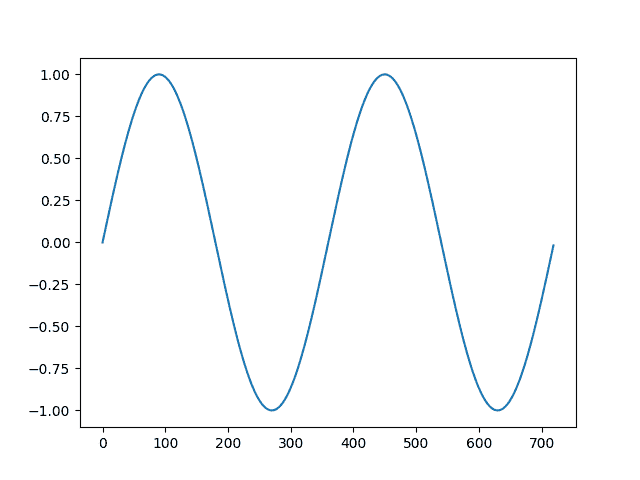
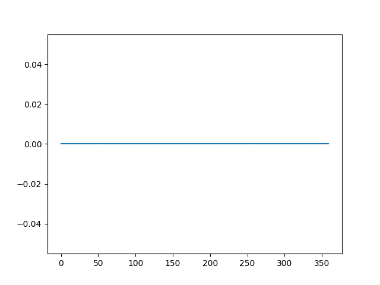

# 如何在 Python 中使用差异变换删除趋势和季节性

> 原文： [https://machinelearningmastery.com/remove-trends-seasonality-difference-transform-python/](https://machinelearningmastery.com/remove-trends-seasonality-difference-transform-python/)

时间序列数据集可能包含趋势和季节性，可能需要在建模之前将其删除。

趋势可能导致随时间变化的均值，而季节性可能导致随时间变化的方差，两者都将时间序列定义为非平稳。固定数据集是具有稳定均值和方差的数据集，并且反过来更容易建模。

差分是一种流行且广泛使用的数据变换，用于使时间序列数据静止。

在本教程中，您将了解如何使用 Python 将差异操作应用于时间序列数据。

完成本教程后，您将了解：

*   静止和非静止时间序列之间的对比以及如何使用差分变换使一系列静止。
*   如何应用差异变换从系列中删除线性趋势。
*   如何应用差异变换从系列中删除季节性信号。

让我们开始吧。


如何使用 Python 中的差异变换删除趋势和季节性
照片由 [NOAA](https://www.flickr.com/photos/noaaphotolib/5015132522/) ，保留一些权利。

## 教程概述

本教程分为 4 个部分;他们是：

1.  平稳
2.  差异变换
3.  差异化去除趋势
4.  区别于删除季节性

## 平稳

时间序列不同于更传统的分类和回归预测建模问题。

时间结构为观察增加了顺序。这种强加的顺序意味着需要专门处理关于这些观察的一致性的重要假设。

例如，在建模时，假设观测的汇总统计数据是一致的。在时间序列术语中，我们将此期望称为时间序列是静止的。

通过添加趋势，季节性和其他依赖于时间的结构，可以在时间序列中容易地违反这些假设。

### 固定时间序列

静止时间序列中的观察结果不依赖于时间。

如果没有趋势或季节性影响，时间序列是固定的。按时间序列计算的汇总统计数据随时间变化是一致的，例如观察值的均值或方差。

当时间序列静止时，可以更容易建模。统计建模方法假定或要求时间序列是静止的。

### 非定时时间序列

来自非平稳时间序列的观测显示了季节性影响，趋势和依赖于时间指数的其他结构。

像平均值和方差这样的汇总统计数据会随着时间的推移而发生变化，从而使模型可能尝试捕获的概念发生偏差。

经典时间序列分析和预测方法涉及通过识别和消除趋势以及消除静止效应来使非平稳时间序列数据静止。

### 使系列数据固定

您可以通过查看系列随时间变化的线图来检查您的时间序列是否静止。

系列中明显趋势，季节性或其他系统结构的标志是非平稳序列的指标。

更准确的方法是使用统计测试，例如 Dickey-Fuller 测试。

你应该让你的时间序列固定吗？

一般来说，是的。

如果您的时间序列中有明确的趋势和季节性，那么对这些组件进行建模，将其从观察中移除，然后在残差上训练模型。

> 如果我们将静态模型拟合到数据中，我们假设我们的数据是静止过程的实现。因此，我们分析的第一步应该是检查是否有任何趋势或季节性影响的证据，如果有，则删除它们。

- 第 122 页，[介绍时间序列与 R](http://www.amazon.com/dp/0387886974?tag=inspiredalgor-20) 。

统计时间序列方法甚至现代机器学习方法将受益于数据中更清晰的信号。

## 差异变换

差分是一种转换时间序列数据集的方法。

它可用于消除序列对时间的依赖性，即所谓的时间依赖性。这包括趋势和季节性等结构。

> 差异可以通过消除时间序列水平的变化来帮助稳定时间序列的均值，从而消除（或减少）趋势和季节性。

- 第 215 页，[预测：原则和实践](http://www.amazon.com/dp/0987507109?tag=inspiredalgor-20)。

通过从当前观察中减去先前的观察来执行差分。

```py
difference(t) = observation(t) - observation(t-1)
```

当必须将预测转换回原始比例时，需要反转该过程。

通过将先前时间步骤的观察值添加到差值，可以反转该过程。

```py
inverted(t) = differenced(t) + observation(t-1)
```

以这种方式，可以计算一系列差异和反转差异。

### 滞后差异

将连续观察之间的差异称为滞后-1 差异。

可以调整滞后差异以适应特定的时间结构。

对于具有季节性成分的时间序列，滞后可以预期为季节性的周期（宽度）。

### 差异订单

在执行差分运算之后，某些时间结构可能仍然存在，例如在非线性趋势的情况下。

这样，差分过程可以重复多次，直到所有时间依赖性都被消除。

执行差分的次数称为差分顺序。

### 计算差分

我们可以手动区分数据集。

这涉及开发一个创建差异数据集的新功能。该函数将遍历提供的序列并以指定的间隔或滞后计算差异值。

名为 difference（）的下面的函数实现了这个过程。

```py
# create a differenced series
def difference(dataset, interval=1):
	diff = list()
	for i in range(interval, len(dataset)):
		value = dataset[i] - dataset[i - interval]
		diff.append(value)
	return Series(diff)
```

我们可以看到该函数在指定的时间间隔后小心地开始差异数据集，以确保实际上可以计算差值。定义默认间隔或滞后值 1。这是一个合理的默认值。

进一步的改进是还能够指定执行差分操作的次序或次数。

下面名为 inverse_difference（）的函数会反转单个预测的差异运算。它还要求提供前一时间步的实际观测值。

```py
# invert differenced forecast
def inverse_difference(last_ob, value):
	return value + last_ob
```

## 差异化去除趋势

在本节中，我们将介绍使用差异变换来移除趋势。

趋势通过提高水平使时间序列非静止。这具有随时间改变平均时间序列值的效果。

下面的示例将 difference（）函数应用于具有线性增加趋势的人为数据集。

```py
# create a differenced series
def difference(dataset, interval=1):
	diff = list()
	for i in range(interval, len(dataset)):
		value = dataset[i] - dataset[i - interval]
		diff.append(value)
	return diff

# invert differenced forecast
def inverse_difference(last_ob, value):
	return value + last_ob

# define a dataset with a linear trend
data = [i+1 for i in range(20)]
print(data)
# difference the dataset
diff = difference(data)
print(diff)
# invert the difference
inverted = [inverse_difference(data[i], diff[i]) for i in range(len(diff))]
print(inverted)
```

运行该示例首先使用线性趋势打印设计序列。接下来，打印差异数据集，显示每个时间步长增加一个单位。该序列的长度为 19 而不是 20，因为序列中第一个值的差异无法计算，因为没有先前值。

最后，使用来自原始序列的先验值作为每个变换的引物来反转差异序列。

```py
[1, 2, 3, 4, 5, 6, 7, 8, 9, 10, 11, 12, 13, 14, 15, 16, 17, 18, 19, 20]
[1, 1, 1, 1, 1, 1, 1, 1, 1, 1, 1, 1, 1, 1, 1, 1, 1, 1, 1]
[2, 3, 4, 5, 6, 7, 8, 9, 10, 11, 12, 13, 14, 15, 16, 17, 18, 19, 20]
```

## 区别于删除季节性

在本节中，我们将介绍使用差异变换来消除季节性。

季节性变化或季节性是随着时间的推移而定期重复的循环。

> 每年内的重复模式称为季节变化，尽管该术语更普遍地应用于任何固定时期内的重复模式。

- 第 6 页， [R](http://www.amazon.com/dp/0387886974?tag=inspiredalgor-20) 的时间序列介绍。

季节性有很多种类。一些明显的例子包括：时间，每日，每周，每月，每年等。因此，确定时间序列问题中是否存在季节性因素是主观的。

确定是否存在季节性方面的最简单方法是绘制和检查您的数据，可能是在不同的尺度和添加趋势线。

下面的示例将 difference（）函数应用于人为的季节性数据集。该数据集包括两个循环，每个循环 360 个单元。

```py
from math import sin
from math import radians
from matplotlib import pyplot

# create a differenced series
def difference(dataset, interval=1):
	diff = list()
	for i in range(interval, len(dataset)):
		value = dataset[i] - dataset[i - interval]
		diff.append(value)
	return diff

# invert differenced forecast
def inverse_difference(last_ob, value):
	return value + last_ob

# define a dataset with a linear trend
data = [sin(radians(i)) for i in range(360)] + [sin(radians(i)) for i in range(360)]
pyplot.plot(data)
pyplot.show()
# difference the dataset
diff = difference(data, 360)
pyplot.plot(diff)
pyplot.show()
# invert the difference
inverted = [inverse_difference(data[i], diff[i]) for i in range(len(diff))]
pyplot.plot(inverted)
pyplot.show()
```

首先运行示例创建并绘制 360 时间步长序列的两个循环的数据集。



人工数据集的线图

接下来，应用差异变换并绘制结果。该图显示了 360 个零值，并删除了所有季节性信号。

在上面的去趋势示例中，差值应用滞后为 1，这意味着牺牲了第一个值。这里整个周期用于差分，即 360 个时间步长。结果是牺牲整个第一循环以区分第二循环。



差异季节性数据集的线图

最后，转换反转显示第二周期恢复季节性。


差分数据集的线图与反向差分变换

## 进一步阅读

*   维基百科上的[固定过程](https://en.wikipedia.org/wiki/Stationary_process)
*   维基百科上的[季节性调整](https://en.wikipedia.org/wiki/Seasonal_adjustment)
*   [如何使用 Python 检查时间序列数据是否固定](http://machinelearningmastery.com/time-series-data-stationary-python/)
*   [如何区分时间序列数据集与 Python](http://machinelearningmastery.com/difference-time-series-dataset-python/)
*   [如何使用 Python 识别和删除时间序列数据中的季节性](http://machinelearningmastery.com/time-series-seasonality-with-python/)
*   [使用 Python 进行季节性持久性预测](http://machinelearningmastery.com/seasonal-persistence-forecasting-python/)

## 摘要

在本教程中，您发现了静态和非平稳时间序列之间的区别，以及如何使用差异变换来消除 Python 的趋势和季节性。

具体来说，你学到了：

*   静止和非静止时间序列之间的对比以及如何使用差分变换使一系列静止。
*   如何应用差异变换从系列中删除线性趋势。
*   如何应用差异变换从系列中删除季节性信号。

你对使时间序列固定有任何疑问吗？
在评论中提出您的问题，我会尽力回答。