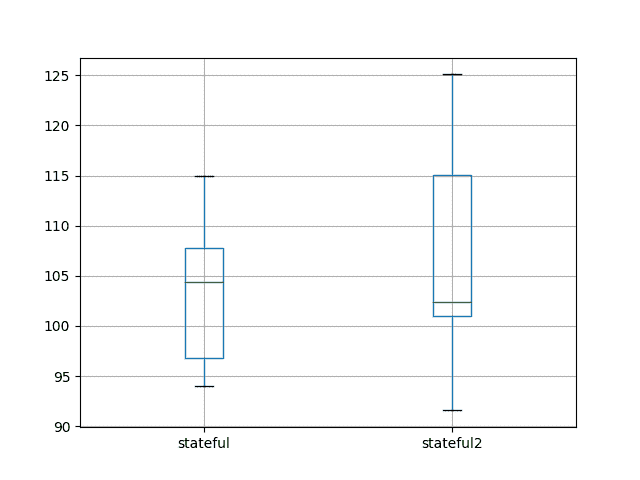
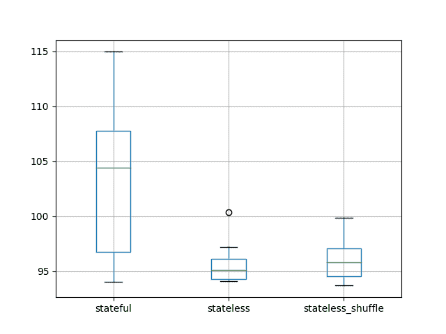

# 使用 Python 用于时间序列预测的有状态和无状态 LSTM

> 原文： [https://machinelearningmastery.com/stateful-stateless-lstm-time-series-forecasting-python/](https://machinelearningmastery.com/stateful-stateless-lstm-time-series-forecasting-python/)

Keras Python 深度学习库支持有状态和无状态长短期内存（LSTM）网络。

使用有状态 LSTM 网络时，我们可以对 LSTM 网络的内部状态何时重置进行细粒度控制。因此，在拟合和使用 LSTM 网络做出预测影响网络技能时，了解管理此内部状态的不同方法非常重要。

在本教程中，您将探索 Keras 中有状态和无状态 LSTM 网络在时间序列预测中的表现。

完成本教程后，您将了解：

*   如何比较和对比状态和无状态 LSTM 网络的时间序列预测。
*   无状态 LSTM 中的批量大小如何与有状态 LSTM 网络相关。
*   如何评估和比较有状态 LSTM 网络的不同状态重置方案。

让我们开始吧。


使用 Python 进行时间序列预测的有状态和无状态 LSTM
照片由 [m01229](https://www.flickr.com/photos/39908901@N06/33414952872/) ，保留一些权利。

## 教程概述

本教程分为 7 个部分。他们是：

1.  洗发水销售数据集
2.  实验测试线束
3.  A 与 A 测试
4.  有状态与无国籍
5.  大批量与无状态无国籍
6.  有状态重置与无状态重置
7.  审查结果

### 环境

本教程假定您已安装 Python SciPy 环境。您可以在此示例中使用 Python 2 或 3。

本教程假设您安装了 TensorFlow 或 Theano 后端的 Keras v2.0 或更高版本。

本教程还假设您安装了 scikit-learn，Pandas，NumPy 和 Matplotlib。

如果您在设置 Python 环境时需要帮助，请参阅以下帖子：

*   [如何使用 Anaconda 设置用于机器学习和深度学习的 Python 环境](http://machinelearningmastery.com/setup-python-environment-machine-learning-deep-learning-anaconda/)

## 洗发水销售数据集

该数据集描述了 3 年期间每月洗发水的销售数量。

单位是销售计数，有 36 个观察。原始数据集归功于 Makridakis，Wheelwright 和 Hyndman（1998）。

[您可以在此处下载并了解有关数据集的更多信息](https://datamarket.com/data/set/22r0/sales-of-shampoo-over-a-three-year-period)。

下面的示例加载并创建已加载数据集的图。

```py
# load and plot dataset
from pandas import read_csv
from pandas import datetime
from matplotlib import pyplot
# load dataset
def parser(x):
	return datetime.strptime('190'+x, '%Y-%m')
series = read_csv('shampoo-sales.csv', header=0, parse_dates=[0], index_col=0, squeeze=True, date_parser=parser)
# summarize first few rows
print(series.head())
# line plot
series.plot()
pyplot.show()
```

运行该示例将数据集作为 Pandas Series 加载并打印前 5 行。

```py
Month
1901-01-01 266.0
1901-02-01 145.9
1901-03-01 183.1
1901-04-01 119.3
1901-05-01 180.3
Name: Sales, dtype: float64
```

然后创建该系列的线图，显示明显的增加趋势。


洗发水销售数据集的线图

接下来，我们将了解实验中使用的 LSTM 配置和测试工具。

## 实验测试线束

本节介绍本教程中使用的测试工具。

### 数据拆分

我们将 Shampoo Sales 数据集分为两部分：训练和测试集。

前两年的数据将用于训练数据集，剩余的一年数据将用于测试集。

将使用训练数据集开发模型，并对测试数据集做出预测。

测试数据集的持久性预测（朴素预测）实现了每月洗发水销售 136.761 的错误。这在测试集上提供了较低的可接受表现限制。

### 模型评估

将使用滚动预测场景，也称为前进模型验证。

测试数据集的每个时间步骤将一次一个地走。将使用模型对时间步长做出预测，然后将获取测试集的实际预期值，并使其可用于下一时间步的预测模型。

这模仿了一个真实世界的场景，每个月都会有新的洗发水销售观察结果，并用于下个月的预测。

这将通过训练和测试数据集的结构进行模拟。

将收集关于测试数据集的所有预测，并计算错误分数以总结模型的技能。将使用均方根误差（RMSE），因为它会对大错误进行处罚，并产生与预测数据相同的分数，即每月洗发水销售额。

### 数据准备

在我们将 LSTM 模型拟合到数据集之前，我们必须转换数据。

在拟合模型和做出预测之前，对数据集执行以下三个数据变换。

1.  **转换时间序列数据，使其静止**。具体而言，滞后= 1 差分以消除数据中的增加趋势。
2.  **将时间序列转换为监督学习问题**。具体而言，将数据组织成输入和输出模式，其中前一时间步的观察被用作预测当前时间步的观察的输入
3.  **将观察结果转换为具有特定比例**。具体而言，要将数据重新调整为-1 到 1 之间的值，以满足 LSTM 模型的默认双曲正切激活函数。

这些变换在预测时反转，在计算和误差分数之前将它们恢复到原始比例。

### LSTM 模型

我们将使用基础状态 LSTM 模型，其中 1 个神经元适合 1000 个时期。

批量大小为 1 是必需的，因为我们将使用前向验证并对最后 12 个月的测试数据进行一步预测。

批量大小为 1 意味着该模型将使用在线训练（而不是批量训练或小批量训练）。因此，预计模型拟合将具有一些变化。

理想情况下，将使用更多的训练时期（例如 1500），但这被截断为 1000 以保持运行时间合理。

使用有效的 ADAM 优化算法和均方误差损失函数来拟合模型。

### 实验运行

每个实验场景将运行 10 次。

其原因在于，每次训练给定配置时，LSTM 网络的随机初始条件可能导致非常不同的结果。

让我们深入研究实验。

## A 与 A 测试

一个好的第一个实验是评估我们的测试安全带的噪音或可靠性。

这可以通过运行相同的实验两次并比较结果来评估。在 [A / B 测试](https://en.wikipedia.org/wiki/A/B_testing)的世界中，这通常被称为 A 对 A 测试，我觉得这个名字很有用。我们的想法是用实验清除任何明显的错误，并掌握平均值的预期方差。

我们将在网络上运行两次有状态 LSTM 的实验。

完整的代码清单如下。

此代码还为本教程中的所有实验提供了基础。我将仅列出已更改的函数，而不是为后续部分中的每个变体重新列出它。

```py
from pandas import DataFrame
from pandas import Series
from pandas import concat
from pandas import read_csv
from pandas import datetime
from sklearn.metrics import mean_squared_error
from sklearn.preprocessing import MinMaxScaler
from keras.models import Sequential
from keras.layers import Dense
from keras.layers import LSTM
from math import sqrt
import matplotlib
import numpy
from numpy import concatenate

# date-time parsing function for loading the dataset
def parser(x):
	return datetime.strptime('190'+x, '%Y-%m')

# frame a sequence as a supervised learning problem
def timeseries_to_supervised(data, lag=1):
	df = DataFrame(data)
	columns = [df.shift(i) for i in range(1, lag+1)]
	columns.append(df)
	df = concat(columns, axis=1)
	return df

# create a differenced series
def difference(dataset, interval=1):
	diff = list()
	for i in range(interval, len(dataset)):
		value = dataset[i] - dataset[i - interval]
		diff.append(value)
	return Series(diff)

# invert differenced value
def inverse_difference(history, yhat, interval=1):
	return yhat + history[-interval]

# scale train and test data to [-1, 1]
def scale(train, test):
	# fit scaler
	scaler = MinMaxScaler(feature_range=(-1, 1))
	scaler = scaler.fit(train)
	# transform train
	train = train.reshape(train.shape[0], train.shape[1])
	train_scaled = scaler.transform(train)
	# transform test
	test = test.reshape(test.shape[0], test.shape[1])
	test_scaled = scaler.transform(test)
	return scaler, train_scaled, test_scaled

# inverse scaling for a forecasted value
def invert_scale(scaler, X, yhat):
	new_row = [x for x in X] + [yhat]
	array = numpy.array(new_row)
	array = array.reshape(1, len(array))
	inverted = scaler.inverse_transform(array)
	return inverted[0, -1]

# fit an LSTM network to training data
def fit_lstm(train, batch_size, nb_epoch, neurons):
	X, y = train[:, 0:-1], train[:, -1]
	X = X.reshape(X.shape[0], 1, X.shape[1])
	model = Sequential()
	model.add(LSTM(neurons, batch_input_shape=(batch_size, X.shape[1], X.shape[2]), stateful=True))
	model.add(Dense(1))
	model.compile(loss='mean_squared_error', optimizer='adam')
	for i in range(nb_epoch):
		model.fit(X, y, epochs=1, batch_size=batch_size, verbose=0, shuffle=False)
		model.reset_states()
	return model

# make a one-step forecast
def forecast_lstm(model, batch_size, X):
	X = X.reshape(1, 1, len(X))
	yhat = model.predict(X, batch_size=batch_size)
	return yhat[0,0]

# run a repeated experiment
def experiment(repeats, series):
	# transform data to be stationary
	raw_values = series.values
	diff_values = difference(raw_values, 1)
	# transform data to be supervised learning
	supervised = timeseries_to_supervised(diff_values, 1)
	supervised_values = supervised.values[1:,:]
	# split data into train and test-sets
	train, test = supervised_values[0:-12, :], supervised_values[-12:, :]
	# transform the scale of the data
	scaler, train_scaled, test_scaled = scale(train, test)
	# run experiment
	error_scores = list()
	for r in range(repeats):
		# fit the base model
		lstm_model = fit_lstm(train_scaled, 1, 1000, 1)
		# forecast test dataset
		predictions = list()
		for i in range(len(test_scaled)):
			# predict
			X, y = test_scaled[i, 0:-1], test_scaled[i, -1]
			yhat = forecast_lstm(lstm_model, 1, X)
			# invert scaling
			yhat = invert_scale(scaler, X, yhat)
			# invert differencing
			yhat = inverse_difference(raw_values, yhat, len(test_scaled)+1-i)
			# store forecast
			predictions.append(yhat)
		# report performance
		rmse = sqrt(mean_squared_error(raw_values[-12:], predictions))
		print('%d) Test RMSE: %.3f' % (r+1, rmse))
		error_scores.append(rmse)
	return error_scores

# execute the experiment
def run():
	# load dataset
	series = read_csv('shampoo-sales.csv', header=0, parse_dates=[0], index_col=0, squeeze=True, date_parser=parser)
	# experiment
	repeats = 10
	results = DataFrame()
	# run experiment
	results['results'] = experiment(repeats, series)
	# summarize results
	print(results.describe())
	# save results
	results.to_csv('experiment_stateful.csv', index=False)

 # entry point
run()
```

运行实验会将结果保存到名为“`experiment_stateful.csv`”的文件中。

再次运行实验并将实验写入的文件名更改为“`experiment_stateful2.csv`”，以便不覆盖第一次运行的结果。

您现在应该在文件的当前工作目录中有两组结果：

*   _experiment_stateful.csv_
*   _experiment_stateful2.csv_

我们现在可以加载和比较这两个文件。下面列出了执行此操作的脚本。

```py
from pandas import DataFrame
from pandas import read_csv
from matplotlib import pyplot
# load results into a dataframe
filenames = ['experiment_stateful.csv', 'experiment_stateful2.csv']
results = DataFrame()
for name in filenames:
	results[name[11:-4]] = read_csv(name, header=0)
# describe all results
print(results.describe())
# box and whisker plot
results.boxplot()
pyplot.show()
```

此脚本加载结果文件，并首先计算每次运行的描述性统计信息。

我们可以看到平均结果和标准偏差是相对接近的值（分别约为 103-106 和 7-10）。这是一个好兆头，但并不完美。预计将实验的重复次数从 10 增加到 30,100 或甚至 1000 会产生几乎相同的汇总统计数据。

```py
         stateful   stateful2
count   10.000000   10.000000
mean   103.142903  106.594624
std      7.109461   10.687509
min     94.052380   91.570179
25%     96.765985  101.015403
50%    104.376252  102.425406
75%    107.753516  115.024920
max    114.958430  125.088436
```

比较还创建了一个框和胡须图来比较两个分布。

该图显示了每个实验的 10 个测试 RMSE 结果的第 25 个，第 50 个（中位数）和第 75 个百分位数。该框显示中间 50％的数据，绿线显示中位数。

该图显示虽然描述性统计数据相当接近，但分布确实显示出一些差异。

然而，分布确实是重叠的，并且不同实验设置的比较均值和标准偏差是合理的，只要我们不对平均值的适度差异进行狡辩。



盒子和晶须的 A 与实验结果

此分析的一个很好的后续步骤是检查不同样本量的分布的标准误差。这将涉及首先创建一个更大的实验运行池，从中绘制（100 或 1000），并且在比较结果时可以很好地了解重复数的强大数量和平均值的预期误差。

## 有状态与无状态 LSTM

一个好的第一个实验是探索 LSTM 中的维持状态是否增加了不维持状态的价值。

在本节中，我们将对比：

1.  有状态 LSTM（上一节的第一个结果）。
2.  具有相同配置的无状态 LSTM。
3.  无状态 LSTM 在训练期间随机改组。

LSTM 网络的好处是它们能够维持状态并学习序列。

*   **期望 1** ：期​​望有状态 LSTM 将胜过无状态 LSTM。

通常执行每批次或时期的输入模式的混洗以改善训练期间 MLP 网络的普遍性。无状态 LSTM 在训练期间不会改变输入模式，因为网络旨在学习模式序列。我们将测试无状态 LSTM 是否有改组。

*   **期望 2** ：期​​望没有改组的无状态 LSTM 将通过改组跑赢无状态 LSTM。

代码更改为上面的有状态 LSTM 示例以使其无状态涉及在 LSTM 层中设置 _ 无状态=假 _ 并使用自动训练时代训练而不是手动。结果将写入名为“`experiment_stateless.csv`”的新文件。更新后的`fit_lstm()`功能如下所示。

```py
# fit an LSTM network to training data
def fit_lstm(train, batch_size, nb_epoch, neurons):
	X, y = train[:, 0:-1], train[:, -1]
	X = X.reshape(X.shape[0], 1, X.shape[1])
	model = Sequential()
	model.add(LSTM(neurons, batch_input_shape=(batch_size, X.shape[1], X.shape[2]), stateful=False))
	model.add(Dense(1))
	model.compile(loss='mean_squared_error', optimizer='adam')
	model.fit(X, y, epochs=nb_epoch, batch_size=batch_size, verbose=0, shuffle=False)
	return model
```

具有改组实验的无状态涉及在`fit_lstm()`函数中调用 fit 时将`shuffle`参数设置为`True`。该实验的结果写入文件“`experiment_stateless_shuffle.csv`”。

完整更新的`fit_lstm()`功能如下所示。

```py
# fit an LSTM network to training data
def fit_lstm(train, batch_size, nb_epoch, neurons):
	X, y = train[:, 0:-1], train[:, -1]
	X = X.reshape(X.shape[0], 1, X.shape[1])
	model = Sequential()
	model.add(LSTM(neurons, batch_input_shape=(batch_size, X.shape[1], X.shape[2]), stateful=False))
	model.add(Dense(1))
	model.compile(loss='mean_squared_error', optimizer='adam')
	model.fit(X, y, epochs=nb_epoch, batch_size=batch_size, verbose=0, shuffle=True)
	return model
```

运行实验后，您应该有三个结果文件进行比较：

*   _experiment_stateful.csv_
*   _experiment_stateless.csv_
*   _experiment_stateless_shuffle.csv_

我们现在可以加载并比较这些结果。下面列出了比较结果的完整示例。

```py
from pandas import DataFrame
from pandas import read_csv
from matplotlib import pyplot
# load results into a dataframe
filenames = ['experiment_stateful.csv', 'experiment_stateless.csv',
	'experiment_stateless_shuffle.csv']
results = DataFrame()
for name in filenames:
	results[name[11:-4]] = read_csv(name, header=0)
# describe all results
print(results.describe())
# box and whisker plot
results.boxplot()
pyplot.show()
```

首先运行该示例计算并打印每个实验的描述性统计信息。

平均结果表明无状态 LSTM 配置可能优于有状态配置。如果强劲，这一发现是非常令人惊讶的，因为它不能满足增加状态改善表现的期望。

训练样本的改组似乎对无状态 LSTM 没有太大影响。如果结果是稳健的，那么对无状态 LSTM 的改组训练订单的期望似乎确实提供了一些好处。

总之，这些发现可能进一步表明所选择的 LSTM 配置更侧重于学习输入 - 输出对而不是序列内的依赖性。

仅从这些有限的结果中，人们就会考虑在这个问题上探索无状态 LSTM。

```py
         stateful   stateless  stateless_shuffle
count   10.000000   10.000000          10.000000
mean   103.142903   95.661773          96.206332
std      7.109461    1.924133           2.138610
min     94.052380   94.097259          93.678941
25%     96.765985   94.290720          94.548002
50%    104.376252   95.098050          95.804411
75%    107.753516   96.092609          97.076086
max    114.958430  100.334725          99.870445
```

还创建了一个盒子和胡须图来比较分布。

与无状态情况相比，有状态配置的数据传播显得更大。当我们查看标准偏差分数时，这也存在于描述性统计中。

这表明无状态配置可能更稳定。



有状态与无状态 LSTM 结果的测试 RMSE 的盒子和晶须图

## 大批量无状态与无状态无状态

理解有状态和无状态 LSTM 之间差异的关键是“当内部状态被重置时”。

*   **无状态**：在无状态 LSTM 配置中，内部状态在每个训练批次或每个批次做出预测后重置。
*   **有状态**：在有状态 LSTM 配置中，只有在调用`reset_state()`功能时才会复位内部状态。

如果这是唯一的区别，则可以使用大批量大小来模拟具有无状态 LSTM 的有状态 LSTM。

*   **期望 3** ：当使用相同的批量大小时，无状态和有状态 LSTM 应产生几乎相同的结果。

我们可以使用 Shampoo Sales 数据集将训练数据截断到 12 个月，并将测试数据保留为 12 个月。这将允许无状态 LSTM 使用 12 的批量大小。如果以一次性方式（一个函数调用）执行训练和测试，那么“_ 无状态 _”的内部状态可能是 LSTM 不会被重置，两种配置都会产生相同的结果。

我们将使用第一个实验的有状态结果作为起点。`forecast_lstm()`功能被修改为在一个步骤中预测一年的观察。 _ 实验（）_ 功能被修改为将训练数据集截断为 12 个月的数据，使用批量大小为 12，并处理从`forecast_lstm()`返回的批量预测功能。下面列出了这些更新的功能。结果将写入文件“`experiment_stateful_batch12.csv`”。

```py
# make a one-step forecast
def forecast_lstm(model, batch_size, X):
	X = X.reshape(1, 1, len(X))
	yhat = model.predict(X, batch_size=batch_size)
	return yhat[0,0]

# run a repeated experiment
def experiment(repeats, series):
	# transform data to be stationary
	raw_values = series.values
	diff_values = difference(raw_values, 1)
	# transform data to be supervised learning
	supervised = timeseries_to_supervised(diff_values, 1)
	supervised_values = supervised.values[1:,:]
	# split data into train and test-sets
	train, test = supervised_values[-24:-12, :], supervised_values[-12:, :]
	# transform the scale of the data
	scaler, train_scaled, test_scaled = scale(train, test)
	# run experiment
	error_scores = list()
	for r in range(repeats):
		# fit the base model
		batch_size = 12
		lstm_model = fit_lstm(train_scaled, batch_size, 1000, 1)
		# forecast test dataset
		test_reshaped = test_scaled[:,0:-1]
		test_reshaped = test_reshaped.reshape(len(test_reshaped), 1, 1)
		output = lstm_model.predict(test_reshaped, batch_size=batch_size)
		predictions = list()
		for i in range(len(output)):
			yhat = output[i,0]
			X = test_scaled[i, 0:-1]
			# invert scaling
			yhat = invert_scale(scaler, X, yhat)
			# invert differencing
			yhat = inverse_difference(raw_values, yhat, len(test_scaled)+1-i)
			# store forecast
			predictions.append(yhat)
		# report performance
		rmse = sqrt(mean_squared_error(raw_values[-12:], predictions))
		print('%d) Test RMSE: %.3f' % (r+1, rmse))
		error_scores.append(rmse)
	return error_scores
```

我们将使用前一个实验中的无状态 LSTM 配置，将训练模式混洗作为起点。该实验使用与上面列出的相同的`forecast_lstm()`和`experiment()`函数。结果写入文件“`experiment_stateless_batch12.csv`”。

运行此实验后，您将有两个结果文件：

*   _experiment_stateful_batch12.csv_
*   _experiment_stateless_batch12.csv_

我们现在可以比较这些实验的结果。

```py
from pandas import DataFrame
from pandas import read_csv
from matplotlib import pyplot
# load results into a dataframe
filenames = ['experiment_stateful_batch12.csv', 'experiment_stateless_batch12.csv']
results = DataFrame()
for name in filenames:
	results[name[11:-4]] = read_csv(name, header=0)
# describe all results
print(results.describe())
# box and whisker plot
results.boxplot()
pyplot.show()
```

运行比较脚本首先计算并打印每个实验的描述性统计信息。

每个实验的平均结果表明具有相同批次大小的无状态和有状态配置之间的等效结果。这证实了我们的期望。

如果这个结果是稳健的，那么它表明在内部状态重置之后，Keras 中的无状态和有状态 LSTM 网络之间没有进一步的实现 - 详细差异。

```py
       stateful_batch12  stateless_batch12
count         10.000000          10.000000
mean          97.920126          97.450757
std            6.526297           5.707647
min           92.723660          91.203493
25%           94.215807          93.888928
50%           95.770862          95.640314
75%           99.338368          98.540688
max          114.567780         110.014679
```

还创建了一个盒子和胡须图来比较分布。

该图证实了描述性统计中的故事，或许只是突出了实验设计的可变性。


具有大批量 LSTM 结果的有状态与无状态测试 RMSE 的框和晶须图

## 有状态重置与无状态重置

关于有状态 LSTM 的另一个问题是对州进行重置的最佳制度。

通常，我们希望在每次呈现序列后重置状态是个好主意。

*   **期望 4** ：在每个训练时期之后重置状态可以获得更好的测试表现。

这提出了在做出预测时管理状态的最佳方法的问题。例如，网络是否应该首先对训练数据集做出预测？

*   **期望 5** ：通过对训练数据集做出预测，LSTM 中的播种状态可以提高测试表现。

我们还希望不在测试集上的一步预测之间重置 LSTM 状态是个好主意。

*   **期望 6** ：在测试集上的一步预测之间不重置状态会导致更好的测试集表现。

还有一个问题是，重置状态是否是一个好主意。在本节中，我们尝试梳理这些问题的答案。

我们将再次使用所有可用数据和批量大小为 1 进行一步预测。

总之，我们将比较以下实验设置：

没有种子：

*   **noseed_1** ：在每个训练时期之后重置状态而不是在测试期间（来自`experiment_stateful.csv`中的第一个实验的有状态结果）。
*   **noseed_2** ：在每个训练时期之后和每个一步预测之后复位状态（`experiment_stateful_reset_test.csv`）。
*   **noseed_3** ：训练后无需重置或进行一步预测（`experiment_stateful_noreset.csv`）。

播种：

*   **seed_1** ：在每个训练时期之后重置状态，在对测试数据集进行一步预测之前对训练数据集进行一步预测的种子状态（`experiment_stateful_seed_train.csv`）。
*   **seed_2** ：在每个训练时期后重置状态，在训练数据集上进行一步预测的种子状态，然后对测试数据集进行一步预测，并在训练和测试集上的每个一步预测后重置状态（`experiment_stateful_seed_train_resets.csv`）。
*   **seed_3** ：在进行一步预测之前训练数据集上的种子，在预测训练期间没有重置（`experiment_stateful_seed_train_no_resets.csv`）。

来自第一个“A vs A”实验的有状态实验代码用作基础。

下面列出了各种重置/不重置和播种/不播种所需的修改。

我们可以通过在每次预测之后在模型上添加对`reset_states()`的调用来更新`forecast_lstm()`函数以在每次测试之后更新。更新的`forecast_lstm()`功能如下所示。

```py
# make a one-step forecast
def forecast_lstm(model, batch_size, X):
	X = X.reshape(1, 1, len(X))
	yhat = model.predict(X, batch_size=batch_size)
	model.reset_states()
	return yhat[0,0]
```

我们可以通过删除对`reset_states()`的调用来更新`fit_lstm()`函数，使其在每个迭代后不复位。完整的功能如下所列。

```py
# fit an LSTM network to training data
def fit_lstm(train, batch_size, nb_epoch, neurons):
	X, y = train[:, 0:-1], train[:, -1]
	X = X.reshape(X.shape[0], 1, X.shape[1])
	model = Sequential()
	model.add(LSTM(neurons, batch_input_shape=(batch_size, X.shape[1], X.shape[2]), stateful=True))
	model.add(Dense(1))
	model.compile(loss='mean_squared_error', optimizer='adam')
	for i in range(nb_epoch):
		model.fit(X, y, epochs=1, batch_size=batch_size, verbose=0, shuffle=False)
	return model
```

通过循环训练数据集并进行一步预测，我们可以在训练后通过训练数据集对训练数据集进行训练，使 LSTM 状态成为种子。在对测试数据集进行一步预测之前，可以将其添加到`run()`函数中。更新的`run()`功能如下所示。

```py
# run a repeated experiment
def experiment(repeats, series):
	# transform data to be stationary
	raw_values = series.values
	diff_values = difference(raw_values, 1)
	# transform data to be supervised learning
	supervised = timeseries_to_supervised(diff_values, 1)
	supervised_values = supervised.values[1:,:]
	# split data into train and test-sets
	train, test = supervised_values[0:-12, :], supervised_values[-12:, :]
	# transform the scale of the data
	scaler, train_scaled, test_scaled = scale(train, test)
	# run experiment
	error_scores = list()
	for r in range(repeats):
		# fit the base model
		lstm_model = fit_lstm(train_scaled, 1, 1000, 1)
		# forecast train dataset
		for i in range(len(train_scaled)):
			X, y = train_scaled[i, 0:-1], train_scaled[i, -1]
			yhat = forecast_lstm(lstm_model, 1, X)
		# forecast test dataset
		predictions = list()
		for i in range(len(test_scaled)):
			# predict
			X, y = test_scaled[i, 0:-1], test_scaled[i, -1]
			yhat = forecast_lstm(lstm_model, 1, X)
			# invert scaling
			yhat = invert_scale(scaler, X, yhat)
			# invert differencing
			yhat = inverse_difference(raw_values, yhat, len(test_scaled)+1-i)
			# store forecast
			predictions.append(yhat)
		# report performance
		rmse = sqrt(mean_squared_error(raw_values[-12:], predictions))
		print('%d) Test RMSE: %.3f' % (r+1, rmse))
		error_scores.append(rmse)
	return error_scores
```

这结束了为这 6 个实验创建代码所需的所有分段修改。

运行这些实验后，您将获得以下结果文件：

*   _experiment_stateful.csv_
*   _experiment_stateful_reset_test.csv_
*   _experiment_stateful_noreset.csv_
*   _experiment_stateful_seed_train.csv_
*   _experiment_stateful_seed_train_resets.csv_
*   _experiment_stateful_seed_train_no_resets.csv_

我们现在可以使用下面的脚本比较结果。

```py
from pandas import DataFrame
from pandas import read_csv
from matplotlib import pyplot
# load results into a dataframe
filenames = ['experiment_stateful.csv', 'experiment_stateful_reset_test.csv',
	'experiment_stateful_noreset.csv', 'experiment_stateful_seed_train.csv',
	'experiment_stateful_seed_train_resets.csv', 'experiment_stateful_seed_train_no_resets.csv']
results = DataFrame()
for name in filenames:
	results[name] = read_csv(name, header=0)
results.columns = ['noseed_1', 'noseed_2', 'noseed_3', 'seed_1', 'seed_2', 'seed_3']
# describe all results
print(results.describe())
# box and whisker plot
results.boxplot()
pyplot.show()
```

运行比较会为每组结果打印描述性统计信息。

没有播种的结果表明在测试数据集上的每次预测之后重置之间可能没有什么差别。这表明从预测到预测构建的任何状态都不会增加值，或者此状态由 Keras API 隐式清除。这是一个令人惊讶的结果。

无种子案例的结果也表明，在训练期间没有重置导致平均表现更差，方差更大，而不是在每个时期结束时重置状态。这证实了期望在每个训练时期结束时重置状态是一种很好的做法。

种子实验的平均结果表明，在对测试数据集做出预测之前，对训练数据集做出预测的播种 LSTM 状态是中性的，如果不是导致表现稍差。

在训练和测试装置上的每次预测之后重置状态似乎导致稍微更好的表现，而在训练或测试期间不重置状态似乎导致最佳表现。

关于播种的这些结果令人惊讶，但我们应该注意，平均值都在 5 个月洗发水销售的测试 RMSE 内，并且可能是统计噪声。

```py
         noseed_1    noseed_2    noseed_3      seed_1      seed_2      seed_3
count   10.000000   10.000000   10.000000   10.000000   10.000000   10.000000
mean   103.142903  101.757034  110.441021  105.468200  100.093551   98.766432
std      7.109461   14.584442   24.539690    5.206674    4.157095   11.573366
min     94.052380   91.264712   87.262549   97.683535   95.913385   90.005843
25%     96.765985   93.218929   94.610724  100.974693   96.721924   91.203879
50%    104.376252   96.144883   99.483971  106.036240   98.779770   95.079716
75%    107.753516  105.657586  121.586508  109.829793  103.082791  100.500867
max    114.958430  138.752321  166.527902  112.691046  108.070145  128.261354
```

还创建了一个盒子和胡须图来比较分布。

该情节与描述性统计数据相同。它突出了在没有播种的情况下无状态 LSTM 上没有使用重置时增加的传播。它还强调了通过对训练数据集做出预测来实现 LSTM 状态的实验的一般紧密传播。


有状态 LSTM 中重置机制测试 RMSE 的盒子和晶须图

## 审查结果

在本节中，我们将回顾本教程中的研究结果。

*   具有所选配置的 10 次重复实验导致测试 RMSE 的平均值和标准偏差在约 3 个月洗发剂销售中有一些变化。预计会有更多重复收紧。
*   具有相同配置的无状态 LSTM 可能比有状态版本在此问题上表现更好。
*   不使用无状态 LSTM 改变训练模式可能会导致稍微更好的表现。
*   当使用大批量大小时，可以使用无状态 LSTM 模拟有状态 LSTM。
*   使用有状态 LSTM 进行一步预测时重置状态可以提高测试集的表现。
*   通过在对测试集做出预测之前对训练数据集做出预测来在有状态 LSTM 中播种状态不会导致测试集上的表现的明显改善。
*   拟合有状态 LSTM 并将其播种到训练数据集上并且在训练或预测期间不执行任何状态重置可以导致测试集上的更好表现。

必须指出的是，通过增加每个实验的重复次数并使用统计显着性检验确认差异是显着的，这些发现应该更加稳健。

还应注意，这些结果适用于此特定问题，框架的方式以及所选的 LSTM 配置参数，包括拓扑，批量大小和训练时期。

## 摘要

在本教程中，您了解了如何使用有状态与无状态 LSTM 网络来研究使用 Keras 在 Python 中进行时间序列预测的影响。

具体来说，你学到了：

*   如何比较无状态与状态 LSTM 网络的时间序列预测。
*   如何确认无状态 LSTM 和具有大批量大小的有状态 LSTM 的等价性。
*   如何评估在训练期间重置 LSTM 状态以及使用 LSTM 网络进行时间序列预测预测时的影响。

你有任何问题吗？在评论中提出您的问题，我会尽力回答。