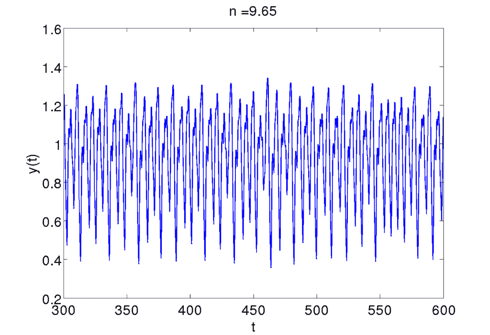

# 长短时记忆网络在时间序列预测中的适用性

> 原文： [https://machinelearningmastery.com/suitability-long-short-term-memory-networks-time-series-forecasting/](https://machinelearningmastery.com/suitability-long-short-term-memory-networks-time-series-forecasting/)

长短期记忆（LSTM）是一种循环神经网络，可以学习序列中项目之间的顺序依赖性。

LSTM 承诺能够学习在时间序列预测问题中做出预测所需的上下文，而不是预先指定和修复此上下文。

鉴于有希望，对于 LSTM 是否适合时间序列预测存在疑问。

在这篇文章中，我们将研究 LSTMs 在该技术的一些主要开发者的时间序列预测中的应用。

让我们开始吧。

关于长期短期记忆网络对时间序列预测的适用性
照片由 [becosky](https://www.flickr.com/photos/becosky/3304801086/) ，保留一些权利。

## LSTM 用于时间序列预测

我们将仔细研究一篇旨在探讨 LSTM 是否适合时间序列预测的论文。

该论文标题为“[将 LSTM 应用于通过时间窗口方法预测的时间序列](https://link.springer.com/chapter/10.1007/3-540-44668-0_93)”（[得到 PDF](ftp://ftp.idsia.ch/pub/juergen/icann2001predict.pdf) ，Gers，Eck 和 Schmidhuber，发表于 2001 年。

他们首先评论单变量时间序列预测问题实际上比传统上用于演示 LSTM 功能的问题类型更简单。

> 文献中发现的时间序列基准问题通常比 LSTM 已经解决的许多任务在概念上更简单。它们通常根本不需要 RNN，因为关于下一个事件的所有相关信息都是通过一个小时间窗内包含的一些最近事件来传达的。

本文重点研究了 LSTM 在两个复杂时间序列预测问题中的应用，并将 LSTM 的结果与其他类型的神经网络进行了对比。

该研究的重点是两个经典的时间序列问题：

### 麦基玻璃系列

这是根据微分方程计算的人为时间序列。

Mackey-Glass 系列的情节，取自 Schoarpedia

有关更多信息，请参阅：

*   [Scholarpedia 上的 Mackey-Glass 方程](http://www.scholarpedia.org/article/Mackey-Glass_equation)。

### 混沌激光数据（A 组）

这是一系列来自圣达菲研究所的比赛。

集 A 定义为：

> 清洁的物理实验室实验。远红外激光器中的 1000 个波动点，大致由三个耦合非线性常微分方程描述。

混沌激光数据（A 组）的例子，取自时间序列的未来

有关更多信息，请参阅：

*   第 2 节“竞争”[时间序列的未来](http://samoa.santafe.edu/media/workingpapers/93-08-053.pdf)，1993。

## 自回归

使用自回归（AR）方法来模拟这些问题。

这意味着下一个时间步骤是作为一些过去（或滞后）观察的函数。

这是经典统计时间序列预测的常用方法。

LSTM 一次暴露于一个输入，没有固定的滞后变量集，如窗口多层感知器（MLP）。

有关时间序列 AR 的更多信息，请参阅帖子：

*   [使用 Python 进行时间序列预测的自回归模型](http://machinelearningmastery.com/autoregression-models-time-series-forecasting-python/)

## 结果分析

一些更为突出的评论是为了回应 LSTM 对 Mackey-Glass 系列问题的糟糕结果。

首先，他们评论说增加网络的学习能力没有帮助：

> 增加内存块的数量并没有显着改善结果。

这可能需要进一步增加训练时期的数量。一堆 LSTM 也可能具有改进的结果。

他们评论说，为了在 Mackey-Glass 系列上做得好，LSTM 需要记住最近的过去观察结果，而 MLP 则明确地给出了这些数据。

> AR-LSTM 方法的结果明显比时间窗方法的结果更差，例如使用 MLP。 AR-LSTM 网络无法访问过去作为其输入的一部分... [为了使 LSTM 做得好]需要记住过去的一个或两个事件，然后在覆盖相同的存储器单元之前使用该信息。

他们评论说，总的来说，这对 LSTM 和 RNN 构成了比 MLP 更大的挑战。

> 假设任何动态模型都需要来自 t-tau ...的所有输入，我们注意到 AR-RNN 必须存储从 t-tau 到 t 的所有输入并在适当的时间覆盖它们。这需要实现循环缓冲区，这是 RNN 难以模拟的结构。

同样，我不禁认为更大的隐藏层（更多的内存单元）和更深的网络（堆叠的 LSTM）更适合学习多个过去的观察。

他们后来总结了论文，并根据结果讨论了 LSTM 可能不适合时间序列预测的 AR 类型公式，至少当滞后观测值接近预测时间时。

鉴于 LSTM 在测试的单变量问题上的表现与 MLP 相比，这是一个公平的结论。

> 基于时间窗的 MLP 在某些时间序列预测基准上优于 LSTM 纯 AR 方法，仅通过查看一些最近的输入来解决。因此，LSTM 的特殊优势，即学习在很长的未知时间内记住单个事件，在这里是不必要的。
> 
> LSTM 学会了调整每个系列的基本振荡，但无法准确地跟踪信号。

它们确实强调了 LSTM 学习振荡行为的能力（例如周期或季节性）。

> 我们的结果建议仅在传统的基于时间窗口的方法必须失败的任务中使用 LSTM。
> 
> LSTM 跟踪混沌信号中的缓慢振荡的能力可适用于认知领域，例如语音和音乐中的节奏检测。

这很有趣，但可能没那么有用，因为这些模式通常会在预测之前尽可能明确地删除。然而，它可能突出了 LSTM 学习在非平稳序列背景下做出预测的可能性。

## 最后的话

那么，这一切意味着什么呢？

根据面值，我们可以得出结论，LSTM 不适用于基于 AR 的单变量时间序列预测。我们应首先转向具有固定窗口的 MLP，如果 MLP 无法获得良好结果，则仅转向 LSTM。

这听起来很公平。

在我们为时间序列预测注销 LSTM 之前，我会争论一些应该考虑的问题：

*   考虑更复杂的数据准备，例如至少缩放和平稳性。如果周期或趋势明显，则应将其移除，以便模型可以关注基础信号。话虽如此，LSTM 在非静止数据上表现良好或者比其他方法更好的能力是有趣的，但我希望与所需网络容量和训练的增加相称。
*   考虑使用较大的模型和分层模型（堆叠的 LSTM）来自动学习（或“记住”）更大的时间依赖性。较大的型号可以了解更多。
*   考虑将模型拟合更长时间，例如数千或数十万个时代，同时利用正规化技术。 LSTM 需要很长时间才能学习复杂的依赖关系。

我不会指出我们可以超越基于 AR 的模型;很明显，AR 模型是 LSTM 考虑和采用经典统计方法（如 ARIMA）和表现良好的神经网络（如窗口 MLP）的良好清洁试验场。

我相信 LSTM 应用于时间序列预测问题的巨大潜力和机会。

你同意吗？
请在下面的评论中告诉我。