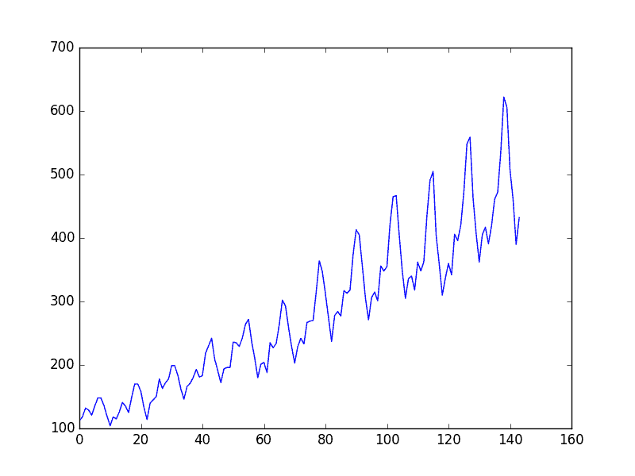
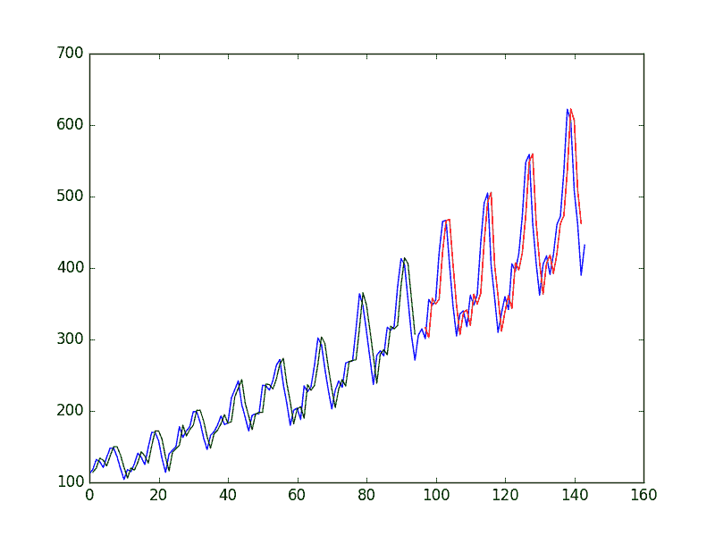

# Keras 中深度学习的时间序列预测

> 原文： [https://machinelearningmastery.com/time-series-prediction-with-deep-learning-in-python-with-keras/](https://machinelearningmastery.com/time-series-prediction-with-deep-learning-in-python-with-keras/)

时间序列预测是框架和机器学习解决的难题。

在这篇文章中，您将了解如何使用 Keras 深度学习库在 Python 中开发用于时间序列预测的神经网络模型。

阅读这篇文章后你会知道：

*   关于航空公司乘客单变量时间序列预测问题。
*   如何将时间序列预测作为回归问题，并为其开发神经网络模型。
*   如何构建具有时滞的时间序列预测，并为其开发神经网络模型。

让我们开始吧。

*   **2016 年 10 月更新**：用更准确的版本替换图表，评论了第一种方法的有限表现。
*   **2017 年 3 月更新**：更新了 Keras 2.0.2，TensorFlow 1.0.1 和 Theano 0.9.0 的示例。

## 问题描述

我们将在这篇文章中看到的问题是国际航空公司乘客预测问题。

这是一个问题，给定一年零一个月，任务是以 1,000 为单位预测国际航空公司乘客的数量。数据范围从 1949 年 1 月到 1960 年 12 月或 12 年，共有 144 个观测值。

该数据集可从 [DataMarket 网页免费下载，作为 CSV 下载](https://datamarket.com/data/set/22u3/international-airline-passengers-monthly-totals-in-thousands-jan-49-dec-60#!ds=22u3&display=line)，文件名为“ _international-airline-passengers.csv_ ”。

下面是该文件前几行的示例。

```py
"Month","International airline passengers: monthly totals in thousands. Jan 49 ? Dec 60"
"1949-01",112
"1949-02",118
"1949-03",132
"1949-04",129
"1949-05",121
```

我们可以使用 Pandas 库轻松加载此数据集。鉴于每个观察以一个月的相同间隔分开，我们对日期不感兴趣。因此，当我们加载数据集时，我们可以排除第一列。

下载的数据集还有页脚信息，我们可以将 **skipfooter** 参数排除到 **pandas.read_csv（）**为 3 页脚行设置为 3。加载后，我们可以轻松绘制整个数据集。下面列出了加载和绘制数据集的代码。

```py
import pandas
import matplotlib.pyplot as plt
dataset = pandas.read_csv('international-airline-passengers.csv', usecols=[1], engine='python', skipfooter=3)
plt.plot(dataset)
plt.show()
```

您可以在情节中看到上升趋势。

您还可以看到数据集的某些周期性，这可能与北半球夏季假期相对应。



航空公司乘客数据集的情节

我们将保持简单并按原样处理数据。

通常，研究各种数据准备技术以重新调整数据并使其静止是一个好主意。

## 多层感知器回归

我们想将时间序列预测问题表述为回归问题。

也就是说，考虑到本月的乘客人数（以千人为单位），下个月的乘客数量是多少。

我们可以编写一个简单的函数将我们的单列数据转换为两列数据集。第一列包含本月的（t）乘客数，第二列包含下个月的（t + 1）乘客数，需要预测。

在我们开始之前，让我们首先导入我们打算使用的所有函数和类。这假设一个工作的 SciPy 环境安装了 Keras 深度学习库。

```py
import numpy
import matplotlib.pyplot as plt
import pandas
from keras.models import Sequential
from keras.layers import Dense
```

在我们做任何事情之前，最好修复随机数种子以确保我们的结果可重复。

```py
# fix random seed for reproducibility
numpy.random.seed(7)
```

我们还可以使用上一节中的代码将数据集作为 Pandas 数据帧加载。然后，我们可以从数据帧中提取 NumPy 数组，并将整数值转换为更适合使用神经网络建模的浮点值。

```py
# load the dataset
dataframe = pandas.read_csv('international-airline-passengers.csv', usecols=[1], engine='python', skipfooter=3)
dataset = dataframe.values
dataset = dataset.astype('float32')
```

在我们对数据建模并估计模型在训练数据集上的技能之后，我们需要了解模型在新的看不见的数据上的技能。对于正常的分类或回归问题，我们将使用交叉验证来完成此操作。

对于时间序列数据，值的序列很重要。我们可以使用的一种简单方法是将有序数据集拆分为训练和测试数据集。下面的代码计算分裂点的索引，并将数据分成训练数据集，其中 67％的观测值可用于训练我们的模型，剩余的 33％用于测试模型。

```py
# split into train and test sets
train_size = int(len(dataset) * 0.67)
test_size = len(dataset) - train_size
train, test = dataset[0:train_size,:], dataset[train_size:len(dataset),:]
print(len(train), len(test))
```

现在我们可以定义一个函数来创建一个新的数据集，如上所述。该函数有两个参数，数据集是我们想要转换成数据集的 NumPy 数组，而 **look_back** 是用作预测下一个时间段的输入变量的先前时间步数，在这种情况下，默认为 1。

此默认值将创建一个数据集，其中 X 是给定时间（t）的乘客数量，Y 是下次乘客的数量（t + 1）。

它可以配置，我们将在下一节中介绍构建不同形状的数据集。

```py
# convert an array of values into a dataset matrix
def create_dataset(dataset, look_back=1):
	dataX, dataY = [], []
	for i in range(len(dataset)-look_back-1):
		a = dataset[i:(i+look_back), 0]
		dataX.append(a)
		dataY.append(dataset[i + look_back, 0])
	return numpy.array(dataX), numpy.array(dataY)
```

让我们看看这个函数对数据集的前几行的影响。

```py
X		Y
112		118
118		132
132		129
129		121
121		135
```

如果将前 5 行与上一节中列出的原始数据集样本进行比较，则可以在数字中看到 X = t 和 Y = t + 1 模式。

让我们使用这个函数来准备准备建模的训练和测试数据集。

```py
# reshape into X=t and Y=t+1
look_back = 1
trainX, trainY = create_dataset(train, look_back)
testX, testY = create_dataset(test, look_back)
```

我们现在可以在训练数据中使用多层感知器模型。

我们使用一个简单的网络，1 个输入，1 个隐藏层，8 个神经元和一个输出层。使用均方误差拟合模型，如果我们取平方根，则以数据集为单位给出误差分数。

我尝试了一些粗略的参数并确定了下面的配置，但绝不是网络列出了优化。

```py
# create and fit Multilayer Perceptron model
model = Sequential()
model.add(Dense(8, input_dim=look_back, activation='relu'))
model.add(Dense(1))
model.compile(loss='mean_squared_error', optimizer='adam')
model.fit(trainX, trainY, epochs=200, batch_size=2, verbose=2)
```

一旦模型拟合，我们就可以估计模型在训练和测试数据集上的表现。这将为我们提供新模型的比较点。

```py
# Estimate model performance
trainScore = model.evaluate(trainX, trainY, verbose=0)
print('Train Score: %.2f MSE (%.2f RMSE)' % (trainScore, math.sqrt(trainScore)))
testScore = model.evaluate(testX, testY, verbose=0)
print('Test Score: %.2f MSE (%.2f RMSE)' % (testScore, math.sqrt(testScore)))
```

最后，我们可以使用模型为训练和测试数据集生成预测，以获得模型技能的直观指示。

由于数据集是如何准备的，我们必须改变预测，以便它们在 x 轴上与原始数据集一致。准备好后，绘制数据，以蓝色显示原始数据集，以绿色显示训练数据集的预测，以红色显示未见测试数据集的预测。

```py
# generate predictions for training
trainPredict = model.predict(trainX)
testPredict = model.predict(testX)

# shift train predictions for plotting
trainPredictPlot = numpy.empty_like(dataset)
trainPredictPlot[:, :] = numpy.nan
trainPredictPlot[look_back:len(trainPredict)+look_back, :] = trainPredict

# shift test predictions for plotting
testPredictPlot = numpy.empty_like(dataset)
testPredictPlot[:, :] = numpy.nan
testPredictPlot[len(trainPredict)+(look_back*2)+1:len(dataset)-1, :] = testPredict

# plot baseline and predictions
plt.plot(dataset)
plt.plot(trainPredictPlot)
plt.plot(testPredictPlot)
plt.show()
```

我们可以看到该模型在拟合训练和测试数据集方面做得很差。它基本上预测了与输出相同的输入值。



神经网络的原始时间序列预测
蓝色=整个数据集，绿色=训练，红色=预测

为完整起见，以下是整个代码清单。

```py
# Multilayer Perceptron to Predict International Airline Passengers (t+1, given t)
import numpy
import matplotlib.pyplot as plt
import pandas
import math
from keras.models import Sequential
from keras.layers import Dense
# fix random seed for reproducibility
numpy.random.seed(7)
# load the dataset
dataframe = pandas.read_csv('international-airline-passengers.csv', usecols=[1], engine='python', skipfooter=3)
dataset = dataframe.values
dataset = dataset.astype('float32')
# split into train and test sets
train_size = int(len(dataset) * 0.67)
test_size = len(dataset) - train_size
train, test = dataset[0:train_size,:], dataset[train_size:len(dataset),:]
print(len(train), len(test))
# convert an array of values into a dataset matrix
def create_dataset(dataset, look_back=1):
	dataX, dataY = [], []
	for i in range(len(dataset)-look_back-1):
		a = dataset[i:(i+look_back), 0]
		dataX.append(a)
		dataY.append(dataset[i + look_back, 0])
	return numpy.array(dataX), numpy.array(dataY)
# reshape into X=t and Y=t+1
look_back = 1
trainX, trainY = create_dataset(train, look_back)
testX, testY = create_dataset(test, look_back)
# create and fit Multilayer Perceptron model
model = Sequential()
model.add(Dense(8, input_dim=look_back, activation='relu'))
model.add(Dense(1))
model.compile(loss='mean_squared_error', optimizer='adam')
model.fit(trainX, trainY, epochs=200, batch_size=2, verbose=2)
# Estimate model performance
trainScore = model.evaluate(trainX, trainY, verbose=0)
print('Train Score: %.2f MSE (%.2f RMSE)' % (trainScore, math.sqrt(trainScore)))
testScore = model.evaluate(testX, testY, verbose=0)
print('Test Score: %.2f MSE (%.2f RMSE)' % (testScore, math.sqrt(testScore)))
# generate predictions for training
trainPredict = model.predict(trainX)
testPredict = model.predict(testX)
# shift train predictions for plotting
trainPredictPlot = numpy.empty_like(dataset)
trainPredictPlot[:, :] = numpy.nan
trainPredictPlot[look_back:len(trainPredict)+look_back, :] = trainPredict
# shift test predictions for plotting
testPredictPlot = numpy.empty_like(dataset)
testPredictPlot[:, :] = numpy.nan
testPredictPlot[len(trainPredict)+(look_back*2)+1:len(dataset)-1, :] = testPredict
# plot baseline and predictions
plt.plot(dataset)
plt.plot(trainPredictPlot)
plt.plot(testPredictPlot)
plt.show()
```

运行模型会生成以下输出。

```py
Epoch 195/200
0s - loss: 536.7014
Epoch 196/200
0s - loss: 555.4216
Epoch 197/200
0s - loss: 552.2841
Epoch 198/200
0s - loss: 541.2220
Epoch 199/200
0s - loss: 542.3288
Epoch 200/200
0s - loss: 534.2096
Train Score: 532.59 MSE (23.08 RMSE)
Test Score: 2358.07 MSE (48.56 RMSE)
```

根据表现估计的平方根，我们可以看到该模型在训练数据集上有 23 名乘客（以千计）的平均误差，在测试数据集上有 48 名乘客（以千计）。

## 多层感知器使用窗口方法

我们还可以对问题进行短语，以便可以使用多个最近的时间步骤来对下一个时间步进行预测。

这称为窗口方法，窗口的大小是可以针对每个问题调整的参数。

例如，给定当前时间（t）我们想要预测序列中下一次的值（t + 1），我们可以使用当前时间（t）以及前两次（t-1 和 T-2）。

当表达为回归问题时，输入变量为 t-2，t-1，t，输出变量为 t + 1。

我们在上一节中编写的 **create_dataset（）**函数允许我们通过将 **look_back** 参数从 1 增加到 3 来创建时间序列问题的这个公式。

具有此秘籍的数据集样本如下所示：

```py
X1	X2	X3	Y
112	118	132	129
118	132	129	121
132	129	121	135
129	121	135	148
121	135	148	148
```

我们可以使用更大的窗口大小重新运行上一节中的示例。我们将增加网络容量来处理附加信息。第一个隐藏层增加到 14 个神经元，第二个隐藏层增加了 8 个神经元。时代数也增加到 400。

为了完整性，下面列出了仅包含窗口大小更改的整个代码清单。

```py
# Multilayer Perceptron to Predict International Airline Passengers (t+1, given t, t-1, t-2)
import numpy
import matplotlib.pyplot as plt
from pandas import read_csv
import math
from keras.models import Sequential
from keras.layers import Dense

# convert an array of values into a dataset matrix
def create_dataset(dataset, look_back=1):
	dataX, dataY = [], []
	for i in range(len(dataset)-look_back-1):
		a = dataset[i:(i+look_back), 0]
		dataX.append(a)
		dataY.append(dataset[i + look_back, 0])
	return numpy.array(dataX), numpy.array(dataY)

# fix random seed for reproducibility
numpy.random.seed(7)
# load the dataset
dataframe = read_csv('international-airline-passengers.csv', usecols=[1], engine='python', skipfooter=3)
dataset = dataframe.values
dataset = dataset.astype('float32')
# split into train and test sets
train_size = int(len(dataset) * 0.67)
test_size = len(dataset) - train_size
train, test = dataset[0:train_size,:], dataset[train_size:len(dataset),:]
# reshape dataset
look_back = 3
trainX, trainY = create_dataset(train, look_back)
testX, testY = create_dataset(test, look_back)
# create and fit Multilayer Perceptron model
model = Sequential()
model.add(Dense(12, input_dim=look_back, activation='relu'))
model.add(Dense(8, activation='relu'))
model.add(Dense(1))
model.compile(loss='mean_squared_error', optimizer='adam')
model.fit(trainX, trainY, epochs=400, batch_size=2, verbose=2)
# Estimate model performance
trainScore = model.evaluate(trainX, trainY, verbose=0)
print('Train Score: %.2f MSE (%.2f RMSE)' % (trainScore, math.sqrt(trainScore)))
testScore = model.evaluate(testX, testY, verbose=0)
print('Test Score: %.2f MSE (%.2f RMSE)' % (testScore, math.sqrt(testScore)))
# generate predictions for training
trainPredict = model.predict(trainX)
testPredict = model.predict(testX)
# shift train predictions for plotting
trainPredictPlot = numpy.empty_like(dataset)
trainPredictPlot[:, :] = numpy.nan
trainPredictPlot[look_back:len(trainPredict)+look_back, :] = trainPredict
# shift test predictions for plotting
testPredictPlot = numpy.empty_like(dataset)
testPredictPlot[:, :] = numpy.nan
testPredictPlot[len(trainPredict)+(look_back*2)+1:len(dataset)-1, :] = testPredict
# plot baseline and predictions
plt.plot(dataset)
plt.plot(trainPredictPlot)
plt.plot(testPredictPlot)
plt.show()
```

运行该示例提供以下输出。

```py
Epoch 395/400
0s - loss: 485.3482
Epoch 396/400
0s - loss: 479.9485
Epoch 397/400
0s - loss: 497.2707
Epoch 398/400
0s - loss: 489.5670
Epoch 399/400
0s - loss: 490.8099
Epoch 400/400
0s - loss: 493.6544
Train Score: 564.03 MSE (23.75 RMSE)
Test Score: 2244.82 MSE (47.38 RMSE)
```

我们可以看到，与上一节相比，误差没有明显减少。

查看图表，我们可以在预测中看到更多结构。

同样，窗口大小和网络架构没有调整，这只是如何构建预测问题的演示。

根据绩效分数的平方根，我们可以看到训练数据集的平均误差为 23 名乘客（每月数千人），未见测试集的平均误差为 47 名乘客（每月数千人）。


使用神经网络的时间序列预测的窗口方法
蓝色=整个数据集，绿色=训练，红色=预测

## 摘要

在这篇文章中，您了解了如何使用 Keras 深度学习库为时间序列预测问题开发神经网络模型。

完成本教程后，您现在知道：

*   关于国际航空公司旅客预测时间序列数据集。
*   如何将时间序列预测问题构建为回归问题并开发神经网络模型。
*   如何使用窗口方法构建时间序列预测问题并开发神经网络模型。

您对神经网络或此帖的时间序列预测有任何疑问吗？
在下面的评论中提出您的问题，我会尽力回答。