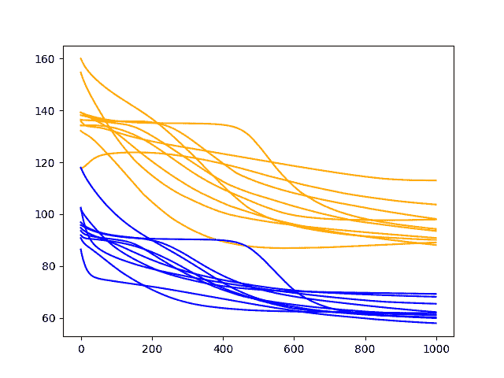
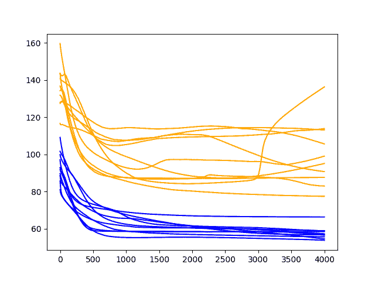
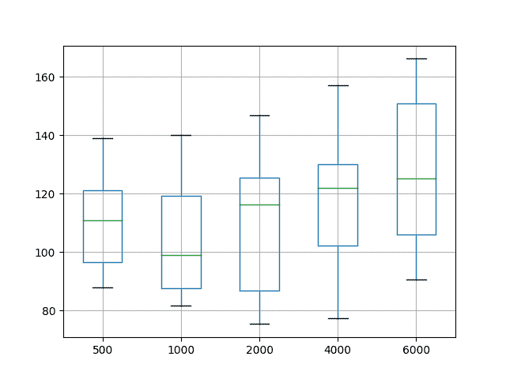
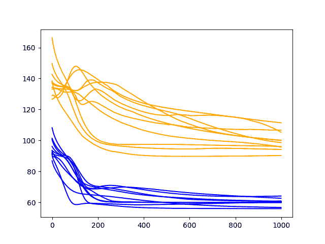
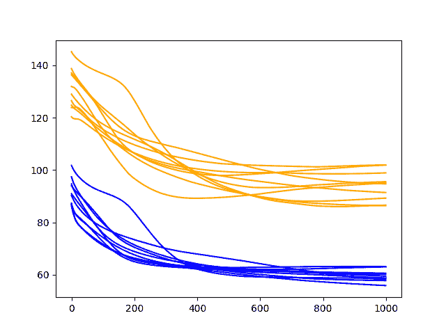

# 如何用 Keras 调整 LSTM 超参数进行时间序列预测

> 原文： [https://machinelearningmastery.com/tune-lstm-hyperparameters-keras-time-series-forecasting/](https://machinelearningmastery.com/tune-lstm-hyperparameters-keras-time-series-forecasting/)

配置神经网络很困难，因为没有关于如何做到这一点的好理论。

您必须系统地从探索的动态和客观结果点探索不同的配置，以尝试理解给定预测建模问题的发生情况。

在本教程中，您将了解如何在时间序列预测问题上探索如何配置 LSTM 网络。

完成本教程后，您将了解：

*   如何调整和解释训练时期数的结果。
*   如何调整和解释训练批次大小的结果。
*   如何调整和解释神经元数量的结果。

让我们开始吧。


如何用 Keras 调整 LSTM 超参数用于时间序列预测
照片由 [David Saddler](https://www.flickr.com/photos/80502454@N00/6585205675/) 保留，保留一些权利。

## 教程概述

本教程分为 6 个部分;他们是：

1.  洗发水销售数据集
2.  实验测试线束
3.  调整时代数量
4.  调整批量大小
5.  调整神经元数量
6.  结果摘要

### 环境

本教程假定您已安装 Python SciPy 环境。您可以在此示例中使用 Python 2 或 3。

本教程假设您安装了 TensorFlow 或 Theano 后端的 Keras v2.0 或更高版本。

本教程还假设您安装了 scikit-learn，Pandas，NumPy 和 Matplotlib。

如果您在设置 Python 环境时需要帮助，请参阅以下帖子：

*   [如何使用 Anaconda 设置用于机器学习和深度学习的 Python 环境](http://machinelearningmastery.com/setup-python-environment-machine-learning-deep-learning-anaconda/)

## 洗发水销售数据集

该数据集描述了 3 年期间每月洗发水的销售数量。

单位是销售计数，有 36 个观察。原始数据集归功于 Makridakis，Wheelwright 和 Hyndman（1998）。

[您可以在此处下载并了解有关数据集的更多信息](https://datamarket.com/data/set/22r0/sales-of-shampoo-over-a-three-year-period)。

下面的示例加载并创建已加载数据集的图。

```py
# load and plot dataset
from pandas import read_csv
from pandas import datetime
from matplotlib import pyplot
# load dataset
def parser(x):
	return datetime.strptime('190'+x, '%Y-%m')
series = read_csv('shampoo-sales.csv', header=0, parse_dates=[0], index_col=0, squeeze=True, date_parser=parser)
# summarize first few rows
print(series.head())
# line plot
series.plot()
pyplot.show()
```

运行该示例将数据集作为 Pandas Series 加载并打印前 5 行。

```py
Month
1901-01-01 266.0
1901-02-01 145.9
1901-03-01 183.1
1901-04-01 119.3
1901-05-01 180.3
Name: Sales, dtype: float64
```

然后创建该系列的线图，显示明显的增加趋势。


洗发水销售数据集的线图

接下来，我们将了解实验中使用的 LSTM 配置和测试工具。

## 实验测试线束

本节介绍本教程中使用的测试工具。

### 数据拆分

我们将 Shampoo Sales 数据集分为两部分：训练和测试集。

前两年的数据将用于训练数据集，剩余的一年数据将用于测试集。

将使用训练数据集开发模型，并对测试数据集进行预测。

测试数据集的持久性预测（朴素预测）实现了每月洗发水销售 136.761 的错误。这在测试集上提供了较低的可接受表现限制。

### 模型评估

将使用滚动预测场景，也称为前进模型验证。

测试数据集的每个时间步骤将一次一个地走。将使用模型对时间步长进行预测，然后将获取测试集的实际预期值，并使其可用于下一时间步的预测模型。

这模仿了一个真实世界的场景，每个月都会有新的洗发水销售观察结果，并用于下个月的预测。

这将通过列车和测试数据集的结构进行模拟。我们将以一次性方法进行所有预测。

将收集关于测试数据集的所有预测，并计算错误分数以总结模型的技能。将使用均方根误差（RMSE），因为它会对大错误进行处罚，并产生与预测数据相同的分数，即每月洗发水销售额。

### 数据准备

在我们将 LSTM 模型拟合到数据集之前，我们必须转换数据。

在拟合模型和进行预测之前，对数据集执行以下三个数据变换。

1.  转换时间序列数据，使其静止不动。具体而言，滞后= 1 差分以消除数据中的增加趋势。
2.  将时间序列转换为监督学习问题。具体而言，将数据组织成输入和输出模式，其中前一时间步的观察被用作预测当前时间步的观察的输入
3.  将观察结果转换为具有特定比例。具体而言，要将数据重新调整为-1 到 1 之间的值，以满足 LSTM 模型的默认双曲正切激活函数。

这些变换在预测时反转，在计算和误差分数之前将它们恢复到原始比例。

### 实验运行

每个实验场景将运行 10 次。

其原因在于，每次训练给定配置时，LSTM 网络的随机初始条件可能导致非常不同的结果。

诊断方法将用于研究模型配置。这是创建和研究模型技能随时间变化的线图（称为时期的训练迭代），以深入了解给定配置如何执行以及如何调整以获得更好的表现。

在每个时期结束时，将在列车和测试数据集上评估模型，并保存 RMSE 分数。

打印每个方案结束时的列车和测试 RMSE 分数，以指示进度。

一系列列车和测试 RMSE 得分在运行结束时绘制为线图。火车得分为蓝色，考试成绩为橙色。

让我们深入研究结果。

## 调整时代数量

我们将看调整的第一个 LSTM 参数是训练时期的数量。

该模型将使用批量大小为 4 和单个神经元。我们将探讨针对不同数量的训练时期训练此配置的效果。

### 500 个时代的诊断

下面列出了此诊断的完整代码清单。

代码的评论相当好，应该很容易理解。此代码将成为本教程中所有未来实验的基础，并且仅列出每个后续实验中所做的更改。

```py
from pandas import DataFrame
from pandas import Series
from pandas import concat
from pandas import read_csv
from pandas import datetime
from sklearn.metrics import mean_squared_error
from sklearn.preprocessing import MinMaxScaler
from keras.models import Sequential
from keras.layers import Dense
from keras.layers import LSTM
from math import sqrt
import matplotlib
# be able to save images on server
matplotlib.use('Agg')
from matplotlib import pyplot
import numpy

# date-time parsing function for loading the dataset
def parser(x):
	return datetime.strptime('190'+x, '%Y-%m')

# frame a sequence as a supervised learning problem
def timeseries_to_supervised(data, lag=1):
	df = DataFrame(data)
	columns = [df.shift(i) for i in range(1, lag+1)]
	columns.append(df)
	df = concat(columns, axis=1)
	df = df.drop(0)
	return df

# create a differenced series
def difference(dataset, interval=1):
	diff = list()
	for i in range(interval, len(dataset)):
		value = dataset[i] - dataset[i - interval]
		diff.append(value)
	return Series(diff)

# scale train and test data to [-1, 1]
def scale(train, test):
	# fit scaler
	scaler = MinMaxScaler(feature_range=(-1, 1))
	scaler = scaler.fit(train)
	# transform train
	train = train.reshape(train.shape[0], train.shape[1])
	train_scaled = scaler.transform(train)
	# transform test
	test = test.reshape(test.shape[0], test.shape[1])
	test_scaled = scaler.transform(test)
	return scaler, train_scaled, test_scaled

# inverse scaling for a forecasted value
def invert_scale(scaler, X, yhat):
	new_row = [x for x in X] + [yhat]
	array = numpy.array(new_row)
	array = array.reshape(1, len(array))
	inverted = scaler.inverse_transform(array)
	return inverted[0, -1]

# evaluate the model on a dataset, returns RMSE in transformed units
def evaluate(model, raw_data, scaled_dataset, scaler, offset, batch_size):
	# separate
	X, y = scaled_dataset[:,0:-1], scaled_dataset[:,-1]
	# reshape
	reshaped = X.reshape(len(X), 1, 1)
	# forecast dataset
	output = model.predict(reshaped, batch_size=batch_size)
	# invert data transforms on forecast
	predictions = list()
	for i in range(len(output)):
		yhat = output[i,0]
		# invert scaling
		yhat = invert_scale(scaler, X[i], yhat)
		# invert differencing
		yhat = yhat + raw_data[i]
		# store forecast
		predictions.append(yhat)
	# report performance
	rmse = sqrt(mean_squared_error(raw_data[1:], predictions))
	return rmse

# fit an LSTM network to training data
def fit_lstm(train, test, raw, scaler, batch_size, nb_epoch, neurons):
	X, y = train[:, 0:-1], train[:, -1]
	X = X.reshape(X.shape[0], 1, X.shape[1])
	# prepare model
	model = Sequential()
	model.add(LSTM(neurons, batch_input_shape=(batch_size, X.shape[1], X.shape[2]), stateful=True))
	model.add(Dense(1))
	model.compile(loss='mean_squared_error', optimizer='adam')
	# fit model
	train_rmse, test_rmse = list(), list()
	for i in range(nb_epoch):
		model.fit(X, y, epochs=1, batch_size=batch_size, verbose=0, shuffle=False)
		model.reset_states()
		# evaluate model on train data
		raw_train = raw[-(len(train)+len(test)+1):-len(test)]
		train_rmse.append(evaluate(model, raw_train, train, scaler, 0, batch_size))
		model.reset_states()
		# evaluate model on test data
		raw_test = raw[-(len(test)+1):]
		test_rmse.append(evaluate(model, raw_test, test, scaler, 0, batch_size))
		model.reset_states()
	history = DataFrame()
	history['train'], history['test'] = train_rmse, test_rmse
	return history

# run diagnostic experiments
def run():
	# load dataset
	series = read_csv('shampoo-sales.csv', header=0, parse_dates=[0], index_col=0, squeeze=True, date_parser=parser)
	# transform data to be stationary
	raw_values = series.values
	diff_values = difference(raw_values, 1)
	# transform data to be supervised learning
	supervised = timeseries_to_supervised(diff_values, 1)
	supervised_values = supervised.values
	# split data into train and test-sets
	train, test = supervised_values[0:-12], supervised_values[-12:]
	# transform the scale of the data
	scaler, train_scaled, test_scaled = scale(train, test)
	# fit and evaluate model
	train_trimmed = train_scaled[2:, :]
	# config
	repeats = 10
	n_batch = 4
	n_epochs = 500
	n_neurons = 1
	# run diagnostic tests
	for i in range(repeats):
		history = fit_lstm(train_trimmed, test_scaled, raw_values, scaler, n_batch, n_epochs, n_neurons)
		pyplot.plot(history['train'], color='blue')
		pyplot.plot(history['test'], color='orange')
		print('%d) TrainRMSE=%f, TestRMSE=%f' % (i, history['train'].iloc[-1], history['test'].iloc[-1]))
	pyplot.savefig('epochs_diagnostic.png')

# entry point
run()
```

运行实验在 10 次实验运行的每一次结束时打印列车的 RMSE 和测试集。

```py
0) TrainRMSE=63.495594, TestRMSE=113.472643
1) TrainRMSE=60.446307, TestRMSE=100.147470
2) TrainRMSE=59.879681, TestRMSE=95.112331
3) TrainRMSE=66.115269, TestRMSE=106.444401
4) TrainRMSE=61.878702, TestRMSE=86.572920
5) TrainRMSE=73.519382, TestRMSE=103.551694
6) TrainRMSE=64.407033, TestRMSE=98.849227
7) TrainRMSE=72.684834, TestRMSE=98.499976
8) TrainRMSE=77.593773, TestRMSE=124.404747
9) TrainRMSE=71.749335, TestRMSE=126.396615
```

还创建了在每个训练时期之后列车和测试集上的一系列 RMSE 得分的线图。


500 个时期的诊断结果

结果清楚地表明 RMSE 在几乎所有实验运行的训练时期都呈下降趋势。

这是一个好兆头，因为它表明模型正在学习问题并具有一些预测技巧。实际上，所有最终测试分数都低于简单持久性模型（朴素预测）的误差，该模型在此问题上达到了 136.761 的 RMSE。

结果表明，更多的训练时期将导致更熟练的模型。

让我们尝试将时期数从 500 增加到 1000。

### 1000 个时期的诊断

在本节中，我们使用相同的实验设置，并使模型适合 1000 个训练时期。

具体地， _n_epochs_ 参数在 _run（）_ 函数中被设置为 _1000_ 。

```py
n_epochs = 1000
```

运行该示例为最后一个时期的列车和测试集打印 RMSE。

```py
0) TrainRMSE=69.242394, TestRMSE=90.832025
1) TrainRMSE=65.445810, TestRMSE=113.013681
2) TrainRMSE=57.949335, TestRMSE=103.727228
3) TrainRMSE=61.808586, TestRMSE=89.071392
4) TrainRMSE=68.127167, TestRMSE=88.122807
5) TrainRMSE=61.030678, TestRMSE=93.526607
6) TrainRMSE=61.144466, TestRMSE=97.963895
7) TrainRMSE=59.922150, TestRMSE=94.291120
8) TrainRMSE=60.170052, TestRMSE=90.076229
9) TrainRMSE=62.232470, TestRMSE=98.174839
```

还创建了每个时期的测试和训练 RMSE 得分的线图。



1000 个时期的诊断结果

我们可以看到模型误差的下降趋势确实继续并且似乎变慢。

火车和测试案例的线条变得更加横向，但仍然普遍呈下降趋势，尽管变化率较低。测试误差的一些示例显示可能的拐点大约 600 个时期并且可能显示出上升趋势。

值得进一步延长时代。我们对测试集中的平均表现持续改进感兴趣，这可能会持续下去。

让我们尝试将时期数从 1000 增加到 2000。

### 2000 年的诊断

在本节中，我们使用相同的实验设置，并使模型适合 2000 个训练时期。

具体地，在 _run（）_ 函数中将 _n_epochs_ 参数设置为 2000。

```py
n_epochs = 2000
```

运行该示例为最后一个时期的列车和测试集打印 RMSE。

```py
0) TrainRMSE=67.292970, TestRMSE=83.096856
1) TrainRMSE=55.098951, TestRMSE=104.211509
2) TrainRMSE=69.237206, TestRMSE=117.392007
3) TrainRMSE=61.319941, TestRMSE=115.868142
4) TrainRMSE=60.147575, TestRMSE=87.793270
5) TrainRMSE=59.424241, TestRMSE=99.000790
6) TrainRMSE=66.990082, TestRMSE=80.490660
7) TrainRMSE=56.467012, TestRMSE=97.799062
8) TrainRMSE=60.386380, TestRMSE=103.810569
9) TrainRMSE=58.250862, TestRMSE=86.212094
```

还创建了每个时期的测试和训练 RMSE 得分的线图。


2000 年的诊断结果

正如人们可能已经猜到的那样，在列车和测试数据集的额外 1000 个时期内，误差的下降趋势仍在继续。

值得注意的是，大约一半的案例一直持续减少到运行结束，而其余案件则显示出增长趋势的迹象。

增长的趋势是过度拟合的迹象。这是模型过度拟合训练数据集的代价，代价是测试数据集的表现更差。通过对训练数据集的持续改进以及随后的测试数据集中的拐点和恶化技能的改进来举例说明。不到一半的运行显示了测试数据集中此类模式的开始。

然而，测试数据集的最终时期结果非常好。如果有机会我们可以通过更长时间的训练获得进一步的收益，我们必须探索它。

让我们尝试将 2000 年到 4000 年的时期数量加倍。

### 4000 个时代的诊断

在本节中，我们使用相同的实验设置，并使模型适合超过 4000 个训练时期。

具体地，在 _run（）_ 函数中将 _n_epochs_ 参数设置为 4000。

```py
n_epochs = 4000
```

运行该示例为最后一个时期的列车和测试集打印 RMSE。

```py
0) TrainRMSE=58.889277, TestRMSE=99.121765
1) TrainRMSE=56.839065, TestRMSE=95.144846
2) TrainRMSE=58.522271, TestRMSE=87.671309
3) TrainRMSE=53.873962, TestRMSE=113.920076
4) TrainRMSE=66.386299, TestRMSE=77.523432
5) TrainRMSE=58.996230, TestRMSE=136.367014
6) TrainRMSE=55.725800, TestRMSE=113.206607
7) TrainRMSE=57.334604, TestRMSE=90.814642
8) TrainRMSE=54.593069, TestRMSE=105.724825
9) TrainRMSE=56.678498, TestRMSE=83.082262
```

还创建了每个时期的测试和训练 RMSE 得分的线图。



4000 个时期的诊断结果

类似的模式仍在继续。

即使在 4000 个时代，也存在改善表现的总趋势。有一种严重过度拟合的情况，其中测试误差急剧上升。

同样，大多数运行以“良好”（优于持久性）最终测试错误结束。

### 结果摘要

上面的诊断运行有助于探索模型的动态行为，但缺乏客观和可比较的平均表现。

我们可以通过重复相同的实验并计算和比较每个配置的摘要统计数据来解决这个问题。在这种情况下，30 个运行完成了迭代值 500,1000,2000,4000 和 6000。

我们的想法是在大量运行中使用汇总统计数据比较配置，并确切地了解哪些配置可能在平均情况下表现更好。

完整的代码示例如下所示。

```py
from pandas import DataFrame
from pandas import Series
from pandas import concat
from pandas import read_csv
from pandas import datetime
from sklearn.metrics import mean_squared_error
from sklearn.preprocessing import MinMaxScaler
from keras.models import Sequential
from keras.layers import Dense
from keras.layers import LSTM
from math import sqrt
import matplotlib
# be able to save images on server
matplotlib.use('Agg')
from matplotlib import pyplot
import numpy

# date-time parsing function for loading the dataset
def parser(x):
	return datetime.strptime('190'+x, '%Y-%m')

# frame a sequence as a supervised learning problem
def timeseries_to_supervised(data, lag=1):
	df = DataFrame(data)
	columns = [df.shift(i) for i in range(1, lag+1)]
	columns.append(df)
	df = concat(columns, axis=1)
	df = df.drop(0)
	return df

# create a differenced series
def difference(dataset, interval=1):
	diff = list()
	for i in range(interval, len(dataset)):
		value = dataset[i] - dataset[i - interval]
		diff.append(value)
	return Series(diff)

# invert differenced value
def inverse_difference(history, yhat, interval=1):
	return yhat + history[-interval]

# scale train and test data to [-1, 1]
def scale(train, test):
	# fit scaler
	scaler = MinMaxScaler(feature_range=(-1, 1))
	scaler = scaler.fit(train)
	# transform train
	train = train.reshape(train.shape[0], train.shape[1])
	train_scaled = scaler.transform(train)
	# transform test
	test = test.reshape(test.shape[0], test.shape[1])
	test_scaled = scaler.transform(test)
	return scaler, train_scaled, test_scaled

# inverse scaling for a forecasted value
def invert_scale(scaler, X, yhat):
	new_row = [x for x in X] + [yhat]
	array = numpy.array(new_row)
	array = array.reshape(1, len(array))
	inverted = scaler.inverse_transform(array)
	return inverted[0, -1]

# fit an LSTM network to training data
def fit_lstm(train, batch_size, nb_epoch, neurons):
	X, y = train[:, 0:-1], train[:, -1]
	X = X.reshape(X.shape[0], 1, X.shape[1])
	model = Sequential()
	model.add(LSTM(neurons, batch_input_shape=(batch_size, X.shape[1], X.shape[2]), stateful=True))
	model.add(Dense(1))
	model.compile(loss='mean_squared_error', optimizer='adam')
	for i in range(nb_epoch):
		model.fit(X, y, epochs=1, batch_size=batch_size, verbose=0, shuffle=False)
		model.reset_states()
	return model

# run a repeated experiment
def experiment(repeats, series, epochs):
	# transform data to be stationary
	raw_values = series.values
	diff_values = difference(raw_values, 1)
	# transform data to be supervised learning
	supervised = timeseries_to_supervised(diff_values, 1)
	supervised_values = supervised.values
	# split data into train and test-sets
	train, test = supervised_values[0:-12], supervised_values[-12:]
	# transform the scale of the data
	scaler, train_scaled, test_scaled = scale(train, test)
	# run experiment
	error_scores = list()
	for r in range(repeats):
		# fit the model
		batch_size = 4
		train_trimmed = train_scaled[2:, :]
		lstm_model = fit_lstm(train_trimmed, batch_size, epochs, 1)
		# forecast the entire training dataset to build up state for forecasting
		train_reshaped = train_trimmed[:, 0].reshape(len(train_trimmed), 1, 1)
		lstm_model.predict(train_reshaped, batch_size=batch_size)
		# forecast test dataset
		test_reshaped = test_scaled[:,0:-1]
		test_reshaped = test_reshaped.reshape(len(test_reshaped), 1, 1)
		output = lstm_model.predict(test_reshaped, batch_size=batch_size)
		predictions = list()
		for i in range(len(output)):
			yhat = output[i,0]
			X = test_scaled[i, 0:-1]
			# invert scaling
			yhat = invert_scale(scaler, X, yhat)
			# invert differencing
			yhat = inverse_difference(raw_values, yhat, len(test_scaled)+1-i)
			# store forecast
			predictions.append(yhat)
		# report performance
		rmse = sqrt(mean_squared_error(raw_values[-12:], predictions))
		print('%d) Test RMSE: %.3f' % (r+1, rmse))
		error_scores.append(rmse)
	return error_scores

# load dataset
series = read_csv('shampoo-sales.csv', header=0, parse_dates=[0], index_col=0, squeeze=True, date_parser=parser)
# experiment
repeats = 30
results = DataFrame()
# vary training epochs
epochs = [500, 1000, 2000, 4000, 6000]
for e in epochs:
	results[str(e)] = experiment(repeats, series, e)
# summarize results
print(results.describe())
# save boxplot
results.boxplot()
pyplot.savefig('boxplot_epochs.png')
```

首先运行代码打印 5 个配置中每个配置的摘要统计信息。值得注意的是，这包括每个结果群体的 RMSE 得分的平均值和标准差。

均值给出了配置的平均预期表现的概念，而标准偏差给出了方差的概念。最小和最大 RMSE 分数还可以了解可能预期的最佳和最差情况示例的范围。

仅查看平均 RMSE 分数，结果表明配置为 1000 的迭代可能更好。结果还表明可能需要进一步调查 1000 至 2000 年的时代价值。

```py
              500        1000        2000        4000        6000
count   30.000000   30.000000   30.000000   30.000000   30.000000
mean   109.439203  104.566259  107.882390  116.339792  127.618305
std     14.874031   19.097098   22.083335   21.590424   24.866763
min     87.747708   81.621783   75.327883   77.399968   90.512409
25%     96.484568   87.686776   86.753694  102.127451  105.861881
50%    110.891939   98.942264  116.264027  121.898248  125.273050
75%    121.067498  119.248849  125.518589  130.107772  150.832313
max    138.879278  139.928055  146.840997  157.026562  166.111151
```

分布也显示在盒子和须状图上。这有助于了解分布如何直接比较。

绿线显示中位数，方框显示第 25 和第 75 百分位数，或中间 50％的数据。该比较还表明，将时期设置为 1000 的选择优于测试的替代方案。它还表明，在 2000 年或 4000 年的时期内可以实现最佳表现，但代价是平均表现更差。



框和晶须图总结时代结果

接下来，我们将看看批量大小的影响。

## 调整批量大小

批量大小控制更新网络权重的频率。

重要的是在 Keras 中，批量大小必须是测试大小和训练数据集的一个因子。

在上一节探索训练时期的数量时，批量大小固定为 4，它完全分为测试数据集（大小为 12）和测试数据集的截断版本（大小为 20）。

在本节中，我们将探讨改变批量大小的效果。我们将训练时期的数量保持在 1000。

### 1000 个时期的诊断和 4 的批量大小

作为提醒，上一节在第二个实验中评估了批量大小为 4，其中一些时期为 1000。

结果显示出错误的下降趋势，大多数运行一直持续到最后的训练时期。


1000 个时期的诊断结果

### 1000 个时期的诊断和 2 的批量大小

在本节中，我们将批量大小从 4 减半。

对 _run（）_ 函数中的 _n_batch_ 参数进行了此更改;例如：

```py
n_batch = 2
```

运行该示例显示了与批量大小为 4 相同的总体趋势，可能在最后一个时期具有更高的 RMSE。

这些运行可能会显示出更快稳定 RMES 的行为，而不是看似继续下行趋势。

下面列出了每次运行的最终暴露的 RSME 分数。

```py
0) TrainRMSE=63.510219, TestRMSE=115.855819
1) TrainRMSE=58.336003, TestRMSE=97.954374
2) TrainRMSE=69.163685, TestRMSE=96.721446
3) TrainRMSE=65.201764, TestRMSE=110.104828
4) TrainRMSE=62.146057, TestRMSE=112.153553
5) TrainRMSE=58.253952, TestRMSE=98.442715
6) TrainRMSE=67.306530, TestRMSE=108.132021
7) TrainRMSE=63.545292, TestRMSE=102.821356
8) TrainRMSE=61.693847, TestRMSE=99.859398
9) TrainRMSE=58.348250, TestRMSE=99.682159
```

还创建了每个时期的测试和训练 RMSE 得分的线图。


1000 个时期和批量大小为 2 的诊断结果

让我们再试一次批量。

### 1000 个时期的诊断和 1 的批量大小

批量大小为 1 在技术上执行在线学习。

这是在每个训练模式之后更新网络的地方。这可以与批量学习形成对比，其中权重仅在每个时期结束时更新。

我们可以在 _run（）_ 函数中更改 _n_batch_ 参数;例如：

```py
n_batch = 1
```

同样，运行该示例将打印每次运行的最后一个时期的 RMSE 分数。

```py
0) TrainRMSE=60.349798, TestRMSE=100.182293
1) TrainRMSE=62.624106, TestRMSE=95.716070
2) TrainRMSE=64.091859, TestRMSE=98.598958
3) TrainRMSE=59.929993, TestRMSE=96.139427
4) TrainRMSE=59.890593, TestRMSE=94.173619
5) TrainRMSE=55.944968, TestRMSE=106.644275
6) TrainRMSE=60.570245, TestRMSE=99.981562
7) TrainRMSE=56.704995, TestRMSE=111.404182
8) TrainRMSE=59.909065, TestRMSE=90.238473
9) TrainRMSE=60.863807, TestRMSE=105.331214
```

还创建了每个时期的测试和训练 RMSE 得分的线图。

该图表明测试 RMSE 随时间变化的可变性更大，并且可能是火车 RMSE 比较大的批量大小更快稳定。测试 RMSE 的可变性增加是可以预期的，因为对网络进行的大量更改会给每次更新提供如此少的反馈。

该图还表明，如果配置提供更多的训练时期，RMSE 的下降趋势可能会继续。



1000 个时期和批量大小为 1 的诊断结果

### 结果摘要

与训练时期一样，我们可以客观地比较给定不同批量大小的网络表现。

每个配置运行 30 次，并根据最终结果计算汇总统计数据。

```py
...

# run a repeated experiment
def experiment(repeats, series, batch_size):
	# transform data to be stationary
	raw_values = series.values
	diff_values = difference(raw_values, 1)
	# transform data to be supervised learning
	supervised = timeseries_to_supervised(diff_values, 1)
	supervised_values = supervised.values
	# split data into train and test-sets
	train, test = supervised_values[0:-12], supervised_values[-12:]
	# transform the scale of the data
	scaler, train_scaled, test_scaled = scale(train, test)
	# run experiment
	error_scores = list()
	for r in range(repeats):
		# fit the model
		train_trimmed = train_scaled[2:, :]
		lstm_model = fit_lstm(train_trimmed, batch_size, 1000, 1)
		# forecast the entire training dataset to build up state for forecasting
		train_reshaped = train_trimmed[:, 0].reshape(len(train_trimmed), 1, 1)
		lstm_model.predict(train_reshaped, batch_size=batch_size)
		# forecast test dataset
		test_reshaped = test_scaled[:,0:-1]
		test_reshaped = test_reshaped.reshape(len(test_reshaped), 1, 1)
		output = lstm_model.predict(test_reshaped, batch_size=batch_size)
		predictions = list()
		for i in range(len(output)):
			yhat = output[i,0]
			X = test_scaled[i, 0:-1]
			# invert scaling
			yhat = invert_scale(scaler, X, yhat)
			# invert differencing
			yhat = inverse_difference(raw_values, yhat, len(test_scaled)+1-i)
			# store forecast
			predictions.append(yhat)
		# report performance
		rmse = sqrt(mean_squared_error(raw_values[-12:], predictions))
		print('%d) Test RMSE: %.3f' % (r+1, rmse))
		error_scores.append(rmse)
	return error_scores

# load dataset
series = read_csv('shampoo-sales.csv', header=0, parse_dates=[0], index_col=0, squeeze=True, date_parser=parser)
# experiment
repeats = 30
results = DataFrame()
# vary training batches
batches = [1, 2, 4]
for b in batches:
	results[str(b)] = experiment(repeats, series, b)
# summarize results
print(results.describe())
# save boxplot
results.boxplot()
pyplot.savefig('boxplot_batches.png')
```

仅从平均表现来看，结果表明较低的 RMSE，批量大小为 1.正如前一节所述，随着更多的训练时期，这可能会得到进一步改善。

```py
                1           2           4
count   30.000000   30.000000   30.000000
mean    98.697017  102.642594  100.320203
std     12.227885    9.144163   15.957767
min     85.172215   85.072441   83.636365
25%     92.023175   96.834628   87.671461
50%     95.981688  101.139527   91.628144
75%    102.009268  110.171802  114.660192
max    147.688818  120.038036  135.290829
```

还创建了数据的框和胡须图，以帮助以图形方式比较分布。该图显示了作为绿线的中值表现，其中批量大小 4 显示最大可变性和最低中值 RMSE。

调整神经网络是平均表现和该表现的可变性的折衷，理想的结果是具有低可变性的低平均误差，这意味着它通常是良好且可再现的。


框和晶须图总结批量大小结果

## 调整神经元数量

在本节中，我们将研究改变网络中神经元数量的影响。

神经元的数量会影响网络的学习能力。通常，更多的神经元能够以更长的训练时间为代价从问题中学习更多的结构。更多的学习能力也会产生可能过度拟合训练数据的问题。

我们将使用批量大小为 4 和 1000 的训练时期。

### 1000 个时期和 1 个神经元的诊断

我们将从 1 个神经元开始。

提醒一下，这是从时代实验中测试的第二个配置。


1000 个时期的诊断结果

### 1000 个时期和 2 个神经元的诊断

我们可以将神经元的数量从 1 增加到 2.这有望提高网络的学习能力。

我们可以通过改变 _run（）_ 函数中的 _n_neurons_ 变量来实现。

```py
n_neurons = 2
```

运行此配置将打印每次运行的最后一个时期的 RMSE 分数。

结果表明一般表现良好，但不是很好。

```py
0) TrainRMSE=59.466223, TestRMSE=95.554547
1) TrainRMSE=58.752515, TestRMSE=101.908449
2) TrainRMSE=58.061139, TestRMSE=86.589039
3) TrainRMSE=55.883708, TestRMSE=94.747927
4) TrainRMSE=58.700290, TestRMSE=86.393213
5) TrainRMSE=60.564511, TestRMSE=101.956549
6) TrainRMSE=63.160916, TestRMSE=98.925108
7) TrainRMSE=60.148595, TestRMSE=95.082825
8) TrainRMSE=63.029242, TestRMSE=89.285092
9) TrainRMSE=57.794717, TestRMSE=91.425071
```

还创建了每个时期的测试和训练 RMSE 得分的线图。

这更有说服力。它显示测试 RMSE 快速下降到约 500-750 迭代，其中拐点显示测试 RMSE 在所有运行中几乎全面上升。同时，训练数据集显示持续减少到最后的时期。

这些是训练数据集过度拟合的良好迹象。



1000 个时期和 2 个神经元的诊断结果

让我们看看这种趋势是否会持续更多的神经元。

### 1000 个时期和 3 个神经元的诊断

本节查看相同配置，神经元数量增加到 3。

我们可以通过在 _run（）_ 函数中设置 _n_neurons_ 变量来实现。

```py
n_neurons = 3
```

运行此配置将打印每次运行的最后一个时期的 RMSE 分数。

结果与上一节类似;我们没有看到 2 或 3 个神经元的最终时期测试分数之间有太大的差异。最终的火车得分看起来似乎低于 3 个神经元，可能表现出过度拟合的加速。

训练数据集中的拐点似乎比 2 个神经元实验更早发生，可能在 300-400 时代。

这些神经元数量的增加可能受益于减慢学习速度的额外变化。例如使用正常化方法如丢失，减少批量大小，并减少到训练时期的数量。

```py
0) TrainRMSE=55.686242, TestRMSE=90.955555
1) TrainRMSE=55.198617, TestRMSE=124.989622
2) TrainRMSE=55.767668, TestRMSE=104.751183
3) TrainRMSE=60.716046, TestRMSE=93.566307
4) TrainRMSE=57.703663, TestRMSE=110.813226
5) TrainRMSE=56.874231, TestRMSE=98.588524
6) TrainRMSE=57.206756, TestRMSE=94.386134
7) TrainRMSE=55.770377, TestRMSE=124.949862
8) TrainRMSE=56.876467, TestRMSE=95.059656
9) TrainRMSE=57.067810, TestRMSE=94.123620
```

还创建了每个时期的测试和训练 RMSE 得分的线图。


1000 个时期和 3 个神经元的诊断结果

### 结果摘要

同样，我们可以客观地比较增加神经元数量的影响，同时保持所有其他网络配置的固定。

在本节中，我们重复每个实验 30 次，并将平均测试 RMSE 表现与 1 到 5 的神经元数量进行比较。

```py
...

# run a repeated experiment
def experiment(repeats, series, neurons):
	# transform data to be stationary
	raw_values = series.values
	diff_values = difference(raw_values, 1)
	# transform data to be supervised learning
	supervised = timeseries_to_supervised(diff_values, 1)
	supervised_values = supervised.values
	# split data into train and test-sets
	train, test = supervised_values[0:-12], supervised_values[-12:]
	# transform the scale of the data
	scaler, train_scaled, test_scaled = scale(train, test)
	# run experiment
	error_scores = list()
	for r in range(repeats):
		# fit the model
		batch_size = 4
		train_trimmed = train_scaled[2:, :]
		lstm_model = fit_lstm(train_trimmed, batch_size, 1000, neurons)
		# forecast the entire training dataset to build up state for forecasting
		train_reshaped = train_trimmed[:, 0].reshape(len(train_trimmed), 1, 1)
		lstm_model.predict(train_reshaped, batch_size=batch_size)
		# forecast test dataset
		test_reshaped = test_scaled[:,0:-1]
		test_reshaped = test_reshaped.reshape(len(test_reshaped), 1, 1)
		output = lstm_model.predict(test_reshaped, batch_size=batch_size)
		predictions = list()
		for i in range(len(output)):
			yhat = output[i,0]
			X = test_scaled[i, 0:-1]
			# invert scaling
			yhat = invert_scale(scaler, X, yhat)
			# invert differencing
			yhat = inverse_difference(raw_values, yhat, len(test_scaled)+1-i)
			# store forecast
			predictions.append(yhat)
		# report performance
		rmse = sqrt(mean_squared_error(raw_values[-12:], predictions))
		print('%d) Test RMSE: %.3f' % (r+1, rmse))
		error_scores.append(rmse)
	return error_scores

# load dataset
series = read_csv('shampoo-sales.csv', header=0, parse_dates=[0], index_col=0, squeeze=True, date_parser=parser)
# experiment
repeats = 30
results = DataFrame()
# vary neurons
neurons = [1, 2, 3, 4, 5]
for n in neurons:
	results[str(n)] = experiment(repeats, series, n)
# summarize results
print(results.describe())
# save boxplot
results.boxplot()
pyplot.savefig('boxplot_neurons.png')
```

运行实验会打印每个配置的摘要统计信息。

仅从平均表现来看，结果表明具有 1 个神经元的网络配置具有超过 1000 个时期的最佳表现，批量大小为 4.此配置还显示最紧密的方差。

```py
                1           2           3           4           5
count   30.000000   30.000000   30.000000   30.000000   30.000000
mean    98.344696  103.268147  102.726894  112.453766  122.843032
std     13.538599   14.720989   12.905631   16.296657   25.586013
min     81.764721   87.731385   77.545899   85.632492   85.955093
25%     88.524334   94.040807   95.152752  102.477366  104.192588
50%     93.543948  100.330678  103.622600  110.906970  117.022724
75%    102.944050  105.087384  110.235754  118.653850  133.343669
max    132.934054  152.588092  130.551521  162.889845  184.678185
```

盒子和须状图显示中值测试集表现的明显趋势，其中神经元的增加导致测试 RMSE 的相应增加。


框和晶须图总结神经元结果

## 所有结果摘要

我们在本教程的 Shampoo Sales 数据集上完成了很多 LSTM 实验。

通常，似乎配置有 1 个神经元，批量大小为 4 并且训练 1000 个迭代的有状态 LSTM 可能是一个很好的配置。

结果还表明，批量大小为 1 并且适合更多时期的这种配置可能值得进一步探索。

调整神经网络是一项困难的实证研究，LSTM 也不例外。

本教程展示了配置行为随时间推移的诊断研究的好处，以及测试 RMSE 的客观研究。

然而，总会有更多的研究可以进行。下一节列出了一些想法。

### 扩展

本节列出了本教程中对实验进行扩展的一些想法。

如果您探索其中任何一项，请在评论中报告您的结果;我很想看看你想出了什么。

*   **dropout**。使用正则化方法减慢学习速度，例如在重复的 LSTM 连接上丢失。
*   **层**。通过在每层中添加更多层和不同数量的神经元来探索额外的分层学习能力。
*   **正规化**。探索权重正则化（如 L1 和 L2）如何用于减慢某些配置上网络的学习和过度拟合。
*   **优化算法**。探索[替代优化算法](https://keras.io/optimizers/)的使用，例如经典的梯度下降，以查看加速或减慢学习的特定配置是否可以带来好处。
*   **损失函数**。探索[替代损失函数](https://keras.io/objectives/)的使用，看看它们是否可用于提升表现。
*   **功能和时间步**。探索使用滞后观察作为输入特征和特征的输入时间步骤，以查看它们作为输入的存在是否可以改善模型的学习和/或预测能力。
*   **批量大**。探索大于 4 的批量大小，可能需要进一步操纵训练和测试数据集的大小。

## 摘要

在本教程中，您了解了如何系统地研究 LSTM 网络的配置以进行时间序列预测。

具体来说，你学到了：

*   如何设计用于评估模型配置的系统测试工具。
*   如何使用模型诊断随着时间的推移，以及客观预测误差来解释模型行为。
*   如何探索和解释训练时期，批量大小和神经元数量的影响。

您对调整 LSTM 或本教程有任何疑问吗？
在下面的评论中提出您的问题，我会尽力回答。